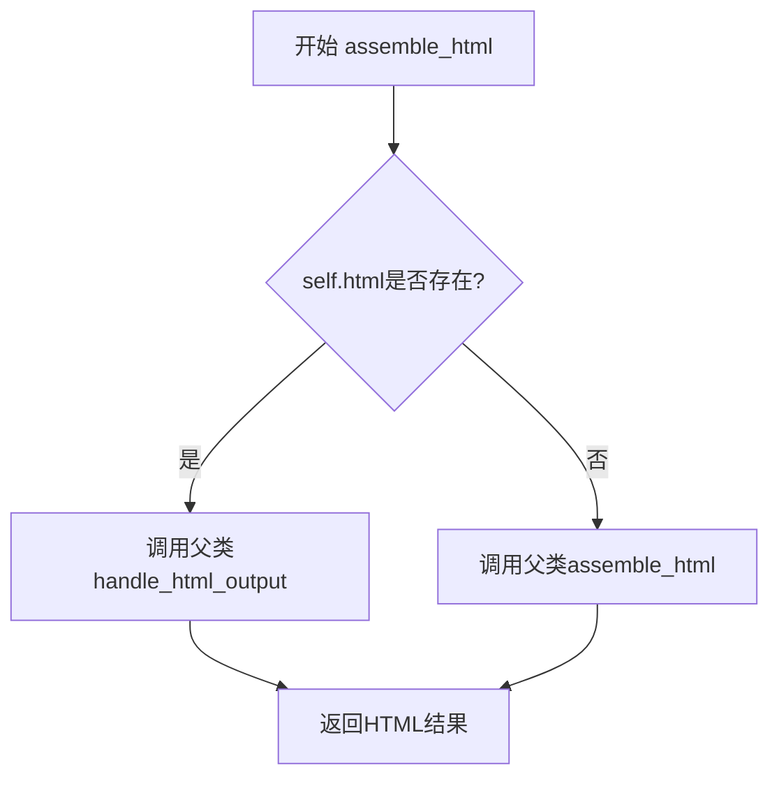
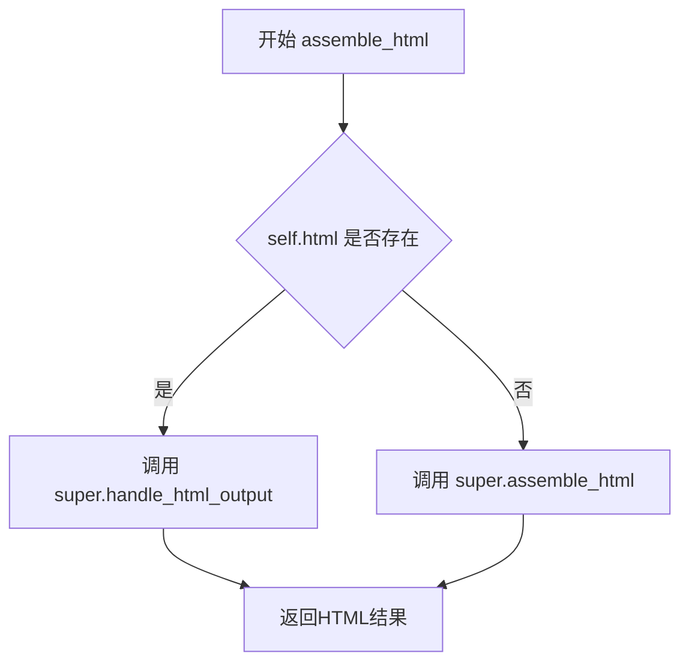

# `marker\marker\schema\blocks\footnote.py` 详细设计文档

该代码定义了一个Footnote类，用于表示文档中的脚注块，支持将脚注内容转换为HTML格式输出。如果提供了html属性，则使用自定义HTML处理；否则使用默认的assemble_html方法进行组装。

## 整体流程



## 类结构

```
Block (基类)
└── Footnote (脚注块类)
```

## 全局变量及字段


### `Footnote.block_type`
    
脚注的块类型，标识该块为Footnote类型，值为BlockTypes.Footnote

类型：`BlockTypes`
    


### `Footnote.block_description`
    
脚注的描述文本，用于说明脚注解释的术语或概念

类型：`str`
    


### `Footnote.replace_output_newlines`
    
布尔标志，控制是否在输出中替换换行符，默认为True

类型：`bool`
    


### `Footnote.html`
    
脚注的HTML内容，可选字段，若为None则由父类方法自动生成

类型：`str | None`
    
    

## 全局函数及方法


### `Footnote.assemble_html`

该方法用于生成脚注（Footnote）块的HTML输出。如果脚注对象已存在预生成的HTML内容（`self.html`），则调用父类的`handle_html_output`方法处理；否则调用父类的`assemble_html`方法进行默认组装。

参数：

- `document`：`Document`，用于构建输出文档的document对象
- `child_blocks`：`List[Block]`，包含该脚注块的子块列表
- `parent_structure`：`Dict`，表示父级结构的字典对象，包含层级关系和上下文信息
- `block_config`：`Optional[Dict]`，可选的块配置字典，用于自定义块的处理行为

返回值：`str`，返回组装后的HTML字符串

#### 流程图

```mermaid
flowchart TD
    A[开始 assemble_html] --> B{self.html 是否存在?}
    B -->|是| C[调用 super().handle_html_output]
    B -->|否| D[调用 super().assemble_html]
    C --> E[返回HTML字符串]
    D --> E
    E --> F[结束]
```

#### 带注释源码

```python
def assemble_html(
    self, document, child_blocks, parent_structure, block_config=None
):
    # 检查脚注对象是否已有预生成的HTML内容
    if self.html:
        # 如果html属性存在，调用父类的handle_html_output方法
        # 该方法专门处理已有HTML的输出场景
        return super().handle_html_output(
            document, child_blocks, parent_structure, block_config
        )

    # 如果没有预生成的HTML，则调用父类的默认assemble_html方法
    # 由父类Block类负责实际的HTML组装逻辑
    return super().assemble_html(
        document, child_blocks, parent_structure, block_config
    )
```

## 关键组件


### Footnote类

表示文档中的脚注块，用于解释文档中的术语或概念。继承自Block类，提供了脚注的HTML组装逻辑。

### block_type字段

类型为BlockTypes枚举，标识该块为脚注类型。用于在文档处理流程中识别和分类块类型。

### block_description字段

字符串类型，描述脚注块的用途。值为"A footnote that explains a term or concept in the document."，用于文档化和调试目的。

### replace_output_newlines字段

布尔类型，控制输出时是否替换换行符。设置为True，表示在输出时处理换行符转换。

### html字段

可选字符串类型，可存储预生成的HTML内容。如果存在则优先使用，否则调用父类方法组装。

### assemble_html方法

脚注的HTML组装方法。当实例存在html属性时，调用父类的handle_html_output方法；否则调用父类的assemble_html方法进行默认组装。实现了脚注HTML的惰性加载和定制输出逻辑。


## 问题及建议


### 已知问题

- **逻辑冗余**：在 `assemble_html` 方法中，无论 `self.html` 是否为 `None`，最终都调用了 `super()` 的方法。当 `self.html` 存在时调用 `handle_html_output`，不存在时调用 `assemble_html`，两者功能相似，逻辑分支意义不明确
- **未使用的类属性**：`replace_output_newlines` 类属性被定义但在代码中完全没有被使用
- **类型注解缺失**：方法参数 `document`、`child_blocks`、`parent_structure`、`block_config` 都没有类型注解，无法在编译时进行类型检查
- **参数 `block_config` 默认值不一致**：其他参数没有默认值，但 `block_config` 有默认值 `None`，设计不一致

### 优化建议

- 明确 `self.html` 存在时的处理逻辑，如果只是简单调用父类方法，可考虑移除条件分支或添加实际的自定义处理逻辑
- 移除未使用的 `replace_output_newlines` 属性，或在代码中实现其功能
- 为所有方法参数添加类型注解，提高代码可读性和类型安全
- 统一方法签名，要么都为参数设置默认值，要么都不设置

## 其它


### 设计目标与约束

- **设计目标**：为文档渲染系统提供脚注（Footnote）块的表示和处理能力，支持脚注的HTML组装和输出
- **约束条件**：
  - 必须继承自 `Block` 基类
  - `block_type` 必须为 `BlockTypes.Footnote`
  - `html` 属性为可选字段，存在时优先使用 `handle_html_output` 方法

### 错误处理与异常设计

- **异常处理机制**：代码中未显式定义异常处理，异常会向上传播至调用方
- **边界情况处理**：
  - 当 `self.html` 为 `None` 或空字符串时，调用父类的 `assemble_html` 方法
  - 当 `self.html` 存在时，调用 `handle_html_output` 方法

### 数据流与状态机

- **数据输入**：通过 `assemble_html` 方法接收 `document`、`child_blocks`、`parent_structure`、`block_config` 参数
- **数据处理流程**：
  1. 检查 `self.html` 是否存在
  2. 若存在，调用父类的 `handle_html_output` 方法
  3. 若不存在，调用父类的 `assemble_html` 方法
- **数据输出**：返回HTML渲染结果

### 外部依赖与接口契约

- **依赖模块**：
  - `marker.schema.BlockTypes`：用于定义块类型枚举
  - `marker.schema.blocks.Block`：基类，提供HTML组装的基础方法
- **接口契约**：
  - `assemble_html` 方法必须返回HTML字符串
  - 方法签名：`assemble_html(self, document, child_blocks, parent_structure, block_config=None)`
  - 返回值类型：继承自父类的返回值类型

### 类字段详细信息

| 字段名称 | 类型 | 描述 |
|---------|------|------|
| block_type | BlockTypes | 块类型，固定为 BlockTypes.Footnote |
| block_description | str | 块描述，说明脚注的用途 |
| replace_output_newlines | bool | 是否替换输出中的换行符，默认为 True |
| html | str \| None | 可选的HTML内容，用于自定义脚注渲染 |

### 类方法详细信息

#### assemble_html 方法

- **方法名称**：assemble_html
- **参数列表**：
  - `document`：参数类型未在代码中明确，参数描述：文档对象，用于组装HTML
  - `child_blocks`：参数类型未在代码中明确，参数描述：子块列表
  - `parent_structure`：参数类型未在代码中明确，参数描述：父结构信息
  - `block_config`：参数类型未在代码中明确，可选参数，参数描述：块配置信息
- **返回值类型**：继承自父类 Block.assemble_html
- **返回值描述**：组装后的HTML字符串
- **mermaid 流程图**：

- **带注释源码**：
```python
def assemble_html(
    self, document, child_blocks, parent_structure, block_config=None
):
    """
    组装脚注的HTML输出
    
    参数:
        document: 文档对象
        child_blocks: 子块列表
        parent_structure: 父结构信息
        block_config: 可选的块配置
    
    返回:
        组装后的HTML字符串
    """
    # 如果存在自定义HTML，则使用handle_html_output方法处理
    if self.html:
        return super().handle_html_output(
            document, child_blocks, parent_structure, block_config
        )

    # 否则使用默认的assemble_html方法
    return super().assemble_html(
        document, child_blocks, parent_structure, block_config
    )
```

### 关键组件信息

| 组件名称 | 一句话描述 |
|---------|-----------|
| BlockTypes | 枚举类型，定义文档中各种块的类型 |
| Block | 基类，提供块的基本属性和HTML组装方法 |

### 潜在的技术债务或优化空间

1. **逻辑冗余**：当前实现中，无论是 `self.html` 存在与否，最终都调用了父类的方法，可以考虑简化逻辑
2. **类型注解缺失**：方法参数 `document`、`child_blocks`、`parent_structure`、`block_config` 缺少类型注解，影响代码可读性和类型安全
3. **文档不完整**：类和方法缺少详细的文档字符串（docstring），不利于后续维护
4. **可扩展性有限**：当前只支持HTML输出，如需支持其他格式（如LaTeX、Markdown），需要进一步抽象

    