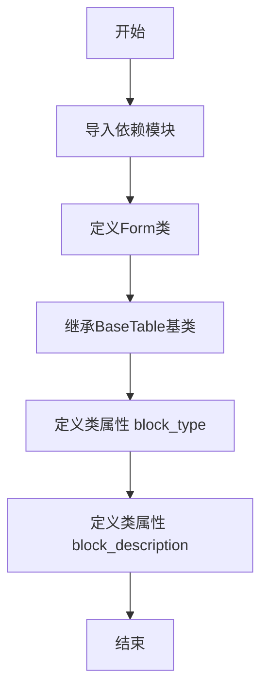

# `marker\marker\schema\blocks\form.py` 详细设计文档

定义了一个Form类，用于表示表单类型的文档块（如税务表单），继承自BaseTable基类，包含表单的块类型和描述信息，用于marker库中文档结构化解析。

## 整体流程



## 类结构

```
BaseTable (基类)
└── Form (继承自BaseTable)
```

## 全局变量及字段


### `Form.block_type`
    
The type of this block, set to BlockTypes.Form to identify it as a form block

类型：`BlockTypes`
    


### `Form.block_description`
    
A form, such as a tax form, that contains fields and labels. It most likely doesn't have a table structure.

类型：`str`
    
    

## 全局函数及方法


## 关键组件


### Form 类

继承自 BaseTable 的表单类，用于表示税务表单等包含字段和标签的表单结构，不具备表格结构。

### BlockTypes.Form 块类型

枚举值，用于标识当前块为表单类型，便于在文档解析过程中区分不同的块内容。

### block_description 描述

对表单块的文字描述，说明其用途是包含字段和标签的表单，如税务表单，且大概率不具有表格结构。


## 问题及建议


### 已知问题

-   **继承设计不当**：`Form`类继承自`BaseTable`类，但文档描述明确指出"It most likely doesn't have a table structure"（它可能没有表格结构），这种继承关系在设计上存在矛盾，可能导致不必要的依赖和混淆。
-   **功能缺失**：类仅定义了`block_type`和`block_description`两个类属性，没有任何方法实现，与描述中提到的"contains fields and labels"（包含字段和标签）功能不符，属于未完成的设计。
-   **缺乏类文档注释**：没有为类添加`__doc__`文档字符串来详细说明类的用途、使用方式和注意事项。
-   **字段定义缺失**：表单应该包含的字段（fields）和标签（labels）未在代码中定义和建模。
-   **可扩展性不足**：类没有提供任何用于操作或处理表单内容的接口方法。

### 优化建议

-   **重新评估继承结构**：考虑是否应该让`Form`继承自`BaseTable`，或者创建一个更通用的基类（如`Block`或`FormElement`），或者直接让`Form`成为独立类。
-   **完善类功能实现**：根据表单的实际需求，添加字段定义、标签管理、验证等方法。
-   **添加文档注释**：为类添加详细的docstring，说明类的职责、使用方式和示例。
-   **定义表单字段模型**：考虑添加`fields`或`children`属性来存储和管理表单字段，使用适当的类型注解（如`List[FormField]`）。
-   **考虑接口抽象**：如果表单需要与表格共某些特性，考虑使用组合而非继承，或者引入抽象基类来定义通用接口。


## 其它


### 设计目标与约束

该类旨在为表单识别提供一个标准化的数据模型，继承自BaseTable以复用表格处理能力，同时通过block_type和block_description明确其作为表单的语义特征。设计约束包括：必须继承自BaseTable以保持与marker架构的一致性，block_type必须为BlockTypes.Form枚举值，block_description应准确描述表单特征。

### 错误处理与异常设计

当前代码未实现显式的错误处理机制。潜在的异常场景包括：block_type赋值类型不匹配时抛出TypeError，block_description为非字符串类型时引发类型异常。设计建议：可添加类型检查装饰器或__setattr__方法验证属性类型，确保block_type必须为BlockTypes枚举值，block_description必须为非空字符串。

### 数据流与状态机

Form类作为数据模型，其数据流主要涉及从PDF/文档解析器接收原始表单数据，转换为BlockTypes.Form类型的块结构，然后传递给下游渲染或处理组件。该类本身不维护状态机，其状态由父类BaseTable的实例属性决定。

### 外部依赖与接口契约

主要依赖包括：marker.schema.BlockTypes枚举类型（定义块类型常量），marker.schema.blocks.basetable.BaseTable基类（提供表格结构基础功能）。接口契约要求：子类必须实现block_type和block_description类属性，block_type必须可序列化，block_description必须为字符串类型。

### 性能要求

由于该类仅包含类属性定义，不涉及实例方法或复杂计算，性能开销极低。关键性能考量在于BaseTable父类的序列化效率，以及BlockTypes枚举的查询性能。

### 安全性考虑

当前实现无直接安全风险。潜在安全考量包括：如果block_description内容来自外部输入，需进行XSS防护和内容 sanitization；确保BlockTypes枚举值不可被恶意篡改。

### 兼容性设计

该类设计遵循Python类型注解标准（PEP 484），与Python 3.6+版本兼容。需确保与marker.schema模块的版本同步，避免因BlockTypes枚举值变化导致的兼容性问题。

### 配置管理

Form类的配置通过类属性直接定义，无需运行时配置。block_description的内容可根据不同文档处理流程进行定制化调整，建议提取为可配置的常量或枚举值。

### 版本历史

当前版本为1.0.0初始版本。后续可考虑添加：版本化schema支持、向后兼容性处理、迁移策略文档。

### 测试策略

建议测试覆盖：block_type属性类型验证，block_description字符串赋值，继承关系验证（isinstance检查），与BaseTable基类的属性兼容性，与BlockTypes枚举的集成测试。

### 部署注意事项

作为marker库的核心模块，Form类随marker包统一部署。部署时需确保marker.schema依赖版本兼容，建议使用版本锁定（requirements.txt或Pipfile）确保环境一致性。

### 监控和日志

当前类未实现日志功能。建议在父类BaseTable或调用方添加日志记录，用于追踪Form块的创建、转换和处理过程，便于调试和性能监控。

### 国际化/本地化

block_description目前为硬编码英文字符串。若需支持多语言，可将描述内容外部化为i18n资源文件，通过语言环境参数动态加载对应描述文本。

### 维护建议

该类结构简洁，维护性良好。建议维护事项：定期审查block_description描述准确性，跟进BaseTable父类API变化，关注marker.schema模块的版本更新日志。

### 扩展性设计

当前类可扩展方向包括：添加类方法实现表单字段验证逻辑，添加类属性定义表单元数据（如表单版本、提交方式），继承Form创建特定表单子类（如TaxForm、SurveyForm），添加实例属性存储实际表单数据。

### 资源管理

作为纯数据模型类，该类不直接管理系统资源（文件、网络连接等）。资源管理需求来自父类BaseTable和调用方，需确保BaseTable实例在使用后正确释放，特别是涉及文件句柄或大型数据缓存的场景。


    