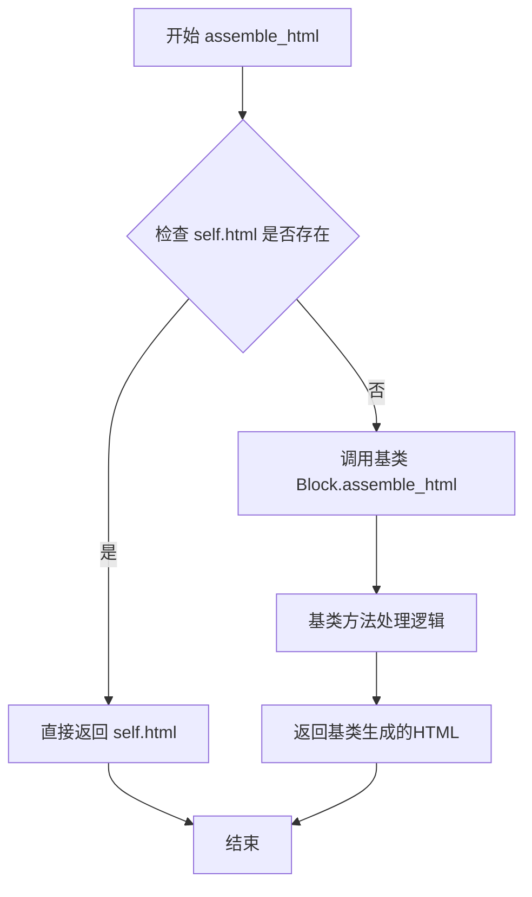

# `marker\marker\schema\blocks\handwriting.py` 详细设计文档

这是一个手写区域块的实现类，继承自Block基类，用于表示PDF或文档中的手写内容区域，支持自定义HTML输出或通过父类方法自动生成HTML。

## 整体流程

```mermaid
graph TD
    A[实例化Handwriting对象] --> B{self.html是否存在?}
    B -- 是 --> C[返回self.html]
    B -- 否 --> D[调用super().assemble_html()]
    D --> E[返回父类生成的HTML]
    C --> F[结束]
    E --> F
```

## 类结构

```
Block (基类)
└── Handwriting (手写区域块)
```

## 全局变量及字段


### `BlockTypes`
    
从marker.schema导入的枚举类型，用于标识不同块类型

类型：`Enum`
    


### `Block`
    
从marker.schema.blocks导入的基类，用于定义块的通用结构和方法

类型：`Class`
    


### `Handwriting.block_type`
    
块类型标识，固定为BlockTypes.Handwriting

类型：`BlockTypes`
    


### `Handwriting.block_description`
    
块描述，说明为'包含手写内容的区域'

类型：`str`
    


### `Handwriting.html`
    
可选的HTML内容，用于自定义输出

类型：`str | None`
    


### `Handwriting.replace_output_newlines`
    
是否替换输出中的换行符，默认为True

类型：`bool`
    
    

## 全局函数及方法


### `Handwriting.assemble_html`

该方法用于组装并返回手写块（Handwriting）的HTML表示。如果当前手写块已经存在预定义的HTML内容，则直接返回该HTML；否则调用父类的`assemble_html`方法生成HTML。

参数：

- `self`：`Handwriting`，当前Handwriting实例对象
- `document`：`Any`，文档对象，包含文档的上下文信息
- `child_blocks`：`List[Block]`，子块列表，包含当前块的所有子块
- `parent_structure`：`Dict`，父结构信息，包含父块的层级和属性信息
- `block_config`：`Dict | None`，块配置字典，可选参数，用于自定义块的处理行为

返回值：`str`，返回组装后的HTML字符串表示

#### 流程图

```mermaid
flowchart TD
    A[开始 assemble_html] --> B{self.html 是否存在?}
    B -->|是| C[返回 self.html]
    B -->|否| D[调用父类 super().assemble_html]
    D --> E[返回父类生成的HTML]
    C --> F[结束]
    E --> F
```

#### 带注释源码

```python
def assemble_html(
    self, document, child_blocks, parent_structure, block_config=None
):
    """
    组装并返回该块的HTML表示
    
    参数:
        document: 文档对象，包含文档的上下文信息
        child_blocks: 子块列表，包含当前块的所有子块
        parent_structure: 父结构信息，包含父块的层级和属性信息
        block_config: 可选的块配置字典，用于自定义块的处理行为
    
    返回:
        str: HTML字符串表示
    """
    # 检查当前手写块是否已经有预定义的HTML内容
    if self.html:
        # 如果存在预定义HTML，直接返回该HTML
        return self.html
    else:
        # 如果没有预定义HTML，调用父类的assemble_html方法
        # 父类会按照默认逻辑处理块到HTML的转换
        return super().assemble_html(
            document, child_blocks, parent_structure, block_config
        )
```


### `Block.assemble_html`

基类 `Block` 的 `assemble_html` 方法是用于将文档块（Block）组装成HTML表示的核心方法。`Handwriting` 类通过 `super().assemble_html(...)` 调用此方法，当 `Handwriting` 实例没有预设的 `html` 属性时，回退到基类的默认实现来生成HTML内容。

参数：

- `document`：类型未在调用处明确，通常为文档对象，表示整个文档的上下文
- `child_blocks`：类型未明确，通常为列表，表示当前块的子块集合
- `parent_structure`：类型未明确，通常为结构化对象，表示父级结构信息
- `block_config`：可选，类型未明确，默认为 `None`，表示块配置信息

返回值：字符串（`str`），返回组装后的HTML内容

#### 流程图



#### 带注释源码

```python
def assemble_html(
    self, document, child_blocks, parent_structure, block_config=None
):
    """
    将当前文档块组装成HTML表示
    
    参数:
        document: 文档对象，包含文档的全局信息
        child_blocks: 子块列表，当前块的子元素
        parent_structure: 父级结构信息，用于维护文档层级关系
        block_config: 可选的块配置，用于自定义HTML生成行为
    
    返回:
        str: 生成的HTML字符串
    """
    if self.html:
        # 如果当前块已经预设了html属性，直接返回
        # 这是Handwriting类的优化：如果有预定义的html就不需要再组装
        return self.html
    else:
        # 如果没有预设html，则调用基类的默认实现
        # 基类Block的assemble_html会遍历child_blocks并组装HTML
        return super().assemble_html(
            document, child_blocks, parent_structure, block_config
        )
```

## 关键组件


### BlockTypes 枚举

定义文档中所有可能的块类型，包括 Handwriting 类型，用于标识不同内容区域的分类。

### Block 基类

提供所有内容块的基础实现，包含通用的 assemble_html 方法和块结构处理逻辑，Handwriting 类继承此基类以获得通用功能。

### block_type 字段

类型：BlockTypes

标识当前块的类型为 Handwriting，用于渲染器和处理器识别和处理特定类型的内容块。

### block_description 字段

类型：str

描述当前块的功能为"包含手写内容的区域"，用于文档生成和调试目的。

### html 字段

类型：str | None

可选字段，存储预渲染的 HTML 内容。当存在时直接返回该内容，实现惰性加载模式，避免重复计算。

### replace_output_newlines 字段

类型：bool

配置标志，控制输出时是否替换换行符，默认为 True，影响 HTML 组装时的文本处理行为。

### assemble_html 方法

参数：
- document: 文档对象
- child_blocks: 子块列表
- parent_structure: 父结构信息
- block_config: 可选的块配置

返回值：str

HTML 组装方法，首先检查是否存在预渲染的 html 属性，若存在则直接返回，否则调用父类的 assemble_html 方法实现默认逻辑。


## 问题及建议


### 已知问题

-   **类型注解兼容性**：使用 `str | None` 语法要求 Python 3.10+，对更低版本不兼容
-   **未使用的参数**：`assemble_html` 方法的参数 `document`、`child_blocks`、`parent_structure`、`block_config` 在 `self.html` 存在时未被使用，可能导致调用时的性能开销
-   **硬编码配置**：`replace_output_newlines = True` 作为类属性硬编码，无法通过实例或配置进行动态调整
-   **缺少文档字符串**：类和方法均缺少文档字符串，降低了代码可读性和可维护性
-   **重复定义类属性**：`block_type` 和 `block_description` 在每个 Block 子类中重复定义，违反了 DRY 原则
-   **逻辑冗余**：当 `self.html` 存在时仍然接收参数并传递到父类，产生不必要的计算

### 优化建议

-   考虑使用 `Optional[str]` 替代 `str | None` 以兼容更低版本的 Python，或在项目中明确 Python 版本要求
-   为类和方法添加文档字符串，说明用途、参数和返回值
-   将 `replace_output_newlines` 改为可配置的参数或从 `block_config` 中读取
-   使用 `if self.html is not None:` 替代 `if self.html:` 以区分空字符串和 None 的语义
-   在参数未使用时添加 `_` 前缀（如 `_document`）表明有意忽略，减少静态分析工具警告
-   考虑将 `block_type` 和 `block_description` 提升到基类 `Block` 中统一管理，或使用元类/装饰器自动生成

## 其它


### 设计目标与约束

本类旨在为OCR文档处理系统提供手写内容区域的标准化表示能力，继承自基类Block并扩展HTML组装功能。设计约束包括：必须保持与Block基类的兼容性，html字段为可选值，当未提供时回退到父类实现。

### 错误处理与异常设计

当前实现未显式处理异常情况。潜在错误场景包括：document参数为None时调用父类方法可能抛出AttributeError；child_blocks或parent_structure参数类型不匹配时可能导致运行时错误。建议添加参数类型检查和默认值处理逻辑。

### 数据流与状态机

Handwriting对象在文档解析流程中的状态转换：初始化状态（block_type和block_description设置）→ HTML组装状态（调用assemble_html方法）→ 最终输出状态（返回HTML字符串或None）。数据流方向：输入参数(document, child_blocks, parent_structure, block_config) → 处理逻辑 → 输出HTML字符串。

### 外部依赖与接口契约

主要依赖包括：marker.schema.BlockTypes枚举（定义block_type类型）、marker.schema.blocks.Block基类（提供assemble_html默认实现）。接口契约：assemble_html方法必须返回字符串类型或None，document对象必须具有父类assemble_html方法所需的属性和接口。

### 性能考虑

当前实现为懒加载模式，仅在html字段为空时才调用父类方法，理论上具有较好的性能。但每次调用都会执行super()方法查找，建议缓存父类组装结果以优化频繁调用场景。

### 安全性考虑

html字段直接作为输出使用，存在XSS风险。若html内容来源于用户输入或外部OCR结果，建议在assemble_html方法中添加HTML转义或内容净化逻辑。

### 可扩展性设计

当前通过继承Block类实现，符合开闭原则。扩展方向包括：添加自定义渲染逻辑、集成OCR置信度信息、支持多种输出格式（JSON、XML等）。建议使用策略模式分离不同类型Block的渲染逻辑。

### 测试考虑

建议覆盖以下测试场景：html字段为None时的父类方法调用、html字段有值时的直接返回、与其他Block类型组合使用时的兼容性、异常参数传递时的错误处理。

### 版本兼容性

当前代码使用了Python 3.10+的联合类型语法（str | None），要求运行时Python版本不低于3.10。Block基类的接口变更可能影响本类的功能，需要在版本升级时进行回归测试。

### 配置管理

block_config参数目前未被使用，属于预留接口。建议在文档中明确其预期用途，或移除以避免代码混淆。

### 资源管理

本类不直接管理文件、网络连接等资源，无显式的资源释放需求。但若后续扩展涉及资源访问，建议实现上下文管理器协议或添加显式的资源清理方法。

### 并发考虑

assemble_html方法未包含共享状态修改，理论上为线程安全。但若document对象本身非线程安全，在多线程环境下调用可能产生竞态条件。

### 日志与监控

当前实现无日志记录。建议在关键路径（html字段为空调用父类方法、返回结果为空等）添加日志记录，便于生产环境问题排查和性能监控。

### 国际化/本地化

block_description字段为固定英文字符串，若需支持多语言，建议引入国际化框架或使用配置驱动的方式管理描述文本。

### 部署相关

本类作为marker库的一部分部署，无独立的部署配置需求。依赖项包括：marker.schema模块、Python 3.10+运行环境。建议在项目依赖文件中明确版本约束。


    