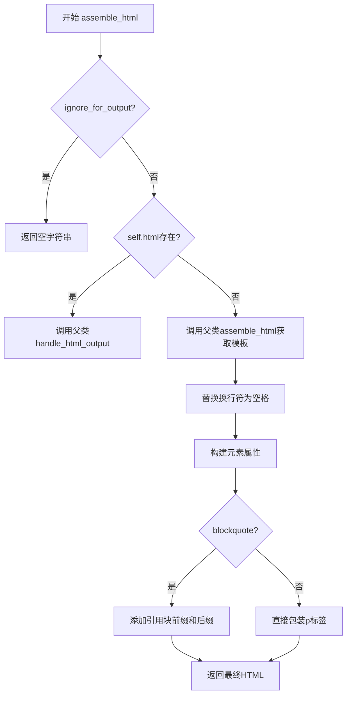
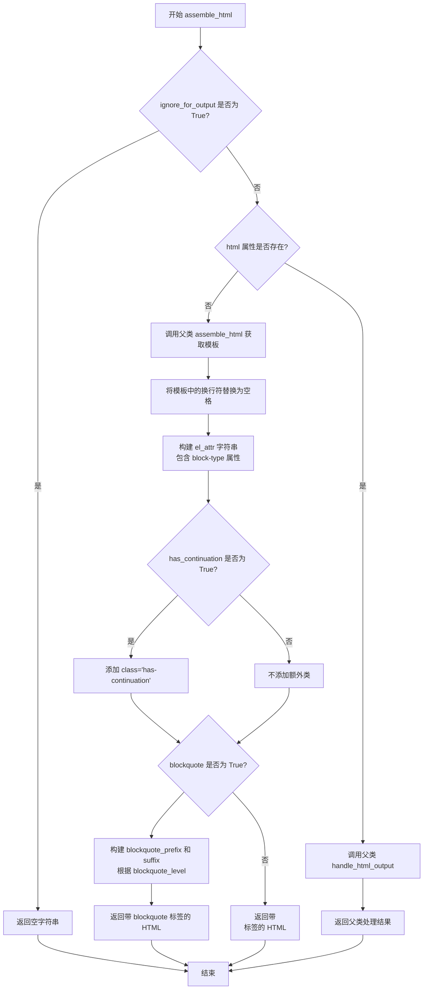

# `marker\marker\schema\blocks\inlinemath.py` 详细设计文档

一个用于处理内联数学公式的文本块类，继承自Block基类，负责将包含数学公式的文本转换为HTML格式输出，支持引用块嵌套和连续块的处理。

## 整体流程



## 类结构

```
Block (基类)
└── InlineMath
```

## 全局变量及字段


### `InlineMath.block_type`
    
块类型标识，用于标识当前块为内联数学文本块

类型：`BlockTypes`
    


### `InlineMath.has_continuation`
    
标记是否有续篇内容，用于指示该块是否包含连续内容

类型：`bool`
    


### `InlineMath.blockquote`
    
标记是否为引用块，用于指示当前块是否属于引用内容

类型：`bool`
    


### `InlineMath.blockquote_level`
    
引用块的嵌套层级，用于表示引用块的深度

类型：`int`
    


### `InlineMath.block_description`
    
块的描述信息，用于说明该块为包含内联数学的文本块

类型：`str`
    


### `InlineMath.html`
    
HTML内容或None，用于存储预渲染的HTML或为None时自动生成

类型：`str | None`
    
    

## 全局函数及方法


### `InlineMath.assemble_html`

该方法用于将内联数学块组装成HTML输出，处理换行符替换、blockquote嵌套层级、块类型属性添加等逻辑，并返回最终渲染的HTML字符串。

参数：

- `self`：`InlineMath`，InlineMath类的实例对象
- `document`：`Any`，文档对象，用于传递给父类方法处理
- `child_blocks`：`List[Block]`，子块列表，包含该内联数学块的所有子块
- `parent_structure`：`Dict`，父结构字典，包含父块的层级和结构信息
- `block_config`：`Dict | None`，可选配置字典，用于自定义块的处理行为，默认值为 `None`

返回值：`str`，返回组装完成的HTML字符串，如果 `ignore_for_output` 为 `True` 则返回空字符串

#### 流程图



#### 带注释源码

```python
def assemble_html(
    self, document, child_blocks, parent_structure, block_config=None
):
    # 检查是否需要忽略该块用于输出
    # 如果 ignore_for_output 为 True，则直接返回空字符串，不生成任何 HTML
    if self.ignore_for_output:
        return ""

    # 如果 html 属性已存在（预渲染的 HTML），则调用父类的 handle_html_output 方法处理
    if self.html:
        return super().handle_html_output(
            document, child_blocks, parent_structure, block_config
        )

    # 调用父类的 assemble_html 方法获取基础模板
    # 该模板包含了子块的 HTML 内容
    template = super().assemble_html(
        document, child_blocks, parent_structure, block_config
    )

    # 将模板中的换行符替换为空格
    # 避免在 <p> 或 <blockquote> 标签内产生换行，影响 HTML 渲染效果
    template = template.replace("\n", " ")

    # 构建元素的属性字符串，包含 block-type 属性用于标识块的类型
    el_attr = f" block-type='{self.block_type}'"

    # 如果 has_continuation 为 True，添加 has-continuation CSS 类
    # 用于标识该块是否有后续内容（如跨行的公式）
    if self.has_continuation:
        el_attr += " class='has-continuation'"

    # 检查是否为块引用（blockquote）
    if self.blockquote:
        # 根据 blockquote_level 生成对应数量的 <blockquote> 标签
        # 用于实现嵌套的块引用层级结构
        blockquote_prefix = "<blockquote>" * self.blockquote_level
        blockquote_suffix = "</blockquote>" * self.blockquote_level
        # 返回带有块引用包装的 HTML 段落
        return f"{blockquote_prefix}<p{el_attr}>{template}</p>{blockquote_suffix}"
    else:
        # 返回普通的 HTML 段落，不包含块引用标签
        return f"<p{el_attr}>{template}</p>"
```

## 关键组件


### InlineMath 类

处理包含内联数学公式的文本块的类，继承自 Block 类，负责将内联数学内容转换为 HTML 输出。

### block_type 字段

类型：BlockTypes，标识该块为内联数学类型（TextInlineMath），用于区分普通文本和其他特殊块。

### has_continuation 字段

类型：bool，表示该内联数学块是否有续行内容，用于添加 has-continuation CSS 类。

### blockquote 字段

类型：bool，标识该块是否处于引用块上下文中，决定是否添加块引用标签。

### blockquote_level 字段

类型：int，表示引用块的嵌套层级，用于生成对应层级的 HTML 块引用标签。

### html 字段

类型：str | None，预渲染的 HTML 内容，如果存在则优先使用父类方法处理。

### assemble_html 方法

负责将内联数学块组装成 HTML 输出的核心方法，处理换行符替换、属性设置、引用块包装等逻辑。

### super().assemble_html 调用

调用父类方法获取基础模板，实现代码复用和模板继承机制。

### super().handle_html_output 调用

当 html 字段存在时调用，处理预渲染 HTML 输出的回退逻辑。


## 问题及建议


### 已知问题

-   **类型不一致风险**：`block_type` 声明为 `BlockTypes.TextInlineMath`，但类名是 `InlineMath`，这种命名不一致可能导致维护困难
-   **类型注解缺失**：`assemble_html` 方法的参数 `document`, `child_blocks`, `parent_structure`, `block_config` 缺少类型注解，影响代码可读性和类型安全
-   **字符串拼接效率**：使用 `+` 拼接字符串构建 HTML，在处理大量块或深层嵌套时可能存在性能问题
-   **父类依赖性强**：代码高度依赖 `super()` 调用父类方法 (`assemble_html`, `handle_html_output`)，父类实现变化可能导致当前类行为不可预测
-   **硬编码字符串**：`block_description` 作为类属性存储长字符串，占用内存且缺乏灵活性
-   **异常处理缺失**：`assemble_html` 方法中没有异常处理机制，如果父类方法抛出异常会导致整个流程中断
-   **逻辑复杂度**：`assemble_html` 方法包含多个条件分支（`ignore_for_output`, `html`, `blockquote` 等），违反单一职责原则
-   **未使用的属性**：`html` 属性声明但未在当前代码中看到明确的设置逻辑，可能存在遗留代码

### 优化建议

-   为所有方法参数添加明确的类型注解，提高代码可维护性
-   考虑使用 `f-string` 或模板引擎（如 Jinja2）替代字符串拼接，提高性能和可读性
-   将 `assemble_html` 方法拆分为多个职责单一的小方法，如 `_build_attributes()`, `_build_blockquote_wrapper()` 等
-   为关键方法添加文档字符串和异常处理逻辑
-   考虑使用 `@property` 装饰器动态计算属性值，而非硬编码类属性
-   添加单元测试覆盖边界情况，如空字符串、多层嵌套 blockquote 等

## 其它


### 设计目标与约束

本类的主要设计目标是将内联数学公式转换为HTML格式，支持多种渲染场景。设计约束包括：仅处理内联数学公式（不处理斜体文本或引用），通过继承机制复用父类的HTML组装逻辑，支持块引用（blockquote）的嵌套层级处理，以及保持HTML输出的语义化结构。

### 错误处理与异常设计

本类的错误处理主要依赖于父类Block的异常传播机制。当`ignore_for_output`为True时，直接返回空字符串，避免无效渲染。如果`html`属性存在，则调用父类的`handle_html_output`方法处理，该方法内部包含异常捕获逻辑。对于模板替换操作，使用Python内置的字符串方法，不会抛出异常。块引用层级（blockquote_level）默认为0，支持非负整数值。

### 数据流与状态机

数据流首先检查输出忽略标志，然后判断是否存在预渲染的HTML。若存在预渲染HTML，则交给父类处理；否则执行模板组装流程。状态转换路径包括：忽略输出状态（直接返回空）→ 预HTML处理状态（父类处理）→ 模板组装状态 → 属性构建状态（block_type和has_continuation）→ blockquote处理状态（根据blockquote标志分支）→ 最终HTML输出。

### 外部依赖与接口契约

本类依赖以下外部组件：marker.schema.BlockTypes枚举（定义块类型）、marker.schema.blocks.Block基类（提供HTML组装的基础方法）、document对象（文档上下文）、child_blocks子块列表、parent_structure父级结构、block_config块配置对象。接口契约要求：assemble_html方法必须返回字符串类型的HTML片段，document对象需实现handle_html_output方法，block_config参数可为None。

### 性能考虑

性能优化点包括：使用字符串的replace方法进行换行符替换（O(n)复杂度），避免不必要的对象创建。潜在性能瓶颈在于模板字符串的多次拼接操作，当处理大量内联数学公式时可考虑使用字符串缓冲区或列表join方式优化。blockquote_prefix和blockquote_suffix的重复构建可考虑缓存机制。

### 安全性考虑

本类输出的HTML属性使用单引号包裹（`block-type='{self.block_type}'`），需要在调用前确保block_type的值已经过安全转义，防止XSS攻击。has-continuation类名的添加是可信的内部逻辑。blockquote层级应该设置上限防止恶意深度嵌套攻击，建议在文档解析层进行层级限制验证。

### 测试策略

应覆盖的测试场景包括：常规内联数学公式HTML组装、带has-continuation标志的渲染、带blockquote的层级渲染、ignore_for_output为True的跳过逻辑、预HTML存在时的父类调用、换行符替换为空格的功能、多层blockquote嵌套渲染、无blockquote时的p标签包裹输出。

### 配置与可扩展性

block_config参数用于传递块级配置，支持未来扩展不同的渲染策略。has_continuation和blockquote相关属性表明该类支持状态化的渲染需求。可以通过继承本类并重写assemble_html方法来支持不同的HTML输出格式，如LaTeX或Markdown。blockquote_level的整型设计支持最多2^31-1层嵌套，实际应用应设置合理上限。

    