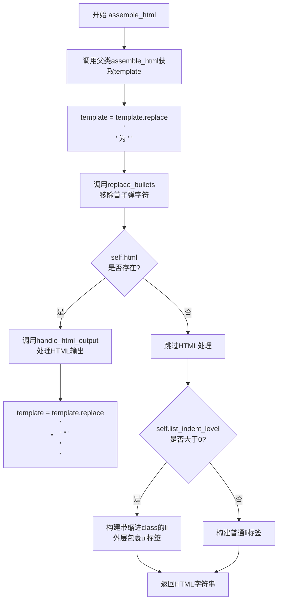
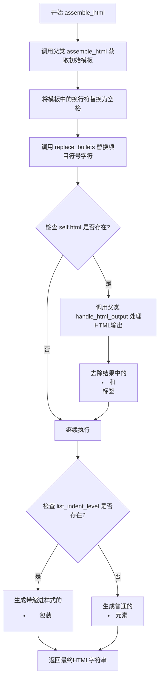
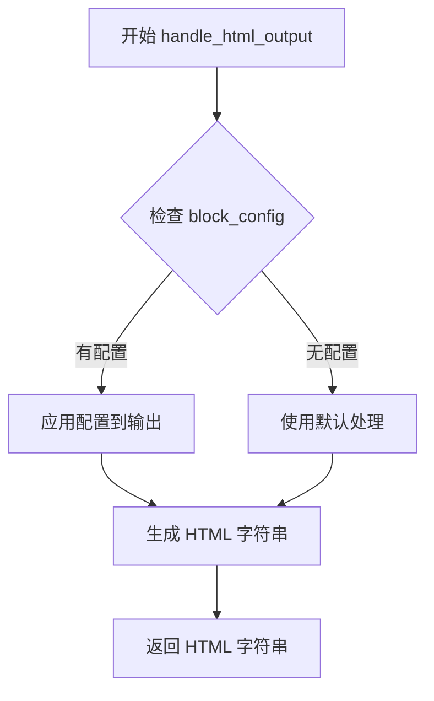

# `marker\marker\schema\blocks\listitem.py` 详细设计文档

该代码是marker库中用于将文档列表项(ListItem)转换为HTML格式的处理模块，主要实现了列表项的HTML组装逻辑，包括调用父类方法、处理子块、替换项目符号字符、以及根据缩进级别生成不同格式的<ul>/<li>标签。

## 整体流程

```mermaid
graph TD
    A[assemble_html调用] --> B[调用父类assemble_html]
B --> C[替换换行符为空格]
C --> D[调用replace_bullets处理项目符号]
D --> E{self.html是否存在?}
E -- 是 --> F[调用handle_html_output处理HTML]
E -- 否 --> G[跳过HTML处理]
F --> H[去除<li>标签]
G --> I{list_indent_level > 0?}
I -- 是 --> J[返回<ul><li>带缩进样式]
I -- 否 --> K[返回<li>无缩进]
J --> L[结束]
K --> L

graph TD
    A[replace_bullets调用] --> B{child_blocks长度 > 0?}
B -- 否 --> C[返回空]
B -- 是 --> D[取第一个块]
D --> E[递归获取子块 children]
E --> F{找到Line类型块?}
F -- 是 --> G[执行正则替换项目符号]
F -- 否 --> H[继续递归]
G --> I[结束]
H --> B
```

## 类结构

```
Block (基类)
└── ListItem (列表项块类)
```

## 全局变量及字段


### `child_blocks`
    
子块列表，包含用于处理的子块元素

类型：`list`
    


### `first_block`
    
第一个块，递归获取子块后的最底层块

类型：`Block | None`
    


### `bullet_pattern`
    
正则表达式项目符号匹配模式，用于识别各种样式的列表项目符号

类型：`str`
    


### `template`
    
HTML模板字符串，用于存储生成的HTML内容

类型：`str`
    


### `el_attr`
    
HTML元素属性字符串，包含块类型和可能的缩进类信息

类型：`str`
    


### `ListItem.block_type`
    
块类型，固定为BlockTypes.ListItem，表示这是一个列表项块

类型：`BlockTypes`
    


### `ListItem.list_indent_level`
    
列表缩进级别，用于表示列表项的嵌套深度

类型：`int`
    


### `ListItem.block_description`
    
块描述信息，描述该块为列表中的一个列表项

类型：`str`
    


### `ListItem.html`
    
HTML内容，可选的预定义HTML内容字段

类型：`str | None`
    
    

## 全局函数及方法


### `replace_bullets`

该函数用于在HTML渲染前将列表项的第一个块中的各种项目符号字符（如 •、●、○ 等）替换为普通连字符"-"，以统一列表项的渲染格式。

参数：

- `child_blocks`：`list`，包含子块的列表，函数会遍历该列表找到第一个`Line`类型的块

返回值：`None`，该函数直接修改`first_block.html`属性，不返回任何值

#### 流程图

```mermaid
flowchart TD
    A[开始] --> B[初始化 first_block = None]
    B --> C{child_blocks 长度 > 0?}
    C -->|是| D[取 child_blocks[0] 作为 first_block]
    D --> E[将 first_block.children 赋值给 child_blocks]
    E --> C
    C -->|否| F{first_block 不为 None?}
    F -->|否| K[结束]
    F -->|是| G{first_block.id.block_type == BlockTypes.Line?}
    G -->|否| K
    G -->|是| H[定义项目符号正则模式]
    H --> I[使用 re.sub 替换项目符号为 -]
    I --> K
```

#### 带注释源码

```python
def replace_bullets(child_blocks):
    # Replace bullet characters with a -
    # 初始化 first_block 为 None，用于存储找到的第一个块
    first_block = None
    # 循环遍历 child_blocks，逐层向下找到最底层的子块
    while len(child_blocks) > 0:
        # 取列表中的第一个块
        first_block = child_blocks[0]
        # 将当前块的 children 赋值给 child_blocks，继续向下遍历
        child_blocks = first_block.children

    # 如果找到了块且该块是 Line 类型
    if first_block is not None and first_block.id.block_type == BlockTypes.Line:
        # 定义正则表达式模式，匹配各种项目符号字符：
        # • ● ○ ഠ ം ◦ ■ ▫ – — 以及常见的连字符变体
        # 匹配位置：行首、换行符后、空格后、HTML标签内
        bullet_pattern = r"(^|[\n ]|<[^>]*>)[•●○ഠ ം◦■▪▫–—-]( )"
        # 将匹配到的项目符号替换为普通连字符和空格
        first_block.html = re.sub(bullet_pattern, r"\1\2", first_block.html)
```


### `ListItem.assemble_html`

该方法负责将列表项块组装成HTML表示，通过调用父类方法获取基础模板，处理换行符和子弹字符，并根据 `list_indent_level` 属性决定是否添加 `<ul>` 包装层，最终返回格式化的HTML列表项字符串。

参数：

- `document`：`Any`，文档对象，用于处理和渲染文档内容
- `child_blocks`：`List[Block]`，子块列表，包含列表项的子块元素
- `parent_structure`：`Dict`，父结构信息，描述列表项的父级结构
- `block_config`：`Optional[Dict]`，块配置（可选），用于自定义块渲染行为的配置参数

返回值：`str`，返回组装完成的HTML列表项字符串，包含适当的 `<li>` 和可选的 `<ul>` 标签包装

#### 流程图



#### 带注释源码

```python
def assemble_html(
    self, document, child_blocks, parent_structure, block_config=None
):
    # 1. 调用父类Block的assemble_html方法获取基础HTML模板
    template = super().assemble_html(
        document, child_blocks, parent_structure, block_config
    )
    
    # 2. 将模板中的换行符替换为空格，避免HTML中出现多余换行
    template = template.replace("\n", " ")
    
    # 3. 调用replace_bullets函数移除列表项开头的子弹字符（如•●○等）
    replace_bullets(child_blocks)

    # 4. 检查self.html是否存在；若存在则使用handle_html_output处理
    if self.html:
        # 调用父类方法处理HTML输出，并去除首尾空白
        template = (
            super()
            .handle_html_output(
                document, child_blocks, parent_structure, block_config
            )
            .strip()
        )
        # 移除自动生成的<li>标签，以便重新包装
        template = template.replace("<li>", "").replace("</li>", "")

    # 5. 构建block-type属性
    el_attr = f" block-type='{self.block_type}'"
    
    # 6. 根据list_indent_level决定是否添加<ul>外层包装
    if self.list_indent_level:
        # 返回带有缩进class的列表项，外层包裹<ul>
        return f"<ul><li{el_attr} class='list-indent-{self.list_indent_level}'>{template}</li></ul>"
    
    # 7. 返回普通的列表项<li>标签
    return f"<li{el_attr}>{template}</li>"
```


### `ListItem.assemble_html`

该方法负责将列表项块（ListItem）组装成HTML表示形式。它首先调用父类的 assemble_html 方法获取模板，然后处理换行符、替换项目符号，并根据 list_indent_level 属性决定是否添加带有缩进样式的 `<ul>` 包装器。

参数：

- `self`：`ListItem`，当前列表项实例
- `document`：`Document`，文档对象，用于处理文档级别的操作
- `child_blocks`：`List[Block]`，子块列表，包含列表项的子元素
- `parent_structure`：`Dict`，父级结构信息，描述列表项在文档层级中的位置
- `block_config`：`Optional[Dict]`，块配置选项，可选的配置参数，默认为 None

返回值：`str`，返回生成的HTML字符串，包含列表项的完整HTML表示

#### 流程图



#### 带注释源码

```python
def assemble_html(
    self, document, child_blocks, parent_structure, block_config=None
):
    # 调用父类 Block 的 assemble_html 方法，获取基础HTML模板
    # document: 文档对象，用于处理文档上下文
    # child_blocks: 子块列表，包含列表项的子元素
    # parent_structure: 父级结构信息，描述在文档层级中的位置
    # block_config: 可选的块配置参数
    template = super().assemble_html(
        document, child_blocks, parent_structure, block_config
    )
    
    # 将模板中的所有换行符替换为空格，避免破坏HTML结构
    template = template.replace("\n", " ")
    
    # 移除第一个项目符号字符（如 • ● ○ 等）
    # 该函数会递归查找子块中的第一个 Line 块并替换其HTML内容
    replace_bullets(child_blocks)

    # 如果当前列表项有自定义的 html 属性
    if self.html:
        # 调用父类的 handle_html_output 方法处理HTML输出
        # 返回处理后的HTML内容并去除首尾空白
        template = (
            super()
            .handle_html_output(
                document, child_blocks, parent_structure, block_config
            )
            .strip()
        )
        # 移除自动生成的 <li> 标签，以便手动控制列表项格式
        template = template.replace("<li>", "").replace("</li>", "")

    # 构建块类型属性，用于标识和样式处理
    el_attr = f" block-type='{self.block_type}'"
    
    # 根据列表缩进级别决定输出格式
    if self.list_indent_level:
        # 有缩进级别时，添加 <ul> 包装器，并设置缩进样式类
        return f"<ul><li{el_attr} class='list-indent-{self.list_indent_level}'>{template}</li></ul>"
    
    # 无缩进级别时，返回简单的 <li> 元素
    return f"<li{el_attr}>{template}</li>"
```


### `Block.handle_html_output`

这是 `Block` 类中的一个方法，用于处理块的 HTML 输出。该方法在 `ListItem.assemble_html` 方法中被调用，用于生成最终的 HTML 表示。在给定的代码中，`ListItem` 类重写了 `assemble_html` 方法，并在其中调用父类的 `handle_html_output` 方法来处理 HTML 输出，然后进行一些后处理（如去除 `<li>` 标签等）。

参数：

- `document`：`document`，文档对象，包含文档的全局信息
- `child_blocks`：`list`，子块列表，包含当前块的所有子块
- `parent_structure`：`dict`，父结构，包含父块的层次结构信息
- `block_config`：`dict | None`，块配置，可选的块配置参数

返回值：`str`，返回处理后的 HTML 字符串

#### 流程图



#### 带注释源码

```python
def handle_html_output(self, document, child_blocks, parent_structure, block_config=None):
    """
    处理块的 HTML 输出
    
    参数:
        document: 文档对象，包含文档的全局信息
        child_blocks: 子块列表，包含当前块的所有子块
        parent_structure: 父结构，包含父块的层次结构信息
        block_config: 可选的块配置参数
    
    返回:
        处理后的 HTML 字符串
    """
    # 注意: 此方法的完整实现在 Block 父类中
    # 以下是 ListItem 中调用时的逻辑推测
    
    # 1. 获取基础 HTML 模板
    template = self.get_template(document, child_blocks, parent_structure)
    
    # 2. 应用块配置（如果有）
    if block_config:
        template = self.apply_block_config(template, block_config)
    
    # 3. 处理子块
    processed_children = self.process_children(child_blocks, document)
    
    # 4. 组装最终 HTML
    html_output = self.assemble_final_html(template, processed_children)
    
    return html_output
```

#### 实际调用示例（来自 ListItem.assemble_html）

```python
def assemble_html(self, document, child_blocks, parent_structure, block_config=None):
    template = super().assemble_html(
        document, child_blocks, parent_structure, block_config
    )
    template = template.replace("\n", " ")
    # Remove the first bullet character
    replace_bullets(child_blocks)

    if self.html:
        template = (
            super()
            .handle_html_output(  # <-- 调用父类的 handle_html_output 方法
                document, child_blocks, parent_structure, block_config
            )
            .strip()
        )
        template = template.replace("<li>", "").replace("</li>", "")

    el_attr = f" block-type='{self.block_type}'"
    if self.list_indent_level:
        return f"<ul><li{el_attr} class='list-indent-{self.list_indent_level}'>{template}</li></ul>"
    return f"<li{el_attr}>{template}</li>"
```


## 关键组件


### replace_bullets 函数

全局函数，用于递归遍历子块找到第一个Line类型的块，然后使用正则表达式将各种项目符号字符（•●○ഠ ം◦■▪▫–—-）替换为普通连字符"-"。

### ListItem 类

继承自Block的列表项类，用于表示列表中的单个项目。包含块类型定义、缩进级别、HTML内容等字段，并提供assemble_html方法生成列表项的HTML表示。

### list_indent_level 字段

整数类型，表示列表的缩进级别，用于控制HTML输出中的嵌套层次和样式类名。

### html 字段

字符串或None类型，存储列表项的自定义HTML内容，当存在时用于覆盖默认的HTML生成逻辑。

### assemble_html 方法

实例方法，负责将列表项及其子块组装成HTML字符串。处理项目符号替换、换行符清理、缩进级别应用和HTML标签包裹。

### BlockTypes 枚举

从marker.schema导入的块类型枚举，用于标识块的类型，此处主要用于判断Line类型的块。

### Block 基类

从marker.schema.blocks导入的基类，ListItem继承自它以获得块的基本结构和行为，包括HTML组装的父类实现。


## 问题及建议


### 已知问题

-   **无限循环风险**：`replace_bullets`函数中使用`while len(child_blocks) > 0`循环，通过`child_blocks = first_block.children`更新迭代变量，如果`children`属性始终返回非空列表，会导致死循环；且未对`children`可能为`None`的情况进行空值检查
-   **正则表达式未预编译**：`bullet_pattern`正则表达式在每次调用`replace_bullets`时都会重新编译，应在模块级别预编译以提升性能
-   **空值处理不完善**：`ListItem`类的`html`字段声明为`str | None`，但在`assemble_html`方法中使用`if self.html:`判断后直接访问，未做严格的空值合并处理
-   **父类方法重复调用**：`assemble_html`中先调用`super().assemble_html()`获取template，随后在`self.html`存在时又调用`super().handle_html_output()`，存在重复计算
-   **类字段类型提示缺失默认值**：`list_indent_level: int = 0`作为类属性声明，但未在`__init__`或字段默认值中明确初始化，可能导致实例化时的歧义
-   **HTML解析方式粗糙**：使用正则表达式`<[^>]*>`处理HTML标签无法应对嵌套标签或复杂HTML结构，应考虑使用专业的HTML解析库

### 优化建议

-   在`replace_bullets`函数中添加`children`属性的空值检查和循环终止条件（如最大深度限制），防止潜在的死循环风险
-   将`bullet_pattern`正则表达式提升至模块顶部使用`re.compile()`预编译，提升执行效率
-   重构`assemble_html`方法逻辑，避免重复调用父类方法，可通过缓存或条件分支优化计算路径
-   引入`dataclasses`或`pydantic`等更规范的类定义方式，明确字段默认值和类型校验
-   考虑使用`BeautifulSoup`或`lxml`等HTML解析库替代正则表达式，提升HTML处理的健壮性和可维护性
-   为关键方法添加完整的类型注解和文档字符串，增强代码可读性和可测试性

## 其它


### 设计目标与约束

**设计目标**：将文档解析出的列表块（ListItem）转换为标准HTML列表结构，支持多级缩进列表，并统一处理不同样式的项目符号字符。

**设计约束**：
- 依赖 `marker.schema` 模块中的 `BlockTypes` 枚举和 `Block` 基类
- 仅处理 BlockTypes.Line 类型的子块作为项目符号替换目标
- 输出的HTML必须符合基本的 `<ul><li>...</li></ul>` 或独立 `<li>` 结构

### 错误处理与异常设计

**异常场景**：
- `child_blocks` 为空或 `first_block` 为 `None` 时，`replace_bullets` 函数直接返回，不做任何处理
- `first_block.id` 或 `first_block.id.block_type` 属性不存在时，代码未做防御性检查，可能抛出 `AttributeError`
- 正则替换操作 `re.sub` 在 `first_block.html` 为 `None` 时会抛出 `TypeError`

**建议改进**：
- 在访问 `first_block.id.block_type` 前增加属性存在性检查
- 在调用 `re.sub` 前确保 `first_block.html` 不为 `None`

### 数据流与状态机

**数据流**：
1. `ListItem.assemble_html()` 接收 `document`、`child_blocks`、`parent_structure`、`block_config` 参数
2. 调用父类 `Block.assemble_html()` 生成基础 HTML 模板
3. 将模板中的换行符替换为空格
4. 调用 `replace_bullets(child_blocks)` 替换子块中的项目符号字符
5. 如果存在 `self.html`，调用 `handle_html_output` 处理并移除 `<li>` 标签
6. 根据 `list_indent_level` 返回带缩进或不带缩进的 `<li>` 或 `<ul><li>...</li></ul>` 结构

**状态**：无显式状态机，该类主要是一个数据模型与HTML渲染逻辑的组合。

### 外部依赖与接口契约

**外部依赖**：
- `re`：Python 标准库，用于正则表达式匹配项目符号
- `marker.schema.BlockTypes`：枚举类型，定义块类型常量
- `marker.schema.blocks.Block`：基类，提供 `assemble_html()` 和 `handle_html_output()` 方法

**接口契约**：
- `replace_bullets(child_blocks)`：接收块对象列表，无返回值，直接修改传入块的 `html` 属性
- `ListItem.assemble_html()`：返回 HTML 字符串，其他参数类型需与父类 `Block` 保持一致

### 性能考虑与优化空间

**性能问题**：
- `replace_bullets` 中的 `while` 循环在最坏情况下会遍历很深的嵌套结构，且每次循环都执行 `child_blocks = first_block.children`，可能导致大量对象引用创建
- 正则表达式 `bullet_pattern` 在每次调用时都会被编译

**优化建议**：
- 使用 `re.compile()` 预编译正则表达式
- 考虑增加递归深度限制或迭代次数上限，防止极端情况下的无限循环

### 安全性分析

**潜在风险**：
- 正则表达式 `(^|[\n ]|<[^>]*>)[•●○ഠ ം◦■▪▫–—-]( )` 中的 `<[^>]*>` 部分可能在恶意构造的 HTML 输入下导致正则回溯性能问题（ReDoS）
- 代码直接操作和修改传入的 `child_blocks` 对象的 `html` 属性，属于副作用操作

### 版本兼容性

- 类型注解 `str | None` 使用 Python 3.10+ 的联合类型语法，需确保运行环境为 Python 3.10 及以上版本
- `from __future__ import annotations` 可用于更低版本的类型注解延迟求值

### 测试建议

**单元测试覆盖点**：
- 空 `child_blocks` 输入场景
- 嵌套层级较深的 `child_blocks` 场景
- `self.html` 为 `None` 和非 `None` 的两种分支
- 不同 `list_indent_level` 值（0 和非 0）的输出差异
- 多种项目符号字符（•、●、○、◦、■、▪、▫、–、—、-）的替换效果


    