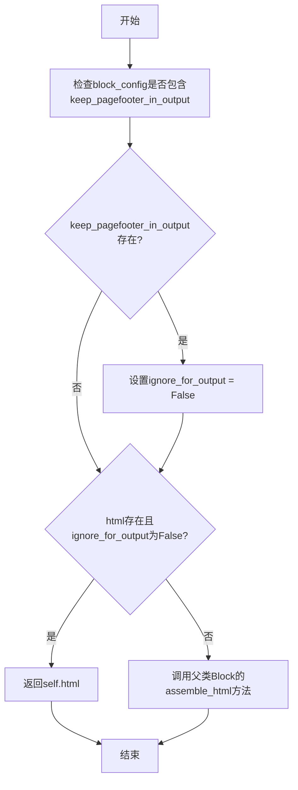

# `marker\marker\schema\blocks\pagefooter.py` 详细设计文档

该代码定义了一个PageFooter类，用于表示PDF或文档中的页脚元素，继承自Block基类，支持自定义HTML内容，并可通过配置控制是否在输出中忽略页脚。

## 整体流程



## 类结构

```
Block (基类)
└── PageFooter (页脚块类)
```

## 全局变量及字段


### `BlockTypes`
    
从marker.schema导入的枚举类，用于定义文档块的类型

类型：`EnumClass`
    


### `Block`
    
从marker.schema.blocks导入的基类，文档块的基础抽象

类型：`Class`
    


### `PageFooter.block_type`
    
块类型标识，值为BlockTypes.PageFooter枚举值

类型：`str`
    


### `PageFooter.block_description`
    
块的描述信息，说明该块为出现在页面底部的文本（如页码）

类型：`str`
    


### `PageFooter.replace_output_newlines`
    
控制输出时是否替换换行符的标志，默认为True

类型：`bool`
    


### `PageFooter.ignore_for_output`
    
控制是否在输出中忽略该块的标志，默认为True

类型：`bool`
    


### `PageFooter.html`
    
页脚的HTML内容，可为None表示使用默认组装逻辑

类型：`str | None`
    
    

## 全局函数及方法


### `Block.assemble_html`

调用父类`Block`的`assemble_html`方法，用于获取页脚块的HTML表示。当当前页脚块没有HTML内容或需要被包含在输出中时，委托给父类处理。

参数：

- `document`：`Any`，文档对象，包含文档的上下文信息
- `child_blocks`：`list[Block]`，子块列表，当前块的子元素
- `parent_structure`：`dict`，父结构信息，包含层级结构数据
- `block_config`：`dict | None`，块配置选项，控制块的行为和输出

返回值：`str`，返回生成的HTML字符串

#### 流程图

```mermaid
flowchart TD
    A[开始调用 super().assemble_html] --> B{检查 ignore_for_output 标志}
    B -->|False: 不忽略输出| C[调用父类 Block.assemble_html]
    B -->|True: 忽略输出| D[返回 None 或空字符串]
    C --> E[父类处理文档、子块、父结构、配置]
    E --> F[返回父类生成的 HTML]
    D --> F
```

#### 带注释源码

```python
def assemble_html(self, document, child_blocks, parent_structure, block_config):
    """
    组装页脚块的HTML表示
    
    参数:
        document: 文档对象，包含文档上下文
        child_blocks: 子块列表，当前块的子元素
        parent_structure: 父结构信息
        block_config: 块配置选项
    
    返回:
        生成的HTML字符串
    """
    # 如果需要保持页脚在输出中，则不忽略
    if block_config and block_config.get("keep_pagefooter_in_output"):
        self.ignore_for_output = False

    # 如果已有html内容且不忽略输出，则直接返回
    if self.html and not self.ignore_for_output:
        return self.html

    # 调用父类Block的assemble_html方法
    # 委托给父类处理HTML组装逻辑
    return super().assemble_html(
        document, child_blocks, parent_structure, block_config
    )
```


### `PageFooter.assemble_html`

该方法负责生成页脚（PageFooter）块的HTML内容。首先检查配置是否要求保留页脚在输出中，然后根据实例的`html`属性和`ignore_for_output`标志决定是返回自定义HTML还是调用父类方法生成默认HTML。

参数：

- `self`：`PageFooter`，页脚块实例本身
- `document`：文档对象，用于传递给父类方法生成HTML
- `child_blocks`：列表，子块元素列表，用于构建HTML结构
- `parent_structure`：字典或对象，父级结构信息
- `block_config`：字典，块配置选项，支持`keep_pagefooter_in_output`键来控制是否在输出中保留页脚

返回值：`str`，返回生成的HTML字符串。如果满足条件返回实例的`html`属性，否则返回父类方法生成的HTML。

#### 流程图

```mermaid
flowchart TD
    A[开始 assemble_html] --> B{block_config 存在且<br/>keep_pagefooter_in_output 为真?}
    B -->|是| C[设置 self.ignore_for_output = False]
    B -->|否| D{self.html 存在且<br/>ignore_for_output 为假?}
    C --> D
    D -->|是| E[返回 self.html]
    D -->|否| F[调用 super().assemble_html<br/>传递 document, child_blocks,<br/>parent_structure, block_config]
    E --> G[结束]
    F --> G
```

#### 带注释源码

```python
def assemble_html(self, document, child_blocks, parent_structure, block_config):
    """
    生成页脚块的HTML内容。
    
    参数:
        document: 文档对象，用于父类方法生成HTML
        child_blocks: 子块列表
        parent_structure: 父级结构信息
        block_config: 块配置字典，可包含keep_pagefooter_in_output键
    
    返回:
        str: 生成的HTML字符串
    """
    # 检查配置：如果block_config存在且keep_pagefooter_in_output为True，
    # 则将ignore_for_output设置为False，允许页脚出现在输出中
    if block_config and block_config.get("keep_pagefooter_in_output"):
        self.ignore_for_output = False

    # 如果实例已有html内容且不在忽略输出列表中，直接返回该html
    if self.html and not self.ignore_for_output:
        return self.html

    # 否则调用父类的assemble_html方法生成默认HTML
    return super().assemble_html(
        document, child_blocks, parent_structure, block_config
    )
```


### `PageFooter.assemble_html`

该方法用于生成页脚（PageFooter）的 HTML 内容。首先检查配置是否保留页脚，如果配置中设置了 `keep_pagefooter_in_output`，则将 `ignore_for_output` 设为 False；然后根据 `ignore_for_output` 标志和 `html` 属性的存在情况决定是直接返回当前 HTML 还是调用父类方法生成 HTML。

参数：

- `document`：`Any`，文档对象，包含文档的上下文信息
- `child_blocks`：`List[Block]`，子块列表，包含当前块的子元素
- `parent_structure`：`Dict`，父结构信息，描述当前块的父级结构
- `block_config`：`Dict | None`，块配置字典，用于控制块的行为选项（如是否在输出中保留页脚）

返回值：`str`，返回生成的 HTML 字符串内容

#### 流程图

```mermaid
flowchart TD
    A[开始 assemble_html] --> B{检查 block_config}
    B --> C{block_config 不为 None 且<br/>包含 'keep_pagefooter_in_output'}
    C -->|是| D[设置 self.ignore_for_output = False]
    C -->|否| E{检查 self.html 和 self.ignore_for_output}
    D --> E
    E --> F{self.html 存在 且<br/>self.ignore_for_output 为 False}
    F -->|是| G[返回 self.html]
    F -->|否| H[调用 super().assemble_html]
    H --> I[返回父类生成的 HTML]
    G --> J[结束]
    I --> J
```

#### 带注释源码

```python
def assemble_html(self, document, child_blocks, parent_structure, block_config):
    """
    生成页脚的 HTML 内容。
    
    参数:
        document: 文档对象，包含文档上下文
        child_blocks: 子块列表
        parent_structure: 父级结构信息
        block_config: 块配置选项
    
    返回:
        生成的 HTML 字符串
    """
    # 检查 block_config 是否存在且包含 keep_pagefooter_in_output 配置
    if block_config and block_config.get("keep_pagefooter_in_output"):
        # 如果配置要求保留页脚在输出中，则忽略 ignore_for_output 标志
        self.ignore_for_output = False

    # 如果 html 属性存在且不在忽略输出列表中，直接返回已有的 html
    if self.html and not self.ignore_for_output:
        return self.html

    # 否则调用父类的 assemble_html 方法生成 HTML
    return super().assemble_html(
        document, child_blocks, parent_structure, block_config
    )
```

## 关键组件


### PageFooter 类

继承自 Block 的页脚块类，用于处理文档中的页脚内容（如页码）。类字段包括：block_type（块类型，固定为PageFooter）、block_description（块描述）、replace_output_newlines（是否替换输出换行符）、ignore_for_output（是否忽略输出）、html（HTML内容）。类方法为 assemble_html，用于组装页脚的HTML输出。

### Block 基类

所有块类型的基类，PageFooter 继承自该类。当页脚HTML存在且不被忽略时，直接返回HTML；否则调用父类的 assemble_html 方法。提供了块类型、描述和输出行为的通用属性。

### BlockTypes.PageFooter

页脚块的类型枚举值，用于标识当前块为页脚类型。

### assemble_html 方法

接收 document、child_blocks、parent_structure、block_config 参数，返回 HTML 字符串。逻辑流程：检查 block_config 中 keep_pagefooter_in_output 标志，若存在则将 ignore_for_output 设为 False；然后判断 html 存在且 ignore_for_output 为 False 时直接返回 html，否则调用父类方法。

### 关键组件信息

- **页脚块 (PageFooter)**: 处理页脚内容的块类型，支持条件性地包含在输出中
- **块配置 (block_config)**: 通过 keep_pagefooter_in_output 标志控制页脚是否输出
- **HTML组装机制**: 支持覆盖父类 assemble_html 方法实现自定义逻辑

### 潜在技术债务

1. **继承设计**: PageFooter 仅重写了 assemble_html 方法的一小部分逻辑，可考虑使用策略模式或配置化方式减少继承层次
2. **magic string**: "keep_pagefooter_in_output" 作为硬编码字符串，应提取为常量
3. **类型注解不完整**: assemble_html 方法的参数类型注解缺失
4. **状态修改副作用**: 在方法内部修改 self.ignore_for_output 可能导致状态不一致

### 其它说明

- 该类的设计遵循了 marker 框架的块类型体系
- ignore_for_output 字段既作为类属性又作为方法内的修改对象，职责不单一
- 通过 super() 调用父类方法实现了模板方法模式


## 问题及建议


### 已知问题

-   **可变类属性导致状态污染**：`replace_output_newlines` 和 `ignore_for_output` 作为类属性定义，但在 `assemble_html` 方法中被修改，可能导致同一类的不同实例之间状态相互影响
-   **缺少文档字符串**：类和方法都缺少 docstring，无法清晰说明其设计意图和使用方式
-   **类型注解不完整**：`document`、`child_blocks`、`parent_structure`、`block_config` 等参数缺少类型注解，降低了代码的可读性和类型安全性
-   **硬编码的字符串字面量**：配置键 `"keep_pagefooter_in_output"` 使用字符串字面量，容易产生拼写错误且无法被 IDE 静态检查
-   **属性默认值不一致**：`html` 定义为 `str | None` 但未设置默认值，而其他属性都有明确默认值

### 优化建议

-   将 `replace_output_newlines` 和 `ignore_for_output` 改为实例属性（`__init__` 中初始化），避免类实例间的状态污染
-   为类和方法添加详细的 docstring，说明功能、参数和返回值含义
-   为所有方法参数添加类型注解，提高代码可维护性
-   将配置键提取为常量或枚举，例如：`KEEP_FOOTER_IN_OUTPUT = "keep_pagefooter_in_output"`
-   考虑使用 `dataclass` 或 `pydantic` 等方式定义配置结构，减少运行时错误
-   考虑将 `block_type` 和 `block_description` 改为只读属性或使用 `__init_subclass__` 验证


## 其它


### 设计目标与约束

本类的设计目标是处理PDF或文档中的页脚内容识别、提取和渲染。核心约束包括：1) 必须继承自Block基类以保持一致性；2) 页脚内容默认不参与输出渲染，除非显式配置保留；3) 支持HTML格式的页脚内容覆盖默认行为；4) 遵循marker.schema中定义的块类型系统。

### 错误处理与异常设计

代码中未包含显式的异常处理逻辑。当block_config为None时，get方法会返回None而不抛出异常。潜在异常场景包括：1) document或child_blocks参数类型不匹配；2) parent_structure结构不符合预期；3) Block基类的assemble_html方法抛出异常。建议添加参数类型检查和异常捕获机制。

### 数据流与状态机

PageFooter实例的状态转换如下：初始化状态（ignore_for_output=True）→ 配置检查（根据block_config.keep_pagefooter_in_output决定）→ 输出决策（ignore_for_output决定是否返回HTML）→ 最终输出（返回self.html或调用父类方法）。数据流：外部document对象 → child_blocks（子块列表）→ parent_structure（父结构）→ block_config（配置）→ 输出HTML字符串。

### 外部依赖与接口契约

主要依赖包括：1) marker.schema.BlockTypes枚举，用于定义block_type；2) marker.schema.blocks.Block基类，提供assemble_html等方法；3) Python内置类型str|None。接口契约要求：assemble_html方法必须接受document、child_blocks、parent_structure、block_config四个参数，返回HTML字符串或None。

### 配置项说明

本类涉及的关键配置项为block_config中的keep_pagefooter_in_output键：1) 当值为True时，设置ignore_for_output=False，页脚内容将参与输出；2) 当值不存在或为False时，页脚内容默认不参与输出；3) block_config为可选参数，可以为None。

### 继承关系说明

PageFooter继承自Block类，继承关系为：PageFooter → Block。Block基类来自marker.schema.blocks模块，提供了assemble_html的默认实现。子类通过重写assemble_html方法实现页脚内容的自定义处理逻辑。

### 性能考虑

当前实现性能开销较小，主要操作包括：1) 字典get操作获取配置；2) 布尔值判断；3) 字符串检查。潜在优化点：1) 可缓存block_config的解析结果避免重复查询；2) 可使用__slots__减少内存占用。

### 安全性考虑

代码本身不涉及用户输入处理，安全性风险较低。但需要注意：1) self.html来自外部数据，需要确保HTML内容经过适当转义处理；2) document对象的具体实现需要评估其安全性。

### 使用示例

```python
# 示例1：创建PageFooter实例
footer = PageFooter(html="<footer>Page 1</footer>")

# 示例2：带配置创建（保留页脚输出）
config = {"keep_pagefooter_in_output": True}
result = footer.assemble_html(doc, [], None, config)

# 示例3：默认行为（不输出页脚）
result = footer.assemble_html(doc, [], None, None)
```

### 版本历史与变更记录

当前版本为初始实现。暂无历史变更记录。后续可能的改进方向：1) 添加更多配置选项；2) 支持模板化的页脚内容；3) 增加国际化支持。

    