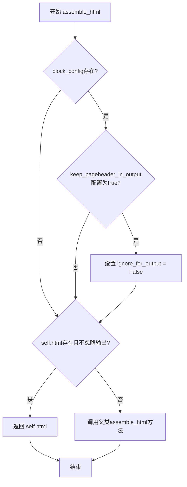

# `marker\marker\schema\blocks\pageheader.py` 详细设计文档

这是一个页面头部块处理模块，定义了PageHeader类用于处理PDF或文档中的页面头部内容，支持根据配置决定是否在输出中保留页面头部，并通过assemble_html方法组装HTML内容。

## 整体流程



## 类结构

```
Block (抽象基类)
└── PageHeader (页面头部块类)
```

## 全局变量及字段


### `PageHeader.block_type`
    
块类型标识，值为BlockTypes.PageHeader

类型：`BlockTypes`
    


### `PageHeader.block_description`
    
块描述信息，说明是页面顶部文本

类型：`str`
    


### `PageHeader.replace_output_newlines`
    
是否替换输出中的换行符，默认为True

类型：`bool`
    


### `PageHeader.ignore_for_output`
    
是否在输出中忽略此块，默认为True

类型：`bool`
    


### `PageHeader.html`
    
HTML内容，可为None

类型：`str | None`
    
    

## 全局函数及方法


### `PageHeader.assemble_html`

该方法用于组装页眉（PageHeader）块的HTML内容。如果配置中启用了保留页眉输出，则将忽略标志设为false；如果已有HTML内容且未被忽略，则返回该HTML；否则调用父类的assemble_html方法进行默认组装。

参数：

- `self`：PageHeader，方法所属的实例对象
- `document`：Any，文档对象，用于传递给父类方法进行HTML组装
- `child_blocks`：List[Block]，当前块的子块列表，用于构建HTML结构
- `parent_structure`：Dict，父结构信息，包含层级关系和上下文数据
- `block_config`：Dict | None，块配置字典，用于获取keep_pageheader_in_output等配置项

返回值：`str | None`，返回组装后的HTML字符串，或调用父类方法返回的结果

#### 流程图

```mermaid
flowchart TD
    A[开始 assemble_html] --> B{block_config 存在且 keep_pageheader_in_output 为 true?}
    B -->|是| C[设置 self.ignore_for_output = False]
    B -->|否| D{self.html 存在且 self.ignore_for_output 为 false?}
    C --> D
    D -->|是| E[返回 self.html]
    D -->|否| F[调用 super().assemble_html]
    F --> G[返回父类结果]
    
    style A fill:#e1f5fe
    style E fill:#c8e6c9
    style G fill:#c8e6c9
```

#### 带注释源码

```python
def assemble_html(self, document, child_blocks, parent_structure, block_config):
    # 检查配置：如果配置中存在 keep_pageheader_in_output 且为 True，
    # 则将 ignore_for_output 设为 False，保留页眉在输出中
    if block_config and block_config.get("keep_pageheader_in_output"):
        self.ignore_for_output = False

    # 如果已有 HTML 内容且 ignore_for_output 为 False（未被忽略），
    # 则直接返回已有的 HTML 内容
    if self.html and not self.ignore_for_output:
        return self.html

    # 否则调用父类 Block 的 assemble_html 方法执行默认组装逻辑
    # 传递 document、child_blocks、parent_structure 和 block_config 参数
    return super().assemble_html(
        document, child_blocks, parent_structure, block_config
    )
```


### `PageHeader.assemble_html`

该方法重写父类 Block 的 assemble_html 方法，用于处理页面头部（PageHeader）块的 HTML 组装逻辑。当 block_config 中设置了 "keep_pageheader_in_output" 时，取消忽略页面头部输出；若存在预生成的 html 且未被标记为忽略，则直接返回该 html，否则调用父类方法完成组装。

参数：

- `self`：PageHeader 实例本身
- `document`：Any，文档对象，包含文档的上下文信息
- `child_blocks`：List[Block]，子块列表，当前页面头部块包含的子块
- `parent_structure`：Dict，父结构信息，描述当前块在文档层级中的位置关系
- `block_config`：Dict，块配置选项，用于控制块的输出行为（如 keep_pageheader_in_output）

返回值：`str | None`，返回组装后的 HTML 字符串，或调用父类方法的结果

#### 流程图

```mermaid
flowchart TD
    A[开始 assemble_html] --> B{检查 block_config}
    B --> C{block_config.get<br/>'keep_pageheader_in_output'?}
    C -->|是| D[设置 self.ignore_for_output = False]
    C -->|否| E{检查 self.html 存在<br/>且 self.ignore_for_output 为 False?}
    D --> E
    E -->|是| F[返回 self.html]
    E -->|否| G[调用 super().assemble_html]
    F --> H[结束]
    G --> H
```

#### 带注释源码

```python
def assemble_html(self, document, child_blocks, parent_structure, block_config):
    # 如果提供了 block_config 且包含 'keep_pageheader_in_output' 配置项
    # 则将 ignore_for_output 设置为 False，允许页面头部输出
    if block_config and block_config.get("keep_pageheader_in_output"):
        self.ignore_for_output = False

    # 如果存在预生成的 html 且当前块不被忽略
    # 则直接返回该 html，不再进行进一步处理
    if self.html and not self.ignore_for_output:
        return self.html

    # 否则调用父类 Block 的 assemble_html 方法
    # 由父类负责执行默认的 HTML 组装逻辑
    return super().assemble_html(
        document, child_blocks, parent_structure, block_config
    )
```

## 关键组件


### PageHeader 类

继承自 Block 的页眉块类，用于处理文档中页面顶部出现的文本内容（如页面标题）。该类通过重写 `assemble_html` 方法实现了页眉的 HTML 组装逻辑，支持可选地保留页眉在输出中。

### BlockTypes 枚举

定义文档中不同类型的块，用于标识 PageHeader 块的类型为 `PageTypes.PageHeader`。

### assemble_html 方法

核心方法，负责将页眉块转换为 HTML 字符串。当 `block_config` 中设置 `keep_pageheader_in_output` 时，会将 `ignore_for_output` 设为 False，允许页眉出现在最终输出中；如果存在 `html` 属性且不在忽略列表中，则直接返回该 HTML，否则调用父类的实现。

### block_type 属性

类属性，指定块的类型为 `BlockTypes.PageHeader`，用于标识这是一个页眉块。

### block_description 属性

类属性，描述页眉块的功能为"Text that appears at the top of a page, like a page title"。

### replace_output_newlines 属性

类属性，设置为 True，表示在输出时替换换行符。

### ignore_for_output 属性

实例属性，初始值为 True，表示默认情况下页眉不参与输出，可通过配置修改。

### html 属性

实例属性，类型为 `str | None`，存储页眉的 HTML 内容，可选。

### 继承关系

PageHeader 继承自 Block 类，继承父类的 `assemble_html` 方法逻辑，同时提供页眉特定的组装行为。

### 配置驱动设计

通过 `block_config` 参数支持运行时配置，允许外部控制是否在输出中保留页眉，实现灵活的业务逻辑定制。


## 问题及建议


### 已知问题

- **状态可变性问题**：`ignore_for_output` 和 `replace_output_newlines` 作为类属性使用可变默认值，虽然此处为布尔值不存在列表修改问题，但实例间可能共享状态风险
- **魔法字符串**：`"keep_pageheader_in_output"` 硬编码在方法中，缺乏常量定义，代码可维护性差
- **缺少类型注解**：`assemble_html` 方法的参数和返回值均无类型提示，与代码其他部分的类型安全不一致
- **方法职责不单一**：`assemble_html` 同时处理配置解析、状态修改和HTML组装，违反单一职责原则
- **配置与状态耦合**：通过 `block_config` 直接修改实例状态 `self.ignore_for_output`，这种设计可能导致不可预期的副作用
- **文档缺失**：类和方法均无文档字符串，无法直接获取设计意图
- **空值处理不明确**：`html` 字段允许 `None`，但返回 `self.html` 时未做空值保护说明

### 优化建议

- 提取魔法字符串为模块级常量，如 `KEEP_PAGEHEADER_IN_OUTPUT = "keep_pageheader_in_output"`
- 为 `assemble_html` 方法添加完整的类型注解，定义 `document`、`child_blocks`、`parent_structure` 和 `block_config` 的类型
- 考虑将配置逻辑移至 `__init__` 或工厂方法中，避免在业务方法中修改关键状态
- 添加类和方法级别的文档字符串说明功能和参数含义
- 使用数据类或 `__slots__` 优化内存使用，明确声明所有字段的预期用途

## 其它


### 设计目标与约束

该类旨在表示PDF或文档中的页眉(Page Header)块，负责识别和组装页眉内容，并在输出中可选地包含或排除页眉。主要约束包括：必须继承自Block基类，block_type必须为BlockTypes.PageHeader，html属性可选且仅在ignore_for_output为False时生效。

### 错误处理与异常设计

该类本身未实现显式的异常处理逻辑。潜在的异常场景包括：block_config为None时的get操作、document/child_blocks/parent_structure参数类型不匹配、以及html属性为None时的默认行为处理。所有异常将向上抛出至调用者处理。

### 数据流与状态机

数据流入过程：外部调用assemble_html方法 → 检查block_config中keep_pageheader_in_output标志 → 根据标志设置ignore_for_output状态 → 判断html是否存在且ignore_for_output为False → 返回html或调用父类方法。状态转换：ignore_for_output初始为True → 当配置keep_pageheader_in_output=True时转换为False。

### 外部依赖与接口契约

依赖marker.schema.BlockTypes枚举类型、marker.schema.blocks.Block基类。assemble_html方法签名遵循Block基类定义的接口契约，需要接收document、child_blocks、parent_structure、block_config四个参数，返回HTML字符串或None。

### 使用场景与示例

当解析PDF文档时，识别到页眉内容（如页码、章节标题）会创建PageHeader实例。默认情况下页眉不输出至最终文档，当用户需要保留页眉时通过block_config设置keep_pageheader_in_output=True。

### 性能考虑

该类实现简单，assemble_html方法为轻量级操作。性能优化点：replace_output_newlines和ignore_for_output为类属性而非实例属性，可考虑缓存html结果以避免重复组装。

### 安全性考虑

html属性直接存储和返回HTML内容，需确保输入源可信。建议在文档解析阶段对HTML内容进行消毒(Sanitization)处理，防止XSS等安全问题。

### 测试策略

应覆盖以下测试场景：默认配置下ignore_for_output为True且html返回None时的行为、配置keep_pageheader_in_output=True时ignore_for_output变为False的行为、html存在且不禁用时的直接返回行为、父类方法调用传递参数的正确性。

### 版本兼容性

该代码使用了Python 3.10+的联合类型语法(str | None)，需要Python 3.10及以上版本。Block基类的接口变更可能影响兼容性。

### 相关类与模块

与marker.schema.blocks.Block基类为继承关系，与marker.schema.BlockTypes枚举为类型引用关系。可能的关联类包括其他Block子类（如PageFooter、Paragraph、Table等）以及Document类。


    