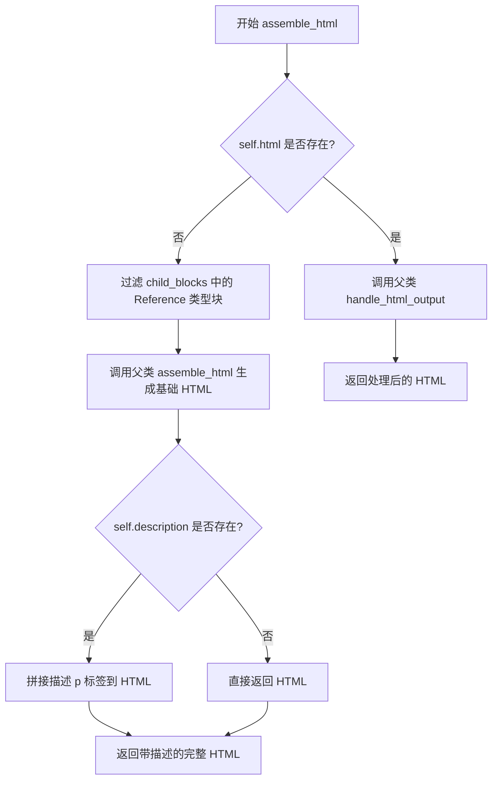

# `marker\marker\schema\blocks\picture.py` 详细设计文档

该代码定义了一个Picture类，继承自Block基类，用于表示文档中的图片块。它处理图片的HTML组装，支持图片描述的附加，并能够过滤和处理引用类型的子块，最终将图片转换为带有描述信息的HTML表示。

## 整体流程

```mermaid
graph TD
    A[创建Picture实例] --> B{调用assemble_html方法}
    B --> C{self.html是否存在?}
C -- 是 --> D[调用父类handle_html_output]
C -- 否 --> E[过滤child_blocks中的Reference类型块]
E --> F[调用父类assemble_html方法]
F --> G{self.description是否存在?]
G -- 是 --> H[拼接图片描述HTML: &lt;p role='img' data-original-image-id='{self.id}'&gt;Image {self.id} description: {self.description}&lt;/p&gt;]
G -- 否 --> I[直接返回HTML]
H --> J[返回拼接后的完整HTML]
D --> J
I --> J
```

## 类结构

```
Block (抽象基类)
└── Picture (图片块实现类)
```

## 全局变量及字段


### `Picture.block_type`
    
块类型，固定为BlockTypes.Picture

类型：`BlockTypes`
    


### `Picture.description`
    
图片的描述文本

类型：`str | None`
    


### `Picture.block_description`
    
块的描述信息，固定为'An image block that represents a picture.'

类型：`str`
    


### `Picture.html`
    
已渲染的HTML内容，可选

类型：`str | None`
    
    

## 全局函数及方法


### `Picture.assemble_html`

该方法用于将图片块组装成HTML表示。如果图片块已有缓存的HTML内容，则直接调用父类方法处理输出；否则，过滤出子引用块，调用父类方法生成基础HTML，并根据是否有图片描述添加相应的描述信息标签。

参数：

- `self`：Picture，图片块实例本身
- `document`：Any，文档对象，用于处理和生成HTML内容
- `child_blocks`：List[Block]，当前块的子块列表
- `parent_structure`：Any，父级结构信息，用于构建HTML时的上下文
- `block_config`：Dict | None，可选的块配置字典，用于自定义HTML生成行为，默认为None

返回值：`str`，返回生成的HTML字符串，包含图片的HTML表示以及可选的图片描述

#### 流程图



#### 带注释源码

```python
def assemble_html(
    self, document, child_blocks, parent_structure, block_config=None
):
    # 检查当前图片块是否已有缓存的HTML内容
    if self.html:
        # 如果已有缓存，则调用父类的handle_html_output方法处理输出
        return super().handle_html_output(
            document, child_blocks, parent_structure, block_config
        )

    # 从子块列表中过滤出类型为Reference的块
    # Reference块通常包含对外部资源的引用信息
    child_ref_blocks = [
        block
        for block in child_blocks
        if block.id.block_type == BlockTypes.Reference
    ]
    
    # 调用父类的assemble_html方法，传入过滤后的引用块
    # 生成基础的HTML表示
    html = super().assemble_html(
        document, child_ref_blocks, parent_structure, block_config
    )

    # 检查当前图片块是否有描述信息
    if self.description:
        # 如果有描述，则在基础HTML后追加一个带有角色属性的p标签
        # role='img'用于无障碍访问，data-original-image-id用于追踪原始图片ID
        return (
            html
            + f"<p role='img' data-original-image-id='{self.id}'>Image {self.id} description: {self.description}</p>"
        )
    
    # 如果没有描述，直接返回基础HTML
    return html
```

## 关键组件


### Picture 类

继承自 Block 的图像块类，用于表示文档中的图片内容，支持描述信息和 HTML 组装。

### BlockTypes 枚举

定义了文档中所有块的类型，其中 Picture 作为块类型之一标识图像内容。

### assemble_html 方法

负责将图像块转换为 HTML 输出的核心方法，包含预存 HTML 优先级判断、子引用块过滤、描述信息追加等逻辑。

### description 字段

图像的描述信息，为可选字段，用于存储图像的文本说明内容。

### html 字段

预存的 HTML 内容，为可选字段，当存在时直接使用父类方法处理，优先级高于默认组装逻辑。

### child_ref_blocks 过滤逻辑

从子块中筛选出类型为 Reference 的块，用于处理引用类型的子块内容。

### 数据原始图像 ID

通过 data-original-image-id 属性记录图像的唯一标识，支持图像追踪和关联。


## 问题及建议


### 已知问题

- **类型注解不完整**：`assemble_html` 方法的 `document`、`parent_structure`、`block_config` 参数缺少类型注解，影响代码可读性和 IDE 支持。
- **字符串拼接性能低**：使用 `+` 运算符进行 HTML 字符串拼接，效率较低，大规模渲染时可能产生性能瓶颈。
- **硬编码 HTML 属性**：`<p role='img' data-original-image-id='{self.id}'>` 中的属性硬编码在方法内部，缺乏灵活性，难以通过配置调整。
- **缺少空值校验**：未对 `self.id` 为 `None` 的情况进行校验，直接插入模板字符串可能导致异常。
- **魔法字符串未提取**：`"An image block that represents a picture."` 和 `"Image {id} description:"` 作为硬编码字符串分散在代码中，不利于国际化或配置管理。
- **方法职责不单一**：`assemble_html` 同时处理了「已有 HTML」和「需要组装」两种场景，分支逻辑可读性较差。

### 优化建议

- **完善类型注解**：为所有参数添加类型注解，如 `block_config: dict | None = None`，提升代码可维护性。
- **使用模板引擎或 join**：将 HTML 构建改为 f-string 多行书写或 `''.join()`，或使用模板库（如 `jinja2`）分离视图层。
- **配置化 HTML 属性**：将 `role`、`data-*` 属性提取为类常量或配置项，便于维护和扩展。
- **增加防御性校验**：在方法开头添加 `if not self.id: return ''` 或抛出明确异常，避免运行时错误。
- **提取常量或配置文件**：将描述文本放入类常量或外部配置，支持多语言和动态调整。
- **拆分方法逻辑**：将「已有 HTML」和「组装 HTML」的场景分离为私有方法，如 `_assemble_from_html()` 和 `_assemble_from_blocks()`，提升可读性和可测试性。

## 其它


### 设计目标与约束

该代码的设计目标是实现一个图像块的HTML组装功能，支持图像描述的渲染，同时保持与父类Block的一致性。约束包括：必须继承自Block类、block_type必须为BlockTypes.Picture、description为可选字段、html属性优先于默认组装逻辑。

### 错误处理与异常设计

代码主要依赖父类的handle_html_output和assemble_html方法，异常处理由父类统一管理。当self.html存在时调用父类方法，否则执行自定义组装逻辑。如果child_blocks中无Reference类型块或description为空，仍返回父类组装结果而非抛出异常，采用防御性编程风格。

### 数据流与状态机

数据流：输入(child_blocks, parent_structure, block_config) → 过滤Reference块 → 调用父类assemble_html → 拼接description HTML → 输出HTML字符串。无复杂状态机，状态转换依赖于BlockTypes和html/description字段的存在性。

### 外部依赖与接口契约

依赖项：marker.schema.BlockTypes枚举、marker.schema.blocks.Block基类。接口契约：assemble_html方法签名必须与父类一致(document, child_blocks, parent_structure, block_config=None)，返回值类型为str或父类对应类型。

### 性能考虑

通过列表推导式过滤child_ref_blocks，时间复杂度O(n)。如果child_blocks数量巨大，可考虑缓存或流式处理。html字段存在时跳过子块过滤，提升有预渲染HTML场景的性能。

### 安全性考虑

description字段直接拼接到HTML字符串中，存在XSS风险。应使用HTML转义处理description内容，如使用html.escape()。id字段拼接时需验证其为安全字符串。

### 配置说明

block_config参数由外部传入，用于控制渲染行为。当前代码中未使用该参数，但保留接口兼容性。description和html字段可通过配置或解析器填充。

### 使用示例

```python
# 创建Picture实例
pic = Picture(
    id="img_001",
    description="A beautiful sunset"
)
# 调用assemble_html
html_output = pic.assemble_html(document, child_blocks, parent_structure)
```

### 版本信息

代码基于marker库 schema模块，具体版本需参考marker包版本。BlockTypes.Picture为枚举值，需与marker.schema版本匹配。

### 测试策略

应测试：html字段存在时走父类逻辑、description为空时返回纯图像HTML、description非空时附加描述段落、child_blocks过滤逻辑、HTML拼接格式正确性。


    