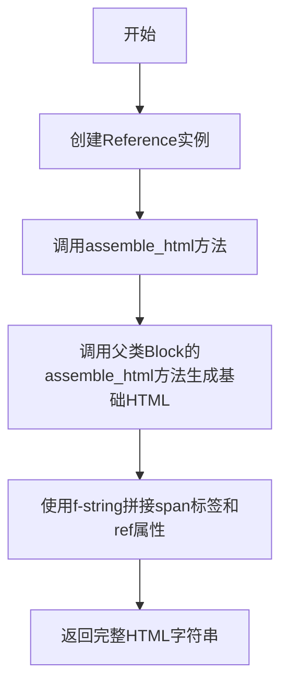

# `marker\marker\schema\blocks\reference.py` 详细设计文档

这是一个Reference类，用于表示文档中的引用块，通过assemble_html方法生成带有id属性的HTML span元素，实现文档内部的交叉引用功能。

## 整体流程



## 类结构

```
Block (基类)
└── Reference (继承自Block)
```

## 全局变量及字段


### `Reference.block_type`
    
块类型，固定为BlockTypes.Reference

类型：`BlockTypes`
    


### `Reference.ref`
    
引用标识符，用于生成HTML span的id属性

类型：`str`
    


### `Reference.block_description`
    
块的描述信息，默认为'A reference to this block from another block.'

类型：`str`
    
    

## 全局函数及方法


### Reference.assemble_html

该方法是Reference类的HTML组装方法，通过调用父类方法获取基础HTML内容，然后使用带有id属性的span标签包裹内容，其中id值来源于实例的ref属性，最终返回完整的HTML字符串。

参数：

- `document`：`object`，文档对象，用于传递给父类方法处理
- `child_blocks`：`list`，子块列表，包含需要渲染的子元素
- `parent_structure`：`object`，父结构，可选参数，表示上层DOM结构信息
- `block_config`：`object`，块配置，可选参数，用于控制渲染行为

返回值：`str`，返回带有ref属性的HTML span元素字符串

#### 流程图

```mermaid
flowchart TD
    A[开始 assemble_html] --> B[调用super().assemble_html获取基础模板]
    B --> C[使用f-string格式化span标签]
    C --> D[设置span的id属性为self.ref]
    D --> E[将基础模板嵌入span标签内部]
    E --> F[返回组装完成的HTML字符串]
    F --> G[结束]
```

#### 带注释源码

```python
def assemble_html(
    self, document, child_blocks, parent_structure=None, block_config=None
):
    """
    组装当前引用块为HTML格式
    
    参数:
        document: 文档对象，提供文档上下文
        child_blocks: 子块列表，包含子元素
        parent_structure: 父结构，可选
        block_config: 块配置，可选
    
    返回:
        带有ref属性的span标签HTML字符串
    """
    # 调用父类(Block)的assemble_html方法生成基础HTML内容
    # 父类方法会处理child_blocks的渲染和document上下文的整合
    template = super().assemble_html(
        document, child_blocks, parent_structure, block_config
    )
    
    # 使用span标签包裹基础内容，并设置id属性为self.ref的值
    # ref属性用于在文档中创建锚点，便于其他块引用此元素
    return f"<span id='{self.ref}'>{template}</span>"
```

## 关键组件


### Reference 类

继承自 Block 的引用块类，用于表示文档中对特定块的引用关系。包含引用标识符（ref）和块类型定义。

### ref 字段

类型：`str`

存储引用目标块的标识符，用于在 HTML 输出中创建带有 id 属性的 span 元素，实现页面内的链接跳转。

### assemble_html 方法

重写父类的 HTML 组装方法，将引用标识符添加到生成的 HTML 元素中，包裹在带有 id 属性的 span 标签内。

### block_type 字段

类型：`BlockTypes`

静态字段，标识该块的类型为 Reference，用于块类型识别和处理逻辑分支。

### Block 基类依赖

Reference 类继承自 marker.schema.blocks.Block，依赖父类提供的基础块功能和 assemble_html 的默认实现。


## 问题及建议


### 已知问题

-   `ref` 字段缺少类型注解，无法获得静态类型检查的好处
-   `ref` 字段没有默认值，可能导致初始化时的 ValidationError
-   `assemble_html` 方法的参数（`document`, `child_blocks`, `parent_structure`, `block_config`）全部缺少类型注解，影响代码可读性和静态分析
-   `assemble_html` 方法缺少返回值类型注解（应该为 `str`）
-   类和方法都缺少文档字符串（docstring），影响代码可维护性和团队协作
-   `block_description` 类属性定义后未被实际使用，可能造成混淆
-   HTML 标签 `<span>` 硬编码在方法内部，缺乏灵活性，若需要支持其他标签（如 `div`）需要修改源码
-   没有对 `ref` 值进行有效性校验（如空字符串检查、特殊字符转义等），可能导致 XSS 安全问题或 HTML 渲染错误

### 优化建议

-   为 `ref` 字段添加类型注解（如 `ref: str`）和默认值（如 `ref: str = ""`）
-   为 `assemble_html` 方法的所有参数和返回值添加类型注解
-   为类和关键方法添加文档字符串，说明职责和使用场景
-   考虑将 HTML 标签类型抽取为可配置参数，或使用模板系统
-   在 `assemble_html` 方法中添加 `ref` 值的验证逻辑，确保非空且符合 HTML id 命名规范
-   如果 `block_description` 无用，建议移除以减少代码混淆；若有用，则应在适当位置使用它
-   考虑对 `ref` 值进行 HTML 转义处理，防止潜在的 XSS 攻击
</think>

## 其它


### 设计目标与约束

- **核心目标**：为文档渲染提供锚点标记机制，使其他块能够通过 ref 属性引用当前块的内容
- **设计约束**：必须继承自 Block 基类，保持与 marker 框架的兼容性
- **功能约束**：只负责生成带有 id 属性的 span 包装器，具体内容由父类 assemble_html 方法生成

### 错误处理与异常设计

- **异常传播**：直接调用父类 super().assemble_html() 方法，异常由父类处理
- **空值处理**：假设 ref 属性在实例化时已由框架验证为非空，block_config 参数可为 None
- **类型安全**：依赖 Python 类型注解和框架的类型检查机制

### 数据流与状态机

- **输入数据流**：document（文档对象）、child_blocks（子块列表）、parent_structure（父结构）、block_config（块配置）
- **输出数据流**：返回带有 id 属性的 HTML span 字符串
- **处理状态**：无状态设计，仅做静态字符串拼接和模板调用

### 外部依赖与接口契约

- **依赖包**：marker.schema（项目内部模块）
- **接口依赖**：
  - Block 基类（必须继承）
  - BlockTypes 枚举（必须使用 Reference 类型）
  - assemble_html 方法（必须可调用）
- **被依赖者**：其他块通过 ref 属性引用该块

### 性能考虑

- **时间复杂度**：O(n) 其中 n 为子块处理数量，取决于父类实现
- **空间复杂度**：O(m) 其中 m 为生成的 HTML 字符串长度
- **优化建议**：当前实现已足够简洁，字符串拼接效率尚可

### 安全性考虑

- **XSS 风险**：ref 属性直接嵌入 HTML 属性，需确保 ref 值由框架验证和转义
- **输入验证**：依赖框架层面的输入验证，当前类本身不做额外安全检查
- **建议**：若 ref 来自用户输入，应在框架层面添加 sanitization

### 兼容性考虑

- **Python 版本**：依赖项目整体的 Python 版本要求
- **框架版本**：与 marker 框架版本绑定，需保持 Block 基类接口不变
- **向后兼容**：assemble_html 方法签名应保持稳定

### 使用示例

```python
# 创建 Reference 块实例
ref_block = Reference(
    ref="section-1",
    block_description="第一节引用"
)

# 渲染 HTML
html = ref_block.assemble_html(
    document=doc,
    child_blocks=[],
    parent_structure=parent,
    block_config=None
)
# 输出: <span id='section-1'>...</span>
```

### 测试策略

- **单元测试**：
  - 测试 ref 属性正确映射到 span 的 id 属性
  - 测试继承自 Block 的基本功能
  - 测试空 ref 值的处理（需框架配合）
- **集成测试**：
  - 测试在完整文档渲染流程中的表现
  - 测试跨块引用的正确性


    