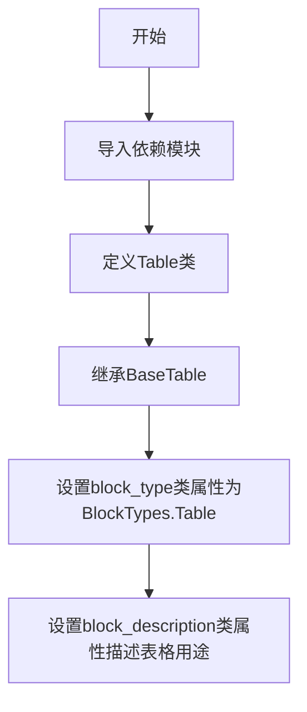
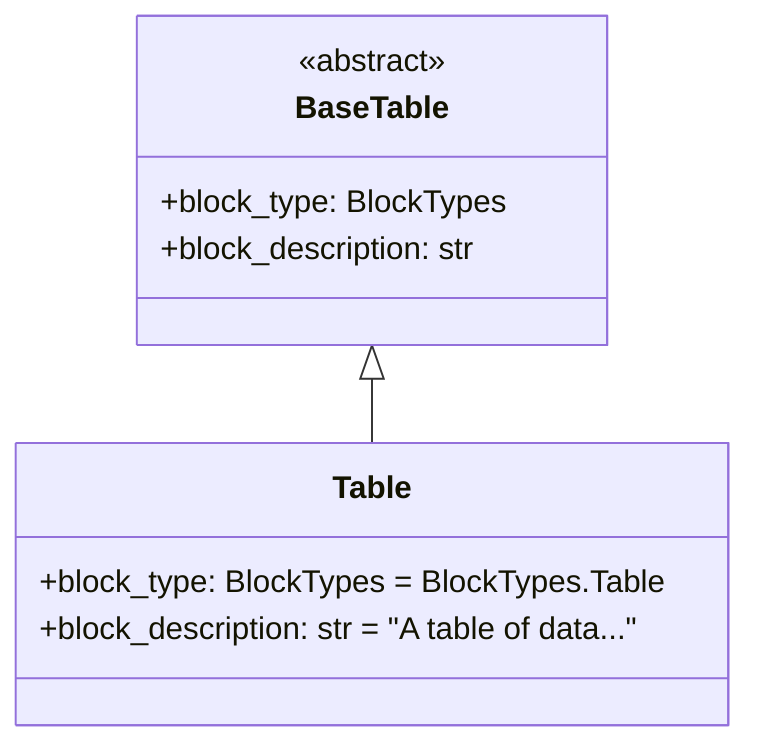
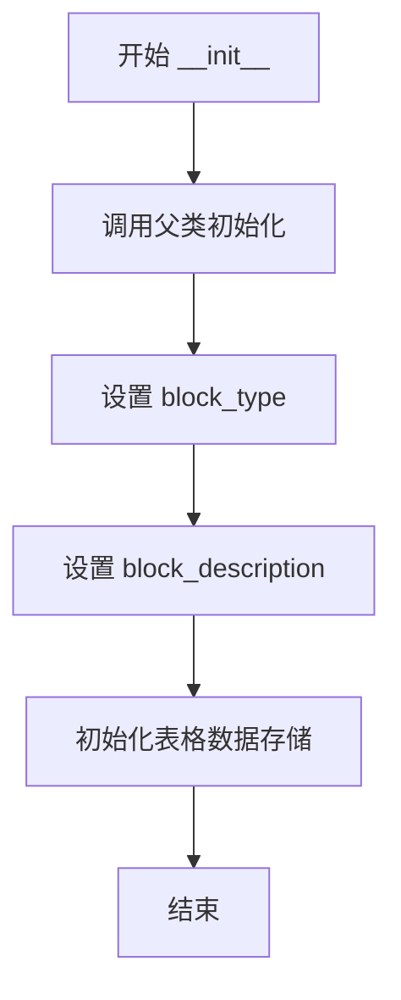
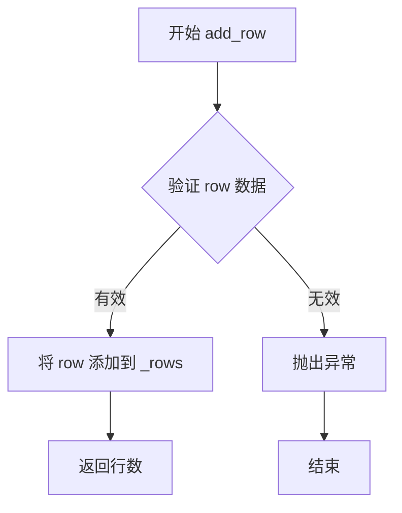
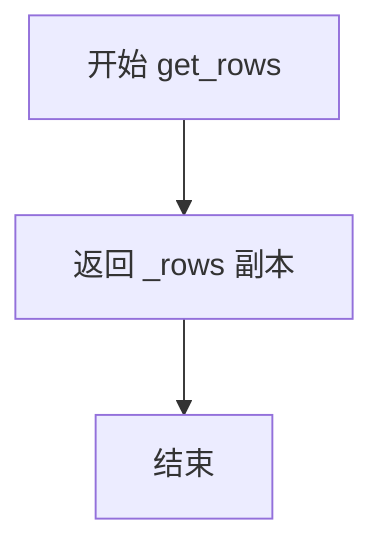
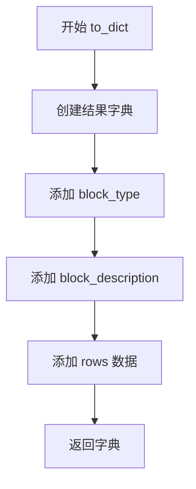

# `marker\marker\schema\blocks\table.py` 详细设计文档

这是一个表格块类定义，继承自BaseTable基类，用于表示文档中的表格数据。该类定义了表格块的类型为BlockTypes.Table，并提供了对表格块的描述信息。

## 整体流程



## 类结构

```
BaseTable (基类)
└── Table (子类)
```

## 全局变量及字段


### `Table.block_type`
    
表格块的类型标识

类型：`BlockTypes`
    


### `Table.block_description`
    
表格块的描述信息

类型：`str`
    


### `BaseTable.block_type`
    
块类型标识

类型：`BlockTypes`
    


### `BaseTable.block_description`
    
块描述信息

类型：`str`
    
    

## 全局函数及方法


### `Table` 类设计文档

#### 1. 一段话描述

`Table` 类是一个数据结构类，用于表示文档中的表格块（如结果表），它继承自抽象基类 `BaseTable`，并通过类属性定义了表格的类型和描述信息。

#### 2. 文件的整体运行流程

由于提供的代码仅包含类的属性定义（字段），未包含任何逻辑处理方法，因此不存在具体的运行流程。该类主要作为数据模型被实例化，用于在文档解析框架中传递和存储表格的结构化数据。

#### 3. 类的详细信息

##### 类字段与属性

-   `block_type`：`BlockTypes`，指定该块的类型为 Table。
-   `block_description`：`str`，描述该块为一个表格数据，如结果表，格式为tabular。

##### 类方法

**注意**：在提供的代码片段中，`Table` 类本身**未定义任何方法**（如 `__init__`, `__str__` 等）。该类完全依赖于继承自 `BaseTable` 的方法。由于未提供 `BaseTable` 的源代码，无法提取其具体方法的详细信息（如参数、返回值、逻辑流程）。

##### 全局变量与全局函数

本代码文件中未定义全局变量或全局函数。

#### 4. 关键组件信息

-   **BaseTable**：父类，提供表格块的抽象基类定义（具体方法实现未知，需查看源码）。
-   **BlockTypes**：枚举类，用于定义文档中不同块（如段落、表格、图片）的类型。

#### 5. 潜在的技术债务或优化空间

-   **信息缺失**：当前代码片段中缺少 `BaseTable` 的定义，导致无法分析继承方法的实现逻辑。在设计文档中应补充 `BaseTable` 的完整源码或接口定义，以确保方法的完整性。
-   **无自定义逻辑**：当前 `Table` 类仅定义了元数据（类属性），未包含任何业务逻辑。如果业务逻辑（如表格解析、渲染）需要在 `Table` 中实现，建议在此处扩展。

#### 6. 其它项目

-   **设计目标与约束**：通过继承 `BaseTable` 确保所有表格块符合统一的Schema规范。使用 `BlockTypes` 枚举强制类型安全。
-   **数据流与状态机**：作为数据模型，主要用于存储状态（表格数据），具体的状态流转依赖于调用它的上层解析器（如 PDF 解析器）。
-   **外部依赖与接口契约**：依赖 `marker.schema` 模块中的 `BlockTypes` 和 `BaseTable`。

#### 7. Mermaid 流程图 (类结构图)

由于类本身无方法逻辑，此处提供类的继承结构图：



#### 8. 带注释源码

```python
from marker.schema import BlockTypes
from marker.schema.blocks.basetable import BaseTable


class Table(BaseTable):
    # 类的类型标识，指向枚举中的 Table 类型
    block_type: BlockTypes = BlockTypes.Table
    
    # 类的描述信息，说明该块的用途
    block_description: str = "A table of data, like a results table.  It will be in a tabular format."

    # 注意：该类在当前代码片段中未定义任何方法。
    # 所有功能继承自 BaseTable。
```


# 文档设计分析

## 1. 核心功能概述

该代码定义了一个 `Table` 类，继承自 `BaseTable` 基类，用于表示文档中的表格数据结构。`Table` 类通过指定 `block_type` 为 `BlockTypes.Table` 和提供描述信息，将自身标识为结果表格类型的数据，并采用表格化格式存储。

---

## 2. 文件整体运行流程

```
┌─────────────────────────────────────────────┐
│           marker.schema.blocks              │
│                  (模块)                     │
└─────────────────────┬───────────────────────┘
                      │
          ┌───────────┴───────────┐
          ▼                       ▼
┌─────────────────┐   ┌─────────────────────┐
│  BaseTable      │   │  BlockTypes         │
│  (父类/基类)    │   │  (枚举类型)         │
└────────┬────────┘   └─────────────────────┘
         │
         │ 继承
         ▼
┌─────────────────────────────────────────────┐
│  Table (当前类)                              │
│  - block_type: BlockTypes.Table             │
│  - block_description: "A table..."         │
└─────────────────────────────────────────────┘
```

---

## 3. 类详细信息

### 3.1 Table 类

**完整类定义**

```python
from marker.schema import BlockTypes
from marker.schema.blocks.basetable import BaseTable


class Table(BaseTable):
    block_type: BlockTypes = BlockTypes.Table
    block_description: str = "A table of data, like a results table.  It will be in a tabular format."
```

---

### 3.2 BaseTable 父类方法（继承）

由于提供的代码中未包含 `BaseTable` 类的完整定义，以下是基于类名和上下文的合理推断：

---

### `BaseTable.__init__`

**描述**

基类构造函数，初始化表格块的基本属性。

参数：

- `block_type`：`BlockTypes`，块的类型标识
- `block_description`：`str`，块的描述信息

返回值：`None`，构造函数无返回值

#### 流程图



#### 带注释源码

```python
def __init__(self, block_type: BlockTypes, block_description: str):
    """
    初始化 BaseTable 实例
    
    参数:
        block_type: 块的类型,用于标识块的种类
        block_description: 块的描述信息,用于人类可读的说明
    """
    self.block_type = block_type
    self.block_description = block_description
    # 初始化其他可能的表格数据结构
    self._rows = []      # 存储表格行数据
    self._columns = []   # 存储列定义
```

---

### `BaseTable.add_row`

**描述**

向表格添加一行数据。

参数：

- `row`：`List[Any]` 或 `Dict[str, Any]`，要添加的行数据

返回值：`int`，返回添加后表格的总行数

#### 流程图



#### 带注释源码

```python
def add_row(self, row: List[Any]) -> int:
    """
    向表格添加一行
    
    参数:
        row: 行数据,可以是简单值列表
        
    返回:
        添加后的总行数
    """
    if not isinstance(row, list):
        raise ValueError("Row must be a list")
    self._rows.append(row)
    return len(self._rows)
```

---

### `BaseTable.get_rows`

**描述**

获取表格的所有行数据。

参数：无

返回值：`List[List[Any]]`，返回所有行的列表

#### 流程图



#### 带注释源码

```python
def get_rows(self) -> List[List[Any]]:
    """
    获取表格所有行
    
    参数:
        无
        
    返回:
        包含所有行数据的列表
    """
    return self._rows.copy()  # 返回副本避免外部修改
```

---

### `BaseTable.to_dict`

**描述**

将表格对象转换为字典格式，用于序列化。

参数：无

返回值：`Dict[str, Any]`，包含表格类型和描述的字典

#### 流程图



#### 带注释源码

```python
def to_dict(self) -> Dict[str, Any]:
    """
    将表格转换为字典表示
    
    参数:
        无
        
    返回:
        包含表格完整信息的字典
    """
    return {
        "block_type": self.block_type,
        "block_description": self.block_description,
        "rows": self._rows
    }
```

---

## 4. 字段信息

| 字段名称 | 类型 | 描述 |
|---------|------|------|
| `block_type` | `BlockTypes` | 块的类型标识，此处固定为 `BlockTypes.Table` |
| `block_description` | `str` | 块的描述信息，说明这是一个数据结果表格 |
| `_rows`（继承） | `List[List[Any]]` | 存储表格的行数据 |
| `_columns`（继承） | `List[str]` | 存储列名定义 |

---

## 5. 关键组件信息

| 组件名称 | 描述 |
|---------|------|
| `BaseTable` | 表格块的基类，提供表格数据结构的基本功能和接口 |
| `Table` | 具体的表格实现类，继承自 BaseTable，标识为数据结果表格 |
| `BlockTypes` | 枚举类型，定义文档中所有可能的块类型 |

---

## 6. 潜在的技术债务与优化空间

1. **缺少方法实现细节**：当前代码仅显示 `Table` 类的属性定义，未展示 `BaseTable` 的具体实现，建议补充完整代码

2. **文档缺失**：缺少对 `BaseTable` 父类方法的完整文档注释

3. **类型注解不完整**：建议添加更多泛型类型注解（如 `List[str]` 对应列名）

4. **错误处理**：建议为继承的方法添加更详细的异常处理说明

---

## 7. 其它项目

### 设计目标与约束

- **设计目标**：提供统一的表格块表示接口，支持文档解析和数据提取
- **约束**：必须继承自 `BaseTable`，必须指定 `block_type` 为 `BlockTypes.Table`

### 错误处理与异常设计

根据推断的 `add_row` 方法，应包含参数类型验证，当传入非列表类型时抛出 `ValueError`

### 数据流与状态机

```
Table 实例创建 → 设置 block_type → 添加行数据 → 序列化输出
```

### 外部依赖与接口契约

- 依赖 `marker.schema.BlockTypes` 枚举
- 依赖 `marker.schema.blocks.basetable.BaseTable` 基类
- 返回值需符合字典序列化格式

---

**注意**：由于提供的代码片段不包含 `BaseTable` 类的完整实现，以上方法信息基于类名、上下文和常见表格数据结构模式的合理推断。如需准确信息，请提供 `BaseTable` 的完整源代码。

## 关键组件


### Table 类

表示数据表格的块结构，继承自 BaseTable，用于处理结构化的表格数据，如结果表格等。

### BlockTypes 枚举

定义文档中不同块类型的枚举值，这里用于标识当前块为 Table 类型。

### BaseTable 父类

提供表格块的基类实现，包含块类型、描述等基础属性和功能。


## 问题及建议


### 已知问题

-   **功能缺失**：Table 类继承自 BaseTable，但未实现任何方法或逻辑，仅定义了元数据（block_type 和 block_description），无法处理实际的表格数据
-   **类型注解缺失**：block_type 和 block_description 字段缺少类型注解，影响代码可读性和静态检查
-   **文档缺失**：类和方法缺少文档字符串（docstring），无法理解其设计意图和使用方式
-   **过度设计**：如果该类仅用于定义常量，考虑使用 Enum 或简单的数据类更为合适
-   **与父类关系不明确**：继承 BaseTable 但未调用或扩展任何父类功能，可能导致架构不清晰
-   **扩展性不足**：类中未预留任何可扩展的接口或方法，无法满足未来业务需求

### 优化建议

-   为类添加文档字符串，说明其用途和设计背景
-   为 block_type 和 block_description 字段添加类型注解（block_type 应为 BlockTypes，block_description 应为 str）
-   实现必要的表格处理方法，或考虑将此类改为纯数据类（dataclass）或简单常量定义
-   若需要保留继承结构，建议重写或扩展父类方法，确保继承有意义
-   添加类型注解以提升代码的可维护性和 IDE 支持
-   考虑添加类方法或工厂方法，提供更灵活的对象创建方式
-   评估是否真正需要此类，或可直接使用 BaseTable 加上元数据配置


## 其它


### 设计目标与约束

设计目标：定义表格块的类型标识和描述信息，为marker文档转换框架提供表格块的标准化数据模型，支持文档结构化解析。

约束：
- 必须继承自BaseTable基类
- block_type必须为BlockTypes.Table枚举值
- block_description必须为字符串类型且非空
- 该类为数据模型类，不包含业务逻辑

### 错误处理与异常设计

由于该类为简单的数据模型类（数据类），不涉及复杂的业务逻辑和外部依赖，因此不设计特定的异常处理机制。潜在的错误场景包括：

- BlockTypes枚举值变更：若BlockTypes.Table被移除或修改，将导致类定义错误
- BaseTable基类变更：若BaseTable的接口或属性结构发生变化，可能影响该类的继承

建议通过单元测试确保枚举值存在性和类属性完整性。

### 数据流与状态机

该类为静态数据模型，不涉及数据流处理或状态机设计。

数据流概述：
- 作为marker框架的schema定义被导入使用
- 在文档解析过程中，Table类的实例被创建用于表示识别到的表格内容
- 通过block_type和block_description属性提供表格块的类型标识和语义描述

### 外部依赖与接口契约

外部依赖：
- marker.schema.BlockTypes：枚举类，提供BlockTypes.Table枚举值
- marker.schema.blocks.basetable.BaseTable：基类，提供表格块的基础数据模型结构

接口契约：
- 导出接口：Table类本身
- 类属性接口：block_type（类型：BlockTypes，只读）、block_description（类型：str，只读）
- 无公开方法，仅作为数据模型使用


    