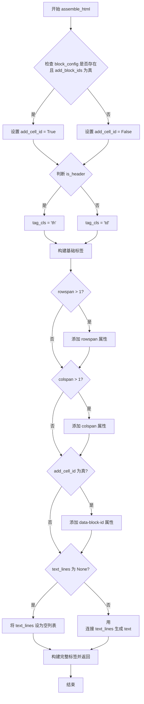

# `marker\marker\schema\blocks\tablecell.py` 详细设计文档

该代码定义了一个TableCell类，用于表示表格中的单元格。该类继承自Block类，包含rowspan、colspan、row_id、col_id、is_header等属性用于描述单元格的布局信息，并提供text属性获取单元格文本内容，以及assemble_html方法将单元格转换为HTML格式。

## 整体流程

```mermaid
graph TD
    A[创建TableCell实例] --> B{text_lines是否为空?}
    B -- 是 --> C[设置text_lines为空列表]
    B -- 否 --> D[获取text属性]
    D --> E[调用assemble_html方法]
    E --> F[获取block_config设置]
    F --> G{add_block_ids为真?}
    G -- 是 --> H[添加data-block-id属性]
    G -- 否 --> I[不添加data-block-id属性]
    H --> J[判断is_header属性]
    I --> J
    J -- 是 --> K[使用th标签]
    J -- 否 --> L[使用td标签]
    K --> M[添加rowspan属性(如果>1)]
    L --> M
    M --> N[添加colspan属性(如果>1)]
    N --> O[生成完整HTML字符串]
```

## 类结构

```
Block (抽象基类/父类)
└── TableCell (表格单元格实现类)
```

## 全局变量及字段


### `TableCell.block_type`
    
块类型，固定为BlockTypes.TableCell

类型：`BlockTypes`
    


### `TableCell.rowspan`
    
单元格跨行数

类型：`int`
    


### `TableCell.colspan`
    
单元格跨列数

类型：`int`
    


### `TableCell.row_id`
    
单元格所在行ID

类型：`int`
    


### `TableCell.col_id`
    
单元格所在列ID

类型：`int`
    


### `TableCell.is_header`
    
是否为表头单元格

类型：`bool`
    


### `TableCell.text_lines`
    
单元格文本行列表

类型：`List[str] | None`
    


### `TableCell.block_description`
    
块描述信息，默认为'A cell in a table.'

类型：`str`
    
    

## 全局函数及方法


### `TableCell.text`

该属性是 `TableCell` 类的只读属性，用于获取表格单元格的文本内容。它将存储在 `text_lines` 列表中的多行文本用换行符连接起来，形成一个完整的单元格文本字符串返回。

参数：此属性无需显式参数（使用隐式的 `self` 参数）

返回值：`str`，返回 `text_lines` 列表中所有元素用换行符连接后的字符串。如果 `text_lines` 为 `None`，调用 `join` 方法会抛出 `TypeError`。

#### 流程图

```mermaid
flowchart TD
    A[访问 text 属性] --> B[获取 self.text_lines]
    B --> C{text_lines 是否为 None}
    C -->|是| D[TypeError: can only join an iterable]
    C -->|否| E[执行 "\n".join self.text_lines]
    E --> F[返回连接后的字符串]
```

#### 带注释源码

```python
@property
def text(self):
    """
    获取表格单元格的文本内容。
    将 text_lines 列表中的所有行用换行符连接起来。
    
    Returns:
        str: 连接后的文本字符串
        
    Raises:
        TypeError: 当 text_lines 为 None 时会抛出此异常
    """
    # 使用换行符 "\n" 将 text_lines 列表中的所有字符串元素连接成一个字符串
    return "\n".join(self.text_lines)
```


### `TableCell.assemble_html`

该方法根据单元格的属性（是否为表头、跨行跨列数、文本内容等）组装并返回该单元格对应的HTML标签字符串，支持可选的块ID标记。

参数：

- `document`：任意类型，文档对象，用于提供上下文（当前实现中未直接使用）
- `child_blocks`：任意类型，子块列表，用于提供上下文（当前实现中未直接使用）
- `parent_structure`：任意类型（可为空），父结构信息，可选参数
- `block_config`：字典类型（可为空），块配置选项，用于控制行为（如是否添加块ID）

返回值：`str`，返回组装完成的HTML字符串，格式为`<th>...</th>`或`<td>...</td>`，包含rowspan、colspan、data-block-id等属性

#### 流程图



#### 带注释源码

```python
def assemble_html(
    self, document, child_blocks, parent_structure=None, block_config=None
):
    # 从 block_config 中获取 add_block_ids 配置，若不存在或 block_config 为 None 则返回 False
    add_cell_id = block_config and block_config.get("add_block_ids", False)

    # 根据 is_header 属性判断使用 th 标签（表头）还是 td 标签（数据单元格）
    tag_cls = "th" if self.is_header else "td"
    
    # 初始化标签字符串，以标签名开头
    tag = f"<{tag_cls}"
    
    # 如果跨行数大于 1，添加 rowspan 属性
    if self.rowspan > 1:
        tag += f" rowspan={self.rowspan}"
    
    # 如果跨列数大于 1，添加 colspan 属性
    if self.colspan > 1:
        tag += f" colspan={self.colspan}"
    
    # 如果配置中启用了添加块 ID，则添加 data-block-id 属性
    if add_cell_id:
        tag += f' data-block-id="{self.id}"'
    
    # 如果 text_lines 为 None，初始化为空列表，避免后续 join 操作报错
    if self.text_lines is None:
        self.text_lines = []
    
    # 将文本行用 <br> 标签连接，实现换行效果
    text = "<br>".join(self.text_lines)
    
    # 返回完整的 HTML 标签字符串，包含开始标签、内容和结束标签
    return f"{tag}>{text}</{tag_cls}>"
```

## 关键组件


### TableCell 类

表示PDF或文档中表格的单元格组件，封装单元格的行列跨越信息、位置信息、文本内容及HTML组装逻辑。

### block_type (BlockTypes.TableCell)

标识该Block为表格单元格类型的枚举值，用于文档解析时的类型识别与分类处理。

### rowspan 与 colspan 属性

表示单元格跨越的行数和列数，支持合并单元格的HTML表格渲染。

### row_id 与 col_id 属性

标识单元格在表格中的行列坐标位置，用于表格结构重建和单元格定位。

### is_header 属性

布尔标识符，标记该单元格是否为表头单元格，决定HTML渲染时使用th还是td标签。

### text_lines 属性 (惰性加载)

存储单元格内的多行文本内容，可为None以支持惰性加载机制，在实际需要文本时再进行填充。

### text 属性 (惰性加载)

通过property装饰器实现的文本读取属性，将text_lines列表以换行符连接成单字符串，支持按需计算。

### assemble_html 方法

将表格单元格转换为HTML表格标签的核心方法，处理rowspan/colspan属性、块ID注入和文本格式化。


## 问题及建议


### 已知问题

-   **缺少字段默认值**：类字段 `rowspan`、`colspan`、`row_id`、`col_id`、`is_header` 未设置默认值，实例化时若未传入必要参数会导致 `AttributeError`
-   **text 属性空值风险**：`text` 属性直接调用 `"\n".join(self.text_lines)`，当 `text_lines` 为 `None` 时会抛出 `TypeError`
-   **text_lines 重复初始化**：在 `assemble_html` 方法内部重复检查并初始化 `self.text_lines = []`，逻辑冗余
-   **HTML 属性值缺少引号**：生成的 `rowspan` 和 `colspan` 属性值未加引号（如 `rowspan=2` 而非 `rowspan="2"`），不符合 HTML5 规范
-   **缺少类型注解**：方法参数 `document`、`child_blocks`、`parent_structure` 缺失类型注解，影响代码可维护性和 IDE 提示
-   **方法参数未使用**：`assemble_html` 方法接收 `document`、`child_blocks`、`parent_structure` 参数但未使用，造成接口污染

### 优化建议

-   为必填字段添加类型注解和默认值（如 `rowspan: int = 1`），或在 `__init__` 中进行必需性校验
-   在 `text` 属性中添加空值保护：`return "\n".join(self.text_lines or [])`
-   将 `text_lines` 的初始化移至 `__init__` 或使用 `field(default_factory=list)` 结合 dataclass
-   使用双引号包裹 HTML 属性值：`tag += f' rowspan="{self.rowspan}"'`
-   为方法参数添加类型注解：`def assemble_html(self, document: Any, child_blocks: List[Any], ...)`
-   移除未使用的参数或添加 `_` 前缀表示忽略：`def assemble_html(self, document, child_blocks, _=None, block_config=None)`
-   添加 docstring 文档说明类和方法用途


## 其它


### 设计目标与约束

本代码的设计目标是实现表格单元的数据结构表示与HTML渲染功能。核心约束包括：1）必须继承自Block基类以保持与marker框架的一致性；2）rowspan和colspan属性需符合HTML标准规范；3）text_lines为可选字段，需处理None情况以避免运行时错误；4）assemble_html方法需支持配置化选项（如add_block_ids）。

### 错误处理与异常设计

代码中未显式抛出异常，但存在潜在错误场景：1）text_lines为None时，text属性调用会失败（AttributeError: 'NoneType' object has no attribute '__iter__'）；2）assemble_html方法假设document、child_blocks、parent_structure、block_config参数存在但未进行None检查；3）rowspan和colspan为int类型但未校验必须>=1。改进建议：在text属性中添加`if self.text_lines is None: return ""`的保护逻辑；在assemble_html方法入口处添加参数类型校验。

### 数据流与状态机

TableCell的生命周期为：初始化 → 设置text_lines → 调用assemble_html渲染。状态转换：text_lines从None转为List[str]或保持None；is_header决定渲染为th或td标签；rowspan/colspan决定是否添加rowspan/colspan属性。数据流向：外部document对象传入assemble_html但未使用（可能是框架预留参数），child_blocks参数同样未使用，表明当前实现为简化版本。

### 外部依赖与接口契约

主要依赖：1）marker.schema.BlockTypes枚举类，定义block_type必须为BlockTypes.TableCell；2）marker.schema.blocks.Block基类，提供id等基础属性。接口契约：1）assemble_html方法签名固定，document参数类型未限定，child_blocks预期为Block列表，parent_structure和block_config为可选配置字典；2）返回类型为str的HTML片段字符串。

### 配置与扩展性

block_config字典支持动态配置，当前仅实现add_block_ids选项。扩展建议：可添加style_config参数支持自定义CSS类，添加data_attributes参数支持任意data-*属性注入。is_header布尔字段设计良好，便于后续实现表头样式差异化处理。

    