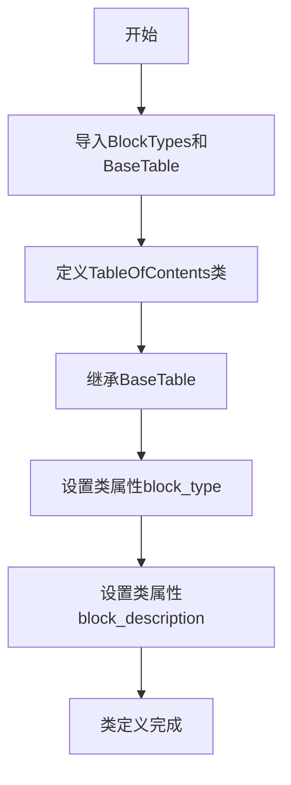

# `marker\marker\schema\blocks\toc.py` 详细设计文档

这是一个表格目录（Table of Contents）块模型类，继承自BaseTable，用于表示文档中的表格目录结构，定义了块类型为TableOfContents和相应的描述信息。

## 整体流程



## 类结构

```
BaseTable (抽象基类)
└── TableOfContents (表格目录类)
```

## 全局变量及字段


### `TableOfContents.block_type`
    
Block type identifier, set to BlockTypes.TableOfContents

类型：`str`
    


### `TableOfContents.block_description`
    
Block description, set to 'A table of contents.'

类型：`str`
    
    

## 全局函数及方法


## 关键组件


### TableOfContents 类

表示文档目录的表格块，继承自BaseTable，用于解析和渲染文档的目录结构。

### BlockTypes 枚举

从marker.schema模块导入的枚举类型，用于标识不同的文档块类型，TableOfContents使用其TableOfContents值。

### BaseTable 基类

从marker.schema.blocks.basetable模块导入的基类，提供表格块的基础功能实现，包括块解析、渲染和属性管理。

### block_type 类字段

字符串类型，值为BlockTypes.TableOfContents，用于标识该块为目录表类型。

### block_description 类字段

字符串类型，值为"A table of contents."，提供该块的文本描述信息。


## 问题及建议


### 已知问题

- 类属性 `block_type` 和 `block_description` 使用硬编码的字符串字面量，缺乏灵活性，无法在运行时动态设置
- 类定义缺少文档字符串（docstring），无法直接了解该类的用途和设计意图
- 未使用 Pydantic 或数据验证框架，缺少对字段值的运行时验证
- 作为数据模型类，未定义 `__init__` 方法的参数校验或默认值处理逻辑
- 继承自 `BaseTable`，但未在当前代码中体现任何对父类特性的扩展或重写
- 未定义 `__repr__`、`__str__` 或 `__eq__` 等魔术方法，不利于调试和对象比较
- 字段命名使用下划线命名法（snake_case），但 `block_type` 和 `block_description` 未遵循类内部可能已有的命名规范

### 优化建议

- 为类添加文档字符串，描述其用途、适用场景及与父类的关系
- 考虑使用 Pydantic 模型定义字段，添加类型校验和默认值支持，例如使用 `Field(default=...)` 或 `fieldvalidator`
- 如果 `block_type` 和 `block_description` 应该为实例属性而非类属性，建议调整为实例属性并提供默认值
- 添加 `__repr__` 方法以提升调试体验，例如 `return f"TableOfContents(block_type={self.block_type!r})"`
- 定义 `model_config` 或 `Config` 类（如使用 Pydantic v2 或 v1），配置如 `str_strip_whitespace`、`frozen` 等行为
- 确认 `BlockTypes.TableOfContents` 枚举值的存在性，避免运行时 `AttributeError`
- 如该类会被频繁实例化，考虑添加 `__slots__` 以减少内存开销


## 其它


### 设计目标与约束

该类的设计目标是定义一个目录（Table Of Contents）块的类型，用于在文档结构中标识和区分目录内容。设计约束包括：必须继承自BaseTable类，block_type和block_description属性为固定值，不可动态修改。

### 错误处理与异常设计

该类为简单的数据类，不涉及复杂的错误处理机制。属性类型检查由Python类型注解约束，属性值在类定义时固定，无需运行时验证。

### 数据流与状态机

该类作为数据模型使用，不涉及状态机逻辑。在文档解析流程中，TableOfContents实例作为Block节点存储在文档树结构中，用于表示PDF或文档中的目录区域。

### 外部依赖与接口契约

外部依赖包括：
- marker.schema.BlockTypes：用于定义块类型枚举
- marker.schema.blocks.basetable.BaseTable：基类，提供表格块的通用属性和方法

接口契约：必须实现BaseTable定义的接口，block_type必须为有效的BlockTypes枚举值。

### 配置与参数说明

该类无运行时配置参数。所有属性在类定义时以类变量的形式硬编码：
- block_type: 固定为BlockTypes.TableOfContents
- block_description: 固定为"A table of contents."

### 使用示例

```python
from marker.schema import BlockTypes

# 创建TableOfContents实例
toc = TableOfContents()

# 访问属性
print(toc.block_type)  # 输出: BlockTypes.TableOfContents
print(toc.block_description)  # 输出: A table of contents.
```

### 版本历史和变更记录

初始版本（v1.0）：实现基本的目录块类型定义，继承BaseTable类。

### 测试策略

该类可通过单元测试验证：
- 验证block_type属性值正确
- 验证block_description属性值正确
- 验证类继承关系正确
- 验证类型注解正确

### 性能考虑

该类为轻量级数据类，实例化开销极低，无性能瓶颈。在大规模文档处理场景中，内存占用取决于BaseTable基类的实现。

    