# `marker\marker\schema\document.py` 详细设计文档

这是一个文档渲染和处理的核心模块，定义了Document类用于管理文档的页面、块结构，并提供HTML渲染、目录生成、块遍历等功能的文档处理框架。

## 整体流程

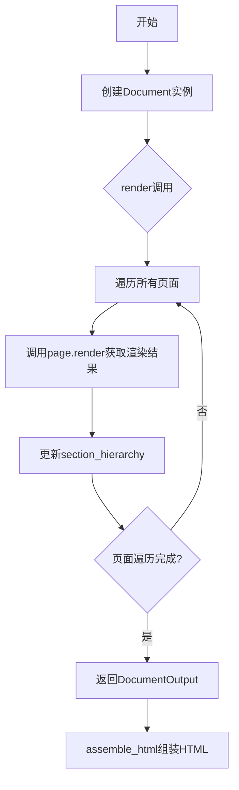

## 类结构

```
DocumentOutput (Pydantic模型)
TocItem (Pydantic模型)
Document (Pydantic模型 - 主类)
```

## 全局变量及字段


### `child_content`
    
存储每个页面渲染后的子内容列表

类型：`list`
    


### `section_hierarchy`
    
记录文档的章节层级结构

类型：`dict`
    


### `DocumentOutput.children`
    
子块输出列表，包含文档的所有子块渲染结果

类型：`List[BlockOutput]`
    


### `DocumentOutput.html`
    
渲染后的HTML内容，表示整个文档的HTML表示

类型：`str`
    


### `DocumentOutput.block_type`
    
块类型，默认为Document，用于标识输出类型

类型：`BlockTypes`
    


### `TocItem.title`
    
标题文本，表示目录项的标题内容

类型：`str`
    


### `TocItem.heading_level`
    
标题级别，表示标题在文档层级中的深度

类型：`int`
    


### `TocItem.page_id`
    
页面ID，标识目录项所属的页面

类型：`int`
    


### `TocItem.polygon`
    
多边形坐标，定义标题在页面中的位置区域

类型：`List[List[float]]`
    


### `Document.filepath`
    
文件路径，标识文档源文件的路径

类型：`str`
    


### `Document.pages`
    
页面组列表，包含文档的所有页面对象

类型：`List[PageGroup]`
    


### `Document.block_type`
    
块类型，默认为Document，标识文档块类型

类型：`BlockTypes`
    


### `Document.table_of_contents`
    
目录项列表，包含文档的目录结构信息

类型：`List[TocItem] | None`
    


### `Document.debug_data_path`
    
调试数据路径，指向调试数据保存的位置

类型：`str | None`
    
    

## 全局函数及方法


### `Document.get_block`

根据给定的 BlockId 获取对应的文档块。该方法首先根据 block_id 中的 page_id 获取目标页面，然后在页面中查找并返回指定的块，如果未找到则返回 None。

参数：

- `block_id`：`BlockId`，需要获取的块的唯一标识符，包含 page_id 和块的其他标识信息

返回值：`Optional[Block]`，如果找到对应的块则返回该块对象，否则返回 None

#### 流程图

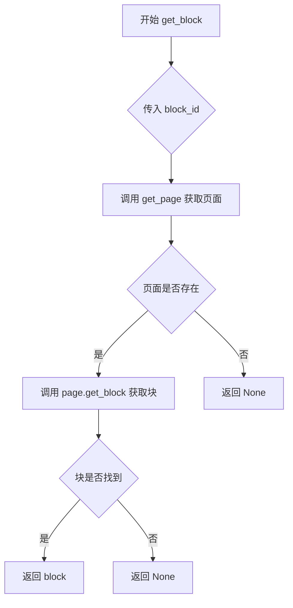

#### 带注释源码

```python
def get_block(self, block_id: BlockId):
    """
    根据 BlockId 获取对应的文档块
    
    Args:
        block_id: 块的唯一标识符，包含页面ID和块ID信息
        
    Returns:
        找到的 Block 对象，如果未找到则返回 None
    """
    # 第一步：根据 block_id 中的 page_id 获取目标页面对象
    page = self.get_page(block_id.page_id)
    
    # 第二步：在页面中查找指定 ID 的块
    block = page.get_block(block_id)
    
    # 第三步：判断块是否找到
    if block:
        # 找到则返回该块
        return block
    
    # 未找到块，返回 None
    return None
```


### `Document.get_page`

根据给定的 `page_id` 在文档的页面列表中查找并返回对应的 `PageGroup` 对象，如果未找到则返回 `None`。

参数：

- `page_id`：`int`，页面的唯一标识符，用于在页面列表中定位目标页面

返回值：`PageGroup | None`，返回匹配 `page_id` 的 `PageGroup` 页面对象；如果未找到对应页面则返回 `None`

#### 流程图

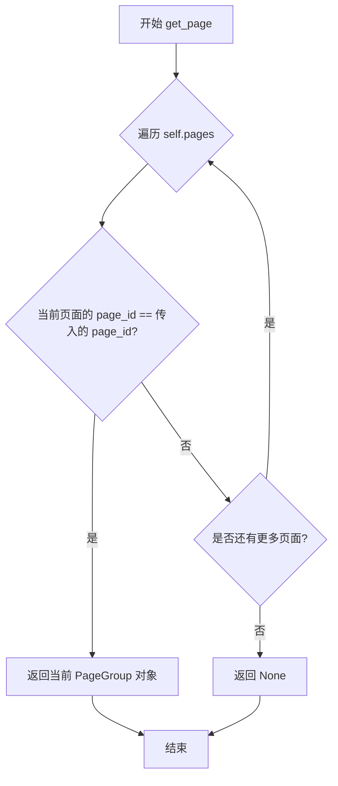

#### 带注释源码

```python
def get_page(self, page_id):
    """
    根据 page_id 获取页面对象
    
    参数:
        page_id: int - 页面的唯一标识符
    
    返回:
        PageGroup | None - 找到的页面对象，未找到则返回 None
    """
    # 遍历文档中的所有页面
    for page in self.pages:
        # 检查当前页面的 page_id 是否匹配目标 page_id
        if page.page_id == page_id:
            # 匹配成功，返回该 PageGroup 对象
            return page
    # 遍历完所有页面均未匹配，返回 None
    return None
```


### `Document.get_next_block`

获取文档中下一个块的函数，首先在当前页查找下一个块，如果当前页没有找到，则依次在后续页面中查找第一个符合条件的块。

参数：

- `block`：`Block`，当前参考块，函数将查找此块之后的下一个块
- `ignored_block_types`：`List[BlockTypes] | None`，可选参数，要忽略的块类型列表，用于过滤不需要的块类型，默认为 `None`（即不忽略任何类型）

返回值：`Block | None`，返回找到的下一个块对象，如果不存在则返回 `None`

#### 流程图

```mermaid
flowchart TD
    A[开始 get_next_block] --> B{ignored_block_types is None?}
    B -->|是| C[初始化为空列表 []]
    B -->|否| D[使用传入的 ignored_block_types]
    C --> E[获取 block 所在页面]
    D --> E
    E --> F[在当前页面调用 page.get_next_block]
    F --> G{找到下一个块?}
    G -->|是| H[返回找到的块]
    G -->|否| I[遍历后续页面]
    I --> J[在当前后续页面调用 page.get_next_block None]
    J --> K{找到下一个块?}
    K -->|是| H
    K -->|否| L[继续下一个后续页面]
    L --> I
    I --> M{所有后续页面遍历完毕?}
    M -->|是| N[返回 None]
    M -->|否| J
    H --> O[结束]
    N --> O
```

#### 带注释源码

```python
def get_next_block(
    self, block: Block, ignored_block_types: List[BlockTypes] = None
):
    # 如果未指定忽略的块类型，初始化为空列表
    if ignored_block_types is None:
        ignored_block_types = []
    next_block = None

    # 步骤1: 尝试在当前页查找下一个块
    # 获取当前块所在的页面对象
    page = self.get_page(block.page_id)
    # 调用页面级方法获取当前页的下一个块
    next_block = page.get_next_block(block, ignored_block_types)
    # 如果在当前页找到，直接返回
    if next_block:
        return next_block

    # 步骤2: 当前页没有找到时，搜索后续页面
    # 从当前页的索引位置开始，遍历后续所有页面
    for page in self.pages[self.pages.index(page) + 1 :]:
        # 在每个后续页面中查找第一个块（block参数为None表示获取第一个块）
        next_block = page.get_next_block(None, ignored_block_types)
        # 如果在后续页面中找到块，立即返回
        if next_block:
            return next_block

    # 步骤3: 所有页面都未找到，返回None
    return None
```


### `Document.get_next_page`

该方法用于获取文档中指定页的下一页。如果指定页是文档的最后一页，则返回 None；否则返回下一页的 PageGroup 对象。

参数：

- `page`：`PageGroup`，需要获取下一页的目标页对象

返回值：`PageGroup | None`，返回文档中的下一页 PageGroup 对象，如果已经是最后一页则返回 None

#### 流程图

```mermaid
flowchart TD
    A[开始 get_next_page] --> B[获取page在self.pages中的索引 page_idx]
    B --> C{page_idx + 1 < len(self.pages)?}
    C -->|是| D[返回 self.pages[page_idx + 1]]
    C -->|否| E[返回 None]
    D --> F[结束]
    E --> F
```

#### 带注释源码

```python
def get_next_page(self, page: PageGroup):
    """
    获取当前页的下一页
    
    参数:
        page: PageGroup - 当前页对象
        
    返回:
        PageGroup | None - 下一页的PageGroup对象，如果当前页是最后一页则返回None
    """
    # 获取当前页在pages列表中的索引位置
    page_idx = self.pages.index(page)
    
    # 检查当前页是否还有后续页
    if page_idx + 1 < len(self.pages):
        # 返回下一页（索引+1）
        return self.pages[page_idx + 1]
    
    # 当前页已是最后一页，返回None
    return None
```


### `Document.get_prev_block`

获取指定块的前一个块。如果当前页中没有前一个块，则查找前一页的最后一个块。

参数：

- `block`：`Block`，需要获取其前一个块的块对象

返回值：`Block | None`，返回前一个块对象，如果不存在则返回 `None`

#### 流程图

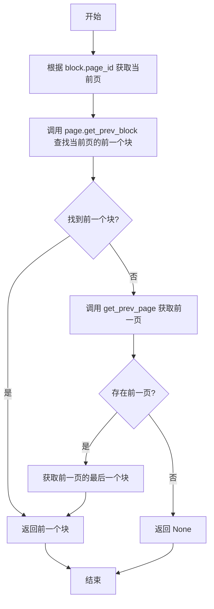

#### 带注释源码

```python
def get_prev_block(self, block: Block):
    # 根据 block 所在的页面 ID 获取对应的页面对象
    page = self.get_page(block.page_id)
    
    # 在当前页面中查找指定块的前一个块
    prev_block = page.get_prev_block(block)
    
    # 如果在当前页面中找到了前一个块，则直接返回
    if prev_block:
        return prev_block
    
    # 如果当前页面没有前一个块，则尝试获取前一页
    prev_page = self.get_prev_page(page)
    
    # 如果不存在前一页（即当前页是第一页），则返回 None
    if not prev_page:
        return None
    
    # 获取前一页的最后一个块（structure[-1] 表示最后一结构）
    # 并将其作为前一个块返回
    return prev_page.get_block(prev_page.structure[-1])
```


### `Document.get_prev_page`

获取指定页面的上一页页面对象。如果当前页面是文档的第一页（索引为0），则返回 None。

参数：

- `page`：`PageGroup`，需要获取其上一页的页面对象

返回值：`PageGroup | None`，返回上一页的 PageGroup 对象，如果当前页面是第一页则返回 None

#### 流程图

```mermaid
flowchart TD
    A([开始 get_prev_page]) --> B[获取 page 在 self.pages 列表中的索引 page_idx]
    B --> C{page_idx > 0?}
    C -->|是| D[返回 self.pages[page_idx - 1]]
    C -->|否| E[返回 None]
    D --> F([结束])
    E --> F
```

#### 带注释源码

```python
def get_prev_page(self, page: PageGroup):
    """
    获取指定页面的上一页。
    
    Args:
        page: PageGroup, 需要获取上一页的页面对象
        
    Returns:
        PageGroup | None: 返回上一页的 PageGroup 对象，
                         如果当前页面是第一页则返回 None
    """
    # 获取当前页面在 pages 列表中的索引位置
    page_idx = self.pages.index(page)
    
    # 判断当前页面是否为第一页（索引大于 0 表示存在上一页）
    if page_idx > 0:
        # 返回上一页（当前索引减 1）
        return self.pages[page_idx - 1]
    
    # 当前页面是第一页，没有上一页，返回 None
    return None
```


### `Document.assemble_html`

该方法接收一个子块列表，遍历每个块并生成对应的 `<content-ref>` HTML标签，最终拼接并返回完整的HTML模板字符串。

参数：

- `child_blocks`：`List[Block]`，需要组装成HTML内容的子块列表
- `block_config`：`Optional[dict]`（可选），用于配置渲染行为的字典参数，当前未使用

返回值：`str`，返回拼接好的HTML模板字符串

#### 流程图

```mermaid
flowchart TD
    A[开始 assemble_html] --> B[初始化空字符串 template = '']
    B --> C{遍历 child_blocks 中的每个块 c}
    C -->|对每个块 c| D[生成 content-ref 标签: f"<content-ref src='{c.id}'></content-ref>"]
    D --> E[将标签追加到 template]
    E --> C
    C -->|遍历完成| F[返回 template]
    F --> G[结束]
```

#### 带注释源码

```python
def assemble_html(
    self, child_blocks: List[Block], block_config: Optional[dict] = None
):
    """
    组装HTML内容引用标签
    
    Args:
        child_blocks: 子块列表，用于生成HTML引用
        block_config: 可选的块配置字典（当前未使用）
    
    Returns:
        拼接好的HTML模板字符串
    """
    template = ""  # 初始化空字符串用于拼接HTML模板
    for c in child_blocks:  # 遍历每个子块
        # 为每个块生成content-ref标签，src属性使用块的id
        template += f"<content-ref src='{c.id}'></content-ref>"
    return template  # 返回拼接完成的HTML模板
```


### `Document.render`

该方法负责将文档的所有页面渲染为结构化的输出，包括子内容和HTML表示。它遍历文档中的每一页，调用页面的渲染方法，收集渲染结果，最后组合成完整的文档输出。

参数：

- `block_config`：`Optional[dict]`，可选的配置字典，用于控制渲染行为，例如指定要渲染的块类型、样式选项等。如果为 `None`，则使用默认配置。

返回值：`DocumentOutput`，包含渲染后的所有页面内容（`children`）和组装后的HTML字符串（`html`）。

#### 流程图

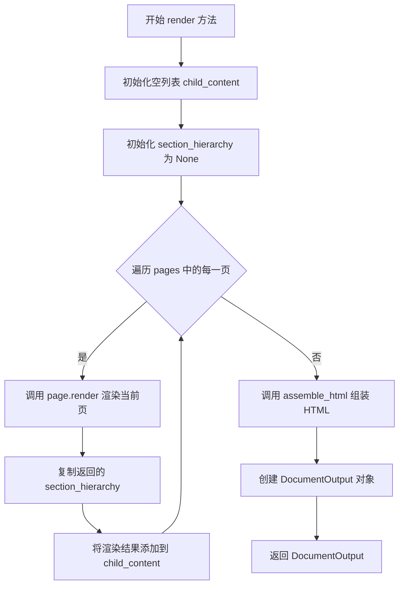

#### 带注释源码

```python
def render(self, block_config: Optional[dict] = None):
    """
    渲染整个文档为 DocumentOutput 对象。
    
    遍历文档中的所有页面，对每一页调用 render 方法，
    收集渲染结果并组装成最终的文档输出。
    
    参数:
        block_config: 可选的配置字典，用于控制渲染行为
    """
    # 用于存储所有页面的渲染结果
    child_content = []
    # 用于在页面间传递章节层级结构，初始为 None
    section_hierarchy = None
    
    # 遍历文档中的每一页
    for page in self.pages:
        # 调用页面的 render 方法进行渲染
        # 传入 self 作为文档引用，None 作为初始块，section_hierarchy 用于维持层级
        rendered = page.render(self, None, section_hierarchy, block_config)
        # 从渲染结果中复制章节层级结构，供下一页使用
        section_hierarchy = rendered.section_hierarchy.copy()
        # 将当前页的渲染结果添加到列表中
        child_content.append(rendered)

    # 使用 assemble_html 方法将所有子块组装成 HTML 字符串
    # 返回包含渲染内容和 HTML 的 DocumentOutput 对象
    return DocumentOutput(
        children=child_content,  # 所有页面的渲染结果列表
        html=self.assemble_html(child_content, block_config),  # 组装后的 HTML
    )
```


### `Document.contained_blocks`

获取文档中所有指定类型的块。该方法遍历文档的每一页，收集符合指定类型的块，并返回包含所有匹配块的列表。

参数：

- `block_types`：`Sequence[BlockTypes]`，可选，要筛选的块类型序列。如果为 `None`，则返回所有类型的块。

返回值：`List[Block]`，包含所有符合指定类型的块列表。

#### 流程图

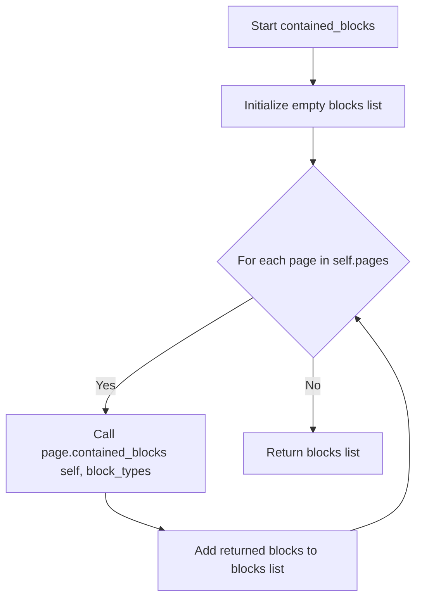

#### 带注释源码

```python
def contained_blocks(self, block_types: Sequence[BlockTypes] = None) -> List[Block]:
    """
    获取文档中所有指定类型的块。
    
    参数:
        block_types: 可选的块类型序列，用于过滤结果。
                     如果为 None，则返回所有块。
    
    返回:
        包含所有符合指定类型的块的列表。
    """
    blocks = []  # 初始化空列表，用于存储所有匹配的块
    for page in self.pages:  # 遍历文档中的每一页
        # 调用当前页的 contained_blocks 方法获取该页的块
        # 并将结果追加到 blocks 列表中
        blocks += page.contained_blocks(self, block_types)
    return blocks  # 返回累积的所有块
```


### `Document.get_block`

获取指定页面中的指定块，通过页面ID定位页面，再通过块ID在页面中查找对应的块。

参数：

- `block_id`：`BlockId`，要获取的块的标识符，包含页面ID和块ID信息

返回值：`Optional[Block]`，如果找到则返回对应的块对象，否则返回 `None`

#### 流程图

```mermaid
flowchart TD
    A[开始 get_block] --> B[根据 block_id.page_id 获取页面]
    B --> C[调用 page.get_block(block_id) 获取块]
    C --> D{块是否存在?}
    D -->|是| E[返回 block]
    D -->|否| F[返回 None]
    E --> G[结束]
    F --> G
```

#### 带注释源码

```python
def get_block(self, block_id: BlockId):
    """
    获取指定块
    
    参数:
        block_id: 块的唯一标识符，包含page_id和block_id信息
    
    返回:
        如果找到对应块返回Block对象，否则返回None
    """
    # 根据块ID中的页面ID获取对应的页面对象
    page = self.get_page(block_id.page_id)
    
    # 在页面中查找指定ID的块
    block = page.get_block(block_id)
    
    # 如果找到块则返回，否则返回None
    if block:
        return block
    return None
```


### `Document.get_page`

该方法根据给定的 `page_id` 在文档的所有页面中查找并返回对应的 `PageGroup` 对象。如果找到匹配的页面则返回该页面对象，否则返回 `None`。

参数：

- `page_id`：`int`，要查找的页面的标识符

返回值：`Optional[PageGroup]`，如果找到对应页面则返回 `PageGroup` 对象，否则返回 `None`

#### 流程图

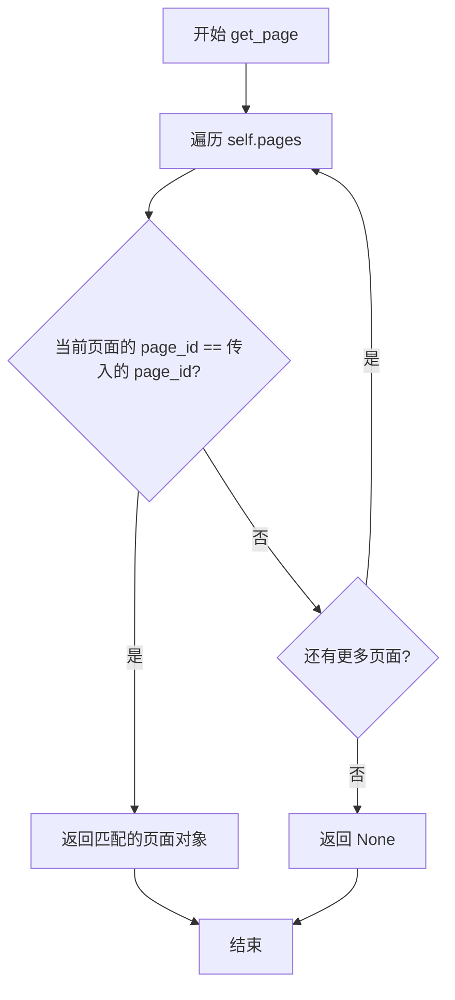

#### 带注释源码

```python
def get_page(self, page_id):
    """
    根据页面ID获取页面对象
    
    参数:
        page_id: 页面的唯一标识符
        
    返回:
        如果找到对应页面返回PageGroup对象，否则返回None
    """
    # 遍历文档中的所有页面
    for page in self.pages:
        # 检查当前页面的ID是否匹配目标ID
        if page.page_id == page_id:
            # 匹配成功，返回该页面对象
            return page
    # 遍历完所有页面未找到匹配项，返回None
    return None
```


### `Document.get_next_block`

获取指定块的下一个块，支持在同一页面内查找，如果当前页面没有后续块，则继续在后续页面中查找。

参数：

- `block`：`Block`，当前块的引用，方法将查找此块的下一个块
- `ignored_block_types`：`List[BlockTypes] | None`，可选参数，指定在查找过程中需要忽略的块类型列表，默认为空列表

返回值：`Block | None`，返回找到的下一个块对象，如果不存在下一个块则返回 `None`

#### 流程图

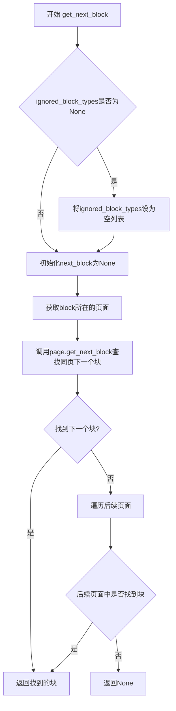

#### 带注释源码

```python
def get_next_block(
    self, block: Block, ignored_block_types: List[BlockTypes] = None
):
    # 如果未指定忽略的块类型，初始化为空列表
    if ignored_block_types is None:
        ignored_block_types = []
    next_block = None

    # 步骤1：尝试在当前页面内查找下一个块
    # 获取当前块所在的页面对象
    page = self.get_page(block.page_id)
    # 调用页面级别的get_next_block方法在当前页查找
    next_block = page.get_next_block(block, ignored_block_types)
    # 如果在当前页找到下一个块，直接返回
    if next_block:
        return next_block

    # 步骤2：如果当前页面没有找到下一个块，搜索后续页面
    # 从当前页面之后的所有页面中查找
    for page in self.pages[self.pages.index(page) + 1 :]:
        # 在每个后续页面中查找第一个有效块（传入None作为block参数）
        next_block = page.get_next_block(None, ignored_block_types)
        # 一旦找到就直接返回
        if next_block:
            return next_block
    
    # 步骤3：所有页面都搜索完毕，仍未找到下一个块，返回None
    return None
```


### `Document.get_next_page`

该方法用于获取文档中指定页的下一页。如果当前页不是最后一页，则返回下一页的 `PageGroup` 对象；否则返回 `None`。

参数：

- `page`：`PageGroup`，需要获取下一页的当前页对象

返回值：`PageGroup | None`，如果存在下一页则返回该页对象，否则返回 `None`

#### 流程图

```mermaid
flowchart TD
    A[开始 get_next_page] --> B[获取 page 在 self.pages 列表中的索引 page_idx]
    B --> C{page_idx + 1 < len(self.pages)?}
    C -->|是| D[返回 self.pages[page_idx + 1]]
    C -->|否| E[返回 None]
    D --> F[结束]
    E --> F
```

#### 带注释源码

```python
def get_next_page(self, page: PageGroup):
    """
    获取指定页的下一页
    
    参数:
        page: PageGroup - 当前页对象
        
    返回:
        PageGroup | None - 下一页对象，如果不存在则返回 None
    """
    # 获取当前页在 pages 列表中的索引位置
    page_idx = self.pages.index(page)
    
    # 检查是否存在下一页（当前索引 +1 小于列表长度）
    if page_idx + 1 < len(self.pages):
        # 返回下一页
        return self.pages[page_idx + 1]
    
    # 当前页是最后一页，返回 None
    return None
```


### `Document.get_prev_block`

获取给定块的前一个块。如果当前页没有前一个块，则查找前一页的最后一个块。

参数：

- `block`：`Block`，需要获取前一个块的块对象

返回值：`Optional[Block]`，返回前一个块对象，如果没有前一个块则返回 `None`

#### 流程图

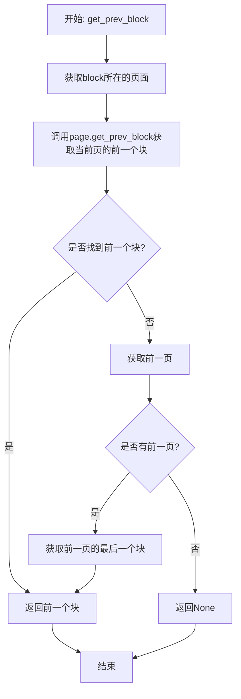

#### 带注释源码

```python
def get_prev_block(self, block: Block):
    """
    获取给定块的前一个块。
    逻辑：
    1. 首先在当前页查找前一个块
    2. 如果当前页没有前一个块，则查找前一页的最后一个块
    3. 如果没有前一页，则返回None
    
    参数:
        block: Block - 需要获取前一个块的块对象
        
    返回:
        Optional[Block] - 前一个块对象，如果没有前一个块则返回None
    """
    # 步骤1: 获取当前块所在的页面对象
    page = self.get_page(block.page_id)
    
    # 步骤2: 尝试在当前页面获取前一个块
    prev_block = page.get_prev_block(block)
    
    # 步骤3: 如果在当前页找到前一个块，直接返回
    if prev_block:
        return prev_block
    
    # 步骤4: 当前页没有前一个块，获取前一页
    prev_page = self.get_prev_page(page)
    
    # 步骤5: 如果没有前一页（当前块是第一页的第一个块），返回None
    if not prev_page:
        return None
    
    # 步骤6: 返回前一页的最后一个块（structure列表的最后一个元素）
    # prev_page.structure存储了页面中所有块的引用
    return prev_page.get_block(prev_page.structure[-1])
```


### `Document.get_prev_page`

获取指定页面的前一页。如果当前页面不是第一页，则返回前一页的 `PageGroup` 对象；否则返回 `None`。

参数：

-  `page`：`PageGroup`，需要获取其前一页的页面对象

返回值：`PageGroup | None`，如果存在前一页则返回该页面的 `PageGroup` 对象，否则返回 `None`

#### 流程图

```mermaid
flowchart TD
    A[开始: get_prev_page] --> B[获取页面索引 page_idx = self.pages.index(page)]
    B --> C{page_idx > 0?}
    C -->|是| D[返回 self.pages[page_idx - 1]]
    C -->|否| E[返回 None]
    D --> F[结束]
    E --> F
```

#### 带注释源码

```python
def get_prev_page(self, page: PageGroup):
    """
    获取指定页面的前一页。
    
    参数:
        page: PageGroup - 需要获取其前一页的页面对象
        
    返回:
        PageGroup | None - 如果存在前一页则返回该页面，否则返回 None
    """
    # 获取当前页面在页面列表中的索引位置
    page_idx = self.pages.index(page)
    
    # 检查当前页面是否是第一页
    if page_idx > 0:
        # 不是第一页，返回前一页（索引减1）
        return self.pages[page_idx - 1]
    
    # 是第一页，没有前一页，返回 None
    return None
```


### `Document.assemble_html`

该方法用于将文档的子块（child_blocks）组装成HTML模板字符串，通过遍历所有子块并为每个块生成对应的`<content-ref>`标签来构建最终的HTML表示。

参数：

- `self`：隐式参数，Document 类的实例，代表当前文档对象
- `child_blocks`：`List[Block]`，需要组装成HTML的子块列表，这些块将被遍历并生成对应的content-ref标签
- `block_config`：`Optional[dict]`，可选的块配置字典，用于自定义块的处理方式（当前实现中未被使用）

返回值：`str`，返回生成的HTML模板字符串，其中每个子块都被包装在`<content-ref src='{block.id}'></content-ref>`标签中

#### 流程图

```mermaid
flowchart TD
    A[开始 assemble_html] --> B[初始化空模板字符串 template = '']
    B --> C{遍历 child_blocks 中的每个块}
    C -->|是| D[获取当前块的 id]
    D --> E[生成 content-ref 标签: f"<content-ref src='{c.id}'></content-ref>"]
    E --> F[将标签追加到 template]
    F --> C
    C -->|否| G[返回 template 字符串]
    G --> H[结束]
```

#### 带注释源码

```python
def assemble_html(
    self, child_blocks: List[Block], block_config: Optional[dict] = None
):
    """
    将子块组装成HTML模板
    
    参数:
        child_blocks: List[Block] - 要组装的子块列表
        block_config: Optional[dict] - 可选的块配置（当前未使用）
    
    返回:
        str - 生成的HTML模板字符串
    """
    # 初始化空模板字符串，用于存储最终的HTML内容
    template = ""
    
    # 遍历所有子块，为每个块生成content-ref标签
    for c in child_blocks:
        # 使用f-string生成content-ref标签，src属性设置为块的id
        # 这个标签用于引用文档中的具体块内容
        template += f"<content-ref src='{c.id}'></content-ref>"
    
    # 返回组装完成的HTML模板字符串
    return template
```


### `Document.render`

该方法负责遍历文档中的所有页面，依次调用每个页面的渲染方法，将渲染结果收集起来，最后组装成包含所有子内容和 HTML 表示的 DocumentOutput 对象返回。

参数：

- `block_config`：`Optional[dict]`，可选的字典参数，用于配置块的渲染行为，例如指定哪些块类型需要特殊处理等

返回值：`DocumentOutput`，返回一个包含渲染后的页面内容列表（children）以及组装好的 HTML 字符串（html）的文档输出对象

#### 流程图

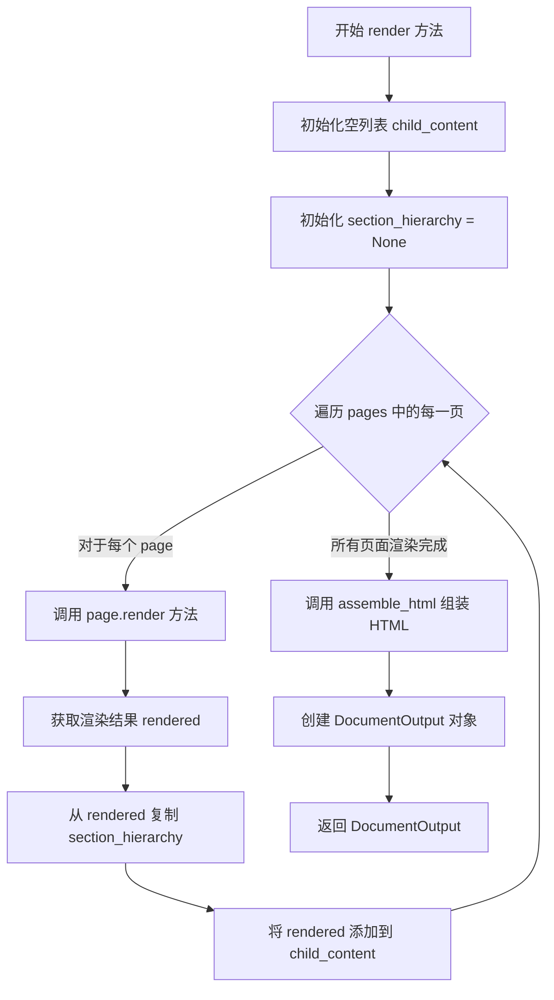

#### 带注释源码

```python
def render(self, block_config: Optional[dict] = None):
    """
    渲染整个文档，将所有页面渲染后组装成 DocumentOutput 对象
    
    参数:
        block_config: 可选的配置字典，用于控制块的渲染行为
    
    返回:
        DocumentOutput: 包含渲染后的页面内容列表和 HTML 字符串的对象
    """
    # 用于存储每个页面渲染后的结果
    child_content = []
    # 用于维护文档的章节层级结构，初始为 None
    section_hierarchy = None
    
    # 遍历文档中的所有页面
    for page in self.pages:
        # 调用页面的 render 方法进行渲染
        # 参数: self(文档引用), None(当前块), section_hierarchy(章节层级), block_config(块配置)
        rendered = page.render(self, None, section_hierarchy, block_config)
        
        # 从渲染结果中复制章节层级结构，供下一页使用
        section_hierarchy = rendered.section_hierarchy.copy()
        
        # 将渲染结果添加到子内容列表中
        child_content.append(rendered)

    # 返回文档输出对象，包含渲染后的页面内容和组装好的 HTML
    return DocumentOutput(
        children=child_content,  # 渲染后的页面列表
        html=self.assemble_html(child_content, block_config),  # 组装好的 HTML 字符串
    )
```


### `Document.contained_blocks`

获取文档中所有包含的块，根据指定的块类型过滤。

参数：

- `block_types`：`Sequence[BlockTypes] | None`，可选的块类型序列，用于过滤要返回的块类型。如果为 `None`，则返回所有类型的块。

返回值：`List[Block]`，返回包含的所有块对象列表。

#### 流程图

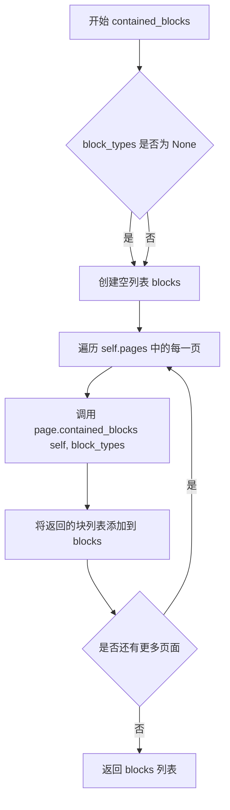

#### 带注释源码

```python
def contained_blocks(self, block_types: Sequence[BlockTypes] = None) -> List[Block]:
    """
    获取文档中所有包含的块，根据指定的块类型过滤。
    
    参数:
        block_types: 可选的块类型序列，用于过滤要返回的块类型。
                     如果为 None，则返回所有类型的块。
    
    返回:
        包含的所有块对象列表。
    """
    blocks = []  # 初始化一个空列表用于存储所有块
    for page in self.pages:  # 遍历文档中的每一页
        # 调用页面的 contained_blocks 方法获取该页的块
        # 参数 self 传递文档引用，block_types 用于过滤块类型
        blocks += page.contained_blocks(self, block_types)
    return blocks  # 返回累积的所有块列表
```

## 关键组件


### Document 类

主文档类，负责管理整个文档的结构和渲染。包含页面集合（pages）、文件路径（filepath）、目录（table_of_contents）等属性，提供了获取块、页面、导航块/页面、渲染文档等核心功能。

### DocumentOutput 类

文档输出模型，继承自 Pydantic BaseModel。用于存储渲染后的文档输出，包含子块列表（children）、HTML 字符串（html）和块类型（block_type）。

### TocItem 类

目录项模型，表示文档的目录结构。包含标题（title）、标题级别（heading_level）、页面 ID（page_id）和多边形区域（polygon）信息。

### get_block 方法

通过块 ID（BlockId）获取对应的块对象。先获取页面，再从页面中获取块，支持跨页查找。

### get_page 方法

根据页面 ID 获取对应的 PageGroup 对象。遍历所有页面进行匹配查找。

### get_next_block 方法

获取当前块的下一个块，支持忽略指定类型的块。先在当前页面查找，若未找到则搜索后续页面，实现跨页导航功能。

### get_prev_block 方法

获取当前块的上一个块，支持跨页查找。若当前页无前一块，则查找前一页的最后一块。

### render 方法

渲染整个文档的主方法。遍历所有页面，调用页面的 render 方法生成渲染结果，最后通过 assemble_html 组装 HTML 输出。

### assemble_html 方法

根据子块列表生成 HTML 内容模板。使用 content-ref 标签引用各个块，生成类似 `<content-ref src='{block_id}'></content-ref>` 的格式。

### contained_blocks 方法

获取文档中所有指定类型的块。遍历所有页面，收集满足类型条件的块并返回列表。

### PageGroup 依赖

Document 类依赖 PageGroup 类来表示和操作页面，需要从 marker.schema.groups.page 模块导入。

### BlockId 索引机制

代码通过 BlockId（包含 page_id 和块标识）实现对文档中任意块的索引和访问，支持精确的块定位和跨页导航。


## 问题及建议


### 已知问题

- **get_page方法使用线性搜索**：使用for循环遍历所有页面查找page_id，时间复杂度为O(n)，当文档页数较多时性能较差。
- **get_next_block方法中index调用效率低**：使用`self.pages.index(page)`获取页面索引是O(n)操作，且如果存在重复page_id会返回第一个匹配的索引，可能导致逻辑错误。
- **get_prev_block方法访问可能不存在的属性**：直接访问`prev_page.structure[-1]`，但structure属性可能不存在或结构不同，可能导致AttributeError。
- **assemble_html方法实现过于简单**：仅生成`<content-ref>`标签，未进行实际的HTML组装，与方法名称"assemble"不符，可能存在功能缺失。
- **类型注解不完整**：get_page方法缺少返回类型注解(get_page(self, page_id) -> ?)，影响代码可读性和类型检查。
- **get_block方法冗余**：get_block方法内部逻辑冗余，先获取page再获取block，但page.get_block已能完成相同功能。
- **table_of_contents属性未使用**：类中定义了table_of_contents属性，但在代码中未被任何方法使用或生成。

### 优化建议

- **使用字典映射优化页面查找**：将页面列表转换为以page_id为键的字典，可将get_page时间复杂度从O(n)降至O(1)。
- **缓存页面索引**：在Document初始化时建立page_id到页面索引的映射，避免重复调用index方法。
- **添加类型注解和参数校验**：完善get_page方法的返回类型注解，对page_id参数进行有效性校验。
- **重构get_prev_block逻辑**：在访问structure属性前进行存在性检查，或使用统一的blocks获取接口。
- **完善assemble_html实现**：根据实际需求实现真正的HTML组装逻辑，或重命名方法以反映其实际功能。
- **实现目录生成逻辑**：添加生成table_of_contents的方法，从页面内容中提取标题生成目录。
- **考虑使用__slots__**：如果Document类会被大量实例化，可考虑添加__slots__以减少内存开销。


## 其它


### 设计目标与约束

本文档定义了一个文档渲染系统的核心架构，旨在将包含多个页面的文档结构转换为HTML输出。该系统设计用于处理复杂的文档布局，支持目录生成、块级别导航和分层渲染。设计约束包括：依赖pydantic进行数据验证，使用marker.schema定义的块类型系统，确保文档块（Block）和页面组（PageGroup）之间的导航一致性。

### 错误处理与异常设计

代码中错误处理主要通过返回None来表示未找到的结果（如get_block、get_page、get_next_block等方法）。设计缺陷：未使用明确的异常类，而是依赖隐式的None返回值，可能导致调用方难以区分"未找到"与其他错误情况。优化建议：引入自定义异常类（如BlockNotFoundException、PageNotFoundException），并在方法文档中明确说明可能的异常场景。get_page方法存在潜在问题：当page_id不存在时返回None而非抛出异常。

### 数据流与状态机

文档渲染流程：1) 初始化Document对象（包含文件路径、页面列表、目录）；2) 调用render()方法启动渲染；3) 逐页遍历PageGroup进行渲染，保持section_hierarchy状态在页面间传递；4) 收集每页的渲染结果到child_content列表；5) 调用assemble_html()生成HTML模板（使用content-ref标签引用块ID）。状态转移：Document -> PageGroup -> Block -> BlockOutput。contained_blocks方法支持按块类型过滤筛选数据流。

### 外部依赖与接口契约

主要依赖：1) pydantic.BaseModel - 数据模型定义与验证；2) marker.schema.BlockTypes - 块类型枚举；3) marker.schema.blocks.Block/BlockId/BlockOutput - 块相关数据模型；4) marker.schema.groups.page.PageGroup - 页面组模型。接口契约：get_block(block_id: BlockId)返回Block|None；get_page(page_id)返回PageGroup|None；render()返回DocumentOutput；contained_blocks(block_types)返回List[Block]。调用方需保证BlockId包含有效的page_id属性，且页面列表pages已正确初始化。

### 性能考虑

性能瓶颈：1) get_page使用线性遍历O(n)查找页面，应建立page_id到页面的映射索引；2) get_next_block和get_prev_block涉及页面间搜索，可能产生多次迭代；3) contained_blocks每次调用都重新遍历所有页面和块，缺乏缓存机制。优化建议：为PageGroup建立索引字典，在Document初始化时构建页面索引以加速查找。

### 安全性考虑

代码本身不直接处理用户输入，但assemble_html方法生成HTML时直接使用块ID（c.id）拼接URL。需确保块ID经过适当转义防止XSS攻击。当前实现使用f-string直接拼接，建议使用HTML转义函数处理块ID。

### 配置说明

Document类接受以下配置参数：filepath（文档路径）、pages（PageGroup列表）、block_type（默认BlockTypes.Document）、table_of_contents（可选目录）、debug_data_path（可选调试数据路径）。render()和assemble_html()方法接受可选的block_config字典参数，用于传递渲染配置。

### 使用示例

```python
# 创建文档实例
doc = Document(
    filepath="/path/to/document.pdf",
    pages=[page1, page2, page3],
    table_of_contents=[TocItem(title="Intro", heading_level=1, page_id=1, polygon=[])]
)

# 渲染文档
output = doc.render()

# 获取特定块
block = doc.get_block(BlockId(page_id=1, block_id="block_123"))

# 获取目录
toc = doc.table_of_contents

# 按类型筛选块
text_blocks = doc.contained_blocks(block_types=[BlockTypes.Text])
```

    