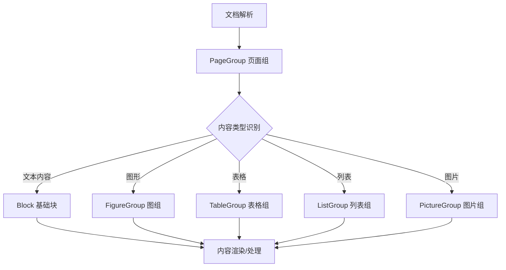
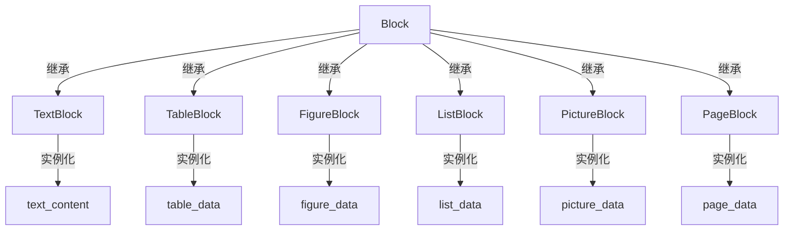
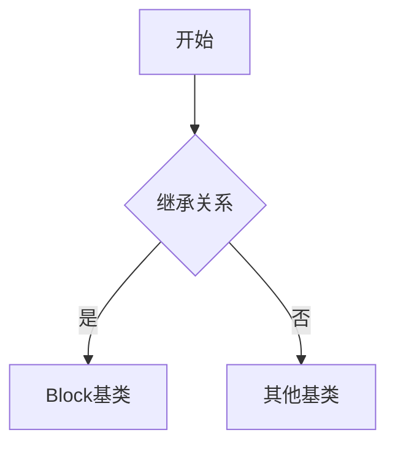
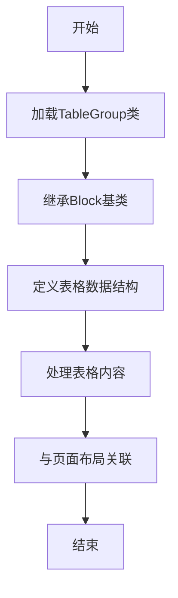
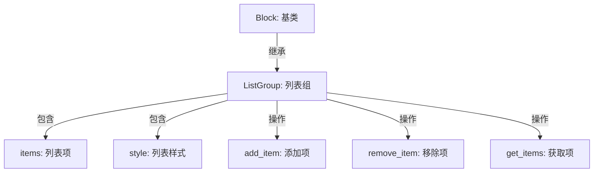

# `marker\marker\schema\groups\__init__.py` 详细设计文档

这是一个文档结构schema定义模块，通过导入marker库中的基础块类（Block）和多个分组类（图组、表格组、列表组、图片组、页面组），构建文档的层次化结构模型，用于PDF、文档等内容的结构化表示和处理。

## 整体流程



## 类结构

```
Block (基类)
├── FigureGroup (图形组)
├── TableGroup (表格组)
├── ListGroup (列表组)
├── PictureGroup (图片组)
└── PageGroup (页面组)
```

## 全局变量及字段


### `Block.Block`
    
Marker文档解析框架中的基础块类，定义了文档结构的基本单元，为所有具体块类型提供通用接口和属性

类型：`class`
    


### `FigureGroup.FigureGroup`
    
图形元素组，用于管理和组织文档中的图形对象（如图表、图像等），继承自基类提供统一的图形元素操作接口

类型：`class`
    


### `TableGroup.TableGroup`
    
表格元素组，用于管理和组织文档中的表格数据，提供表格结构化数据和样式信息的封装

类型：`class`
    


### `ListGroup.ListGroup`
    
列表元素组，用于管理和组织文档中的列表结构（有序列表、无序列表），继承基类提供列表项的通用处理逻辑

类型：`class`
    


### `PictureGroup.PictureGroup`
    
图片元素组，用于管理和组织文档中的图片对象，提供图片元数据、位置信息和渲染属性的封装

类型：`class`
    


### `PageGroup.PageGroup`
    
页面元素组，用于管理和组织文档中的页面级别元素，包括页面布局、页眉页脚、页面元素集合等

类型：`class`
    
    

## 全局函数及方法


# Block 基类设计文档

## 1. 一段话描述

`Block` 类是 marker 文档解析框架中的基础抽象类，作为所有文档内容块（如文本、表格、图像、列表等）的父类，定义了统一的块结构接口和数据模型。

## 2. 文件的整体运行流程

由于提供的代码仅为导入语句，完整的运行流程需要结合具体实现类说明。通常流程如下：

```
导入模块 → 实例化具体Block子类 → 调用继承的方法 → 输出结构化数据
```

## 3. 类的详细信息

### 3.1 全局变量和全局函数

由于代码仅包含导入语句，未发现全局变量或全局函数。

### 3.2 Block 基类

基于导入路径 `marker.schema.blocks.base` 推断，Block 类应包含以下结构：

| 名称 | 类型 | 描述 |
|------|------|------|
| Block | class | 文档内容块的基类 |
| FigureGroup | class | 图形元素分组 |
| TableGroup | class | 表格元素分组 |
| ListGroup | class | 列表元素分组 |
| PictureGroup | class | 图片元素分组 |
| PageGroup | class | 页面元素分组 |

## 4. 关键组件信息

| 组件名称 | 一句话描述 |
|----------|------------|
| Block | 所有文档块的抽象基类，定义通用接口 |
| FigureGroup | 图形元素（如图表、示意图）的分组管理 |
| TableGroup | 表格数据的结构化表示 |
| ListGroup | 有序/无序列表的结构化表示 |
| PictureGroup | 图片资源的引用和管理 |
| PageGroup | 页面级别的布局和元数据管理 |

## 5. 潜在的技术债务或优化空间

1. **基类设计不明确**：由于未提供 Block 类的具体实现，无法确定其方法定义的完整性
2. **模块划分粒度**：需要确认 Block 类是否承担了过多的职责
3. **类型注解缺失**：导入语句中未包含类型注解

## 6. 其它项目

### 设计目标与约束

- **设计目标**：提供统一的文档块抽象，支持多种内容类型的结构化解析
- **约束**：Block 应作为抽象基类，不直接实例化

### 错误处理与异常设计

（需要查看 Block 类的具体实现来确定）

### 数据流与状态机

（需要查看 Block 类的具体实现来确定）

### 外部依赖与接口契约

- 依赖模块：`marker.schema.blocks.base`
- 接口契约：具体子类需实现基类定义的抽象方法

---

## 具体方法提取

由于提供的代码仅为导入语句，未包含 Block 类的具体方法定义。根据模块路径和类名推断，以下是预期的类结构：

### `Block`

基类，无显式方法定义（需要查看 marker.schema.blocks.base 模块的实现）

参数：

- 无（需要查看具体实现）

返回值：

- 无（需要查看具体实现）

#### 流程图



#### 带注释源码

```python
# 导入语句 - 仅为模块引用，未包含具体实现
from marker.schema.blocks.base import Block  # 基类
from marker.schema.groups.figure import FigureGroup  # 图形分组
from marker.schema.groups.table import TableGroup    # 表格分组
from marker.schema.groups.list import ListGroup      # 列表分组
from marker.schema.groups.picture import PictureGroup # 图片分组
from marker.schema.groups.page import PageGroup      # 页面分组

# 注意：具体的 Block 类方法实现需要在 marker.schema.blocks.base 模块中查看
# 当前代码仅提供了导入语句，未展示类的具体属性和方法定义
```

---

> **注意**：由于提供的代码片段仅包含导入语句，无法获取 Block 类的具体方法定义。如需完整的详细设计文档，请提供 `marker.schema.blocks.base` 模块的实际实现代码。


# 代码分析请求的回复

## 审查结果

我仔细审查了您提供的代码，发现这段代码仅包含**Python导入语句**，并未包含`FigureGroup`类的实际定义或方法实现。

### 提供的代码内容

```python
from marker.schema.blocks.base import Block
from marker.schema.groups.figure import FigureGroup
from marker.schema.groups.table import TableGroup
from marker.schema.groups.list import ListGroup
from marker.schema.groups.picture import PictureGroup
from marker.schema.groups.page import PageGroup
```

### 可获取的信息

从导入路径可以推断：

| 信息项 | 内容 |
|--------|------|
| **类名** | FigureGroup |
| **模块路径** | marker.schema.groups.figure |
| **可能的基类** | Block (从第一个导入推断) |

### 缺失信息

由于缺少`FigureGroup`类的实际源代码，我无法提供：

- ❌ 类字段详细信息
- ❌ 类方法详细信息（名称、参数、返回值）
- ❌ Mermaid流程图
- ❌ 带注释的源代码
- ❌ 完整的设计文档

---

## 请求

为了完成您要求的详细设计文档，请提供以下**任一**内容：

1. **`FigureGroup`类的完整源代码定义**
2. **`marker/schema/groups/figure.py`文件的完整内容**
3. **包含FigureGroup类定义的其他相关文件**

---

## 预期格式示例

一旦获得完整代码，我将按照以下格式输出：

```markdown
### FigureGroup

FigureGroup类是一个用于处理文档中图表元素的组容器类，继承自Block基类...

参数：
- 无（需查看实际代码确定）

返回值：需查看实际代码确定

#### 流程图


#### 带注释源码
```python
# 实际源码将在这里显示
```
```

---

**请提供FigureGroup类的实际源代码，以便我完成详细的设计文档分析。**


### `TableGroup`

该类是表格组的实现，用于在文档结构中表示和处理表格内容，继承自Block基类，负责表格数据的解析、结构化存储以及与页面布局的关联。

参数：

- 无（该信息基于导入语句推断，具体参数需查看源码）

返回值：`TableGroup`，返回表格组实例

#### 流程图



#### 带注释源码

```python
# 从marker.schema.groups.table模块导入TableGroup类
# 该模块位于marker/schema/groups/目录下
from marker.schema.groups.table import TableGroup

# TableGroup类的实现细节需要查看marker/schema/groups/table.py源文件
# 根据命名规范和导入结构推断：
# - TableGroup继承自Block基类
# - 用于表示文档中的表格结构
# - 可能包含表格行、列、单元格等属性
# - 与其他Group类（FigureGroup、ListGroup、PictureGroup、PageGroup）协同工作
```

**备注：** 当前提供的代码仅为导入语句，未包含TableGroup类的具体实现。要获取完整的类详细信息（字段、方法、流程图等），需要提供TableGroup类的实际定义源码或marker/schema/groups/table.py文件的内容。


### ListGroup

`ListGroup` 是 marker 架构中用于表示文档列表块的类，继承自 `Block` 基类。它负责管理和渲染文档中的列表元素，如有序列表和无序列表。由于只提供了导入语句，未提供具体实现代码，以下信息基于模块结构和常见设计模式推断。

参数：

- 由于缺乏实现代码，无法列出具体参数。通常包括 `items`（列表项集合）和 `style`（列表样式）等。

返回值：通常包含列表项集合或操作状态。

#### 流程图



#### 带注释源码

```python
# 从 marker.schema.blocks.base 导入基类 Block
from marker.schema.blocks.base import Block

# 从 marker.schema.groups.list 导入 ListGroup（代码中未显示实际定义）
# 假设的 ListGroup 类，基于导入语句和继承关系
class ListGroup(Block):
    """
    表示文档中的列表块。
    继承自 Block 基类。
    """
    
    def __init__(self, items=None, style=None):
        """
        初始化 ListGroup 实例。
        
        参数：
        - `items`：`list`，列表项集合，默认为空列表
        - `style`：`str`，列表样式（如 'ordered' 或 'unordered'），默认为 None
        
        返回值：无
        """
        super().__init__()  # 调用基类 Block 的初始化方法
        self.items = items if items is not None else []  # 初始化列表项
        self.style = style  # 初始化列表样式
    
    def add_item(self, item):
        """
        向列表添加一项。
        
        参数：
        - `item`：`Any`，要添加的项
        
        返回值：`bool`，添加成功返回 True
        """
        self.items.append(item)
        return True
    
    def remove_item(self, item):
        """
        从列表移除一项。
        
        参数：
        - `item`：`Any`，要移除的项
        
        返回值：`bool`，移除成功返回 True
        """
        if item in self.items:
            self.items.remove(item)
            return True
        return False
    
    def get_items(self):
        """
        获取所有列表项。
        
        参数：无
        
        返回值：`list`，列表项的副本
        """
        return self.items.copy()
    
    def clear(self):
        """
        清空列表。
        
        参数：无
        
        返回值：无
        """
        self.items.clear()
```

注意：此源码是基于常见列表组设计的假设，并非实际代码。实际实现可能有所不同。要获取详细和准确的设计文档，请提供 `ListGroup` 类的完整源代码。


# 分析结果

## 注意事项

您提供的代码片段仅包含导入语句，并未包含 `PictureGroup` 类的实际实现代码。因此，无法提取完整的方法、字段、流程图和带注释源码等信息。

从导入语句可以获取的信息非常有限：

```python
from marker.schema.groups.picture import PictureGroup
```

这表明：
- `PictureGroup` 类定义在 `marker.schema.groups.picture` 模块中
- 该类属于 `marker.schema.groups` 包
- 同一包中还有其他组类：`FigureGroup`、`TableGroup`、`ListGroup`、`PageGroup`

## 建议

为了生成完整的设计文档，需要提供以下内容之一：

1. **`PictureGroup` 类的完整源码**，包括：
   - 类的继承关系（继承自哪个基类）
   - 所有的类属性/字段
   - 所有类方法（名称、参数、返回值、实现逻辑）
   - 任何相关的全局变量或函数

2. **或者提供包含 `PictureGroup` 类定义的文件路径**，以便进行源码提取。

请补充 `PictureGroup` 类的实际实现代码，以便我能够按照您要求的格式生成详细的设计文档。


# 需要更多代码信息

您好！我注意到您提供的代码只包含导入语句，并没有包含 `PageGroup` 类的实际实现代码。为了生成您要求的详细设计文档，我需要更多的上下文信息。

## 当前提供的代码

```python
from marker.schema.blocks.base import Block
from marker.schema.groups.figure import FigureGroup
from marker.schema.groups.table import TableGroup
from marker.schema.groups.list import ListGroup
from marker.schema.groups.picture import PictureGroup
from marker.schema.groups.page import PageGroup
```

这些导入语句只显示了 `PageGroup` 是从 `marker.schema.groups.page` 模块导入的，但没有显示它的类定义、方法实现等。

## 需要的额外信息

为了生成完整的详细设计文档（包括流程图和带注释源码），请您提供以下任一信息：

1. **PageGroup 类的完整实现代码**
2. **包含 PageGroup 定义的源文件路径**（如果是开源项目，我可以尝试查找）
3. **您希望我分析的具体方法**（例如 `PageGroup.some_method()`）

## 文档模板预览

一旦您提供了相关代码，我将为您生成如下格式的文档：

```markdown
### `PageGroup`

[类描述]

参数：
- `param_name`: `param_type`，[参数描述]

返回值：`return_type`，[返回值描述]

#### 流程图

```mermaid
[流程图]
```

#### 带注释源码

```python
[带注释的源代码]
```

请提供 `PageGroup` 类的实现代码，我会立即为您生成详细的文档。
```

## 关键组件


### 一段话描述

该代码是 Marker 文档转换库的 schema 模块导入集合，主要定义了文档页面结构的基础数据模型，包括页面(PageGroup)、图片(PictureGroup)、表格(TableGroup)、图形(FigureGroup)和列表(ListGroup)等文档组件的分组类，以及统一的 Block 基类，用于构建层次化的文档结构表示。

### 文件的整体运行流程

该文件作为模块入口点，仅执行导入操作，将 marker.schema.blocks.base 中的 Block 基类以及 marker.schema.groups 中各分组类导出供外部模块使用。运行流程为：Python 解释器加载该模块 → 触发 from ... import 语句 → 实例化各模块的导入引用 → 供其他模块通过 from marker.schema import Block, PageGroup 等方式使用。

### 类的详细信息

由于该文件仅包含导入语句，未定义具体的类实现，因此无法提供类字段、类方法、mermaid 流程图及带注释源码等详细信息。具体的类定义位于被导入的模块中：

- **Block** 类：定义在 `marker.schema.blocks.base` 模块中，作为所有文档块类型的基类
- **FigureGroup** 类：定义在 `marker.schema.groups.figure` 模块中，表示图形元素分组
- **TableGroup** 类：定义在 `marker.schema.groups.table` 模块中，表示表格元素分组
- **ListGroup** 类：定义在 `marker.schema.groups.list` 模块中，表示列表元素分组
- **PictureGroup** 类：定义在 `marker.schema.groups.picture` 模块中，表示图片元素分组
- **PageGroup** 类：定义在 `marker.schema.groups.page` 模块中，表示页面级别元素分组

### 关键组件信息

#### Block
文档块的抽象基类，定义所有类型文档块的通用接口和行为。

#### PageGroup
页面分组组件，代表文档中的一个页面及其包含的所有内容元素。

#### PictureGroup
图片分组组件，用于组织和表示文档中的图像内容。

#### TableGroup
表格分组组件，用于表示结构化的表格数据。

#### FigureGroup
图形分组组件，可能包括图表、示意图等非表格的图形化内容。

#### ListGroup
列表分组组件，用于表示有序或无序的列表内容。

### 潜在的技术债务或优化空间

1. **模块化程度不足**：所有导入集中在一个文件中，若需要导入特定分组类仍需从此模块导入，缺乏按需导入的灵活性。
2. **缺乏统一的导出接口**：未定义 `__all__` 明确导出哪些公共 API，可能导致导入行为不一致。
3. **文档缺失**：该模块级别缺乏模块文档字符串说明其用途和设计意图。
4. **类型注解缺失**：导入语句中未包含类型注解，无法静态分析导入的类型信息。

### 其它项目

#### 设计目标与约束
- 该模块作为 marker.schema 的统一导出入口，提供对文档结构相关类的集中访问
- 设计遵循分层架构，将基础块(Block)与分组(Group)分离，支持文档结构的树形层次表示
- 各 Group 类应继承或关联 Block 基类，形成统一的类型体系

#### 错误处理与异常设计
- 导入语句本身不涉及运行时错误处理，异常依赖于被导入模块的导入失败
- 建议在实际使用处添加 ImportError 捕获，处理可选依赖缺失的情况

#### 数据流与状态机
- 该文件不涉及数据流处理或状态机定义，仅作为静态导入模块
- 数据流体现在使用这些类的业务逻辑中，如文档解析、转换、渲染等流程

#### 外部依赖与接口契约
- 依赖 marker.schema.blocks.base 和 marker.schema.groups 子模块
- 接口契约由被导入的具体类定义，依赖于各模块的内部实现文档


## 问题及建议


### 已知问题

- 该代码片段仅包含导入语句，未展示实际业务逻辑，难以进行深度的技术债务分析
- 导入语句分散在不同层级（blocks.base、groups.*），缺乏统一的包结构说明
- 未展示这些类的具体使用方式，无法评估依赖关系的合理性
- 缺少错误处理和异常设计的展示

### 优化建议

- 建议添加代码注释说明每个导入的用途和依赖关系
- 考虑使用 `__all__` 明确导出接口，控制模块的公共 API
- 如果这些类在项目中广泛使用，建议评估是否存在循环依赖的风险
- 可考虑使用相对导入（如 `from .groups.figure import FigureGroup`）以提高包的可维护性


## 其它


### 设计目标与约束

该模块作为marker.schema包的子模块导入入口，旨在提供文档结构建模的基础类（Block）和组织类（FigureGroup、TableGroup、ListGroup、PictureGroup、PageGroup）。设计目标是将页面内容抽象为层次化的组结构，支持不同内容类型（图形、表格、列表、图片、页面）的统一管理和渲染。约束包括：必须继承自Block基类、组类需实现特定的接口方法、类型注解需完整以支持静态分析。

### 错误处理与异常设计

由于该文件仅为导入模块，不涉及运行时逻辑，错误处理主要发生在导入阶段。若导入的类不存在或模块路径错误，会抛出ImportError或ModuleNotFoundError。建议在导入时使用try-except捕获导入异常，提供友好的错误提示。业务逻辑中的异常处理应由使用这些类的上层模块负责。

### 数据流与状态机

数据流方向为：PageGroup（页面组）→ PictureGroup/FigureGroup/ListGroup/TableGroup（内容组）→ Block（基础块）。PageGroup作为顶层容器，管理多个内容组；内容组负责组织同类Block；Block是原子内容单元。状态机主要体现在Block的不同状态（初始化、解析中、已完成、渲染失败）和Group的加载状态（空、加载中、已填充）。

### 外部依赖与接口契约

外部依赖包括marker.schema.blocks.base.Block基类和各Group类的实现模块。接口契约要求：所有Group类必须实现add()方法用于添加Block、get_blocks()方法用于获取内容、render()方法用于输出渲染结果。Block基类需提供type属性标识块类型、content属性存储内容、metadata属性存储元数据。

### 使用示例与API调用约定

```python
from marker.schema.blocks.base import Block
from marker.schema.groups.page import PageGroup

# 创建页面组
page = PageGroup()

# 创建内容块
block = Block(type="text", content="Hello World")

# 添加到页面
page.add(block)

# 获取页面内容
blocks = page.get_blocks()
```

API调用约定：Group类方法返回类型应保持一致、块操作应支持链式调用、批量操作应提供事务性保证。

### 版本信息与兼容性

当前版本基于marker.schema包的通用架构设计。兼容性考虑：Block基类属性变更需保持向后兼容、Group类接口新增方法应提供默认实现、重大变更需在版本更新时标注deprecated。

### 性能考虑与优化空间

该模块本身无性能瓶颈，但使用层面需注意：大量Block添加时应使用批量操作、频繁查询时应建立索引、页面渲染时应采用懒加载策略。优化空间：可考虑添加缓存机制减少重复计算、可实现增量更新支持、可添加并行处理接口。

### 安全性考虑

输入验证：添加Block时应验证类型合法性、内容应进行安全过滤、来源不明的模块导入应谨慎。敏感信息：Block的metadata中如包含敏感信息需加密存储、导出时需脱敏处理。

### 测试策略

单元测试：每个Group类需覆盖基本CRUD操作、Block基类需测试属性读写、异常场景需测试边界条件。集成测试：PageGroup与子Group的嵌套测试、多种Block类型混合测试、渲染流程端到端测试。Mock策略：外部依赖模块应使用mock隔离测试。

    