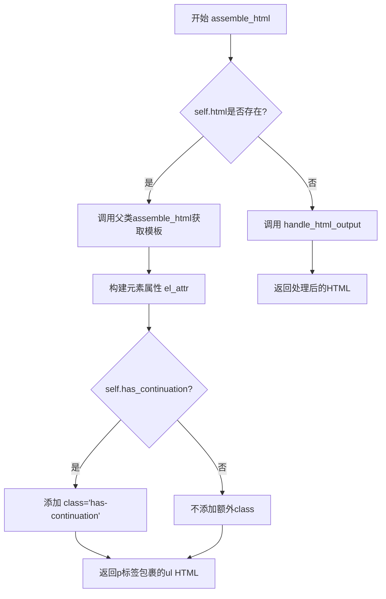
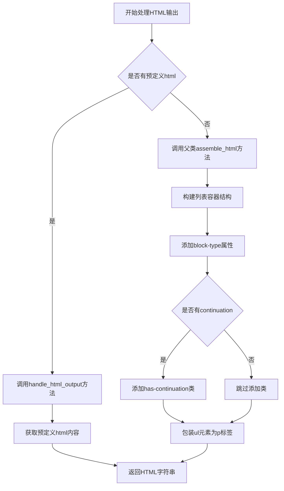

# `marker\marker\schema\groups\list.py` 详细设计文档

该代码定义了一个ListGroup类，用于将列表项渲染为HTML列表元素。它继承自Group基类，支持可选的HTML自定义输出，并通过assemble_html方法生成带有特定属性的<ul>列表包装在<p>标签中。

## 整体流程

```mermaid
graph TD
    A[开始 assemble_html] --> B{self.html是否存在?}
    B -- 是 --> C[调用handle_html_output]
    B -- 否 --> D[调用父类super().assemble_html获取模板]
    C --> E[返回HTML输出]
    D --> F[构建el_attr属性字符串]
    F --> G{self.has_continuation是否为True?]
    G -- 是 --> H[添加class='has-continuation']
    G -- 否 --> I[不添加额外class]
    H --> J[组装最终HTML: <p el_attr><ul>template</ul></p>]
    I --> J
    E --> K[结束]
    J --> K
```

## 类结构

```
Group (基类 - 来自marker.schema.groups.base)
└── ListGroup (当前类)
```

## 全局变量及字段


### `ListGroup.block_type`
    
列表块类型标识

类型：`BlockTypes`
    


### `ListGroup.has_continuation`
    
标记列表是否有延续

类型：`bool`
    


### `ListGroup.block_description`
    
块的描述说明

类型：`str`
    


### `ListGroup.html`
    
可选的HTML自定义输出

类型：`str | None`
    
    

## 全局函数及方法


### `ListGroup.assemble_html`

这是一个组装HTML列表输出的方法。首先检查ListGroup是否有预定义的html属性，如果有则调用handle_html_output方法处理；否则调用父类的assemble_html方法获取模板，然后添加ul标签和块类型属性，如果has_continuation为真则添加has-continuation类，最后返回完整的p标签包裹的ul元素。

参数：

- `self`：ListGroup，类的实例本身
- `document`：document，文档对象，包含文档的上下文信息
- `child_blocks`：list，子块列表，包含列表项的块
- `parent_structure`：parent_structure，父结构对象，包含父级结构信息
- `block_config`：dict | None，可选的块配置字典，用于自定义块的行为

返回值：`str`，返回HTML字符串，包含组装好的列表HTML

#### 流程图



#### 带注释源码

```python
def assemble_html(
    self, document, child_blocks, parent_structure, block_config=None
):
    """
    组装HTML列表输出的方法
    
    参数:
        document: 文档对象，包含文档的上下文信息
        child_blocks: 子块列表，包含列表项的块
        parent_structure: 父结构对象，包含父级结构信息
        block_config: 可选的块配置字典，用于自定义块的行为
    
    返回:
        str: 返回HTML字符串，包含组装好的列表HTML
    """
    # 检查self.html是否存在，如果存在则调用handle_html_output方法处理
    if self.html:
        return self.handle_html_output(
            document, child_blocks, parent_structure, block_config
        )

    # 调用父类的assemble_html方法获取基础模板
    template = super().assemble_html(
        document, child_blocks, parent_structure, block_config
    )

    # 初始化元素属性，包含块类型
    el_attr = f" block-type='{self.block_type}'"
    
    # 如果has_continuation为真，添加has-continuation类
    if self.has_continuation:
        el_attr += " class='has-continuation'"
        
    # 返回用p标签包裹的ul元素，ul内包含模板内容
    return f"<p{el_attr}><ul>{template}</ul></p>"
```


### `ListGroup.assemble_html`

该方法重写了父类`Group`的`assemble_html`方法，用于将列表项块组装成HTML输出。它首先检查是否存在缓存的HTML，如果有则直接使用缓存输出，否则调用父类方法获取基础模板，然后添加`<ul>`和`<p>`标签包装，并可选地添加`has-continuation`类来指示列表的连续性。

参数：

- `document`：未标注类型，文档对象，包含文档的上下文信息
- `child_blocks`：未标注类型，子块列表，包含该组包含的所有列表项块
- `parent_structure`：未标注类型，父结构信息，包含父级块的元数据
- `block_config`：可选参数，类型为`dict | None`，块配置选项，用于自定义渲染行为

返回值：`str`，返回组装好的HTML字符串，格式为`<p block-type='...'><ul>...</ul></p>`

#### 流程图

```mermaid
flowchart TD
    A[开始 assemble_html] --> B{self.html 是否存在?}
    B -->|是| C[调用 handle_html_output]
    B -->|否| D[调用 super().assemble_html 获取模板]
    D --> E[构建 el_attr 字符串]
    E --> F{self.has_continuation 是否为真?]
    F -->|是| G[添加 class='has-continuation']
    F -->|否| H[不添加 continuation 类]
    G --> I[构建最终HTML: <p{el_attr}><ul>{template}</ul></p>]
    H --> I
    C --> J[返回HTML字符串]
    I --> J
```

#### 带注释源码

```python
def assemble_html(
    self, document, child_blocks, parent_structure, block_config=None
):
    # 如果存在缓存的HTML（self.html不为None），则直接使用缓存输出
    # 这样可以避免重复计算，提高性能
    if self.html:
        return self.handle_html_output(
            document, child_blocks, parent_structure, block_config
        )

    # 调用父类的assemble_html方法，获取子块渲染后的模板内容
    # 父类方法会遍历child_blocks并生成每个列表项的HTML
    template = super().assemble_html(
        document, child_blocks, parent_structure, block_config
    )

    # 初始化属性字符串，包含block-type属性用于标识块的类型
    el_attr = f" block-type='{self.block_type}'"
    
    # 检查列表是否有延续项（continuation）
    # 如果有，则添加'has-continuation' CSS类，用于前端渲染样式的控制
    if self.has_continuation:
        el_attr += " class='has-continuation'"
    
    # 组装最终的HTML结构：
    # 外层<p>标签作为列表组的容器，内嵌<ul>标签包含列表项
    # 其中{el_attr}可能包含block-type和has-continuation类
    # {template}是父类方法返回的列表项HTML内容
    return f"<p{el_attr}><ul>{template}</ul></p>"
```


### `Group.handle_html_output`

处理列表组的HTML输出，将列表块转换为HTML格式的列表元素。

参数：

- `document`：对象，文档对象，包含原始文档数据
- `child_blocks`：列表，子块列表，包含列表项块
- `parent_structure`：对象，父结构信息，用于维护文档层级关系
- `block_config`：字典或None，可选的块配置参数，用于自定义渲染行为

返回值：字符串，返回生成的HTML字符串

#### 流程图



#### 带注释源码

```python
def handle_html_output(
    self, document, child_blocks, parent_structure, block_config=None
):
    """
    处理HTML输出方法（该方法定义在基类Group中）
    
    参数:
        document: 文档对象，包含需要处理的文档数据
        child_blocks: 子块列表，包含了该组的所有子块元素
        parent_structure: 父结构对象，用于维护文档的层级关系
        block_config: 可选的配置字典，用于自定义渲染行为
    
    返回:
        str: 生成的HTML字符串表示
    """
    # 具体实现来自基类Group的handle_html_output方法
    # 该方法负责将list group块渲染为HTML格式
    # 在ListGroup中，如果self.html有值，则调用此方法
    pass
```

---

**注意**：从提供的代码中可以看到，`handle_html_output` 方法是在 `Group` 基类中定义的方法。在 `ListGroup` 类中，当 `self.html` 存在时会调用此方法。由于基类代码未提供，以上信息是根据调用上下文和代码逻辑推断得出的。若需完整的 `handle_html_output` 实现细节，请参考 `Group` 基类的源代码。

## 关键组件


### ListGroup 类

继承自 Group 的列表组类，用于将相关的列表项渲染在一起，支持可选的HTML输出和列表延续标记。

### block_type 字段

BlockTypes 枚举类型，指定该块的类型为 ListGroup，用于标识列表组块的类型。

### has_continuation 字段

布尔类型，表示列表是否有续部分，用于添加 has-continuation CSS 类。

### block_description 字段

字符串类型，描述列表组的用途和渲染方式。

### html 字段

字符串或 None 类型，用于存储预定义的 HTML 输出，支持自定义 HTML 渲染。

### assemble_html 方法

组装列表组的 HTML 输出，首先检查是否有预定义 HTML，否则调用父类方法并添加 `<ul>` 标签包装，支持续列表的 class 属性添加。


## 问题及建议


### 已知问题

- **父类方法依赖风险**：`assemble_html` 方法调用了 `self.handle_html_output()`，但该方法未在当前类中定义，依赖父类 `Group` 的实现。如果父类中不存在此方法，会导致运行时 `AttributeError`。
- **XSS 安全风险**：使用字符串插值直接拼接 `template` 到 HTML 中，未进行任何转义或安全过滤。如果 `template` 包含用户输入或不可信内容，可能导致 HTML 注入/XSS 攻击。
- **空列表处理不当**：当 `template` 为空或 `None` 时，仍会生成 `<ul></ul>` 空标签，不符合语义化 HTML 最佳实践。
- **类型提示缺失**：方法参数 `document`, `child_blocks`, `parent_structure`, `block_config` 缺少类型注解，降低了代码可读性和静态分析能力。
- **返回值不一致**：方法在 `self.html` 存在时调用 `handle_html_output`，其返回值可能与直接返回的 HTML 字符串格式不一致，导致调用方难以统一处理。
- **硬编码 HTML 结构**：列表外层固定包装 `<p><ul>...</ul></p>`，缺乏灵活性，无法支持 `<ol>` 有序列表或其他列表变体。

### 优化建议

- 为所有方法参数添加类型注解，并为关键逻辑添加文档字符串。
- 在字符串拼接前对 `template` 进行 HTML 转义或使用安全的 DOM 操作方式。
- 添加空值检查，当 `template` 为空时返回空字符串或 `None`，避免生成无意义的空标签。
- 考虑将 HTML 结构配置化，支持不同类型的列表（有序/无序）或自定义包装元素。
- 添加异常处理逻辑，捕获可能的 `AttributeError` 或其他运行时异常，提供有意义的错误信息。
- 统一返回值类型，确保 `handle_html_output` 的返回值与直接返回的 HTML 字符串格式一致。

## 其它


### 设计目标与约束

该类旨在将列表项块（List Items）组合成统一的HTML结构，支持两种渲染模式：自定义HTML输出和基于模板的自动组装。设计约束包括：必须继承自Group基类、block_type必须为BlockTypes.ListGroup、html属性为可选（优先使用模板）、has_continuation用于标记列表连续性。

### 错误处理与异常设计

代码中未显式包含错误处理逻辑。当self.html存在时调用handle_html_output方法，该方法的异常将由调用方处理。建议在assemble_html方法中添加空值检查（如child_blocks、parent_structure为None的情况）和HTML输出验证，以防止XSS攻击。

### 数据流与状态机

数据流向：调用方传入document、child_blocks、parent_structure、block_config → 判断html属性是否存在 → 存在则走自定义输出分支 → 不存在则调用父类方法获取template → 拼接属性和标签 → 返回最终HTML字符串。状态转换：初始状态(has_continuation=False) → 根据has_continuation标志决定是否添加CSS类。

### 外部依赖与接口契约

依赖项：marker.schema.BlockTypes（块类型枚举）、marker.schema.groups.base.Group（基类）。接口契约：assemble_html方法必须接受document、child_blocks、parent_structure四个必需参数，block_config为可选参数，返回HTML字符串。

### 扩展点与可定制性

提供三个扩展点：1) 通过html属性支持完全自定义HTML输出；2) 通过has_continuation属性控制CSS类注入；3) 可重写assemble_html方法实现自定义渲染逻辑。block_config参数可用于传递额外配置。

### 性能考量

当前实现性能良好，字符串拼接操作简单高效。潜在优化点：频繁调用时考虑使用字符串格式化（如f-string）替代多次字符串加法；大量列表项时可考虑批量处理。

### 安全性考虑

代码存在HTML注入风险：block_type和has_continuation直接拼接至HTML属性中，虽目前为可控枚举值，但建议对所有用户可控输入进行转义处理。handle_html_output方法应确保其输出经过安全验证。

### 测试策略建议

应覆盖以下测试场景：1) has_continuation为True/False时的HTML输出差异；2) html属性存在时的处理逻辑；3) 父类方法返回值异常情况；4) 空child_blocks输入；5) block_config为None的边界情况。

### 配置项

block_config：可选参数，用于传递渲染配置。has_continuation：布尔标志，控制是否添加has-continuation CSS类。html：可选字符串，用于自定义HTML输出。

### 命名规范与代码风格

类名ListGroup遵循PascalCase规范，方法名assemble_html遵循snake_case规范。属性命名清晰，但block_description字段定义后未被使用，可能为冗余代码。

    