# `marker\marker\schema\groups\page.py` 详细设计文档

这是一个PDF文档页面处理模块，核心功能是管理文档页面的布局元素（块），包括图像提取、文本块识别与合并、块交集计算、缺失块识别与创建等操作，支持将OCR/布局模型的输出与现有文档结构进行对齐和整合。

## 整体流程

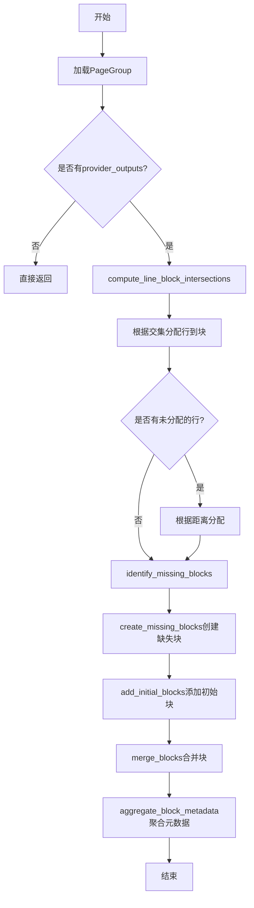

## 类结构

```
Group (基类)
└── PageGroup (页面组)
```

## 全局变量及字段


### `LINE_MAPPING_TYPE`
    
类型别名，表示行映射列表

类型：`List[Tuple[int, ProviderOutput]]`
    


### `PageGroup.block_type`
    
块类型，固定为Page

类型：`BlockTypes`
    


### `PageGroup.lowres_image`
    
低分辨率图像（字节或PIL图像）

类型：`Image.Image | None | bytes`
    


### `PageGroup.highres_image`
    
高分辨率图像

类型：`Image.Image | None | bytes`
    


### `PageGroup.children`
    
子块列表

类型：`List[Union[Any, Block]] | None`
    


### `PageGroup.layout_sliced`
    
布局模型是否需要切片

类型：`bool`
    


### `PageGroup.excluded_block_types`
    
排除的块类型

类型：`Sequence[BlockTypes]`
    


### `PageGroup.maximum_assignment_distance`
    
最大分配距离（像素）

类型：`float`
    


### `PageGroup.block_description`
    
块描述

类型：`str`
    


### `PageGroup.refs`
    
引用列表

类型：`List[Reference] | None`
    


### `PageGroup.ocr_errors_detected`
    
是否检测到OCR错误

类型：`bool`
    
    

## 全局函数及方法


### `PageGroup.incr_block_id`

该函数用于递增页组的块ID，确保每个新添加的块都能获得唯一的标识符。如果 block_id 为 None，则将其初始化为 0，否则将其加 1。

参数：

- 无（仅包含隐式参数 `self`）

返回值：`None`，无返回值（该方法直接修改实例属性 `block_id`）

#### 流程图

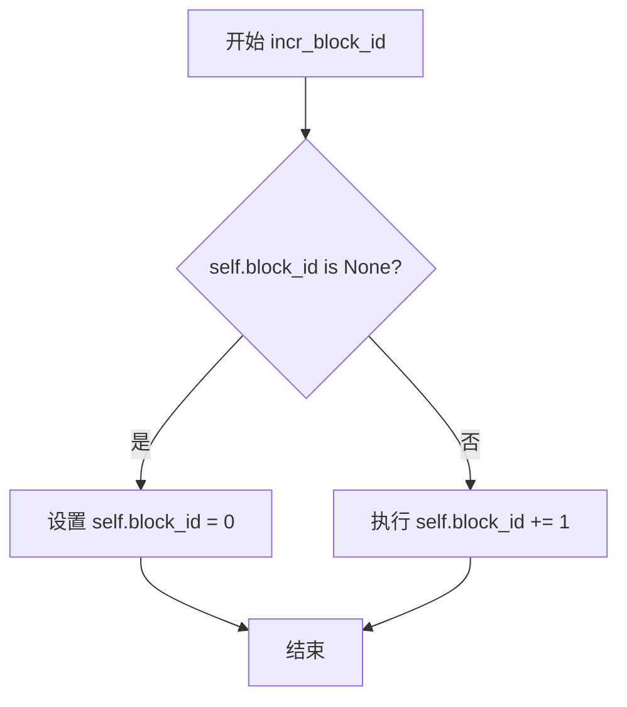

#### 带注释源码

```python
def incr_block_id(self):
    """
    递增页组的块ID。
    
    该方法用于为每个新添加的块分配唯一的标识符。
    如果 block_id 尚未初始化（为 None），则将其设置为 0；
    否则将其递增 1。
    """
    # 检查 block_id 是否为 None（尚未初始化）
    if self.block_id is None:
        # 首次调用时，初始化 block_id 为 0
        self.block_id = 0
    else:
        # 已有 block_id，递增 1
        self.block_id += 1
```


### `PageGroup.add_child`

将指定的 Block 对象添加到当前页组的子块列表中。如果子块列表尚未初始化，则创建一个新列表；否则直接将块追加到现有列表末尾。

参数：

- `block`：`Block`，要添加到当前页组的子块对象

返回值：`None`，无返回值（该方法直接修改对象的内部状态）

#### 流程图

```mermaid
flowchart TD
    A[开始 add_child] --> B{self.children is None?}
    B -->|是| C[创建新列表: self.children = [block]]
    B -->|否| D[追加到列表: self.children.append(block)]
    C --> E[结束]
    D --> E
```

#### 带注释源码

```python
def add_child(self, block: Block):
    """
    将一个 Block 对象添加到当前 PageGroup 的 children 列表中。
    
    参数:
        block: 要添加的 Block 对象
        
    处理逻辑:
        1. 检查 children 列表是否已初始化
        2. 如果为 None，创建一个新的列表并将 block 作为第一个元素
        3. 如果已存在，直接将 block 追加到列表末尾
    """
    if self.children is None:
        # 第一次添加子块时，初始化 children 列表
        self.children = [block]
    else:
        # 列表已存在，直接追加新块
        self.children.append(block)
```


### `PageGroup.get_image`

获取页面的图像，可选择高分辨率模式，并可选地移除指定类型的块（如文本行、Span等），通过在图像上绘制白色多边形来覆盖这些区域。主要用于避免对已识别元素进行重复的OCR处理。

参数：

- `*args`：可变位置参数，用于接受额外的位置参数
- `highres`：`bool`，默认为 `False`，是否获取高分辨率图像。为 `True` 时使用 `highres_image`，为 `False` 时使用 `lowres_image`
- `remove_blocks`：`Sequence[BlockTypes] | None`，默认为 `None`，需要移除的块类型序列（如 `BlockTypes.Line`、`BlockTypes.Span`）
- `**kwargs`：可变关键字参数，用于接受额外的关键字参数

返回值：`Image.Image`，处理后的 PIL 图像对象

#### 流程图

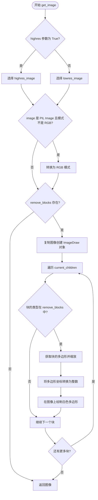

#### 带注释源码

```python
def get_image(
    self,
    *args,
    highres: bool = False,
    remove_blocks: Sequence[BlockTypes] | None = None,
    **kwargs,
):
    # 根据 highres 参数选择高分辨率或低分辨率图像
    image = self.highres_image if highres else self.lowres_image

    # 检查图像是否为 RGB 模式，若不是则进行转换
    # 确保输出图像为 RGB 格式（3 通道）
    if isinstance(image, Image.Image) and image.mode != "RGB":
        image = image.convert("RGB")

    # 如果指定了需要移除的块类型
    # 用于避免对已识别元素进行重复 OCR
    if remove_blocks:
        # 创建图像副本以避免修改原图
        image = image.copy()
        # 创建绘图对象
        draw = ImageDraw.Draw(image)
        # 筛选出需要移除的块（根据 block_type）
        bad_blocks = [
            block
            for block in self.current_children
            if block.block_type in remove_blocks
        ]
        # 遍历每个需要移除的块
        for bad_block in bad_blocks:
            # 将块的坐标系从页面尺寸缩放到图像尺寸
            poly = bad_block.polygon.rescale(self.polygon.size, image.size).polygon
            # 将坐标转换为整数（像素坐标）
            poly = [(int(p[0]), int(p[1])) for p in poly]
            # 绘制白色多边形覆盖该区域
            draw.polygon(poly, fill="white")

    # 返回处理后的图像
    return image
```


### `PageGroup.current_children`

该属性是一个计算属性，用于获取当前页面中所有未被移除的子块。它通过遍历 `children` 列表，过滤掉 `removed` 属性为 `True` 的块，返回一个仅包含有效（未移除）块的列表。此属性在多个方法中被使用，如 `get_image`、`merge_blocks` 和 `aggregate_block_metadata`，以确保只处理仍然活跃的文档块。

参数： 无

返回值：`List[Block]`，返回当前页面中所有未被移除的子块列表

#### 流程图

```mermaid
flowchart TD
    A[Start] --> B{self.children is None?}
    B -->|是| C[返回空列表 []]
    B -->|否| D[遍历 self.children 中的每个 child]
    D --> E{child.removed == False?}
    E -->|是| F[将 child 加入结果列表]
    E -->|否| G[跳过该 child]
    F --> H{还有更多 child?}
    G --> H
    H -->|是| D
    H -->|否| I[返回过滤后的结果列表]
```

#### 带注释源码

```python
@computed_field
@property
def current_children(self) -> List[Block]:
    """
    计算属性：获取当前未移除的子块列表
    
    该属性过滤 self.children 列表，返回所有 removed 属性为 False 的块。
    用于确保在图像处理、块合并、元数据聚合等操作中只处理活跃的块。
    
    返回:
        List[Block]: 未被移除的子块列表
    """
    # 列表推导式：遍历所有子块，过滤掉已移除的块
    # self.children 可能为 None（类型定义允许），但这里直接使用
    # 如果 children 为 None，列表推导式会返回空列表
    return [child for child in self.children if not child.removed]
```


### `PageGroup.get_next_block`

该方法用于在文档页面结构中查找指定块之后的下一个有效块，支持根据块类型过滤忽略的块。

参数：

- `block`：`Optional[Block]`，可选的起始块，如果提供则从该块的下一个位置开始查找；如果为 None，则从结构开头开始查找
- `ignored_block_types`：`Optional[List[BlockTypes]]`，需要忽略的块类型列表，默认值为 None（不忽略任何类型）

返回值：`Block | None`，返回找到的下一个有效块，如果没有找到则返回 None

#### 流程图

```mermaid
flowchart TD
    A([开始 get_next_block]) --> B{ignored_block_types is None?}
    B -->|是| C[ignored_block_types = []]
    B -->|否| D[保持原值]
    C --> E{block is None?}
    D --> E
    E -->|是| F[structure_idx = 0]
    E -->|否| G[structure_idx = self.structure.index(block.id) + 1]
    F --> H[遍历 self.structure[structure_idx:]]
    G --> H
    H --> I{next_block_id.block_type not in ignored_block_types?}
    I -->|是| J[返回 self.get_block(next_block_id)]
    I -->|否| K[继续下一个块]
    K --> H
    J --> L([结束: 返回 Block])
    H --> M{遍历结束?}
    M -->|是| N[返回 None]
    N --> L
```

#### 带注释源码

```python
def get_next_block(
    self,
    block: Optional[Block] = None,
    ignored_block_types: Optional[List[BlockTypes]] = None,
):
    # 如果未指定忽略的块类型，则默认为空列表
    if ignored_block_types is None:
        ignored_block_types = []

    # 初始化遍历起始索引为0（从头开始）
    structure_idx = 0
    # 如果传入了起始块，则从该块的下一个位置开始查找
    if block is not None:
        # 获取当前块在structure中的位置，加1表示跳到下一个
        structure_idx = self.structure.index(block.id) + 1

    # 遍历从起始位置开始的所有后续块
    for next_block_id in self.structure[structure_idx:]:
        # 如果该块的类型不在忽略列表中，则返回该块
        if next_block_id.block_type not in ignored_block_types:
            return self.get_block(next_block_id)

    # 遍历完成未找到有效块，返回None
    return None  # No valid next block found
```


### `PageGroup.get_prev_block`

获取前一个块，用于在文档结构中按照顺序获取当前块的前一个块。

参数：

- `block`：`Block`，需要获取其前一个块的块对象

返回值：`Block | None`，如果存在前一个块则返回该块，否则返回 `None`

#### 流程图

```mermaid
flowchart TD
    A[开始 get_prev_block] --> B[接收 block 参数]
    B --> C[在 self.structure 中查找 block.id 的索引]
    C --> D{索引 > 0?}
    D -->|是| E[获取前一个块的 ID: self.structure[block_idx - 1]]
    E --> F[调用 self.get_block 获取块对象]
    F --> G[返回前一个块]
    D -->|否| H[返回 None]
    G --> I[结束]
    H --> I
```

#### 带注释源码

```python
def get_prev_block(self, block: Block):
    """
    获取当前块的前一个块
    
    参数:
        block: Block - 需要获取前一个块的块对象
        
    返回值:
        Block | None - 如果存在前一个块则返回该块，否则返回 None
    """
    # 在结构列表中查找当前块的索引位置
    block_idx = self.structure.index(block.id)
    
    # 检查索引是否大于0（确保不是第一个块）
    if block_idx > 0:
        # 获取前一个块的ID（索引减1）
        # 调用 get_block 方法获取完整的块对象
        return self.get_block(self.structure[block_idx - 1])
    
    # 如果是第一个块或未找到前一个块，返回 None
    return None
```


### `PageGroup.add_block`

该方法用于向页面组（PageGroup）中添加一个新的块（Block）。它首先递增页面组的块ID计数器，然后使用指定的块类型和多边形区域创建一个新块实例，将其添加到子块列表中，并返回该新创建的块对象。

参数：

- `block_cls`：`type[Block]`，要添加的块类，指定创建的块的类型（如 Text、Span 等继承自 Block 的类）
- `polygon`：`PolygonBox`，块的多边形区域，定义块在页面上的位置和形状

返回值：`Block`，返回新创建并添加的块对象

#### 流程图

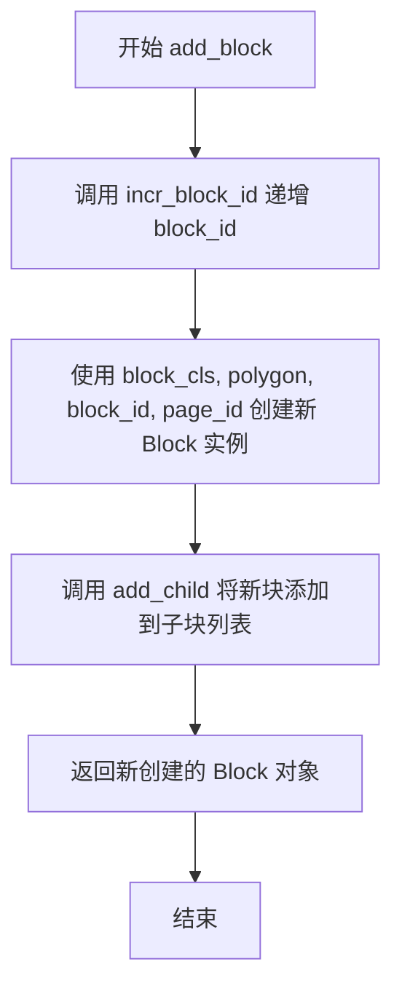

#### 带注释源码

```python
def add_block(self, block_cls: type[Block], polygon: PolygonBox) -> Block:
    """
    向页面组添加一个新的块。
    
    参数:
        block_cls: 要创建的块的类型（必须是 Block 的子类）
        polygon: 块的多边形区域定义
    
    返回:
        新创建并添加的 Block 实例
    """
    # 步骤1: 递增页面组的块ID计数器
    self.incr_block_id()
    
    # 步骤2: 使用提供的块类和多边形创建新的块实例
    # 传入多边形、当前块ID和页面ID
    block = block_cls(
        polygon=polygon,
        block_id=self.block_id,
        page_id=self.page_id,
    )
    
    # 步骤3: 将新创建的块添加到页面组的子块列表中
    self.add_child(block)
    
    # 步骤4: 返回新创建的块对象，供调用者使用
    return block
```


### `PageGroup.add_full_block`

向页面组添加一个完整的块对象，同时为其分配唯一的块ID，并将该块添加到子块列表中。

参数：

-  `block`：`Block`，要添加的完整块对象（包含多行文本、图像或其他复杂内容的块）

返回值：`Block`，返回已添加的块对象，便于链式调用或后续处理

#### 流程图

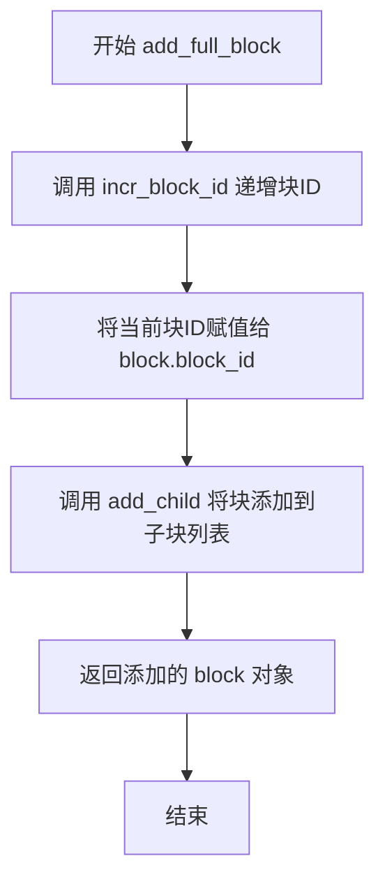

#### 带注释源码

```python
def add_full_block(self, block: Block) -> Block:
    """
    向页面组添加一个完整的块，同时分配块ID
    
    此方法与 add_block 的区别在于：
    - add_block 需要提供 polygon 来创建新块
    - add_full_block 接受一个已经创建好的完整块对象
    """
    # 递增页面组的块ID计数器
    self.incr_block_id()
    
    # 将当前分配的块ID赋值给传入的块对象
    block.block_id = self.block_id
    
    # 将块添加到页面组的子块列表中
    self.add_child(block)
    
    # 返回已添加的块对象，便于调用者进行后续处理
    return block
```


### `PageGroup.get_block`

通过给定的块标识符获取页面中对应的块对象。

参数：

- `block_id`：`BlockId`，块的唯一标识符，包含块在页面中的索引信息

返回值：`Block | None`，返回对应的块对象，如果找不到则返回 None

#### 流程图

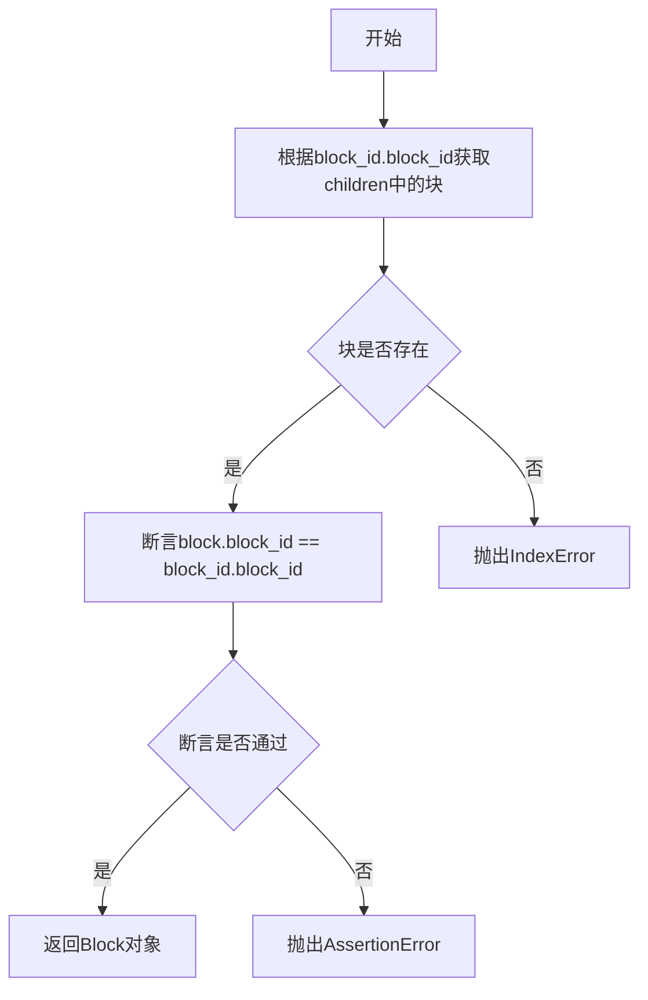

#### 带注释源码

```python
def get_block(self, block_id: BlockId) -> Block | None:
    # 根据block_id中的索引值直接从children列表中获取块对象
    # block_id.block_id 是整数值，作为列表索引使用
    block: Block = self.children[block_id.block_id]
    
    # 验证获取到的块的ID与请求的ID是否一致
    # 防止索引错误导致返回错误的块
    assert block.block_id == block_id.block_id
    
    # 返回找到的块对象
    return block
```

#### 关键组件信息

- **BlockId**：块的唯一标识符类型，用于定位页面中的特定块
- **Block**：文档中的基本内容块，可以是文本、图像等元素
- **children**：页面Group中包含的所有子块的列表

#### 潜在的技术债务或优化空间

1. **索引访问风险**：直接使用列表索引访问，如果 `block_id.block_id` 超出范围会抛出 `IndexError` 异常，建议添加边界检查
2. **断言使用**：使用 `assert` 进行关键验证在生产环境中可能被优化忽略，建议改为显式的条件检查并抛出有意义的异常
3. **无空值处理**：当索引超出范围时直接崩溃，应该返回 `None` 或抛出更友好的异常信息

#### 其它项目

- **设计目标**：通过块ID快速检索文档块
- **错误处理**：依赖 assert 进行基本验证，索引越界时抛出标准 Python 异常
- **接口契约**：`block_id` 必须是有效的 BlockId 对象，且其 `block_id` 属性必须在 `children` 列表的有效索引范围内


### `PageGroup.assemble_html`

该方法用于将子块（child_blocks）组装成HTML模板，通过为每个子块生成`<content-ref>`标签来构建HTML内容引用结构。

参数：

- `self`：隐式参数，PageGroup实例本身
- `document`：任意类型，文档对象（当前方法内未使用）
- `child_blocks`：任意类型的可迭代对象，需包含`.id`属性，用于遍历生成HTML引用标签的子块集合
- `parent_structure`：任意类型，可选，默认为None，父级结构信息（当前方法内未使用）
- `block_config`：任意类型，可选，默认为None，块配置信息（当前方法内未使用）

返回值：`str`，返回生成的HTML模板字符串，包含所有子块的`<content-ref>`标签

#### 流程图

```mermaid
flowchart TD
    A([开始 assemble_html]) --> B[初始化 template = ""]
    B --> C{遍历 child_blocks}
    C -->|遍历每个子块 c| D[生成HTML标签]
    D --> E[template += f"<content-ref src='{c.id}'></content-ref>"]
    E --> C
    C -->|遍历完成| F[返回 template 字符串]
    F --> G([结束])
```

#### 带注释源码

```python
def assemble_html(
    self, document, child_blocks, parent_structure=None, block_config=None
):
    """
    组装HTML模板方法
    
    参数:
        document: 文档对象 (当前未使用)
        child_blocks: 子块集合，需要有id属性
        parent_structure: 父级结构 (可选，默认None)
        block_config: 块配置 (可选，默认None)
    
    返回:
        str: 包含content-ref标签的HTML模板字符串
    """
    # 初始化空模板字符串
    template = ""
    # 遍历所有子块，为每个子块生成content-ref HTML标签
    for c in child_blocks:
        template += f"<content-ref src='{c.id}'></content-ref>"
    # 返回生成的HTML模板
    return template
```


### `PageGroup.compute_line_block_intersections`

该方法用于计算文档中每个文本行（来自 OCR/文本提取 provider）与哪些布局块相交，并找出每个文本行与哪个块具有最大的交集面积。通过构建交集矩阵并取每行的最大交集值，实现对文本行到块的自动化分配，是文档布局分析和文本对齐的核心算法。

参数：

- `blocks`：`List[Block]`，布局块列表，代表文档中已识别的布局结构块（如段落、表格等）
- `provider_outputs`：`List[ProviderOutput]`，文本提取提供者输出列表，每个元素包含一行文本及其几何信息（多边形边界）

返回值：`Dict[int, Tuple[float, BlockId]]`，返回字典，键为 provider_outputs 中的行索引，值为元组（最大交集面积，对应的块 ID）

#### 流程图

```mermaid
flowchart TD
    A[开始 compute_line_block_intersections] --> B[初始化空字典 max_intersections]
    B --> C[提取所有块的边界框列表 block_bboxes]
    C --> D[提取所有行的边界框列表 line_bboxes]
    D --> E[调用 matrix_intersection_area 计算行与块的交集矩阵]
    E --> F[遍历 provider_outputs 中的每一行]
    F --> G{当前行的交集向量 sum == 0?}
    G -->|是| H[跳过当前行，继续下一行]
    G -->|否| I[找到交集向量的最大值的索引 max_intersection]
    I --> J[记录: max_intersections[line_idx] = 交集面积, 对应块ID]
    J --> K{还有更多行?}
    K -->|是| F
    K -->|否| L[返回 max_intersections 字典]
```

#### 带注释源码

```python
def compute_line_block_intersections(
    self, blocks: List[Block], provider_outputs: List[ProviderOutput]
):
    # 用于存储每行与块的最大交集结果
    # 键: 行索引, 值: (交集面积, 块ID)
    max_intersections = {}

    # 提取所有块的边界框 [x_min, y_min, x_max, y_max]
    block_bboxes = [block.polygon.bbox for block in blocks]
    
    # 提取所有文本行（来自provider）的边界框
    line_bboxes = [
        provider_output.line.polygon.bbox for provider_output in provider_outputs
    ]

    # 计算行与块之间的交集面积矩阵
    # 矩阵形状: [len(line_bboxes), len(block_bboxes)]
    # matrix_intersection_area 是外部工具函数，计算两个边界框列表的交集面积
    intersection_matrix = matrix_intersection_area(line_bboxes, block_bboxes)

    # 遍历每一行文本
    for line_idx, line in enumerate(provider_outputs):
        # 获取当前行与所有块的交集向量
        intersection_line = intersection_matrix[line_idx]
        
        # 如果当前行与任何块都没有交集，跳过
        if intersection_line.sum() == 0:
            continue

        # 找到最大交集对应的块索引
        max_intersection = intersection_line.argmax()
        
        # 记录该行的最大交集面积和对应的块ID
        # 存储格式: {行索引: (最大交集面积, 块ID)}
        max_intersections[line_idx] = (
            intersection_matrix[line_idx, max_intersection],
            blocks[max_intersection].id,
        )
    
    # 返回每个文本行与其最佳匹配块的映射关系
    return max_intersections
```


### `PageGroup.compute_max_structure_block_intersection_pct`

该方法用于计算文档页面中结构块之间的最大空间交集百分比，通过计算每个结构块与其它所有块的交集面积占自身面积的比例，找出所有块中的最大值，以评估页面布局的紧凑程度和块之间的重叠程度。

参数：无（仅包含 `self` 隐式参数）

返回值：`float`，返回最大结构块交集百分比，值域为 [0, 1]，其中 0 表示无任何交集，1 表示完全重合。

#### 流程图

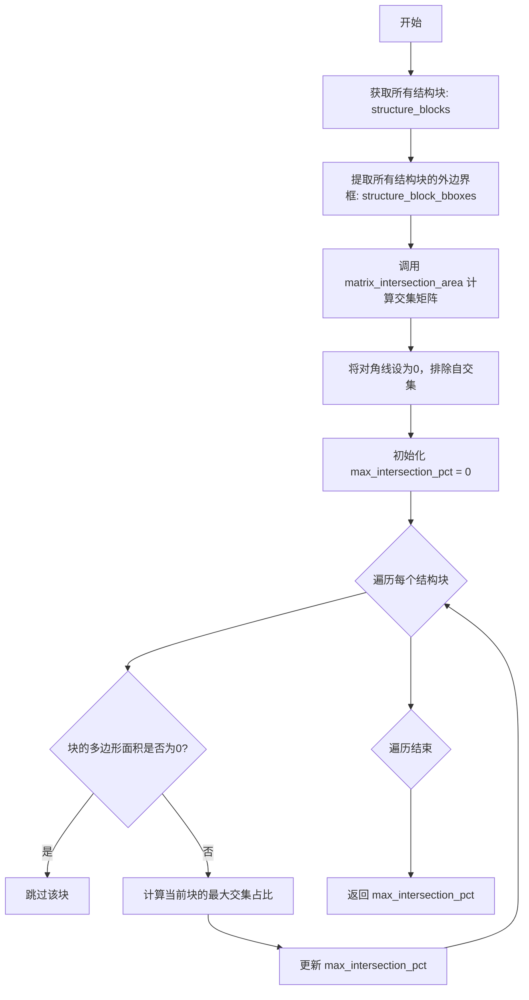

#### 带注释源码

```python
def compute_max_structure_block_intersection_pct(self):
    """
    计算结构块之间的最大交集百分比。
    
    该方法通过以下步骤计算：
    1. 获取当前页面中的所有结构块
    2. 计算所有块之间的两两交集面积矩阵
    3. 排除自交集（块与自身的交集）
    4. 对于每个块，计算其与其它块的最大交集占自身面积的比例
    5. 返回所有块中最大的那个比例
    """
    # 步骤1: 根据结构ID列表获取所有结构块对象
    # self.structure 是一个 BlockId 列表，存储了页面中块的顺序结构
    structure_blocks = [self.get_block(block_id) for block_id in self.structure]
    
    # 步骤2: 提取每个块的边界框（Bounding Box）
    # bbox 格式为 [x_min, y_min, x_max, y_max]，用于后续交集计算
    strucure_block_bboxes = [b.polygon.bbox for b in structure_blocks]

    # 步骤3: 计算所有结构块之间的交集面积矩阵
    # matrix_intersection_area 是一个工具函数，接收两个边界框列表
    # 返回一个 NxN 的矩阵，其中 matrix[i][j] 表示第i个块与第j个块的交集面积
    intersection_matrix = matrix_intersection_area(strucure_block_bboxes, strucure_block_bboxes)
    
    # 步骤4: 将矩阵对角线设为0，排除自交集情况
    # 块与自身的交集没有意义，需要忽略
    np.fill_diagonal(intersection_matrix, 0)    # Ignore self-intersections

    # 步骤5: 遍历每个结构块，计算最大交集百分比
    max_intersection_pct = 0
    for block_idx, block in enumerate(structure_blocks):
        # 跳过面积为0的块，避免除零错误
        # 某些被完全移除或无效的块面积为0
        if block.polygon.area == 0:
            continue
        
        # 计算当前块的最大交集占自身面积的比例
        # intersection_matrix[block_idx] 包含当前块与所有其它块的交集面积
        # np.max() 找出最大的那个交集面积
        # 除以 block.polygon.area 得到比例（0到1之间）
        max_intersection_pct = max(
            max_intersection_pct, 
            np.max(intersection_matrix[block_idx]) / block.polygon.area
        )

    # 返回所有块中的最大交集百分比
    return max_intersection_pct
```


### `PageGroup.replace_block`

该方法用于在页面组中替换指定的块，将旧块替换为新块，同时更新页面结构、子块结构，并标记旧块为已移除状态。

参数：

- `block`：`Block`，需要被替换的旧块
- `new_block`：`Block`，用于替换的新块

返回值：`None`，该方法直接修改对象状态，无返回值

#### 流程图

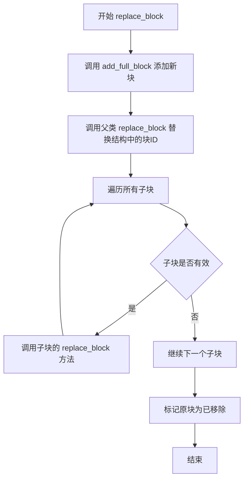

#### 带注释源码

```python
def replace_block(self, block: Block, new_block: Block):
    # 使用 add_full_block 方法添加新块，该方法会自动递增 block_id
    # Handles incrementing the id
    self.add_full_block(new_block)

    # 调用父类的 replace_block 方法，更新页面结构中的块ID引用
    # Replace block id in structure
    super().replace_block(block, new_block)

    # 递归遍历所有子块，调用每个子块的 replace_block 方法
    # 确保子块的内部结构也得到更新
    # Replace block in structure of children
    for child in self.children:
        child.replace_block(block, new_block)

    # 将原块标记为已移除，后续处理时会跳过该块
    # Mark block as removed
    block.removed = True
```

#### 关键组件信息

| 组件名称 | 一句话描述 |
|---------|-----------|
| `PageGroup` | 文档页面容器类，管理页面的块结构和图像 |
| `Block` | 文档中的基本元素块，如文本行、段落等 |
| `Group` | 块组基类，提供块结构管理的通用功能 |
| `add_full_block` | 向页面添加完整块的方法，自动分配block_id |
| `structure` | 块的结构顺序列表，维护块的阅读顺序 |

#### 技术债务与优化空间

1. **缺少空值检查**：方法未检查 `block` 和 `new_block` 是否为 `None`，可能导致运行时错误
2. **递归深度风险**：对所有子块递归调用 `replace_block`，在深层嵌套结构时可能导致栈溢出
3. **性能优化**：每次替换都遍历所有子块，可考虑使用索引缓存或延迟更新策略
4. **事务性缺失**：操作不是原子的，如果中间步骤失败，可能导致状态不一致

#### 设计目标与约束

- **设计目标**：保持文档结构的完整性和一致性，确保替换操作正确传播到所有相关组件
- **约束条件**：
  - 替换后必须保持 `block_id` 的唯一性和递增性
  - 替换操作不可逆，旧块会被标记为已移除
  - 必须同步更新所有层级的结构（页面级、子块级）

#### 错误处理与异常设计

- 依赖父类 `Group.replace_block` 的异常传播
- 假设输入的 `block` 必然存在于当前页面中，否则可能引发 `ValueError`
- 子块替换失败时可能抛出对应子类的异常

#### 数据流与状态机

```
[原始块状态] --> [添加新块] --> [更新结构] --> [递归更新子块] --> [标记移除]
                         ↓
                  [页面结构更新]
                         ↓
                  [子块结构更新]
```

替换完成后，旧块进入 `removed=True` 状态，新块继承原位置并进入活跃状态。


### `PageGroup.identify_missing_blocks`

该方法用于识别在布局处理过程中没有被分配给任何现有块的行，并将相邻且距离较近的行组合成新的块。它遍历所有提供者行索引，跳过已分配的行和无效行（如面积过小的换行符），然后根据行索引连续性和中心距离将符合条件的行归并到同一个新块中，最终返回所有新块的列表。

参数：

- `provider_line_idxs`：`List[int]` - 提供者的行索引列表，表示需要处理的所有行
- `provider_outputs`：`List[ProviderOutput]` - 提供者输出列表，包含每个行的详细数据（多边形、文本等）
- `assigned_line_idxs`：`set[int]` - 已分配的行索引集合，用于标记哪些行已经被分配到现有块中

返回值：`List[LINE_MAPPING_TYPE]` - 新块的列表，每个元素是一个包含(line_idx, provider_output)元组的列表，表示一个逻辑块

#### 流程图

```mermaid
flowchart TD
    A[开始遍历 provider_line_idxs] --> B{当前 line_idx 在 assigned_line_idxs 中?}
    B -->|是| C[跳过该行，继续下一个]
    B -->|否| D{该行是无效行?}
    D -->|是: 面积<=1 且 raw_text=='\n'| C
    D -->|否| E{new_block 是否为空?}
    E -->|是| F[创建新块 new_block = [(line_idx, provider_output)]]
    E -->|否| G{行索引连续且中心距离 < maximum_assignment_distance?}
    G -->|是| H[将当前行添加到 new_block]
    G -->|否| I[将 new_block 添加到 new_blocks 列表]
    I --> J[创建新块 new_block = [(line_idx, provider_output)]]
    H --> K[将 line_idx 添加到 assigned_line_idxs]
    J --> K
    C --> L{还有更多行索引?}
    L -->|是| A
    L -->|否| M{new_block 是否存在?}
    M -->|是| N[将 new_block 添加到 new_blocks]
    M -->|否| O[返回 new_blocks]
    N --> O
```

#### 带注释源码

```python
def identify_missing_blocks(
    self,
    provider_line_idxs: List[int],
    provider_outputs: List[ProviderOutput],
    assigned_line_idxs: set[int],
):
    """
    识别缺失的块，将未被分配的行组合成新的块
    
    参数:
        provider_line_idxs: 提供者的行索引列表
        provider_outputs: 提供者输出列表
        assigned_line_idxs: 已分配的行索引集合
    
    返回:
        新块的列表，每个块是一个 (line_idx, provider_output) 元组的列表
    """
    new_blocks = []  # 存储所有新创建的块
    new_block = None  # 当前正在构建的块
    
    # 遍历所有提供者行索引
    for line_idx in provider_line_idxs:
        # 如果该行已经被分配给现有块，则跳过
        if line_idx in assigned_line_idxs:
            continue

        # 如果未关联的行是一个新行且面积最小（小于等于1），
        # 并且是换行符，则可以跳过（无效行）
        if (
            provider_outputs[line_idx].line.polygon.area <= 1
            and provider_outputs[line_idx].raw_text == "\n"
        ):
            continue

        # 如果当前没有正在构建的块，则创建一个新块
        if new_block is None:
            new_block = [(line_idx, provider_outputs[line_idx])]
        # 检查当前行是否与前一行连续且距离在允许范围内
        elif all(
            [
                new_block[-1][0] + 1 == line_idx,  # 行索引连续（相差1）
                provider_outputs[line_idx].line.polygon.center_distance(
                    new_block[-1][1].line.polygon
                )
                < self.maximum_assignment_distance,  # 中心距离小于最大分配距离
            ]
        ):
            # 满足条件，将当前行添加到现有块中
            new_block.append((line_idx, provider_outputs[line_idx]))
        else:
            # 不满足连续性或距离条件，保存当前块并创建新块
            new_blocks.append(new_block)
            new_block = [(line_idx, provider_outputs[line_idx])]
        
        # 将该行标记为已分配
        assigned_line_idxs.add(line_idx)
    
    # 处理最后一块（如果存在）
    if new_block:
        new_blocks.append(new_block)

    return new_blocks
```


### `PageGroup.create_missing_blocks`

该方法用于根据之前识别出的缺失块创建新的文本块，并将这些块插入到文档结构中合适的位置。它首先为每个缺失块创建 `Text` 类型的块，然后通过计算与现有块的几何距离来确定其插入位置。

参数：

- `new_blocks`：`List[LINE_MAPPING_TYPE]`（即 `List[List[Tuple[int, ProviderOutput]]]`），从 `identify_missing_blocks` 方法识别出的缺失块列表，每个元素是一个行索引与 ProviderOutput 的元组列表
- `block_lines`：`Dict[BlockId, LINE_MAPPING_TYPE]`，用于存储块ID到对应行数据的映射字典

返回值：`None`，该方法直接修改对象状态，不返回任何值

#### 流程图

```mermaid
flowchart TD
    A[开始 create_missing_blocks] --> B{遍历 new_blocks 中的每个 new_block}
    B -->|是| C[创建新的 Text 块<br/>使用 new_block[0][1].line.polygon]
    C --> D[设置 block.source = 'heuristics']
    D --> E[将新块添加到 block_lines[block.id]]
    E --> F[初始化 min_dist_idx = None<br/>min_dist = None]
    F --> G{遍历结构中的每个 existing_block_id}
    G -->|是| H{检查块类型是否在<br/>excluded_block_types 中}
    H -->|否| I[计算新块与现有块的距离<br/>使用 center_distance<br/>x_weight=5, absolute=True]
    I --> J{检查距离有效性<br/>dist > 0 and (min_dist_idx is None or dist < min_dist)}
    J -->|是| K[更新 min_dist 和 min_dist_idx]
    J -->|否| G
    H -->|是| G
    G -->|否| L{min_dist_idx 不为 None?}
    L -->|是| M[在现有块位置后插入新块 ID<br/>structure.insert(existing_idx + 1, block.id)]
    L -->|否| N[将新块 ID 追加到结构末尾<br/>structure.append(block.id)]
    M --> B
    N --> B
    B -->|否| O[结束]
```

#### 带注释源码

```python
def create_missing_blocks(
    self,
    new_blocks: List[LINE_MAPPING_TYPE],
    block_lines: Dict[BlockId, LINE_MAPPING_TYPE],
):
    # 遍历每个需要创建的缺失块
    for new_block in new_blocks:
        # 创建一个新的 Text 类型的块，使用该块第一行的多边形作为初始几何信息
        # new_block[0] 是第一个 (line_idx, provider_output) 元组
        # new_block[0][1] 是 provider_output
        # new_block[0][1].line 是对应的行对象
        # new_block[0][1].line.polygon 是该行的多边形边界
        block = self.add_block(Text, new_block[0][1].line.polygon)
        
        # 标记该块是通过启发式方法（heuristics）创建的，而非从模型输出中直接获取
        block.source = "heuristics"
        
        # 将该块及其关联的行数据存储到 block_lines 字典中
        block_lines[block.id] = new_block

        # 初始化最小距离相关变量，用于寻找最近的几何相邻块
        min_dist_idx = None
        min_dist = None
        
        # 遍历文档结构中的所有现有块ID
        for existing_block_id in self.structure:
            # 获取现有块对象
            existing_block = self.get_block(existing_block_id)
            
            # 跳过被排除的块类型（如 Line、Span 等）
            if existing_block.block_type in self.excluded_block_types:
                continue
            
            # 计算新块与现有块的中心点距离
            # x_weight=5 表示X轴距离权重为Y轴的5倍，优先按垂直方向匹配
            # absolute=True 表示使用绝对距离（不考虑方向）
            dist = block.polygon.center_distance(
                existing_block.polygon, x_weight=5, absolute=True
            )
            
            # 更新最小距离：如果距离大于0且（尚未设置最小距离或当前距离更小）
            # 注意：此处逻辑存在问题，当 min_dist_idx 为 None 时条件可能不准确
            if dist > 0 and min_dist_idx is None or dist < min_dist:
                min_dist = dist
                min_dist_idx = existing_block.id

        # 根据最近块的位置插入新块
        if min_dist_idx is not None:
            # 找到最近块在结构中的索引，在其后面插入新块
            existing_idx = self.structure.index(min_dist_idx)
            self.structure.insert(existing_idx + 1, block.id)
        else:
            # 如果没有找到合适的相邻块，则追加到结构末尾
            self.structure.append(block.id)
```


### `PageGroup.add_initial_blocks`

该方法用于将文本行（lines）正确地添加到对应的块（Block）中。它遍历 `block_lines` 字典，对每个块的行进行排序（根据文本提取方法），然后将行、span（文本片段）以及可选的字符添加到块的结构中，最终更新块的多边形和文本提取方法。

参数：

- `self`：`PageGroup` 实例，当前页面组对象
- `block_lines`：`Dict[BlockId, LINE_MAPPING_TYPE]`，映射关系，包含块ID到该块所对应的行列表（每项为 `(line_index, ProviderOutput)` 元组）
- `text_extraction_method`：`str`，文本提取方法，用于设置块的 `text_extraction_method` 属性
- `keep_chars`：`bool`，可选参数（默认为 `False`），是否保留并添加字符到结构中

返回值：`None`，该方法无返回值，直接修改对象状态

#### 流程图

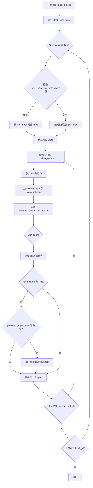

#### 带注释源码

```python
def add_initial_blocks(
    self,
    block_lines: Dict[BlockId, LINE_MAPPING_TYPE],
    text_extraction_method: str,
    keep_chars: bool = False,
):
    # Add lines to the proper blocks, sorted in order
    # 遍历块与行的映射关系，每个 block_id 对应一组行
    for block_id, lines in block_lines.items():
        # 提取当前块所有行的文本提取方法集合
        line_extraction_methods = set(
            [line[1].line.text_extraction_method for line in lines]
        )
        # 如果只有一种提取方法，按行索引排序
        if len(line_extraction_methods) == 1:
            lines = sorted(lines, key=lambda x: x[0])
            lines = [line for _, line in lines]
        else:
            # 否则按行的多边形位置排序（处理跨行文本）
            lines = [line for _, line in lines]
            line_polygons = [line.line.polygon for line in lines]
            sorted_line_polygons = sort_text_lines(line_polygons)
            argsort = [line_polygons.index(p) for p in sorted_line_polygons]
            lines = [lines[i] for i in argsort]

        # 获取对应的 Block 对象
        block = self.get_block(block_id)
        # 遍历该块的所有行
        for provider_output in lines:
            line = provider_output.line
            spans = provider_output.spans
            # 将完整的行块添加到页面结构中
            self.add_full_block(line)
            # 将行添加到块的内部结构
            block.add_structure(line)
            # 合并行的多边形到块的多边形中（扩大块的边界）
            block.polygon = block.polygon.merge([line.polygon])
            # 设置块的文本提取方法
            block.text_extraction_method = text_extraction_method
            # 遍历该行中的所有 span（文本片段）
            for span_idx, span in enumerate(spans):
                # 将 span 添加为完整块
                self.add_full_block(span)
                # 将 span 添加到行的结构中
                line.add_structure(span)

                # 如果不保留字符，则跳过后续字符处理
                if not keep_chars:
                    continue

                # 如果 provider 没有字符数据，跳过
                if len(provider_output.chars) == 0:
                    continue

                # 遍历该 span 关联的字符
                for char in provider_output.chars[span_idx]:
                    # 设置字符的页面 ID
                    char.page_id = self.page_id
                    # 将字符添加为完整块
                    self.add_full_block(char)
                    # 将字符添加到 span 的结构中
                    span.add_structure(char)
```


### `PageGroup.merge_blocks`

该方法用于将 OCR 或其他文本提取提供者的输出行与文档页面中的现有块进行匹配和合并。它首先尝试通过几何交叉区域分配行到块，如果没有交叉则使用中心点距离进行分配，最后识别并创建缺失的块。

参数：

- `provider_outputs`：`List[ProviderOutput]` - 提供者输出列表，包含从 OCR 或其他文本提取方法获得的行信息
- `text_extraction_method`：`str` - 文本提取方法的标识符
- `keep_chars`：`bool` - 是否保留字符级别的结构信息

返回值：无返回值（`None`）

#### 流程图

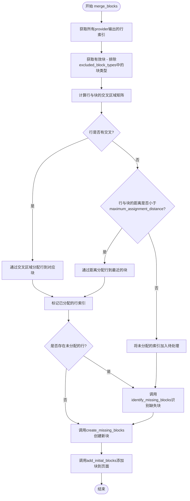

#### 带注释源码

```python
def merge_blocks(
    self,
    provider_outputs: List[ProviderOutput],
    text_extraction_method: str,
    keep_chars: bool = False,
):
    # 步骤1: 获取所有provider输出的行索引，创建一个从0到len(provider_outputs)-1的列表
    provider_line_idxs = list(range(len(provider_outputs)))
    
    # 步骤2: 获取当前有效的子块，排除已被移除的块和excluded_block_types中的块类型
    # excluded_block_types默认包含Line和Span类型
    valid_blocks = [
        block
        for block in self.current_children  # 确保只处理未被替换的子块
        if block.block_type not in self.excluded_block_types
    ]

    # 步骤3: 计算每个provider输出行与有效块之间的交叉区域
    # 返回一个字典，键为行索引，值为(交叉面积, 块ID)的元组
    max_intersections = self.compute_line_block_intersections(
        valid_blocks, provider_outputs
    )

    # 步骤4: 尝试通过交叉区域分配行到块
    assigned_line_idxs = set()  # 记录已分配的行索引
    block_lines = defaultdict(list)  # 块ID到行列表的映射
    for line_idx, provider_output in enumerate(provider_outputs):
        if line_idx in max_intersections:
            # 如果该行与某个块有交叉，则分配给交叉面积最大的块
            block_id = max_intersections[line_idx][1]
            block_lines[block_id].append((line_idx, provider_output))
            assigned_line_idxs.add(line_idx)

    # 步骤5: 对于没有交叉的行，通过距离分配
    for line_idx in set(provider_line_idxs).difference(assigned_line_idxs):
        min_dist = None
        min_dist_idx = None
        provider_output: ProviderOutput = provider_outputs[line_idx]
        line = provider_output.line
        for block in valid_blocks:
            # 计算行中心点到块中心点的距离，x_weight=5表示x轴距离权重更大
            dist = line.polygon.center_distance(block.polygon, x_weight=5)
            if min_dist_idx is None or dist < min_dist:
                min_dist = dist
                min_dist_idx = block.id

        # 只有当距离小于阈值时才分配
        if min_dist_idx is not None and min_dist < self.maximum_assignment_distance:
            block_lines[min_dist_idx].append((line_idx, provider_output))
            assigned_line_idxs.add(line_idx)

    # 步骤6: 识别并创建缺失的块
    # 对于距离太远无法分配的行，识别哪些需要创建新块
    new_blocks = self.identify_missing_blocks(
        provider_line_idxs, provider_outputs, assigned_line_idxs
    )
    # 创建新块并更新block_lines
    self.create_missing_blocks(new_blocks, block_lines)

    # 步骤7: 将处理后的块添加到页面
    self.add_initial_blocks(block_lines, text_extraction_method, keep_chars)
```


### `PageGroup.aggregate_block_metadata`

聚合当前页面组中所有子块的元数据，将它们合并成一个统一的元数据对象。

参数：

- `self`：`PageGroup`，当前页面组实例（隐式参数）

返回值：`BlockMetadata`，聚合后的块元数据，包含所有子块元数据的合并结果

#### 流程图

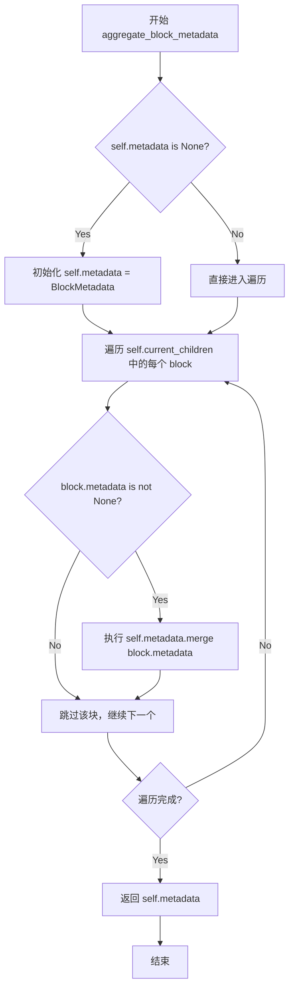

#### 带注释源码

```python
def aggregate_block_metadata(self) -> BlockMetadata:
    # 如果页面组的元数据为空，则初始化一个新的 BlockMetadata 对象
    if self.metadata is None:
        self.metadata = BlockMetadata()

    # 遍历当前所有未移除的子块
    for block in self.current_children:
        # 如果子块具有元数据，则将其合并到页面组的元数据中
        if block.metadata is not None:
            # 使用 merge 方法合并子块元数据到页面组元数据
            self.metadata = self.metadata.merge(block.metadata)
    
    # 返回聚合后的元数据对象
    return self.metadata
```

## 关键组件


### PageGroup 类

文档页面管理器，负责管理和组织 PDF 页面中的内容块（Blocks），包括文本、图像、布局结构等核心功能。

### 图像管理组件

支持低分辨率和高分辨率图像的存储与获取，提供图像模式转换和指定块类型的图像移除功能。

### 块管理组件

负责块的增删改查操作，包括 add_block、get_block、replace_block 等方法，实现块的唯一标识符分配和结构化管理。

### 行-块交叉计算组件

compute_line_block_intersections 方法通过计算_provider_outputs（OCR/识别输出）与现有块的交叉区域，将识别的行文本分配到最合适的块中。

### 块合并与分配组件

merge_blocks 方法实现基于交叉区域和距离的智能行分配策略，优先通过交叉区域匹配，失败时使用中心点距离作为备选方案。

### 缺失块识别与创建组件

identify_missing_blocks 和 create_missing_blocks 方法处理未分配到任何块的孤立行，通过距离阈值将其合并到最近的现有块或创建新块。

### 结构遍历组件

get_next_block 和 get_prev_block 方法提供按文档结构顺序遍历块的能力，支持忽略特定块类型的过滤功能。

### 块元数据聚合组件

aggregate_block_metadata 方法收集并合并所有子块的元数据信息，生成页级别的综合元数据。

### 初始块构建组件

add_initial_blocks 方法将已分配的文本行添加到对应块中，支持字符级别的细粒度结构管理。

### 块替换组件

replace_block 方法处理块的替换操作，同时更新结构中的块引用并将原块标记为已移除。


## 问题及建议


### 已知问题

- **类型注解不精确**: `children: List[Union[Any, Block]] | None = None` 使用了 `Any`，导致类型信息丢失，降低了类型安全性和IDE的代码补全能力
- **变量名拼写错误**: `strucure_block_bboxes` 应该是 `structure_block_bboxes`，影响代码可读性
- **O(n)查找操作**: `get_next_block` 和 `get_prev_block` 方法中使用 `structure.index(block.id)` 进行线性查找，在大型文档中性能较差
- **缺少索引边界检查**: `get_block` 方法直接使用 `self.children[block_id.block_id]` 访问列表，未检查索引是否越界，可能导致 IndexError
- **断言代替异常处理**: `get_block` 中使用 `assert` 而非适当的异常处理，断言在 Python 优化模式下会被跳过
- **重复计算**: `merge_blocks` 方法中多次遍历 `provider_outputs`，可以合并循环以提高效率
- **魔法数字**: `x_weight=5` 和 `maximum_assignment_distance=20` 作为硬编码值散落在多处，缺乏配置说明
- **递归替换潜在风险**: `replace_block` 方法递归遍历所有 children 进行替换，对于深度嵌套的结构可能导致栈溢出
- **方法职责不清晰**: `add_full_block` 既增加 block_id 又添加 child，违背了单一职责原则

### 优化建议

- 将 `children` 的类型注解改为更精确的类型，如 `List[Block]`
- 修复拼写错误 `strucure_block_bboxes` -> `structure_block_bboxes`
- 使用字典或哈希映射替代列表的线性查找，将 `structure` 改为支持 O(1) 查找的数据结构
- 在 `get_block` 方法中添加索引边界检查，并使用 `KeyError` 或返回 `Optional[Block]` 替代 assert
- 将硬编码的配置值提取为类常量或配置对象，提高可维护性
- 使用类型提示的 `Protocol` 或 `Generic` 增强类型安全
- 将 `merge_blocks` 中的多个循环合并，减少遍历次数
- 考虑将递归的 `replace_block` 改写为迭代版本，避免栈溢出风险
- 添加详细的文档字符串，特别是复杂方法如 `merge_blocks` 和 `compute_line_block_intersections`
- 考虑将 `add_block` 和 `add_full_block` 的公共逻辑提取到私有方法中
</think>

## 其它


### 设计目标与约束

本代码的核心设计目标是实现PDF页面内容的结构化管理与重组，具体包括：1）支持低分辨率和高分辨率图像的灵活获取；2）通过多策略（基于交集和距离）将OCR输出行映射到文档块；3）识别并创建缺失的内容块；4）支持字符级别的细粒度内容保留。设计约束包括：最大分配距离默认为20像素，x轴距离权重为5（优先按y轴对齐），排除Line和Span类型的块参与结构计算，layout_sliced标志指示布局模型是否进行了图像切片。

### 错误处理与异常设计

当前代码的错误处理相对薄弱，主要依赖assert语句进行断言检查（如get_block方法中的block.block_id == block_id.block_id）。潜在风险点包括：1）children为None时直接索引可能导致AttributeError；2）structure索引越界风险；3）polygon.area为0时的除零错误。改进建议：1）在get_block中添加None检查；2）在get_next_block和get_prev_block中捕获IndexError；3）对polygon操作添加防御性检查；4）考虑使用自定义异常类（如BlockNotFoundError、StructureError）替代assert；5）在merge_blocks等方法中添加参数有效性验证。

### 数据流与状态机

代码的数据流遵循以下流程：外部调用merge_blocks(provider_outputs, text_extraction_method, keep_chars)入口 -> compute_line_block_intersections计算行与块的交集矩阵 -> 优先基于交集分配行到块 -> 对未分配行基于center_distance距离分配 -> identify_missing_blocks识别缺失块 -> create_missing_blocks创建新块 -> add_initial_blocks将行/span/char添加到块结构中。状态转换：Block.removed标志位跟踪块是否被替换；Block.removed=True的块不进入current_children；structure列表维护块的顺序关系；BlockId通过block_id和page_id复合标识。

### 外部依赖与接口契约

核心依赖：1）PIL.Image - 图像处理和像素操作；2）numpy - 矩阵运算和数值计算；3）pydantic - 数据模型和computed_field装饰器；4）marker.providers.ProviderOutput - OCR provider输出结构；5）marker.schema.blocks相关类 - Block、Text、BlockId、PolygonBox；6）marker.schema.groups.base.Group - 父类结构；7）marker.util.matrix_intersection_area和sort_text_lines - 工具函数。关键接口契约：ProviderOutput必须包含line（带polygon属性）、spans、raw_text、line.text_extraction_method字段；Block类必须实现add_structure、polygon.merge、removed属性；polygon对象必须支持bbox、area、rescale、center_distance方法。

### 性能考虑与优化空间

1）matrix_intersection_area在compute_line_block_intersections和compute_max_structure_block_intersection_pct中被重复调用，可考虑缓存；2）identify_missing_blocks中使用list append操作，可预分配或使用列表推导式优化；3）center_distance在merge_blocks的双重循环中被频繁调用，块数量多时O(n*m)复杂度，可考虑空间索引（如R树）优化；4）structure.index(block.id)在get_next_block和get_prev_block中为O(n)操作，可维护id到索引的映射字典；5）current_children属性每次调用都重新过滤，建议使用缓存或在块状态变更时更新缓存。


    