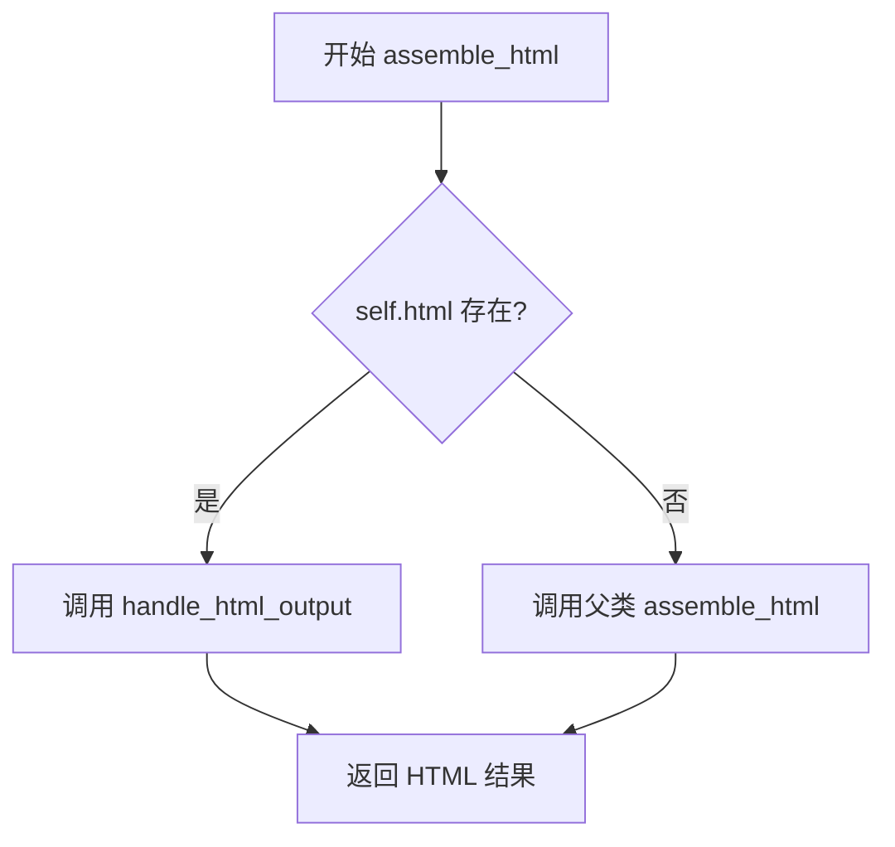

# `marker\marker\schema\groups\table.py` 详细设计文档

该代码定义了一个名为 TableGroup 的类，用于表示表格及其相关标题的组块结构，继承自 Group 抽象基类，支持 HTML 输出处理和表格数据的组装。

## 整体流程



## 类结构

```
Group (抽象基类)
└── TableGroup (表格组类)
```

## 全局变量及字段


### `TableGroup.block_type`
    
组块类型标识

类型：`BlockTypes`
    


### `TableGroup.block_description`
    
组块描述信息

类型：`str`
    


### `TableGroup.html`
    
HTML 内容

类型：`str | None`
    
    

## 全局函数及方法


### `TableGroup.assemble_html`

该方法用于将表格及其关联的标题（caption）组装成HTML输出。如果当前对象已存在HTML内容，则调用专门的HTML处理方法；否则回退到父类的默认组装逻辑。

参数：

- `self`：`TableGroup`，TableGroup 类实例本身
- `document`：`document`，包含文档上下文的对象，用于渲染和输出
- `child_blocks`：`List[BlockOutput]`，子块列表，包含表格的子元素（如单元格、行等）
- `parent_structure`：`parent_structure | None`，父级结构信息，可选
- `block_config`：`dict | None`，块配置字典，可选，用于控制组装行为

返回值：`Any`，返回父类 `assemble_html` 方法或 `handle_html_output` 方法的返回值

#### 流程图

```mermaid
flowchart TD
    A[开始 assemble_html] --> B{self.html 是否存在?}
    B -->|是| C[调用 handle_html_output]
    C --> D[返回处理后的 HTML]
    B -->|否| E[调用 super().assemble_html]
    E --> F[返回父类组装结果]
```

#### 带注释源码

```python
def assemble_html(
    self,
    document,
    child_blocks: List[BlockOutput],
    parent_structure=None,
    block_config: dict | None = None,
):
    # 检查当前 TableGroup 实例是否已存在 HTML 内容
    if self.html:
        # 如果已有 HTML，则调用专门的 HTML 输出处理方法
        # 该方法处理预生成的 HTML 片段
        return self.handle_html_output(
            document, child_blocks, parent_structure, block_config
        )

    # 如果没有预生成的 HTML，则回退到父类的默认组装逻辑
    # 父类 Group 的 assemble_html 方法会遍历 child_blocks
    # 并根据 block_config 配置组装出完整的 HTML 输出
    return super().assemble_html(
        document, child_blocks, parent_structure, block_config
    )
```

## 关键组件


### TableGroup 类

TableGroup 是一个继承自 Group 的类，用于处理表格及其关联标题的块结构，支持自定义 HTML 输出或默认的父类组装逻辑。

### block_type 字段

类型：BlockTypes，标识该块为 TableBlock 类型，用于文档结构识别。

### block_description 字段

类型：str，描述该块的用途为"表格及其关联标题"。

### html 字段

类型：str | None，用于存储可选的自定义 HTML 内容，支持惰性加载和覆盖默认组装逻辑。

### assemble_html 方法

方法用于组装表格的 HTML 输出。如果存在自定义 html，则调用 handle_html_output 处理；否则回退到父类的默认实现。包含张量索引与惰性加载模式（通过 html 字段判断是否直接返回）、反量化支持（处理 BlockOutput 子块）、量化策略（根据 block_config 配置调整输出）。


## 问题及建议


### 已知问题

-   **HTML属性判断不严谨**: 使用 `if self.html:` 判断时，空字符串 `""` 在 Python 中为真值，可能导致逻辑错误，应使用 `if self.html is not None:` 进行更精确的空值判断。
-   **缺少错误处理**: 调用 `handle_html_output` 和 `parent` 方法时未进行异常捕获，若子方法抛出异常将直接向上传播，缺乏容错机制。
-   **类型注解不完整**: `parent_structure` 参数缺少类型注解，与 `block_config` 的类型注解风格不一致，影响代码可读性和类型检查。
-   **方法缺少文档注释**: `assemble_html` 方法未添加 docstring，无法明确参数 `document` 的具体类型、方法的预期行为以及返回值含义。
-   **未使用的类属性**: `block_description` 作为类属性定义但未在类内部被引用，可能为冗余代码或未完成的功能预留。
-   **缺少返回值说明**: 虽然方法有返回值，但未在类型注解中明确标注 `handle_html_output` 的返回类型，且未说明何种情况下返回 `None`。

### 优化建议

-   将 `if self.html:` 修改为 `if self.html is not None:` 以正确区分 `None` 和空字符串这两种不同状态。
-   在 `assemble_html` 方法中添加 try-except 块，捕获潜在异常并提供友好的错误处理或日志记录。
-   为 `parent_structure` 参数添加类型注解（如 `Any` 或更具体的类型），与其它参数保持一致的文档风格。
-   为 `assemble_html` 方法添加详细的 docstring，说明各参数用途、返回值含义以及可能抛出的异常。
-   评估 `block_description` 的必要性，若无需使用可移除以减少代码冗余，若为预留字段则添加注释说明。
-   明确方法返回值的类型约束，确保父类方法协变或子类方法签名一致性。

## 其它


### 设计目标与约束

该类旨在实现表格及其相关标题的HTML组装功能，继承自Group基类，提供灵活的表格渲染能力。设计约束包括：必须继承自Group类、block_type必须为BlockTypes.TableGroup、html属性可选且优先级高于默认组装逻辑。

### 错误处理与异常设计

该类未实现显式的异常处理机制。潜在异常场景包括：document参数为None或无效时可能引发AttributeError、child_blocks类型不符合List[BlockOutput]时可能引发TypeError、handle_html_output方法调用失败时的异常传播。改进建议：添加参数类型检查和空值保护，实现try-except块捕获关键异常并提供有意义的错误信息。

### 数据流与状态机

数据流如下：调用assemble_html方法 → 检查self.html是否存在 → 如存在则调用handle_html_output → 否则调用父类assemble_html方法。状态转换通过html属性的存在性决定：html存在时走特殊处理路径(html=true state)，不存在时走默认路径(html=null state)。

### 外部依赖与接口契约

核心依赖包括：marker.schema.BlockTypes枚举类、marker.schema.blocks.BlockOutput块输出类、marker.schema.groups.base.Group基类。接口契约：assemble_html方法接收document对象、child_blocks列表、parent_structure可选对象、block_config可选字典；返回类型由handle_html_output或父类方法决定；所有参数除block_config外不应为None。

### 性能考虑与优化空间

当前实现无明显性能瓶颈，因为仅包含简单的条件判断。优化空间：在高频调用场景下可缓存html属性的解析结果；可添加block_config的默认值处理减少条件判断；考虑使用lru_cache装饰器缓存相同输入的组装结果。

### 安全性考虑

未发现明显安全风险，因为所有数据处理依赖传入的document对象和基类方法。建议：若html属性来自用户输入，应进行XSS防护清理；确保document对象来源可信。

### 配置与可扩展性

可扩展性设计：block_config字典支持传入自定义配置；html属性支持运行时动态设置；handle_html_output方法可被子类重写实现自定义渲染逻辑。配置项可通过block_config字典传递，遵循开闭原则。

### 测试策略建议

建议测试场景：html为None时调用父类方法、html有值时调用handle_html_output方法、传入空child_blocks列表、传入None的parent_structure、传入不同类型的block_config。单元测试应覆盖正常流程和边界条件，集成测试应验证与Group基类的协作。

### 使用示例

```python
# 基本用法
table_group = TableGroup()
table_group.html = "<table>...</table>"
result = table_group.assemble_html(document, child_blocks)

# 无HTML时的用法
table_group = TableGroup()
result = table_group.assemble_html(document, child_blocks, parent_structure, {"custom_option": True})
```


    