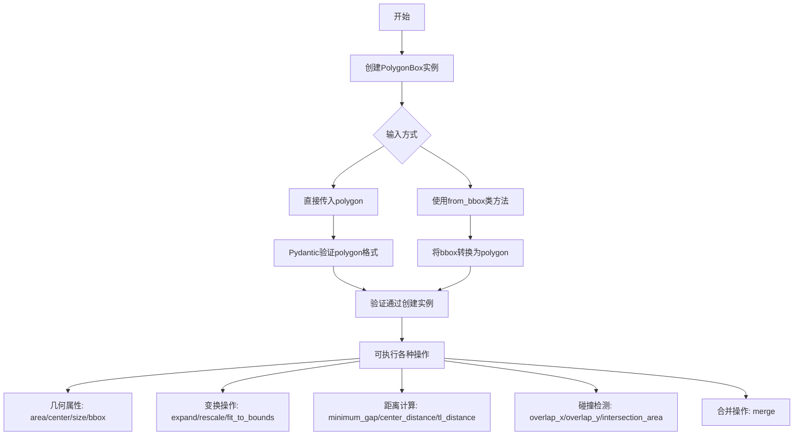
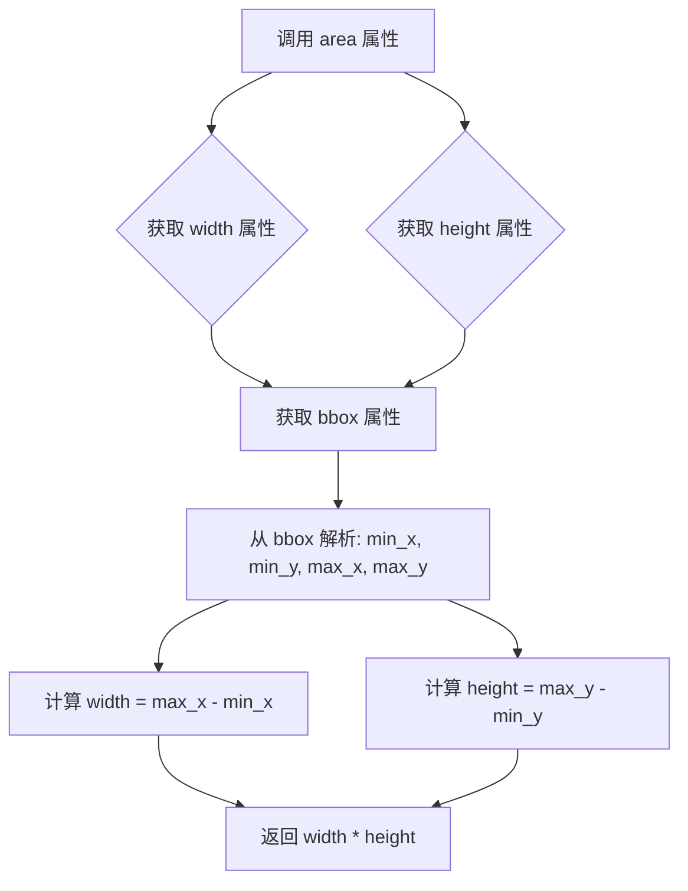
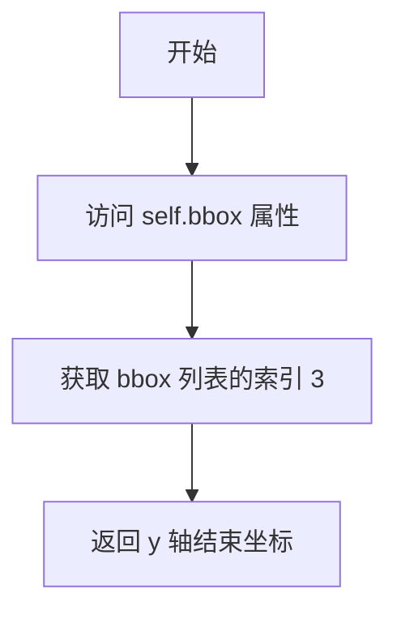
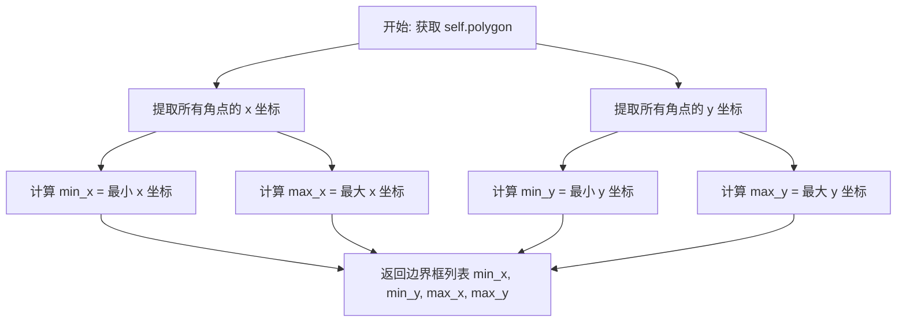
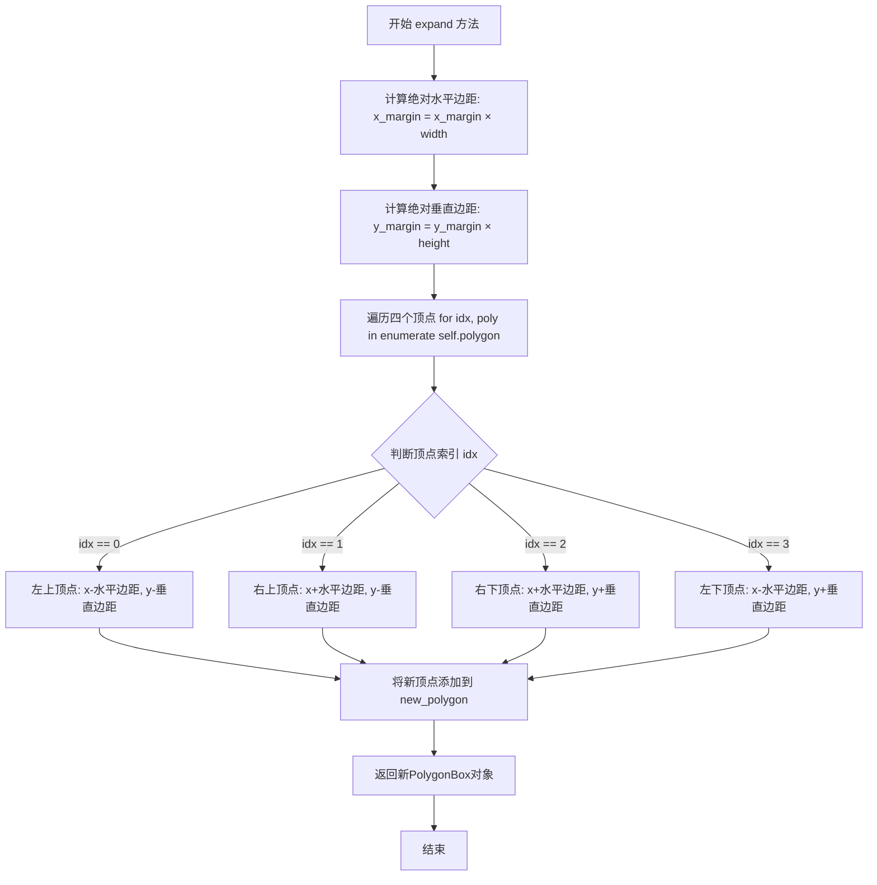
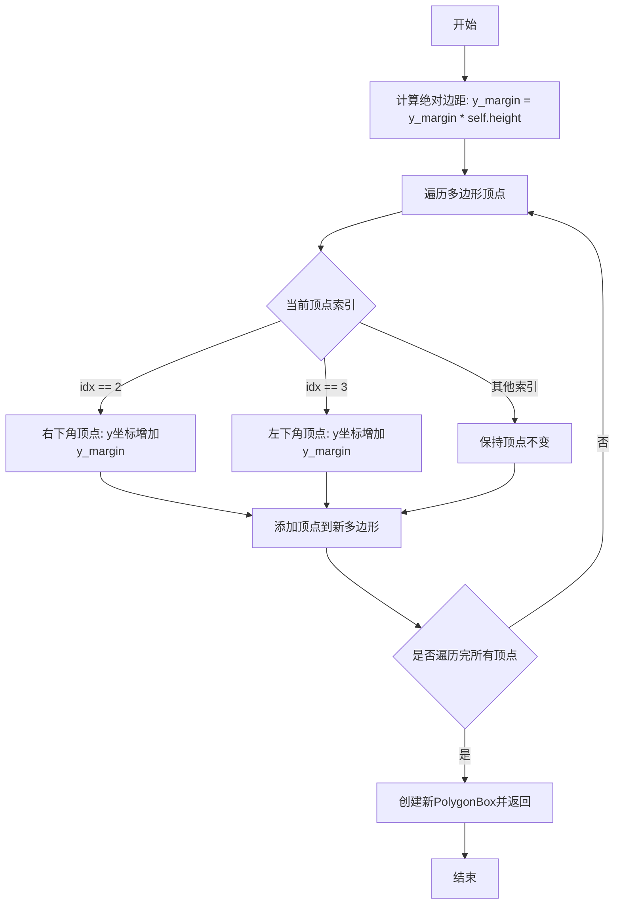
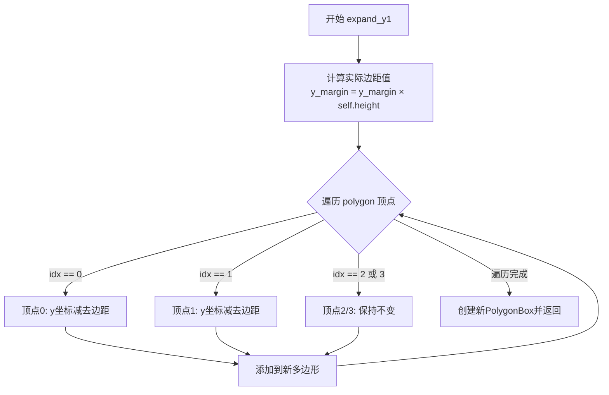

# `marker\marker\schema\polygon.py` 详细设计文档

该代码定义了一个PolygonBox类，用于表示四边形（矩形）边界框，提供了丰富的几何操作方法，包括面积计算、中心点获取、缩放、扩展、合并、碰撞检测等功能，并使用Pydantic进行数据验证。

## 整体流程



## 类结构

```
PolygonBox (Pydantic BaseModel)
└── 字段: polygon (List[List[float]])
└── 方法: check_elements, expand, expand_y2, expand_y1, minimum_gap, center_distance, tl_distance, rescale, fit_to_bounds, overlap_x, overlap_y, intersection_area, intersection_pct, merge, from_bbox
└── 属性: height, width, area, center, size, x_start, y_start, x_end, y_end, bbox
```

## 全局变量及字段


### `copy`
    
Python标准库，用于深拷贝对象

类型：`module`
    


### `np`
    
NumPy库，虽然代码中未直接使用但已被导入

类型：`module`
    


### `BaseModel`
    
Pydantic基类，用于数据验证和设置

类型：`class`
    


### `field_validator`
    
Pydantic字段验证器装饰器

类型：`decorator`
    


### `computed_field`
    
Pydantic计算字段装饰器

类型：`decorator`
    


### `PolygonBox.polygon`
    
四边形的四个顶点坐标列表，每个顶点为[x, y]格式

类型：`List[List[float]]`
    


### `PolygonBox.check_elements`
    
验证polygon数据格式，确保有4个顶点，每个顶点有2个坐标

类型：`field_validator`
    


### `PolygonBox.height`
    
获取四边形的高度

类型：`property`
    


### `PolygonBox.width`
    
获取四边形的宽度

类型：`property`
    


### `PolygonBox.area`
    
计算四边形的面积

类型：`property`
    


### `PolygonBox.center`
    
获取四边形的中心点坐标

类型：`property`
    


### `PolygonBox.size`
    
获取四边形的尺寸 [width, height]

类型：`property`
    


### `PolygonBox.x_start`
    
获取x轴起始坐标

类型：`property`
    


### `PolygonBox.y_start`
    
获取y轴起始坐标

类型：`property`
    


### `PolygonBox.x_end`
    
获取x轴结束坐标

类型：`property`
    


### `PolygonBox.y_end`
    
获取y轴结束坐标

类型：`property`
    


### `PolygonBox.bbox`
    
计算边界框 [min_x, min_y, max_x, max_y]

类型：`computed_field property`
    


### `PolygonBox.expand`
    
按比例扩展四边形边界

类型：`method`
    


### `PolygonBox.expand_y2`
    
向下扩展四边形（正y方向）

类型：`method`
    


### `PolygonBox.expand_y1`
    
向上扩展四边形（负y方向）

类型：`method`
    


### `PolygonBox.minimum_gap`
    
计算与另一个四边形的最小间隙距离

类型：`method`
    


### `PolygonBox.center_distance`
    
计算与另一个四边形的中心距离

类型：`method`
    


### `PolygonBox.tl_distance`
    
计算左上角到另一个四边形左上角的距离

类型：`method`
    


### `PolygonBox.rescale`
    
根据旧尺寸和新尺寸重缩放四边形

类型：`method`
    


### `PolygonBox.fit_to_bounds`
    
将四边形限制在指定边界范围内

类型：`method`
    


### `PolygonBox.overlap_x`
    
计算x轴方向的重叠宽度

类型：`method`
    


### `PolygonBox.overlap_y`
    
计算y轴方向的重叠高度

类型：`method`
    


### `PolygonBox.intersection_area`
    
计算与另一个四边形的交集面积

类型：`method`
    


### `PolygonBox.intersection_pct`
    
计算与另一个四边形的交集占比

类型：`method`
    


### `PolygonBox.merge`
    
合并多个四边形为一个

类型：`method`
    


### `PolygonBox.from_bbox`
    
从边界框创建PolygonBox实例

类型：`classmethod`
    
    

## 全局函数及方法


### `PolygonBox.check_elements`

验证polygon数据格式，确保有4个顶点，每个顶点有2个坐标

参数：

-  `v`：`List[List[float]]`，输入的 polygon 数据，即包含4个顶点的列表，每个顶点是一个包含2个坐标的列表

返回值：`List[List[float]]`，验证通过后返回原始数据；验证失败则抛出 ValueError

#### 流程图

```mermaid
flowchart TD
    A[开始验证] --> B{len(v) == 4?}
    B -- 否 --> C[抛出 ValueError: corner must have 4 elements]
    B -- 是 --> D[遍历每个 corner]
    D --> E{len(corner) == 2?}
    E -- 否 --> F[抛出 ValueError: corner must have 2 elements]
    E -- 是 --> G[计算 min_x 和 min_y]
    G --> H{v[2][1] >= min_y?}
    H -- 否 --> I[AssertionError: bottom right corner should have a greater y value]
    H -- 是 --> J{v[3][1] >= min_y?}
    J -- 否 --> K[AssertionError: bottom left corner should have a greater y value]
    J -- 是 --> L{v[1][0] >= min_x?}
    L -- 否 --> M[AssertionError: top right corner should have a greater x value]
    L -- 是 --> N{v[2][0] >= min_x?}
    N -- 否 --> O[AssertionError: bottom right corner should have a greater x value]
    N -- 是 --> P[返回 v]
```

#### 带注释源码

```python
@field_validator('polygon')
@classmethod
def check_elements(cls, v: List[List[float]]) -> List[List[float]]:
    """
    验证 polygon 数据格式的字段验证器
    
    检查规则：
    1. polygon 必须有且仅有 4 个顶点
    2. 每个顶点必须包含 2 个坐标 [x, y]
    3. 顶点必须按顺时针顺序排列（左上 -> 右上 -> 右下 -> 左下）
    """
    
    # 规则1：检查顶点数量
    if len(v) != 4:
        raise ValueError('corner must have 4 elements')

    # 规则2：检查每个顶点的坐标数量
    for corner in v:
        if len(corner) != 2:
            raise ValueError('corner must have 2 elements')

    # 计算最小坐标值用于后续验证
    min_x = min([corner[0] for corner in v])
    min_y = min([corner[1] for corner in v])

    # 规则3：验证顶点顺序为顺时针
    # 顶点顺序应为：[左上, 右上, 右下, 左下]
    corner_error = f" .Corners are {v}"
    
    # 验证右下角 y 坐标 >= 右上角 y 坐标
    assert v[2][1] >= min_y, f'bottom right corner should have a greater y value than top right corner' + corner_error
    
    # 验证左下角 y 坐标 >= 左上角 y 坐标
    assert v[3][1] >= min_y, 'bottom left corner should have a greater y value than top left corner' + corner_error
    
    # 验证右上角 x 坐标 >= 左上角 x 坐标
    assert v[1][0] >= min_x, 'top right corner should have a greater x value than top left corner' + corner_error
    
    # 验证右下角 x 坐标 >= 左下角 x 坐标
    assert v[2][0] >= min_x, 'bottom right corner should have a greater x value than bottom left corner' + corner_error
    
    # 验证通过，返回原始数据
    return v
```


### `PolygonBox.height`

获取四边形的高度，通过计算边界框的最大y坐标与最小y坐标之差得到。

参数： 无

返回值：`float`，四边形的高度（即边界框的垂直尺寸）

#### 流程图

```mermaid
flowchart TD
    A[访问 height 属性] --> B[获取 bbox 属性值]
    B --> C[计算 bbox[3] - bbox[1]]
    C --> D[返回高度值]
    
    subgraph bbox计算过程
    E[获取 polygon 顶点列表] --> F[遍历所有顶点]
    F --> G[找到最小y坐标: min_y]
    F --> H[找到最大y坐标: max_y]
    G --> I[返回 min_x, min_y, max_x, max_y]
    H --> I
    end
    
    B -.-> E
```

#### 带注释源码

```python
@property
def height(self):
    """
    获取四边形的高度
    
    通过计算边界框（bbox）的最大y坐标与最小y坐标之差得到高度。
    bbox属性会根据polygon的所有顶点计算最小和最大的x、y坐标。
    
    Returns:
        float: 四边形的高度，等于边界框的max_y - min_y
    """
    return self.bbox[3] - self.bbox[1]
```


### `PolygonBox.width`

获取四边形的宽度，通过计算边界框（Bounding Box）的右边界与左边界之差得到。

参数：
- （无参数）

返回值：`float`，四边形的宽度值

#### 流程图

```mermaid
graph TD
    A[开始] --> B[获取self.bbox属性]
    B --> C[访问bbox[2] - bbox[0]]
    C --> D[计算右边界x坐标 - 左边界x坐标]
    D --> E[返回宽度值]
```

#### 带注释源码

```python
@property
def width(self):
    """
    获取四边形的宽度
    
    通过计算边界框（Bounding Box）的右边界（bbox[2]）与左边界（bbox[0]）之差
    来得到四边形的宽度。该宽度是基于最小外接矩形计算得出的。
    
    Returns:
        float: 四边形的宽度，等于边界框的max_x - min_x
    """
    return self.bbox[2] - self.bbox[0]
```


### `PolygonBox.area`

该属性是 PolygonBox 类的面积计算属性，通过获取该四边形的宽度和高度并相乘得到面积值。

参数：无（这是一个属性 getter，不接受任何参数）

返回值：`float`，返回四边形的面积，等于宽度乘以高度

#### 流程图



#### 带注释源码

```python
@property
def area(self):
    """
    计算四边形的面积
    
    该属性是一个只读属性，通过将宽度(width)和高度(height)相乘来计算面积。
    面积计算依赖于 bbox（边界框）属性，该属性会从多边形顶点中计算出最小和最大的 x、y 坐标。
    
    返回:
        float: 四边形的面积，等于边界框的宽度乘以高度
    """
    # width 和 height 属性内部会调用 bbox 属性
    # bbox 属性会计算: [min_x, min_y, max_x, max_y]
    # width = bbox[2] - bbox[0] = max_x - min_x
    # height = bbox[3] - bbox[1] = max_y - min_y
    # area = width * height = (max_x - min_x) * (max_y - min_y)
    return self.width * self.height
```

#### 依赖关系说明

- **依赖属性**：`self.width`、`self.height`
- **间接依赖**：`self.bbox`（通过 width 和 height 间接依赖）
- **计算流程**：area → width/height → bbox（边界框计算）→ polygon（原始顶点数据）

#### 设计考量

1. **计算效率**：area 属性的计算是 O(1) 复杂度，因为它依赖于已经缓存的 bbox 属性
2. **数据一致性**：由于 width、height 和 area 都依赖同一个 bbox 属性，保证了在同一时刻计算的一致性
3. **只读设计**：使用 @property 装饰器确保面积是只读属性，防止直接修改


### `PolygonBox.center`

获取四边形的中心点坐标。该属性通过计算包围盒（Bounding Box）的最小和最大坐标的中点来确定四边形的几何中心位置。

参数： 无（属性方法，仅包含 self 参数）

返回值：`List[float]`，返回包含两个浮点数的列表，分别为中心点的 x 坐标和 y 坐标，格式为 `[x_center, y_center]`。

#### 流程图

```mermaid
flowchart TD
    A[Start] --> B[获取 bbox 属性<br/>bbox = [min_x, min_y, max_x, max_y]]
    B --> C[计算 x 坐标<br/>x_center = (bbox[0] + bbox[2]) / 2]
    C --> D[计算 y 坐标<br/>y_center = (bbox[1] + bbox[3]) / 2]
    D --> E[返回中心点坐标<br/>[x_center, y_center]]
```

#### 带注释源码

```python
@property
def center(self):
    """
    获取四边形的中心点坐标
    
    通过计算包围盒（Bounding Box）的几何中心来确定四边形的中心位置。
    包围盒是一个矩形框，由四个顶点坐标的最小最大值组成：
    - bbox[0]: 最小 x 坐标（包围盒左边界）
    - bbox[1]: 最小 y 坐标（包围盒上边界）
    - bbox[2]: 最大 x 坐标（包围盒右边界）
    - bbox[3]: 最大 y 坐标（包围盒下边界）
    
    中心点计算公式：
    - x_center = (min_x + max_x) / 2
    - y_center = (min_y + max_y) / 2
    
    Returns:
        List[float]: 中心点坐标 [x_center, y_center]
    """
    # 获取包围盒属性（computed_field，会自动计算四个角的 min/max 坐标）
    # bbox 格式: [min_x, min_y, max_x, max_y]
    bbox = self.bbox
    
    # 计算 x 坐标中心点：左右边界的中点
    x_center = (bbox[0] + bbox[2]) / 2
    
    # 计算 y 坐标中心点：上下边界的中点
    y_center = (bbox[1] + bbox[3]) / 2
    
    # 返回中心点坐标列表
    return [x_center, y_center]
```


### `PolygonBox.size`

该属性用于获取当前四边形对象的宽度和高度，并以列表形式 `[width, height]` 返回。它依赖于 `width` 和 `height` 属性的计算结果。

参数：
- (无)

返回值：`List[float]`，返回一个包含宽（width）和高（height）的列表。

#### 流程图

```mermaid
flowchart TD
    A[调用 size 属性] --> B{计算 width}
    B --> C[访问 self.bbox]
    C --> D[计算 max_x - min_x]
    D --> B
    A --> E{计算 height}
    E --> F[访问 self.bbox]
    F --> G[计算 max_y - min_y]
    G --> E
    B --> H[组合结果]
    E --> H
    H --> I[返回 [width, height]]
```

#### 带注释源码

```python
@property
def size(self) -> List[float]:
    """
    获取四边形的尺寸 [width, height]
    
    返回:
        List[float]: 包含宽度和高度的列表 [width, height]
    """
    # 内部调用 width 和 height 属性
    # width 实际上是 bbox[2] - bbox[0]
    # height 实际上是 bbox[3] - bbox[1]
    # 注意：此处调用了两次 bbox 的计算逻辑，可能涉及性能开销
    return [self.width, self.height]
```

#### 依赖与约束

*   **前置依赖**：该方法依赖于 `PolygonBox.width` 和 `PolygonBox.height` 属性。
*   **数据依赖**：最终依赖于 `PolygonBox.bbox` (计算边界框) 和 `PolygonBox.polygon` (原始顶点数据)。
*   **约束**：输入的 `polygon` 必须通过 `check_elements` 校验，保证是一个有效的四边形。

#### 潜在优化

1.  **性能优化**：当前实现中，`size` 属性会触发两次 `bbox` 的计算过程（一次为 `width`，一次为 `height`）。如果 `size` 方法在性能敏感的循环中被大量调用，建议在此处添加缓存机制（如 `functools.lru_cache` 或 Pydantic 的缓存配置），或者在 `PolygonBox` 类初始化时计算并缓存 `bbox`，以避免重复的最小值/最大值遍历计算。
2.  **冗余计算**：由于 `width` 和 `height` 都依赖 `bbox`，如果代码中存在大量同时需要宽和高的场景，直接调用 `size` 是符合直觉的，但在极致的数值计算场景下，可以考虑直接访问 `bbox` 列表的切片来避免属性查找的开销。


### `PolygonBox.x_start`

获取x轴起始坐标，即边界框（Bounding Box）的最小x值

参数：无（该属性不需要额外参数，隐式的self由Python处理）

返回值：`float`，返回边界框的x轴起始坐标（最小x值）

#### 流程图

```mermaid
graph TD
    A[调用 x_start 属性] --> B{检查 bbox 是否已缓存}
    B -->|是| C[直接返回 self.bbox[0]]
    B -->|否| D[计算 bbox: 遍历 polygon 找到 min_x, min_y, max_x, max_y]
    D --> C
    C --> E[返回最小 x 坐标]
    
    style A fill:#e1f5fe
    style E fill:#c8e6c9
```

#### 带注释源码

```python
@property
def x_start(self) -> float:
    """
    获取x轴起始坐标
    
    该属性返回边界框的最小x坐标，即外接矩形左上角的x值。
    边界框是通过计算多边形所有角点得到的最小外接矩形。
    
    Returns:
        float: 边界框的最小x坐标（x轴起始点）
    """
    return self.bbox[0]  # 返回边界框的第一个元素，即最小x坐标
```

#### 补充说明

- **调用链**：该属性依赖于 `bbox` 计算属性，`bbox` 会遍历 `polygon` 列表计算最小和最大坐标
- **性能考虑**：由于 `bbox` 是 `@computed_field` 装饰的属性，在 Pydantic v2 中会被缓存，首次计算后后续访问直接返回缓存值
- **与其他属性的关系**：与 `x_end`（最大x坐标）、`y_start`（最小y坐标）、`y_end`（最大y坐标）共同构成边界框的四个边界
- **异常情况**：如果 `polygon` 数据无效（如空列表或格式错误），在 `bbox` 计算时会抛出异常


### `PolygonBox.y_start`

获取多边形 bounding box 的 y 轴起始坐标（即最小 y 值）

参数： 无

返回值：`float`，返回多边形在 y 轴方向的起始坐标（即 bbox 中索引为 1 的值，对应 min_y）

#### 流程图

```mermaid
flowchart TD
    A[调用 y_start 属性] --> B[访问 self.bbox 属性]
    B --> C[计算 polygon 中所有点的 y 坐标最小值]
    C --> D[返回 bbox[1]]
    D --> E[即 min_y 值]
```

#### 带注释源码

```python
@property
def y_start(self):
    """获取 y 轴起始坐标
    
    该属性返回多边形 bounding box 在 y 轴方向的最小值（起始坐标），
    相当于 bounding box 的顶部 y 坐标。
    
    Returns:
        float: y 轴起始坐标 (min_y)
    """
    return self.bbox[1]
```

---

**补充说明**：

- `y_start` 是一个计算属性（property），依赖 `bbox` 属性的计算结果
- `bbox` 属性通过遍历 `polygon` 列表中的所有角点，计算出 min_x, min_y, max_x, max_y 四个值
- `y_start` 返回的值即 `bbox` 列表中的第二个元素（索引 1），代表多边形在 y 轴方向的最小边界
- 该属性为只读属性，不接受任何参数


### `PolygonBox.x_end`

获取x轴结束坐标，即边界框（Bounding Box）的最大x值。

参数：无需显式参数（隐式参数 `self` 为 PolygonBox 实例）

返回值：`float`，返回边界框的x轴结束坐标（最大x值）

#### 流程图

```mermaid
flowchart TD
    A[访问 x_end 属性] --> B{触发 get 访问器}
    B --> C[调用 self.bbox 计算属性]
    C --> D[获取 bbox[2] 即 max_x]
    D --> E[返回 max_x 值]
```

#### 带注释源码

```python
@property
def x_end(self) -> float:
    """
    获取x轴结束坐标
    
    该属性是PolygonBox类的计算属性，通过访问内部存储的polygon顶点列表，
    计算出边界框的最大x坐标（即最右边的x值）。
    
    Returns:
        float: 边界框的x轴结束坐标（最大x值）
    """
    return self.bbox[2]  # bbox格式为 [min_x, min_y, max_x, max_y]，索引2对应max_x
```


### `PolygonBox.y_end`

获取y轴结束坐标，即边界框的最大y值

参数：

-  `self`：`PolygonBox`，类的实例本身

返回值：`float`，返回边界框的y轴结束坐标（即y轴最大值）

#### 流程图



#### 带注释源码

```python
@property
def y_end(self):
    """
    获取y轴结束坐标
    
    该属性返回边界框的y轴最大值，即多边形在y方向的结束位置。
    bbox 格式为 [min_x, min_y, max_x, max_y]，索引3对应 max_y
    """
    return self.bbox[3]  # 返回边界框的最大y坐标
```


### `PolygonBox.bbox`

计算给定多边形的轴对齐边界框（AABB），返回包含最小和最大 x、y 坐标的列表。

参数：

- `self`：`PolygonBox`，PolygonBox 实例本身，包含一个 `polygon` 属性（`List[List[float]]`），表示四边形的四个角点坐标

返回值：`List[float]`，边界框坐标 `[min_x, min_y, max_x, max_y]`，其中 `min_x` 和 `min_y` 是最左上角坐标，`max_x` 和 `max_y` 是最右下角坐标

#### 流程图



#### 带注释源码

```python
@computed_field
@property
def bbox(self) -> List[float]:
    """
    计算多边形的轴对齐边界框（AABB）
    
    通过遍历多边形的所有角点，找出 x 和 y 坐标的最小值和最大值，
    返回一个包含 [min_x, min_y, max_x, max_y] 的列表
    """
    # 遍历多边形所有角点，提取每个角点的 x 坐标（第一个元素），然后取最小值
    min_x = min([corner[0] for corner in self.polygon])
    
    # 遍历多边形所有角点，提取每个角点的 y 坐标（第二个元素），然后取最小值
    min_y = min([corner[1] for corner in self.polygon])
    
    # 遍历多边形所有角点，提取每个角点的 x 坐标，然后取最大值
    max_x = max([corner[0] for corner in self.polygon])
    
    # 遍历多边形所有角点，提取每个角点的 y 坐标，然后取最大值
    max_y = max([corner[1] for corner in self.polygon])
    
    # 返回边界框坐标 [左, 上, 右, 下]
    return [min_x, min_y, max_x, max_y]
```


### PolygonBox.expand

按比例扩展四边形边界，根据传入的x和y方向的margin比例，分别计算绝对像素偏移量，然后按照四边形四个顶点的顺序（左上、右上、右下、左下）进行相应的扩展，生成一个新的PolygonBox对象。

参数：

- `x_margin`：`float`，水平方向扩展比例，相对于当前四边形宽度的倍数（如0.1表示宽度增加10%）
- `y_margin`：`float`，垂直方向扩展比例，相对于当前四边形高度的倍数（如0.1表示高度增加10%）

返回值：`PolygonBox`，扩展后的新四边形对象，包含扩展后的四个顶点坐标

#### 流程图



#### 带注释源码

```python
def expand(self, x_margin: float, y_margin: float) -> PolygonBox:
    """
    按比例扩展四边形边界
    
    参数:
        x_margin: float, 水平方向扩展比例, 相对于宽度
        y_margin: float, 垂直方向扩展比例, 相对于高度
    
    返回:
        PolygonBox: 扩展后的新四边形对象
    """
    # 初始化新的多边形顶点列表
    new_polygon = []
    
    # 将比例转换为绝对像素值：水平边距 = 比例 × 当前宽度
    x_margin = x_margin * self.width
    
    # 将比例转换为绝对像素值：垂直边距 = 比例 × 当前高度
    y_margin = y_margin * self.height
    
    # 遍历原始四边形的四个顶点
    # 顶点顺序: 0-左上, 1-右上, 2-右下, 3-左下 (顺时针)
    for idx, poly in enumerate(self.polygon):
        if idx == 0:
            # 左上顶点: 向左和向上扩展
            new_polygon.append([poly[0] - x_margin, poly[1] - y_margin])
        elif idx == 1:
            # 右上顶点: 向右和向上扩展
            new_polygon.append([poly[0] + x_margin, poly[1] - y_margin])
        elif idx == 2:
            # 右下顶点: 向右和向下扩展
            new_polygon.append([poly[0] + x_margin, poly[1] + y_margin])
        elif idx == 3:
            # 左下顶点: 向左和向下扩展
            new_polygon.append([poly[0] - x_margin, poly[1] + y_margin])
    
    # 使用扩展后的顶点创建新的PolygonBox对象并返回
    return PolygonBox(polygon=new_polygon)
```


### `PolygonBox.expand_y2`

向下扩展四边形（正y方向），通过增加底部两个顶点（右下角和左下角）的y坐标来实现四边形在y轴正方向的扩展，返回一个新的PolygonBox对象。

参数：

- `y_margin`：`float`，扩展边距值（相对于当前四边形高度的比例，如0.1表示增加10%的高度）

返回值：`PolygonBox`，返回扩展后的新四边形对象

#### 流程图



#### 带注释源码

```
def expand_y2(self, y_margin: float) -> PolygonBox:
    """
    向下扩展四边形（正y方向）
    
    参数:
        y_margin: float, 扩展边距值（相对于当前高度的比例）
    
    返回:
        PolygonBox: 扩展后的新四边形对象
    """
    new_polygon = []
    # 将相对边距转换为绝对边距（基于当前四边形高度）
    y_margin = y_margin * self.height
    # 遍历四边形的四个顶点
    for idx, poly in enumerate(self.polygon):
        # 索引2对应右下角(bottom right)，索引3对应左下角(bottom left)
        # 这两个顶点位于四边形底部，需要增加y坐标来实现向下扩展
        if idx == 2:
            # 右下角顶点：x坐标不变，y坐标增加边距
            new_polygon.append([poly[0], poly[1] + y_margin])
        elif idx == 3:
            # 左下角顶点：x坐标不变，y坐标增加边距
            new_polygon.append([poly[0], poly[1] + y_margin])
        else:
            # 顶部两个顶点保持不变
            new_polygon.append(poly)
    # 返回新的PolygonBox对象（不修改原始对象）
    return PolygonBox(polygon=new_polygon)
```


### `PolygonBox.expand_y1`

向上扩展四边形（负y方向），通过减少顶部两个顶点（索引0和1）的y坐标来实现四边形在y轴负方向的扩展。

参数：

- `y_margin`：`float`，扩展边距比例，相对于当前四边形高度的比例值

返回值：`PolygonBox`，扩展后的新四边形对象

#### 流程图



#### 带注释源码

```python
def expand_y1(self, y_margin: float) -> PolygonBox:
    """
    向上扩展四边形（负y方向）
    
    参数:
        y_margin: float, 扩展边距比例，相对于当前四边形高度的比例值
                  例如 0.1 表示扩展当前高度的 10%
    
    返回:
        PolygonBox: 扩展后的新四边形对象
    """
    new_polygon = []  # 用于存储扩展后的新顶点列表
    
    # 将比例转换为实际像素值
    y_margin = y_margin * self.height
    
    # 遍历原始四边形的四个顶点
    for idx, poly in enumerate(self.polygon):
        if idx == 0:
            # 索引0: 左上角顶点，y坐标向上移动（减去边距）
            new_polygon.append([poly[0], poly[1] - y_margin])
        elif idx == 1:
            # 索引1: 右上角顶点，y坐标向上移动（减去边距）
            new_polygon.append([poly[0], poly[1] - y_margin])
        else:
            # 索引2和3: 底部两个顶点保持不变
            new_polygon.append(poly)
    
    # 返回扩展后的新PolygonBox对象
    return PolygonBox(polygon=new_polygon)
```


### `PolygonBox.minimum_gap`

计算与另一个四边形（PolygonBox）的最小间隙距离。如果两个四边形相交，则返回0；否则，根据两个边界框（Bounding Box）的相对位置关系，计算最近边缘或角点之间的距离。

参数：

- `other`：`PolygonBox`，需要计算间隙距离的目标四边形对象

返回值：`float`，两个四边形之间的最小间隙距离（如果相交则返回0）

#### 流程图

```mermaid
flowchart TD
    A[开始计算 minimum_gap] --> B{两个多边形是否相交<br/>intersection_pct > 0?}
    B -->|是| C[返回 0]
    B -->|否| D[计算相对位置关系]
    D --> E{其他在左侧?<br/>other.bbox[2] < self.bbox[0]}
    D --> F{自身在左侧?<br/>self.bbox[2] < other.bbox[0]}
    D --> G{其他在下方?<br/>other.bbox[3] < self.bbox[1]}
    D --> H{自身在下方?<br/>self.bbox[3] < other.bbox[1]}
    
    E --> I{左上角情况?<br/>top and left}
    E --> J{左下角情况?<br/>left and bottom}
    F --> K{右下角情况?<br/>bottom and right}
    F --> L{右上角情况?<br/>right and top}
    
    I --> M[计算左上角对角距离]
    J --> N[计算左下角对角距离]
    K --> O[计算右下角对角距离]
    L --> P[计算右上角对角距离]
    
    M --> Q[返回计算的距离]
    N --> Q
    O --> Q
    P --> Q
    
    E --> R{左侧情况<br/>left only}
    F --> S{右侧情况<br/>right only}
    G --> T{下方情况<br/>bottom only}
    H --> U{上方情况<br/>top only}
    
    R --> V[返回水平间隙距离<br/>self.bbox[0] - other.bbox[2]]
    S --> W[返回水平间隙距离<br/>other.bbox[0] - self.bbox[2]]
    T --> X[返回垂直间隙距离<br/>self.bbox[1] - other.bbox[3]]
    U --> Y[返回垂直间隙距离<br/>other.bbox[1] - self.bbox[3]]
    
    V --> Z[返回距离]
    W --> Z
    X --> Z
    Y --> Z
    
    Z --> AA[结束]
    C --> AA
    Q --> AA
```

#### 带注释源码

```python
def minimum_gap(self, other: PolygonBox):
    """
    计算与另一个四边形的最小间隙距离
    
    参数:
        other: 目标多边形框，用于计算与当前多边形框之间的间隙
    
    返回:
        float: 两个多边形之间的最小间隙距离（如果相交则返回0）
    """
    # Step 1: 检查两个多边形是否相交
    # 如果存在交集（intersection_pct > 0），则间隙为0
    if self.intersection_pct(other) > 0:
        return 0

    # Step 2: 定义欧几里得距离计算函数
    def dist(p1, p2):
        """计算两个二维坐标点之间的欧几里得距离"""
        return ((p1[0] - p2[0]) ** 2 + (p1[1] - p2[1]) ** 2) ** 0.5

    # Step 3: 计算两个边界框的相对位置关系
    # bbox格式: [min_x, min_y, max_x, max_y]
    left = other.bbox[2] < self.bbox[0]    # other在self的左侧（other的右边界 < self的左边界）
    right = self.bbox[2] < other.bbox[0]    # self在other的左侧（self的右边界 < other的左边界）
    bottom = other.bbox[3] < self.bbox[1]   # other在self的下方（other的上边界 < self的下边界）
    top = self.bbox[3] < other.bbox[1]      # self在other的下方（self的上边界 < other的下边界）

    # Step 4: 根据相对位置关系计算最小间隙距离
    # 4.1 对角位置情况 - 计算角点之间的欧几里得距离
    if top and left:
        # other位于self的左上方，计算self左上角与other右下角的距离
        return dist((self.bbox[0], self.bbox[3]), (other.bbox[2], other.bbox[1]))
    elif left and bottom:
        # other位于self的左下方，计算self左下角与other右上角的距离
        return dist((self.bbox[0], self.bbox[1]), (other.bbox[2], other.bbox[3]))
    elif bottom and right:
        # other位于self的右下方，计算self右下角与other左上角的距离
        return dist((self.bbox[2], self.bbox[1]), (other.bbox[0], other.bbox[3]))
    elif right and top:
        # other位于self的右上方，计算self右上角与other左下角的距离
        return dist((self.bbox[2], self.bbox[3]), (other.bbox[0], other.bbox[1]))
    
    # 4.2 水平方向上的非重叠情况 - 计算水平间隙
    elif left:
        # other完全在self的左侧，返回self左边界与other右边界之间的距离
        return self.bbox[0] - other.bbox[2]
    elif right:
        # self完全在other的左侧，返回other左边界与self右边界之间的距离
        return other.bbox[0] - self.bbox[2]
    
    # 4.3 垂直方向上的非重叠情况 - 计算垂直间隙
    elif bottom:
        # other完全在self的下方，返回self上边界与other下边界之间的距离
        return self.bbox[1] - other.bbox[3]
    elif top:
        # self完全在other的下方，返回other上边界与self下边界之间的距离
        return other.bbox[1] - self.bbox[3]
    
    # 4.4 其他情况（应该不会到达这里，因为前面已经处理了所有情况）
    else:
        return 0
```


### `PolygonBox.center_distance`

计算当前四边形与另一个四边形的中心点之间的距离，支持欧几里得距离和曼哈顿距离两种计算方式，并可对 x 和 y 方向的距离分别设置权重。

参数：

- `other`：`PolygonBox`，目标四边形对象，用于计算与当前四边形的中心距离
- `x_weight`：`float`，x 轴距离的权重系数，默认为 1
- `y_weight`：`float`，y 轴距离的权重系数，默认为 1
- `absolute`：`bool`，是否使用绝对距离（曼哈顿距离），False 表示使用欧几里得距离，默认为 False

返回值：`float`，两个四边形中心点之间的距离值

#### 流程图

```mermaid
flowchart TD
    A[开始计算中心距离] --> B{absolute 参数是否为 False?}
    B -->|是| C[计算欧几里得距离]
    B -->|否| D[计算绝对距离/曼哈顿距离]
    C --> E[返回: √((dx² × x_weight) + (dy² × y_weight))]
    D --> F[返回: |dx| × x_weight + |dy| × y_weight]
    E --> G[结束]
    F --> G
```

#### 带注释源码

```python
def center_distance(self, other: PolygonBox, x_weight: float = 1, y_weight: float = 1, absolute=False):
    """
    计算当前四边形与另一个四边形的中心点之间的距离
    
    参数:
        other: PolygonBox - 目标四边形对象
        x_weight: float - x轴距离的权重系数，默认为1
        y_weight: float - y轴距离的权重系数，默认为1
        absolute: bool - 是否使用绝对距离（曼哈顿距离），默认为False（欧几里得距离）
    
    返回:
        float - 两个四边形中心点之间的距离值
    """
    # 判断是否使用绝对距离模式
    if not absolute:
        # 使用欧几里得距离计算：sqrt((dx² × x_weight) + (dy² × y_weight))
        # 其中 dx = self.center[0] - other.center[0]，dy = self.center[1] - other.center[1]
        # center 属性返回 [(x1+x2)/2, (y1+y2)/2]，即包围盒的中心点坐标
        return ((self.center[0] - other.center[0]) ** 2 * x_weight + (self.center[1] - other.center[1]) ** 2 * y_weight) ** 0.5
    else:
        # 使用曼哈顿距离（绝对距离）计算：|dx| × x_weight + |dy| × y_weight
        # 这种方式计算的是在网格中移动的最短路径，不考虑对角线
        return abs(self.center[0] - other.center[0]) * x_weight + abs(self.center[1] - other.center[1]) * y_weight
```


### `PolygonBox.tl_distance`

计算当前四边形左上角（top-left）与另一个四边形左上角之间的欧几里得距离。

参数：

- `self`：`PolygonBox`，当前四边形实例（隐式参数）
- `other`：`PolygonBox`，目标四边形，用于计算距离

返回值：`float`，当前四边形与目标四边形左上角之间的欧几里得距离

#### 流程图

```mermaid
flowchart TD
    A[开始 tl_distance] --> B[获取 self.bbox]
    B --> C[获取 self.bbox[0] 和 self.bbox[1]]
    C --> D[获取 other.bbox]
    D --> E[获取 other.bbox[0] 和 other.bbox[1]]
    E --> F[计算 x 距离差: self.bbox[0] - other.bbox[0]]
    F --> G[计算 y 距离差: self.bbox[1] - other.bbox[1]]
    G --> H[计算 x 距离差的平方: (self.bbox[0] - other.bbox[0])²]
    H --> I[计算 y 距离差的平方: (self.bbox[1] - other.bbox[1])²]
    I --> J[平方和: x² + y²]
    J --> K[开平方根: √(x² + y²)]
    K --> L[返回距离值]
```

#### 带注释源码

```python
def tl_distance(self, other: PolygonBox):
    """
    计算当前四边形左上角到另一个四边形左上角的欧几里得距离
    
    参数:
        other: PolygonBox - 目标四边形对象
    
    返回:
        float - 两四边形左上角坐标之间的欧几里得距离
    """
    # self.bbox[0] 是当前四边形的最小 x 坐标（左边界/左上角 x）
    # self.bbox[1] 是当前四边形的最小 y 坐标（上边界/左上角 y）
    # other.bbox[0] 是目标四边形的最小 x 坐标
    # other.bbox[1] 是目标四边形的最小 y 坐标
    
    # 计算 x 坐标差值的平方
    x_diff_squared = (self.bbox[0] - other.bbox[0]) ** 2
    
    # 计算 y 坐标差值的平方
    y_diff_squared = (self.bbox[1] - other.bbox[1]) ** 2
    
    # 返回欧几里得距离：√(Δx² + Δy²)
    return (x_diff_squared + y_diff_squared) ** 0.5
```


### `PolygonBox.rescale`

根据传入的原始图像尺寸（old_size）和目标图像尺寸（new_size），计算宽高缩放比例，并将该四边形（PolygonBox）实例的所有顶点坐标按照对应轴向的缩放比例进行变换，最后返回一个新的 PolygonBox 对象。该方法常用于将坐标从原始文档页面映射到调整大小后的图像上。

参数：

- `old_size`：`Tuple[float, float]`，原始尺寸，格式为 (width, height)，表示缩放前的页面或图像大小。
- `new_size`：`Tuple[float, float]`，目标尺寸，格式为 (width, height)，表示缩放后的页面或图像大小。

返回值：`PolygonBox`，返回一个新的 PolygonBox 实例，其顶点坐标已根据缩放比例更新。

#### 流程图

```mermaid
graph TD
    A[Start rescale method] --> B[Input: old_size, new_size]
    B --> C[Unpack old_size: page_width, page_height]
    C --> D[Unpack new_size: img_width, img_height]
    D --> E[Calculate width_scaler = img_width / page_width]
    E --> F[Calculate height_scaler = img_height / page_height]
    F --> G[Deep copy self.polygon to new_corners]
    G --> H{Iterate over corners}
    H -->|For each corner| I[corner[0] = corner[0] * width_scaler]
    I --> J[corner[1] = corner[1] * height_scaler]
    J --> H
    H --> K[Create new PolygonBox with new_corners]
    K --> L[Return new PolygonBox]
```

#### 带注释源码

```python
def rescale(self, old_size, new_size):
    # 参数 old_size 和 new_size 被解包为 (宽, 高) 格式
    # Point is in x, y format
    page_width, page_height = old_size
    img_width, img_height = new_size

    # 计算宽高两个维度的缩放因子
    width_scaler = img_width / page_width
    height_scaler = img_height / page_height

    # 深拷贝当前的四边形顶点列表，避免修改原对象
    new_corners = copy.deepcopy(self.polygon)
    
    # 遍历所有角点，分别对 x 坐标和 y 坐标应用对应的缩放因子
    for corner in new_corners:
        corner[0] = corner[0] * width_scaler
        corner[1] = corner[1] * height_scaler
        
    # 使用新的角点坐标构建并返回一个全新的 PolygonBox 对象
    return PolygonBox(polygon=new_corners)
```


### `PolygonBox.fit_to_bounds`

将四边形的所有角点限制在指定的边界范围（bounds）内，确保每个角点的 x 坐标和 y 坐标都不超出边界框的最小和最大限制，返回一个新的 PolygonBox 实例。

参数：

- `bounds`：`List[float]`，边界范围，格式为 `[min_x, min_y, max_x, max_y]`，分别表示边界的左、上、右、下边界

返回值：`PolygonBox`，返回一个新的 PolygonBox 对象，其所有角点都被限制在指定的 bounds 范围内

#### 流程图

```mermaid
flowchart TD
    A[开始 fit_to_bounds] --> B[深拷贝当前多边形的角点列表]
    B --> C[遍历每个角点 corner]
    C --> D{遍历是否结束}
    D -->|否| E[获取当前角点的 x 坐标]
    E --> F[将 x 坐标限制在 bounds[0] 和 bounds[2] 之间: maxmincorner0, bounds2, bounds0]
    F --> G[获取当前角点的 y 坐标]
    G --> H[将 y 坐标限制在 bounds[1] 和 bounds[3] 之间: maxmincorner1, bounds3, bounds1]
    H --> C
    D -->|是| I[使用限制后的角点创建新的 PolygonBox 对象]
    I --> J[返回新的 PolygonBox 实例]
```

#### 带注释源码

```python
def fit_to_bounds(self, bounds):
    """
    将四边形限制在指定边界范围内
    
    参数:
        bounds: 边界范围 [min_x, min_y, max_x, max_y]
    """
    # 深拷贝当前多边形的角点，避免修改原始对象
    new_corners = copy.deepcopy(self.polygon)
    
    # 遍历每个角点
    for corner in new_corners:
        # 将 x 坐标限制在 [bounds[0], bounds[2]] 范围内
        # min(corner[0], bounds[2]) 确保不超过右边界
        # max(..., bounds[0]) 确保不低于左边界
        corner[0] = max(min(corner[0], bounds[2]), bounds[0])
        
        # 将 y 坐标限制在 [bounds[1], bounds[3]] 范围内
        # min(corner[1], bounds[3]) 确保不超过下边界
        # max(..., bounds[1]) 确保不低于上边界
        corner[1] = max(min(corner[1], bounds[3]), bounds[1])
    
    # 使用限制后的角点创建并返回新的 PolygonBox 对象
    return PolygonBox(polygon=new_corners)
```


### `PolygonBox.overlap_x`

该方法用于计算两个PolygonBox在x轴方向上的重叠宽度，通过比较两个框的左边界和右边界来确定重叠区域，若无重叠则返回0。

参数：

- `self`：PolygonBox，当前多边形实例（隐式参数）
- `other`：`PolygonBox`，参与重叠计算的目标多边形

返回值：`float`，x轴方向的重叠宽度（如果无重叠则返回0）

#### 流程图

```mermaid
graph TD
    A[开始 overlap_x] --> B[获取 self.bbox 和 other.bbox]
    B --> C[计算右边界最小值: min self.bbox[2], other.bbox[2]]
    C --> D[计算左边界最大值: max self.bbox[0], other.bbox[0]]
    D --> E{差值 = 右边界最小值 - 左边界最大值}
    E -->|差值 > 0| F[返回差值]
    E -->|差值 <= 0| G[返回 0]
    F --> H[结束]
    G --> H
```

#### 带注释源码

```python
def overlap_x(self, other: PolygonBox):
    """
    计算两个PolygonBox在x轴方向上的重叠宽度
    
    参数:
        other: PolygonBox, 另一个多边形框
    
    返回:
        float: x轴方向的重叠宽度，无重叠时返回0
    """
    # 获取当前多边形的边界框 [min_x, min_y, max_x, max_y]
    # self.bbox[0] = 左边界 x_min
    # self.bbox[2] = 右边界 x_max
    self_bbox = self.bbox
    other_bbox = other.bbox
    
    # 计算两个边界框右边界（x_max）的最小值
    # 这确定了重叠区域右边的边界
    right_edge_min = min(self_bbox[2], other_bbox[2])
    
    # 计算两个边界框左边界（x_min）的最大值
    # 这确定了重叠区域左边的边界
    left_edge_max = max(self_bbox[0], other_bbox[0])
    
    # 计算重叠宽度 = 右边最小值 - 左边最大值
    # 如果结果 <= 0，说明没有重叠，使用 max(0, ...) 确保返回0
    return max(0, right_edge_min - left_edge_max)
```


### `PolygonBox.overlap_y`

计算两个PolygonBox在y轴方向上的重叠高度。

参数：

- `other`：`PolygonBox`，用于计算重叠的另一个多边形框对象

返回值：`float`，返回y轴方向的重叠高度，如果两个框不重叠则返回0

#### 流程图

```mermaid
flowchart TD
    A[开始 overlap_y] --> B[获取self.bbox[3]<br/>当前box的最大y坐标]
    B --> C[获取other.bbox[3]<br/>另一个box的最大y坐标]
    C --> D[计算 min_y_end = min[self.bbox[3], other.bbox[3]]<br/>两者中较小的上边界]
    D --> E[获取self.bbox[1]<br/>当前box的最小y坐标]
    E --> F[获取other.bbox[1]<br/>另一个box的最小y坐标]
    F --> G[计算 max_y_start = max[self.bbox[1], other.bbox[1]]<br/>两者中较大的下边界]
    G --> H{重叠高度 = min_y_end - max_y_start}
    H --> I{重叠高度 > 0?}
    I -- 是 --> J[返回 重叠高度]
    I -- 否 --> K[返回 0]
    J --> L[结束]
    K --> L
```

#### 带注释源码

```python
def overlap_y(self, other: PolygonBox):
    """
    计算y轴方向的重叠高度
    
    算法原理：
    1. 使用两个bbox在y轴上的投影区间计算重叠
    2. 区间1: [self.bbox[1], self.bbox[3]] 表示当前box的y轴范围
    3. 区间2: [other.bbox[1], other.bbox[3]] 表示另一个box的y轴范围
    4. 重叠区间的长度 = min(区间1上界, 区间2上界) - max(区间1下界, 区间2下界)
    5. 如果计算结果为负数，说明没有重叠，返回0
    """
    # self.bbox[3] 是当前box的y_end（最大y坐标）
    # other.bbox[3] 是另一个box的y_end
    # 取两者的较小值作为重叠区域的上边界
    min_y_end = min(self.bbox[3], other.bbox[3])
    
    # self.bbox[1] 是当前box的y_start（最小y坐标）
    # other.bbox[1] 是另一个box的y_start
    # 取两者的较大值作为重叠区域的下边界
    max_y_start = max(self.bbox[1], other.bbox[1])
    
    # 计算重叠高度，如果为负数则说明不重叠
    overlap = min_y_end - max_y_start
    
    # 确保返回非负值，不重叠时返回0
    return max(0, overlap)
```


### `PolygonBox.intersection_area`

该方法用于计算当前四边形与另一个四边形对象的交集面积，通过计算x轴方向重叠宽度与y轴方向重叠高度的乘积得到。

参数：

- `other`：`PolygonBox`，需要计算交集面积的另一个四边形对象

返回值：`float`，两个四边形重叠区域的面积值

#### 流程图

```mermaid
flowchart TD
    A[intersection_area 开始] --> B[调用 overlap_x 方法]
    B --> C[获取 x 轴方向重叠宽度]
    C --> D[调用 overlap_y 方法]
    D --> E[获取 y 轴方向重叠高度]
    E --> F[计算交集面积: overlap_x * overlap_y]
    F --> G[返回交集面积]
    
    subgraph overlap_x 流程
    H1[获取 self.bbox 和 other.bbox] --> H2[计算 min[self.bbox[2], other.bbox[2]]
    H2 --> H3[计算 max[self.bbox[0], other.bbox[0]]
    H3 --> H4[返回 max(0, min_x - max_x)]
    end
    
    subgraph overlap_y 流程
    I1[获取 self.bbox 和 other.bbox] --> I2[计算 min[self.bbox[3], other.bbox[3]]
    I2 --> I3[计算 max[self.bbox[1], other.bbox[1]]
    I3 --> I4[返回 max(0, min_y - max_y)]
    end
```

#### 带注释源码

```python
def intersection_area(self, other: PolygonBox):
    """
    计算与另一个四边形的交集面积
    
    参数:
        other: PolygonBox - 需要计算交集面积的另一个四边形对象
    
    返回值:
        float - 两个四边形重叠区域的面积值
    
    实现原理:
        通过计算x轴方向重叠宽度与y轴方向重叠高度的乘积得出交集面积
        1. overlap_x: 计算水平方向的重叠区间长度
        2. overlap_y: 计算垂直方向的重叠区间长度
        3. 两者相乘即为交集矩形面积
    """
    # 调用 overlap_x 方法计算 x 轴方向的重叠宽度
    # overlap_x 返回 max(0, min(self.bbox[2], other.bbox[2]) - max(self.bbox[0], other.bbox[0]))
    # 即两个矩形在 x 轴上的交集区间长度
    x_overlap = self.overlap_x(other)
    
    # 调用 overlap_y 方法计算 y 轴方向的重叠高度
    # overlap_y 返回 max(0, min(self.bbox[3], other.bbox[3]) - max(self.bbox[1], other.bbox[1]))
    # 即两个矩形在 y 轴上的交集区间长度
    y_overlap = self.overlap_y(other)
    
    # 交集面积 = x 轴重叠宽度 × y 轴重叠高度
    # 如果两个矩形不重叠，则 x_overlap 或 y_overlap 为 0，面积为 0
    return x_overlap * y_overlap
```


### `PolygonBox.intersection_pct`

计算当前四边形与另一个四边形的交集面积占自身面积的比例，以浮点数形式返回（即交集占比）。

参数：

- `other`：`PolygonBox`，需要进行交集占比计算的另一个四边形对象

返回值：`float`，返回交集面积占当前四边形面积的比例（0.0 到 1.0 之间，若无交集则返回 0.0）

#### 流程图

```mermaid
flowchart TD
    A["开始: intersection_pct"] --> B{"self.area == 0?"}
    B -->|是| C["返回 0"]
    B -->|否| D["调用 self.intersection_area(other)"]
    D --> E["计算交集面积 intersection"]
    E --> F["返回 intersection / self.area"]
    C --> G["结束"]
    F --> G
```

#### 带注释源码

```python
def intersection_pct(self, other: PolygonBox):
    """
    计算与另一个四边形的交集占比
    
    参数:
        other: PolygonBox - 需要进行交集占比计算的另一个四边形对象
    
    返回:
        float - 交集面积占当前四边形面积的比例，范围为 [0.0, 1.0]
    """
    # 如果当前四边形面积为0，直接返回0，避免除零错误
    if self.area == 0:
        return 0

    # 计算两个四边形的交集面积
    intersection = self.intersection_area(other)
    
    # 返回交集面积占当前四边形面积的比例
    return intersection / self.area
```


### `PolygonBox.merge`

合并多个四边形为一个新的四边形，通过计算所有输入四边形对应角点的坐标边界来生成包含所有原始四边形的最小外接矩形。

参数：

- `others`：`List[PolygonBox]`，需要合并的多个四边形对象列表

返回值：`PolygonBox`，合并后的新四边形对象

#### 流程图

```mermaid
flowchart TD
    A[开始 merge 方法] --> B[初始化空列表 corners]
    B --> C[遍历索引 i 从 0 到 3]
    C --> D[获取当前四边形第 i 个角点]
    D --> E[收集所有四边形第 i 个角点的 x 坐标]
    E --> F[收集所有四边形第 i 个角点的 y 坐标]
    F --> G[计算 x 坐标的最小值 min_x 和最大值 max_x]
    G --> H[计算 y 坐标的最小值 min_y 和最大值 max_y]
    H --> I{判断 i 的值}
    I -->|i == 0| J[添加左上角: [min_x, min_y]]
    I -->|i == 1| K[添加右上角: [max_x, min_y]]
    I -->|i == 2| L[添加右下角: [max_x, max_y]]
    I -->|i == 3| M[添加左下角: [min_x, max_y]]
    J --> N[所有角点处理完成?]
    K --> N
    L --> N
    M --> N
    N -->|否| C
    N -->|是| O[返回新的 PolygonBox 对象]
    O --> P[结束]
```

#### 带注释源码

```python
def merge(self, others: List[PolygonBox]) -> PolygonBox:
    """
    合并多个四边形为一个新的四边形
    
    该方法通过计算所有输入四边形对应角点的坐标边界，
    生成一个能够包含所有原始四边形的最小外接矩形。
    
    参数:
        others: List[PolygonBox] - 需要合并的多个四边形对象列表
        
    返回:
        PolygonBox - 合并后的新四边形对象
    """
    # 初始化存储新四边形角点的列表
    corners = []
    
    # 遍历当前四边形的四个角点（索引 0-3）
    # 0: 左上角, 1: 右上角, 2: 右下角, 3: 左下角
    for i in range(len(self.polygon)):
        # 收集当前四边形第 i 个角点的 x 坐标
        x_coords = [self.polygon[i][0]] + [other.polygon[i][0] for other in others]
        
        # 收集当前四边形第 i 个角点的 y 坐标
        y_coords = [self.polygon[i][1]] + [other.polygon[i][1] for other in others]
        
        # 计算 x 坐标的最小值和最大值
        min_x = min(x_coords)
        max_x = max(x_coords)
        
        # 计算 y 坐标的最小值和最大值
        min_y = min(y_coords)
        max_y = max(y_coords)
        
        # 根据角点索引添加新的角点坐标
        # 确保四边形保持顺时针顺序
        if i == 0:
            # 左上角：最小 x 和最小 y
            corners.append([min_x, min_y])
        elif i == 1:
            # 右上角：最大 x 和最小 y
            corners.append([max_x, min_y])
        elif i == 2:
            # 右下角：最大 x 和最大 y
            corners.append([max_x, max_y])
        elif i == 3:
            # 左下角：最小 x 和最大 y
            corners.append([min_x, max_y])
    
    # 使用合并后的角点创建新的 PolygonBox 对象并返回
    return PolygonBox(polygon=corners)
```


### `PolygonBox.from_bbox`

从给定的边界框（bbox）创建PolygonBox实例，支持可选的非零面积保证。

参数：

- `bbox`：`List[float]`，边界框坐标，格式为`[x_min, y_min, x_max, y_max]`
- `ensure_nonzero_area`：`bool`，是否确保边界框具有非零面积，默认为`False`

返回值：`PolygonBox`，根据边界框创建的多边形框实例

#### 流程图

```mermaid
flowchart TD
    A[接收bbox和ensure_nonzero_area参数] --> B{ensure_nonzero_area == True?}
    B -->|是| C[复制bbox为可变列表]
    C --> D[确保x_max >= x_min + 1]
    D --> E[确保y_max >= y_min + 1]
    B -->|否| F[直接使用原bbox]
    E --> G[构建多边形点列表]
    F --> G
    G --> H[polygon = [[x_min,y_min], [x_max,y_min], [x_max,y_max], [x_min,y_max]]]
    H --> I[创建并返回PolygonBox实例]
```

#### 带注释源码

```python
@classmethod
def from_bbox(cls, bbox: List[float], ensure_nonzero_area=False):
    """
    从边界框创建PolygonBox实例
    
    参数:
        bbox: 边界框坐标 [x_min, y_min, x_max, y_max]
        ensure_nonzero_area: 是否确保有非零面积
    
    返回:
        PolygonBox实例
    """
    # 如果需要确保非零面积
    if ensure_nonzero_area:
        # 复制为可变列表以避免修改原数据
        bbox = list(bbox)
        # 确保x_max大于x_min至少1个单位
        bbox[2] = max(bbox[2], bbox[0] + 1)
        # 确保y_max大于y_min至少1个单位
        bbox[3] = max(bbox[3], bbox[1] + 1)
    
    # 将边界框转换为顺时针多边形点（从左上角开始）
    # 顺序: 左上 -> 右上 -> 右下 -> 左下
    return cls(polygon=[[bbox[0], bbox[1]],   # 左上角 (x_min, y_min)
                        [bbox[2], bbox[1]],   # 右上角 (x_max, y_min)
                        [bbox[2], bbox[3]],   # 右下角 (x_max, y_max)
                        [bbox[0], bbox[3]]])  # 左下角 (x_min, y_max)
```

## 关键组件


### PolygonBox 类

表示二维矩形边界框的类，支持多边形形式的边界框定义，提供面积、中心点计算，与其他边界框的交集、距离测量，以及缩放、扩展、合并等操作。

### 边界框计算 (bbox 属性)

通过 computed_field 动态计算多边形四个角的最小外接矩形，返回 [min_x, min_y, max_x, max_y] 格式的边界框。

### 边界框扩展方法 (expand/expand_y1/expand_y2)

根据指定的边距比例扩展边界框，支持整体扩展、仅向上扩展和仅向下扩展三种模式，返回新的 PolygonBox 对象。

### 交集计算 (intersection_area/intersection_pct)

计算当前边界框与另一个边界框的交集面积和交集百分比，用于碰撞检测和重叠分析。

### 距离计算方法 (minimum_gap/center_distance/tl_distance)

提供多种距离度量方式：最小间隙距离、加权中心距离和左上角距离，支持绝对值和相对值计算。

### 边界框合并 (merge 方法)

将多个 PolygonBox 对象按角点合并，生成包含所有输入边界框的最小外接矩形。

### 坐标变换方法 (rescale/fit_to_bounds)

支持基于旧尺寸到新尺寸的坐标缩放，以及将边界框限制在指定边界范围内的裁剪操作。

### Pydantic 验证器 (check_elements)

验证输入的多边形具有4个角点、每个角点有2个坐标，并确保角点按顺时针顺序排列且符合几何约束。

## 问题及建议


### 已知问题

1. **字段验证器中使用assert而非ValueError**：在`check_elements`方法中，使用`assert`语句验证顶点顺时针顺序不是最佳实践，断言可以在Python运行时被禁用（使用-O标志），应使用显式的`ValueError`异常。
2. **@computed_field和@property装饰器重复使用**：`bbox`属性同时使用了`@computed_field`和`@property`，这是冗余的，`@computed_field`已经包含了property的功能。
3. **类型标注不完整**：多个方法缺少返回类型标注（如`minimum_gap`、`center_distance`、`tl_distance`等），`fit_to_bounds`方法的`bounds`参数缺少类型标注，`center_distance`方法的`absolute`参数缺少类型标注。
4. **边界框计算未缓存**：`bbox`属性每次访问时都重新计算所有角的min/max值，在频繁访问场景下性能较低。
5. **merge方法缺乏输入验证**：该方法假设所有输入的PolygonBox都有4个顶点，但没有验证`others`列表中元素的类型或顶点数量。
6. **代码重复**：多个方法（`height`、`width`、`x_start`等）都依赖`bbox`属性，存在重复计算的风险；`overlap_x`和`overlap_y`方法逻辑相似，可以重构。
7. **expand_y1和expand_y2方法逻辑不完整**：这两个方法只修改了部分顶点，但未考虑其他顶点需要相应调整以保持矩形形状的情况，可能导致几何不一致。
8. **minimum_gap方法缺少返回类型标注**：该方法没有标注返回类型，且注释缺失，不清楚返回的是欧氏距离还是其他度量。
9. **intersection_pct方法边界情况处理不完整**：仅检查了`self.area == 0`的情况，未检查`other.area == 0`的情况。
10. **缺少文档字符串**：整个类没有任何docstring，方法的参数和返回值没有详细说明。

### 优化建议

1. 将验证器中的`assert`语句改为显式的`ValueError`异常，提高代码健壮性。
2. 移除`bbox`属性上的冗余装饰器，只保留`@computed_field`或只保留`@property`。
3. 完善所有方法的类型标注，使用`typing.Optional`、`typing.List`等或Python 3.9+的类型标注语法。
4. 考虑使用`functools.cached_property`替代`@computed_field`来缓存`bbox`的计算结果，提高性能。
5. 在`merge`方法中添加输入验证，确保所有元素都是`PolygonBox`类型且具有4个顶点。
6. 提取公共逻辑，将`overlap_x`和`overlap_y`合并为一个通用方法，或使用模板方法模式重构。
7. 修正`expand_y1`和`expand_y2`方法的逻辑，确保所有顶点正确调整以保持矩形几何一致性。
8. 为`minimum_gap`方法添加返回类型标注（应为`float`）和文档说明。
9. 在`intersection_pct`方法中添加对`other.area == 0`的检查。
10. 为类和方法添加完整的docstring，说明参数、返回值和几何假设（如顶点顺序）。
11. 考虑将`polygon`的类型从`List[List[float]]`改为更精确的类型，如`List[Tuple[float, float]]`或使用pydantic的`Field`定义具体形状。
12. 使用`__slots__`（如果不需要动态属性）来减少内存占用，虽然pydantic模型已经做了优化。


## 其它


### 设计目标与约束

本代码的设计目标是为图像处理、目标检测和文档布局分析等场景提供一个灵活的多边形边界框（PolygonBox）类，用于表示和操作矩形区域，支持面积、中心点、尺寸计算，以及扩展、缩放、合并、交集等几何操作。核心约束包括：1）多边形必须恰好包含4个顶点（即矩形）；2）每个顶点必须为包含2个float类型坐标的列表；3）顶点需按顺时针顺序排列（左上、右上、右下、左下）；4）所有计算均基于轴对齐的边界框（bbox）进行。

### 错误处理与异常设计

代码采用Pydantic的声明式验证与Python断言相结合的混合错误处理策略。**输入验证**通过`@field_validator`装饰器实现，在实例化时自动检查polygon列表长度（必须为4）、每个角点维度（必须为2）以及顶点排列的合理性（通过assert语句验证右下角、右上角等的坐标关系），验证失败时抛出`ValueError`；**运行时检查**通过assert语句确保扩展和计算过程中的逻辑正确性，失败时抛出`AssertionError`。潜在改进建议：1）将assert替换为显式异常抛出，提供更友好的错误信息；2）为每个方法添加参数合法性检查（如x_margin/y_margin必须为非负数）。

### 数据流与状态机

该类的数据流相对简单，属于**数据转换器模式**。输入数据（polygon列表）首先经过Pydantic验证器校验，校验通过后存储为不可变状态；所有属性（bbox、area、center等）和方法（expand、rescale、merge等）均为只读查询或生成新实例的纯函数，不修改内部状态。类内部无复杂状态机，顶点索引的语义约定（0-左上，1-右上，2-右下，3-左下）构成了隐式的状态约定。

### 外部依赖与接口契约

**外部依赖**：1）`pydantic.BaseModel` - 数据验证与模型基类；2）`typing.List` - 类型注解；3）`numpy` - 虽在import中但代码未直接使用；4）`copy.deepcopy` - 深拷贝保护输入数据。**接口契约**：1）构造函数接受`polygon: List[List[float]]`参数；2）所有实例方法返回新的PolygonBox实例或基本类型值；3）属性均为只读computed_field或property；4）类方法`from_bbox`提供从边界框列表`[x1, y1, x2, y2]`构造实例的便捷方式。

### 性能考量与优化空间

当前实现对于单实例操作性能尚可，但存在以下优化空间：1）**缓存冗余计算**：`bbox`属性每次调用都重新遍历4个顶点计算，可使用`@functools.cached_property`缓存；2）**不必要的深拷贝**：`rescale`和`fit_to_bounds`方法中使用`copy.deepcopy`可替换为浅拷贝或列表推导式，因为顶点是浮点数列表；3）**numpy向量化**：对于批量操作，可考虑将计算逻辑向量化以利用numpy的性能优势；4）**最小间隙计算**：`minimum_gap`方法中的多个条件分支可重构为更清晰的分离轴定理实现。

### 安全性考虑

代码在安全性方面表现良好：1）所有输入均通过Pydantic验证器校验，拒绝非法数据；2）使用深拷贝避免意外修改输入数据；3）无直接的文件I/O或网络操作。潜在风险：1）浮点数精度问题可能在边界情况下导致计算误差；2）未对极端大数值进行上限检查，可能导致数值溢出。

### 使用示例与典型用例

典型使用场景包括：1）**目标检测**：将YOLO等模型的检测框从`[x1,y1,x2,y2]`格式转换为PolygonBox进行后续处理；2）**文档布局分析**：定义文本块、表格、图片等区域并计算重叠面积；3）**图像裁剪**：使用`expand`方法扩展边界框以包含更多上下文。示例代码：```python
# 从边界框创建
box = PolygonBox.from_bbox([100, 100, 200, 200])
# 扩展边界
expanded = box.expand(0.1, 0.1)
# 计算重叠
box2 = PolygonBox.from_bbox([150, 150, 250, 250])
overlap_pct = box.intersection_pct(box2)
```

### 测试策略建议

建议补充以下测试用例：1）**边界条件测试**：零面积框、极大数值、负坐标；2）**验证器测试**：无效polygon结构（长度不为4、坐标维度不为2）的异常抛出；3）**几何操作测试**：扩展、缩放、合并的数学正确性验证；4）**边界对齐测试**：顶点顺序不同但几何等价的情况处理。


    