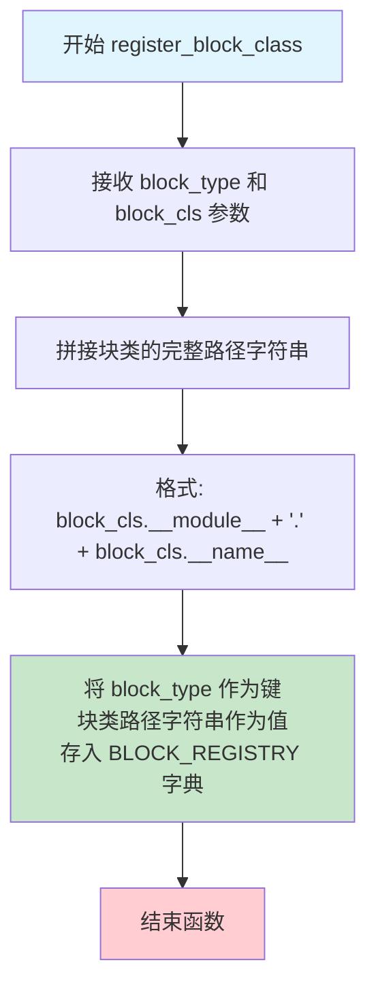
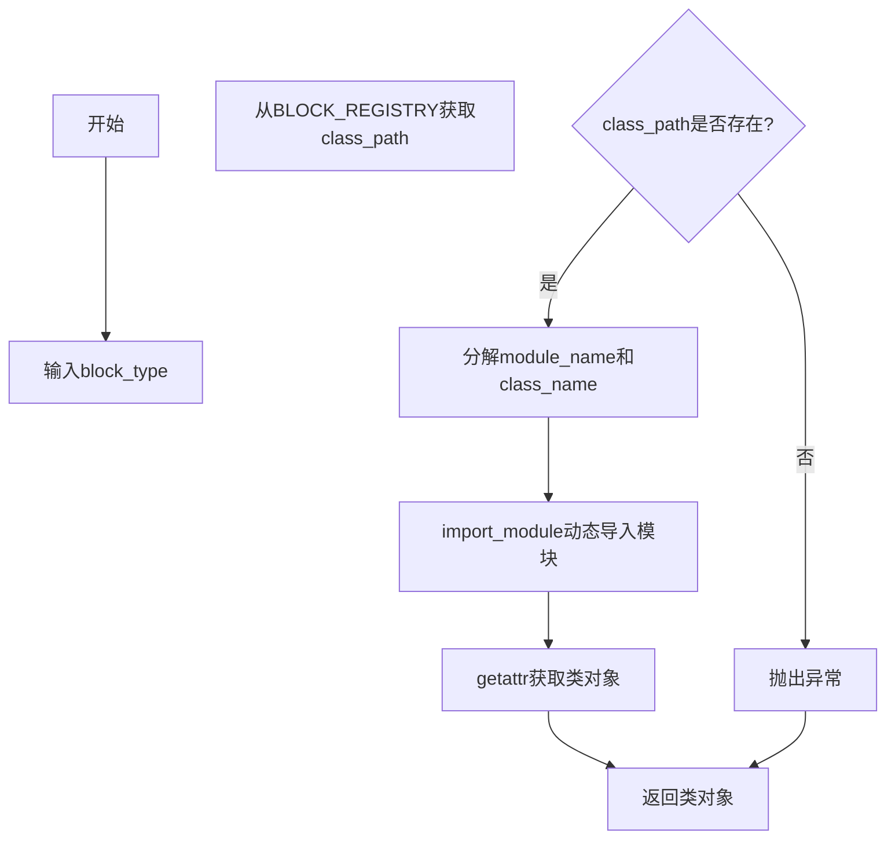

# `marker\marker\schema\registry.py` 详细设计文档

这是一个块类型注册系统，通过 BLOCK_REGISTRY 字典将 BlockTypes 枚举映射到具体的 Block 类路径，并提供注册和动态获取块类的函数，用于在 marker 文档解析框架中统一管理不同类型的文档元素（如文本、表格、图像等）。

## 整体流程

```mermaid
graph TD
    A[开始] --> B[初始化空的 BLOCK_REGISTRY]
    B --> C[调用 register_block_class 注册块类型]
    C --> D{注册所有块类型}
    D --> E[Line, Span, Char]
    D --> F[FigureGroup, TableGroup, ListGroup, PictureGroup]
    D --> G[Page, Caption, Code, Figure]
    D --> H[Footnote, Form, Equation, Handwriting]
    D --> I[InlineMath, ListItem, PageFooter, PageHeader]
    D --> J[Picture, SectionHeader, Table, Text]
    D --> K[TableOfContents, ComplexRegion, TableCell, Reference]
    D --> L[Document]
    E --> M[执行断言验证]
    F --> M
    G --> M
    H --> M
    I --> M
    J --> M
    K --> M
    L --> M
    M --> N{验证通过?}
    N -- 是 --> O[注册完成，可通过 get_block_class 获取类]
    N -- 否 --> P[抛出 AssertionError]
    O --> Q[调用 get_block_class(block_type)]
    Q --> R[从 REGISTRY 获取类路径字符串]
    R --> S[使用 import_module 动态导入模块]
    S --> T[使用 getattr 获取类并返回]
```

## 类结构

```
Block (基类/抽象)
├── Line
├── Span
├── Char
├── FigureGroup
├── TableGroup
├── ListGroup
├── PictureGroup
├── PageGroup
├── Caption
├── Code
├── Figure
├── Footnote
├── Form
├── Equation
├── Handwriting
├── InlineMath
├── ListItem
├── PageFooter
├── PageHeader
├── Picture
├── SectionHeader
├── Table
├── Text
├── TableOfContents
├── ComplexRegion
├── TableCell
├── Reference
└── Document
```

## 全局变量及字段


### `BLOCK_REGISTRY`
    
全局字典，存储 BlockTypes 到类路径字符串的映射

类型：`Dict[BlockTypes, str]`
    


### `Block.block_type`
    
块类型标识

类型：`BlockTypes`
    
    

## 全局函数及方法


### `register_block_class`

将指定的块类型（BlockTypes 枚举值）与其对应的块类（Block 的子类）映射关系注册到全局注册表 BLOCK_REGISTRY 中，以便后续通过块类型动态获取对应的类。

参数：

- `block_type`：`BlockTypes`，要注册的块类型枚举值，标识文档中块的类型（如 Text、Figure、Table 等）
- `block_cls`：`Type[Block]`，要注册的块类，必须是 Block 的子类，包含块的定义和属性

返回值：`None`，无返回值，执行注册操作后直接返回

#### 流程图



#### 带注释源码

```python
def register_block_class(block_type: BlockTypes, block_cls: Type[Block]):
    """
    注册块类型到全局注册表
    
    Args:
        block_type: BlockTypes 枚举值，表示块的类型
        block_cls: Block 的子类，表示该类型对应的块类
    
    Returns:
        None
    """
    # 使用块类的模块名和类名拼接完整的类路径字符串
    # 例如: "marker.schema.text.char.Char"
    class_path = f"{block_cls.__module__}.{block_cls.__name__}"
    
    # 将块类型与类路径的映射关系存入全局注册表
    BLOCK_REGISTRY[block_type] = class_path
```


### `get_block_class`

根据给定的块类型（BlockTypes 枚举），从注册表中获取对应的 Block 子类，并动态导入该类返回。

参数：

- `block_type`：`BlockTypes`，要获取的块类型枚举值

返回值：`Type[Block]`，返回与指定块类型对应的 Block 子类对象

#### 流程图

```mermaid
flowchart TD
    A[开始: 输入 block_type] --> B{检查 block_type 是否在 BLOCK_REGISTRY 中}
    B -->|是| C[获取 class_path: BLOCK_REGISTRY[block_type]]
    B -->|否| D[抛出 KeyError 异常]
    C --> E[分割 class_path: rsplit '.', 1]
    E --> F[module_name, class_name]
    F --> G[import_module(module_name)]
    G --> H[getattr(module, class_name)]
    H --> I[返回类对象]
```

#### 带注释源码

```python
def get_block_class(block_type: BlockTypes) -> Type[Block]:
    """
    根据块类型动态获取对应的类对象。
    
    该函数采用延迟加载机制：
    1. 从 BLOCK_REGISTRY 获取类路径字符串（格式：module.class_name）
    2. 使用 importlib.import_module 动态导入模块
    3. 使用 getattr 获取模块中的类对象
    
    注意：如果 block_type 不在注册表中，会抛出 KeyError。
    
    参数:
        block_type: BlockTypes 枚举值，表示要获取的块类型
        
    返回:
        Type[Block]: 对应的 Block 子类类型，可用于实例化对象
        
    示例:
        >>> cls = get_block_class(BlockTypes.Text)
        >>> text_block = cls(...)
    """
    # 从注册表中获取类路径字符串（格式："{module_path}.{ClassName}"）
    class_path = BLOCK_REGISTRY[block_type]
    
    # 分割获取模块名和类名（使用 rsplit 从右边分割，只分割一次）
    # 例如："marker.schema.text.Text" -> ("marker.schema.text", "Text")
    module_name, class_name = class_path.rsplit(".", 1)
    
    # 动态导入模块（延迟导入，避免循环依赖）
    module = import_module(module_name)
    
    # 从模块中获取对应的类对象并返回
    return getattr(module, class_name)
```

## 关键组件


### 核心功能概述

该代码实现了一个文档块（Block）类型的动态注册与检索系统，通过BLOCK_REGISTRY字典将BlockTypes枚举映射到具体的Block类路径，并提供register_block_class和get_block_class函数实现类的动态加载，支持文档结构中各种元素（如文本、表格、图像、公式等）的统一管理和实例化。

### 文件整体运行流程

1. 导入必要的模块（typing、importlib）以及marker.schema中的所有Block类型和相关类
2. 初始化全局变量BLOCK_REGISTRY空字典
3. 定义register_block_class函数用于注册Block类
4. 定义get_block_class函数用于动态获取Block类
5. 依次调用register_block_class注册所有Block类型及其对应的类
6. 执行断言验证所有BlockTypes都已注册且block_type字段默认值正确

### 全局变量和全局函数详细信息

#### BLOCK_REGISTRY

- **名称**: BLOCK_REGISTRY
- **类型**: Dict[BlockTypes, str]
- **描述**: 全局注册表字典，存储BlockTypes枚举到Block类路径字符串的映射关系

#### register_block_class

- **名称**: register_block_class
- **参数**: block_type (BlockTypes) - Block类型枚举，block_cls (Type[Block]) - Block类类型
- **参数类型**: BlockTypes, Type[Block]
- **参数描述**: block_type指定要注册的Block类型，block_cls指定该类型对应的Block类
- **返回值类型**: None
- **返回值描述**: 无返回值，仅执行注册逻辑
- **mermaid流程图**:
```mermaid
graph TD
    A[开始] --> B[输入block_type和block_cls]
    C[设置BLOCK_REGISTRY[block_type] = f"{block_cls.__module__}.{block_cls.__name__}"]
    C --> D[结束]
```
- **带注释源码**:
```python
def register_block_class(block_type: BlockTypes, block_cls: Type[Block]):
    """将Block类型及其类路径注册到全局注册表中"""
    BLOCK_REGISTRY[block_type] = f"{block_cls.__module__}.{block_cls.__name__}"
```

#### get_block_class

- **名称**: get_block_class
- **参数**: block_type (BlockTypes) - 要获取的Block类型
- **参数类型**: BlockTypes
- **参数描述**: 根据Block类型从注册表中获取对应的Block类
- **返回值类型**: Type[Block]
- **返回值描述**: 返回对应Block类型的类对象，可用于实例化
- **mermaid流程图**:

- **带注释源码**:
```python
def get_block_class(block_type: BlockTypes) -> Type[Block]:
    """根据Block类型动态获取对应的Block类"""
    class_path = BLOCK_REGISTRY[block_type]  # 获取类路径字符串
    module_name, class_name = class_path.rsplit(".", 1)  # 分离模块名和类名
    module = import_module(module_name)  # 动态导入模块
    return getattr(module, class_name)  # 获取类并返回
```

### 关键组件信息

#### BLOCK_REGISTRY（块类型注册表）

存储BlockTypes枚举到类路径字符串的映射，是整个注册系统的核心数据结构，支持按类型查找Block类。

#### register_block_class（块类注册器）

负责将Block类型及其对应类注册到全局注册表中，是维护BLOCK_REGISTRY的唯一写入入口。

#### get_block_class（块类检索器）

根据Block类型动态导入并返回对应的Block类，实现类的惰性加载机制，避免模块初始化时导入所有类。

#### 块类型注册集合

一次性注册了20+种Block类型，包括文档、页面、文本、表格、图像、公式、代码等各类文档元素，形成完整的文档结构支持体系。

### 潜在的技术债务或优化空间

1. **缺乏错误处理**: get_block_class中如果class_path不存在会抛出KeyError，应提供更友好的错误信息或默认值处理
2. **模块循环依赖风险**: 注册的Block类来自marker.schema.blocks，若这些类相互引用可能导致导入顺序问题
3. **注册验证可增强**: 断言仅检查block_type字段，可增加更多运行时验证如类的继承关系检查
4. **性能优化空间**: 首次调用get_block_class后会动态导入模块，可考虑增加缓存机制减少重复导入开销

### 其它项目

#### 设计目标与约束

- **目标**: 建立Block类型与类的映射关系，支持文档解析过程中根据类型动态获取对应处理类
- **约束**: 所有BlockTypes枚举值必须注册，注册时使用类的完整模块路径字符串

#### 错误处理与异常设计

- 当get_block_class传入未注册的block_type时，会抛出KeyError
- 当动态导入模块失败时会抛出ModuleNotFoundError或ImportError

#### 数据流与状态机

该模块为无状态模块，仅提供静态查询功能，不涉及状态机设计

#### 外部依赖与接口契约

- 依赖marker.schema模块提供的Block基类、BlockTypes枚举及各类Block实现
- 依赖Python标准库importlib的import_module实现动态导入
- 接口契约：调用register_block_class后可通过get_block_class获取对应类，且该类必须继承自Block基类


## 问题及建议


### 已知问题

-   **生产环境使用 assert**：使用 `assert` 语句验证块类型完整性，Python 在启用优化模式（`python -O`）时会跳过断言，导致生产环境缺少关键验证。
-   **缺少缓存机制**：`get_block_class` 方法每次调用都执行 `import_module` 和 `getattr`，虽然 Python 会缓存模块，但 `getattr` 每次都会查找属性，造成性能开销。
-   **硬编码注册**：所有块类型手动逐一注册，新增 BlockTypes 成员时需要同步修改此处，容易遗漏。
-   **缺乏线程安全**：全局 `BLOCK_REGISTRY` 字典在多线程环境下并发读写可能存在竞争条件。
-   **脆弱的错误处理**：`get_block_class` 依赖字符串路径动态导入，若路径不存在或类名错误，抛出的异常信息不够友好，难以定位问题。
-   **BLOCK_REGISTRY 可变公开状态**：全局字典可被外部代码直接修改，缺乏封装保护。
-   **验证逻辑冗余**：断言中遍历所有已注册的块类型进行验证，但 `register_block_class` 调用时未同步验证，延迟到模块加载完毕才报错。

### 优化建议

-   **使用正式验证替代 assert**：将断言替换为显式的 `if` 检查或自定义验证函数，在验证失败时抛出明确的 `ValueError` 或 `RuntimeError`。
-   **添加类缓存**：在 `get_block_class` 中引入字典缓存已解析的类引用，避免重复的属性查找操作。
-   **实现自动发现机制**：通过扫描 `marker.schema.blocks` 等模块，自动发现并注册 Block 子类，减少手动维护成本。
-   **添加线程锁**：使用 `threading.Lock` 保护 `BLOCK_REGISTRY` 的读写操作，确保并发安全。
-   **增强错误信息**：在 `get_block_class` 中捕获 `ModuleNotFoundError` 和 `AttributeError`，重新抛出包含 block_type 信息的自定义异常。
-   **提供只读接口**：导出 `get_registered_blocks()` 等只读方法，或使用 `types.MappingProxyType` 包装字典。
-   **前置验证**：在 `register_block_class` 中立即验证 `block_type` 与类定义是否匹配，而非延迟到模块加载完毕。
-   **添加日志记录**：在注册和获取类时添加日志，便于运行时监控和问题排查。


## 其它


### 设计目标与约束

本模块的设计目标是建立一个灵活的块类型注册表系统，支持通过BlockTypes枚举动态获取对应的Block类实现。约束包括：必须保证BLOCK_REGISTRY中的条目数量与BlockTypes枚举成员数量一致，且每个注册类必须包含正确的block_type字段默认值。

### 错误处理与异常设计

代码中的assert语句用于验证注册表的完整性，若注册类与BlockTypes不匹配会抛出AssertionError。get_block_class函数在类路径不存在或模块导入失败时会抛出ImportError或AttributeError。调用方应处理这些异常情况。

### 数据流与状态机

本模块不涉及复杂的状态机，主要数据流为：BlockTypes枚举值 → BLOCK_REGISTRY字典查询 → 类路径字符串解析 → 动态导入模块 → 获取类对象。注册过程在模块导入时执行，运行时可通过get_block_class查询。

### 外部依赖与接口契约

依赖包括：typing模块的Dict和Type类型提示，importlib的import_module函数，marker.schema模块中的各种Block类及BlockTypes枚举。接口契约为：register_block_class接受BlockTypes枚举和Block子类，get_block_class返回Type[Block]类型。

### 性能考虑

BLOCK_REGISTRY在模块加载时一次性构建，后续查询为O(1)字典查找。get_block_class每次调用都会执行import_module，可能导致重复导入开销，可考虑缓存已加载的类对象以优化性能。

### 安全性考虑

get_block_class使用import_module动态导入模块，存在潜在的任意代码执行风险。类路径来自BLOCK_REGISTRY受控字典，理论上安全，但需确保类路径不被外部输入污染。

### 测试策略

应测试register_block_class的正确注册、get_block_class的类加载、断言验证（注册数量和block_type匹配）、异常情况处理（无效类路径、缺失模块等）。

### 版本兼容性

代码依赖marker.schema模块的内部结构，若Block类结构变更或BlockTypes枚举调整，可能导致本模块需要相应修改。需与marker库版本保持兼容。

    