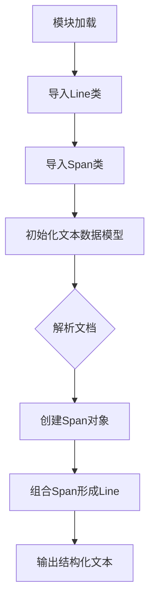

# `marker\marker\schema\text\__init__.py` 详细设计文档

该代码片段是一个模块导入语句集合，导入了marker.schema.text模块中的Line和Span类。这些类很可能用于文档解析、OCR后处理或文本结构化表示，其中Span可能代表文本的最小语义单元（如单词或字符片段），Line则代表由多个Span组成的文本行。这是marker项目文本处理层的核心数据模型基础。

## 整体流程



## 类结构

```
MarkerSchema (根命名空间)
├── text (文本模式包)
│   ├── Line (文本行类)
│   └── Span (文本跨度/片段类)
└── ... (其他可能的子模块)
```

## 全局变量及字段


    

## 全局函数及方法


## 关键组件


### Line

表示文本中的一行数据，包含该行的文本内容及其元数据信息。

### Span

表示文本中的一个片段或跨度，通常用于表示词、短语或特定文本区域及其属性。


## 问题及建议


### 已知问题

-   代码文件仅包含导入语句，未包含任何实际业务逻辑或功能实现
-   无法从当前代码片段中提取类字段、类方法、返回值等详细信息
-   导入语句依赖于外部库 `marker`，缺乏对依赖项的版本控制和兼容性说明
-   未发现错误处理机制、异常设计或数据流相关的实现
-   缺少文档注释或类型注解来说明导入这些类的用途

### 优化建议

-   补充代码的实际实现逻辑，确保文件具有实际功能
-   添加模块级文档字符串，说明该文件在项目中的作用
-   如需使用 Line 和 Span 类，建议在文件中添加示例用法或注释说明其使用场景
-   考虑添加类型注解和详细的导入说明，提高代码可维护性


## 其它


### 设计目标与约束

由于代码仅包含导入语句，无法从具体实现中提取设计目标。基于marker.schema.text模块的用途推测，该组件的设计目标可能包括：提供高效的文本行（Line）和文本跨度（Span）数据结构；支持文本的细粒度表示和操作；确保内存使用优化。约束可能包括：保持与marker.schema.text模块的兼容性；遵循该模块的数据结构和接口约定。

### 错误处理与异常设计

由于代码仅包含导入语句，未体现具体的错误处理逻辑。通常此类文本处理模块可能涉及的异常包括：无效的文本坐标异常、字符编码异常、范围越界异常等。具体异常类型需要根据Line和Span类的实际实现确定，建议查阅marker.schema.text模块的异常定义文档。

### 数据流与状态机

由于代码仅包含导入语句，无法分析具体的数据流和状态机。基于Line和Span的用途推测，数据流可能为：输入原始文本 -> 解析为行（Line）-> 进一步分割为跨度（Span）-> 输出结构化文本表示。状态机可能涉及文本的解析状态、验证状态等，具体实现需参考Line和Span类的内部逻辑。

### 外部依赖与接口契约

该代码显式依赖marker.schema.text.line.Line类和marker.schema.text.span.Span类。接口契约应遵循marker.schema.text模块定义的Line和Span类的公共接口，包括但不限于：构造函数参数、数据字段、操作方法等。具体接口规范需查阅marker.schema.text模块的API文档。

### 性能考虑

由于代码仅包含导入语句，无法进行性能分析。一般的性能考虑包括：文本对象的创建开销、内存占用、遍历效率等。建议通过性能测试和profiling工具评估Line和Span类在实际使用场景中的性能表现。

### 安全性考虑

由于代码仅包含导入语句，无法进行安全性分析。一般的安全性考虑包括：输入验证、防止注入攻击、敏感信息处理等。Line和Span类处理文本时需确保对输入进行适当的验证和清理。

### 测试策略

由于代码仅包含导入语句，无法制定具体的测试策略。一般的测试策略应包括：单元测试（针对Line和Span类的功能测试）、集成测试（测试与marker.schema.text模块的集成）、边界条件测试（空输入、大规模文本等）。建议参考marker.schema.text模块的测试实践。

### 部署和配置

该代码为导入语句，无需独立部署。作为marker.schema项目的一部分，其部署依赖于整个项目的部署策略。配置需求需根据marker.schema.text模块的整体架构确定，可能包括：环境变量、配置文件、依赖版本管理等。

### 版本兼容性

需确保Line和Span类的版本与marker.schema.text模块的其他部分兼容。建议明确标注所依赖的marker.schema版本，并遵循语义化版本控制原则进行版本管理。


    