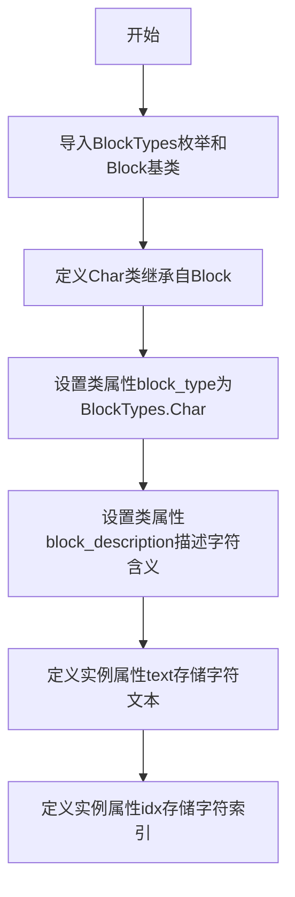

# `marker\marker\schema\text\char.py` 详细设计文档

这是一个表示单个字符的Char类，继承自Block基类，用于在文本span内表示单个字符。该类定义了字符的文本内容和索引位置，是marker文档解析框架中的基础数据结构之一。

## 整体流程



## 类结构

```
Block (抽象基类/父类)
└── Char (字符块类)
```

## 全局变量及字段


### `Char.block_type`
    
类属性，标识块的类型为Char

类型：`BlockTypes`
    


### `Char.block_description`
    
类属性，描述Char块的用途

类型：`str`
    


### `Char.text`
    
实例属性，存储字符的文本内容

类型：`str`
    


### `Char.idx`
    
实例属性，存储字符在span中的索引位置

类型：`int`
    
    

## 全局函数及方法


## 关键组件


### 核心功能概述

该代码定义了Marker文档解析库中的一个基础字符块类`Char`，用于表示文档中的一个单独字符，包含字符文本内容和索引位置信息，继承自`Block`基类并使用特定的块类型标记。

### 文件整体运行流程

该文件为模块级定义文件，不涉及运行时流程。类定义被导入后，可用于实例化字符块对象，典型使用场景为文档解析过程中表示文本序列中的单个字符元素。

### 类详细信息

**Char类**

- 继承自：`Block`
- 类属性：`block_type`（BlockTypes类型，值为BlockTypes.Char）、`block_description`（str类型，值为"A single character inside a span."）
- 实例属性：`text`（str类型，表示字符文本内容）、`idx`（int类型，表示字符在文本中的索引位置）

### 字段详细信息

| 字段名称 | 类型 | 描述 |
|---------|------|------|
| text | str | 字符的文本内容 |
| idx | int | 字符在所属文本或span中的索引位置 |
| block_type | BlockTypes | 块类型枚举值，标识为字符块 |
| block_description | str | 块的描述信息 |

### 方法详细信息

该类未定义任何实例方法或类方法。

### 全局变量和全局函数

无全局变量和全局函数定义。

### 关键组件信息

### BlockTypes枚举

来自marker.schema模块的枚举类型，用于标识文档中不同类型的块（Block），此处Char类使用其Char成员作为块类型标识。

### Char类

文档解析的基础单元类，表示文本中的单个字符，作为更高级别块（如Span、Line等）的组成元素。

### Block基类

marker.schema.blocks模块中的基类，Char类继承自它以获得块的标准属性和行为。

### 潜在技术债务或优化空间

1. **缺乏验证机制**：`text`和`idx`字段缺少类型验证或约束，建议添加属性setter验证
2. **功能单一**：当前类仅作为数据容器，缺少字符相关的操作方法（如获取相邻字符、字符类型判断等）
3. **文档不完整**：缺少类的文档字符串（docstring），建议添加类级别和方法级别的文档说明

### 其它项目

**设计目标与约束**：该类作为Marker架构中的最小粒度文本单元，遵循块（Block）模式的统一接口规范。

**错误处理与异常设计**：当前未定义显式错误处理机制，依赖Python基础的类型错误抛出。

**数据流与状态机**：Char对象通常作为只读数据载体，在文档解析流程中从上游向下游传递。

**外部依赖与接口契约**：依赖marker.schema.BlockTypes枚举和marker.schema.blocks.Block基类，需要保证版本兼容性。


## 问题及建议


### 已知问题

- 字段缺少类型注解的默认值，在 Python 3.9 以下版本或某些静态分析工具中可能产生兼容性问题
- `text` 和 `idx` 字段缺少文档注释，不清楚 `text` 的具体用途（如字符内容还是整个文本引用）和 `idx` 的语义（如字符在词中的索引还是全局索引）
- 缺少 `__init__` 方法的显式定义，依赖基类 `Block` 的实现，如果基类未定义或实现不一致会导致行为不确定
- 缺少字段验证逻辑，`idx` 应为非负整数，当前无任何校验
- 缺少 `__repr__` 或 `__str__` 方法，不利于调试和日志输出
- 类中未定义任何业务逻辑方法，功能完全依赖继承，扩展性受限

### 优化建议

- 为 `text` 和 `idx` 字段添加默认值或使用 `typing.Optional` 明确可选性，或添加 `Field` 声明（如 `text: str = ""`）
- 添加类级别和实例字段的文档字符串，说明 `text` 表示字符内容、`idx` 表示字符在 span 中的索引位置
- 在 `__init__` 中添加 `idx >= 0` 的验证逻辑，参考：`if idx < 0: raise ValueError("idx must be non-negative")`
- 实现 `__repr__` 方法，例如：`return f"Char(text={self.text!r}, idx={self.idx})"`
- 考虑添加 `__eq__` 和 `__hash__` 方法支持对象比较和集合操作
- 如业务需要，可添加辅助方法如 `to_dict()` 或 `from_dict()` 增强序列化能力

## 其它


### 设计目标与约束

本类旨在为文档渲染提供字符级别的块抽象，支持在Span中表示单个字符及其位置信息。设计约束包括：仅支持基本的文本和索引属性，不包含复杂的样式或格式信息；必须继承自Block基类以保持与marker框架的一致性；块类型固定为BlockTypes.Char，不可动态修改。

### 错误处理与异常设计

本类主要依赖继承链中的错误处理机制。当前设计不包含显式的错误验证，但预期在实例化时若text参数非字符串类型或idx参数非整数类型时，Python类型检查会在运行时抛出TypeError。建议在基类Block中统一实现参数验证逻辑，或者在Char类的__init__方法中添加类型检查和自定义异常抛出。

### 数据流与状态机

Char作为最小粒度的文本块，属于文档解析树中的叶子节点。其状态流转相对简单：初始化时接收text和idx参数，渲染时将文本内容输出到目标文档。在整个marker流程中，Char块通常被包含在Span块内，Span块进一步被包含在Line或Paragraph等更大粒度的块中。Char块本身不管理状态机，其生命周期完全由父容器Span控制。

### 外部依赖与接口契约

本类依赖以下外部组件：Block基类（来自marker.schema.blocks），提供块的基本结构和行为；BlockTypes枚举（来自marker.schema），定义块的类型标识。接口契约方面：实例化时必须提供text（str类型）和idx（int类型）两个参数；继承自Block的所有公共接口（如render、to_dict等）可供调用；block_type和block_description为类级别不可变的配置属性。

### 使用示例

```python
from marker.schema import BlockTypes
from marker.schema.blocks import Char

# 创建Char实例
char = Char(text="A", idx=0)

# 访问属性
print(char.text)  # 输出: A
print(char.idx)   # 输出: 0
print(char.block_type)  # 输出: BlockTypes.Char
```

### 性能考虑

Char类设计极为轻量，实例化开销极低。在大规模文档处理场景中，建议避免创建大量的Char独立实例，而应通过内存池或对象复用机制优化性能。当前实现无缓存机制，对于同一文档中重复出现的相同字符，考虑实现interning机制以减少内存占用。

### 安全性考虑

本类不涉及用户输入处理或外部资源访问，安全性风险较低。但需注意在反序列化场景（如从JSON恢复Char对象）时，应对text字段进行适当的输入验证，防止超长字符串导致内存问题。建议在基类Block中统一实现反序列化安全检查。

    