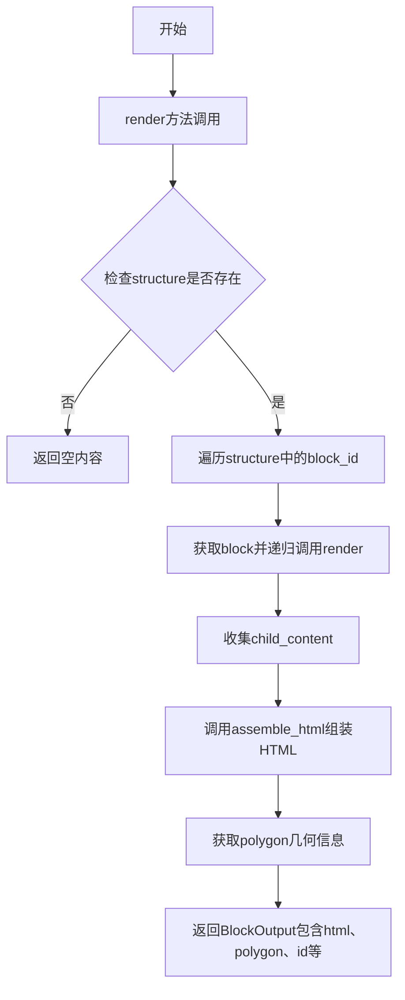
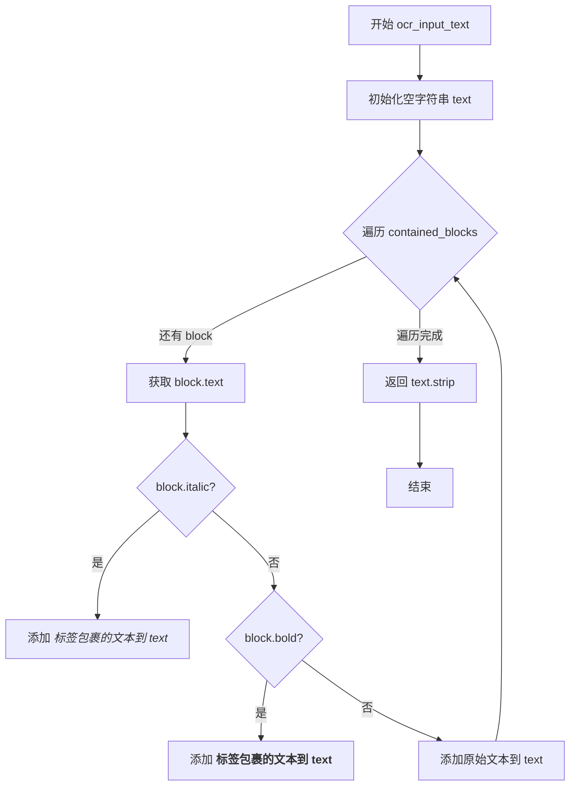
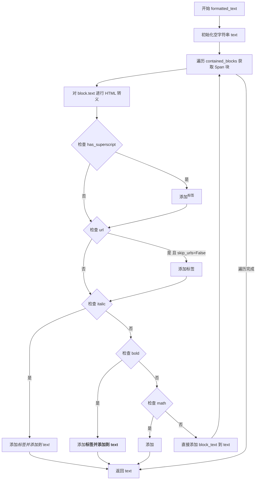
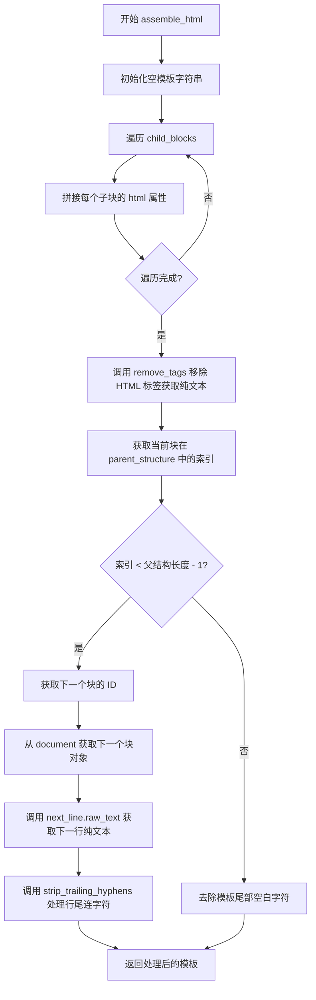
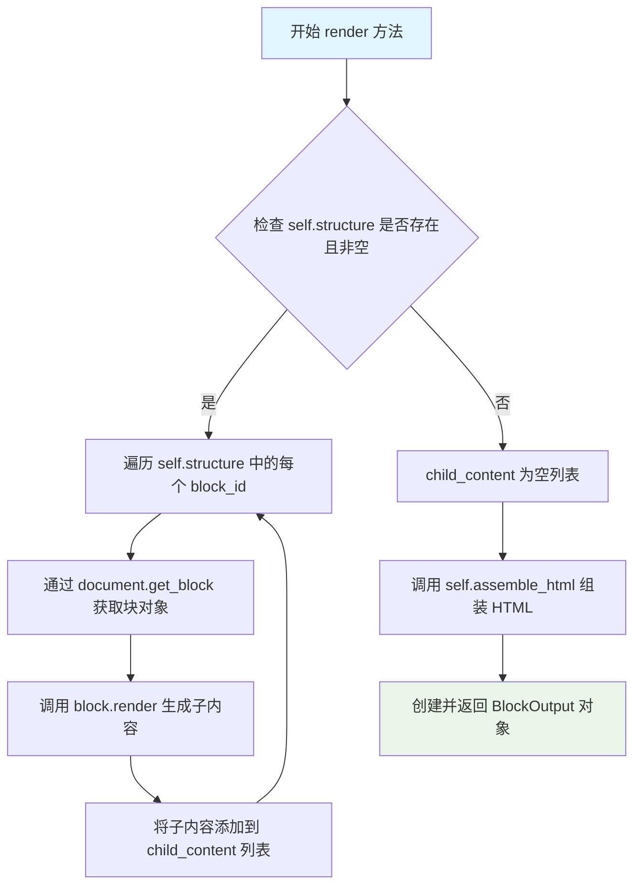
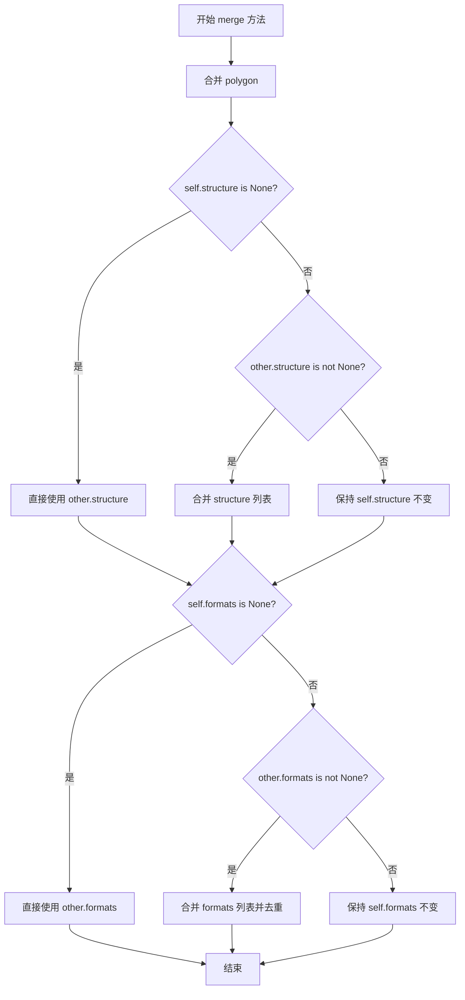

# `marker\marker\schema\text\line.py` 详细设计文档

该代码定义了一个用于处理文档中文本行的Line类，继承自Block基类，负责提取、格式化和渲染文本内容，包括处理粗体、斜体、上标、数学公式、URL链接等格式，并支持多行文本的合并操作。

## 整体流程



## 类结构

```
Block (抽象基类)
└── Line (文本行类)
```

## 全局变量及字段


### `HYPHENS`
    
A string containing hyphen characters (regular hyphen, em dash, and logical NOT symbol) used for regex pattern matching in text processing.

类型：`str`
    


### `Line.block_type`
    
The type of block, set to BlockTypes.Line indicating this is a line of text in a document.

类型：`BlockTypes`
    


### `Line.block_description`
    
A string description indicating that this block represents a line of text.

类型：`str`
    


### `Line.formats`
    
Optional list of formatting types for the line, currently supports 'math' format, can be None.

类型：`List[Literal["math"]] | None`
    
    

## 全局函数及方法


### `remove_tags`

该函数是一个简单的HTML标签移除工具，通过正则表达式匹配并删除字符串中的所有HTML标签，仅保留纯文本内容。

参数：

- `text`：`str`，需要移除HTML标签的输入文本

返回值：`str`，移除所有HTML标签后的纯文本内容

#### 流程图

```mermaid
flowchart TD
    A[开始] --> B[接收输入文本 text]
    B --> C[使用正则表达式 r"<[^>]+>" 匹配HTML标签]
    C --> D[将匹配到的标签替换为空字符串]
    E[返回纯文本]
    D --> E
    E --> F[结束]
```

#### 带注释源码

```python
def remove_tags(text):
    """
    移除字符串中的所有HTML/XML标签
    
    参数:
        text: str - 需要处理的包含HTML标签的文本
        
    返回:
        str - 移除所有标签后的纯文本
    """
    # 使用正则表达式 <[^>]+> 匹配HTML标签:
    # <  - 匹配左尖括号
    # [^>]+ - 匹配一个或多个非右尖括号的字符
    # >  - 匹配右尖括号
    # 将匹配到的内容替换为空字符串，即删除标签
    return re.sub(r"<[^>]+>", "", text)
```


### `replace_last`

该函数用于在字符串中查找指定模式的最后一次出现，并用新字符串替换该最后一次匹配的内容。如果未找到匹配，则返回原始字符串不变。

参数：

- `string`：`str`，输入的待处理字符串
- `old`：`str`，需要查找并替换的子字符串（支持正则表达式）
- `new`：`str`，用于替换匹配项的新字符串

返回值：`str`，替换最后一个匹配项后的新字符串

#### 流程图

```mermaid
flowchart TD
    A[开始] --> B[在string中查找所有old的匹配项]
    B --> C{是否存在匹配项?}
    C -->|否| D[返回原始string]
    C -->|是| E[获取最后一个匹配项last_match]
    E --> F[返回 string[:last_match.start] + new + string[last_match.end:]]
    D --> G[结束]
    F --> G
```

#### 带注释源码

```python
def replace_last(string, old, new):
    """
    替换字符串中最后一次出现的匹配项
    
    参数:
        string: str, 输入的待处理字符串
        old: str, 需要查找并替换的子字符串（支持正则表达式）
        new: str, 用于替换匹配项的新字符串
    
    返回:
        str, 替换最后一个匹配项后的新字符串
    """
    # 使用正则表达式查找所有匹配项
    matches = list(re.finditer(old, string))
    
    # 如果没有匹配项，直接返回原始字符串
    if not matches:
        return string
    
    # 获取最后一个匹配项
    last_match = matches[-1]
    
    # 拼接字符串：将匹配项之前的内容 + 新字符串 + 匹配项之后的内容
    return string[: last_match.start()] + new + string[last_match.end() :]
```


### `strip_trailing_hyphens`

该函数用于处理文档中跨行连字符断行问题，当检测到当前行以连字符结尾且下一行以小写字母开头时，自动移除当前行HTML中的尾部连字符，以实现连写词的正确拼接。

参数：

- `line_text`：`str`，当前行的纯文本内容，用于判断是否以连字符结尾
- `next_line_text`：`str`，下一行的纯文本内容，用于判断下一行是否以小写字母开头
- `line_html`：`str`，当前行的HTML内容，当满足拼接条件时将移除其中的尾部连字符

返回值：`str`，处理后的HTML内容，若不满足拼接条件则返回原HTML

#### 流程图

```mermaid
flowchart TD
    A[开始 strip_trailing_hyphens] --> B[定义小写字母正则: \p{Ll}]
    C[编译连字符正则: .*[-—¬]\s?$] --> D{正则匹配 line_text}
    E[匹配下一行开头小写字母: ^\s?[\p{Ll}] --> F{匹配成功?}
    D -->|是| G{line以连字符结尾?}
    D -->|否| L[返回原始 line_html]
    F -->|是| G
    F -->|否| L
    G -->|两者都满足| H[调用 replace_last 移除 line_html 末尾连字符]
    G -->|任一条件不满足| L
    H --> I[返回处理后的 line_html]
    
    style A fill:#f9f,color:#000
    style I fill:#9f9,color:#000
    style L fill:#f99,color:#000
```

#### 带注释源码

```python
def strip_trailing_hyphens(line_text, next_line_text, line_html) -> str:
    """
    处理跨行连字符断行问题，移除当前行HTML中不必要的尾部连字符
    
    当检测到当前行以连字符结尾且下一行以小写字母开头时，
    说明这是连写词被错误拆分成两行的情况，需要移除连字符进行拼接
    
    Args:
        line_text: 当前行的纯文本内容
        next_line_text: 下一行的纯文本内容  
        line_html: 当前行的HTML内容
    
    Returns:
        处理后的HTML内容，若不满足拼接条件则返回原值
    """
    # 定义Unicode小写字母属性，用于匹配行首的小写字母
    lowercase_letters = r"\p{Ll}"

    # 编译连字符匹配正则：匹配以连字符结尾的行，末尾可选空白字符
    # HYPHENS = r"-—¬" 包含普通连字符、破折号、软连字符
    hyphen_regex = regex.compile(rf".*[{HYPHENS}]\s?$", regex.DOTALL)
    
    # 检查下一行是否以小写字母开头（前面可能有空白）
    next_line_starts_lowercase = regex.match(
        rf"^\s?[{lowercase_letters}]", next_line_text
    )

    # 仅当两个条件都满足时才执行连字符移除操作
    if hyphen_regex.match(line_text) and next_line_starts_lowercase:
        # 使用replace_last只替换最后一个匹配的连字符，避免误伤行内其他连字符
        line_html = replace_last(line_html, rf"[{HYPHENS}]", "")

    return line_html
```


### `Line.ocr_input_text`

该方法用于从 Line 块中提取 OCR 输入文本，遍历包含的 Span 块并根据块的格式（斜体、粗体）添加相应的 HTML 标签，最后返回处理后的文本。

参数：

- `document`：未明确标注类型（推断为 Document 对象），包含文档结构数据的对象，用于获取当前块包含的子块

返回值：`str`，返回处理并去除首尾空白后的文本字符串

#### 流程图



#### 带注释源码

```python
def ocr_input_text(self, document):
    """
    从 Line 块中提取 OCR 输入文本
    
    参数:
        document: 文档对象，包含文档结构数据
        
    返回:
        str: 处理后的文本字符串
    """
    text = ""
    # 遍历当前块包含的所有 Span 类型子块
    for block in self.contained_blocks(document, (BlockTypes.Span,)):
        # 我们不包含上标/下标和数学公式，因为它们在这个阶段可能不可靠
        block_text = block.text
        if block.italic:
            # 如果是斜体，用 <i> 标签包裹
            text += f"<i>{block_text}</i>"
        elif block.bold:
            # 如果是粗体，用 <b> 标签包裹
            text += f"<b>{block_text}</b>"
        else:
            # 普通文本直接添加
            text += block_text

    return text.strip()
```


### `Line.formatted_text`

该方法负责将 `Line` 块中的所有子 `Span` 块渲染为 HTML 格式的文本，根据每个 Span 的属性（粗体、斜体、上标、数学公式、URL 等）添加相应的 HTML 标签。

参数：

-  `document`：`Document`，包含完整文档数据的文档对象，用于获取子块信息
-  `skip_urls`：`bool`，可选参数，默认为 `False`，是否跳过 URL 链接的渲染

返回值：`str`，返回渲染后的 HTML 格式文本字符串

#### 流程图



#### 带注释源码

```python
def formatted_text(self, document, skip_urls=False):
    """
    将 Line 块中的所有 Span 子块渲染为 HTML 格式文本
    
    参数:
        document: 文档对象，用于获取子块
        skip_urls: 是否跳过 URL 链接的渲染，默认为 False
    
    返回:
        HTML 格式的文本字符串
    """
    text = ""  # 初始化结果字符串
    # 遍历文档中所有 Span 类型的子块
    for block in self.contained_blocks(document, (BlockTypes.Span,)):
        # 对文本进行 HTML 转义，防止 XSS 攻击
        block_text = html.escape(block.text)

        # 处理上标标记：将数字和非单词字符放在<sup>标签中
        if block.has_superscript:
            block_text = re.sub(r"^([0-9\W]+)(.*)", r"<sup>\1</sup>\2", block_text)
            # 确保至少有一个<sup>标签
            if "<sup>" not in block_text:
                block_text = f"<sup>{block_text}</sup>"

        # 处理 URL 链接：添加<a>标签包裹文本
        if block.url and not skip_urls:
            block_text = f"<a href='{block.url}'>{block_text}</a>"

        # 根据块属性添加相应的 HTML 标签
        if block.italic:
            text += f"<i>{block_text}</i>"
        elif block.bold:
            text += f"<b>{block_text}</b>"
        elif block.math:
            text += f"<math display='inline'>{block_text}</math>"
        else:
            text += block_text

    return text
```


### `Line.assemble_html`

该方法负责将当前行（Line）的所有子块（如 Span 块）的 HTML 内容组装成完整的 HTML 字符串，并处理行尾连字符的特殊情况（如处理跨行连字符合并逻辑）。

参数：

- `document`：`Document`，文档对象，用于通过 ID 获取块对象
- `child_blocks`：`List[BlockOutput]`，已渲染的子块输出列表，每个元素包含 HTML 等信息
- `parent_structure`：`List[str]`，父结构的块 ID 列表，用于确定当前行在上下文中的位置
- `block_config`：`Any`，块配置对象，可能包含渲染相关的配置选项

返回值：`str`，组装并处理后的 HTML 字符串

#### 流程图



#### 带注释源码

```python
def assemble_html(self, document, child_blocks, parent_structure, block_config):
    """
    组装当前行的 HTML 内容。
    
    该方法执行以下操作：
    1. 拼接所有子块的 HTML
    2. 如果存在下一个块，检查是否需要移除行尾连字符（处理跨行连字符合并的情况）
    3. 否则，只去除尾部空白
    """
    template = ""
    # 遍历所有子块（如 Span 块），拼接其 HTML 内容
    for c in child_blocks:
        template += c.html

    # 移除 HTML 标签获取纯文本，用于后续连字符判断
    raw_text = remove_tags(template).strip()
    
    # 获取当前块在父结构列表中的索引位置
    structure_idx = parent_structure.index(self.id)
    
    # 判断是否存在下一个块（即不是父结构中的最后一个块）
    if structure_idx < len(parent_structure) - 1:
        # 获取下一个块的 ID
        next_block_id = parent_structure[structure_idx + 1]
        # 从文档中获取下一个块对象
        next_line = document.get_block(next_block_id)
        # 获取下一行的纯文本内容
        next_line_raw_text = next_line.raw_text(document)
        # 处理行尾连字符：如果当前行以连字符结尾且下一行以小写字母开头，
        # 则移除当前行 HTML 末尾的连字符
        template = strip_trailing_hyphens(raw_text, next_line_raw_text, template)
    else:
        # 如果是父结构中的最后一个块，则去除模板末尾的空白字符
        template = template.strip(" ")
    
    return template
```


### `Line.render`

该方法负责渲染文档中的一行文本（Line），通过遍历当前行的结构（structure）获取所有子块，调用它们的 render 方法生成子内容，然后调用 `assemble_html` 方法将子内容组装成最终的 HTML 输出，并返回一个包含 HTML、多边形、ID、章节层级等信息的 `BlockOutput` 对象。

参数：

- `self`：`Line`，隐含的当前 Line 实例
- `document`：`Any`，文档对象，用于通过 ID 获取块
- `parent_structure`：`List[Any]`，父结构的 ID 列表，用于确定当前块在文档结构中的位置
- `section_hierarchy`：`Optional[Dict]`，可选的章节层级信息，用于跟踪文档的章节结构
- `block_config`：`Optional[Any]`，可选的块配置信息，包含渲染相关的配置选项

返回值：`BlockOutput`，返回一个 BlockOutput 对象，包含渲染后的 HTML、多边形信息、块 ID、空的子块列表以及章节层级信息

#### 流程图



#### 带注释源码

```python
def render(
    self, document, parent_structure, section_hierarchy=None, block_config=None
):
    # 初始化一个空列表，用于存储所有子块的渲染结果
    child_content = []
    
    # 检查当前行是否有结构信息（即是否包含子块）
    if self.structure is not None and len(self.structure) > 0:
        # 遍历当前行的结构中的每个块 ID
        for block_id in self.structure:
            # 通过 document 对象获取对应的块对象
            block = document.get_block(block_id)
            
            # 调用子块的 render 方法获取渲染结果，并添加到 child_content 列表
            child_content.append(
                block.render(
                    document, parent_structure, section_hierarchy, block_config
                )
            )

    # 返回一个 BlockOutput 对象，包含：
    # - html: 由 assemble_html 方法组装的 HTML 字符串
    # polygon: 当前行的多边形信息（边界框）
    # id: 当前行的唯一标识符
    # children: 空列表（Line 块不直接包含子块，子块已展开为 HTML）
    # section_hierarchy: 章节层级信息
    return BlockOutput(
        html=self.assemble_html(
            document, child_content, parent_structure, block_config
        ),
        polygon=self.polygon,
        id=self.id,
        children=[],
        section_hierarchy=section_hierarchy,
    )
```


### `Line.merge`

该方法用于将另一个 Line 对象的内容（多边形、结构、格式）合并到当前 Line 对象中，实现行级别的内容整合。

参数：

- `other`：`Line`，要合并的另一个 Line 对象

返回值：`None`，该方法直接修改当前对象的属性，不返回任何值

#### 流程图



#### 带注释源码

```python
def merge(self, other: "Line"):
    # 合并多边形：将当前行与另一行的多边形合并
    self.polygon = self.polygon.merge([other.polygon])

    # 处理结构（structure）合并，处理 None 值情况
    if self.structure is None:
        # 如果当前行没有结构，直接使用另一行的结构
        self.structure = other.structure
    elif other.structure is not None:
        # 如果两行都有结构，则拼接结构列表
        self.structure = self.structure + other.structure

    # 处理格式（formats）合并，处理 None 值情况
    if self.formats is None:
        # 如果当前行没有格式，直接使用另一行的格式
        self.formats = other.formats
    elif other.formats is not None:
        # 如果两行都有格式，则合并格式列表并去重
        self.formats = list(set(self.formats + other.formats))
```

## 关键组件


### Line 类

文档中的一行文本块，负责文本的OCR输入准备、格式化HTML渲染、渲染输出和合并操作。

### remove_tags 函数

使用正则表达式移除HTML标签，提取纯文本内容。

### replace_last 函数

在字符串中查找并替换最后一个匹配项，用于处理行尾的特殊字符。

### strip_trailing_hyphens 函数

检测当前行末尾是否有连字符，以及下一行是否以小写字母开头，如果是则移除行尾的连字符。

### HYPHENS 常量

定义用于检测的连字符集合，包含普通连字符、破折号和软连字符。

### ocr_input_text 方法

为OCR准备输入文本，遍历子块（Span）并添加斜体或粗体标签，生成供OCR使用的带格式文本。

### formatted_text 方法

生成带有HTML格式的文本，支持上标、URL链接、斜体、粗体和数学公式的HTML标签包装。

### assemble_html 方法

组装子块的HTML内容，处理行尾连字符的移除，并返回最终的HTML模板字符串。

### render 方法

递归渲染当前块及其子块，返回包含HTML、多边形、层级结构等信息的BlockOutput对象。

### merge 方法

合并两个Line对象，包括多边形区域、结构和格式化信息的合并。


## 问题及建议


### 已知问题

-   **正则表达式重复编译**：在 `strip_trailing_hyphens` 函数中，`regex.compile` 每次调用都会重新编译正则表达式，建议将其提升为模块级常量或使用缓存机制以提高性能。
-   **字符串拼接效率低**：在 `ocr_input_text`、`formatted_text` 等方法中使用 `+=` 进行字符串拼接，在处理大量块时会导致 O(n²) 的时间复杂度，建议改用列表 join 方式。
-   **类型注解不一致**：`merge` 方法的参数使用了字符串形式的类型注解 `"Line"`，与其它方法使用的实际类型不一致，可能影响类型检查工具的准确性。
-   **魔法字符串和硬编码**：`HYPHENS` 常量和 `<sup>`、`<math>` 等 HTML 标签在多处硬编码，缺乏统一的常量管理，可能导致维护困难。
-   **缺少空值检查**：在 `assemble_html` 方法中调用 `parent_structure.index(self.id)` 前未检查 `parent_structure` 是否为 `None`，可能引发 `ValueError`。
-   **正则表达式注入风险**：`replace_last` 函数中 `old` 参数直接传入 `regex.compile` 的模式，若用户输入可能包含特殊字符，存在正则表达式注入风险。
-   **文档字符串缺失**：类和方法缺少完整的文档字符串（docstring），不利于后续维护和 API 理解。

### 优化建议

-   将 `regex.compile(rf".*[{HYPHENS}]\s?$", regex.DOTALL)` 和 `regex.match(rf"^\s?[{lowercase_letters}]", next_line_text)` 中的正则表达式预编译为模块级常量。
-   将字符串拼接改为列表推导式 + `"".join()` 模式，例如在 `ocr_input_text` 中使用 `parts = []` 收集后 `return "".join(parts).strip()`。
-   统一类型注解风格，使用 `from __future__ import annotations` 或统一使用字符串形式。
-   将 HTML 标签（如 `<i>`、`<b>`、`<sup>`、`<math>`、`<a>`）提取为模块级常量类进行管理。
-   在 `assemble_html` 方法入口处添加 `if parent_structure is None: return template` 的防御性检查。
-   在 `replace_last` 函数中使用 `re.escape(old)` 对特殊字符进行转义，或添加参数验证。
-   为所有公共方法添加 Google 风格或 NumPy 风格的文档字符串，说明参数、返回值和异常。

## 其它


### 设计目标与约束

该模块旨在提供文档中文本行（Line）的处理能力，包括HTML渲染、文本格式化、结构合并等功能。设计约束包括：依赖marker.schema模块中的Block和BlockOutput类；使用regex库处理Unicode字符；支持数学公式、斜体、粗体等文本格式；需要维护父子块之间的结构关系。

### 错误处理与异常设计

代码中未显式抛出异常，主要依赖Python内置异常处理。潜在异常场景包括：parent_structure中找不到self.id时抛出ValueError；document.get_block返回None时可能导致属性访问错误；regex.match在无效正则表达式时抛出re.error。建议添加异常捕获机制处理这些边界情况。

### 数据流与状态机

数据流如下：输入文档对象 → ocr_input_text获取OCR文本 → formatted_text生成格式化HTML → assemble_html组装完整HTML → render方法输出BlockOutput。状态转换主要体现在merge方法中：两个Line对象合并时，polygon属性取并集，structure属性拼接，formats属性去重合并。

### 外部依赖与接口契约

外部依赖包括：html模块（HTML转义）、re模块（正则表达式）、regex模块（高级正则处理）、marker.schema模块（Block、BlockOutput、BlockTypes）。接口契约：所有方法第一个参数为document对象；assemble_html需要document、child_blocks、parent_structure、block_config四个参数；render方法返回BlockOutput对象。

### 性能考虑与优化空间

性能瓶颈：formatted_text和ocr_input_text中遍历contained_blocks可能重复调用；每次调用remove_tags都会编译正则表达式。优化建议：缓存contained_blocks结果；预编译正则表达式；考虑使用生成器替代字符串拼接；strip_trailing_hyphens中的regex.compile可提升至模块级别。

### 安全性考虑

使用html.escape对文本进行转义以防止XSS攻击；但在formatted_text中直接使用block.url构造href属性时未进行URL验证，可能存在javascript:伪协议风险。建议对URL进行白名单验证或严格过滤。

### 测试策略

应覆盖的测试场景：空structure的Line对象处理；相邻行连字符去除逻辑；formats属性为None和包含值的merge行为；数学公式、斜体、粗体的HTML输出格式；OCR输入文本的生成；无效parent_structure索引的处理。

### 配置参数说明

block_config参数在assemble_html和render中使用但代码中未实现具体逻辑，为预留配置接口。Line类formats字段支持Literal["math"]类型，用于行级数学公式标记。

### 使用示例

```python
# 创建Line对象并渲染
line = Line(id="line1", structure=["span1", "span2"], polygon=some_polygon)
output = line.render(document, parent_structure)
# output.html 包含处理后的HTML字符串
```

### 关键算法说明

strip_trailing_hyphens算法用于处理跨行连字符：当当前行以连字符结尾且下一行以小写字母开头时，移除当前行HTML中的连字符。replace_last函数通过查找最后一次匹配实现精确替换，避免误替换字符串中间的目标子串。


    