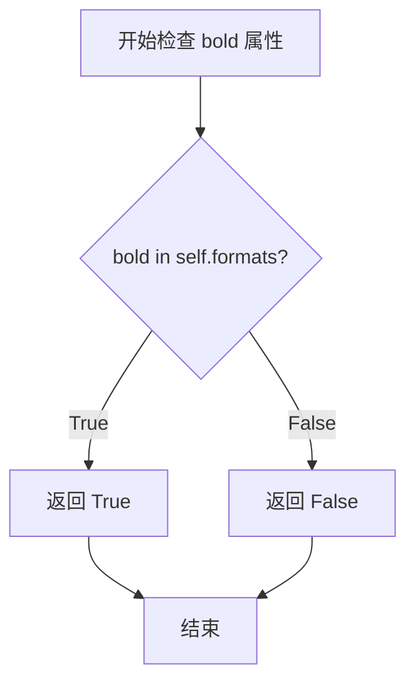
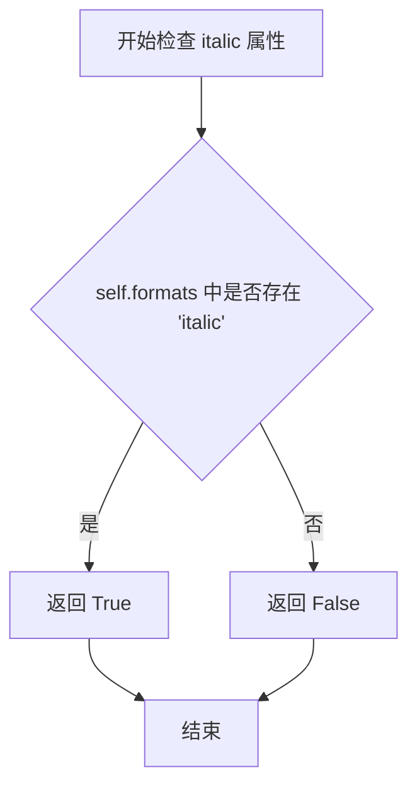
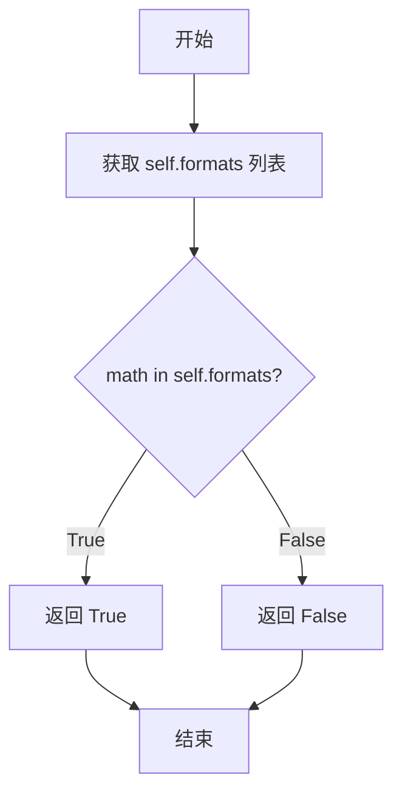
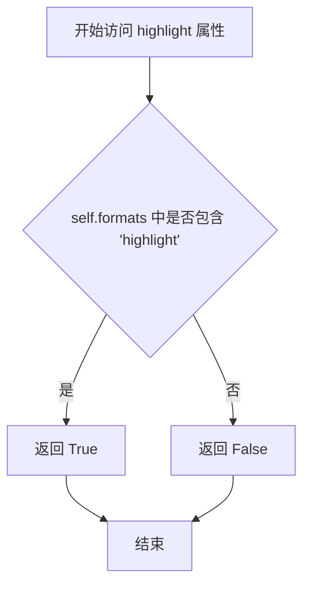
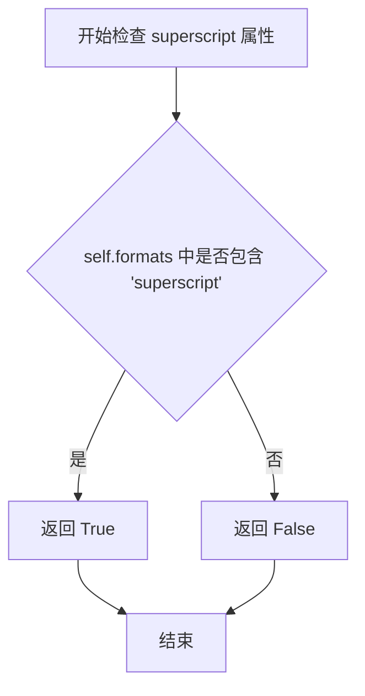
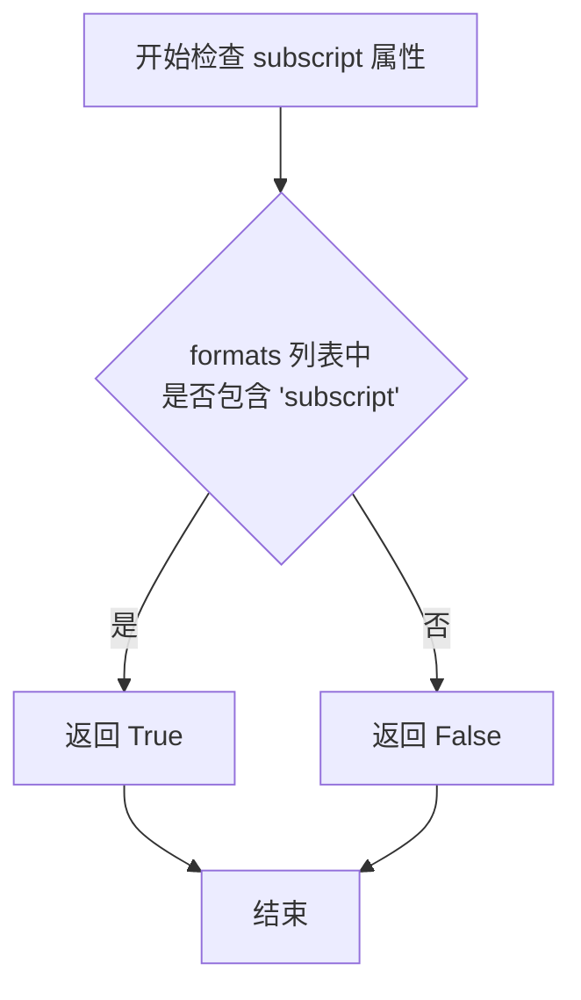
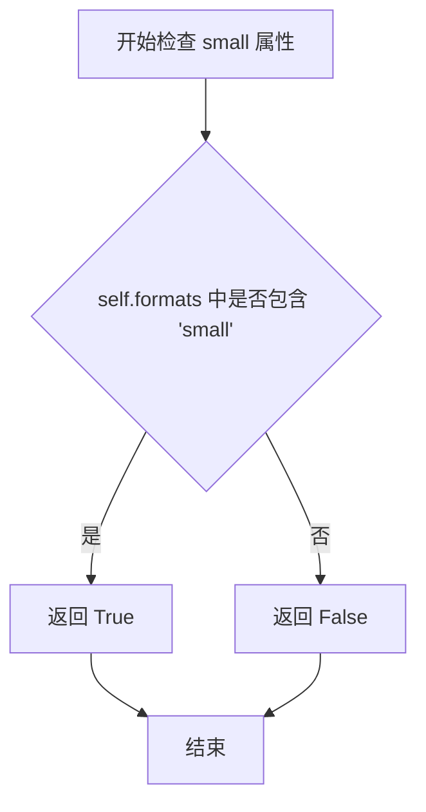
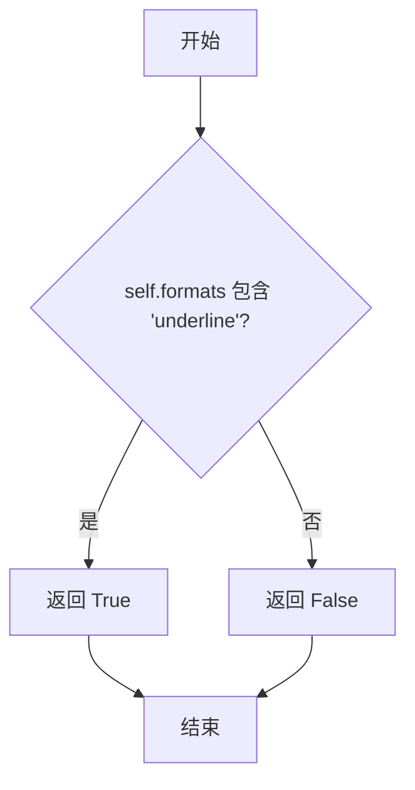
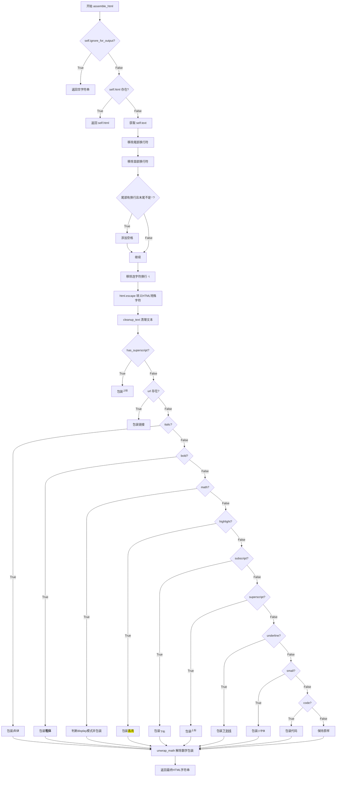

# `marker\marker\schema\text\span.py` 详细设计文档

该文件定义了一个Span类，用于表示文档中的一段文本，包含文本格式（粗体、斜体、数学公式等）、字体样式、位置信息等属性，并提供了将文本组装为HTML格式的方法。

## 整体流程

```mermaid
graph TD
    A[开始 assemble_html] --> B{ignore_for_output?}
    B -- 是 --> C[返回空字符串]
    B -- 否 --> D{self.html 存在?}
    D -- 是 --> E[返回 self.html]
    D -- 否 --> F[获取 text]
    F --> G[去除尾部换行符]
    G --> H[去除首部换行符]
    H --> I{有换行且不以-结尾?}
    I -- 是 --> J[添加空格]
    I -- 否 --> K[继续]
    J --> L[处理连字符换行]
    K --> L
    L --> M[HTML转义]
    M --> N[cleanup_text清理]
    N --> O{has_superscript?}
    O -- 是 --> P[添加sup标签]
    O -- 否 --> Q{有url?}
    Q -- 是 --> R[添加a标签]
    Q -- 否 --> S{italic?]
    S -- 是 --> T[添加i标签]
    S -- 否 --> U{bold?]
    U -- 是 --> V[添加b标签]
    U -- 否 --> W{math?]
    W -- 是 --> X[判断display_mode并添加math标签]
    W -- 否 --> Y{highlight?]
    Y -- 是 --> Z[添加mark标签]
    Y -- 否 --> AA{subscript?]
    AA -- 是 --> AB[添加sub标签]
    AA -- 否 --> AC{superscript?]
    AC -- 是 --> AD[添加sup标签]
    AC -- 否 --> AE{underline?]
    AE -- 是 --> AF[添加u标签]
    AE -- 否 --> AG{small?]
    AG -- 是 --> AH[添加small标签]
    AG -- 否 --> AI{code?]
    AI -- 是 --> AJ[添加code标签]
    AI -- 否 --> AK[返回原始text]
    P --> AK
    R --> AK
    T --> AK
    V --> AK
    X --> AK
    Z --> AK
    AB --> AK
    AD --> AK
    AF --> AK
    AH --> AK
    AJ --> AK
    AK --> AL[unwrap_math处理]
    AL --> AM[返回最终HTML]
```

## 类结构

```
Block (抽象基类)
└── Span (文本片段类)
```

## 全局变量及字段


### `cleanup_text`
    
清理文本中的多余空白行并将不间断空格替换为普通空格

类型：`function`
    


### `Span.block_type`
    
块类型，固定为BlockTypes.Span

类型：`BlockTypes`
    


### `Span.block_description`
    
块的描述信息，说明这是一个行内的文本片段

类型：`str`
    


### `Span.text`
    
文本内容

类型：`str`
    


### `Span.font`
    
字体名称

类型：`str`
    


### `Span.font_weight`
    
字体权重值

类型：`float`
    


### `Span.font_size`
    
字体大小

类型：`float`
    


### `Span.minimum_position`
    
文本在行中的最小位置索引

类型：`int`
    


### `Span.maximum_position`
    
文本在行中的最大位置索引

类型：`int`
    


### `Span.formats`
    
文本格式列表，包含plain、math、chemical、bold、italic等格式

类型：`List[Literal[...]]`
    


### `Span.has_superscript`
    
标记是否有上标内容

类型：`bool`
    


### `Span.has_subscript`
    
标记是否有下标内容

类型：`bool`
    


### `Span.url`
    
可选的链接URL

类型：`Optional[str]`
    


### `Span.html`
    
可选的预定义HTML内容

类型：`Optional[str]`
    


### `Span.bold`
    
检查formats中是否包含bold格式

类型：`property (bool)`
    


### `Span.italic`
    
检查formats中是否包含italic格式

类型：`property (bool)`
    


### `Span.math`
    
检查formats中是否包含math格式

类型：`property (bool)`
    


### `Span.highlight`
    
检查formats中是否包含highlight格式

类型：`property (bool)`
    


### `Span.superscript`
    
检查formats中是否包含superscript格式

类型：`property (bool)`
    


### `Span.subscript`
    
检查formats中是否包含subscript格式

类型：`property (bool)`
    


### `Span.small`
    
检查formats中是否包含small格式

类型：`property (bool)`
    


### `Span.code`
    
检查formats中是否包含code格式

类型：`property (bool)`
    


### `Span.underline`
    
检查formats中是否包含underline格式

类型：`property (bool)`
    


### `Span.assemble_html`
    
将Span对象转换为HTML字符串，处理各种文本格式并返回最终的HTML表示

类型：`method`
    
    

## 全局函数及方法


### `cleanup_text`

该函数是一个文本清理工具函数，主要用于预处理OCR或PDF解析后的文本内容，通过规范化空白字符（将连续超过两个的换行符组合缩减为双换行符，以及将不间断空格替换为普通空格）来提升文本的一致性和可读性。

参数：

- `full_text`：`str`，需要进行清理的原始文本字符串

返回值：`str`，返回清理处理后的文本字符串

#### 流程图

```mermaid
flowchart TD
    A[开始 cleanup_text] --> B[输入原始文本 full_text]
    B --> C{正则替换}
    C --> D[匹配模式: (\n\s){3,}]
    D --> E[替换为: \n\n]
    E --> F{替换不间断空格}
    F --> G[将 \xa0 替换为普通空格]
    G --> H[返回清理后的文本]
    H --> I[结束]
```

#### 带注释源码

```python
def cleanup_text(full_text):
    """
    清理文本中的特殊空白字符，规范换行符格式
    
    该函数执行两个主要的文本清理操作：
    1. 将连续3个或更多的"换行符+空白"组合缩减为双换行符
    2. 将不间断空格(\xa0)替换为普通空格
    
    参数:
        full_text (str): 需要清理的原始文本
        
    返回:
        str: 清理处理后的文本
    """
    # 使用正则表达式将连续3个及以上的"换行符+空白"组合替换为双换行符
    # 这主要用于规范化OCR或PDF解析后产生的多余空行
    full_text = re.sub(r"(\n\s){3,}", "\n\n", full_text)
    
    # 将不间断空格（non-breaking space，Unicode \xa0）替换为普通空格
    # 不间断空格通常在HTML或Word文档中使用，需要转换为普通空格以便统一处理
    full_text = full_text.replace("\xa0", " ")  # Replace non-breaking spaces
    
    # 返回清理后的文本
    return full_text
```


### `Span.bold`

该属性是 `Span` 类的布尔型计算属性，用于判断当前文本 spans 是否应用了粗体格式。它通过检查 `formats` 列表中是否包含字符串 `"bold"` 来返回布尔值。

参数： 无

返回值：`bool`，如果 `formats` 列表中包含 `"bold"` 则返回 `True`，否则返回 `False`。

#### 流程图



#### 带注释源码

```python
@property
def bold(self):
    # 检查 "bold" 字符串是否存在于实例的 formats 列表属性中
    # formats 列表包含文本的格式类型，如 "plain", "math", "bold", "italic" 等
    # 如果存在返回 True，表示此文本 spans 应渲染为粗体
    # 如果不存在返回 False
    return "bold" in self.formats
```


### `Span.italic`

用于检查当前文本 span 是否包含斜体格式的属性。当 `formats` 列表中存在 `"italic"` 值时返回 `True`，否则返回 `False`。

参数：

- `self`：`Span`，隐式参数，当前 Span 实例本身

返回值：`bool`，返回 `True` 表示该文本 span 包含斜体格式；返回 `False` 表示不包含斜体格式

#### 流程图



#### 带注释源码

```python
@property
def italic(self):
    """
    检查当前文本 span 是否包含斜体格式。
    
    该属性通过检查 formats 列表中是否包含 "italic" 字符串
    来确定当前文本是否应被渲染为斜体。
    
    Returns:
        bool: 如果 formats 列表包含 'italic' 返回 True，否则返回 False
    """
    return "italic" in self.formats
```


### `Span.math`

这是一个属性方法，用于检查当前文本span是否为数学格式。它通过检查`formats`列表中是否包含"math"字符串来返回布尔值。

参数： 无（此属性不接受任何参数）

返回值：`bool`，返回`True`表示该span是数学格式，返回`False`表示不是数学格式。

#### 流程图



#### 带注释源码

```python
@property
def math(self):
    """
    检查当前Span是否为数学格式。
    
    返回值:
        bool: 如果formats列表中包含"math"，返回True；否则返回False。
    """
    return "math" in self.formats
```


### `Span.highlight`

该属性是 `Span` 类中的一个布尔型只读属性，用于检查当前文本 span 是否具有高亮（highlight）格式。它通过检查 `formats` 列表中是否包含 `"highlight"` 字符串来返回对应的布尔值。

参数： 无

返回值：`bool`，如果当前 span 的 `formats` 列表中包含 `"highlight"` 格式则返回 `True`，否则返回 `False`。

#### 流程图



#### 带注释源码

```python
@property
def highlight(self):
    """
    检查当前 Span 对象是否具有高亮格式。
    
    该属性通过检查 self.formats 列表中是否包含字符串 'highlight' 来确定
    当前文本 span 是否应该被渲染为高亮文本。
    
    返回:
        bool: 如果 'highlight' 存在于 formats 列表中返回 True，否则返回 False
    """
    return "highlight" in self.formats
```


### `Span.superscript`

该属性用于检查当前文本片段是否具有上标（superscript）格式化。属性通过检查 `formats` 列表中是否包含 "superscript" 字符串来返回布尔值。

参数： 无

返回值：`bool`，如果 span 具有上标格式则返回 `True`，否则返回 `False`

#### 流程图



#### 带注释源码

```python
@property
def superscript(self):
    """
    检查当前 Span 是否具有上标格式。
    
    该属性方法通过检查 self.formats 列表中是否包含 "superscript" 字符串
    来确定文本是否需要渲染为上标格式。
    
    参数：
        无（属性方法，无需参数）
    
    返回值：
        bool：如果 self.formats 列表中包含 "superscript"，返回 True；
              否则返回 False
    """
    return "superscript" in self.formats
```

#### 关联信息

- **所属类**：`Span`
- **类定义位置**：`marker.schema.blocks`
- **相关属性**：同类的其他格式化检查属性包括 `bold`、`italic`、`math`、`highlight`、`subscript`、`small`、`code`、`underline` 等
- **使用场景**：在 `assemble_html` 方法中，该属性用于判断是否将文本包装在 `<sup>` HTML 标签中


### `Span.subscript`

该属性方法用于判断当前文本Span是否具有下标（subscript）格式。它通过检查`formats`列表中是否包含"subscript"字符串来返回布尔值，表示该文本片段是否应以下标格式渲染。

参数： 无

返回值：`bool`，返回`True`表示该Span具有下标格式，应使用`<sub>`标签渲染；返回`False`表示不具有下标格式。

#### 流程图



#### 带注释源码

```python
@property
def subscript(self):
    """
    检查当前 Span 文本是否具有下标格式。
    
    该属性通过检查 self.formats 列表中是否包含 "subscript" 字符串
    来确定文本是否应该以下标形式渲染。在 HTML 组装过程中，
    具有下标格式的文本将被包裹在 <sub> 标签中。
    
    Returns:
        bool: 如果 formats 列表中包含 "subscript"，返回 True；
              否则返回 False。
    """
    return "subscript" in self.formats
```


### `Span.small`

该属性用于检查当前文本 span 是否具有 "small" 格式，返回布尔值以指示文本是否应以 `<small>` HTML 标签渲染。

参数： 无（该属性不接受显式参数，使用隐式 `self` 引用当前实例）

返回值：`bool`，如果文本格式列表中包含 "small" 则返回 `True`，否则返回 `False`

#### 流程图



#### 带注释源码

```python
@property
def small(self):
    """
    检查当前 Span 对象的文本格式是否为 'small'。
    
    该属性通过检查 self.formats 列表中是否存在 "small" 字符串
    来判断文本是否应该以小号字体渲染。
    
    Returns:
        bool: 如果 "small" 存在于格式列表中返回 True，否则返回 False
    """
    return "small" in self.formats
```


### `Span.code`

该属性用于判断当前文本片段（Span）是否包含代码格式，通过检查formats列表中是否存在"code"字符串来返回布尔值。

参数： 无

返回值： `bool`，返回True表示当前Span为代码格式，否则返回False

#### 流程图

```mermaid
flowchart TD
    A[开始] --> B{检查 formats 列表}
    B -->|包含 "code"| C[返回 True]
    B -->|不包含 "code"| D[返回 False]
```

#### 带注释源码

```python
@property
def code(self):
    return "code" in self.formats
```


### `Span.underline`

该属性用于判断文本片段是否应用了下划线格式，通过检查 `formats` 列表中是否包含 `"underline"` 字符串来返回布尔值。

#### 流程图



#### 带注释源码

```python
@property
def underline(self):
    """
    属性: underline
    用途: 检查当前文本片段是否应用了下划线格式
    
    参数: 无 (通过 self 隐式访问实例属性)
    
    返回:
        bool: 如果 'underline' 存在于 formats 列表中返回 True，否则返回 False
    """
    return "underline" in self.formats  # 检查formats列表中是否存在'underline'格式标记
```


### `Span.assemble_html`

该方法负责将 `Span` 对象转换为对应的 HTML 字符串表示，处理文本格式（如粗体、斜体、数学公式、上标、下标等）、清理换行符、转义 HTML 特殊字符，并返回最终的 HTML 片段。

#### 参数

- `self`：`Span`（隐式），Span 类实例，当前要转换为 HTML 的文本片段对象
- `document`：`Any`（根据调用上下文推断为文档对象），包含文档的全局信息和配置
- `child_blocks`：`List[Block]`（根据上下文），当前 span 的子块列表（通常为空，因为 Span 是最小文本单元）
- `parent_structure`：`Any`（根据上下文），父级结构的引用，用于确定嵌套关系
- `block_config`：`Dict`（根据上下文），块级别的配置选项，影响 HTML 渲染行为

#### 返回值

`str`，返回生成的 HTML 字符串，如果 `ignore_for_output` 为 True 或存在 `self.html` 时可能返回空字符串。

#### 流程图



#### 带注释源码

```python
def assemble_html(self, document, child_blocks, parent_structure, block_config):
    # 1. 如果当前块被标记为忽略输出，直接返回空字符串
    if self.ignore_for_output:
        return ""

    # 2. 如果已存在预生成的HTML，直接返回（缓存机制）
    if self.html:
        return self.html

    # 3. 获取原始文本内容
    text = self.text

    # 4. 移除尾部换行符
    replaced_newline = False
    while len(text) > 0 and text[-1] in ["\n", "\r"]:
        text = text[:-1]
        replaced_newline = True

    # 5. 移除首部换行符
    while len(text) > 0 and text[0] in ["\n", "\r"]:
        text = text[1:]

    # 6. 如果移除了换行符且文本末尾不是连字符，添加空格（处理单词换行情况）
    if replaced_newline and not text.endswith("-"):
        text += " "

    # 7. 移除连字符换行（如 "word-\n" 转为 "word"）
    text = text.replace("-\n", "")

    # 8. HTML转义，防止XSS和渲染错误
    text = html.escape(text)

    # 9. 清理文本（替换不间断空格、合并多余空行）
    text = cleanup_text(text)

    # 10. 处理上标格式（数字或非单词字符开头的上标）
    if self.has_superscript:
        text = re.sub(r"^([0-9\W]+)(.*)", r"<sup>\1</sup>\2", text)
        # 处理整块作为上标的情况
        if "<sup>" not in text:
            text = f"<sup>{text}</sup>"

    # 11. 处理超链接
    if self.url:
        text = f"<a href='{self.url}'>{text}</a>"

    # 12. TODO 支持多种格式组合（当前只支持单一格式）
    # 按优先级处理：斜体 > 粗体 > 数学 > 高亮 > 下标 > 上标 > 下划线 > 小字体 > 代码
    if self.italic:
        text = f"<i>{text}</i>"
    elif self.bold:
        text = f"<b>{text}</b>"
    elif self.math:
        # 判断数学公式的显示模式（块级或行内）
        block_envs = ["split", "align", "gather", "multline"]
        if any(f"\\begin{{{env}}}" in text for env in block_envs):
            display_mode = "block"
        else:
            display_mode = "inline"
        text = f"<math display='{display_mode}'>{text}</math>"
    elif self.highlight:
        text = f"<mark>{text}</mark>"
    elif self.subscript:
        text = f"<sub>{text}</sub>"
    elif self.superscript:
        text = f"<sup>{text}</sup>"
    elif self.underline:
        text = f"<u>{text}</u>"
    elif self.small:
        text = f"<small>{text}</small>"
    elif self.code:
        text = f"<code>{text}</code>"

    # 13. 解除多余的数学公式包装
    text = unwrap_math(text)

    # 14. 返回最终HTML字符串
    return text
```

---

## 补充信息

### 关键组件信息

| 组件名称 | 一句话描述 |
|---------|-----------|
| `Span` | 表示文档中一行文本内的文本片段，包含字体样式、格式和位置信息 |
| `cleanup_text` | 辅助函数，清理文本中的多余空行和非间断空格 |
| `unwrap_math` | 工具函数，移除多余的数学公式包装标签 |
| `BlockTypes.Span` | 块类型枚举值，标识当前块为 Span 类型 |

### 潜在的技术债务或优化空间

1. **格式互斥问题**：当前代码使用 `if-elif` 链，只能处理单一格式（优先级：斜体 > 粗体 > 数学 > ...），不支持多种格式组合（如同时加粗和斜体）。应改为逐个检查并叠加标签。

2. **正则表达式预编译**：`re.sub` 中的正则表达式未预编译，每次调用都会重新解析，影响性能。

3. **硬编码格式列表**：`block_envs` 列表硬编码在方法内，应提取为常量或配置。

4. **TODO 注释**：代码中已有 TODO 标记支持多种格式，但尚未实现。

5. **参数类型注解缺失**：方法签名中 `document`、`child_blocks`、`parent_structure`、`block_config` 缺少类型注解。

### 其它项目

#### 设计目标与约束

- **设计目标**：将结构化的文本片段（Span）转换为可渲染的 HTML 片段，支持多种文本格式和特殊处理（如数学公式、代码、上下标等）。
- **约束**：Span 是最小文本单元，不能包含子块；当前仅支持单一格式。

#### 错误处理与异常设计

- 未显式抛出异常，主要通过条件判断处理边界情况（如空文本、已缓存的 HTML）。
- `html.escape` 自动处理特殊字符转义，防止 XSS 攻击。

#### 数据流与状态机

该方法可视为一个转换状态机：
1. **初始态** → 获取原始文本
2. **清理态** → 移除换行、清理空白
3. **转义态** → HTML 字符转义
4. **包裹态** → 根据格式属性添加对应 HTML 标签
5. **最终态** → 返回结果

#### 外部依赖与接口契约

- 依赖 `html` 标准库进行字符转义
- 依赖 `marker.schema.blocks.Block` 基类
- 依赖 `marker.util.unwrap_math` 工具函数
- 依赖 `cleanup_text` 本地辅助函数
- 返回值需为有效的 HTML 字符串片段

## 关键组件


### Span 类

表示文档行内的文本片段，支持多种格式（纯文本、数学公式、化学公式、粗体、斜体、高亮、下标、上标、小型文本、代码、下划线），并提供将文本片段转换为HTML表示的功能。

### cleanup_text 函数

用于清理文本内容，将多个连续空白字符替换为两个换行符，并将不间断空格替换为普通空格。

### format 属性组

一组只读属性（bold、italic、math、highlight、superscript、subscript、small、code、underline），用于判断当前Span对象是否包含对应格式，通过检查formats列表中是否包含特定格式字符串。

### assemble_html 方法

核心转换方法，将Span对象组装成HTML字符串。处理换行符清理、连字符换行、数学公式显示模式判断（行内或块级）、超链接包装，以及按优先级应用格式标签。

### unwrap_math 函数调用

在assemble_html方法末尾调用，用于处理数学公式的包装，去除不必要的数学公式外层包装。


## 问题及建议


### 已知问题

- **多格式不兼容**：代码中 TODO 注释明确指出"Support multiple formats"，当前使用 if-elif 链只能应用一种格式，无法同时支持粗体+斜体等组合格式
- **正则表达式低效**：使用 while 循环逐个移除换行符，效率较低，可用 `rstrip()` 和 `lstrip()` 或正则表达式一次性处理
- **HTML转义顺序问题**：`html.escape(text)` 在处理格式之前调用，可能导致后续插入的 HTML 标签属性（如 `href`）被意外转义
- **属性方法重复**：多个属性方法（bold、italic、math等）都是相同的列表包含检查逻辑，存在代码重复
- **Magic Number/字符串**：块环境名称（"split"、"align"等）和 HTML 标签硬编码在方法中，缺乏常量定义
- **类型注解缺失**：`assemble_html` 方法的参数缺少类型注解，影响代码可维护性和 IDE 支持

### 优化建议

- 将 if-elif 链改为字典映射或多格式处理逻辑，支持多个格式的组合应用
- 使用 `text.rstrip('\n\r')` 和 `text.lstrip('\n\r')` 替代循环，或使用 `re.sub(r'^[\n\r]+|[\n\r]+$', '', text)`
- 调整 HTML 转义顺序，在最后阶段转义文本内容，保留标签属性
- 提取公共逻辑到装饰器或使用 `__getattr__` 动态生成属性方法
- 定义常量类或枚举存储块环境名称和 HTML 标签模板
- 为 `assemble_html` 方法参数添加完整的类型注解

## 其它


### 设计目标与约束

本模块的设计目标是实现文本Span到HTML的安全转换，支持多种文本格式（bold、italic、math、highlight等）的渲染。约束条件包括：仅支持单一格式优先级（不支持多种格式同时应用）、数学公式仅支持LaTeX语法、化学公式处理能力有限、超链接URL需要预先提取。

### 错误处理与异常设计

代码中通过`ignore_for_output`属性实现输出跳过逻辑，当该标志为True时直接返回空字符串。对于空文本或纯换行符文本，通过while循环检测并移除首尾换行符后处理。正则表达式处理采用Python内置re模块，未进行显式异常捕获，若text参数为None可能导致AttributeError。TODO注释表明当前仅支持单一格式，后续需增强格式冲突处理逻辑。

### 数据流与状态机

数据输入阶段接收Span对象的text、formats、url等属性及外部传入的document、child_blocks、parent_structure、block_config参数。处理阶段首先执行文本清理（移除多余空白、替换非断字空格），然后进行HTML转义以防止XSS攻击，接着根据formats属性进行格式识别与HTML标签包装，最后对数学公式调用unwrap_math进行后处理。状态转换流程为：原始文本 → 换行符清理 → HTML转义 → 格式判断 → 特定标签包装 → 数学公式处理 → 最终输出。

### 外部依赖与接口契约

核心依赖包括Python标准库html.escape用于HTML实体转义、re模块用于正则表达式匹配、typing模块提供类型注解。外部依赖为marker包：marker.schema.BlockTypes提供块类型枚举、marker.schema.Block作为基类、marker.util.unwrap_math处理数学公式展开。assemble_html方法签名为`def assemble_html(self, document, child_blocks, parent_structure, block_config) -> str`，调用方需传入document对象、child_blocks列表、parent_structure及block_config配置对象，返回格式化后的HTML字符串。

### 版本兼容性考虑

代码使用Python 3.9+的typing.Literal语法，要求Python版本不低于3.9。marker库版本需与schema定义保持兼容，BlockTypes枚举和Block基类的接口变更可能影响本模块功能。

### 安全性分析

代码通过html.escape对用户输入的text进行转义，可有效防止HTML注入攻击。但url属性直接拼接到`<a href='{self.url}'>`中，若未对URL进行校验可能存在href属性注入风险，建议增加URL scheme验证（仅允许http/https）。

### 性能注意事项

cleanup_text函数中连续调用re.sub和replace，assemble_html方法中多次字符串拼接操作，在处理大量Span对象时可能产生性能瓶颈。建议使用字符串列表join方式或预先编译正则表达式。

### 可测试性评估

Span类属性多为@property装饰的只读计算属性，便于单元测试。assemble_html方法依赖多个外部参数，建议抽取文本处理逻辑为纯函数以便独立测试。


    