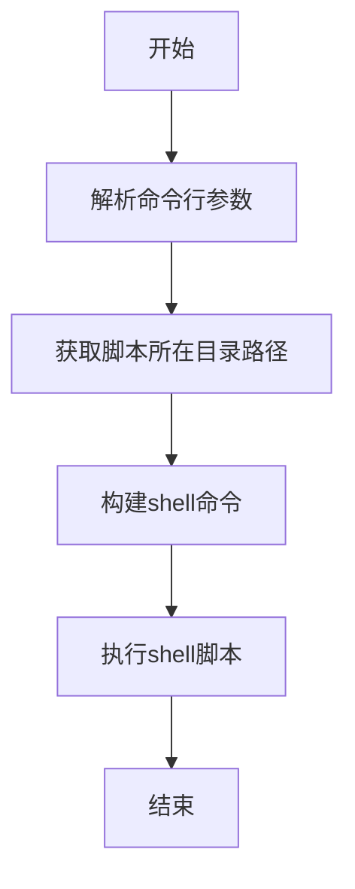
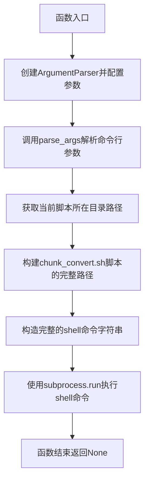

# `marker\marker\scripts\chunk_convert.py` 详细设计文档

一个命令行工具脚本，用于将PDF文件夹批量转换为Markdown文件夹，通过调用同目录下的chunk_convert.sh Shell脚本来完成实际转换工作。

## 整体流程



## 类结构

```
该脚本为纯函数式代码，无类定义
所有功能由全局函数 chunk_convert_cli 实现
```

## 全局变量及字段


### `chunk_convert_cli`
    
主函数，解析命令行参数并调用chunk_convert.sh脚本进行PDF到markdown的批量转换

类型：`function`
    


### `parser`
    
ArgumentParser对象，用于解析命令行参数

类型：`ArgumentParser`
    


### `args`
    
包含解析后的命令行参数对象，属性in_folder和out_folder存储输入输出路径

类型：`Namespace`
    


### `cur_dir`
    
当前脚本所在目录的绝对路径

类型：`str`
    


### `script_path`
    
chunk_convert.sh脚本的完整路径

类型：`str`
    


### `cmd`
    
要执行的完整shell命令字符串

类型：`str`
    


    

## 全局函数及方法


### `chunk_convert_cli`

该函数是整个转换工具的命令行入口点，负责解析用户输入的输入输出文件夹路径，定位同目录下的Shell转换脚本，并最终通过子进程调用该脚本完成PDF到Markdown的批量转换任务。

参数： 该函数无显式参数，通过 `argparse` 在函数内部自动解析命令行参数

- 无

返回值：`None`，函数执行完成后直接返回，未捕获或返回 subprocess 的执行结果

#### 流程图



#### 带注释源码

```
import argparse       # 导入命令行参数解析模块
import os             # 导入操作系统路径操作模块
import subprocess     # 导入子进程管理模块
import pkg_resources  # 导入包资源访问模块（当前未使用）

def chunk_convert_cli():
    """
    CLI主函数：负责参数解析、命令构建和脚本执行
    将PDF文件夹转换为Markdown文件夹
    """
    # 创建参数解析器，添加程序描述信息
    parser = argparse.ArgumentParser(description="Convert a folder of PDFs to a folder of markdown files in chunks.")
    
    # 添加输入文件夹参数：需要转换的PDF文件所在目录
    parser.add_argument("in_folder", help="Input folder with pdfs.")
    
    # 添加输出文件夹参数：转换后的Markdown文件存放目录
    parser.add_argument("out_folder", help="Output folder")
    
    # 解析命令行传入的参数（从sys.argv自动获取）
    args = parser.parse_args()

    # 获取当前脚本文件所在的目录绝对路径
    # __file__ 为当前模块文件路径
    cur_dir = os.path.dirname(os.path.abspath(__file__))
    
    # 拼接构建chunk_convert.sh脚本的完整系统路径
    script_path = os.path.join(cur_dir, "chunk_convert.sh")

    # 构造完整的shell命令：脚本路径 + 输入目录 + 输出目录
    cmd = f"{script_path} {args.in_folder} {args.out_folder}"

    # 使用subprocess执行shell命令
    # shell=True: 使用shell解释器执行命令
    # check=True: 若命令返回非零退出码，抛出CalledProcessError异常
    subprocess.run(cmd, shell=True, check=True)
```


## 关键组件


### chunk_convert_cli()

该函数是主入口点，负责解析命令行参数并调用shell脚本执行PDF到Markdown的批量转换。

### 命令行参数解析

使用argparse模块解析两个必需参数：in_folder（输入PDF文件夹路径）和out_folder（输出Markdown文件夹路径）。

### Shell脚本执行

使用subprocess模块执行chunk_convert.sh脚本，传递输入输出文件夹路径作为参数。

### 路径处理

使用os模块获取当前脚本所在目录，并构建shell脚本的完整路径。

### 脚本路径构造

通过os.path.join拼接当前目录和脚本文件名，构建可执行的shell脚本路径。

### 依赖管理

导入pkg_resources模块用于依赖管理（当前代码中未实际使用）。


## 问题及建议


### 已知问题

-   **安全漏洞：命令注入风险**：使用 `shell=True` 执行命令，攻击者可能通过构造恶意的输入路径执行任意命令
-   **缺少输入验证**：未检查输入文件夹 `args.in_folder` 是否存在或是否为有效目录
-   **缺少输出验证**：未检查输出文件夹 `args.out_folder` 是否存在，也未在不存在时自动创建
-   **脚本路径硬编码**：脚本路径依赖 `__file__`，在不同工作目录运行时可能失败
-   **未使用导入**：`pkg_resources` 被导入但从未使用，造成代码冗余
-   **缺少错误处理**：`subprocess.run` 的返回码未被显式处理，`check=True` 会在脚本失败时抛出异常但缺乏上下文信息
-   **缺乏可观测性**：无日志输出，用户无法了解转换进度或失败原因

### 优化建议

-   **参数验证**：在执行前验证输入文件夹存在且包含PDF文件，检查输出路径权限，必要时创建输出目录
-   **替代subprocess调用**：使用 `subprocess.run([script_path, args.in_folder, args.out_folder], check=True)` 避免 `shell=True` 带来的安全问题
-   **清理未使用导入**：移除 `pkg_resources` 的导入，或确认是否为未来功能预留
-   **增强错误处理**：捕获 `subprocess.CalledProcessError` 并提供详细的错误信息，包括失败的命令和返回码
-   **添加日志功能**：引入 `logging` 模块，支持 `-v/--verbose` 参数输出转换进度和调试信息
-   **路径处理优化**：考虑使用 `pathlib` 替代 `os.path`，代码更简洁且跨平台兼容性更好
-   **添加类型提示**：为函数参数和返回值添加类型注解，提升代码可读性和可维护性


## 其它


### 设计目标与约束

本工具旨在提供一个简单的命令行界面，将包含PDF文件的输入文件夹转换为Markdown文件输出到指定文件夹。核心约束包括：依赖外部shell脚本执行实际转换逻辑、不支持直接Python API调用、仅适用于类Unix系统（需要shell环境）。

### 错误处理与异常设计

代码通过subprocess.run的check=True参数实现错误传播，当shell脚本执行失败时抛出subprocess.CalledProcessError。argparse会自动处理无效参数并显示帮助信息。当前缺乏对输入输出路径有效性的预检查（如路径是否存在、是否有权限等）。

### 外部依赖与接口契约

主要依赖包括：Python标准库（argparse、os、subprocess）和pkg_resources（虽然代码中未直接使用）。外部接口为chunk_convert.sh脚本，需接收两个参数（输入文件夹路径、输出文件夹路径），脚本需返回0表示成功，非0表示失败。

### 性能考虑

当前实现为同步阻塞执行，大文件或大量PDF时可能导致长时间等待。未实现并发处理、进度显示或超时控制。脚本执行效率完全依赖于chunk_convert.sh的实现。

### 安全性考虑

存在命令注入风险：直接使用shell=True且字符串拼接方式构造命令。建议使用列表形式传递参数而非字符串。缺乏对输入路径的验证，可能导致路径遍历攻击。

### 测试策略

当前代码缺乏单元测试。建议测试场景包括：正常参数调用、错误参数调用、输入文件夹不存在、输出文件夹不存在、shell脚本执行失败等情况。

### 配置管理

无配置文件支持，所有配置通过命令行参数传入。script_path通过动态计算获取，假设脚本与Python文件位于同一目录。

    