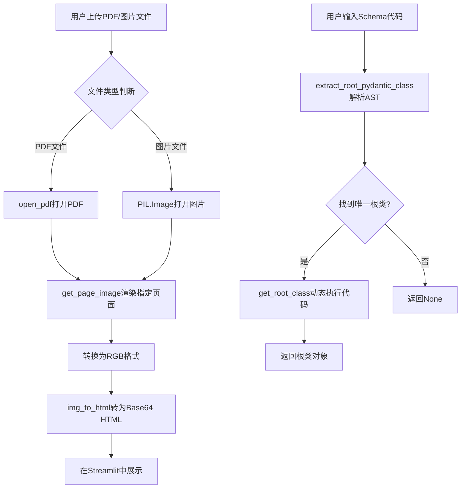
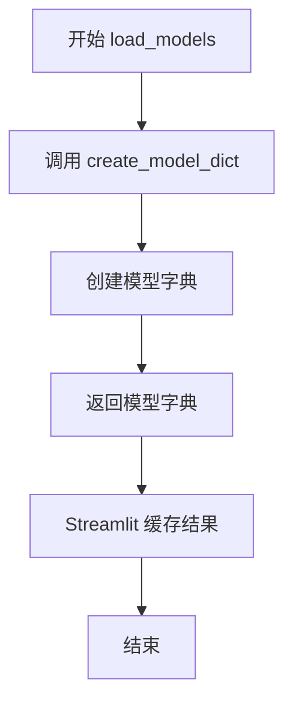
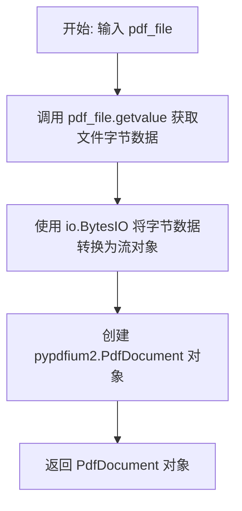
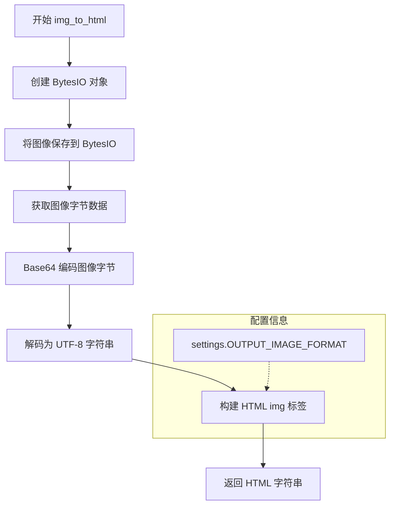
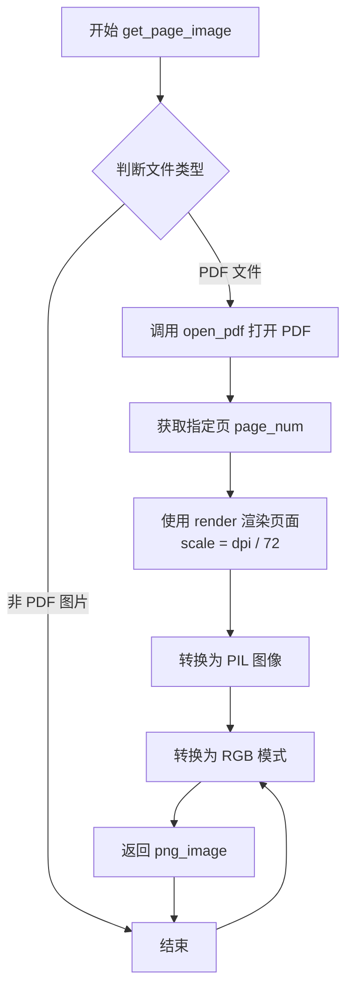
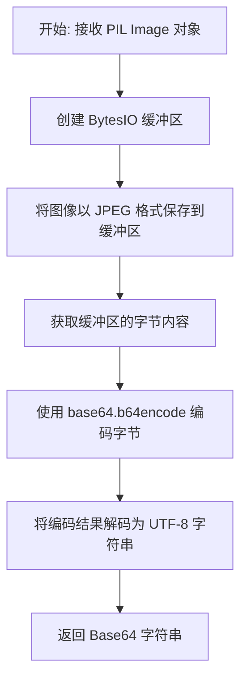
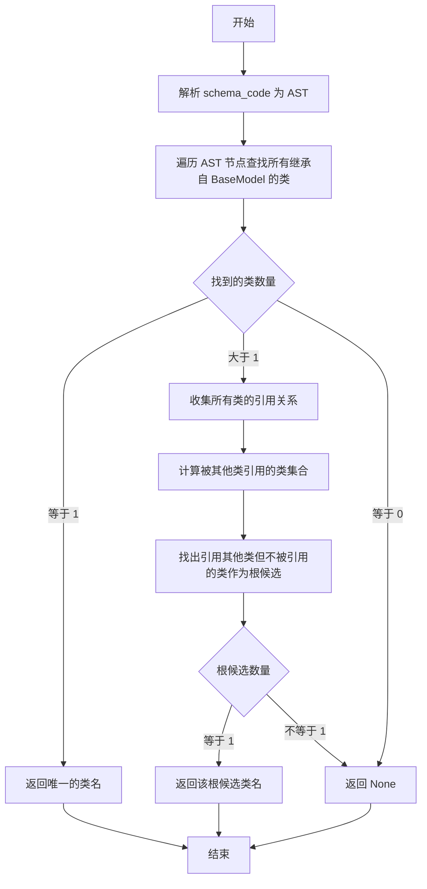
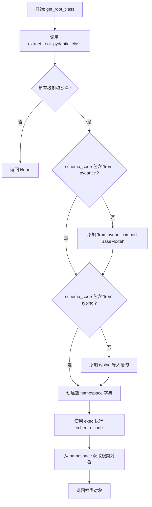

# `marker\marker\scripts\common.py` 详细设计文档

这是一个基于Streamlit的PDF处理Web应用，核心功能包括PDF文件的页面渲染、图像转换、Pydantic模型解析以及与marker库的集成，用于将PDF文档转换为图像格式并支持Schema代码中的Pydantic模型根类提取。

## 整体流程



## 类结构

```
此文件为工具函数集合模块
无显式类定义
└── 函数模块 (module)
    ├── parse_args (命令行参数解析)
    ├── load_models (模型加载)
    ├── open_pdf (PDF打开)
    ├── img_to_html (图像转HTML)
    ├── get_page_image (页面图像获取)
    ├── page_count (页数计算)
    ├── pillow_image_to_base64_string (图像转Base64)
    ├── extract_root_pydantic_class (根类提取)
    └── get_root_class (根类获取)
```

## 全局变量及字段


### `settings`
    
Marker配置对象，从marker.settings导入，包含OUTPUT_IMAGE_FORMAT等配置项

类型：`Any`
    


    

## 全局函数及方法


### `parse_args`

该函数是一个无参数的模块级函数，通过解析命令行参数（从 `sys.argv` 获取）并使用自定义的 Click 解析器来提取通用的 CLI 选项。它返回一个包含解析后参数的字典，如果解析失败则返回包含错误信息的字典。

参数： 无

返回值：`dict`，返回解析后的命令行参数字典，键为参数名，值为参数值；如果发生解析错误，则返回 `{"error": str(e)}` 格式的错误字典。

#### 流程图

```mermaid
flowchart TD
    A([开始 parse_args]) --> B[定义内部函数 options_func 并应用 @ConfigParser.common_options 装饰器]
    B --> C[定义 extract_click_params 函数用于从装饰函数提取 __click_params__]
    C --> D[创建 CustomClickPrinter 命令对象 cmd]
    D --> E[调用 extract_click_params 获取 extracted_params]
    E --> F[将 extracted_params 添加到 cmd.params]
    F --> G[创建 click.Context 对象 ctx]
    G --> H[获取命令行参数 cmd_args = sys.argv[1:]]
    H --> I[调用 cmd.parse_args 解析参数]
    I --> J{是否发生异常?}
    J -->|否| K[返回 ctx.params 字典]
    J -->|是| L[捕获 click.exceptions.ClickException]
    L --> M[返回 {"error": str(e)} 字典]
```

#### 带注释源码

```python
@st.cache_data()  # Streamlit 装饰器，缓存函数返回值
def parse_args():
    # 使用 ConfigParser.common_options 装饰器获取通用 CLI 选项
    # 这是一个装饰器，用于为命令行工具添加标准选项
    @ConfigParser.common_options
    def options_func():
        pass

    # 内部函数：从装饰函数中提取 click 参数
    def extract_click_params(decorated_function):
        # 检查函数是否有 __click_params__ 属性
        if hasattr(decorated_function, "__click_params__"):
            return decorated_function.__click_params__
        return []

    # 创建自定义 Click 命令对象，用于解析参数
    cmd = CustomClickPrinter("Marker app.")
    
    # 从装饰的 options_func 中提取参数
    extracted_params = extract_click_params(options_func)
    
    # 将提取的参数添加到命令对象中
    cmd.params.extend(extracted_params)
    
    # 创建 Click 上下文对象
    ctx = click.Context(cmd)
    
    try:
        # 获取命令行参数（排除脚本名称）
        cmd_args = sys.argv[1:]
        
        # 解析命令行参数
        cmd.parse_args(ctx, cmd_args)
        
        # 返回解析后的参数字典
        return ctx.params
    except click.exceptions.ClickException as e:
        # 捕获 Click 异常并返回错误信息字典
        return {"error": str(e)}
```


### `load_models`

该函数是一个 Streamlit 缓存函数，用于加载并缓存 Marker 转换所需的机器学习模型，通过调用 `create_model_dict()` 创建模型字典并返回。

参数：无

返回值：`Dict`，包含所有已加载的 Marker 模型对象的字典，用于 PDF 或图像到 Markdown 的转换过程。

#### 流程图



#### 带注释源码

```python
@st.cache_resource()  # Streamlit 装饰器：缓存函数返回的模型对象，避免重复加载
def load_models():
    """
    加载 Marker 所需的机器学习模型。
    
    使用 @st.cache_resource() 装饰器确保模型只在首次调用时加载，
    后续调用直接返回缓存的模型字典，提升性能并避免重复加载模型资源。
    
    Returns:
        Dict: 包含所有已加载模型的字典，由 create_model_dict() 创建
    """
    return create_model_dict()  # 调用 marker.models 模块中的 create_model_dict 函数创建模型字典
```


### `open_pdf`

该函数用于将上传的 PDF 文件转换为 pypdfium2 库可处理的 PdfDocument 对象，以便后续进行页面渲染和内容提取等操作。

参数：

- `pdf_file`：`UploadedFile`，Streamlit 上传的文件对象，包含 PDF 文件的原始字节数据

返回值：`pypdfium2.PdfDocument`，pypdfium2 库生成的 PDF 文档对象，可用于访问 PDF 页面、渲染内容等操作

#### 流程图



#### 带注释源码

```python
def open_pdf(pdf_file):
    """
    将上传的 PDF 文件转换为 pypdfium2 的 PdfDocument 对象
    
    参数:
        pdf_file: Streamlit 上传的文件对象
        
    返回:
        pypdfium2.PdfDocument 对象
    """
    # 获取文件的原始字节数据
    stream = io.BytesIO(pdf_file.getvalue())
    # 使用 pypdfium2 打开 PDF 文档并返回文档对象
    return pypdfium2.PdfDocument(stream)
```


### `img_to_html`

该函数将 PIL 图像对象转换为包含 base64 编码数据的 HTML img 标签字符串，支持直接在 HTML 页面中嵌入图像数据，无需外部图像文件。

参数：

- `img`：`PIL.Image`，需要转换为 HTML 的 PIL 图像对象
- `img_alt`：`str`，图像的替代文本，用于 HTML img 标签的 alt 属性

返回值：`str`，包含 base64 编码图像数据的完整 HTML img 标签字符串

#### 流程图



#### 带注释源码

```python
def img_to_html(img, img_alt):
    """
    将 PIL 图像对象转换为包含 base64 编码数据的 HTML img 标签
    
    参数:
        img: PIL Image 对象，待转换的图像
        img_alt: str，图像的替代文本
    
    返回:
        str，包含完整 base64 数据的 HTML img 标签
    """
    # 创建一个内存中的字节流对象，用于临时存储图像数据
    img_bytes = io.BytesIO()
    
    # 将 PIL 图像保存到字节流中，使用配置中指定的输出格式（如 PNG、JPEG 等）
    img_bytes = img.save(img_bytes, format=settings.OUTPUT_IMAGE_FORMAT)
    
    # 获取写入的图像字节数据
    img_bytes = img_bytes.getvalue()
    
    # 对图像字节进行 base64 编码，并解码为 UTF-8 字符串以便嵌入 HTML
    encoded = base64.b64encode(img_bytes).decode()
    
    # 构建完整的 HTML img 标签，包含 base64 编码的图像数据
    # 设置最大宽度为 100% 以确保响应式显示
    img_html = f''
    
    # 返回生成的 HTML 字符串
    return img_html
```

#### 关键组件信息

| 组件名称 | 一句话描述 |
|---------|-----------|
| `io.BytesIO` | 内存中的字节流容器，用于临时存储图像数据 |
| `base64.b64encode` | Base64 编码函数，将二进制图像数据转换为可嵌入 HTML 的文本格式 |
| `settings.OUTPUT_IMAGE_FORMAT` | 配置项，指定输出图像格式（PNG/JPEG 等） |

#### 潜在技术债务与优化空间

1. **重复调用 `img.save` 返回值问题**：代码中 `img.save()` 返回的值被重新赋值为 `img_bytes`，但实际上 `save()` 返回 `None`，这会导致 `img_bytes.getvalue()` 调用失败。应先创建 BytesIO 对象，然后在 save 后直接调用该对象的 `getvalue()` 方法。

2. **缺少输入验证**：函数未检查 `img` 是否为有效的 PIL Image 对象，也未验证 `img_alt` 是否为安全字符串，可能引发运行时错误。

3. **大型图像性能考虑**：对于高分辨率图像，base64 编码后的字符串会非常大，可能导致 HTML 文档体积膨胀，影响页面加载性能。考虑添加图像压缩或尺寸限制逻辑。

4. **格式转换硬编码**：图像格式转换逻辑与 `get_page_image` 等其他函数分离，可能导致格式不一致，建议统一管理图像处理配置。


### `get_page_image`

该函数用于从上传的 PDF 文件或图片文件中提取指定页面并渲染为 PIL 图像对象，支持可配置的 DPI 分辨率。

参数：

- `pdf_file`：`UploadedFile`，Streamlit 上传的文件对象，支持 PDF 或常见图片格式（JPEG、PNG 等）
- `page_num`：`int`，PDF 文件的页码（从 0 开始索引），对于非 PDF 图片文件此参数被忽略
- `dpi`：`int`，渲染分辨率，默认为 96，决定输出图像的缩放比例

返回值：`PIL.Image.Image`，返回 RGB 格式的 PIL 图像对象

#### 流程图



#### 带注释源码

```python
@st.cache_data()  # Streamlit 缓存装饰器，避免重复渲染相同页面
def get_page_image(pdf_file, page_num, dpi=96):
    """
    从 PDF 或图片文件中提取指定页面并渲染为 PIL 图像
    
    参数:
        pdf_file: Streamlit 上传的文件对象
        page_num: PDF 页码（从 0 开始）
        dpi: 渲染分辨率，默认为 96
    
    返回:
        PIL.Image 对象（RGB 格式）
    """
    # 检查文件类型是否为 PDF
    if "pdf" in pdf_file.type:
        # 打开 PDF 文档
        doc = open_pdf(pdf_file)
        # 获取指定页码的页面对象
        page = doc[page_num]
        # 渲染页面为图像，scale 用于 DPI 转换（PDF 标准为 72 DPI）
        png_image = (
            page.render(
                scale=dpi / 72,  # 将目标 DPI 转换为 PDF 渲染比例
            )
            .to_pil()  # 转换为 PIL 图像对象
            .convert("RGB")  # 统一转换为 RGB 模式
        )
    else:
        # 非 PDF 文件（图片格式），直接用 PIL 打开并转换
        png_image = Image.open(pdf_file).convert("RGB")
    
    # 返回处理后的图像对象
    return png_image
```


### `page_count`

该函数用于获取上传文件的页数，支持 PDF 文件和其他格式（如图片），如果是 PDF 文件则返回其页数减一（通常是因为页码从0开始），否则返回 1。

参数：

- `pdf_file`：`UploadedFile`，Streamlit 上传的文件对象，用于判断文件类型并读取内容

返回值：`int`，返回文件的页数（PDF 返回总页数减一，其他文件返回 1）

#### 流程图

```mermaid
flowchart TD
    A[开始 page_count] --> B{判断文件类型}
    B -->|PDF 文件| C[打开 PDF 文档]
    B -->|非 PDF 文件| D[返回 1]
    C --> E[获取文档长度]
    E --> F[返回 len(doc) - 1]
    F --> G[结束]
    D --> G
```

#### 带注释源码

```python
@st.cache_data()  # Streamlit 缓存装饰器，避免重复解析同一文件
def page_count(pdf_file: UploadedFile):
    """
    获取上传文件的页数
    
    参数:
        pdf_file: Streamlit 上传的文件对象
        
    返回:
        文件的页数
    """
    # 检查文件类型是否为 PDF
    if "pdf" in pdf_file.type:
        # 打开 PDF 文档
        doc = open_pdf(pdf_file)
        # 返回文档页数减一（通常 PDF 页码从 0 开始）
        return len(doc) - 1
    else:
        # 非 PDF 文件（如图片）默认返回 1 页
        return 1
```


### `pillow_image_to_base64_string`

该函数用于将 PIL Image 对象转换为 Base64 编码的 JPEG 字符串，常用于在 Web 页面中直接嵌入图像数据。

参数：

- `img`：`Image`（PIL.Image.Image），输入的 PIL 图像对象

返回值：`str`，返回 Base64 编码后的 JPEG 图像字符串，可直接用于 HTML 的 data URI

#### 流程图



#### 带注释源码

```python
def pillow_image_to_base64_string(img: Image) -> str:
    """
    将 PIL Image 对象转换为 Base64 编码的 JPEG 字符串
    
    参数:
        img: PIL Image 对象
    
    返回:
        Base64 编码的 JPEG 图像字符串
    """
    # 步骤1: 创建内存缓冲区用于存储图像数据
    buffered = io.BytesIO()
    
    # 步骤2: 将 PIL Image 对象以 JPEG 格式保存到缓冲区
    # JPEG 是有损压缩格式,适合照片和复杂图像
    img.save(buffered, format="JPEG")
    
    # 步骤3: 获取缓冲区中的字节数据
    # getvalue() 返回整个缓冲区的内容,不会移动位置指针
    img_bytes = buffered.getvalue()
    
    # 步骤4: 使用 Base64 编码图像字节
    # b64encode 接收字节序列,返回编码后的字节对象
    encoded = base64.b64encode(img_bytes)
    
    # 步骤5: 将 Base64 字节解码为 UTF-8 字符串
    # 这是为了便于在文本环境中传输和存储
    return encoded.decode("utf-8")
```


### `extract_root_pydantic_class`

该函数用于从给定的 Python 代码字符串中解析并提取 Pydantic 的根类。它通过 AST（抽象语法树）分析代码，查找所有继承自 `BaseModel` 的类，然后根据类之间的引用关系确定哪个类是"根类"——即引用其他类但不被其他类引用的类。

参数：

- `schema_code`：`str`，包含 Pydantic 类定义的 Python 代码字符串

返回值：`Optional[str]`，返回根类的名称，如果找不到则返回 `None`

#### 流程图



#### 带注释源码

```python
def extract_root_pydantic_class(schema_code: str) -> Optional[str]:
    """
    从 schema_code 中提取 Pydantic 根类。
    
    根类定义：引用其他 Pydantic 类但不被其他任何 Pydantic 类引用的类。
    
    Args:
        schema_code: 包含 Pydantic 类定义的 Python 代码字符串
        
    Returns:
        根类的名称字符串，如果找不到则返回 None
    """
    try:
        # 1. 将代码解析为 AST（抽象语法树）
        tree = ast.parse(schema_code)

        # 2. 存储找到的 Pydantic 类名集合
        class_names = set()
        # 存储每个类的详细信息（引用和字段）
        class_info = {}

        # 3. 遍历 AST 树查找所有类定义
        for node in ast.walk(tree):
            if isinstance(node, ast.ClassDef):
                # 检查该类是否继承自 BaseModel
                is_pydantic = False
                for base in node.bases:
                    if isinstance(base, ast.Name) and base.id == "BaseModel":
                        is_pydantic = True
                        break

                if is_pydantic:
                    # 记录类名和类信息
                    class_names.add(node.name)
                    class_info[node.name] = {
                        "references": set(),  # 该类引用的其他类
                        "fields": [],         # 该类的字段名列表
                    }

                    # 4. 提取该类的字段信息
                    for item in node.body:
                        if isinstance(item, ast.AnnAssign) and isinstance(
                            item.target, ast.Name
                        ):
                            field_name = item.target.id
                            class_info[node.name]["fields"].append(field_name)

                            # 获取字段的类型注解字符串
                            annotation_str = ast.unparse(item.annotation)

                            # 5. 检查字段是否引用了其他 Pydantic 类
                            # 匹配各种泛型类型：List[ClassName], Optional[ClassName], Dict[Any, ClassName] 等
                            for other_class in class_names:
                                pattern = rf"(?:List|Dict|Set|Tuple|Optional|Union)?\[.*{other_class}.*\]|{other_class}"
                                if re.search(pattern, annotation_str):
                                    class_info[node.name]["references"].add(other_class)

        # 6. 如果只有一个类，直接返回
        if len(class_names) == 1:
            return list(class_names)[0]

        # 7. 收集所有被引用的类
        referenced_classes = set()
        for class_name, info in class_info.items():
            referenced_classes.update(info["references"])

        # 8. 找出根候选类：引用其他类但不被引用的类
        root_candidates = set()
        for class_name, info in class_info.items():
            if info["references"] and class_name not in referenced_classes:
                root_candidates.add(class_name)

        # 9. 如果只有一个根候选，返回它
        if len(root_candidates) == 1:
            return list(root_candidates)[0]

        # 10. 无法确定根类时返回 None
        return None
        
    except Exception as e:
        # 打印解析错误
        print(f"Error parsing schema: {e}")
        return None
```


### `get_root_class`

该函数接收一个包含 Pydantic 模型定义的代码字符串，通过 AST 解析识别根类，必要时补充导入语句，使用 `exec` 动态执行代码，最终返回根类的类型对象。

参数：

- `schema_code`：`str`，包含 Pydantic 模型定义的代码字符串

返回值：`Optional[BaseModel]`，如果成功找到并解析根类则返回该类的类型对象，否则返回 None

#### 流程图



#### 带注释源码

```python
def get_root_class(schema_code: str) -> Optional[BaseModel]:
    """
    从 schema 代码中提取根 Pydantic 类并返回该类的类型对象
    
    参数:
        schema_code: 包含 Pydantic 模型定义的代码字符串
        
    返回:
        根类的类型对象，如果找不到则返回 None
    """
    
    # 步骤1: 使用 AST 解析找到根类名称
    root_class_name = extract_root_pydantic_class(schema_code)

    # 步骤2: 如果没有找到根类，直接返回 None
    if not root_class_name:
        return None

    # 步骤3: 确保代码中包含必要的 pydantic 导入
    if "from pydantic" not in schema_code:
        schema_code = "from pydantic import BaseModel\n" + schema_code
    
    # 步骤4: 确保代码中包含必要的 typing 导入
    if "from typing" not in schema_code:
        schema_code = (
            "from typing import List, Dict, Optional, Set, Tuple, Union, Any\n\n"
            + schema_code
        )

    # 步骤5: 在新的命名空间中执行代码
    namespace = {}
    exec(schema_code, namespace)

    # 步骤6: 从命名空间中获取并返回根类对象
    return namespace.get(root_class_name)
```

## 关键组件


### 张量索引与惰性加载

利用Streamlit的缓存装饰器实现张量索引与惰性加载，通过@st.cache_data和@st.cache_resource装饰器分别缓存数据结果和模型资源，避免重复加载和计算，提高应用性能。

### 反量化支持

使用pydantic的BaseModel进行数据验证和模式提取，通过extract_root_pydantic_class函数解析AST获取类定义信息，实现schema代码的动态加载和反量化验证。

### 量化策略

集成marker模块的模型创建和配置解析功能，通过ConfigParser和create_model_dict实现模型的量化策略管理和加载。

### PDF页面渲染

使用pypdfium2库进行PDF文档的页面渲染和图像转换，支持将PDF页面渲染为PNG图像并转换为RGB格式。

### 图像编码转换

提供多种图像格式转换功能，包括PIL图像转base64字符串、图像转HTML嵌入显示等，支持不同的输出图像格式配置。

### 根类动态发现

通过AST解析和类引用关系分析，自动识别Pydantic schema中的根类，支持复杂的类继承和引用关系判断。

### Streamlit缓存管理

使用缓存装饰器实现资源缓存，包括数据缓存(@st.cache_data)和资源缓存(@st.cache_resource)，优化应用启动和运行效率。


## 问题及建议


### 已知问题

-   **`parse_args` 函数缓存使用不当**: 使用 `@st.cache_data()` 装饰解析命令行参数的函数不合理，因为每次应用启动时命令行参数可能不同，缓存反而会导致参数无法动态更新。
-   **`open_pdf` 函数存在重复调用**: `get_page_image` 和 `page_count` 函数中都调用了 `open_pdf(pdf_file)`，每次调用都会重新创建 `pypdfium2.PdfDocument` 对象，造成性能浪费和资源重复加载。
-   **`exec` 函数的安全风险**: `get_root_class` 函数中使用 `exec(schema_code, namespace)` 直接执行用户提供的 schema 代码，存在代码注入安全风险。
-   **AST 解析逻辑不严谨**: `extract_root_pydantic_class` 中使用正则匹配类名时存在误匹配问题，例如类名 "User" 可能会错误匹配到 "AnotherUser" 中的子串。
-   **异常处理不完整**: `extract_root_pydantic_class` 函数捕获异常后仅打印错误信息返回 None，`get_root_class` 调用方无法获取具体错误原因进行针对性处理。
-   **`parse_args` 错误处理不一致**: 成功时返回参数字典，失败时也返回包含 error 键的字典，这种设计不一致会导致调用方难以区分正常和异常情况。
-   **图片格式硬编码**: `pillow_image_to_base64_string` 函数硬编码使用 "JPEG" 格式，而 `img_to_html` 使用全局 `settings.OUTPUT_IMAGE_FORMAT` 但未做默认值保护。
-   **缓存键设计可能存在问题**: `get_page_image` 使用 `@st.cache_data()` 缓存页面图像，但缓存键仅包含 `pdf_file`、`page_num` 和 `dpi`，如果 PDF 文件内容更新但文件名相同，可能返回过期缓存。

### 优化建议

-   **移除 parse_args 的缓存装饰器**: 解析命令行参数是每次运行都必须执行的操作，不应使用 `@st.cache_data()`。
-   **提取并复用 PDF 文档对象**: 在 `get_page_image` 和 `page_count` 调用前统一打开 PDF 文档，或创建新的辅助函数统一管理 PDF 文档的生命周期。
-   **限制或验证 exec 执行范围**: 对 `schema_code` 进行安全性验证，或考虑使用 `pydantic.generate_schema()` 等更安全的方式处理 Pydantic 模型。
-   **改进 AST 解析逻辑**: 使用更精确的匹配方式，例如使用 `\b{class_name}\b` 单词边界匹配，避免子串误匹配。
-   **完善异常处理机制**: 考虑定义自定义异常类或返回包含错误详情的结构化对象，使调用方能够区分不同类型的错误。
-   **统一错误处理模式**: `parse_args` 函数建议统一返回类型，成功返回参数或抛出异常，失败时返回 None 或使用 Result 模式。
-   **参数化图片格式**: 将图片格式作为参数传入，避免硬编码，并增加对 `settings.OUTPUT_IMAGE_FORMAT` 为空时的默认值处理。
-   **优化缓存策略**: 考虑使用文件哈希值作为缓存键的一部分，或在缓存键中加入文件内容的校验和。

## 其它


### 设计目标与约束

**设计目标**：提供一个基于Streamlit的Web应用，用于将PDF文件或图像转换为HTML格式，支持通过Pydantic模型提取和验证数据结构。

**约束条件**：
- 仅支持PDF和常见图像格式（JPEG、PNG等）的输入
- 依赖PIL、Pypdfium2、Marker库进行渲染和转换
- 使用Streamlit的缓存机制优化性能
- 命令行参数解析依赖于Click框架

### 错误处理与异常设计

**异常类型**：
- `click.exceptions.ClickException`：命令行参数解析错误
- `IOError`：文件读取/写入失败
- `pypdfium2`相关异常：PDF渲染错误
- `PIL`相关异常：图像处理错误
- `ast`相关异常：代码解析错误
- `ValueError`：Pydantic模型提取失败

**处理策略**：
- `parse_args()`捕获`ClickException`并返回错误字典
- `extract_root_pydantic_class()`使用try-except捕获所有解析异常
- `get_page_image()`和`page_count()`依赖Streamlit缓存，错误会传播至上层

### 数据流与状态机

**数据流**：
1. 用户上传PDF/图像文件
2. `page_count()`获取页数
3. `get_page_image()`将页面渲染为PNG图像
4. `img_to_html()`将图像转换为Base64编码的HTML
5. 如需结构化数据：`extract_root_pydantic_class()`解析Pydantic模型
6. `get_root_class()`执行模型代码获取类对象

**状态管理**：
- Streamlit的`@st.cache_data()`和`@st.cache_resource()`用于缓存数据
- 无持久化状态，所有状态随请求生命周期

### 外部依赖与接口契约

**主要依赖**：
- `streamlit`：Web框架
- `pypdfium2`：PDF渲染
- `PIL (Pillow)`：图像处理
- `marker`：PDF转HTML的ML模型
- `pydantic`：数据验证
- `click`：CLI参数解析

**接口契约**：
- `parse_args()`：返回`dict`，包含解析后的命令行参数或`{"error": str}`
- `load_models()`：返回模型字典，供Marker使用
- `open_pdf(pdf_file)`：返回`pypdfium2.PdfDocument`对象
- `get_page_image(pdf_file, page_num, dpi)`：返回PIL Image对象
- `extract_root_pydantic_class(schema_code)`：返回根类名字符串或`None`
- `get_root_class(schema_code)`：返回`BaseModel`子类或`None`

### 性能考虑

- 使用`@st.cache_data()`缓存页数、图像渲染结果
- 使用`@st.cache_resource()`缓存模型加载
- PDF渲染默认DPI为96，可通过参数调整
- 大文件处理依赖pypdfium2的流式加载

### 安全性考虑

- 用户上传文件通过Streamlit的`UploadedFile`管理
- 代码执行（`exec`）用于动态加载Pydantic模型，存在代码注入风险
- 建议在生产环境中对`schema_code`进行严格验证
- Base64编码用于HTML嵌入，无需额外安全措施

### 配置管理

- 使用`marker.settings`中的`settings`对象获取配置
- `OUTPUT_IMAGE_FORMAT`控制输出图像格式
- 命令行参数通过`ConfigParser.common_options`装饰器定义

### 可扩展性设计

- `extract_root_pydantic_class()`支持多种Pydantic类型（List、Dict、Optional、Union等）
- 可通过修改`extract_click_params`扩展CLI选项
- 图像格式转换可通过修改`img_to_html`支持更多输出格式

### 日志与监控

- 使用`print()`进行基础日志输出（错误时打印异常信息）
- Streamlit提供运行时错误显示
- 可集成Python logging模块增强日志能力

### 测试策略建议

- 单元测试：测试`extract_root_pydantic_class()`的AST解析逻辑
- 集成测试：测试PDF/图像加载和渲染流程
- 模拟测试：使用mock对象测试`get_root_class()`的代码执行

### 部署配置

- 依赖Python 3.8+
- 需要安装：streamlit、pypdfium2、Pillow、marker、pydantic、click
- 通过`streamlit run app.py`启动


    