# `marker\marker\scripts\convert.py` 详细设计文档

这是一个PDF文档转换工具，通过多进程并行处理将PDF文件转换为其他格式。程序使用marker库进行PDF解析和转换，支持GPU加速、批处理、进度显示和错误处理，可处理大量PDF文件并统计转换性能。

## 整体流程

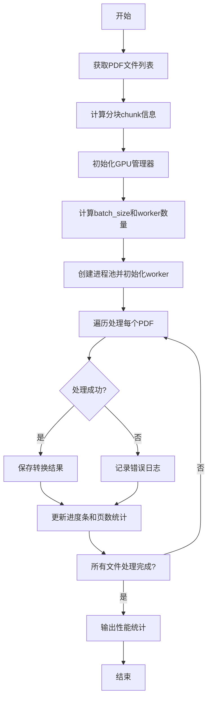

## 类结构

```
全局函数
├── worker_init (worker进程初始化)
├── worker_exit (worker进程退出清理)
├── process_single_pdf (单PDF处理)
└── convert_cli (CLI主命令)
外部依赖类
├── ConfigParser (配置解析器)
├── GPUManager (GPU管理)
└── create_model_dict (模型创建)
```

## 全局变量及字段


### `model_refs`
    
全局模型引用字典，存储worker进程中加载的模型对象

类型：`dict`
    


### `logger`
    
日志记录器实例，用于记录程序运行日志

类型：`logging.Logger`
    


### `total_pages`
    
转换总页数统计，记录所有PDF转换的页面总数

类型：`int`
    


### `cli_options`
    
CLI选项配置字典，包含转换过程中的各种配置参数

类型：`dict`
    


### `batch_sizes`
    
批处理大小配置，包含模型推理的批处理参数

类型：`dict`
    


### `workers`
    
工作进程数量，指定并行处理PDF的进程数

类型：`int`
    


### `total_processes`
    
实际进程数，基于文件数量和worker数计算的实际并行进程数

类型：`int`
    


    

## 全局函数及方法


### `worker_init`

该函数是 Multiprocessing Worker 进程的初始化函数，在每个 Worker 进程启动时由 `mp.Pool` 的 `initializer` 参数调用，负责加载深度学习模型到 Worker 进程的内存中，并注册进程退出时的资源清理回调，以确保模型资源得到正确释放。

参数：无

返回值：`None`，无返回值（隐式返回 None）

#### 流程图

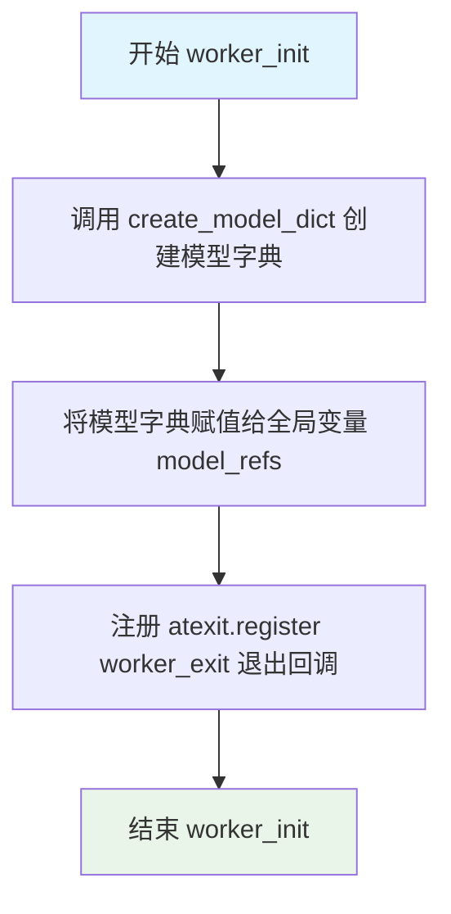

#### 带注释源码

```python
def worker_init():
    """
    Worker 进程初始化函数
    在 Multiprocessing Pool 中的每个 Worker 进程启动时调用一次
    用于加载模型和注册资源清理回调
    """
    # 调用 create_model_dict() 创建模型字典
    # 该函数会加载 Transformer 模型、OCR 模型等深度学习模型
    model_dict = create_model_dict()

    # 将模型字典声明为全局变量，使其在整个 Worker 进程生命周期内可访问
    global model_refs
    model_refs = model_dict

    # 注册 worker_exit 函数在进程退出时自动调用
    # 确保 Worker 进程结束时能够正确释放模型资源，防止内存泄漏
    atexit.register(worker_exit)
```


### `worker_exit`

worker进程退出时清理模型引用的全局清理函数，负责删除全局变量 `model_refs` 以释放内存资源。

参数： 无

返回值：`None`，无返回值描述（Python 中默认返回 None）

#### 流程图

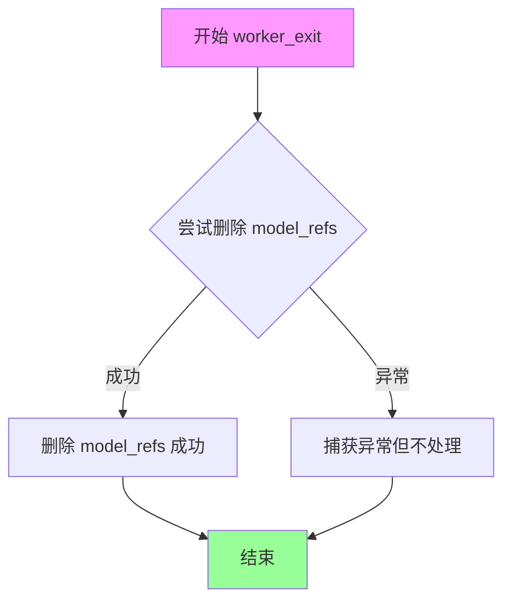

#### 带注释源码

```python
def worker_exit():
    """
    Worker进程退出时的清理函数。
    当worker进程结束时，调用此函数删除全局model_refs以释放内存。
    """
    global model_refs  # 声明使用全局变量 model_refs
    try:
        del model_refs  # 尝试删除全局模型引用，释放内存资源
    except Exception:
        pass  # 静默忽略任何异常（如变量不存在等情况）
```

---

#### 补充说明

| 项目 | 说明 |
|------|------|
| **设计目标** | 在多进程 worker 退出时正确清理模型引用，避免内存泄漏 |
| **错误处理** | 使用 try-except 静默捕获异常，确保即使删除失败也不影响进程退出 |
| **调用方** | 通过 `atexit.register(worker_exit)` 在 `worker_init()` 中注册，进程退出时自动调用 |
| **依赖项** | 依赖全局变量 `model_refs`，该变量在 `worker_init()` 中通过 `create_model_dict()` 初始化 |
| **潜在优化空间** | 目前实现较为简单，可考虑在删除后调用 `gc.collect()` 强制垃圾回收以加速内存释放 |


### `process_single_pdf`

该函数是PDF转换流程的核心处理单元，负责在单个worker进程中执行单个PDF文件的完整转换流程，包括配置解析、转换器初始化、PDF渲染、结果保存和资源清理。

参数：

- `args`：`tuple`，包含两个元素——`fpath`（str，PDF文件路径）和 `cli_options`（dict，CLI配置选项）

返回值：`int`，返回处理的页数（page_count）

#### 流程图

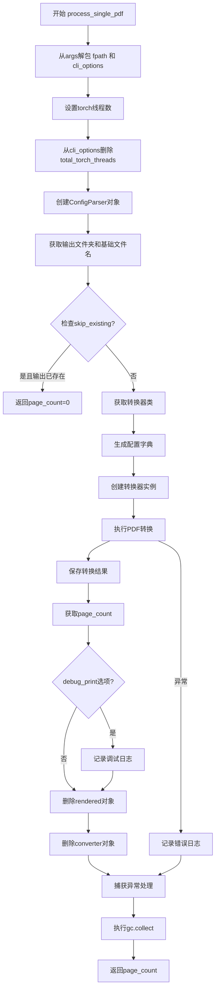

#### 带注释源码

```python
def process_single_pdf(args):
    """
    处理单个PDF文件的完整转换流程
    
    参数:
        args: 包含(fpath, cli_options)的元组
            - fpath: PDF文件的完整路径
            - cli_options: 包含转换配置的字典
    
    返回:
        int: 成功转换的页数，失败或跳过时返回0
    """
    page_count = 0  # 初始化页数计数器
    fpath, cli_options = args  # 从参数元组中解包文件路径和配置选项
    
    # 设置PyTorch线程数以优化性能，避免线程竞争
    torch.set_num_threads(cli_options["total_torch_threads"])
    del cli_options["total_torch_threads"]  # 从配置中删除，避免传递给孩子进程

    # 创建配置解析器，处理CLI选项和配置
    config_parser = ConfigParser(cli_options)

    # 获取输出文件夹路径
    out_folder = config_parser.get_output_folder(fpath)
    # 获取输出文件的基础名称（不含扩展名）
    base_name = config_parser.get_base_filename(fpath)
    
    # 检查是否跳过已存在的输出文件
    if cli_options.get("skip_existing") and output_exists(out_folder, base_name):
        return page_count  # 返回0页，表示未处理

    # 获取PDF转换器类
    converter_cls = config_parser.get_converter_cls()
    # 生成转换器配置字典
    config_dict = config_parser.generate_config_dict()
    # 禁用tqdm进度条（子进程中不需要）
    config_dict["disable_tqdm"] = True

    try:
        # 调试模式下记录日志
        if cli_options.get("debug_print"):
            logger.debug(f"Converting {fpath}")
        
        # 创建PDF转换器实例，注入依赖
        converter = converter_cls(
            config=config_dict,
            artifact_dict=model_refs,  # 模型引用（全局变量）
            processor_list=config_parser.get_processors(),
            renderer=config_parser.get_renderer(),
            llm_service=config_parser.get_llm_service(),
        )
        
        # 执行PDF到输出格式的转换
        rendered = converter(fpath)
        
        # 重新获取输出文件夹（可能因转换过程更新）
        out_folder = config_parser.get_output_folder(fpath)
        # 保存转换后的输出
        save_output(rendered, out_folder, base_name)
        
        # 记录转换的页数
        page_count = converter.page_count

        # 调试模式下记录完成日志
        if cli_options.get("debug_print"):
            logger.debug(f"Converted {fpath}")
        
        # 释放内存：删除渲染结果和转换器对象
        del rendered
        del converter
        
    except Exception as e:
        # 捕获转换过程中的异常并记录错误
        logger.error(f"Error converting {fpath}: {e}")
        traceback.print_exc()
    finally:
        # 强制垃圾回收，释放资源
        gc.collect()

    return page_count
```

---

### 文件整体运行流程

该文件是Marker PDF转换工具的CLI入口模块，提供了完整的PDF批量转换功能。

**整体流程：**


---

### 潜在的技术债务与优化空间

1. **异常处理不完整**：虽然捕获了异常并记录日志，但未对不同类型的异常进行区分处理，可能导致某些可恢复的错误被忽略

2. **资源清理依赖gc**：显式调用`gc.collect()`表明可能存在循环引用问题，建议使用上下文管理器或try-finally确保资源释放

3. **硬编码的线程数**：线程数设置为2是硬编码值，未根据实际CPU核心数动态调整

4. **配置传递冗余**：`cli_options`在传递前被修改（删除`total_torch_threads`），这种副作用可能导致难以追踪的bug

5. **缺乏重试机制**：转换失败时直接返回0页，没有重试逻辑，可能导致部分损坏的PDF无法处理

6. **模型缓存策略**：使用全局变量`model_refs`存储模型引用，在多进程环境下可能导致内存泄漏风险


### `convert_cli`

该函数是 Marker 项目的 Click CLI 主命令入口，负责处理命令行参数、协调多进程 PDF 转换流程、管理 GPU 资源分配，并输出转换统计信息。

参数：

- `in_folder`：`str`，输入文件夹路径，包含待转换的 PDF 文件
- `chunk_idx`：`int`，分块索引，用于并行处理时分批处理第几个分块（默认 0）
- `num_chunks`：`int`，分块总数，指定将文件分成多少个并行批次处理（默认 1）
- `max_files`：`int`，最大转换文件数量限制，设为 None 时不限制（默认 None）
- `skip_existing`：`bool`，是否跳过已转换过的文件，避免重复转换（默认 False）
- `debug_print`：`bool`，是否输出调试信息，便于排查问题（默认 False）
- `max_tasks_per_worker`：`int`，每个工作进程在回收前处理的最大任务数，防止内存泄漏（默认 10）
- `workers`：`int`，工作进程数量，设为 None 时自动计算（默认 None）
- `**kwargs`：其他配置选项，由 ConfigParser.common_options 提供（如 output_dir、batch_sizes 等）

返回值：`int`，该函数没有显式 return 语句，但通过 `print` 输出转换统计信息（总页数、耗时、吞吐量）

#### 流程图

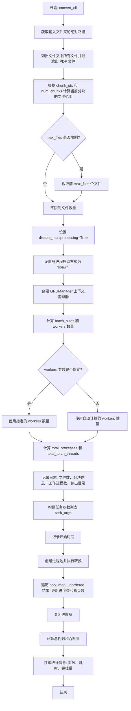

#### 带注释源码

```python
@click.command(cls=CustomClickPrinter)
@click.argument("in_folder", type=str)
@click.option("--chunk_idx", type=int, default=0, help="Chunk index to convert")
@click.option(
    "--num_chunks",
    type=int,
    default=1,
    help="Number of chunks being processed in parallel",
)
@click.option(
    "--max_files", type=int, default=None, help="Maximum number of pdfs to convert"
)
@click.option(
    "--skip_existing",
    is_flag=True,
    default=False,
    help="Skip existing converted files.",
)
@click.option(
    "--debug_print", is_flag=True, default=False, help="Print debug information."
)
@click.option(
    "--max_tasks_per_worker",
    type=int,
    default=10,
    help="Maximum number of tasks per worker process before recycling.",
)
@click.option(
    "--workers",
    type=int,
    default=None,
    help="Number of worker processes to use.  Set automatically by default, but can be overridden.",
)
@ConfigParser.common_options  # 装饰器: 注入输出目录、批大小等通用配置选项
def convert_cli(in_folder: str, **kwargs):
    """
    Marker CLI 主命令入口函数
    负责协调多进程 PDF 转换流程、管理 GPU 资源、汇总转换结果
    """
    total_pages = 0  # 累计转换的总页数
    
    # 1. 获取输入文件夹的绝对路径,确保路径解析正确
    in_folder = os.path.abspath(in_folder)
    
    # 2. 列出文件夹中所有文件并过滤出实际文件(排除目录)
    files = [os.path.join(in_folder, f) for f in os.listdir(in_folder)]
    files = [f for f in files if os.path.isfile(f)]

    # 3. 处理分块逻辑:根据 chunk_idx 和 num_chunks 计算当前批次应处理的文件范围
    # 确保所有文件都被分配到某个 chunk 中
    chunk_size = math.ceil(len(files) / kwargs["num_chunks"])
    start_idx = kwargs["chunk_idx"] * chunk_size
    end_idx = start_idx + chunk_size
    files_to_convert = files[start_idx:end_idx]

    # 4. 如果设置了最大文件数限制,则截取前 max_files 个文件
    if kwargs["max_files"]:
        files_to_convert = files_to_convert[: kwargs["max_files"]]

    # 5. 禁用嵌套多进程,避免多进程冲突
    kwargs["disable_multiprocessing"] = True

    # 6. 设置多进程启动方式为 'spawn'
    # 'spawn' 是 CUDA 所需的启动方式,'forkserver' 不支持 CUDA
    try:
        mp.set_start_method("spawn")  # Required for CUDA, forkserver doesn't work
    except RuntimeError:
        raise RuntimeError(
            "Set start method to spawn twice. This may be a temporary issue with the script. Please try running it again."
        )

    chunk_idx = kwargs["chunk_idx"]  # 当前分块索引

    # 7. 使用 GPUManager 上下文管理器进行自动 GPU 设置和清理
    # 根据 chunk_idx 选择对应的 GPU 设备
    with GPUManager(chunk_idx) as gpu_manager:
        # 8. 根据 GPU 能力和配置的 worker 数量计算最优批大小和工作进程数
        batch_sizes, workers = get_batch_sizes_worker_counts(gpu_manager, 7)

        # 9. 如果用户指定了 workers 数量,则覆盖自动计算的值
        if kwargs["workers"] is not None:
            workers = kwargs["workers"]

        # 10. 计算实际工作进程数:至少1个,最多为文件数或workers数中的较小值
        total_processes = max(1, min(len(files_to_convert), workers))
        
        # 11. 根据工作进程数分配 PyTorch 线程数
        # 确保每个进程至少有2个线程
        kwargs["total_torch_threads"] = max(
            2, psutil.cpu_count(logical=False) // total_processes
        )
        
        # 12. 将批大小配置更新到 kwargs 中,传递给工作进程
        kwargs.update(batch_sizes)

        # 13. 记录转换任务日志信息
        logger.info(
            f"Converting {len(files_to_convert)} pdfs in chunk {kwargs['chunk_idx'] + 1}/{kwargs['num_chunks']} with {total_processes} processes and saving to {kwargs['output_dir']}"
        )
        
        # 14. 构建任务参数列表:每个元素为(文件路径, 配置选项)的元组
        task_args = [(f, kwargs) for f in files_to_convert]

        start_time = time.time()  # 记录转换开始时间
        
        # 15. 创建进程池,使用 worker_init 初始化函数设置模型
        # maxtasksperchild 参数确保工作进程定期回收,防止内存泄漏
        with mp.Pool(
            processes=total_processes,
            initializer=worker_init,
            maxtasksperchild=kwargs["max_tasks_per_worker"],
        ) as pool:
            # 16. 创建进度条
            pbar = tqdm(total=len(task_args), desc="Processing PDFs", unit="pdf")
            
            # 17. 使用 imap_unordered 并行处理文件,无序返回结果
            for page_count in pool.imap_unordered(process_single_pdf, task_args):
                pbar.update(1)  # 更新进度条
                total_pages += page_count  # 累加页数
            pbar.close()

        # 18. 计算总耗时和吞吐量
        total_time = time.time() - start_time
        
        # 19. 打印转换统计信息
        print(
            f"Inferenced {total_pages} pages in {total_time:.2f} seconds, for a throughput of {total_pages / total_time:.2f} pages/sec for chunk {chunk_idx + 1}/{kwargs['num_chunks']}"
        )
```


### `get_batch_sizes_worker_counts`

获取批处理大小和工作进程数。该函数根据 GPU 管理器和给定的配置参数，计算并返回最优的批处理大小配置以及并行工作进程的数量。

参数：

- `gpu_manager`：`GPUManager`，用于管理 GPU 资源和获取 GPU 信息的上下文管理器
- `config_value`：`int`，配置参数（代码中传入 `7`），可能表示默认的批处理大小或优先级配置

返回值：`(dict, int)`，返回一个元组，其中第一个元素是包含批处理大小配置的字典，第二个元素是计算出的工作进程数

#### 流程图

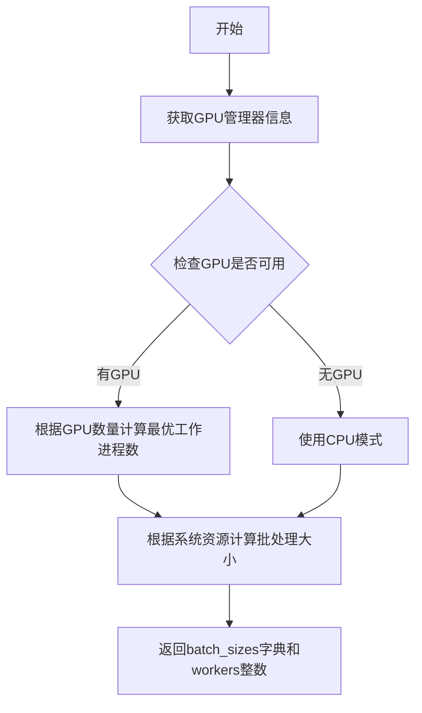

#### 带注释源码

```python
# 从 marker.utils.batch 模块导入的函数
# 该函数用于根据系统资源动态计算最优的批处理大小和工作进程数

# 调用示例（在 convert_cli 函数中）:
batch_sizes, workers = get_batch_sizes_worker_counts(gpu_manager, 7)

# 参数说明:
# - gpu_manager: GPUManager 上下文管理器，提供 GPU 数量和配置信息
# - 7: 整数值，可能表示默认优先级或基准配置

# 返回值:
# - batch_sizes: dict，包含 'batch_size' 或其他批处理相关配置项
# - workers: int，根据 GPU 数量和系统资源计算出的最优工作进程数
```


### `output_exists`

检查指定的输出文件夹中是否已存在对应的输出文件，用于判断是否需要跳过已转换的文件。

参数：

- `out_folder`：`str`，输出文件夹的路径，由 `ConfigParser.get_output_folder(fpath)` 返回
- `base_name`：`str`，输出文件的基础文件名（不含扩展名），由 `ConfigParser.get_base_filename(fpath)` 返回

返回值：`bool`，如果输出文件已存在返回 `True`，否则返回 `False`

#### 流程图

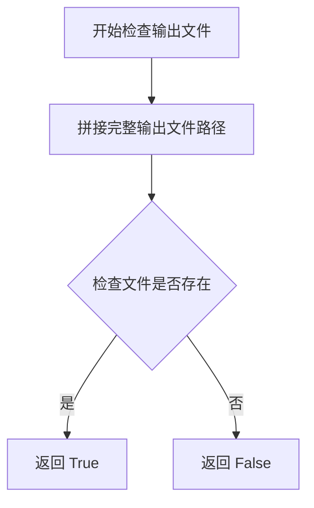

#### 带注释源码

```python
# 该函数定义位于 marker.output 模块中，此处展示调用方式
# from marker.output import output_exists, save_output

# 在 process_single_pdf 函数中的使用:
if cli_options.get("skip_existing") and output_exists(out_folder, base_name):
    return page_count  # 如果输出文件已存在，则跳过转换直接返回
```

> **注意**：该函数是从外部模块 `marker.output` 导入的，其具体实现在当前代码片段中不可见。根据函数名和调用方式推断，它接收输出文件夹路径和基础文件名作为参数，通过拼接完整文件路径并使用文件系统检查（如 `os.path.exists`）来判断输出文件是否已存在。返回布尔值以决定是否跳过转换流程。


### `save_output`

该函数用于将PDF转换后的渲染结果保存到指定的输出文件夹中，是将内存中的转换数据持久化到磁盘的关键操作。

参数：

- `rendered`：任意类型，表示转换器输出的渲染结果对象
- `out_folder`：`str`，输出文件夹的绝对路径
- `base_name`：`str`，用于命名输出文件的基本文件名（不含扩展名）

返回值：`None`，该函数无返回值，直接将结果写入磁盘

#### 流程图

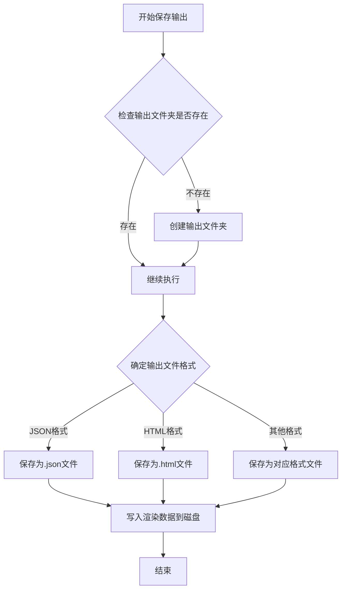

#### 带注释源码

```python
# 从marker.output模块导入的save_output函数
# 此函数在convert_cli的process_single_pdf工作函数中被调用
# 调用示例：save_output(rendered, out_folder, base_name)

# 参数说明：
# - rendered: converter(fpath)返回的渲染对象，包含转换后的页面数据
# - out_folder: 通过config_parser.get_output_folder(fpath)获取的输出目录路径
# - base_name: 通过config_parser.get_base_filename(fpath)获取的基本文件名

# 函数主要功能：
# 1. 接收转换后的渲染结果 rendered
# 2. 使用输出文件夹路径 out_folder 和基本文件名 base_name
# 3. 将渲染数据序列化并保存到磁盘的指定位置
# 4. 支持多种输出格式（如JSON、HTML等）

# 该函数被调用的上下文：
# 在process_single_pdf函数中，成功转换PDF后调用
# save_output(rendered, out_folder, base_name)
# page_count = converter.page_count  # 获取转换的页数
```


### `create_model_dict`

该函数用于创建并返回一个包含模型工件的字典，这些模型工件在 PDF 转换过程中被使用。该函数在 worker 进程初始化时被调用，以加载所需的深度学习模型（如 OCR 模型、布局分析模型等）到内存中，供后续 PDF 处理使用。

参数： 无

返回值：`Dict`，返回包含所有模型工件的字典，这些模型工件随后被存储在全局变量 `model_refs` 中供转换器使用。

#### 流程图

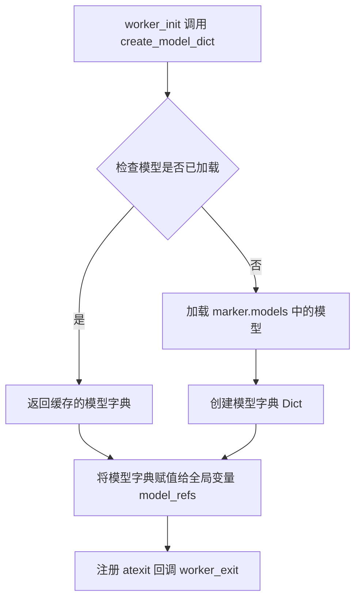

#### 带注释源码

```python
# 该函数定义在 marker.models 模块中，此处为导入后的使用示例
# 实际源码不在当前文件中

from marker.models import create_model_dict  # 从 marker.models 模块导入

def worker_init():
    """
    Worker 进程初始化函数
    在每个 worker 进程启动时调用一次
    """
    # 调用 create_model_dict 创建模型字典
    # 返回包含所有预加载模型的字典
    model_dict = create_model_dict()

    # 将模型字典存储为全局变量，供后续 process_single_pdf 使用
    global model_refs
    model_refs = model_dict

    # 注册退出回调，确保进程结束时清理模型引用
    atexit.register(worker_exit)
```

---

**注意**：该函数的实际实现位于 `marker.models` 模块中，当前代码文件仅导入了该函数。从使用方式来看，该函数：

1. **无参数输入** - 调用时不需要任何参数
2. **返回模型字典** - 字典内容应包含用于 PDF 转换的模型工件（如 OCR 模型、布局模型等）
3. **在 worker 生命周期内保持有效** - 通过 `atexit` 注册清理机制


### `GPUManager`

GPU上下文管理器，用于自动设置和清理GPU资源，支持多Chunk并行处理时的GPU分配。

参数：

- `chunk_idx`：`int`，当前处理的Chunk索引，用于确定使用哪个GPU设备

返回值：`GPUManager`实例，作为上下文管理器使用

#### 流程图

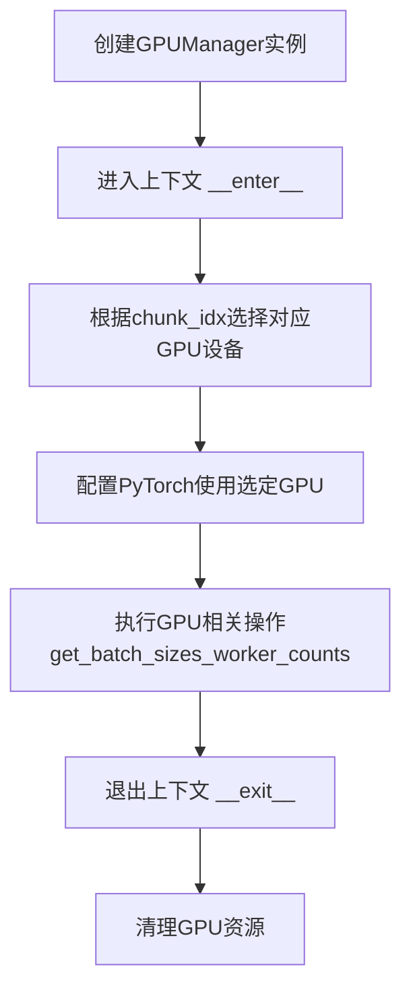

#### 带注释源码

```python
# 根据代码中的使用方式推断的GPUManager实现
class GPUManager:
    """
    GPU上下文管理器，用于自动设置和清理GPU资源
    
    使用方式:
        with GPUManager(chunk_idx) as gpu_manager:
            batch_sizes, workers = get_batch_sizes_worker_counts(gpu_manager, 7)
    """
    
    def __init__(self, chunk_idx: int):
        """
        初始化GPU管理器
        
        参数:
            chunk_idx: int - 当前处理的Chunk索引，用于确定使用哪个GPU设备
        """
        self.chunk_idx = chunk_idx
        self.device = None
        
    def __enter__(self):
        """
        进入上下文管理器，设置GPU设备
        
        返回:
            GPUManager实例，包含设备信息
        """
        # 根据chunk_idx选择GPU设备
        # chunk_idx为0使用cuda:0，chunk_idx为1使用cuda:1，以此类推
        if torch.cuda.is_available():
            self.device = torch.device(f"cuda:{self.chunk_idx % torch.cuda.device_count()}")
            torch.cuda.set_device(self.device)
        else:
            # 如果没有GPU，使用CPU
            self.device = torch.device("cpu")
        
        return self
        
    def __exit__(self, exc_type, exc_val, exc_tb):
        """
        退出上下文管理器，清理GPU资源
        """
        if torch.cuda.is_available():
            # 同步GPU操作
            torch.cuda.synchronize(self.device)
            # 清空GPU缓存
            torch.cuda.empty_cache()
        
        return False  # 不抑制异常
```

#### 代码中的实际使用

```python
# 在convert_cli函数中使用GPUManager
chunk_idx = kwargs["chunk_idx"]

# 使用GPU上下文管理器进行自动设置/清理
with GPUManager(chunk_idx) as gpu_manager:
    batch_sizes, workers = get_batch_sizes_worker_counts(gpu_manager, 7)
    
    # 继续处理...
```

#### 关键接口交互

| 交互组件 | 描述 |
|---------|------|
| `chunk_idx` | 多进程Chunk索引，用于GPU设备分配 |
| `gpu_manager` | 上下文管理器返回的实例，传递给`get_batch_sizes_worker_counts` |
| `get_batch_sizes_worker_counts` | 根据GPU能力计算最优batch size和worker数量 |

#### 技术债务与优化空间

1. **缺少GPUManager完整定义**：当前代码只导入了GPUManager但未展示其完整实现，建议查看`marker/utils/gpu.py`获取完整源码
2. **GPU设备选择逻辑**：当前使用简单的`chunk_idx % device_count`方式，可能导致负载不均衡
3. **错误处理**：缺少CUDA初始化失败时的回退策略
4. **资源清理**：建议在`__exit__`中添加更多清理逻辑，如关闭CUDA上下文


### `worker_init`

worker_init 函数是Multiprocessing worker进程的初始化函数，负责在每个worker进程启动时创建模型字典并注册退出清理函数。

参数：
- 无参数

返回值：`None`，无返回值，仅执行初始化操作

#### 流程图

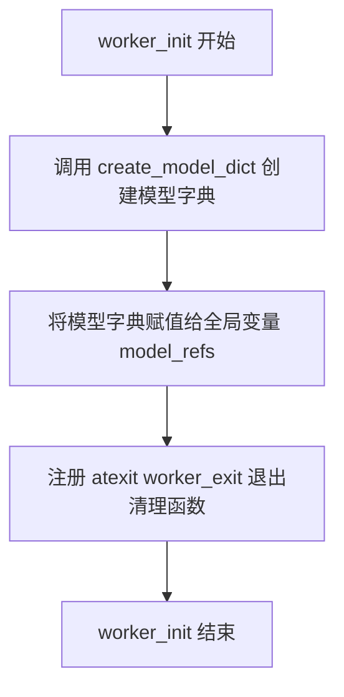

#### 带注释源码

```
def worker_init():
    # 创建模型字典，包含所有必要的模型对象
    model_dict = create_model_dict()

    # 将模型字典存储为全局变量，供后续处理使用
    global model_refs
    model_refs = model_dict

    # 注册退出时清理函数，确保进程结束时释放模型内存
    atexit.register(worker_exit)
```

---

### `worker_exit`

worker_exit 函数是进程退出时的清理函数，负责安全释放worker进程中持有的模型引用，防止内存泄漏。

参数：
- 无参数

返回值：`None`，无返回值，仅执行清理操作

#### 流程图

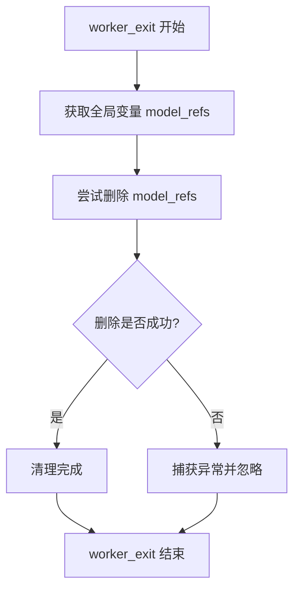

#### 带注释源码

```
def worker_exit():
    # 访问全局变量 model_refs
    global model_refs
    try:
        # 尝试删除模型引用以释放内存
        del model_refs
    except Exception:
        # 忽略删除失败的情况（如变量不存在）
        pass
```

---

### `process_single_pdf`

process_single_pdf 函数是PDF处理的核心函数，负责接收PDF文件路径和配置选项，执行PDF到markdown的转换，保存输出结果，并返回处理的页数。

参数：
- `args`：`Tuple[str, Dict]`，包含两个元素——第一个是PDF文件的完整路径 `fpath`，第二个是CLI选项字典 `cli_options`

返回值：`int`，返回处理的页数 `page_count`

#### 流程图

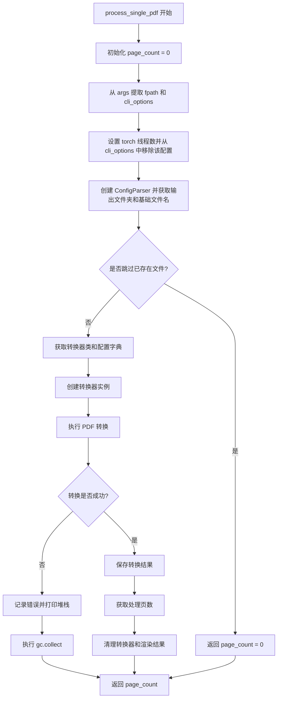

#### 带注释源码

```
def process_single_pdf(args):
    # 初始化页数计数器
    page_count = 0
    # 从参数元组中解包文件路径和CLI选项
    fpath, cli_options = args
    # 设置PyTorch线程数（从选项中提取后删除该键）
    torch.set_num_threads(cli_options["total_torch_threads"])
    del cli_options["total_torch_threads"]

    # 创建配置解析器，处理转换配置
    config_parser = ConfigParser(cli_options)

    # 获取输出文件夹和基础文件名
    out_folder = config_parser.get_output_folder(fpath)
    base_name = config_parser.get_base_filename(fpath)
    # 如果设置了跳过已存在文件且输出已存在，则直接返回
    if cli_options.get("skip_existing") and output_exists(out_folder, base_name):
        return page_count

    # 获取转换器类和生成配置字典
    converter_cls = config_parser.get_converter_cls()
    config_dict = config_parser.generate_config_dict()
    config_dict["disable_tqdm"] = True

    try:
        # 调试模式下记录转换开始
        if cli_options.get("debug_print"):
            logger.debug(f"Converting {fpath}")
        # 创建转换器实例（包含模型、处理器、渲染器等）
        converter = converter_cls(
            config=config_dict,
            artifact_dict=model_refs,
            processor_list=config_parser.get_processors(),
            renderer=config_parser.get_renderer(),
            llm_service=config_parser.get_llm_service(),
        )
        # 执行PDF转换，返回渲染结果
        rendered = converter(fpath)
        # 重新获取输出文件夹（可能被转换器修改）
        out_folder = config_parser.get_output_folder(fpath)
        # 保存转换结果到文件
        save_output(rendered, out_folder, base_name)
        # 记录处理的页数
        page_count = converter.page_count

        # 调试模式下记录转换完成
        if cli_options.get("debug_print"):
            logger.debug(f"Converted {fpath}")
        # 显式删除大对象以释放内存
        del rendered
        del converter
    except Exception as e:
        # 捕获并记录转换过程中的异常
        logger.error(f"Error converting {fpath}: {e}")
        traceback.print_exc()
    finally:
        # 强制垃圾回收，释放内存
        gc.collect()

    # 返回处理的页数
    return page_count
```

---

### `convert_cli`

convert_cli 是主CLI命令函数，负责协调整个PDF批量转换流程，包括文件分片、进程池管理、GPU资源分配、任务分发和进度跟踪。

参数：
- `in_folder`：`str`，输入文件夹路径，包含待转换的PDF文件
- `**kwargs`：`Dict`，包含以下可选参数：
  - `chunk_idx`：`int`，分片索引，用于并行处理
  - `num_chunks`：`int`，总分片数量
  - `max_files`：`int`，最大转换文件数
  - `skip_existing`：`bool`，是否跳过已转换的文件
  - `debug_print`：`bool`，是否打印调试信息
  - `max_tasks_per_worker`：`int`，每个worker最大任务数
  - `workers`：`int`，worker进程数量

返回值：`None`，无返回值（Click命令会自动处理输出）

#### 流程图

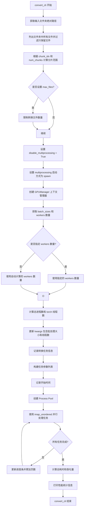

#### 带注释源码

```
@click.command(cls=CustomClickPrinter)
@click.argument("in_folder", type=str)
@click.option("--chunk_idx", type=int, default=0, help="Chunk index to convert")
@click.option(
    "--num_chunks",
    type=int,
    default=1,
    help="Number of chunks being processed in parallel",
)
@click.option(
    "--max_files", type=int, default=None, help="Maximum number of pdfs to convert"
)
@click.option(
    "--skip_existing",
    is_flag=True,
    default=False,
    help="Skip existing converted files.",
)
@click.option(
    "--debug_print", is_flag=True, default=False, help="Print debug information."
)
@click.option(
    "--max_tasks_per_worker",
    type=int,
    default=10,
    help="Maximum number of tasks per worker process before recycling.",
)
@click.option(
    "--workers",
    type=int,
    default=None,
    help="Number of worker processes to use.  Set automatically by default, but can be overridden.",
)
@ConfigParser.common_options
def convert_cli(in_folder: str, **kwargs):
    # 初始化总页数计数器
    total_pages = 0
    # 将输入文件夹路径转换为绝对路径
    in_folder = os.path.abspath(in_folder)
    # 列出文件夹中所有文件
    files = [os.path.join(in_folder, f) for f in os.listdir(in_folder)]
    # 过滤只保留文件（排除文件夹）
    files = [f for f in files if os.path.isfile(f)]

    # 处理分片逻辑：将文件列表分成多个块供并行处理
    # 计算每个分片的大小
    chunk_size = math.ceil(len(files) / kwargs["num_chunks"])
    # 计算当前分片的起始和结束索引
    start_idx = kwargs["chunk_idx"] * chunk_size
    end_idx = start_idx + chunk_size
    # 提取当前分片需要处理的文件
    files_to_convert = files[start_idx:end_idx]

    # 如果设置了最大文件数限制，则进一步截断文件列表
    if kwargs["max_files"]:
        files_to_convert = files_to_convert[: kwargs["max_files"]]

    # 禁用嵌套多进程处理
    kwargs["disable_multiprocessing"] = True

    try:
        # 设置多进程启动方式为 spawn（必需用于CUDA，forkserver不兼容）
        mp.set_start_method("spawn")
    except RuntimeError:
        # 如果已经设置过启动方式，抛出错误（可能是临时性问题，建议重试）
        raise RuntimeError(
            "Set start method to spawn twice. This may be a temporary issue with the script. Please try running it again."
        )

    # 获取当前分片索引
    chunk_idx = kwargs["chunk_idx"]

    # 使用GPU上下文管理器进行自动设置和清理
    with GPUManager(chunk_idx) as gpu_manager:
        # 获取批处理大小和worker数量
        batch_sizes, workers = get_batch_sizes_worker_counts(gpu_manager, 7)

        # 如果用户指定了worker数量，则覆盖自动计算的值
        if kwargs["workers"] is not None:
            workers = kwargs["workers"]

        # 计算总进程数（至少1个，最多不超过文件数和worker数的较小值）
        total_processes = max(1, min(len(files_to_convert), workers))
        # 计算每个进程的PyTorch线程数（基于CPU核心数）
        kwargs["total_torch_threads"] = max(
            2, psutil.cpu_count(logical=False) // total_processes
        )
        # 将批处理大小更新到kwargs中
        kwargs.update(batch_sizes)

        # 记录转换任务信息到日志
        logger.info(
            f"Converting {len(files_to_convert)} pdfs in chunk {kwargs['chunk_idx'] + 1}/{kwargs['num_chunks']} with {total_processes} processes and saving to {kwargs['output_dir']}"
        )
        # 构建任务参数列表，每个元素是(文件路径, 选项字典)的元组
        task_args = [(f, kwargs) for f in files_to_convert]

        # 记录开始时间用于性能计算
        start_time = time.time()
        # 创建进程池并执行任务
        with mp.Pool(
            processes=total_processes,
            initializer=worker_init,
            maxtasksperchild=kwargs["max_tasks_per_worker"],
        ) as pool:
            # 创建进度条
            pbar = tqdm(total=len(task_args), desc="Processing PDFs", unit="pdf")
            # 使用imap_unordered进行无序并行处理，提高效率
            for page_count in pool.imap_unordered(process_single_pdf, task_args):
                pbar.update(1)  # 更新进度条
                total_pages += page_count  # 累加处理的总页数
            pbar.close()  # 关闭进度条

        # 计算总耗时
        total_time = time.time() - start_time
        # 打印性能统计信息
        print(
            f"Inferenced {total_pages} pages in {total_time:.2f} seconds, for a throughput of {total_pages / total_time:.2f} pages/sec for chunk {chunk_idx + 1}/{kwargs['num_chunks']}"
        )
```

---

## 全局变量和全局函数

### 全局变量

| 名称 | 类型 | 描述 |
|------|------|------|
| `logger` | `logging.Logger` | 全局日志记录器，用于输出转换过程中的日志信息 |
| `model_refs` | `Dict` | 全局模型引用字典，在worker进程初始化时创建并存储模型对象 |

### 导入的外部模块/函数

| 名称 | 来源 | 描述 |
|------|------|------|
| `create_model_dict` | `marker.models` | 创建模型字典的工厂函数 |
| `ConfigParser` | `marker.config.parser` | 配置解析器类，用于处理CLI选项和生成配置 |
| `CustomClickPrinter` | `marker.config.printer` | 自定义Click命令打印器 |
| `configure_logging` | `marker.logger` | 配置日志系统 |
| `get_logger` | `marker.logger` | 获取日志记录器 |
| `create_model_dict` | `marker.models` | 创建模型字典 |
| `output_exists` | `marker.output` | 检查输出文件是否已存在 |
| `save_output` | `marker.output` | 保存转换输出 |
| `GPUManager` | `marker.utils.gpu` | GPU资源管理器 |
| `get_batch_sizes_worker_counts` | `marker.utils.batch` | 计算批处理大小和worker数量 |

---

## 关键组件信息

| 组件名称 | 描述 |
|----------|------|
| **Multiprocessing Pool** | 使用进程池实现并行PDF转换，通过worker_init初始化每个worker进程 |
| **GPUManager** | 上下文管理器，自动管理GPU资源分配和清理 |
| **ConfigParser** | 解析CLI选项并生成转换器所需的配置字典 |
| **Converter** | 实际执行PDF到markdown转换的核心组件 |
| **Progress Bar** | 使用tqdm显示转换进度 |

---

## 潜在的技术债务或优化空间

1. **异常处理不够精细**：process_single_pdf 中捕获了所有异常，但错误处理方式有限，可以考虑增加重试机制或更详细的错误分类

2. **内存管理**：虽然使用了 gc.collect()，但在大型PDF处理场景下，可以考虑更积极的内存释放策略（如处理完每页后释放中间结果）

3. **配置重复获取**：process_single_pdf 中多次调用 config_parser.get_output_folder(fpath)，可以优化减少重复调用

4. **缺少类型提示**：部分变量（如 cli_options 的具体结构）缺少详细的类型注解

5. **硬编码数值**：如 `get_batch_sizes_worker_counts(gpu_manager, 7)` 中的数字7缺乏明确含义，应提取为常量或配置项

6. **日志级别**：debug_print 使用 logger.debug 但通过额外的条件判断，可以统一日志级别管理

---

## 其它项目

### 设计目标与约束
- **目标**：实现高效的批量PDF到markdown转换，支持多进程并行处理和GPU加速
- **约束**：
  - 必须使用 `spawn` 启动方式（CUDA兼容性要求）
  - 每个worker处理一定任务数后需要重启（maxtasksperchild）防止内存泄漏
  - 嵌套多进程被禁用（disable_multiprocessing）

### 错误处理与异常设计
- 使用 try-except 捕获PDF转换过程中的异常
- 通过 traceback.print_exc() 输出详细错误堆栈
- 使用 logger.error 记录错误信息
- GPUManager 作为上下文管理器确保资源清理

### 数据流与状态机
1. 主进程读取输入文件夹 → 2. 计算分片 → 3. 创建进程池 → 4. 分发任务到worker → 5. 每个worker初始化模型 → 6. 处理PDF → 7. 保存结果 → 8. 汇总页数统计

### 外部依赖与接口契约
- **Click框架**：CLI接口定义
- **PyTorch Multiprocessing**：进程池管理
- **psutil**：CPU核心数检测
- **tqdm**：进度条显示
- **marker模块**：配置解析、模型管理、输出保存等核心功能


## 关键组件


### 环境变量配置模块

设置MKL、OpenMP、OpenBLAS等库的线程数以避免多进程竞争，并配置GRPC和GLOG的日志级别，以及PyTorch MPS回退选项

### worker_init 函数

初始化工作进程，创建模型字典并注册退出清理函数，管理全局模型引用

### worker_exit 函数

清理工作进程中的模型引用，在进程退出时调用以释放资源

### process_single_pdf 函数

处理单个PDF文件的转换，包括配置解析、模型加载、转换执行和结果保存，支持错误处理和资源清理

### convert_cli 命令行接口

主管道函数，负责文件列表获取、分块处理、多进程池创建、GPU管理和进度跟踪，协调整个PDF批量转换流程

### GPUManager 上下文管理器

自动管理GPU设备设置和清理，根据chunk_idx分配GPU资源

### ConfigParser 配置解析器

解析命令行选项和配置文件，生成转换器配置字典，处理输出路径和文件命名

### 多进程池管理模块

使用spawn模式创建进程池，通过maxtasksperchild限制每个worker处理的任务数，实现进程回收和资源隔离

### 批处理大小计算模块

根据GPU资源动态计算批处理大小和worker进程数，优化并行处理效率

### 错误处理与日志模块

捕获转换异常、记录错误日志和堆栈跟踪，确保单个文件错误不影响整体批处理流程

### 文件分块处理模块

支持将大量文件分成多个chunk并行处理，实现分布式转换能力

### 性能监控模块

跟踪处理文件数、总页数、耗时和吞吐量，输出性能统计信息


## 问题及建议


### 已知问题

1. **环境变量设置时机问题**：环境变量（`OMP_NUM_THREADS`、`MKL_DYNAMIC`等）在导入torch之前设置，但如果torch已在其他模块中预导入，这些设置将不会生效，导致多进程环境下的线程竞争问题
2. **全局变量model_refs的线程安全问题**：使用全局变量存储模型引用，在多进程fork模式下可能导致模型状态不一致或内存泄漏
3. **文件过滤不精确**：`os.listdir`获取所有文件但未过滤PDF扩展名，可能尝试处理非PDF文件导致转换失败
4. **异常捕获过于宽泛**：`except Exception`捕获所有异常并仅记录日志，可能隐藏关键错误信息导致调试困难
5. **GPU资源分配不透明**：使用`GPUManager`但代码中未展示其实现细节，无法确认多进程下的GPU分配策略是否合理
6. **模型重复初始化**：每个worker进程在`worker_init`中都调用`create_model_dict()`创建完整模型字典，大型模型会导致显著的内存开销和启动延迟
7. **临时配置参数传递不规范**：`total_torch_threads`通过从`cli_options`中删除后传递，这种副作用式的数据修改容易引入bugs
8. **缺乏PDF文件有效性验证**：未在处理前验证PDF文件是否损坏或格式正确，损坏的PDF会导致转换失败
9. **多进程启动方法硬编码**：`mp.set_start_method("spawn")`在可能已设置的情况下会抛出异常，错误信息不够友好
10. **资源清理不确定性**：`atexit.register(worker_exit)`在多进程环境下的执行时机不确定，可能导致模型资源未正确释放

### 优化建议

1. **环境变量统一管理**：创建专门的配置模块，在项目入口处尽早设置所有环境变量，并添加验证逻辑确保设置生效
2. **引入进程安全的模型缓存机制**：使用`torch.multiprocessing`提供的共享内存或`Manager`来安全地共享模型状态
3. **添加文件类型过滤**：在文件列表生成时添加`f.lower().endswith(('.pdf', '.PDF'))`过滤
4. **细化异常处理**：根据异常类型进行分类处理，对可恢复错误（如单个PDF失败）和致命错误采取不同策略
5. **文档化GPU管理策略**：确保`GPUManager`的实现细节有完整文档，说明其多进程GPU分配逻辑
6. **实现模型预加载和复用**：考虑使用worker进程池的初始化来预加载模型，而不是每次处理PDF时都重新创建
7. **参数传递使用不可变方式**：使用`kwargs.copy()`或专门的参数对象，避免对原始参数的修改
8. **添加PDF文件预验证**：在处理前使用`PyPDF2`或`pdfplumber`验证PDF可读性
9. **改进多进程启动错误处理**：提供更友好的错误提示和重试机制
10. **实现显式的资源生命周期管理**：使用context manager或try/finally确保关键资源的确定性释放


## 其它


### 设计目标与约束

本项目旨在实现一个高性能的PDF批量转换工具，支持多进程并行处理和GPU加速。核心设计约束包括：1) 使用multiprocessing的spawn模式以支持CUDA；2) 每个worker进程有最大任务数限制（默认10），通过maxtasksperchild实现进程回收；3) 限制OpenMP和MKL线程数以避免多进程竞争；4) 支持分块并行处理以适应大规模PDF转换任务。

### 错误处理与异常设计

代码采用多层次错误处理策略：1) 在process_single_pdf函数中使用try-except捕获转换过程中的所有异常，记录错误日志并打印堆栈跟踪；2) worker_exit中使用try-except防止资源清理失败；3) 通过gc.collect()在finally块中主动触发垃圾回收以释放资源；4) convert_cli中使用RuntimeError捕获start_method设置失败的情况。当前主要依赖日志记录，缺少重试机制和用户友好的错误提示。

### 数据流与状态机

整体数据流为：1) 读取输入文件夹中的所有PDF文件；2) 根据chunk_idx和num_chunks将文件分片；3) 创建任务参数列表task_args，每个元素为(文件路径, 配置选项)元组；4) 使用mp.Pool的imap_unordered并行处理任务；5) 每个worker调用process_single_pdf执行转换；6) 主进程通过tqdm进度条收集page_count并汇总。状态转换包括：初始化→分片→任务分发→并行处理→结果收集→完成。

### 外部依赖与接口契约

主要外部依赖包括：1) marker库（ConfigParser, create_model_dict, converter等）；2) psutil用于获取CPU核心数；3) torch用于深度学习推理；4) click用于CLI；5) tqdm用于进度条；6) GPUManager用于GPU管理。关键接口契约：process_single_pdf接收(fpath, cli_options)元组，返回page_count；worker_init在每个worker启动时调用，初始化全局model_refs；convert_cli返回None，结果通过save_output保存到磁盘。

### 配置管理

配置通过ConfigParser统一管理，支持多种配置选项：1) chunk_idx和num_chunks用于分片；2) max_files限制转换文件数；3) skip_existing跳过已转换文件；4) workers指定worker数量；5) max_tasks_perworker控制进程回收；6) total_torch_threads控制PyTorch线程数；7) batch_sizes相关配置通过get_batch_sizes_worker_counts自动计算。配置通过kwargs字典在主进程和worker之间传递。

### 资源管理与优化

资源管理策略包括：1) GPU资源通过GPUManager上下文管理器自动管理；2) 内存管理：每个PDF处理完成后删除converter和rendered对象并调用gc.collect()；3) 线程限制：通过环境变量设置各线程库（OpenMP、MKL、OpenBLAS）的线程数为2；4) 进程回收：通过maxtasksperchild参数定期回收worker进程防止内存泄漏。优化建议：可考虑使用对象池减少模型加载开销，可添加内存监控预警。

### 并发模型

采用基于multiprocessing.Pool的进程级并发模型：1) 使用spawn启动方式以兼容CUDA；2) 通过initializer参数在每个worker启动时调用worker_init加载模型；3) 使用imap_unordered实现无序结果返回以提高吞吐量；4) 通过maxtasksperchild实现worker进程定期回收。当前模型为对称多进程，缺少主从架构和负载均衡优化。

### 性能考虑与瓶颈分析

性能关键点：1) 模型加载在worker_init中一次性完成，每个进程独立加载模型到GPU；2) batch_sizes根据GPU数量自动计算；3) 线程数根据CPU物理核心数和进程数动态分配。潜在瓶颈：1) 文件IO可能成为瓶颈，可考虑预加载；2) 模型在每个worker中独立加载，显存占用随worker数线性增长；3) 当前缺乏批量调度优化。可引入批次调度和模型缓存共享机制。

### 日志与监控

日志系统通过marker.logger模块配置，使用get_logger获取logger实例。日志级别包括：debug_print选项控制debug日志输出；错误信息通过logger.error记录。当前监控指标：1) 处理文件数通过tqdm进度条展示；2) 总页数统计；3) 吞吐量计算（pages/sec）。可增加：GPU利用率、内存使用、每页平均处理时间等监控指标。

### 安全考虑

安全措施有限，主要包括：1) 使用os.path.abspath规范化输入路径；2) 仅处理文件（通过os.path.isfile过滤）；3) GRPC和GLOG日志级别设置为ERROR减少敏感信息输出。缺失的安全措施：1) 输入文件类型验证不足；2) 路径遍历检查；3) 资源限制（最大文件数、最大内存）；4) 恶意PDF文件处理的安全性。建议增加文件类型白名单和资源使用上限控制。

### 测试策略建议

当前代码缺乏显式测试。测试策略应包括：1) 单元测试：测试worker_init、worker_exit、process_single_pdf等核心函数；2) 集成测试：测试完整转换流程；3) 性能测试：基准测试吞吐量；4) 边界测试：空文件夹、单文件、巨大文件、分片边界等场景；5) 错误处理测试：模拟各种异常情况。关键测试点：分片逻辑正确性、进程回收机制、资源清理完整性。

    