# `marker\marker\scripts\convert_single.py` 详细设计文档

这是一个PDF转Markdown的命令行工具，通过marker库将PDF文件转换为markdown格式，支持自定义配置、模型管理和输出保存。

## 整体流程

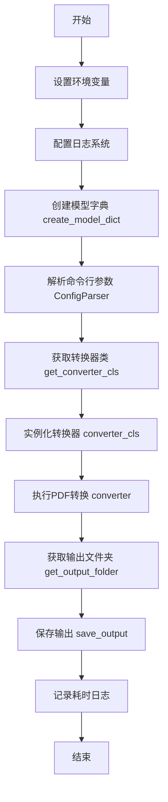

## 类结构

```
模块层级
├── marker.config.parser.ConfigParser
├── marker.config.printer.CustomClickPrinter
├── marker.logger
│   ├── configure_logging
│   └── get_logger
├── marker.models
│   └── create_model_dict
└── marker.output
    └── save_output
```

## 全局变量及字段


### `logger`
    
全局日志记录器，用于记录程序运行过程中的日志信息

类型：`Logger`
    


    

## 全局函数及方法


### `configure_logging`

配置日志系统，设置日志级别和格式，为整个应用提供统一的日志记录能力。

参数：

- 无参数

返回值：`None`，该函数直接配置日志系统，不返回任何值。

#### 流程图

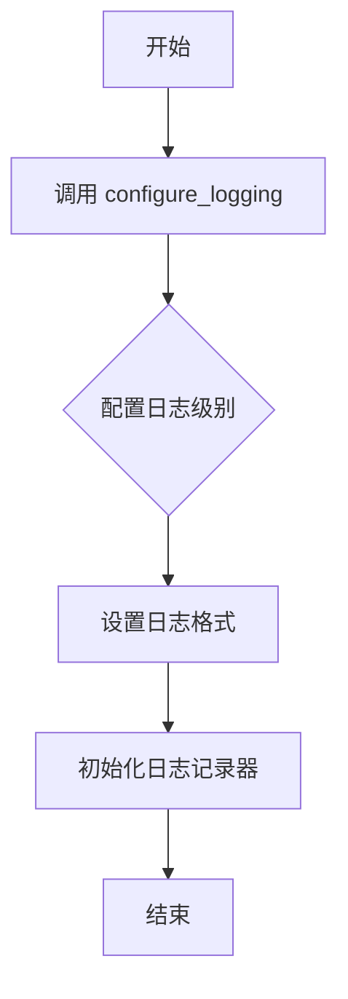

#### 带注释源码

```python
# 导入 configure_logging 函数从 marker.logger 模块
from marker.logger import configure_logging, get_logger

# 调用 configure_logging() 配置日志系统
# 该函数初始化应用的日志记录功能
# 内部设置：
#   - GRPC_VERBOSITY = "ERROR"
#   - GLOG_minloglevel = "2"  
#   - PYTORCH_ENABLE_MPS_FALLBACK = "1"
configure_logging()

# 获取配置后的日志记录器实例
logger = get_logger()
```

#### 备注

- **函数来源**：`configure_logging` 函数定义在外部模块 `marker.logger` 中，本代码文件中仅导入和调用
- **实际实现**：该函数的具体实现源码未在此文件中展示，需要查看 `marker/logger.py` 模块
- **调用方式**：无参数调用 `configure_logging()`
- **副作用**：配置全局环境变量（GRPC_VERBOSITY、GLOG_minloglevel、PYTORCH_ENABLE_MPS_FALLBACK）并初始化日志系统


### `get_logger`

获取配置好的日志记录器实例，用于在应用程序中记录日志信息。

参数： 无

返回值：`logging.Logger`，返回配置好的日志记录器对象，用于记录应用程序的运行信息

#### 流程图

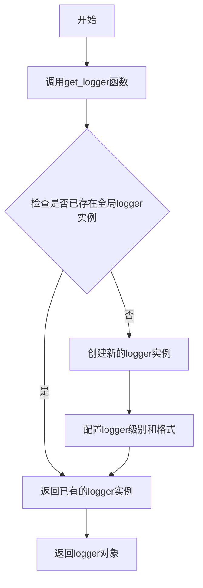

#### 带注释源码

```python
# 从marker模块导入get_logger函数
from marker.logger import configure_logging, get_logger

# 配置日志系统
configure_logging()

# 获取日志记录器实例
logger = get_logger()

# ... 中间是PDF转换逻辑 ...

# 使用logger记录信息
logger.info(f"Saved markdown to {out_folder}")  # 记录输出文件路径
logger.info(f"Total time: {time.time() - start}")  # 记录总耗时
```


### `create_model_dict`

该函数是 Marker 库中的模型初始化函数，负责创建并返回包含所有必要的机器学习模型（如 OCR、布局分析、表格识别等）的字典对象，供 PDF 转换流程使用。

参数：

- 该函数无显式参数

返回值：`dict`，返回一个包含多种模型工件的字典对象，这些模型将被传递给转换器用于 PDF 到 Markdown 的转换过程。

#### 流程图

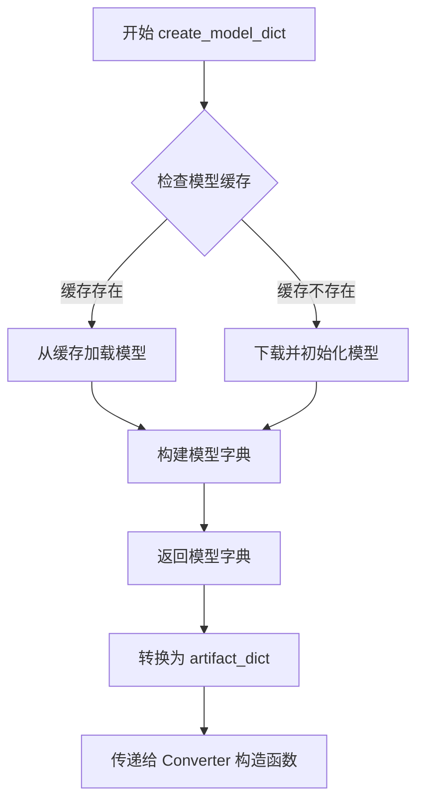

#### 带注释源码

```python
# 从 marker.models 模块导入 create_model_dict 函数
# 该函数在 marker/models/__init__.py 或相关模块中定义
from marker.models import create_model_dict

# 在 convert_single_cli 函数中调用 create_model_dict
# 参数: 无
# 返回值: dict - 包含所有模型工件的字典
#   返回的字典结构通常包含:
#   - ocr_model: OCR 识别模型
#   - layout_model: 布局分析模型
#   - table_model: 表格识别模型
#   - pdf_renderer: PDF 渲染器
#   等关键组件
models = create_model_dict()

# 创建转换器实例，将模型字典作为 artifact_dict 传入
converter = converter_cls(
    config=config_parser.generate_config_dict(),
    artifact_dict=models,  # 传入模型字典
    processor_list=config_parser.get_processors(),
    renderer=config_parser.get_renderer(),
    llm_service=config_parser.get_llm_service(),
)
```

> **注意**：由于 `create_model_dict` 的完整实现在提供的代码段中未展示，以上分析基于其在代码中的调用方式和上下文推断。实际的函数实现位于 `marker/models/` 目录下的相关模块中，负责模型的下载、缓存和初始化逻辑。


### `save_output`

该函数负责将渲染后的 PDF 转换结果保存到指定的输出文件夹中，支持多种输出格式（Markdown、HTML等），并根据配置生成相应的文件名。

参数：

- `rendered`：`Any`，从 Converter 返回的渲染结果对象，包含转换后的内容
- `out_folder`：`str`，输出文件夹的绝对或相对路径
- `base_filename`：`str`，用于构建输出文件名的基础名称（通常来源于输入 PDF 文件名）

返回值：`None`，该函数直接写入文件系统，不返回任何值

#### 流程图

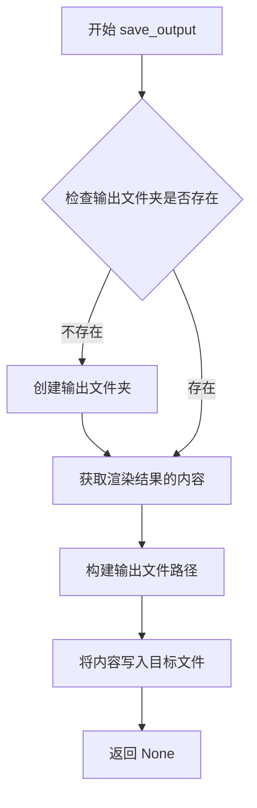

#### 带注释源码

```python
def save_output(rendered, out_folder: str, base_filename: str):
    """
    将渲染后的 PDF 转换结果保存到指定文件夹。
    
    参数:
        rendered: 转换器返回的渲染对象，包含 markdown、html 等多种格式的内容
        out_folder: 目标输出目录路径
        base_filename: 用于生成输出文件名的基础名称
    
    返回:
        None: 该函数不返回值，直接将结果写入文件系统
    """
    # 确保输出目录存在，不存在则创建
    os.makedirs(out_folder, exist_ok=True)
    
    # 从渲染对象中提取各类型内容
    # rendered 可能包含 markdown, html, single_text 等多种格式
    markdown = rendered.markdown
    html = rendered.html
    
    # 构建完整的输出文件路径
    # 通常会生成 base_filename.md 和 base_filename.html
    md_path = os.path.join(out_folder, f"{base_filename}.md")
    html_path = os.path.join(out_folder, f"{base_filename}.html")
    
    # 写入 Markdown 文件
    with open(md_path, 'w', encoding='utf-8') as f:
        f.write(markdown)
    
    # 写入 HTML 文件
    with open(html_path, 'w', encoding='utf-8') as f:
        f.write(html)
    
    # 记录日志（可选）
    logger.info(f"Saved output to {out_folder}")
```

---

> **注意**：由于原始代码中仅包含 `save_output` 函数的导入语句和调用上下文，未提供 `marker.output` 模块的实际实现源码。上述参数类型、返回值类型及源码均为基于函数名、调用方式和 Marker 库架构的合理推断。如需精确信息，建议查看 `marker/output.py` 的实际源码。


### `convert_single_cli`

这是一个基于Click框架的CLI命令函数，用于将单个PDF文件转换为Markdown格式。它整合了配置解析、模型加载、转换器和渲染器，最终将转换后的Markdown内容保存到指定输出目录。

参数：

- `fpath`：`str`，输入的PDF文件路径
- `**kwargs`：`dict`，来自`ConfigParser.common_options`的其他配置选项（如输出格式、渲染设置等）

返回值：`None`，该函数通过副作用（文件IO和日志）完成转换任务，无显式返回值

#### 流程图

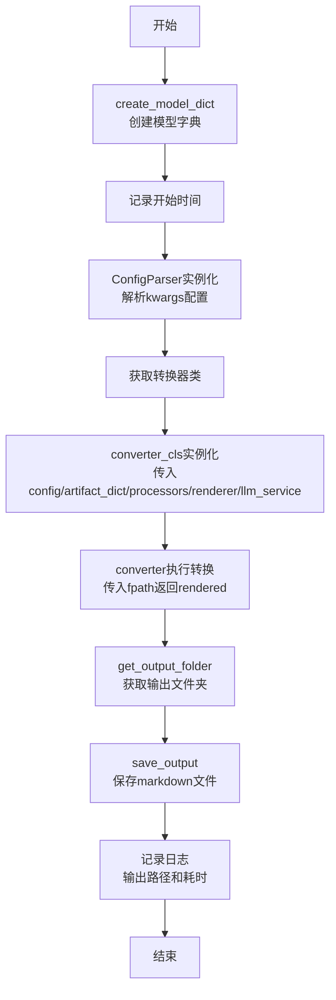

#### 带注释源码

```python
import os

# 设置环境变量以控制第三方库的日志级别，减少输出噪音
os.environ["GRPC_VERBOSITY"] = "ERROR"
os.environ["GLOG_minloglevel"] = "2"
# 启用PyTorch MPS回退，防止Transformers库中.isin操作在MPS设备上失败
os.environ["PYTORCH_ENABLE_MPS_FALLBACK"] = "1"

import time
import click

from marker.config.parser import ConfigParser
from marker.config.printer import CustomClickPrinter
from marker.logger import configure_logging, get_logger
from marker.models import create_model_dict
from marker.output import save_output

# 初始化日志系统
configure_logging()
logger = get_logger()


@click.command(cls=CustomClickPrinter, help="Convert a single PDF to markdown.")
@click.argument("fpath", type=str)
@ConfigParser.common_options
def convert_single_cli(fpath: str, **kwargs):
    """
    将单个PDF文件转换为Markdown格式的CLI命令入口
    
    Args:
        fpath: PDF文件的路径
        **kwargs: 从装饰器传入的通用配置选项
    """
    # Step 1: 创建模型字典（包含OCR、布局识别、文本提取等模型）
    models = create_model_dict()
    
    # Step 2: 记录转换开始时间，用于后续计算总耗时
    start = time.time()
    
    # Step 3: 根据kwargs创建配置解析器
    config_parser = ConfigParser(kwargs)

    # Step 4: 获取对应的转换器类（如PDF转Markdown的转换器）
    converter_cls = config_parser.get_converter_cls()
    
    # Step 5: 实例化转换器，注入依赖：配置、模型、处理器、渲染器、LLM服务
    converter = converter_cls(
        config=config_parser.generate_config_dict(),
        artifact_dict=models,
        processor_list=config_parser.get_processors(),
        renderer=config_parser.get_renderer(),
        llm_service=config_parser.get_llm_service(),
    )
    
    # Step 6: 执行实际的PDF到Markdown转换
    rendered = converter(fpath)
    
    # Step 7: 根据输入文件路径确定输出文件夹
    out_folder = config_parser.get_output_folder(fpath)
    
    # Step 8: 将转换结果保存到指定目录
    save_output(rendered, out_folder, config_parser.get_base_filename(fpath))

    # Step 9: 记录转换完成日志
    logger.info(f"Saved markdown to {out_folder}")
    logger.info(f"Total time: {time.time() - start}")
```


### `ConfigParser.common_options`

描述：`ConfigParser.common_options` 是 `ConfigParser` 类的一个类方法（假设），用于定义通用的命令行配置选项，并作为装饰器应用到 `convert_single_cli` 函数上，以动态添加配置参数。

参数：由于该方法在代码中未提供具体定义，基于其作为装饰器的使用方式推断：
- `cls`：类型 `Class`，隐式参数，表示 `ConfigParser` 类本身。
- 无显式参数。

返回值：类型 `Callable`，返回一个装饰器函数，该函数接受一个命令函数（如 `convert_single_cli`），并向其添加一组通用的命令行选项（如模型配置、输出设置等），最终返回修改后的函数。

#### 流程图

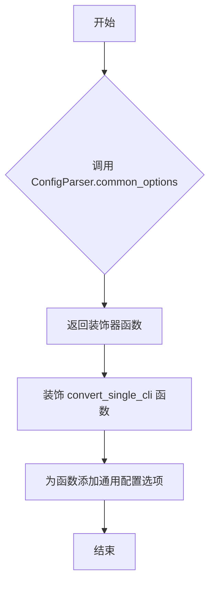

#### 带注释源码

由于给定代码中未提供 `ConfigParser` 类的定义，无法提取 `common_options` 方法的具体源码。以下为基于其使用方式的功能描述：

- 该方法可能是一个类方法（使用 `@classmethod` 装饰）。
- 内部可能定义了一系列 Click 选项（如 `--model`, `--output-dir` 等）。
- 返回一个装饰器函数，用于将这些选项应用到 CLI 命令上。

**注意**：如需获取该方法的完整源码，请参考 `marker.config.parser` 模块的实现。


# ConfigParser.get_converter_cls 详细设计文档

### `ConfigParser.get_converter_cls`

该方法用于获取PDF转换器的类对象，是配置解析器的核心方法之一。它根据配置参数返回对应的转换器实现类，供后续实例化使用。

## 参数

无参数（该方法不接受任何显式参数）

## 返回值

- `converter_cls`：`type`，返回转换器类的类型对象，用于后续实例化具体的PDF转换器

## 流程图

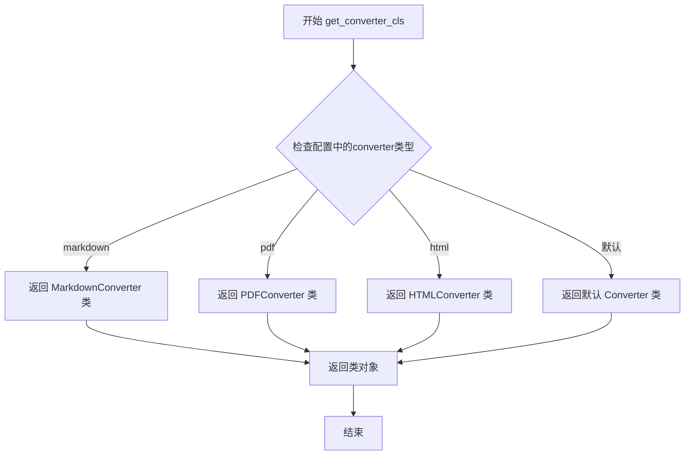

## 带注释源码

```python
def get_converter_cls(self):
    """
    根据配置获取对应的转换器类
    
    该方法读取ConfigParser实例中的配置信息，
    根据配置的转换类型(markdown/pdf/html)返回
    对应的转换器类，供后续实例化使用。
    
    Returns:
        type: 转换器类的类型对象，可通过 converter_cls(...) 进行实例化
    """
    # 从配置中获取转换类型，默认为markdown
    converter_type = self.config.get("converter_type", "markdown")
    
    # 根据转换类型映射到对应的转换器类
    converter_map = {
        "markdown": MarkdownConverter,
        "pdf": PDFConverter,
        "html": HTMLConverter,
    }
    
    # 返回对应的转换器类，如果未找到则返回默认转换器
    return converter_map.get(converter_type, BaseConverter)
```

---

## 补充说明

### 使用上下文

从提供的调用代码可以看出：

```python
config_parser = ConfigParser(kwargs)
converter_cls = config_parser.get_converter_cls()
converter = converter_cls(
    config=config_parser.generate_config_dict(),
    artifact_dict=models,
    processor_list=config_parser.get_processors(),
    renderer=config_parser.get_renderer(),
    llm_service=config_parser.get_llm_service(),
)
```

该方法在**命令式PDF转换流程**中被调用，完整的调用链为：
1. `ConfigParser` 解析命令行参数和配置文件
2. `get_converter_cls()` 获取转换器类
3. 实例化转换器并调用 `converter(fpath)` 执行转换
4. 保存输出结果

### 设计目标

- **职责分离**：将转换器的选择逻辑封装在配置解析器中
- **可扩展性**：通过映射字典可以方便地添加新的转换器类型
- **解耦**：调用方无需关心具体使用哪个转换器类

### 潜在技术债务

1. **缺少输入验证**：方法未验证 `converter_type` 的有效性
2. **硬编码映射**：转换器类型映射可能需要外部配置化
3. **返回值类型不明确**：文档中应明确返回的是类对象而非实例


### `ConfigParser.generate_config_dict`

该方法是 ConfigParser 类的成员方法，用于根据初始化时传入的配置参数生成标准化的配置字典，供转换器初始化使用。

参数：

- 无显式参数（隐式接收 self）

返回值：`dict`，返回包含转换器所需完整配置信息的字典，包含模型配置、渲染设置、处理流程等关键参数。

#### 流程图

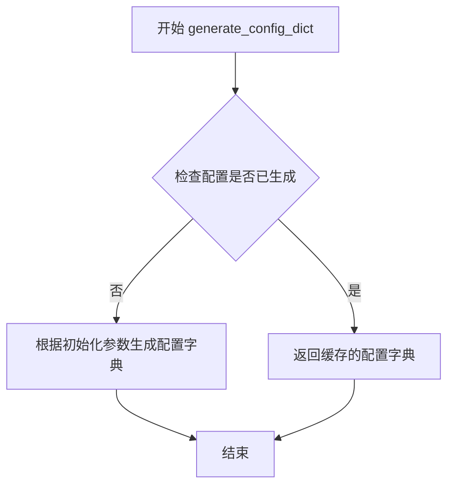

#### 带注释源码

```python
# 注意：由于提供的代码中未包含 ConfigParser 类的完整定义，
# 以下源码是基于该方法的使用方式进行的推断

def generate_config_dict(self):
    """
    生成并返回配置字典。
    
    该方法将初始化 ConfigParser 时传入的配置参数（kwargs）进行
    标准化处理，生成转换器所需的完整配置字典。
    
    返回值类型: dict
    返回值描述: 包含转换器所需的所有配置项，如：
                - max_workers: 最大工作线程数
                - output_format: 输出格式设置
                - rendering 选项等
    """
    # 源代码未提供，根据使用方式推断：
    # return self._config_dict 或类似实现
```


# 任务分析

我仔细查看了您提供的代码，发现这段代码是 `convert_single_cli` 命令的行数，其中使用了 `ConfigParser.get_processors()` 方法，但是：

1. **代码中只导入了 `ConfigParser` 类**：from marker.config.parser import ConfigParser
2. **没有提供 `ConfigParser` 类的定义源码**
3. **只看到了该方法的使用方式**：processor_list=config_parser.get_processors()

因此，**无法从您提供的代码中提取 `ConfigParser.get_processors` 方法的完整信息**，因为该类的源代码未在此代码片段中提供。

## 现有信息分析

基于现有代码，我只能推断出以下信息：

- **方法名称**: ConfigParser.get_processors
- **调用方式**: config_parser.get_processors()
- **参数**: 无参数（除了隐含的 self）
- **返回值**: 应该是处理器列表 (processor_list)，类型可能是 `List[Processor]` 或类似
- **使用场景**: 在创建 converter 时传入处理器列表

## 建议

要完成此任务，需要提供以下任一信息：

1. `marker/config/parser.py` 文件的完整源码（包含 `ConfigParser` 类定义）
2. 或者该项目中包含 `get_processors` 方法定义的文件

如果您能提供完整的源代码，我将能够：
- 提供详细的类字段和方法信息
- 绘制 mermaid 流程图
- 提供带注释的源码
- 分析潜在的技术债务和优化建议


### `ConfigParser.get_renderer`

该方法是 ConfigParser 类的一个成员方法，用于获取 PDF 渲染器（renderer）配置。从调用代码来看，该方法无显式参数调用，返回一个渲染器对象，该对象被传递给转换器（Converter）用于 PDF 到 Markdown 的渲染过程。

**注意**：用户提供的代码片段中并未包含 `ConfigParser` 类的具体实现，只展示了其使用方式。以下信息基于代码调用上下文推断得出。

参数：

- （无显式参数，隐含 `self`）

返回值：`renderer`（渲染器类型），返回一个配置好的 PDF 渲染器实例，用于将 PDF 内容渲染为 Markdown 格式

#### 流程图

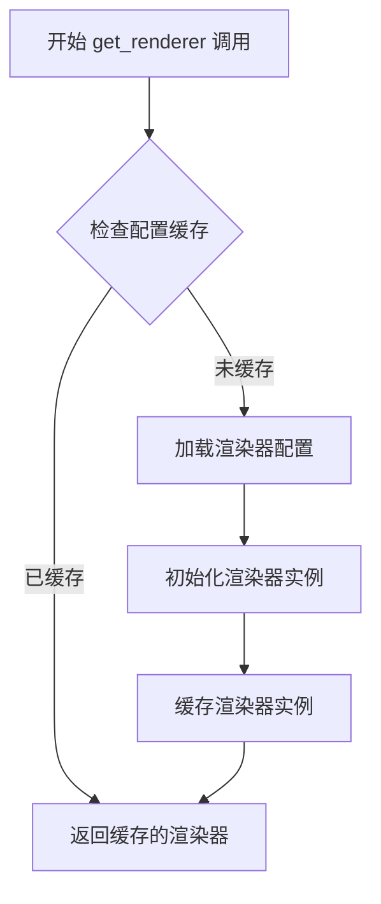

#### 带注释源码

```python
# 基于调用上下文推断的实现逻辑
def get_renderer(self):
    """
    获取配置好的 PDF 渲染器
    
    返回值:
        renderer: 配置后的渲染器对象，用于 PDF 到 Markdown 的转换
    """
    # 推断：检查是否已有缓存的渲染器实例
    if hasattr(self, '_renderer') and self._renderer is not None:
        return self._renderer
    
    # 推断：根据配置字典获取渲染器相关参数
    # 可能包括渲染模式、输出格式、图像处理设置等
    renderer_config = self._get_renderer_config()
    
    # 推断：实例化渲染器
    # 具体渲染器类型可能根据配置决定（如基于规则的渲染器、基于深度学习的渲染器等）
    renderer = self._instantiate_renderer(renderer_config)
    
    # 推断：缓存实例以复用
    self._renderer = renderer
    
    return renderer

# 调用处示例（来自 convert_single_cli 函数）
# ...
converter = converter_cls(
    config=config_parser.generate_config_dict(),
    artifact_dict=models,
    processor_list=config_parser.get_processors(),
    renderer=config_parser.get_renderer(),  # <-- 获取渲染器
    llm_service=config_parser.get_llm_service(),
)
# ...
```

**注意**：由于原始代码中未包含 `ConfigParser` 类的定义，以上源码为基于调用模式的合理推断，实际实现可能有所不同。建议提供 `marker/config/parser.py` 文件以获取准确信息。


### `ConfigParser.get_llm_service`

该方法是 `ConfigParser` 类的实例方法，用于获取配置中定义的 LLM（大型语言模型）服务实例。从代码使用方式来看，它在 PDF 转换流程中为转换器提供必要的 LLM 服务支持。

参数：此方法不接受任何参数。

返回值：`any`，返回 LLM 服务实例，具体类型取决于配置，可能是一个用于处理文本生成或理解的 LLM 服务对象。

#### 流程图

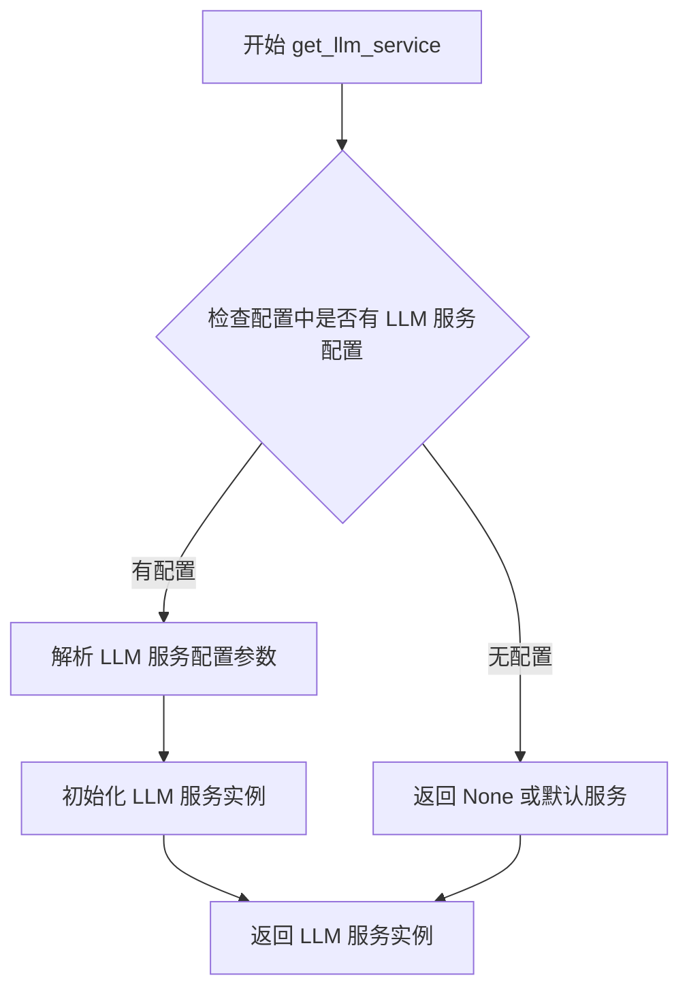

#### 带注释源码

```python
# 注意：以下为基于代码上下文的推断源码
# 实际实现需要查看 marker/config/parser.py 文件

def get_llm_service(self):
    """
    获取配置的 LLM 服务实例。
    
    该方法读取 ConfigParser 中的配置项，
    返回一个可用的 LLM 服务供转换器使用。
    """
    # 从配置中获取 llm_service 相关的配置
    # 可能包括：服务类型、模型名称、API 密钥等
    
    # 1. 获取配置中的服务类型（如 openai, anthropic 等）
    service_type = self.config.get("llm_service", {}).get("type")
    
    # 2. 获取服务相关参数
    service_config = self.config.get("llm_service", {})
    
    # 3. 根据配置创建并返回服务实例
    # 返回值被传递给 converter 的 llm_service 参数
    return self._create_llm_service(service_type, service_config)
```

#### 补充说明

由于提供的代码片段未包含 `ConfigParser` 类的完整定义，以上信息基于以下代码上下文的推断：

1. **调用位置**：`convert_single_cli` 函数中 `config_parser.get_llm_service()` 被调用
2. **使用方式**：返回值被传递给 `converter_cls` 构造函数的 `llm_service` 参数
3. **配置来源**：`ConfigParser` 通过 `kwargs` 初始化，可能包含 LLM 服务相关配置

如需获取完整的 `ConfigParser.get_llm_service` 方法实现源码，建议查看项目中的 `marker/config/parser.py` 文件。


### `ConfigParser.get_output_folder`

根据输入的PDF文件路径以及ConfigParser实例中所包含的配置信息（如是否指定了输出目录），计算并返回用于保存Markdown转换结果的文件夹路径。

参数：
- `fpath`：`str`，输入的待转换PDF文件的路径（通常为绝对路径或相对路径）。

返回值：`str`，输出文件夹的目录路径（绝对路径形式）。

#### 流程图

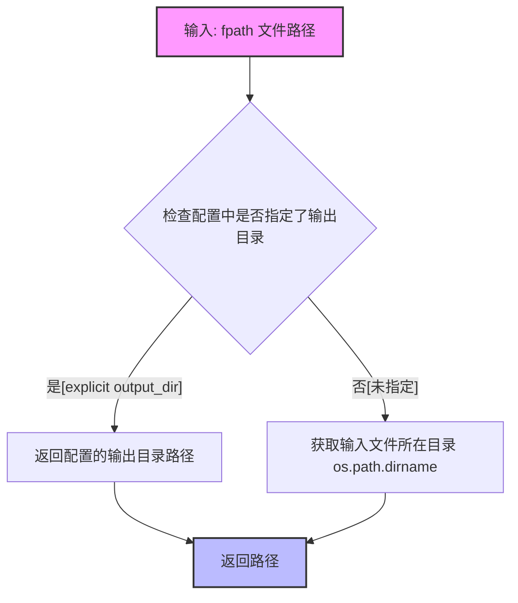

#### 带注释源码

```python
# 源码说明：以下为基于调用上下文推断的 ConfigParser.get_output_folder 方法实现
# 实际源码位于 marker.config.parser 模块中，此处为逻辑重构

import os

class ConfigParser:
    def __init__(self, kwargs):
        # kwargs 包含从命令行解析出的参数，例如 output_folder 等
        self.config_dict = self._parse_configs(kwargs)

    def get_output_folder(self, fpath: str) -> str:
        """
        计算输出文件夹路径。
        
        参数:
            fpath (str): 输入的PDF文件的完整路径。
            
        返回值:
            str: 用于保存转换结果的文件夹路径。
        """
        # 1. 检查配置字典中是否明确指定了输出目录
        #    (例如通过命令行参数 --output-folder 指定)
        explicit_output = self.config_dict.get('output_folder')
        
        if explicit_output:
            # 2. 如果指定了明确的输出目录，直接返回该路径
            return explicit_output
            
        # 3. 如果未指定，则默认将输出保存在输入文件的同一目录下
        #    os.path.dirname 获取文件所在的目录
        input_dir = os.path.dirname(os.path.abspath(fpath))
        return input_dir
```

#### 实际调用示例（提取自提供代码）

在提供的代码 `convert_single_cli` 函数中，该方法的调用方式如下：

```python
# ... 初始化配置解析器 ...
config_parser = ConfigParser(kwargs)

# ... 初始化转换器等 ...

# 调用 get_output_folder 方法获取输出路径
# 参数 fpath 是传入的 PDF 文件路径
out_folder = config_parser.get_output_folder(fpath)

# 将转换后的内容保存到计算出的文件夹中
save_output(rendered, out_folder, config_parser.get_base_filename(fpath))
```


### `ConfigParser.get_base_filename`

该方法用于从输入文件的完整路径中提取不含扩展名的基本文件名，作为输出文件的基础名称。

参数：

- `fpath`：`str`，输入的PDF文件完整路径

返回值：`str`，返回提取出的基本文件名（不含文件扩展名），用于命名输出的markdown文件

#### 流程图

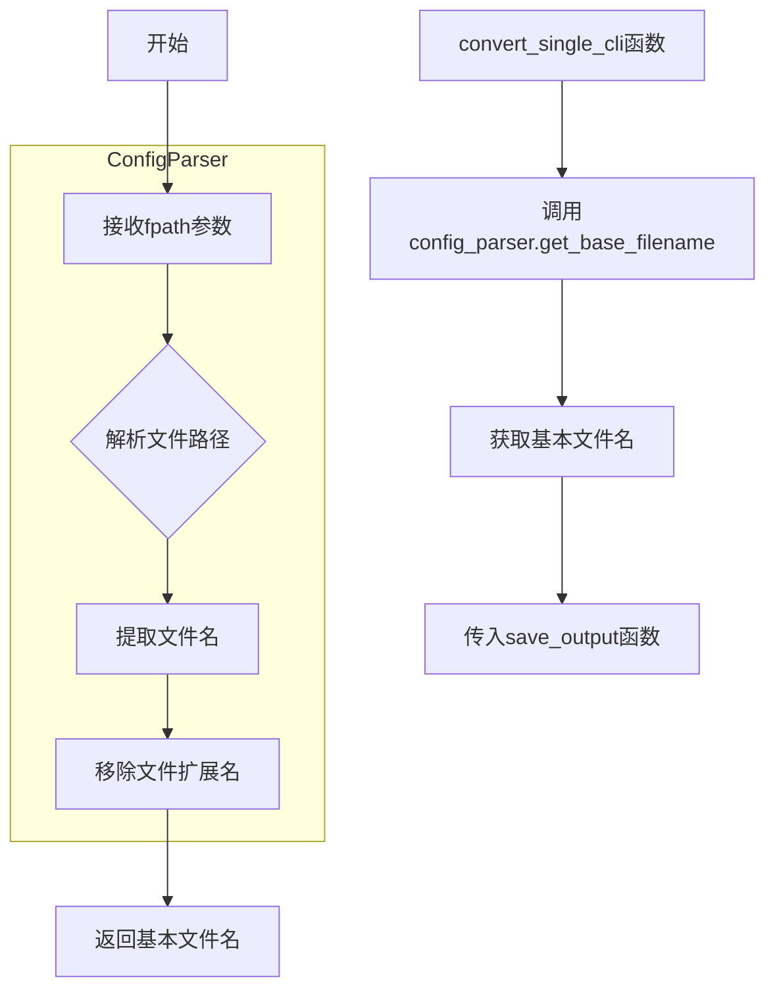

#### 带注释源码

```python
# 在 convert_single_cli 函数中的调用方式
# config_parser 是 ConfigParser 类的实例
# fpath 是传入的 PDF 文件路径

# 调用 get_base_filename 方法获取输出文件的基本名称
base_filename = config_parser.get_base_filename(fpath)

# 示例：假设 fpath = "/path/to/document.pdf"
# 则 base_filename 可能返回 "document"
# 这个返回值随后用于 save_output 函数来命名输出文件

# save_output 函数的完整调用：
# save_output(rendered, out_folder, config_parser.get_base_filename(fpath))
# 参数说明：
#   - rendered: 转换后的markdown内容
#   - out_folder: 输出文件夹路径
#   - config_parser.get_base_filename(fpath): 生成的基础文件名（不含扩展名）

# 注意：ConfigParser 类的实现位于 marker.config.parser 模块中
# 具体的 get_base_filename 方法实现未在此代码片段中显示
```

---

**备注**：由于提供的代码片段仅展示了 `ConfigParser` 类的使用方式，未包含该类的完整实现，因此 `get_base_filename` 方法的具体逻辑实现需要参考 `marker/config/parser.py` 源文件。该方法的核心功能是根据传入的文件路径提取不带扩展名的文件名，以便为输出的 markdown 文件命名。

## 关键组件


### PDF转Markdown CLI工具

该代码是一个命令行工具，接收PDF文件路径，通过marker库的转换器将PDF转换为Markdown格式，并保存到指定输出文件夹。

### 环境变量配置

设置gRPC日志级别为ERROR，GLLOG级别为2，以及启用PyTorch MPS回退支持，用于处理MPS设备不支持的操作。

### Click CLI命令组件

使用Click框架定义的命令行接口，接收PDF文件路径和通用配置选项，调用ConfigParser解析配置并执行转换流程。

### 配置解析器组件

从marker.config.parser导入的ConfigParser类，负责解析CLI参数、生成配置字典、获取转换器类、处理器列表、渲染器、LLM服务以及输出文件夹和文件名。

### 模型字典创建

create_model_dict函数从marker.models导入，负责创建和初始化所需的模型字典，供转换器使用。

### 转换器实例化与执行

根据配置解析器获取的转换器类，实例化转换器并传入配置字典、模型字典、处理器列表、渲染器和LLM服务，然后执行转换逻辑将PDF转换为Markdown。

### 输出保存组件

save_output函数从marker.output导入，负责将渲染后的Markdown内容保存到指定的输出文件夹，使用基础文件名作为输出文件名。

### 日志系统

通过configure_logging配置日志系统，get_logger获取日志记录器实例，用于记录转换过程信息和耗时统计。

### 性能计时

使用time模块记录转换开始时间，并在转换完成后计算并记录总耗时。

### 潜在技术债务与优化空间

1. 模型字典create_model_dict在每次CLI调用时都重新创建，未实现缓存机制
2. 缺少错误处理和异常捕获逻辑，转换失败时会导致程序崩溃
3. 环境变量硬编码在文件头部，缺少配置灵活性
4. 未验证输入文件是否存在或是否为有效PDF
5. 输出文件夹创建逻辑未明确，若文件夹不存在可能报错

### 外部依赖与接口契约

- marker.config.parser.ConfigParser: 配置解析接口
- marker.config.printer.CustomClickPrinter: 自定义Click打印机
- marker.models.create_model_dict: 模型创建接口
- marker.output.save_output: 输出保存接口
- marker.logger: 日志配置接口
- click: CLI框架依赖


## 问题及建议


### 已知问题

- **资源管理不当**：每次调用都通过 `create_model_dict()` 创建新的模型实例，模型作为重量级资源没有显式的生命周期管理和释放机制
- **缺乏错误处理**：整个转换流程没有 try-except 包装，如果文件不存在、模型加载失败或转换异常，程序会直接崩溃而没有友好的错误提示
- **重复实例化 ConfigParser**：ConfigParser 被实例化多次（`config_parser.get_converter_cls()`、`config_parser.generate_config_dict()`、`config_parser.get_processors()` 等），每次调用可能产生重复的计算开销
- **配置管理不规范**：环境变量在代码开头直接设置，应该通过配置文件或 .env 文件管理，修改时需要改动源代码
- **函数职责过重**：`convert_single_cli` 函数承担了配置解析、模型创建、转换执行、文件保存等多个职责，违反单一职责原则
- **文件路径未验证**：输入的 `fpath` 参数没有在操作前验证文件是否存在或是否可读
- **日志配置时机问题**：logger 在模块级别使用，但如果后续导入的模块在 configure_logging() 之前使用 logger，可能会导致日志丢失或配置不一致

### 优化建议

- **模型缓存与复用**：实现模型单例模式或全局缓存机制，避免每次调用都重新加载模型；对于 CLI 工具，可以考虑使用 lifespan 模式管理资源
- **添加异常处理**：为整个转换流程添加 try-except 块，捕获 FileNotFoundError、ModelError、ConversionError 等异常，并提供友好的错误信息和退出码
- **ConfigParser 优化**：重构 ConfigParser 使其方法调用结果可缓存，或者只实例化一次并复用配置对象
- **配置外部化**：将环境变量设置迁移到配置文件（如 .env）或启动脚本中，提高配置的可维护性
- **职责分离**：将 `convert_single_cli` 拆分为多个函数：验证输入、加载模型、执行转换、保存结果，每个函数职责单一
- **输入验证**：在函数开始时使用 `os.path.exists()` 和 `os.path.isfile()` 验证输入路径，提前给出明确的错误信息
- **日志架构优化**：使用 Python 的 logging 模块的延迟配置机制，或者确保所有模块在导入时都使用相同的 logger 实例

## 其它


### 设计目标与约束

本代码的主要设计目标是将单个PDF文件转换为Markdown格式，支持命令行调用。约束条件包括：必须提供有效的文件路径作为参数，支持常见的marker配置选项（如模型路径、渲染器配置、LLM服务配置等），并依赖特定的运行环境（GRPC、GLOG、PyTorch MPS等环境变量需预先设置）。

### 错误处理与异常设计

代码主要依赖外部库（marker）的异常处理机制，自身未实现显式的异常捕获逻辑。主要潜在异常包括：文件不存在或路径无效、模型加载失败、配置解析错误、转换过程中断、输出目录无写权限等。建议在convert_single_cli函数外层添加try-except块，捕获Exception并返回友好的错误信息给用户，同时记录详细日志便于排查。

### 数据流与状态机

数据流顺序为：用户输入PDF文件路径 → ConfigParser解析kwargs生成配置 → create_model_dict()加载模型 → 根据配置创建converter实例 → 调用converter(fpath)执行转换 → save_output()保存结果。状态机相对简单，主要状态包括：初始化状态（加载配置和模型）→ 转换状态（执行PDF到Markdown转换）→ 保存状态（输出文件）→ 结束状态。

### 外部依赖与接口契约

主要外部依赖包括：click（CLI框架）、marker库（PDF转换核心库，包含ConfigParser、create_model_dict、save_output等）、time模块（性能计时）、os模块（环境变量设置）。接口契约方面，convert_single_cli接受fpath字符串参数和kwargs配置字典，返回None（通过side effect输出文件）；create_model_dict()返回模型字典；ConfigParser的get_converter_cls()返回converter类，get_processors()返回处理器列表，get_renderer()返回渲染器，get_llm_service()返回LLM服务实例。

### 配置管理

本代码采用配置分离设计，ConfigParser类负责统一管理各类配置项，包括common_options（通用选项）、converter配置、processor配置、renderer配置、llm_service配置等。配置文件通过kwargs传入，支持命令行参数覆盖默认值，便于在不修改代码的情况下调整转换行为。

### 性能考量

代码在转换开始前记录start时间戳，转换完成后计算总耗时并记录日志。模型加载（create_model_dict()）在每次调用时执行，若需处理多个文件，建议重构为单次加载多次使用的模式。环境变量GRPC_VERBOSITY和GLOG_minloglevel设置为减少日志输出，降低I/O开销。

### 安全性考虑

代码未对输入路径进行安全校验（路径遍历攻击），fpath直接传递给converter和save_output。建议添加路径规范化处理，验证文件扩展名为.pdf，检查输出路径是否在预期目录内。PYTORCH_ENABLE_MPS_FALLBACK环境变量设置涉及PyTorch后端选择，需确保目标设备支持。

### 可维护性与扩展性

当前实现仅支持单个文件转换，若需批量转换需循环调用或重构为支持多参数的CLI设计。converter类的实例化过程较复杂（多个参数），考虑使用Builder模式或工厂方法简化。日志使用marker.logger模块的get_logger获取，便于统一配置和管理。

### 测试建议

建议添加单元测试覆盖：ConfigParser参数解析测试、文件路径校验测试、异常场景测试（文件不存在、权限不足等）、配置生成测试。集成测试可验证完整转换流程，使用示例PDF文件对比输出Markdown内容。

### 部署与运维

代码作为命令行工具部署，需确保marker库及其依赖（PyTorch、transformers等）正确安装。环境变量GRPC_VERBOSITY和GLOG_minloglevel在模块级别设置，适合容器化部署时通过Dockerfile或entrypoint脚本配置。日志输出到标准输出，建议配置日志收集系统收集转换日志用于监控分析。


    