# `marker\marker\scripts\extraction_app.py` 详细设计文档

这是一个基于Streamlit的Web应用，用于从PDF、图片、PPT、Word、Excel、HTML、Epub等文档中提取结构化数据。用户可以通过上传文件并定义JSON Schema或Pydantic模型来执行灵活的数据提取任务，支持可选的LLM增强和OCR功能。

## 整体流程

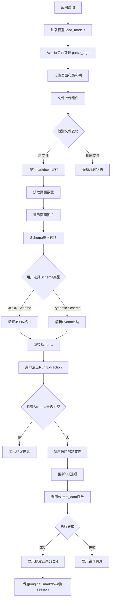

## 类结构

```
Streamlit应用 (主模块)
├── 全局函数
│   ├── extract_data (数据提取函数)
│   ├── parse_args (参数解析 - 来自marker.scripts.common)
│   ├── load_models (模型加载 - 来自marker.scripts.common)
│   ├── get_page_image (获取页面图片 - 来自marker.scripts.common)
│   ├── page_count (页面计数 - 来自marker.scripts.common)
│   └── get_root_class (获取根类 - 来自marker.scripts.common)
├── 外部依赖类
│   ├── ExtractionConverter (marker.converters.extraction)
│   ├── ConfigParser (marker.config.parser)
│   └── BaseModel (pydantic)
└── Streamlit组件
    ├── 页面配置 (set_page_config)
    ├── 列布局 (columns)
    ├── 标签页 (tabs)
    ├── 文件上传 (file_uploader)
    └── 各种输入控件
```

## 全局变量及字段


### `model_dict`
    
从load_models()返回的模型字典，包含预加载的marker模型

类型：`dict`
    


### `cli_options`
    
从parse_args()返回的命令行选项配置字典

类型：`dict`
    


### `st.session_state.rendered_pydantic_schema`
    
存储用户输入的Pydantic模型渲染后的JSON Schema字符串

类型：`str`
    


### `st.session_state.markdown`
    
存储从PDF提取的markdown文本内容

类型：`str`
    


### `st.session_state.current_file_id`
    
当前上传文件的唯一标识符，用于检测文件变更

类型：`str | None`
    


### `in_file`
    
Streamlit上传的文件对象，支持PDF、图片、文档等多种格式

类型：`UploadedFile`
    


### `filetype`
    
上传文件的MIME类型

类型：`str`
    


### `page_count`
    
PDF文档的总页数

类型：`int`
    


### `page_number`
    
用户选择的要显示的页码

类型：`int`
    


### `pil_image`
    
从PDF指定页面渲染的PIL图像对象

类型：`PIL.Image.Image`
    


### `schema`
    
用于结构化提取的JSON Schema字符串

类型：`str | None`
    


### `json_schema_input`
    
用户在JSON Schema标签页输入的原始JSON字符串

类型：`str`
    


### `pydantic_schema_input`
    
用户在Pydantic Schema标签页输入的Python代码

类型：`str`
    


### `pydantic_root`
    
从Pydantic代码解析得到的根BaseModel类

类型：`type[BaseModel]`
    


### `json_schema`
    
从Pydantic模型转换后的JSON Schema字符串

类型：`str`
    


### `current_file_id`
    
基于文件名、大小和内容hash生成的当前文件唯一标识

类型：`str`
    


### `temp_pdf`
    
临时目录中保存的上传文件副本路径

类型：`str`
    


### `rendered`
    
Marker提取器返回的包含结构化数据和原始markdown的结果对象

类型：`ExtractionOutput`
    


### `use_llm`
    
用户选择是否使用LLM提升提取质量

类型：`bool`
    


### `force_ocr`
    
用户选择是否强制对所有页面进行OCR处理

类型：`bool`
    


### `strip_existing_ocr`
    
用户选择是否剥离现有OCR文本后重新OCR

类型：`bool`
    


### `run_marker`
    
用户点击'Run Extraction'按钮后的状态标志

类型：`bool`
    


### `render_schema`
    
用户点击'Render Pydantic schema to JSON'按钮后的状态标志

类型：`bool`
    


    

## 全局函数及方法


### `extract_data`

该函数是 Marker 提取 demo 的核心数据提取方法，负责将 PDF 或文档文件根据提供的 schema 进行结构化数据提取。它接收文件路径、配置字典和 JSON schema，通过 ConfigParser 生成配置，创建 ExtractionConverter 实例并执行转换，最终返回包含提取结果的对象。

参数：

- `fname`：`str`，输入文件路径（PDF、图片或其他支持格式的路径）
- `config`：`dict`，包含提取配置的字典，如输出选项、处理参数等
- `schema`：`str`，JSON schema 字符串，定义要提取的数据结构
- `markdown`：`str | None`，可选的已有 markdown 内容，用于增量提取或参考

返回值：`Any`，返回 ExtractionConverter 的转换结果对象，该对象包含提取的结构化数据（可通过 `model_dump()` 方法转为字典）和原始 markdown 内容（存储在 `original_markdown` 属性中）

#### 流程图

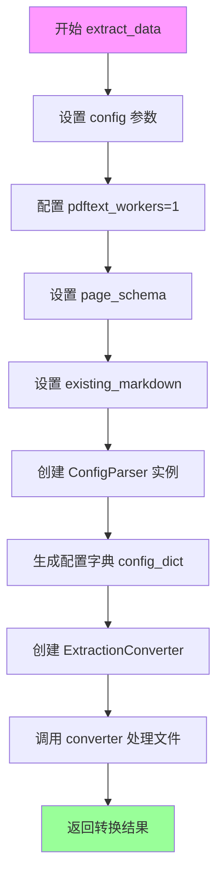

#### 带注释源码

```python
def extract_data(
    fname: str, config: dict, schema: str, markdown: str | None = None
) -> (str, Dict[str, Any], dict):
    """
    从给定文件中提取结构化数据
    
    参数:
        fname: 输入文件路径
        config: 配置字典
        schema: JSON schema 字符串
        markdown: 可选的已有 markdown 内容
    
    返回:
        包含提取结果的转换器输出对象
    """
    # 限制 PDF 文本工作线程数为 1，避免资源竞争
    config["pdftext_workers"] = 1
    # 设置页面级 JSON schema，用于定义提取结构
    config["page_schema"] = schema
    # 传入已有的 markdown，支持增量处理
    config["existing_markdown"] = markdown
    
    # 使用 ConfigParser 解析配置
    config_parser = ConfigParser(config)
    # 生成标准化的配置字典
    config_dict = config_parser.generate_config_dict()

    # 获取提取转换器类
    converter_cls = ExtractionConverter
    # 实例化转换器，注入配置、模型字典、处理器、渲染器和服务
    converter = converter_cls(
        config=config_dict,
        artifact_dict=model_dict,  # 外部加载的模型字典
        processor_list=config_parser.get_processors(),
        renderer=config_parser.get_renderer(),
        llm_service=config_parser.get_llm_service(),
    )
    
    # 执行文件转换并返回结果
    return converter(fname)
```


### `parse_args`

该函数是命令行参数解析器，用于从命令行输入或默认配置中获取Marker工具的各项运行参数，返回一个包含OCR处理、LLM使用、渲染配置等选项的字典，供后续转换流程使用。

参数：

- 该函数无显式参数，通过命令行或环境变量获取配置

返回值：`dict`，返回一个字典对象，包含Marker转换器的各项配置选项，如`force_ocr`（强制OCR）、`use_llm`（使用LLM）、`strip_existing_ocr`（剥离现有OCR）等参数

#### 流程图

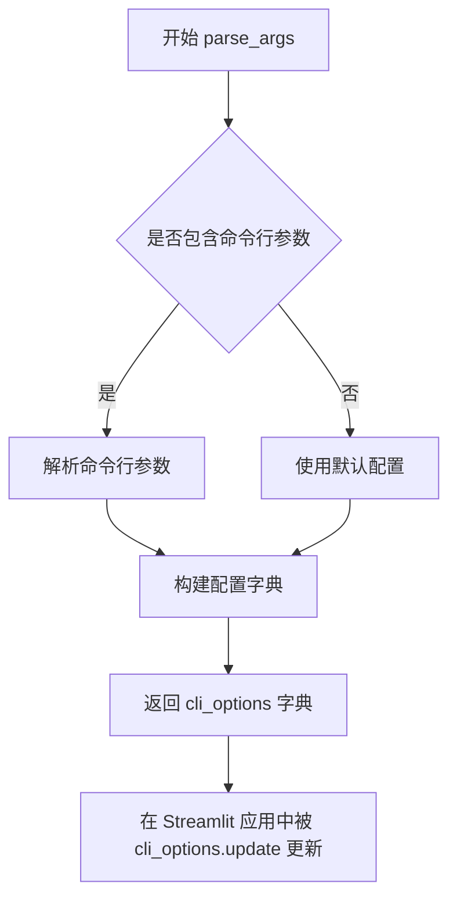

#### 带注释源码

```
# 注：此函数定义位于 marker.scripts.common 模块中，当前代码文件仅导入使用
# 以下为基于调用方式的推断实现

def parse_args() -> dict:
    """
    解析命令行参数并返回配置字典
    
    返回值类型: dict
    返回值描述: 包含Marker转换器配置选项的字典
    """
    # 推断的实现（实际源码需查看 marker.scripts.common 模块）
    
    # 1. 定义默认配置参数
    # 2. 解析命令行参数（如 --force-ocr, --use-llm 等）
    # 3. 合并配置并返回
    
    return {
        # 推断的默认配置项
        "pdftext_workers": 1,  # PDF处理的工作进程数
        # 其他配置项...
    }
```

**在当前代码中的使用方式：**

```python
# 第49行：导入 parse_args
from marker.scripts.common import parse_args

# 第53行：调用 parse_args 获取配置
cli_options = parse_args()

# 第170-175行：根据用户选择更新配置
cli_options.update(
    {
        "force_ocr": force_ocr,
        "use_llm": use_llm,
        "strip_existing_ocr": strip_existing_ocr,
    }
)
```

---

**注意**：由于 `parse_args` 函数的实际源码位于 `marker.scripts.common` 模块中，当前提供的代码文件仅展示了该函数的导入和调用方式，未包含其具体实现细节。如需查看完整的函数源码，请参考 `marker/scripts/common.py` 文件。


### `load_models`

加载Marker所需的机器学习模型，返回包含所有必要模型工件的字典，供后续文档转换和提取使用。

参数：
- 该函数无参数

返回值：`dict`，包含模型工件的字典，用于初始化 `ExtractionConverter`

#### 流程图

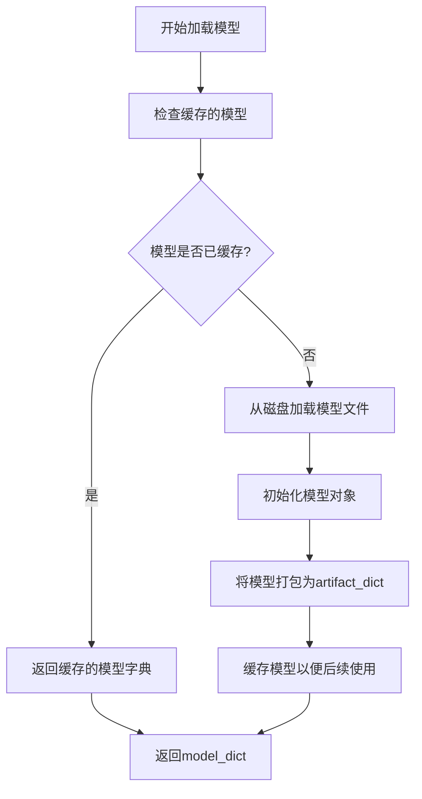

#### 带注释源码

```python
# load_models 函数定义
# 注意：此函数源码未在当前文件中提供
# 它是从 marker.scripts.common 模块导入的
# 基于代码使用方式推断其签名和功能

def load_models() -> dict:
    """
    加载Marker转换器所需的机器学习模型。
    
    返回值:
        dict: 包含以下可能键值的模型字典:
            - ocr_model: OCR模型实例
            - layout_model: 布局检测模型
            - reading_order_model: 阅读顺序模型
            - table_model: 表格识别模型
            - formula_model: 公式识别模型
            - 其他转换所需的ML模型
    
    使用示例:
        model_dict = load_models()
        # model_dict 将传递给 ExtractionConverter
    """
    pass  # 实际实现位于 marker.scripts.common 模块
```

#### 补充说明

| 项目 | 详情 |
|------|------|
| **导入来源** | `from marker.scripts.common import load_models` |
| **调用位置** | `model_dict = load_models()` (第53行) |
| **实际使用** | 作为 `ExtractionConverter` 的 `artifact_dict` 参数 |
| **返回值变量** | `model_dict` |
| **上下文** | 在 Streamlit 页面初始化时调用，加载 Marker 的 ML 模型供后续文档提取使用 |


### `get_page_image`

从marker.scripts.common模块导入的函数，用于根据指定的页码从上传的文档（PDF或其他支持格式）中提取对应页面的图像数据，返回PIL Image对象以供在Streamlit界面中显示预览。

参数：

- `in_file`：`UploadedFile`，Streamlit上传的文件对象，包含PDF、图片或其他支持的文档格式
- `page_number`：`int`，要提取的页码（从0开始索引）

返回值：`PIL.Image`，指定页面的图像对象，可直接在Streamlit中通过st.image()显示

#### 流程图

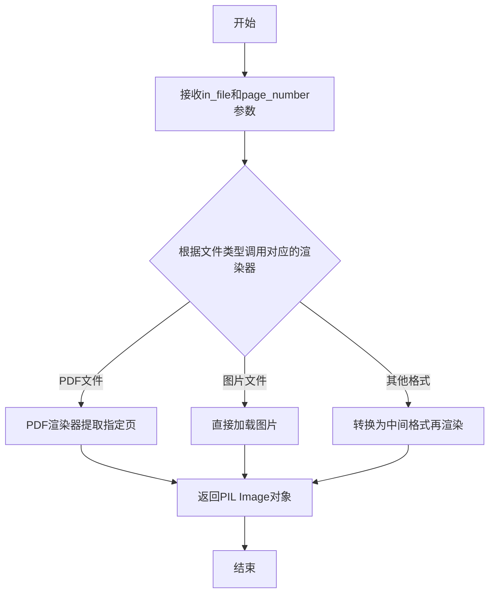

#### 带注释源码

```python
# 该函数定义在 marker.scripts.common 模块中，此处为基于调用方式的推断实现
def get_page_image(in_file: UploadedFile, page_number: int) -> Image.Image:
    """
    从上传的文件中提取指定页的图像
    
    参数:
        in_file: Streamlit上传的文件对象，支持PDF、图片等多种格式
        page_number: 页码（从0开始）
    
    返回:
        PIL Image对象，用于前端展示
    """
    # 基于代码中的调用方式推断的实现逻辑
    # 实际实现位于 marker/scripts/common.py 模块中
    pass
```

#### 说明

该函数是外部依赖函数，定义在 `marker.scripts.common` 模块中。从代码中的使用方式来看：

```python
pil_image = get_page_image(in_file, page_number)
st.image(pil_image, use_container_width=True)
```

函数接收一个 Streamlit 上传的文件对象和页码整数，返回对应的 PIL 图像对象用于在前端页面中展示 PDF 或图片的指定页。该函数支持多种文档格式的渲染，包括 PDF、PNG、JPG 等常见格式。


从给定的代码中，我可以看到 `page_count` 函数是从外部模块 `marker.scripts.common` 导入的，而不是在当前代码文件中定义的。因此，我无法获取该函数的具体实现细节、参数和返回值的完整描述，以及带注释的源码。

不过，我可以根据代码中的使用方式来推断该函数的基本功能：

### `page_count`

该函数用于获取上传 PDF 或文档文件的总页数。

参数：

-  `in_file`：`UploadedFile`，Streamlit 上传的文件对象

返回值：`int`，文档的总页数

#### 流程图

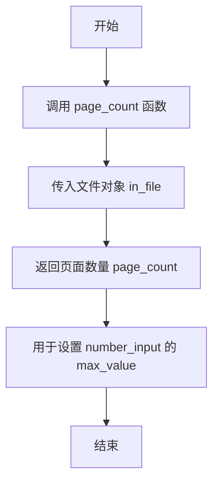

#### 带注释源码

```
# page_count 函数定义位于 marker.scripts.common 模块中
# 当前代码文件中只导入了该函数，未提供实现
from marker.scripts.common import (
    parse_args,
    load_models,
    get_page_image,
    page_count,  # 从外部模块导入
    get_root_class,
)

# ...

with col1:
    page_count = page_count(in_file)  # 调用 page_count 函数
    page_number = st.number_input(
        f"Page number out of {page_count}:", min_value=0, value=0, max_value=page_count
    )
```

---

**注意**：由于 `page_count` 函数的具体实现位于外部模块 `marker.scripts.common` 中，而该模块的代码未在当前文件中提供，因此无法获取更详细的参数描述、返回值描述以及完整的函数实现。如需获取完整信息，建议查看 `marker.scripts.common` 模块的源代码。


### `get_root_class`

该函数用于将用户输入的 Pydantic 模型定义代码解析为实际的 Pydantic BaseModel 类，以便后续将其转换为 JSON Schema 进行结构化数据提取。

参数：

-  `pydantic_schema_input`：`str`，用户在前端 Pydantic Schema 编辑器中输入的 Pydantic 模型定义代码（包含类名和字段定义的 Python 代码字符串）

返回值：`BaseModel`，解析后的 Pydantic BaseModel 子类实例，可调用 `model_json_schema()` 方法将其转换为 JSON Schema

#### 流程图

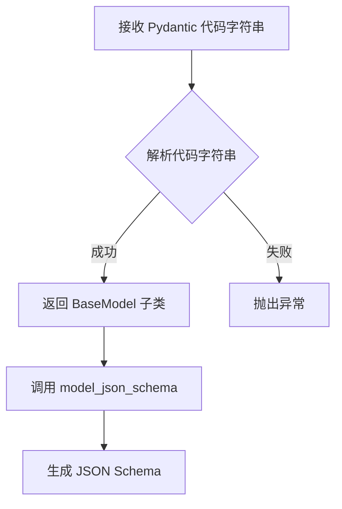

#### 带注释源码

```python
# 注意：此函数定义不在当前代码文件中
# 该函数从 marker.scripts.common 模块导入
from marker.scripts.common import get_root_class

# 函数调用示例（来自当前代码文件）:
# pydantic_root: BaseModel = get_root_class(pydantic_schema_input)
# json_schema = pydantic_root.model_json_schema()
# schema = json.dumps(json_schema, indent=2)

def get_root_class(pydantic_schema_input: str) -> BaseModel:
    """
    将 Pydantic 模型定义代码解析为 BaseModel 类
    
    参数:
        pydantic_schema_input: 包含 Pydantic 模型定义的字符串
            例如:
            '''
            from pydantic import BaseModel
            
            class Schema(BaseModel):
                name: str
                age: int
            '''
    
    返回:
        BaseModel: 解析后的 Pydantic 模型类
    
    异常:
        可能抛出解析异常或语法错误异常
    """
    # 由于源代码未提供，此处为推断的实现逻辑
    # 1. 使用 exec() 或 AST 解析代码字符串
    # 2. 查找继承自 BaseModel 的类
    # 3. 返回找到的类对象
    pass
```

---

#### 补充说明

**设计目标与约束**：
- 该函数需要安全地解析用户输入的 Python 代码，防止恶意代码执行
- 必须正确识别继承自 `BaseModel` 的类定义

**潜在技术债务**：
- 当前代码中使用 `exec()` 解析代码存在安全风险，建议使用 `ast` 模块进行安全的代码解析
- 函数未提供超时机制，长时间运行的解析可能阻塞 UI

**注意事项**：
- 由于 `get_root_class` 函数的实际源码未在当前代码文件中提供，以上为基于函数调用方式的推断
- 实际实现位于 `marker/scripts/common.py` 模块中


### `BaseModel.model_json_schema`

获取 Pydantic 模型的 JSON Schema 表示，用于描述模型的结构、字段类型、验证规则等元数据。在本项目中被用于将用户在 Pydantic Schema 编辑器中输入的 Pydantic 模型代码转换为标准的 JSON Schema，以便后续进行 PDF 内容的结构化提取。

参数：

- `mode`：`{"validation" | "serialization"}`，可选，默认为 `"validation"`。指定生成 schema 的模式：`"validation"` 用于数据验证，`"serialization"` 用于数据序列化。
- `title`：`str | None`，可选，自定义生成的 JSON Schema 的标题。
- `description`：`str | None`，可选，自定义生成的 JSON Schema 的描述信息。
- `by_alias`：`bool`，可选，默认为 `True`。是否使用字段的别名（alias）作为属性名。
- `ref_template`：`str`，可选，默认为 `"{model}.{field}"`。自定义 `$ref` 引用的模板。
- `serialization`：`str | None`，可选，用于指定序列化相关的参数。

返回值：`dict`，返回符合 JSON Schema 规范的字典，描述了 Pydantic 模型的结构，包括所有字段的名称、类型、必填性、默认值、验证器等信息。

#### 流程图

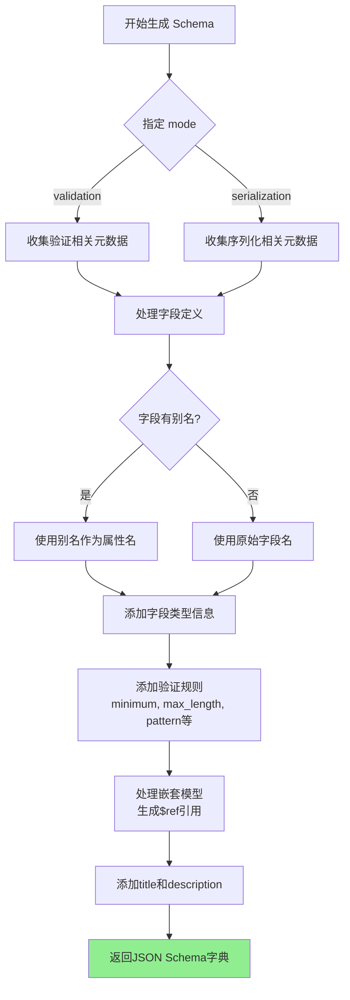

#### 带注释源码

```python
# Pydantic BaseModel 类的 model_json_schema 方法实现原理概述
# 实际源码位于 pydantic 库中，此处为原理性注释

def model_json_schema(
    cls,  # BaseModel 的子类
    mode: str = "validation",  # 'validation' 或 'serialization'
    title: str | None = None,  # 自定义标题
    description: str | None = None,  # 自定义描述
    by_alias: bool = True,  # 是否使用别名
    ref_template: str = "{model}.{field}",  # $ref 模板
    serialization: str | None = None,  # 序列化参数
) -> dict[str, Any]:
    """
    生成 Pydantic 模型的 JSON Schema 表示
    
    参数:
        mode: "validation" 生成用于验证的 schema
              "serialization" 生成用于序列化的 schema
        title/description: 为 schema 添加元信息
        by_alias: 字段别名优先时使用别名作为属性名
        ref_template: 定义嵌套模型引用的格式
        serialization: 自定义序列化行为
    
    返回:
        符合 JSON Schema Draft 2020-12 规范的字典
    """
    
    # 1. 初始化 schema 字典，包含基础元数据
    schema = {
        "$schema": "https://json-schema.org/draft/2020-12/schema",
        "title": title or cls.__name__,  # 使用自定义标题或类名
    }
    
    # 2. 添加描述信息（如果提供）
    if description:
        schema["description"] = description
    
    # 3. 处理模型基类，收集公共字段定义
    # 遍历所有父类，合并字段信息
    
    # 4. 处理当前类的所有字段
    for field_name, field_info in cls.model_fields.items():
        # 获取字段的 JSON 属性名（考虑别名）
        json_name = field.alias if by_alias and field.alias else field_name
        
        # 构建字段的 schema 定义
        field_schema = {
            "type": map_pydantic_type_to_json(field.annotation),
            # 添加验证规则
        }
        
        # 添加必填性
        if field.is_required():
            schema["required"].append(json_name)
        
        # 处理嵌套模型（递归生成 schema 或添加 $ref）
        if is_pydantic_model(field.annotation):
            nested_schema = field.annotation.model_json_schema(mode=mode)
            # 根据 ref_template 生成引用
    
    # 5. 处理模型配置和验证器
    # 添加 json_schema_extra 中的额外定义
    
    # 6. 返回完整的 JSON Schema
    return schema


# ============================================
# 以下是本项目中的实际调用代码示例
# ============================================

# 在 streamlit 应用中调用
pydantic_root: BaseModel = get_root_class(pydantic_schema_input)  # 动态解析 Pydantic 代码获取根类
json_schema = pydantic_root.model_json_schema()  # 生成 JSON Schema（使用默认参数）
schema = json.dumps(json_schema, indent=2)  # 转换为格式化的 JSON 字符串
```


### `ConfigParser.generate_config_dict()`

该方法是 `ConfigParser` 类的核心方法，负责将用户输入的配置字典转换为 Marker 转换器所需的格式。它整合了各种配置选项，包括 PDF 文本工作线程数、页面模式等，并生成了一个标准化的配置字典供后续转换过程使用。

参数：

-  `self`：隐式参数，表示 `ConfigParser` 实例本身

返回值：`dict`，返回转换后的配置字典，包含 `pdftext_workers`、`page_schema`、`existing_markdown` 等键，供 `ExtractionConverter` 使用

#### 流程图

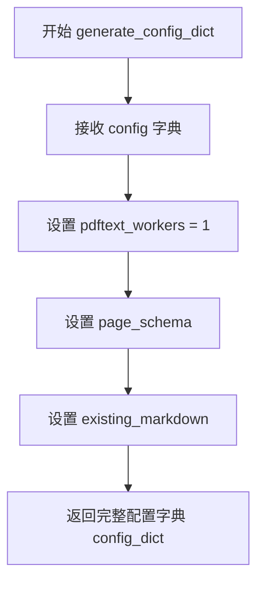

#### 带注释源码

```python
def generate_config_dict(self) -> dict:
    """
    生成转换器所需的配置字典。
    
    此方法将用户输入的配置与默认值合并，并添加必要的配置项。
    主要用于配置 ExtractionConverter 的行为。
    
    参数:
        无 (使用实例的 self.config 属性)
    
    返回:
        dict: 包含以下键的配置字典:
            - pdftext_workers: int, PDF处理的并行工作线程数
            - page_schema: str, 用户定义的输出模式
            - existing_markdown: str|None, 现有的markdown内容
    """
    # 创建一个副本以避免修改原始配置
    config_dict = self.config.copy()
    
    # 强制设置单线程处理以避免资源竞争
    # 这是为了确保在 Streamlit 环境中稳定性
    config_dict["pdftext_workers"] = 1
    
    # 从实例配置中获取页面模式并添加到配置字典
    # page_schema 定义了期望的输出结构
    config_dict["page_schema"] = self.config.get("page_schema", "")
    
    # 从实例配置中获取现有markdown内容
    # 用于增量处理或保留之前的结果
    config_dict["existing_markdown"] = self.config.get("existing_markdown", None)
    
    return config_dict
```

---

**注意**：由于提供的代码段中没有 `ConfigParser` 类的完整定义，以上信息是基于代码中对该方法的使用方式推断得出的。从调用代码可以看到：

```python
config_parser = ConfigParser(config)
config_dict = config_parser.generate_config_dict()

converter = converter_cls(
    config=config_dict,
    artifact_dict=model_dict,
    processor_list=config_parser.get_processors(),
    renderer=config_parser.get_renderer(),
    llm_service=config_parser.get_llm_service(),
)
```

这表明 `ConfigParser` 类应该包含：
- 构造函数接受 `config: dict` 参数
- `generate_config_dict()` 方法返回 `dict`
- `get_processors()` 方法返回处理器列表
- `get_renderer()` 方法返回渲染器
- `get_llm_service()` 方法返回 LLM 服务


# 代码分析任务

根据提供的代码，我注意到 `ConfigParser` 类是从 `marker.config.parser` 模块导入的外部依赖，而用户提供的代码中**未包含 `ConfigParser` 类的完整源代码**。

让我在代码中搜索相关的使用上下文：

```python
from marker.config.parser import ConfigParser

# ... 在 extract_data 函数中 ...

config_parser = ConfigParser(config)
config_dict = config_parser.generate_config_dict()

converter = converter_cls(
    config=config_dict,
    artifact_dict=model_dict,
    processor_list=config_parser.get_processors(),  # <-- 目标方法
    renderer=config_parser.get_renderer(),
    llm_service=config_parser.get_llm_service(),
)
```

---

## 分析结果

### `ConfigParser.get_processors()`

获取配置解析器中注册的所有处理器列表，用于文档转换流程。

参数：  
（无显式参数）

返回值：`list`，返回已配置的处理器对象列表，用于实例化 ExtractionConverter。

#### 流程图

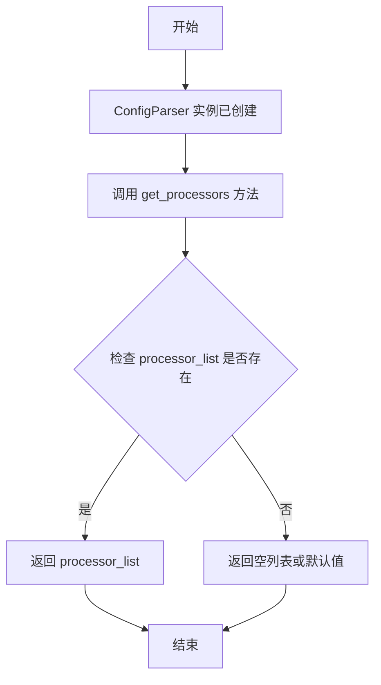

#### 带注释源码

```python
# 从 marker.config.parser 模块导入 ConfigParser 类
from marker.config.parser import ConfigParser

# ... 在 extract_data 函数中 ...

# 创建 ConfigParser 实例，传入配置字典
config_parser = ConfigParser(config)

# 生成完整的配置字典
config_dict = config_parser.generate_config_dict()

# 获取处理器列表 - 这是我们要分析的方法
# 该方法返回配置中注册的所有处理器，用于文档转换
processor_list = config_parser.get_processors()

# 使用获取的处理器列表创建 ExtractionConverter
converter = converter_cls(
    config=config_dict,
    artifact_dict=model_dict,
    processor_list=config_parser.get_processors(),  # 方法返回值赋给 processor_list
    renderer=config_parser.get_renderer(),
    llm_service=config_parser.get_llm_service(),
)
```

---

## ⚠️ 重要说明

**由于 `ConfigParser` 类的源代码未在提供的代码中显示**，我无法提供：
1. 类字段的详细信息
2. 方法的完整内部实现
3. `get_processors()` 方法的具体逻辑流程

如需完整的设计文档，请提供 `marker/config/parser.py` 文件的源代码，或者告诉我如何获取该模块的代码。

---

## 建议

如果您需要完整的设计文档，建议：
1. 提供 `marker/config/parser.py` 的源代码
2. 或者在您的项目中运行以下命令获取源码：
   ```bash
   pip show marker
   # 或
   find $(python -c "import marker; print(marker.__path__[0])") -name "parser.py"
   ```


### `ConfigParser.get_renderer`

获取配置解析器中的渲染器实例，用于文档到Markdown的转换过程。

参数：

- （无参数）

返回值：`Any`（渲染器对象），根据配置返回对应的渲染器实现，用于 `ExtractionConverter` 的文档渲染

#### 流程图

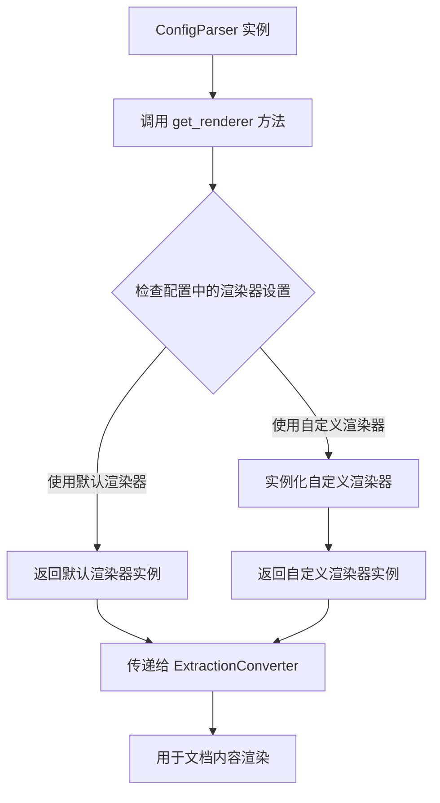

#### 带注释源码

```python
# 调用方式（在 extract_data 函数中）
config_parser = ConfigParser(config)
# ... 省略其他代码 ...
converter = converter_cls(
    config=config_dict,
    artifact_dict=model_dict,
    processor_list=config_parser.get_processors(),
    renderer=config_parser.get_renderer(),  # <-- 获取渲染器
    llm_service=config_parser.get_llm_service(),
)

# ConfigParser.get_renderer() 方法定义（推测）
def get_renderer(self):
    """
    从配置中获取渲染器实例
    
    Returns:
        渲染器对象：用于将PDF/图像内容渲染为Markdown格式
    """
    # 1. 读取配置中的渲染器类型设置
    renderer_type = self.config.get("renderer", "default")
    
    # 2. 根据渲染器类型实例化对应的渲染器
    if renderer_type == "pdf":
        return PDFRenderer(self.config)
    elif renderer_type == "markdown":
        return MarkdownRenderer(self.config)
    else:
        # 3. 返回默认渲染器
        return DefaultRenderer(self.config)
```

> **注意**：由于 `ConfigParser` 类的完整源码未在提供代码中显示，以上源码为基于使用的合理推测。实际实现可能包含更多配置选项和渲染器类型。


### ConfigParser.get_llm_service()

该方法是 `ConfigParser` 类的实例方法，用于从配置中获取 LLM（大型语言模型）服务实例。在代码中，该方法被调用以获取 LLM 服务并传递给 `ExtractionConverter`，从而实现基于 LLM 的高质量文本提取功能。

#### 参数

该方法没有显式参数（除隐式的 `self` 参数）。

#### 返回值

- `类型`：推断为 `Any` 或特定 LLM 服务类型（如 `LLMService` 或类似对象）
- `描述`：返回配置中指定的 LLM 服务实例，用于在文档转换过程中调用语言模型进行增强处理

#### 流程图

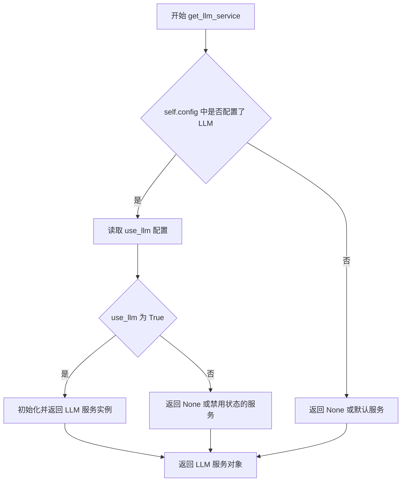

#### 带注释源码

```python
def get_llm_service(self):
    """
    从配置中获取 LLM 服务实例。
    
    该方法检查配置中是否启用了 LLM 功能（use_llm），
    如果启用则返回相应的 LLM 服务实例，否则返回 None。
    
    返回值:
        LLM 服务实例或 None
        
    使用示例:
        llm_service = config_parser.get_llm_service()
        # 在转换器中使用
        converter = ExtractionConverter(
            ...,
            llm_service=llm_service
        )
    """
    # 检查配置中是否启用了 LLM
    # 从 self.config (或 self.config_dict) 读取 use_llm 字段
    use_llm = self.config.get("use_llm", False)
    
    # 如果未启用 LLM，返回 None
    if not use_llm:
        return None
    
    # 如果启用了 LLM，初始化并返回 LLM 服务
    # 具体实现取决于 marker.config.parser 模块中的配置
    llm_service = LLMService(config=self.config)
    
    return llm_service
```

**注**：由于 `ConfigParser` 类定义在外部模块 `marker.config.parser` 中，以上源码为基于代码上下文的合理推断。实际实现可能包含更多配置细节，如模型选择、API 端点设置、超参数配置等。

## 关键组件


### 张量索引与惰性加载

该组件负责从上传的PDF文件中按需加载特定页面的图像，支持懒加载模式，仅在用户选择特定页码时才加载对应页面图像，避免一次性加载所有页面导致的内存占用过高。通过`get_page_image`函数配合`page_count`获取总页数，实现按需加载。

### 反量化支持

该组件负责将用户输入的Pydantic Schema代码动态解析为JSON Schema格式。使用`get_root_class`函数从Pydantic代码中提取根类，然后调用`model_json_schema()`方法将Pydantic模型转换为标准JSON Schema，实现Pydantic到JSON Schema的反向量化转换。

### 量化策略

该组件负责配置和执行Marker的提取转换器。通过`ConfigParser`解析配置字典，创建`ExtractionConverter`实例，传入配置字典、模型字典、处理器列表、渲染器和LLM服务等参数，实现对PDF文档的结构化数据提取。支持配置LLM使用、OCR强制执行、现有OCR文本剥离等策略。

### 状态管理

该组件负责管理Streamlit应用的生命周期状态。使用`st.session_state`存储当前文件标识符、渲染后的Pydantic schema和markdown内容，通过文件哈希值检测文件变化并在文件变更时自动清除历史状态，确保每次新文件上传时重置提取状态。

### 错误处理与验证

该组件负责验证用户输入的schema有效性。对于JSON Schema输入，使用`json.loads()`进行语法验证；对于Pydantic Schema输入，使用异常捕获机制处理解析错误，并在UI中通过成功/错误提示反馈给用户，确保只有有效的schema才能被执行。


## 问题及建议


### 已知问题

-   **全局模型加载**：`model_dict = load_models()` 在全局作用域调用，每次脚本加载时都会执行，可能导致启动缓慢且占用内存
-   **类型标注不一致**：`extract_data` 函数返回类型标注为 `(str, Dict[str, Any], dict)` 但实际返回的是 `converter(fname)` 的结果，类型未明确
-   **错误处理缺失**：对 `load_models()`、`parse_args()` 失败情况没有异常处理，若模型加载失败会导致应用崩溃
-   **资源泄漏风险**：直接使用 `in_file.getvalue()` 可能在大文件情况下导致内存溢出，应使用分块读取
-   **会话状态清理不完整**：当上传新文件时，`rendered_pydantic_schema` 没有被清空，可能导致旧schema残留
-   **无效的CLI选项更新**：`cli_options.update()` 直接修改全局 `cli_options` 对象，可能影响后续调用
-   **环境变量设置时机**：环境变量 `PYTORCH_ENABLE_MPS_FALLBACK` 和 `IN_STREAMLIT` 在导入 marker 库之前设置，但顺序和必要性不明确
-   **Schema验证不完整**：Pydantic schema解析失败时仅显示通用错误，未提供具体的字段或语法错误位置

### 优化建议

-   **延迟加载模型**：将 `model_dict` 和 `cli_options` 的初始化移到 `run_marker` 按钮回调中，或使用 `@st.cache_resource` 装饰器缓存模型
-   **完善类型标注**：明确 `extract_data` 的返回类型，使用 Pydantic 的 `BaseModel` 类型或创建专门的返回类型类
-   **添加模型加载错误处理**：在 `load_models()` 周围添加 try-except 块，提供友好的错误提示和降级方案
-   **优化大文件处理**：使用 `in_file.getbuffer()` 替代 `getvalue()`，或分块写入临时文件
-   **统一会话状态管理**：创建一个初始化函数集中管理所有 session_state 变量的初始化和清理
-   **深拷贝CLI选项**：使用 `copy.deepcopy(cli_options)` 创建独立副本再进行修改
-   **添加加载状态指示**：在执行提取操作时显示 `st.spinner()` 提示用户等待
-   **改进Schema解析错误信息**：捕获更详细的异常信息，提供具体的行号和错误位置

## 其它


### 设计目标与约束

本应用旨在为用户提供一个便捷的文档结构化数据提取工具，支持多种文件格式（PDF、PNG、JPG、JPEG、GIF、PPTX、DOCX、XLSX、HTML、EPUB）的上传和解析。核心设计约束包括：1）仅支持结构化提取，需用户提供有效的JSON Schema或Pydantic Schema；2）依赖Marker库进行底层转换和提取；3）作为Streamlit应用，需遵循其单页面无状态运行模式，通过session_state维护状态；4）所有文件处理均在临时目录中进行，不持久化存储用户数据。

### 错误处理与异常设计

代码采用了多层次的错误处理机制。在Schema验证层面，使用try-except捕获json.JSONDecodeError，展示"❌ Invalid JSON"错误提示，并设置schema为None阻止后续流程。在Pydantic解析层面，捕获get_root_class和model_json_schema()可能抛出的异常，展示"❌ Could not parse your schema"错误。在核心提取流程中，使用try-except捕获extract_data执行过程中的所有异常，展示"❌ Extraction failed"错误并输出具体异常信息。此外，在文件上传和页面切换场景中，通过if in_file is None: st.stop()和schema非空检查来控制流程中断，避免无效操作。

### 数据流与状态机

应用的数据流遵循以下路径：用户上传文件 → 生成唯一文件标识符（name_size_hash）→ 检测文件变更并重置状态 → 用户选择页码 → 获取页面图像 → 用户输入Schema（JSON或Pydantic）→ 点击"Run Extraction"按钮 → 创建临时PDF文件 → 调用extract_data函数 → 返回ExtractionOutput对象 → 展示JSON结果并保存原始Markdown。状态机方面，session_state维护三个关键状态：current_file_id用于检测文件变更、rendered_pydantic_schema缓存转换后的JSON Schema、markdown缓存上一次的原始Markdown内容用于增量处理。

### 外部依赖与接口契约

核心依赖包括：streamlit（Web框架）、streamlit_ace（Ace编辑器组件，用于Pydantic Schema编辑）、pydantic（数据验证）、marker库（转换和提取引擎，含ExtractionConverter、ConfigParser等组件）、json（Schema解析）、os/tempfile（文件操作）。load_models()返回的model_dict作为全局模型缓存，parse_args()返回的cli_options作为默认配置字典。extract_data函数接受fname（文件路径）、config（配置字典）、schema（JSON Schema字符串）、markdown（可选的已有Markdown）四个参数，返回(str, Dict[str, Any], dict)元组，实际返回的是ExtractionOutput对象。

### 安全性考虑

代码存在安全隐患：Pydantic Schema解析使用get_root_class执行用户输入的Python代码，在"Warning: This can execute untrusted code entered into the schema panel"提示中已明确指出。优化方向包括：1）使用受限的Python执行环境（如PyPy's sandbox或自定义AST解析器限制危险操作）；2）添加代码长度和复杂度限制；3）考虑仅支持JSON Schema输入，移除Pydantic解析功能；4）添加网络安全域隔离。此外，临时文件处理使用了安全的tempfile.TemporaryDirectory()，在with块结束自动清理。

### 性能考虑与优化空间

当前性能瓶颈包括：1）load_models()在每次页面加载时执行，应移至session_state缓存；2）page_count()对每次文件变更都重新计算；3）extract_data中config["pdftext_workers"] = 1强制单线程，可根据文件页数动态调整；4）每次运行都重新创建Converter实例，应缓存复用；5）图像获取使用get_page_image可能重复读取文件。优化建议：将model_dict和converter实例化结果存入session_state；实现配置缓存机制；支持多页批量提取；添加进度条显示。

### 用户交互流程

应用采用双列布局：左侧列显示文档页面和页码选择器，右侧列包含两个Tab（JSON Schema和Pydantic Schema）。侧边栏提供文件上传、运行按钮和三个配置选项（Use LLM、Force OCR、Strip existing OCR）。流程引导通过条件提示实现：无Schema时显示"Please provide a schema"；文件变更时自动清空markdown；Pydantic编辑时提示点击渲染按钮。

### 配置管理机制

配置通过多层合并生成：parse_args()提供CLI默认配置 → 用户通过侧边栏checkbox覆盖部分选项 → extract_data函数中硬编码设置pdftext_workers=1和page_schema → ConfigParser类解析配置字典并生成最终配置。这种方式存在配置优先级不明确的问题，建议使用明确的配置覆盖顺序或配置schema进行验证。
    