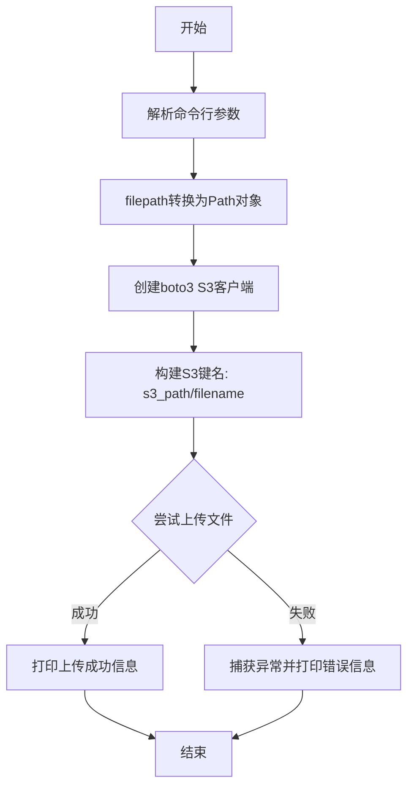
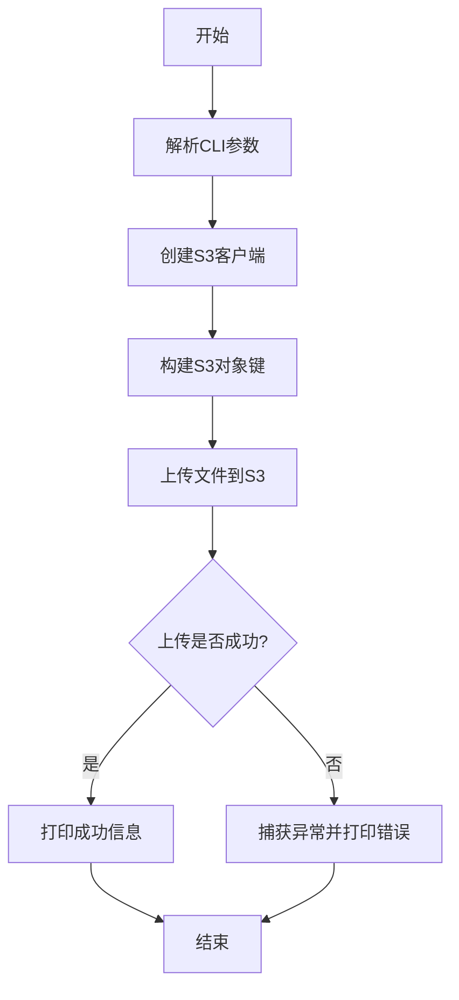

# `marker\marker\scripts\file_to_s3.py` 详细设计文档

这是一个基于Click框架和boto3库构建的命令行工具，用于将本地文件上传到S3兼容的云存储服务（R2 Cloudflare Storage），支持自定义bucket名称、访问密钥和存储路径。

## 整体流程



## 类结构

```
无类层次结构（脚本文件）
└── main (Click命令函数)
```

## 全局变量及字段


### `S3_API_URL`
    
R2 Cloudflare Storage的API端点URL

类型：`str`
    


    

## 全局函数及方法


### `main`

Click命令行主函数，负责将本地文件上传到指定的S3存储桶，并输出上传结果。

参数：

- `filepath`：`str`，要上传的本地文件路径（通过@click.argument接收）
- `s3_path`：`str`，S3目标路径前缀（通过@click.argument接收）
- `bucket_name`：`str`，S3存储桶名称，默认为"datalab"（通过@click.option接收）
- `access_key_id`：`str`，AWS访问密钥ID，用于S3认证，默认为"<access_key_id>"（通过@click.option接收）
- `access_key_secret`：`str`，AWS访问密钥密码，用于S3认证，默认为"<access_key_secret>"（通过@click.option接收）

返回值：`None`，函数无显式返回值，仅通过print输出上传状态信息

#### 流程图

```mermaid
flowchart TD
    A[开始] --> B[接收命令行参数: filepath, s3_path, bucket_name, access_key_id, access_key_secret]
    B --> C[将filepath转换为Path对象]
    C --> D[创建S3客户端: boto3.client]
    D --> E[构建S3键名: s3_key = f"{s3_path}/{filepath.name}"]
    E --> F{尝试上传文件}
    F -->|成功| G[继续执行]
    F -->|异常| H[捕获异常并打印错误信息]
    H --> G
    G --> I[打印上传成功信息: 'Uploaded files to {s3_path}']
    I --> J[结束]
    
    style F fill:#f9f,stroke:#333,stroke-width:2px
    style H fill:#ff6,stroke:#333,stroke-width:2px
```

#### 带注释源码

```
import json
import shutil
import datetime
from pathlib import Path
import boto3

from huggingface_hub import snapshot_download

import click

# S3 API端点URL，使用Cloudflare R2存储
S3_API_URL = "https://1afbe4656a6b40d982ab5e730a39f6b9.r2.cloudflarestorage.com"

# 定义Click命令行命令，help参数提供命令帮助信息
@click.command(help="Uploads files to an S3 bucket")
# filepath和s3_path作为位置参数（必须参数）
@click.argument("filepath", type=str)
@click.argument("s3_path", type=str)
# 以下为可选参数，带默认值
@click.option("--bucket_name", type=str, default="datalab")
@click.option("--access_key_id", type=str, default="<access_key_id>")
@click.option("--access_key_secret", type=str, default="<access_key_secret>")

def main(filepath: str, s3_path: str, bucket_name: str, access_key_id: str, access_key_secret: str):
    """
    主函数：将文件上传到S3存储桶
    
    参数:
        filepath: 要上传的本地文件路径
        s3_path: S3目标路径前缀
        bucket_name: S3存储桶名称
        access_key_id: AWS访问密钥ID
        access_key_secret: AWS访问密钥密码
    """
    # 将字符串路径转换为Path对象，便于获取文件名
    filepath = Path(filepath)
    
    # 创建S3客户端，配置端点、认证信息和区域
    s3_client = boto3.client(
        's3',
        endpoint_url=S3_API_URL,          # Cloudflare R2存储端点
        aws_access_key_id=access_key_id,  # 访问密钥ID
        aws_secret_access_key=access_key_secret,  # 访问密钥密码
        region_name="enam"                 # 区域名称（非标准值）
    )

    # 构建完整的S3对象键名：路径前缀 + 文件名
    s3_key = f"{s3_path}/{filepath.name}"

    try:
        # 执行文件上传操作
        s3_client.upload_file(
            str(filepath),    # 本地文件路径（需转换为字符串）
            bucket_name,      # 目标存储桶名称
            s3_key            # S3对象键名
        )
    except Exception as e:
        # 捕获上传过程中的异常并打印错误信息
        print(f"Error uploading {filepath}: {str(e)}")

    # 打印上传完成提示信息
    print(f"Uploaded files to {s3_path}")

# 程序入口点
if __name__ == "__main__":
    main()
```

## 关键组件


### 核心功能概述

该脚本是一个命令行工具，用于将本地文件上传到Cloudflare R2（S3兼容）存储桶，通过boto3与S3 API交互完成文件传输。

### 文件整体运行流程

1. 程序入口调用`main()`函数
2. Click框架解析命令行参数和选项
3. 创建boto3 S3客户端，配置endpoint、凭证和区域
4. 构建S3对象键路径（s3_path + filename）
5. 调用`upload_file`方法上传文件
6. 打印上传结果或捕获异常输出错误信息

### 全局变量和全局函数详细信息

#### S3_API_URL

- **类型**: str
- **描述**: Cloudflare R2存储服务的API端点URL

#### main()

- **参数**:
  - `filepath`: str, 要上传的本地文件路径
  - `s3_path`: str, S3存储桶中的目标路径
  - `bucket_name`: str, 存储桶名称（默认"datalab"）
  - `access_key_id`: str, AWS访问密钥ID
  - `access_key_secret`: str, AWS访问密钥密文
- **返回值**: None
- **描述**: CLI命令主函数，负责协调整个上传流程
- **流程图**:


#### 源码

```python
@click.command(help="Uploads files to an S3 bucket")
@click.argument("filepath", type=str)
@click.argument("s3_path", type=str)
@click.option("--bucket_name", type=str, default="datalab")
@click.option("--access_key_id", type=str, default="<access_key_id>")
@click.option("--access_key_secret", type=str, default="<access_key_secret>")
def main(filepath: str, s3_path: str, bucket_name: str, access_key_id: str, access_key_secret: str):
    filepath = Path(filepath)
    # Upload the files to S3
    s3_client = boto3.client(
        's3',
        endpoint_url=S3_API_URL,
        aws_access_key_id=access_key_id,
        aws_secret_access_key=access_key_secret,
        region_name="enam"
    )

    s3_key = f"{s3_path}/{filepath.name}"

    try:
        s3_client.upload_file(
            str(filepath),
            bucket_name,
            s3_key
        )
    except Exception as e:
        print(f"Error uploading {filepath}: {str(e)}")

    print(f"Uploaded files to {s3_path}")
```

### 关键组件信息

#### CLI参数解析模块

使用Click框架处理命令行参数，包括文件路径、S3路径、存储桶名称和访问凭证。

#### S3客户端配置模块

配置boto3 S3客户端，连接到Cloudflare R2存储服务，包含端点URL、AWS凭证和区域设置。

#### 文件上传模块

执行实际的文件上传操作，将本地文件传输到指定的S3存储桶路径。

### 潜在技术债务与优化空间

1. **安全风险**: 硬编码的默认访问密钥和密钥占位符，不应出现在生产代码中
2. **未使用的导入**: `json`、`shutil`、`datetime`、`huggingface_hub`被导入但未使用
3. **错误处理不完善**: 仅打印错误信息，未提供重试机制或退出码
4. **缺少日志记录**: 使用print而非标准日志模块
5. **无验证逻辑**: 未验证文件是否存在或权限是否足够
6. **配置硬编码**: S3 API URL和区域名称硬编码，应移至配置环境变量

### 其它项目

#### 设计目标与约束

- 目标：提供简单的CLI工具将文件上传到S3兼容存储
- 约束：依赖boto3和click库，需有效AWS/R2凭证

#### 错误处理与异常设计

- 捕获通用Exception并打印错误信息
- 未区分不同异常类型，错误恢复能力有限

#### 外部依赖与接口契约

- boto3: AWS S3 SDK
- click: CLI框架
- Cloudflare R2: S3兼容存储服务


## 问题及建议


### 已知问题

-   **硬编码凭证默认值**：access_key_id 和 access_key_secret 使用了占位符默认值 `<access_key_id>` 和 `<access_key_secret>`，存在严重安全风险
-   **硬编码的S3 API URL**：S3_API_URL 直接写在代码中，缺乏灵活性
-   **region_name拼写错误**：region_name="enam" 疑似拼写错误，且Cloudflare R2不需要region
-   **异常处理不完善**：仅打印错误信息后继续执行，无法让调用者获知真实的执行结果状态
-   **使用print而非日志系统**：缺乏日志级别控制，不利于生产环境调试
-   **上传前未检查文件存在性**：filepath 可能不存在或不是有效文件，导致 upload_file 抛出异常
-   **s3_client 资源未正确释放**：boto3.client 创建后未显式关闭
-   **缺少类型注解和返回值说明**：main 函数无返回类型，无法判断上传是否成功
-   **filepath 未经 Path 规范化**：直接使用原始 filepath，未进行绝对路径转换或符号链接解析
-   **模块导入顺序不符合 PEP 8**：标准库、第三方库、本地导入未分组
-   **无上传进度反馈**：大文件上传时用户无法得知进度
-   **s3_path 格式未验证**：未检查 s3_path 是否以斜杠开头或包含非法字符
-   **函数缺少文档字符串**：main 函数没有 docstring

### 优化建议

-   使用环境变量或配置管理工具存储敏感凭证，移除硬编码的默认值
-   将 S3_API_URL 改为可配置的选项或环境变量
-   移除无效的 region_name 参数（R2 不需要）
-   添加文件存在性检查，使用 filepath.exists() 验证后再上传
-   使用 Python logging 模块替代 print，设置合理的日志级别
-   为 main 函数添加返回类型（如 bool），明确表示成功/失败
-   使用 with 语句或显式关闭确保 s3_client 资源释放
-   在上传前对 filepath 调用 resolve() 规范化路径
-   重新组织导入顺序：标准库 → 第三方库 → 本地导入
-   对于大文件，考虑使用 boto3 的 MultipartUpload 或添加进度回调
-   验证 s3_path 格式合法性，防止路径注入或格式错误
-   为 main 函数添加详细的 docstring 说明参数和返回值含义

## 其它


### 设计目标与约束

该工具的核心设计目标是提供一个简单的命令行接口，用于将本地文件上传到S3兼容的存储服务（Cloudflare R2）。主要约束包括：1) 仅支持单文件上传；2) 依赖boto3和Click框架；3) 使用硬编码的S3 API端点；4) 区域名称设置为"enam"为固定值。

### 错误处理与异常设计

代码中的错误处理采用基本的try-except捕获机制，捕获所有Exception类型并打印错误信息。主要问题：1) 异常类型过于宽泛，应区分文件不存在、网络错误、S3权限错误等；2) 错误后程序继续执行，缺乏退出码设置；3) 缺少重试机制应对临时性网络故障；4) 上传失败后缺乏明确的失败状态反馈。

### 数据流与状态机

数据流：用户输入(filepath, s3_path) → Path对象转换 → boto3客户端初始化 → S3 Key拼接 → upload_file调用 → 状态输出。无复杂状态机，仅存在"初始"和"完成/失败"两种状态。数据验证在Click参数绑定阶段完成，类型检查较弱。

### 外部依赖与接口契约

主要依赖：1) boto3 - S3客户端；2) click - CLI框架；3) pathlib.Path - 路径处理；4) datetime,json,shutil - 未使用但已导入。S3接口契约：使用R2 Cloudflare Storage API，endpoint_url固定，需提供access_key_id和access_key_secret认证信息，bucket_name可配置。

### 安全性考虑

存在严重安全隐患：1) access_key_id和access_key_secret使用默认值"<access_key_id>"和"<access_key_secret>"，生产环境必须替换；2) 凭据通过命令行参数传递，会被记录到shell历史；3) 缺少HTTPS强制使用；4) 凭据未进行环境变量或配置文件管理。建议使用IAM角色或环境变量替代命令行传参。

### 配置管理

当前配置方式分散：1) S3 API URL为常量硬编码；2) bucket_name、access_key_id、access_key_secret通过命令行选项传入；3) region_name为固定值"enam"。建议：增加配置文件支持(yaml/json)，环境变量优先级高于配置文件，敏感信息使用密钥管理服务。

### 性能考虑

当前实现为单线程同步上传，大文件可能阻塞。建议：1) 对于大文件考虑分片上传；2) 可添加并发上传支持；3) 缺少进度显示；4) 未使用huggingface_hub的snapshot_download功能，该导入为冗余。

### 测试策略

代码缺乏测试覆盖。建议：1) 单元测试使用mock boto3客户端；2) 测试文件不存在场景；3) 测试S3权限不足场景；4) 集成测试使用本地MinIO或fake-s3；5) CLI参数解析测试。

### 日志与监控

当前仅使用print输出基本状态信息，缺少结构化日志。建议：1) 使用Python logging模块替代print；2) 增加日志级别配置；3) 上传成功后返回结构化JSON便于后续脚本处理；4) 建议集成监控系统追踪上传成功率和耗时指标。

### 部署要求

部署依赖：1) Python 3.8+；2) boto3、click、pathlib（标准库）安装；3) AWS/R2凭据配置；4) 执行权限设置。建议：打包为独立可执行文件或Docker容器，避免依赖冲突。

### 边界条件与输入验证

当前输入验证不足：1) filepath未检查文件是否存在；2) s3_path未验证格式规范；3) bucket_name未检查命名规则；4) 空字符串未做处理；5) 大文件未做大小限制。建议增加：文件存在性检查、路径格式校验、文件大小限制、文件名安全检查（防止路径遍历攻击）。

    