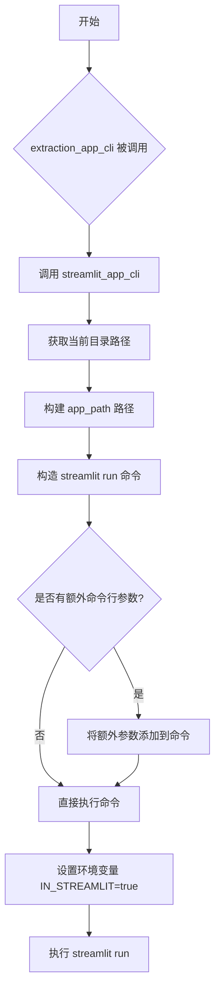
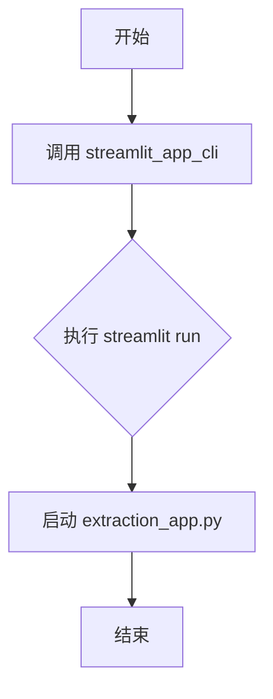

# `marker\marker\scripts\run_streamlit_app.py` 详细设计文档

该模块提供两个命令行接口函数，用于启动 Streamlit Web 应用。其中 streamlit_app_cli 是通用的 Streamlit 应用启动器，而 extraction_app_cli 是专门用于启动数据提取应用的包装器。

## 整体流程



## 类结构

```
无类结构 (模块仅包含函数)
```

## 全局变量及字段


### `argv`
    
获取命令行参数列表（不含脚本名）

类型：`list[str]`
    


### `cur_dir`
    
当前脚本所在目录的绝对路径

类型：`str`
    


### `app_path`
    
Streamlit应用的完整文件路径

类型：`str`
    


### `cmd`
    
启动Streamlit应用的命令列表

类型：`list[str]`
    


    

## 全局函数及方法


### `streamlit_app_cli`

该函数是一个 Streamlit 应用的命令行启动器，通过 subprocess 调用 streamlit 可执行文件来运行指定的 Python Web 应用，并支持传递额外的命令行参数以及设置环境变量 `IN_STREAMLIT` 用于标识运行在 Streamlit 环境中。

参数：

- `app_name`：`str`，要运行的 Streamlit 应用文件名，默认为 "streamlit_app.py"

返回值：`None`，该函数无返回值，通过 subprocess.run 执行外部命令

#### 流程图

```mermaid
flowchart TD
    A[开始] --> B[获取命令行参数 sys.argv[1:]]
    B --> C[获取当前文件所在目录 cur_dir]
    C --> D[拼接完整应用路径 app_path]
    D --> E[构建 streamlit 命令列表 cmd]
    E --> F{判断是否有额外参数}
    F -->|是| G[追加 -- 和额外参数到命令]
    F -->|否| H[跳过]
    G --> I[设置环境变量 IN_STREAMLIT=true]
    H --> I
    I --> J[执行 subprocess.run]
    J --> K[结束]
```

#### 带注释源码

```python
import subprocess
import os
import sys


def streamlit_app_cli(app_name: str = "streamlit_app.py"):
    """
    启动指定的 Streamlit 应用
    
    参数:
        app_name: 要运行的 Streamlit 应用文件名，默认为 "streamlit_app.py"
    """
    # 获取命令行参数（排除脚本本身）
    argv = sys.argv[1:]
    
    # 获取当前脚本所在的绝对目录路径
    cur_dir = os.path.dirname(os.path.abspath(__file__))
    
    # 拼接完整的应用文件路径
    app_path = os.path.join(cur_dir, app_name)
    
    # 构建 streamlit 运行命令
    cmd = [
        "streamlit",           # 命令行工具名称
        "run",                 # run 子命令
        app_path,              # 要运行的 Python 应用文件
        "--server.fileWatcherType", "none",      # 禁用文件监视
        "--server.headless",  "true",            # 无头模式运行
    ]
    
    # 如果有额外的命令行参数，追加到命令中
    if argv:
        cmd += ["--"] + argv   # 使用 -- 分隔 streamlit 参数和应用参数
    
    # 执行 streamlit 命令，设置环境变量 IN_STREAMLIT=true
    subprocess.run(cmd, env={**os.environ, "IN_STREAMLIT": "true"})
```


### `extraction_app_cli`

该函数是一个简化的命令行入口点，用于启动 Streamlit 的数据提取应用程序。它通过调用 `streamlit_app_cli` 函数并指定应用程序文件名为 "extraction_app.py" 来运行 Streamlit 应用。

参数：无

返回值：`None`，无返回值（该函数直接调用 `streamlit_app_cli` 并返回其执行结果）

#### 流程图



#### 带注释源码

```python
def extraction_app_cli():
    """
    启动 extraction_app.py 的 Streamlit 应用程序。
    
    该函数是一个简化的入口点，封装了对 streamlit_app_cli 的调用，
    专门用于启动数据提取相关的 Streamlit 应用。
    
    参数：
        无
        
    返回值：
        None：无返回值，直接调用 streamlit_app_cli 函数
    """
    # 调用 streamlit_app_cli 函数，传入 extraction_app.py 作为应用文件名
    # 这将启动 Streamlit 服务器并运行 extraction_app.py
    streamlit_app_cli("extraction_app.py")
```

## 关键组件


### streamlit_app_cli 函数

核心CLI启动函数，负责配置和执行Streamlit应用进程

### extraction_app_cli 函数

便捷调用函数，指定启动extraction_app.py应用

### 命令行参数处理

解析sys.argv获取额外命令行参数并传递给Streamlit应用

### Streamlit运行配置

配置Streamlit运行参数，包括禁用文件监视器和headless模式

### 环境变量管理

设置IN_STREAMLIT环境变量以标识运行在Streamlit环境中


## 问题及建议


### 已知问题

- **错误处理缺失**：未检查 `app_path` 文件是否存在，未捕获文件读取异常，未检查 `subprocess.run` 的返回码
- **路径安全风险**：直接拼接路径未进行路径遍历检查，可能存在路径注入风险
- **硬编码配置**：Streamlit 启动参数（`--server.fileWatcherType none`、`--server.headless true`）硬编码，缺乏配置灵活性
- **环境变量泄露风险**：`env={**os.environ, "IN_STREAMLIT": "true"}` 会继承全部系统环境变量，可能包含敏感信息
- **返回值类型不明确**：`streamlit_app_cli` 和 `extraction_app_cli` 均无返回类型注解，且 `subprocess.run` 的执行结果未被利用
- **可测试性差**：直接调用 `subprocess.run` 和 `os.path` 方法，难以进行单元测试
- **日志缺失**：无任何日志输出，无法追踪执行状态和调试问题
- **类型提示不完整**：`extraction_app_cli` 函数无参数类型注解

### 优化建议

- 添加文件存在性检查和异常捕获逻辑，使用 `pathlib.Path` 替代 `os.path` 提升安全性
- 为 `subprocess.run` 添加 `check=True` 或显式检查 `returncode`，确保应用启动失败时抛出异常
- 将 Streamlit 参数抽取为可选配置项，支持通过参数或配置文件自定义
- 使用 `env` 参数时显式控制环境变量，移除不必要的敏感变量或使用最小化环境变量
- 为所有函数添加完整的类型注解和返回值类型说明
- 引入日志模块（`logging`），记录应用启动信息和错误
- 考虑将 `subprocess.run` 调用封装为可注入依赖，便于单元测试时 mock

## 其它


### 设计目标与约束

**设计目标**：提供一个命令行工具函数，用于通过subprocess调用streamlit命令启动指定的Streamlit应用，并配置服务器为无文件监视器和headless模式，同时支持传递额外参数给Streamlit应用。

**约束**：
- 依赖本地安装的streamlit命令行工具
- 应用文件必须位于脚本同目录下
- 环境变量IN_STREAMLIT会被设置为"true"以标识运行在Streamlit环境中
- 仅支持Unix/Linux/Mac系统（subprocess.run的cmd参数为列表形式）

### 错误处理与异常设计

**subprocess.run调用**：未捕获subprocess.CalledProcessError或其他异常，如果streamlit命令不存在或执行失败，异常将直接向上传播。

**文件路径检查**：未检查app_path指向的文件是否存在，如果文件不存在，streamlit命令将失败并返回错误。

**建议改进**：
- 添加文件存在性检查，在app_path不存在时抛出明确的FileNotFoundError
- 捕获subprocess异常并提供友好的错误信息
- 考虑添加streamlit命令是否安装的检查

### 外部依赖与接口契约

**外部依赖**：
- `subprocess`：用于执行外部streamlit命令
- `os`：用于路径操作和环境变量处理
- `sys`：用于获取命令行参数
- `streamlit`：必须全局安装的外部CLI工具

**接口契约**：
- `streamlit_app_cli(app_name: str)`: 接收可选的app_name参数，默认"streamlit_app.py"
- `extraction_app_cli()`: 无参数，固定调用streamlit_app_cli启动extraction_app.py

### 性能考虑

- 每次调用都会启动新的Streamlit子进程，无缓存或连接池机制
- subprocess.run为阻塞调用，会等待Streamlit进程结束
- 无性能优化需求，属于轻量级CLI封装

### 安全性考虑

- 直接使用sys.argv[1:]拼接命令参数，可能存在命令注入风险（虽然在此场景下风险较低，因为参数传递给Streamlit应用）
- 环境变量会被完整继承（os.environ），仅额外添加IN_STREAMLIT
- 建议对argv参数进行验证或 sanitise

### 测试策略

- 单元测试：mock subprocess.run和os.path函数，验证参数构造正确性
- 集成测试：需要mock streamlit命令或使用测试用的小型streamlit应用
- 路径解析测试：验证不同目录下的路径计算正确性

    