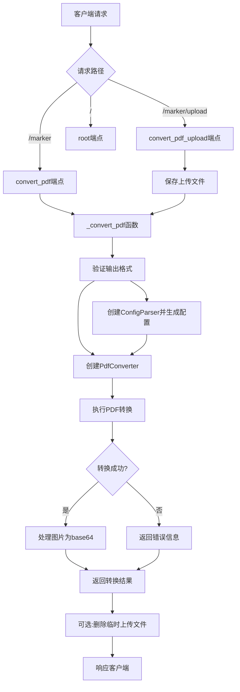
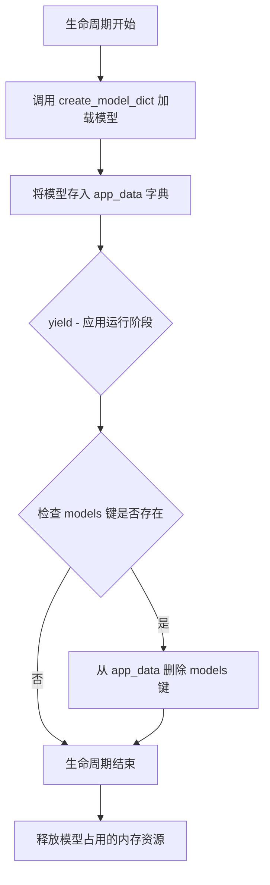
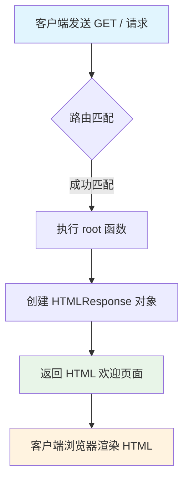
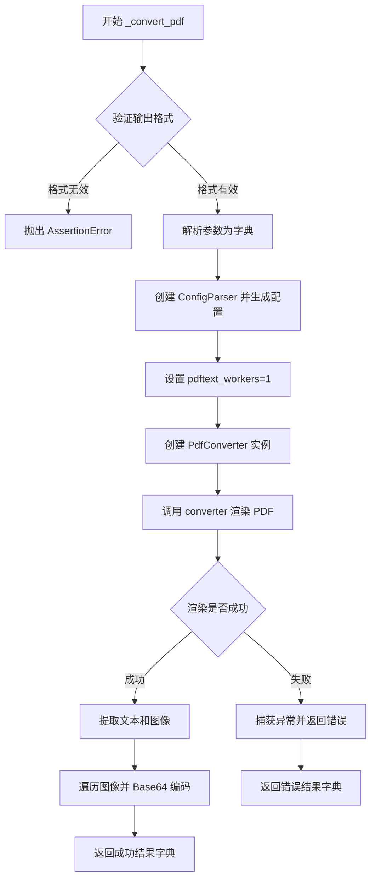
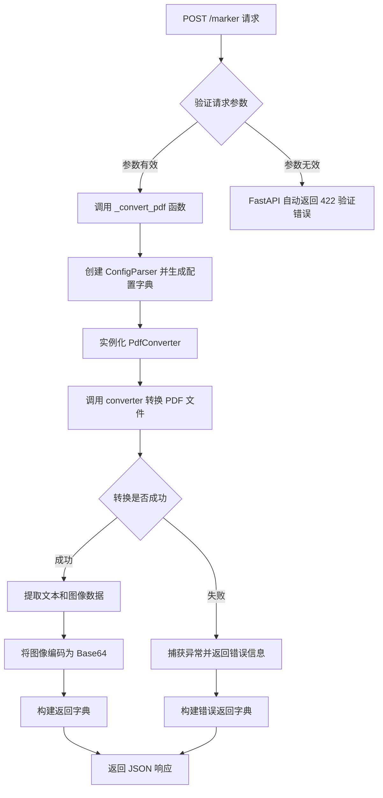
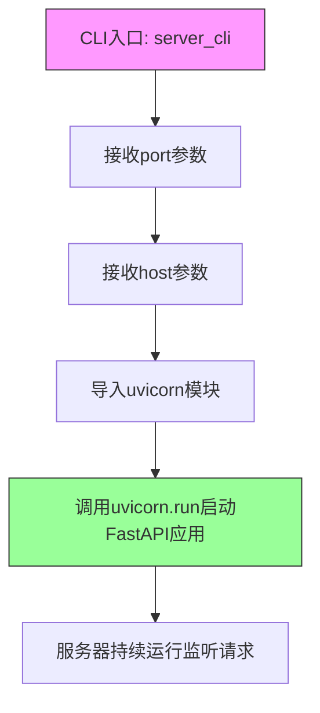
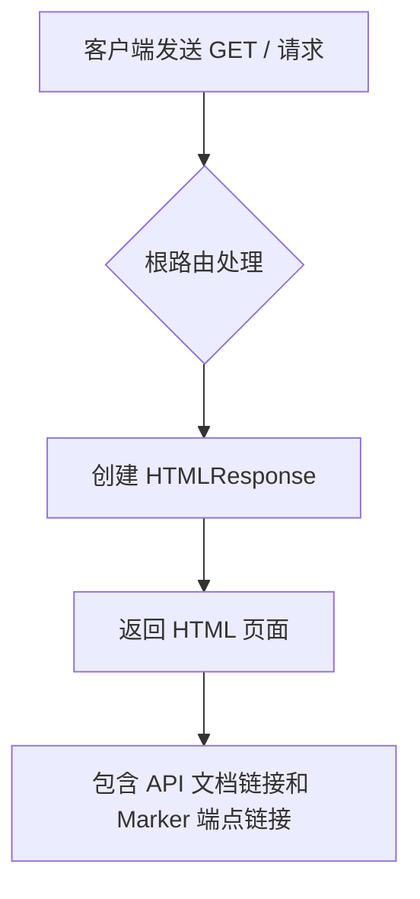
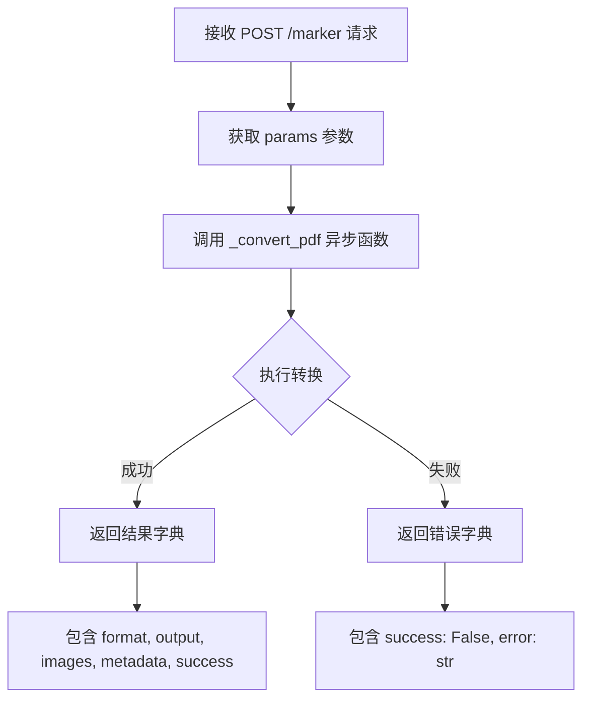
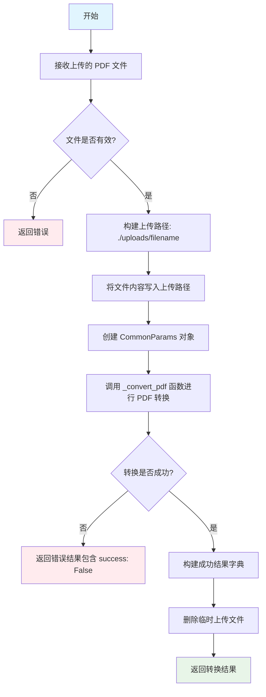

# `marker\marker\scripts\server.py` 详细设计文档

这是一个基于FastAPI的PDF转Markdown/JSON/HTML的Web服务应用程序，提供REST API接口将PDF文件转换为指定格式，支持直接文件路径转换和文件上传两种方式，并集成了marker库进行PDF渲染和OCR处理。

## 整体流程



## 类结构

```
FastAPI (Web框架)
├── app [FastAPI实例]
├── CommonParams (Pydantic BaseModel)
│   ├── filepath: Optional[str]
│   ├── page_range: Optional[str]
│   ├── force_ocr: bool
│   ├── paginate_output: bool
│   └── output_format: str
└── 辅助函数
    ├── lifespan (生命周期管理)
    ├── root (根路由)
    ├── _convert_pdf (核心转换逻辑)
    ├── convert_pdf (POST端点)
    ├── convert_pdf_upload (文件上传端点)
    └── server_cli (CLI命令)
```

## 全局变量及字段


### `app_data`
    
存储应用运行时数据(模型等)

类型：`dict`
    


### `UPLOAD_DIRECTORY`
    
上传文件保存目录('./uploads')

类型：`str`
    


### `CommonParams.filepath`
    
PDF文件路径

类型：`Optional[str]`
    


### `CommonParams.page_range`
    
要转换的页面范围

类型：`Optional[str]`
    


### `CommonParams.force_ocr`
    
是否强制OCR

类型：`bool`
    


### `CommonParams.paginate_output`
    
是否分页输出

类型：`bool`
    


### `CommonParams.output_format`
    
输出格式(markdown/json/html)

类型：`str`
    
    

## 全局函数及方法


### `lifespan`

这是一个异步上下文管理器，用于管理 FastAPI 应用的启动和关闭生命周期，在应用启动时加载机器学习模型，在应用关闭时卸载模型以释放资源。

参数：

- `app`：`FastAPI`，FastAPI 应用实例，用于访问应用状态

返回值：`AsyncGenerator[None, None]`，异步生成器，作为异步上下文管理器使用

#### 流程图



#### 带注释源码

```python
@asynccontextmanager
async def lifespan(app: FastAPI):
    """
    异步上下文管理器，用于管理 FastAPI 应用的启动和关闭生命周期。
    
    启动阶段：
        - 调用 create_model_dict() 创建并加载机器学习模型
        - 将模型存储到 app_data 字典中供后续请求使用
    
    关闭阶段：
        - 检查 app_data 中是否存在 models 键
        - 如果存在则删除，释放模型占用的内存资源
    """
    # 启动阶段：加载模型
    app_data["models"] = create_model_dict()

    # 应用运行阶段，其他路由处理器可以访问 app_data["models"]
    yield

    # 关闭阶段：清理模型资源
    if "models" in app_data:
        del app_data["models"]
```


### `root`

该函数是 FastAPI 应用的根路由（`GET /`），用于返回 HTML 欢迎页面，提供 API 文档链接和 marker 服务入口链接。

参数：暂无参数

返回值：`HTMLResponse`，返回一个包含 HTML 内容的响应对象，显示欢迎信息及 API 导航链接。

#### 流程图



#### 带注释源码

```python
@app.get("/")
async def root():
    """
    根路由处理函数
    
    处理客户端对根路径 "/" 的 GET 请求，
    返回一个包含 API 欢迎信息和导航链接的 HTML 页面。
    
    Returns:
        HTMLResponse: 包含欢迎 HTML 的响应对象
    """
    return HTMLResponse(
        """
<h1>Marker API</h1>
<ul>
    <li><a href="/docs">API Documentation</a></li>
    <li><a href="/marker">Run marker (post request only)</a></li>
</ul>
"""
    )
```

---

### 设计分析

| 项目 | 说明 |
|------|------|
| **路由装饰器** | `@app.get("/")` - 将函数注册为 GET 方法的根路由 |
| **函数类型** | 异步函数 (`async def`)，符合 FastAPI 异步编程范式 |
| **响应类型** | `starlette.responses.HTMLResponse`，专门用于返回 HTML 内容 |
| **功能定位** | 简单的信息展示路由，提供 API 文档入口 |

### 技术债务与优化建议

1. **硬编码 HTML 字符串** - HTML 内容直接写在代码中，建议抽离为独立模板文件或配置
2. **缺乏国际化支持** - 欢迎页面仅支持英文，可考虑添加多语言支持
3. **无版本信息** - 建议在欢迎页显示当前 API 版本号
4. **无健康检查端点** - 可考虑添加 `/health` 端点用于服务监控


### `_convert_pdf`

核心PDF转换异步函数，负责解析配置、初始化转换器、执行PDF渲染，并将渲染结果（文本、图像、元数据）进行编码处理后返回。

参数：

- `params`：`CommonParams`，包含PDF转换所需的全部配置参数（如文件路径、页面范围、输出格式等）

返回值：`dict`，返回包含转换结果或错误信息的字典，包含`success`（布尔值）、`format`（输出格式）、`output`（转换后的文本内容）、`images`（Base64编码的图像字典）、`metadata`（渲染元数据）或`error`（错误信息）。

#### 流程图



#### 带注释源码

```python
async def _convert_pdf(params: CommonParams):
    """
    核心 PDF 转换函数
    
    参数:
        params: CommonParams 对象，包含转换所需的配置参数
    
    返回:
        包含转换结果或错误信息的字典
    """
    
    # 验证输出格式是否合法
    assert params.output_format in ["markdown", "json", "html", "chunks"], (
        "Invalid output format"
    )
    
    try:
        # Step 1: 将参数模型转换为字典
        options = params.model_dump()
        
        # Step 2: 使用配置解析器生成完整配置
        config_parser = ConfigParser(options)
        config_dict = config_parser.generate_config_dict()
        
        # Step 3: 覆盖 pdftext_workers 为 1（单线程处理）
        config_dict["pdftext_workers"] = 1
        
        # Step 4: 创建 PDF 转换器实例
        converter_cls = PdfConverter
        converter = converter_cls(
            config=config_dict,
            artifact_dict=app_data["models"],           # 预加载的模型字典
            processor_list=config_parser.get_processors(),  # 处理器列表
            renderer=config_parser.get_renderer(),       # 渲染器
            llm_service=config_parser.get_llm_service(), # LLM 服务
        )
        
        # Step 5: 执行 PDF 渲染转换
        rendered = converter(params.filepath)
        
        # Step 6: 从渲染结果中提取文本和图像
        text, _, images = text_from_rendered(rendered)
        metadata = rendered.metadata
        
    except Exception as e:
        # 异常捕获：记录堆栈并返回错误信息
        traceback.print_exc()
        return {
            "success": False,
            "error": str(e),
        }

    # Step 7: 将图像编码为 Base64 格式
    encoded = {}
    for k, v in images.items():
        byte_stream = io.BytesIO()
        # 按配置格式保存图像
        v.save(byte_stream, format=settings.OUTPUT_IMAGE_FORMAT)
        # Base64 编码并解码为 UTF-8 字符串
        encoded[k] = base64.b64encode(byte_stream.getvalue()).decode(
            settings.OUTPUT_ENCODING
        )

    # Step 8: 返回成功结果
    return {
        "format": params.output_format,
        "output": text,          # 转换后的文本内容
        "images": encoded,       # Base64 编码的图像字典
        "metadata": metadata,    # PDF 元数据
        "success": True,
    }
```


### `convert_pdf`

`convert_pdf` 是 FastAPI 的 POST /marker 端点，接收 CommonParams 参数（包含文件路径、页码范围、OCR 选项、分页选项和输出格式），调用内部函数 `_convert_pdf` 执行实际的 PDF 转换逻辑，并将转换结果（文本、图像、元数据）以 JSON 格式返回给客户端。

参数：

- `params`：`CommonParams`，FastAPI 端点的请求参数模型，包含文件路径、页码范围、OCR 标志、分页选项和输出格式等配置

返回值：`dict`，包含转换结果的成功状态、格式、输出文本、Base64 编码的图像字典和元数据

#### 流程图



#### 带注释源码

```python
# 定义 POST /marker 端点，接收 CommonParams 模型作为请求体
@app.post("/marker")
async def convert_pdf(params: CommonParams):
    """
    Marker PDF 转换 API 的主端点。
    
    接收 PDF 转换参数，调用内部转换逻辑，并返回转换结果。
    该端点支持通过文件路径转换 PDF 文件。
    
    参数:
        params: CommonParams 模型实例，包含以下字段:
            - filepath: PDF 文件的路径
            - page_range: 要转换的页码范围（可选）
            - force_ocr: 是否强制对所有页面进行 OCR（默认 False）
            - paginate_output: 是否分页输出（默认 False）
            - output_format: 输出格式，可以是 'markdown'、'json'、'html' 或 'chunks'（默认 'markdown'）
    
    返回:
        包含转换结果的字典:
            - success: 转换是否成功的布尔值
            - format: 实际使用的输出格式
            - output: 转换后的文本内容
            - images: Base64 编码的图像字典
            - metadata: PDF 元数据
            - error: 如果失败，包含错误信息字符串
    """
    # 调用异步内部函数执行实际的 PDF 转换逻辑
    # 直接返回 _convert_pdf 的结果，由 FastAPI 自动序列化为 JSON 响应
    return await _convert_pdf(params)
```


### `convert_pdf_upload`

这是一个 FastAPI POST 端点，用于通过上传 PDF 文件进行转换。端点接收上传的 PDF 文件及转换参数，将文件保存到临时目录，调用内部 `_convert_pdf` 函数执行转换，最后返回转换结果并清理临时文件。

参数：

- `page_range`：`Optional[str]`，页面范围，指定要转换的 PDF 页面，支持逗号分隔的页码或范围（如 "0,5-10,20"）
- `force_ocr`：`Optional[bool]`，是否强制对所有页面执行 OCR，默认为 False
- `paginate_output`：`Optional[bool]`，是否分页输出，默认为 False
- `output_format`：`Optional[str]`，输出格式，可选值为 "markdown"、"json" 或 "html"，默认为 "markdown"
- `file`：`UploadFile`，上传的 PDF 文件，媒体类型为 "application/pdf"

返回值：`dict`，包含转换结果的字典，具有以下键值：
- `format`：输出格式字符串
- `output`：转换后的文本内容
- `images`：Base64 编码的图片字典
- `metadata`：PDF 元数据
- `success`：布尔值，表示转换是否成功

#### 流程图

```mermaid
flowchart TD
    A[接收上传文件及表单参数] --> B[构造上传路径 ./uploads/{filename}]
    B --> C[将文件内容写入磁盘]
    C --> D[创建 CommonParams 对象]
    D --> E[调用 _convert_pdf 异步函数]
    E --> F{转换是否成功}
    F -->|成功| G[返回结果字典]
    F -->|失败| H[返回错误信息]
    G --> I[删除临时上传文件]
    H --> I
    I --> J[结束]
```

#### 带注释源码

```python
@app.post("/marker/upload")
async def convert_pdf_upload(
    page_range: Optional[str] = Form(default=None),
    force_ocr: Optional[bool] = Form(default=False),
    paginate_output: Optional[bool] = Form(default=False),
    output_format: Optional[str] = Form(default="markdown"),
    file: UploadFile = File(
        ..., description="The PDF file to convert.", media_type="application/pdf"
    ),
):
    """
    处理 PDF 文件上传并转换为指定格式的端点
    
    参数:
        page_range: 可选的页面范围字符串
        force_ocr: 是否强制 OCR
        paginate_output: 是否分页输出
        output_format: 输出格式 (markdown/json/html)
        file: 上传的 PDF 文件
    
    返回:
        包含转换结果的字典，包含 format、output、images、metadata、success 字段
    """
    # 构造上传文件的完整路径，使用上传目录和原始文件名
    upload_path = os.path.join(UPLOAD_DIRECTORY, file.filename)
    
    # 异步读取文件内容并写入磁盘的临时目录
    with open(upload_path, "wb+") as upload_file:
        file_contents = await file.read()  # 异步读取上传的文件内容
        upload_file.write(file_contents)   # 将内容写入临时文件

    # 使用上传的文件路径和表单参数构造 CommonParams 对象
    params = CommonParams(
        filepath=upload_path,
        page_range=page_range,
        force_ocr=force_ocr,
        paginate_output=paginate_output,
        output_format=output_format,
    )
    
    # 调用内部转换函数执行 PDF 转换
    results = await _convert_pdf(params)
    
    # 转换完成后删除临时上传文件，释放磁盘空间
    os.remove(upload_path)
    
    # 返回转换结果
    return results
```


### `server_cli`

启动FastAPI服务器的Click CLI命令，允许用户通过命令行指定主机和端口来运行基于uvicorn的Web服务。

参数：

- `port`：`int`，服务器运行的端口号，默认为8000
- `host`：`str`，服务器运行的主机地址，默认为"127.0.0.1"

返回值：`None`，该函数启动uvicorn服务器后会持续运行，直到进程被终止

#### 流程图



#### 带注释源码

```python
@click.command()
@click.option("--port", type=int, default=8000, help="Port to run the server on")
@click.option("--host", type=str, default="127.0.0.1", help="Host to run the server on")
def server_cli(port: int, host: str):
    """
    Click CLI命令：启动FastAPI服务器
    
    参数:
        port: 服务器监听端口，默认8000
        host: 服务器监听地址，默认127.0.0.1
    
    返回:
        None: 函数内部调用uvicorn.run()启动服务器，该调用会阻塞当前线程
    """
    import uvicorn

    # 运行服务器
    # 使用uvicorn ASGI服务器启动FastAPI应用
    # 传入host和port参数配置监听地址
    uvicorn.run(
        app,           # FastAPI应用实例
        host=host,     # 监听地址，如"127.0.0.1"或"0.0.0.0"
        port=port,     # 监听端口，如8000
    )
```


### `root` (FastAPI GET / 根路由)

这是 FastAPI 应用的根路由（`/`），返回一个简单的 HTML 页面，提供 API 文档和 Marker 端点的链接。

参数：无参数（该函数不接受任何输入参数）

返回值：`HTMLResponse`，返回一个包含 HTML 的响应对象，显示 Marker API 的基本信息和导航链接。

#### 流程图



#### 带注释源码

```python
@app.get("/")  # 定义 GET 根路由端点
async def root():  # 异步根处理函数，无参数
    return HTMLResponse(  # 返回 HTML 响应对象
        """
<h1>Marker API</h1>
<ul>
    <li><a href="/docs">API Documentation</a></li>
    <li><a href="/marker">Run marker (post request only)</a></li>
</ul>
"""  # HTML 内容，包含 API 文档和 marker 端点的链接
    )
```

#### 详细说明

- **函数名称**：`root`
- **路由装饰器**：`@app.get("/")`，处理对根路径 `GET` 请求
- **函数类型**：异步函数 (`async def`)
- **功能**：提供一个人类可读的欢迎页面，包含指向自动生成的 API 文档 (`/docs`) 和 Marker 转换端点 (`/marker`) 的链接
- **依赖**：依赖 `starlette.responses` 中的 `HTMLResponse` 类来构建响应


### `convert_pdf`

该函数是 FastAPI 的 `/marker` POST 端点，用于接收 PDF 转换请求，将 CommonParams 传递给内部的 `_convert_pdf` 异步函数进行处理，并返回转换结果。

参数：

- `params`：`CommonParams`，Pydantic BaseModel 对象，包含 PDF 转换所需的参数（文件路径、页面范围、OCR 选项、分页选项和输出格式）

返回值：`dict`，包含转换结果的成功状态、格式、输出文本、图像（Base64 编码）、元数据等信息；若失败则包含错误信息

#### 流程图



#### 带注释源码

```python
@app.post("/marker")  # 定义 FastAPI POST 路由 /marker
async def convert_pdf(params: CommonParams):
    """
    FastAPI 端点：处理 PDF 转换请求
    参数：params - CommonParams 模型，包含转换配置
    返回：_convert_pdf 函数的结果字典
    """
    return await _convert_pdf(params)  # 异步调用内部转换函数并返回结果
```


### `convert_pdf_upload`

该函数是 FastAPI 的 `/marker/upload` 端点处理程序，负责接收用户上传的 PDF 文件，将其保存到临时目录，调用 PDF 转换服务进行格式转换（支持 Markdown、JSON、HTML），最后返回转换结果并清理临时文件。

参数：

- `page_range`：`Optional[str]`，表单字段，指定要转换的页面范围，格式为逗号分隔的页码或范围（如 "0,5-10,20"）
- `force_ocr`：`Optional[bool]`，表单字段，指定是否对所有页面强制执行 OCR（默认为 False）
- `paginate_output`：`Optional[bool]`，表单字段，指定是否对输出进行分页（默认为 False）
- `output_format`：`Optional[str]`，表单字段，指定输出格式，可选值为 "markdown"、"json"、"html"（默认为 "markdown"）
- `file`：`UploadFile`，文件字段，必填，接收用户上传的 PDF 文件（媒体类型为 application/pdf）

返回值：`dict`，包含转换结果的字典，具有以下结构：
- 成功时包含 `success: True`、`format`、`output`（转换后的文本）、`images`（Base64 编码的图片字典）、`metadata`
- 失败时包含 `success: False`、`error`（错误信息）

#### 流程图



#### 带注释源码

```python
@app.post("/marker/upload")  # 定义 POST 路由端点
async def convert_pdf_upload(
    page_range: Optional[str] = Form(default=None),  # 可选的页面范围参数
    force_ocr: Optional[bool] = Form(default=False),  # 可选的强制 OCR 标志
    paginate_output: Optional[bool] = Form(default=False),  # 可选的分页输出标志
    output_format: Optional[str] = Form(default="markdown"),  # 可选的输出格式，默认 Markdown
    file: UploadFile = File(  # 必填的 PDF 文件上传字段
        ...,  # ... 表示该参数必填
        description="The PDF file to convert.",  # 参数描述
        media_type="application/pdf"  # 接受的媒体类型
    ),
):
    # 1. 构建上传文件的完整路径，使用 UPLOAD_DIRECTORY 和文件名组合
    upload_path = os.path.join(UPLOAD_DIRECTORY, file.filename)
    
    # 2. 以二进制写入模式打开文件，并异步读取上传的文件内容后写入
    with open(upload_path, "wb+") as upload_file:
        file_contents = await file.read()  # 异步读取文件内容
        upload_file.write(file_contents)  # 写入到上传路径

    # 3. 创建 CommonParams 对象，封装所有转换参数
    params = CommonParams(
        filepath=upload_path,  # 设置文件路径为刚上传的临时文件路径
        page_range=page_range,  # 传递页面范围参数
        force_ocr=force_ocr,  # 传递强制 OCR 标志
        paginate_output=paginate_output,  # 传递分页输出标志
        output_format=output_format,  # 传递输出格式参数
    )
    
    # 4. 调用核心转换函数 _convert_pdf 执行实际的 PDF 转换
    results = await _convert_pdf(params)
    
    # 5. 转换完成后删除临时上传文件，释放存储空间
    os.remove(upload_path)
    
    # 6. 返回转换结果（成功或失败的字典，会被 FastAPI 自动转为 JSONResponse）
    return results
```

## 关键组件


### FastAPI 应用与生命周期管理

通过 FastAPI 的 lifespan 上下文管理器管理模型资源的加载与释放，确保应用启动时创建模型字典，关闭时释放资源，实现高效的内存管理。

### 配置模型（CommonParams）

使用 Pydantic BaseModel 定义 PDF 转换的通用参数，包括文件路径、页码范围、强制 OCR、输出分页和输出格式，提供参数验证和自动文档生成。

### PDF 转换核心逻辑（_convert_pdf）

整合配置解析器、PDF转换器、渲染器和LLM服务，执行PDF到目标格式的转换，支持markdown、json、html和chunks四种输出格式，同时处理图像编码和元数据提取。

### 文件上传处理（convert_pdf_upload）

处理 multipart/form-data 上传的 PDF 文件，临时保存到本地后执行转换，完成后自动清理临时文件，提供与路径转换一致的接口体验。

### CLI 服务器启动（server_cli）

基于 Click 框架实现命令行接口，支持自定义端口和主机地址，内部封装 uvicorn 服务器运行逻辑，提供便捷的独立部署方式。

### 全局状态管理（app_data）

通过字典存储应用级数据，主要用于在生命周期内缓存模型资源，实现跨请求的模型复用，避免重复加载开销。

### 图像编码模块

将渲染后的图像对象转换为 Base64 编码的字符串，配合配置的图像格式和编码方式，支撑统一的 JSON 响应输出结构。


## 问题及建议


### 已知问题

- **路径遍历漏洞**：使用`file.filename`直接拼接上传路径，未进行安全校验，可能导致路径遍历攻击（`../../etc/passwd`等）
- **资源未限制**：未对上传文件大小、并发请求数进行限制，可能导致服务器资源耗尽
- **模型重复创建**：每个请求都实例化新的`PdfConverter`，未复用converter实例，开销较大
- **同步文件IO**：上传文件使用同步`open`而非异步，可能阻塞事件循环
- **错误处理不完善**：仅打印traceback后返回字符串错误，未提供结构化错误码或日志记录
- **返回值不一致**：成功响应中包含`"success": True`，但未遵循统一响应格式
- **未使用临时文件**：上传文件写入磁盘后再删除，未使用`tempfile`模块或内存流处理
- **硬编码配置**：`UPLOAD_DIRECTORY`和`pdftext_workers`硬编码，缺乏灵活性

### 优化建议

- **安全增强**：对`file.filename`进行白名单校验或使用`secrets.token_hex()`生成随机文件名
- **资源保护**：添加`max_upload_size`限制和FastAPI的`RateLimiter`中间件
- **性能优化**：在应用启动时创建全局converter实例或使用连接池
- **异步IO**：改用`aiofiles`库实现异步文件操作
- **日志规范**：使用`logging`模块替代`traceback.print_exc()`，集成结构化日志
- **统一响应**：定义统一响应模型（如`ApiResponse[T]`），消除成功/失败响应格式差异
- **配置外置**：将`UPLOAD_DIRECTORY`等配置移至环境变量或配置文件
- **临时文件**：使用`tempfile.NamedTemporaryFile`或`io.BytesIO`避免磁盘写入

## 其它


### 设计目标与约束

**设计目标**：提供一个基于FastAPI的REST API服务，将PDF文档转换为Markdown、JSON或HTML格式，同时支持文件上传和参数配置。

**技术约束**：
- 基于Python FastAPI框架构建
- 依赖marker库进行PDF渲染和转换
- 必须使用Python异步编程模型
- 模型资源在应用生命周期内加载和释放

**业务约束**：
- 仅支持application/pdf类型的文件上传
- 输出格式限制为markdown、json、html、chunks四种
- 上传文件在处理完成后立即删除，不持久存储

### 错误处理与异常设计

**错误捕获机制**：
- 使用try-except块捕获PDF转换过程中的所有异常
- 通过traceback.print_exc()打印完整堆栈跟踪用于调试
- 统一返回包含success: False和error信息的JSON响应

**错误响应格式**：
```json
{
    "success": false,
    "error": "错误信息描述"
}
```

**断言校验**：
- 使用assert验证output_format参数合法性
- 断言失败时抛出AssertionError并返回错误信息

### 数据流与状态机

**主要数据流**：

1. **文件上传流程**：
   客户端 → POST请求(/marker/upload) → FastAPI接收UploadFile → 写入临时文件 → 调用_convert_pdf

2. **参数转换流程**：
   请求参数 → CommonParams模型验证 → model_dump() → ConfigParser生成配置 → PdfConverter执行转换

3. **响应生成流程**：
   converter渲染结果 → text_from_rendered提取文本 → Base64编码图片 → 组装JSON响应

**状态转换**：
- 应用启动：lifespan进入 → 加载模型到app_data
- 请求处理：接收请求 → 验证参数 → 转换PDF → 生成响应
- 应用关闭：lifespan退出 → 删除模型资源

### 外部依赖与接口契约

**核心依赖**：
- marker.converters.pdf.PdfConverter：PDF转换核心类
- marker.models.create_model_dict：模型字典创建函数
- marker.config.parser.ConfigParser：配置解析器
- marker.output.text_from_rendered：渲染结果文本提取
- pydantic.BaseModel：参数验证模型
- fastapi：Web框架
- uvicorn：ASGI服务器

**接口契约**：

| 端点 | 方法 | 输入 | 输出 |
|------|------|------|------|
| / | GET | 无 | HTML文档 |
| /marker | POST | CommonParams | 转换结果JSON |
| /marker/upload | POST | Form+File | 转换结果JSON |

**CommonParams契约**：
- filepath: Optional[str] - PDF文件路径
- page_range: Optional[str] - 页码范围，如"0,5-10,20"
- force_ocr: bool - 是否强制OCR，默认False
- paginate_output: bool - 是否分页输出，默认False
- output_format: str - 输出格式，默认"markdown"

### 安全性考虑

**输入验证**：
- 使用Pydantic BaseModel进行参数类型和格式验证
- 文件上传限制media_type为application/pdf
- filepath参数为可选，防止路径遍历风险

**文件处理安全**：
- 上传文件保存在指定UPLOAD_DIRECTORY目录
- 处理完成后立即删除临时文件(os.remove)
- 文件名直接使用上传文件名，存在文件名注入风险(潜在安全债务)

**错误信息暴露**：
- 异常信息通过str(e)返回给客户端，可能暴露内部实现细节

### 性能考虑

**并发控制**：
- pdftext_workers设置为1，限制PDF解析并发数
- 使用FastAPI异步处理提高IO效率

**资源优化**：
- 模型在应用启动时一次性加载到内存
- 图片使用Base64编码而非二进制流传输
- 临时文件及时清理释放存储空间

**潜在性能瓶颈**：
- PDF转换本身为CPU密集型操作，单worker限制可能影响吞吐量
- 大文件Base64编码内存占用较高

### 并发与异步处理

**异步架构**：
- FastAPI自动处理异步请求并发
- lifespan上下文管理器管理异步生命周期
- 文件读写使用await异步操作

**并发限制**：
- PDF解析workers固定为1
- 未实现请求队列或限流机制

### 资源管理与生命周期

**启动阶段**：
- lifespan入口创建模型字典：app_data["models"] = create_model_dict()
- 模型资源预加载到内存

**运行阶段**：
- 请求处理使用app_data中的共享模型
- 临时文件存储在./uploads目录

**关闭阶段**：
- lifespan出口删除模型资源：del app_data["models"]
- 确保内存资源释放

### 测试策略建议

**单元测试**：
- 测试CommonParams模型验证
- 测试_convert_pdf函数各种输入场景

**集成测试**：
- 使用FastAPI TestClient测试各端点
- 测试文件上传完整流程

**测试覆盖点**：
- 正常PDF转换流程
- 无效输出格式错误处理
- 文件上传和清理流程
- 参数边界值测试

### 部署与运维

**部署方式**：
- 提供server_cli命令行工具启动服务
- 支持port和host参数配置

**启动命令**：
```bash
python -m marker.server --port 8000 --host 127.0.0.1
```

**环境要求**：
- Python运行时
- 足够的内存加载模型
- marker库依赖的模型文件

**监控建议**：
- 可添加请求日志记录
- 可添加转换耗时指标
- 可添加错误率统计

### 潜在技术债务与优化空间

**高优先级**：
1. **文件名安全**：直接使用上传文件名存在注入风险，应进行安全过滤
2. **错误信息脱敏**：生产环境应避免返回详细异常信息
3. **请求限流**：缺少请求频率限制，可能被滥用

**中优先级**：
4. **并发优化**：pdftext_workers=1限制吞吐量，可考虑配置化
5. **大文件处理**：Base64编码大文件内存占用高，可考虑流式传输
6. **模型热更新**：当前模型在启动时固定，加载新模型需重启服务

**低优先级**：
7. **分页输出**：paginate_output功能使用简单字符串拼接，可考虑标准化
8. **配置外部化**：配置通过代码硬编码，可移至配置文件或环境变量
9. **健康检查**：缺少/health端点用于服务健康探测

    