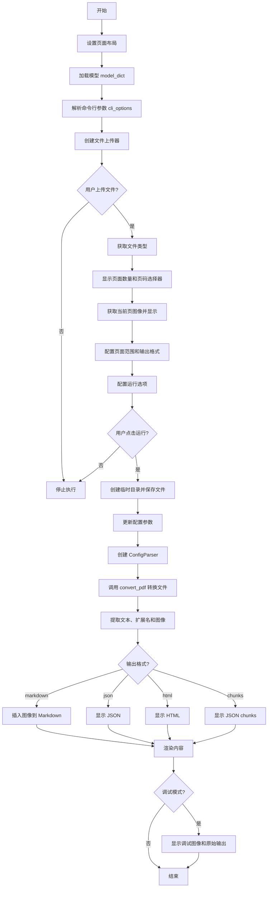

# `marker\marker\scripts\streamlit_app.py` 详细设计文档

这是一个基于 Streamlit 的 Web 应用程序，用于将 PDF、图像或文档文件转换为 Markdown、HTML、JSON 或 chunks 格式，支持 OCR、LLM 增强和调试功能。

## 整体流程



## 类结构

```
Streamlit Web 应用 (无类结构)
├── 全局函数
│   ├── convert_pdf
│   └── markdown_insert_images
└── 主流程代码块
```

## 全局变量及字段


### `model_dict`
    
从 load_models() 加载的模型字典，包含预训练的 marker 模型

类型：`dict`
    


### `cli_options`
    
从 parse_args() 解析的命令行选项字典，包含默认配置参数

类型：`dict`
    


### `in_file`
    
Streamlit 文件上传组件返回的上传文件对象，支持 PDF、图片、文档等多种格式

类型：`UploadedFile`
    


### `filetype`
    
上传文件的 MIME 类型，由 in_file.type 获取

类型：`str`
    


### `page_count`
    
PDF 文档的总页数，由 page_count() 函数计算得出

类型：`int`
    


### `page_number`
    
用户选择的当前查看页面编号，从 Streamlit 数字输入框获取

类型：`int`
    


### `pil_image`
    
指定页面的 PIL 图像对象，由 get_page_image() 从 PDF 中提取

类型：`PIL.Image.Image`
    


### `page_range`
    
要解析的页面范围字符串，格式如 '0,5-10,20'，由用户输入或默认生成

类型：`str`
    


### `output_format`
    
输出格式选择，支持 markdown、json、html、chunks 四种格式

类型：`str`
    


### `run_marker`
    
触发 Marker 转换执行的按钮状态，点击后开始处理

类型：`bool`
    


### `use_llm`
    
是否使用 LLM 提升处理质量的开关，默认关闭

类型：`bool`
    


### `force_ocr`
    
强制对所有页面执行 OCR 的开关，默认关闭

类型：`bool`
    


### `strip_existing_ocr`
    
是否剥离现有 OCR 文本并重新 OCR 的开关，默认关闭

类型：`bool`
    


### `debug`
    
调试模式开关，显示详细调试信息和原始输出

类型：`bool`
    


### `disable_ocr_math`
    
禁用 OCR 输出中数学公式的开关，默认关闭

类型：`bool`
    


### `temp_pdf`
    
临时 PDF 文件的完整路径，用于存放上传的文件内容供转换使用

类型：`str`
    


### `config_parser`
    
配置解析器对象，根据 cli_options 生成配置字典和处理器

类型：`ConfigParser`
    


### `rendered`
    
PdfConverter 返回的渲染结果对象，包含转换后的页面数据

类型：`Any`
    


### `first_page`
    
解析页面范围中的起始页码，用于调试图像显示

类型：`int`
    


### `text`
    
从渲染结果提取的文本内容，可能包含 Markdown、JSON 或 HTML 格式

类型：`str`
    


### `ext`
    
输出文本的扩展名标识，与 output_format 对应

类型：`str`
    


### `images`
    
从渲染结果提取的图像字典，键为图像路径，值为图像数据

类型：`Dict[str, Any]`
    


    

## 全局函数及方法


### `convert_pdf`

该函数是 Marker 演示应用的核心转换引擎，接收 PDF 文件路径和配置解析器，生成 PdfConverter 实例并执行 PDF 到 Markdown/HTML/JSON 的转换，返回渲染结果元组。

参数：

- `fname`：`str`，输入的 PDF 或文档文件的路径
- `config_parser`：`ConfigParser`，包含转换配置（如输出格式、页码范围、OCR 选项等）的配置解析器对象

返回值：`(str, Dict[str, Any], dict)`，返回一个包含三个元素的元组——渲染后的文本内容（字符串形式）、元数据字典、以及图像字典

#### 流程图

```mermaid
flowchart TD
    A[开始 convert_pdf] --> B[调用 config_parser.generate_config_dict 获取配置字典]
    B --> C[设置 config_dict['pdftext_workers'] = 1 强制单线程]
    D[获取全局变量 model_dict] --> E[创建 PdfConverter 实例]
    E --> F[传入配置字典、模型字典、处理器列表、渲染器、LLM 服务]
    F --> G[调用 converter(fname 执行转换]
    G --> H[返回渲染结果元组]
    
    style A fill:#f9f,color:#000
    style H fill:#9f9,color:#000
```

#### 带注释源码

```python
def convert_pdf(fname: str, config_parser: ConfigParser) -> (str, Dict[str, Any], dict):
    """
    将 PDF 文件转换为 Markdown/HTML/JSON 格式的渲染结果
    
    参数:
        fname: 输入的 PDF 文件路径
        config_parser: 配置解析器对象,包含转换选项和参数
    
    返回:
        包含渲染文本、元数据和图像的元组
    """
    # 从配置解析器生成配置字典
    config_dict = config_parser.generate_config_dict()
    
    # 强制使用单线程处理 PDF 文本,避免多进程问题
    config_dict["pdftext_workers"] = 1
    
    # 获取 PDF 转换器类
    converter_cls = PdfConverter
    
    # 创建转换器实例,传入所有必要的组件
    converter = converter_cls(
        config=config_dict,                    # 配置字典
        artifact_dict=model_dict,              # 预加载的模型字典(全局变量)
        processor_list=config_parser.get_processors(),  # 处理器列表
        renderer=config_parser.get_renderer(),           # 渲染器
        llm_service=config_parser.get_llm_service(),     # LLM 服务
    )
    
    # 执行转换并返回结果
    return converter(fname)
```


### `markdown_insert_images`

该函数用于将Markdown文档中的图片引用替换为HTML图片标签，以便在Streamlit界面中正确显示PDF或文档转换后的图片。

参数：

- `markdown`：`str`，包含图片引用的Markdown文本
- `images`：`dict`，将图片路径映射到实际图片数据的字典

返回值：`str`，将Markdown图片标签替换为HTML img标签后的文本

#### 流程图

```mermaid
flowchart TD
    A[开始: markdown_insert_images] --> B[接收markdown和images参数]
    B --> C{调用re.findall查找图片标签}
    C --> D[正则表达式匹配 !\[alt\]\(path\)]
    D --> E{遍历每个匹配的图像}
    E --> F{提取image_markdown, image_alt, image_path}
    F --> G{检查image_path是否在images字典中}
    G -->|是| H[调用img_to_html生成HTML]
    G -->|否| I[跳过该图片]
    H --> J[用HTML替换markdown中的图片标记]
    I --> K{继续处理下一个图片}
    J --> K
    K --> L{所有图片处理完成?}
    L -->|否| E
    L -->|是| M[返回修改后的markdown]
    M --> N[结束]
```

#### 带注释源码

```python
def markdown_insert_images(markdown, images):
    """
    将Markdown中的图片引用替换为HTML img标签
    
    参数:
        markdown: 包含图片引用的Markdown文本
        images: 字典，键为图片路径，值为图片数据
    
    返回:
        替换后的Markdown文本，图片标签已转为HTML
    """
    
    # 使用正则表达式查找所有Markdown格式的图片标签
    # 匹配格式: 
    # 返回的match对象包含:
    #   group(0): 完整的markdown图片标签
    #   group(1): 图片标题(alt text)
    #   group(2): 图片路径
    #   group(3): 可选的title属性
    image_tags = re.findall(
        r'(!\[(?P<image_title>[^\]]*)\]\((?P<image_path>[^\)"\s]+)\s*([^\)]*)\))',
        markdown,
    )

    # 遍历所有找到的图片标签
    for image in image_tags:
        # 提取图片标签的各个部分
        image_markdown = image[0]    # 完整的markdown标签，如: 
        image_alt = image[1]         # 图片的alt文本
        image_path = image[2]        # 图片的路径
        
        # 检查该图片路径是否在images字典中（即是否已从PDF中提取）
        if image_path in images:
            # 使用img_to_html函数将图片转换为HTML格式
            # 并替换原markdown中的图片标签
            markdown = markdown.replace(
                image_markdown, img_to_html(images[image_path], image_alt)
            )
    
    # 返回替换了图片标签的markdown文本
    return markdown
```

## 关键组件


### 文档转换引擎 (convert_pdf 函数)

核心PDF转换功能，集成配置解析器、PdfConverter和渲染管线，支持单Worker处理PDF文件，调用marker库的转换能力将PDF转换为结构化输出。

### 图像内嵌处理 (markdown_insert_images 函数)

使用正则表达式解析Markdown中的图像引用，将本地图像路径替换为HTML img标签，实现Markdown文档中图像的内嵌展示，支持带标题的图像渲染。

### Streamlit Web UI 架构

基于Streamlit的双列布局应用，左侧展示原始PDF页面，右侧输出转换结果。包含完整的参数配置面板（输出格式、页码范围、OCR选项、调试模式等），支持交互式文档预览。

### 配置管理 (ConfigParser 集成)

动态生成配置字典，支持页面范围解析、输出格式选择、OCR控制（force_ocr、strip_existing_ocr、disable_ocr_math）、LLM增强开关，以及调试数据输出目录配置。

### 调试可视化系统

当启用debug模式时，渲染PDF页面图像和布局分析图像，展示原始输出代码，帮助开发者诊断转换质量和识别潜在问题。

### 临时文件生命周期管理

使用tempfile.TemporaryDirectory确保临时PDF文件在处理完成后自动清理，包含从UploadedFile提取二进制内容并写入临时文件的完整流程。

### 环境变量配置

设置PYTORCH_ENABLE_MPS_FALLBACK和IN_STREAMLIT环境变量，配置PyTorch MPS后端回退和Streamlit运行上下文，影响底层marker库的运行行为。


## 问题及建议


### 已知问题

- **全局变量依赖问题**：`model_dict`在第67行定义，但在第31行的`convert_pdf`函数中被使用，形成隐式全局依赖，违反函数纯化原则，降低代码可测试性
- **缺少错误处理**：核心转换逻辑（第95-120行）没有try-except包裹，文件读写、模型加载等操作失败时会直接崩溃，用户体验差
- **性能问题**：每次页面交互都会执行`load_models()`（第67行），没有缓存机制；`page_count(in_file)`在第72行调用，但后续可能重复计算
- **类型标注不规范**：`convert_pdf`函数返回值类型`(str, Dict[str, Any], dict)`与实际返回值结构可能不匹配，且`model_dict`变量类型未标注
- **魔法数字和硬编码**：第33行`pdftext_workers = 1`硬编码，第68行列宽比例`[0.5, 0.5]`硬编码，缺乏配置管理
- **代码可维护性差**：大部分逻辑在全局作用域执行（从第69行到第135行），难以单元测试；`markdown_insert_images`函数可独立但未提取到专用模块
- **状态管理问题**：`page_range`变量在第118行被重新赋值，可能导致配置不一致；`run_marker`按钮触发后重新执行整个脚本，状态丢失风险

### 优化建议

- **重构函数设计**：将`model_dict`作为参数传入`convert_pdf`函数，消除全局依赖；使用`@st.cache_resource`装饰器缓存模型加载结果
- **添加错误处理**：用try-except包裹文件操作和转换逻辑，添加友好的错误提示和fallback机制
- **优化性能**：使用`@st.cache_data`缓存`page_count`结果；添加进度条指示转换进度；考虑使用session_state管理状态
- **提取配置常量**：将魔法数字和硬编码值提取到配置文件或常量定义区域
- **代码模块化**：将`markdown_insert_images`等工具函数提取到独立模块；将UI交互逻辑与业务逻辑分离
- **完善类型标注**：使用精确的返回类型（如`TypedDict`或`NamedTuple`），为关键变量添加类型注解
- **添加输入验证**：在处理前验证文件有效性、文件大小限制、页码范围合法性

## 其它


### 设计目标与约束

**设计目标**：构建一个基于 Streamlit 的 Web 应用，用于将 PDF、文档或图像转换为 Markdown、HTML、JSON 或 chunks 格式，支持多语言处理，提取图像、表格、公式等元素。

**约束条件**：
- 仅支持客户端文件上传，不支持服务器端文件存储
- 使用临时目录处理文件，处理完毕后自动清理
- 必须依赖 marker 库的核心功能
- 受限于 Streamlit 的运行模式（需设置 IN_STREAMLIT 环境变量）

### 错误处理与异常设计

- **文件上传验证**：通过 `st.sidebar.file_uploader` 的 type 参数限制上传文件类型
- **页面范围验证**：使用 `st.number_input` 限制页面数量范围，防止越界访问
- **临时文件管理**：使用 `tempfile.TemporaryDirectory()` 自动管理临时文件生命周期
- **调试模式**：通过 try-except 捕获异常，在 debug 模式下显示详细信息
- **静默处理**：当文件未上传时调用 `st.stop()` 终止页面渲染

### 数据流与状态机

**数据输入流**：
1. 用户通过文件选择器上传文档（PDF/图像/文档）
2. Streamlit 的 `UploadedFile` 对象接收文件内容
3. 文件类型通过 `in_file.type` 自动检测

**处理流程**：
1. 将上传文件写入临时 PDF
2. 构建 ConfigParser 配置对象
3. 调用 PdfConverter 进行转换
4. 提取文本、图像和元数据
5. 根据输出格式渲染结果

**状态转换**：
- 初始状态 → 文件上传 → 参数配置 → 执行转换 → 结果展示

### 外部依赖与接口契约

**核心依赖**：
- `marker` 库：PDF/图像转换核心引擎
- `streamlit`：Web UI 框架
- `PIL (Pillow)`：图像处理
- `re`：正则表达式处理

**内部模块依赖**（来自 marker.scripts.common）：
- `load_models()`：加载 ML 模型
- `parse_args()`：解析命令行参数
- `img_to_html()`：图像转 HTML
- `get_page_image()`：提取页面图像
- `page_count()`：获取页数

**接口契约**：
- `convert_pdf(fname, config_parser)`：接受文件路径和配置，返回渲染结果元组
- `markdown_insert_images(markdown, images)`：替换 Markdown 中的图像路径为内联 HTML

### 安全性考虑

- **文件类型限制**：仅允许预定义的文件类型上传
- **临时文件处理**：使用上下文管理器自动清理临时文件
- **无持久化存储**：不保存用户上传的文件，处理后立即丢弃
- **环境变量隔离**：关键配置通过环境变量管理

### 性能优化建议

- **模型缓存**：使用全局变量 `model_dict` 缓存加载的模型，避免重复加载
- **工作线程限制**：设置 `pdftext_workers=1` 限制并发数
- **按需渲染**：仅在用户点击 "Run Marker" 按钮时才执行转换
- **页面图像缓存**：使用 `get_page_image()` 缓存页面预览图像

### 用户体验设计

- **双栏布局**：左侧显示原始文档页面，右侧显示转换结果
- **实时预览**：输入页码后立即更新左侧图像
- **调试模式**：可选显示 PDF 调试图像和布局图像
- **参数可视化**：使用下拉框、单选按钮等标准控件

### 配置管理

- **CLI 参数合并**：将 Streamlit UI 参数与 CLI 参数合并
- **默认值处理**：通过 `parse_args()` 获取默认配置
- **动态配置**：运行时根据用户选择动态更新配置字典

### 测试策略建议

- 单元测试：测试 `convert_pdf`、`markdown_insert_images` 等纯函数
- 集成测试：测试完整转换流程
- UI 测试：测试 Streamlit 组件交互
- 边界测试：测试空文件、错误文件类型、超大文件等

### 部署注意事项

- **环境变量**：需设置 `PYTORCH_ENABLE_MPS_FALLBACK=1` 和 `IN_STREAMLIT=true`
- **资源需求**：需要足够的内存加载 ML 模型
- **临时目录**：确保有足够的临时存储空间
- **依赖安装**：需安装 marker 及其所有依赖项

### 日志与监控

- Streamlit 自动记录请求日志
- 可通过 `debug` 选项查看转换中间结果
- 建议添加结构化日志记录转换过程和性能指标

### 代码组织结构

- **入口点**：Streamlit 页面直接执行
- **配置层**：parse_args、ConfigParser
- **转换层**：convert_pdf、PdfConverter
- **渲染层**：text_from_rendered、markdown_insert_images
- **展示层**：Streamlit 组件

### 可扩展性设计

- 支持多种输出格式（markdown/json/html/chunks）
- 支持 LLM 增强处理
- 支持 OCR 配置选项
- 预留插件接口（processor_list、renderer、llm_service）


    