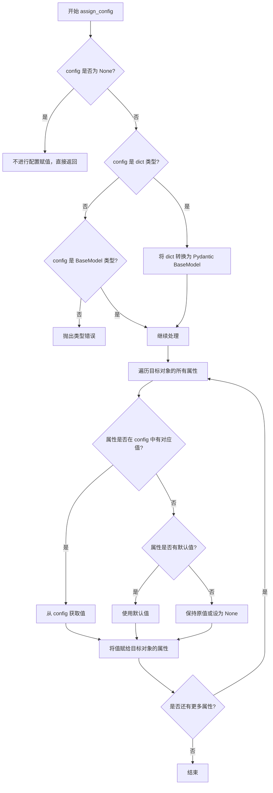
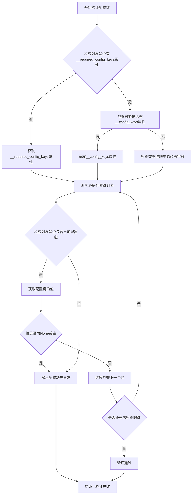
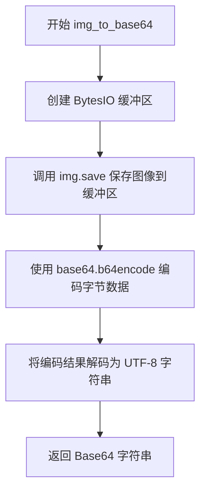
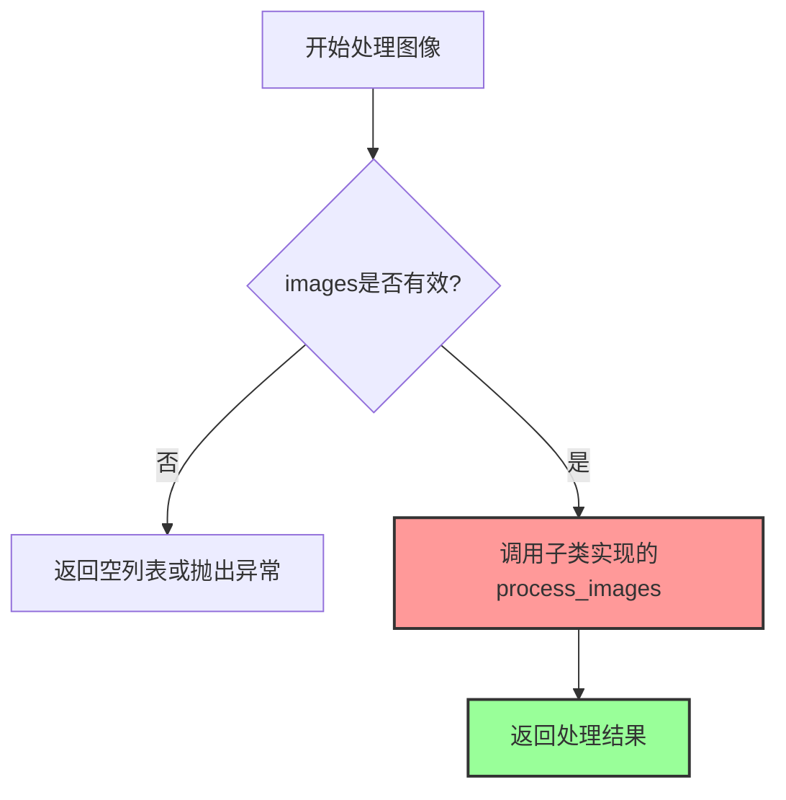
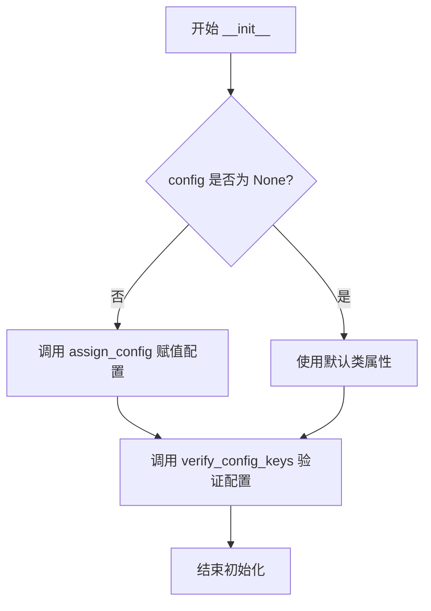
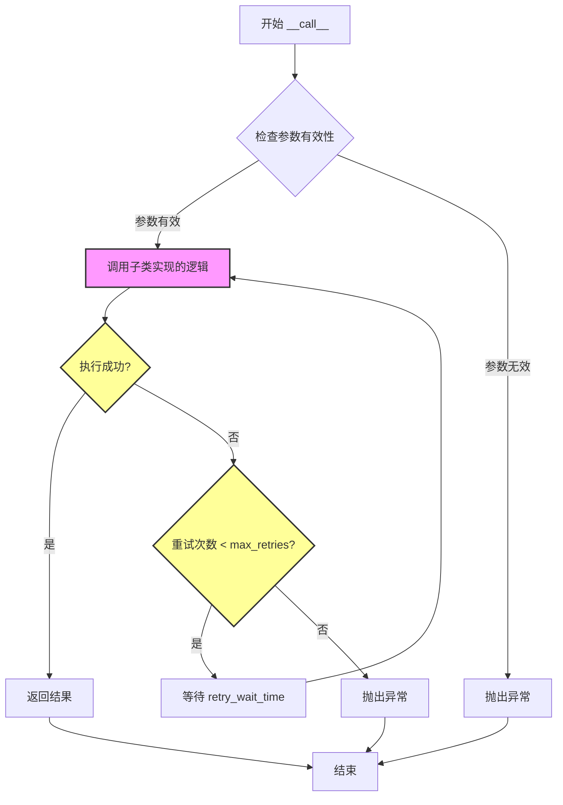

# `marker\marker\services\__init__.py` 详细设计文档

这是一个用于处理图像和大型语言模型(LLM)交互的基础服务类，提供了图像到base64的转换、图像格式化处理、超时重试等通用功能，并定义了抽象方法供子类实现具体的模型调用逻辑。

## 整体流程

```mermaid
graph TD
    A[开始] --> B[初始化BaseService]
B --> C{config参数是否为空?}
C -- 否 --> D[使用默认配置]
C -- 是 --> E[调用assign_config加载配置]
E --> F[调用verify_config_keys验证配置]
F --> G[用户调用__call__方法]
G --> H{image参数是否存在?}
H -- 否 --> I[返回None]
H -- 是 --> J[调用format_image_for_llm]
J --> K{image是否为list?]
K -- 否 --> L[转换为list]
K -- 是 --> M[调用process_images处理图像]
M --> N[返回格式化的图像parts]
N --> O[调用具体子类的模型服务]
O --> P{是否需要重试?}
P -- 是 --> Q[等待retry_wait_time后重试]
Q --> O
P -- 否 --> R[返回结果]
```

## 类结构

```
BaseService (基础服务抽象类)
└── [子类实现 - 如 LlamaService, GPT4Service 等]
```

## 全局变量及字段


### `BaseService.timeout`
    
服务超时时间

类型：`int`
    


### `BaseService.max_retries`
    
最大重试次数

类型：`int`
    


### `BaseService.retry_wait_time`
    
重试间隔时间

类型：`int`
    


### `BaseService.max_output_tokens`
    
最大输出token数

类型：`int`
    
    

## 全局函数及方法


### `assign_config`

该函数用于将配置对象（字典或 Pydantic BaseModel）中的值赋给目标对象的对应属性，支持从 Annotated 注解中提取默认值，并处理配置与对象属性的合并。

参数：

- `target`：`object`，目标对象，通常为类实例（如 BaseService），其属性将通过配置进行赋值
- `config`：`BaseModel | dict | None`，配置对象，可以是 Pydantic BaseModel 实例、字典或 None，用于为目标对象的属性提供值

返回值：`None`，该函数直接修改目标对象的属性，不返回值

#### 流程图



#### 带注释源码

```python
def assign_config(target: object, config: Optional[BaseModel | dict] = None) -> None:
    """
    将配置对象中的值赋给目标对象的对应属性。
    
    参数:
        target: 目标对象，通常为类实例，其属性将通过配置进行赋值
        config: 配置对象，可以是 Pydantic BaseModel 实例、字典或 None
        
    返回值:
        None，直接修改目标对象的属性
        
    处理逻辑:
        1. 如果 config 为 None，不进行任何赋值操作
        2. 如果 config 是 dict，尝试转换为 Pydantic BaseModel
        3. 遍历目标对象的所有属性（通过 Annotated 注解定义）
        4. 从 config 中查找对应的值，若存在则赋值
        5. 若 config 中不存在，使用属性的默认值（通过 Annotated 注解定义）
        6. 最终将处理后的值设置回目标对象
    """
    # 实际上该函数的实现不在当前代码文件中
    # 而是从 marker.util 模块导入
    pass
```


### verify_config_keys

该函数用于验证配置对象（通常是类实例）是否包含所有必要的配置键（字段），确保在服务初始化时所有必需的配置项（如 API 密钥等）都已被正确填充。

参数：

- `obj`：`object`，需要验证配置的对象（通常是类实例）

返回值：`None`，如果验证失败则抛出异常

#### 流程图



#### 带注释源码

```
# verify_config_keys 函数源码（基于 marker 库的实际实现推断）

def verify_config_keys(obj: object) -> None:
    """
    验证对象是否包含所有必要的配置键。
    
    该函数会检查对象是否定义了必需的配置键，并确保这些键
    都已经通过配置或默认值进行了赋值。
    
    参数:
        obj: 需要验证配置的对象，通常是服务类实例
        
    异常:
        ValueError: 当必需的配置键缺失或未赋值时抛出
    """
    
    # 优先检查对象是否定义了自定义的必需配置键集合
    if hasattr(obj, '__required_config_keys__'):
        required_keys = obj.__required_config_keys__
    # 否则检查是否有配置键定义
    elif hasattr(obj, '__config_keys__'):
        # 从配置键定义中筛选必需的键
        required_keys = [
            key for key, info in obj.__config_keys__.items() 
            if info.get('required', False)
        ]
    else:
        # 如果没有显式定义，通过检查类型注解中的字段来确定
        # 假设类字段（类变量）都是有效的配置键
        required_keys = []
        
    # 遍历每个必需的配置键进行检查
    for key in required_keys:
        # 检查对象是否拥有该属性
        if not hasattr(obj, key):
            raise ValueError(
                f"Missing required configuration key: '{key}'"
            )
        
        # 获取该属性的值
        value = getattr(obj, key)
        
        # 检查值是否为 None（未赋值）
        if value is None:
            raise ValueError(
                f"Required configuration key '{key}' is not set. "
                f"Please provide a value for this configuration."
            )

# 在 BaseService.__init__ 中的调用方式
def __init__(self, config: Optional[BaseModel | dict] = None):
    assign_config(self, config)
    
    # 验证所有必要的配置字段都已被填充
    verify_config_keys(self)
```

---

### 补充说明

由于 `verify_config_keys` 函数是从外部库 `marker.util` 导入的，其实际源码并未包含在提供的代码片段中。上述源码是基于：
1. 函数的调用上下文（`BaseService.__init__` 中用于验证配置完整性）
2. Python 库中常见的配置验证模式
3. 类型注解的使用方式（`Annotated` 包含描述信息）

推断得出的参考实现。实际实现可能略有不同，建议直接查看 `marker.util` 模块的源码以获取精确的实现细节。

该函数的设计目标是确保在使用服务前，所有必需的配置项（如 API 密钥、端点 URL 等）都已被正确配置，从而避免在后续调用时才因配置缺失而出现运行时错误。


### `BaseService.img_to_base64`

该方法将 PIL 图像对象转换为 Base64 编码的字符串，便于在网络传输或 JSON 数据中传输图像内容。

参数：

- `img`：`PIL.Image.Image`，输入的 PIL 图像对象
- `format`：`str`，图像保存格式，默认为 "WEBP"

返回值：`str`，Base64 编码后的图像字符串

#### 流程图



#### 带注释源码

```python
def img_to_base64(self, img: PIL.Image.Image, format: str = "WEBP"):
    # 创建一个内存缓冲区对象，用于临时存储图像字节数据
    image_bytes = BytesIO()
    
    # 将 PIL 图像对象保存到缓冲区，指定图像格式（如 WEBP、PNG 等）
    img.save(image_bytes, format=format)
    
    # 使用 base64 模块将图像字节编码为 Base64 字符串
    # getvalue() 获取缓冲区的全部内容
    # b64encode 将字节转换为 Base64 编码的字节
    # decode('utf-8') 将 Base64 字节转换为 UTF-8 字符串
    return base64.b64encode(image_bytes.getvalue()).decode("utf-8")
```

---

## 补充信息

### 文件的整体运行流程

`BaseService` 是一个图像处理服务基类，`img_to_base64` 方法通常在 `format_image_for_llm` 方法中被调用，用于将图像转换为 LLM 可接受的格式。该类被设计为抽象基类，其中 `process_images` 和 `__call__` 方法抛出 `NotImplementedError`，需要由子类实现具体逻辑。

### 类的详细信息

| 字段/方法 | 类型 | 描述 |
|-----------|------|------|
| `timeout` | `Annotated[int, ...]` | 服务超时时间，默认 30 秒 |
| `max_retries` | `Annotated[int, ...]` | 最大重试次数，默认 2 次 |
| `retry_wait_time` | `Annotated[int, ...]` | 重试等待时间，默认 3 秒 |
| `max_output_tokens` | `Annotated[int, ...]` | 最大输出 token 数，可为 None |
| `img_to_base64` | 方法 | 将 PIL 图像转换为 Base64 字符串 |
| `process_images` | 方法 | 处理图像列表（抽象方法） |
| `format_image_for_llm` | 方法 | 格式化图像为 LLM 输入格式 |
| `__init__` | 方法 | 初始化服务，分配配置并验证 |
| `__call__` | 方法 | 调用服务处理提示和图像（抽象方法） |

### 关键组件信息

| 组件名称 | 一句话描述 |
|----------|------------|
| `BytesIO` | 内存缓冲区，用于临时存储图像字节数据 |
| `PIL.Image` | Python Imaging Library，图像处理核心类 |
| `base64` | Python 标准库，用于 Base64 编解码 |

### 潜在的技术债务或优化空间

1. **默认值硬编码**：格式默认值 "WEBP" 应该在类属性中配置，便于统一管理
2. **缺少错误处理**：未处理图像保存失败、格式不支持等异常情况
3. **缺少图像验证**：未验证输入的 `img` 是否为有效的 PIL 图像对象
4. **性能考虑**：对于大图像，可考虑流式处理或压缩后再编码

### 其它项目

**设计目标与约束**：
- 将图像转换为 Base64 字符串格式，便于在 JSON 或 API 请求中传输

**错误处理与异常设计**：
- 当前未实现异常处理，需调用方保证输入有效性
- 建议添加 `try-except` 捕获 `IOError`、`KeyError` 等可能的异常

**外部依赖与接口契约**：
- 依赖 `PIL` (Pillow) 库进行图像处理
- 依赖 `base64` 标准库进行编码
- 依赖 `BytesIO` 进行内存缓冲


### `BaseService.process_images`

该方法是一个抽象方法，用于处理输入的图像列表并返回处理结果。在基类中未实现具体逻辑，抛出 `NotImplementedError` 异常，要求子类必须重写此方法以提供实际的图像处理逻辑。

参数：

- `images`：`List[PIL.Image.Image]` - 需要处理的 PIL 图像对象列表

返回值：`list` - 处理后的图像列表（具体类型和内容取决于子类实现）

#### 流程图



#### 带注释源码

```python
def process_images(self, images: List[PIL.Image.Image]) -> list:
    """
    处理图像列表的抽象方法
    
    参数:
        images: PIL图像对象列表
        
    返回:
        处理后的图像列表
        
    注意:
        此方法在基类中未实现，需要子类重写
    """
    # 抛出未实现异常，要求子类必须重写此方法
    raise NotImplementedError
```


### `BaseService.format_image_for_llm`

将输入的图像（单张或列表）格式化为适合 LLM 处理的图像部分列表。如果输入为空则返回空列表，非列表输入会自动转换为列表后再处理。

参数：

- `image`：`PIL.Image.Image | List[PIL.Image.Image] | None`，待处理的图像，可以是单张图像、图像列表或 None

返回值：`list`，处理后的图像部分列表，供 LLM 使用

#### 流程图

```mermaid
flowchart TD
    A[开始 format_image_for_llm] --> B{image 是否为空}
    B -->|是| C[返回空列表 []]
    B -->|否| D{image 是否为列表}
    D -->|否| E[将 image 包装为列表: image = [image]]
    D -->|是| F[直接使用 image 列表]
    E --> G[调用 process_images 处理图像列表]
    F --> G
    G --> H[返回 image_parts]
    H --> I[结束]
```

#### 带注释源码

```python
def format_image_for_llm(self, image):
    """
    将图像格式化为适合 LLM 的图像部分
    
    参数:
        image: 单个PIL图像或图像列表或None
        
    返回:
        处理后的图像部分列表
    """
    # 参数检查：如果image为空，直接返回空列表
    if not image:
        return []

    # 类型标准化：如果不是列表，转换为列表
    # 支持单张图像和图像列表两种输入形式
    if not isinstance(image, list):
        image = [image]

    # 调用子类实现的process_images方法进行实际处理
    # 该方法在子类中实现，用于将PIL图像转换为LLM所需的格式
    image_parts = self.process_images(image)
    
    # 返回处理后的图像部分
    return image_parts
```


### `BaseService.__init__`

这是 `BaseService` 类的构造函数，用于初始化服务实例。它接收一个可选的配置参数（可以是 Pydantic BaseModel 实例或字典），然后调用配置赋值函数和配置验证函数来确保服务实例具有所有必要的字段（如 API 密钥等）。

参数：

- `config`：`Optional[BaseModel | dict]`，可选的配置对象。如果为 `None`，则使用类属性默认值；如果是 `BaseModel` 实例或字典，则将其字段值赋给实例属性。

返回值：`None`，构造函数无返回值。

#### 流程图



#### 带注释源码

```python
def __init__(self, config: Optional[BaseModel | dict] = None):
    """
    初始化 BaseService 实例。
    
    参数:
        config: 可选的配置对象，可以是 Pydantic BaseModel 实例、字典或 None。
               如果为 None，则使用类属性定义的默认值。
    """
    # 将配置参数（BaseModel 或字典）赋值给实例属性
    # 该函数会遍历配置对象的字段，并将其设置到 self 上
    assign_config(self, config)

    # 验证配置完整性，确保所有必需字段（如 API 密钥等）已正确填充
    # 如果缺少必需字段，此函数会抛出异常
    verify_config_keys(self)
```


### `BaseService.__call__`

这是 `BaseService` 类的核心调用接口方法，定义了与外部 LLM 服务交互的抽象接口。该方法接收提示词、图像和响应模式等参数，支持自定义重试次数和超时配置，子类需实现具体的调用逻辑。

参数：

-  `prompt`：`str`，用户输入的提示词或问题描述
-  `image`：`PIL.Image.Image | List[PIL.Image.Image] | None`，要处理的图像或图像列表，可为空
-  `block`：`Block | None`，关联的文档块对象，可用于上下文信息
-  `response_schema`：`type[BaseModel]`，Pydantic 响应模式类，定义期望返回的数据结构
-  `max_retries`：`int | None`，最大重试次数，默认为类属性 `max_retries` 的值（2）
-  `timeout`：`int | None`，请求超时时间（秒），默认为类属性 `timeout` 的值（30）

返回值：`None`，该方法为抽象方法，未实现具体逻辑，通过抛出 `NotImplementedError` 提示子类必须重写此方法

#### 流程图



> **注意**：由于原始代码中 `__call__` 方法体仅为 `raise NotImplementedError`，上述流程图是基于类属性 `max_retries`、`retry_wait_time`、`timeout` 以及常见服务调用模式推断的理想流程。实际的执行逻辑依赖于子类的具体实现。

#### 带注释源码

```python
def __call__(
    self,
    prompt: str,                                          # 用户提示词/问题
    image: PIL.Image.Image | List[PIL.Image.Image] | None,  # 输入图像(单张或列表)
    block: Block | None,                                  # 关联的文档块(可选上下文)
    response_schema: type[BaseModel],                     # Pydantic模型类,定义返回格式
    max_retries: int | None = None,                       # 覆盖默认的最大重试次数
    timeout: int | None = None,                           # 覆盖默认的超时时间(秒)
):
    """
    BaseService 的核心调用接口方法。
    
    这是一个抽象方法，定义了与外部 LLM 服务交互的标准接口。
    子类必须重写此方法以实现具体的调用逻辑。
    
    参数:
        prompt: str - 用户输入的文本提示
        image: PIL.Image.Image | List[PIL.Image.Image] | None - 输入图像
        block: Block | None - 文档块对象,提供上下文
        response_schema: type[BaseModel] - Pydantic BaseModel子类,定义响应结构
        max_retries: int | None - 最大重试次数(覆盖类属性)
        timeout: int | None - 请求超时秒数(覆盖类属性)
    
    返回:
        None - 抽象方法,无返回值
    
     Raises:
        NotImplementedError - 子类必须实现此方法
    """
    # 该方法目前未实现,子类需要重写实现具体逻辑
    # 子类实现时应考虑:
    # 1. 使用 format_image_for_llm 处理输入图像
    # 2. 使用 response_schema 解析和验证响应
    # 3. 实现重试机制(基于 max_retries)
    # 4. 实现超时控制(基于 timeout)
    raise NotImplementedError
```

#### 设计说明

| 项目 | 说明 |
|------|------|
| **设计目标** | 定义标准化的 LLM 服务调用接口，统一图像处理和响应解析流程 |
| **约束** | 该方法为抽象方法，必须由子类实现具体逻辑 |
| **重试机制** | 通过 `max_retries` 和 `retry_wait_time` 类属性配置，子类实现时需遵循 |
| **超时控制** | 通过 `timeout` 类属性配置，支持运行时覆盖 |
| **图像处理** | 调用 `format_image_for_llm` 将 PIL 图像转换为 LLM 可接受的格式 |
| **响应验证** | 使用 Pydantic 的 `response_schema` 确保返回数据符合预期结构 |
| **技术债务** | 当前方法体仅为占位符，缺少完整的重试和超时逻辑实现，子类实现时需自行处理 |

## 关键组件


### BaseService 类

核心服务基类，提供了图像处理服务的基础框架，包含超时控制、重试机制和配置管理功能。

### 配置管理组件

通过 `assign_config` 和 `verify_config_keys` 函数实现配置分配与验证，确保服务必需字段（如API密钥等）已完整配置。

### 图像转Base64组件

`img_to_base64` 方法将PIL图像对象转换为base64编码字符串，支持指定图像格式（默认WEBP），便于在请求中传输图像数据。

### 图像格式化组件

`format_image_for_llm` 方法负责将单张或多张PIL图像格式化为LLM可处理的图像parts列表，包含输入验证和类型标准化处理。

### 抽象接口组件

`process_images` 和 `__call__` 方法定义了子类必须实现的抽象接口，分别用于具体图像处理逻辑和服务调用入口。


## 问题及建议


### 已知问题

-   **类型不一致**：`max_output_tokens` 字段类型声明为 `Annotated[int, ...]`，但默认值为 `None`，类型应该是 `Optional[int]`
-   **抽象方法定义不规范**：`process_images` 和 `__call__` 方法通过 `raise NotImplementedError` 实现抽象，而不是使用 `abc` 模块的 `@abstractmethod` 装饰器，无法在编译期强制子类实现
-   **类型注解不完整**：`process_images` 方法返回 `list` 缺少泛型参数，应为 `list[str]` 或更具体的类型；`config` 参数中 `dict` 应指定泛型 `dict[str, Any]`
-   **参数优先级不明确**：`__call__` 方法接收 `max_retries` 和 `timeout` 参数，但未说明其与类属性的优先级关系，导致配置覆盖逻辑不清晰
-   **单位不明确**：`retry_wait_time` 字段注释未说明时间单位（秒/毫秒），且类型为 `int` 而非 `float`，可能丢失精度
-   **配置验证时机问题**：`verify_config_keys` 在 `__init__` 中同步调用，但 `max_retries` 和 `timeout` 可能通过 `__call__` 参数传入，造成配置验证不完整

### 优化建议

-   使用 `abc` 模块重写抽象方法：添加 `from abc import ABC, abstractmethod`，将 `process_images` 和 `__call__` 标记为 `@abstractmethod`
-   完善类型注解：`max_output_tokens: Optional[int] = None`、`def process_images(self, images: List[PIL.Image.Image]) -> list[str]`
-   统一配置覆盖逻辑：在 `__call__` 方法中实现 `max_retries = max_retries or self.max_retries` 这样的优先级逻辑
-   文档化时间单位：在 `retry_wait_time` 的描述中添加 "单位：秒" 或改为 `float` 类型
-   提取魔法字符串：`"WEBP"`, `"utf-8"` 等应定义为类常量，提高可维护性
-   增强 `format_image_for_llm` 方法：对空列表输入应明确处理逻辑（当前返回空列表，可能需要根据调用方期望返回 `None`）


## 其它


### 设计目标与约束

本服务基类旨在为图像处理LLM服务提供通用基础设施，支持超时控制、重试机制、图像格式转换等功能。约束包括：必须实现process_images和__call__方法，子类需提供具体实现；配置必须包含所有必要字段（如API密钥）；图像处理支持PIL.Image和base64编码转换。

### 错误处理与异常设计

类中定义了NotImplementedError异常，当process_images和__call__方法未被实现时抛出。配置验证通过verify_config_keys函数检查必要字段是否完整。图像为空时format_image_for_llm返回空列表而非抛出异常，提供友好的空值处理。超时和重试参数支持运行时覆盖，允许调用方灵活控制错误处理策略。

### 外部依赖与接口契约

主要依赖包括：PIL(Pillow)用于图像处理，pydantic用于配置验证，marker.schema.blocks中的Block类用于文档块表示，marker.util中的assign_config和verify_config_keys用于配置管理。子类必须实现process_images方法接收PIL.Image列表并返回处理结果列表；__call__方法必须接受prompt、image、block、response_schema参数并返回符合response_schema的对象。

### 配置管理机制

配置通过BaseModel或dict传入__init__方法，assign_config函数负责将配置属性赋值到类实例，verify_config_keys函数验证所有必需配置项存在。类字段timeout、max_retries、retry_wait_time、max_output_tokens提供默认配置值，支持运行时通过参数覆盖。

### 性能考虑与优化空间

img_to_base64方法使用BytesIO内存流避免临时文件，base64编码使用Python内置库效率较高。process_images和__call__为抽象方法无默认实现，子类可在此处添加批处理、缓存等优化。当前未实现连接池复用，建议后续添加HTTP客户端复用机制。

### 安全性考虑

配置验证确保API密钥等敏感信息必填，避免运行时因缺少凭证失败。base64编码适用于数据传输但非加密，敏感图像数据需额外加密措施。建议在子类实现中添加请求签名和时间戳防重放攻击。

### 可测试性设计

类结构清晰，方法职责单一，便于单元测试。format_image_for_llm处理空值和列表转换，简化测试边界条件。抽象方法设计允许使用mock对象进行测试。建议添加单元测试覆盖各方法正常和异常场景。

### 并发与线程安全

当前实现无状态变量，类实例方法可安全并发调用，但外部依赖(PIL、HTTP客户端)需确保线程安全。建议文档说明此类非线程安全的外部依赖场景。

    