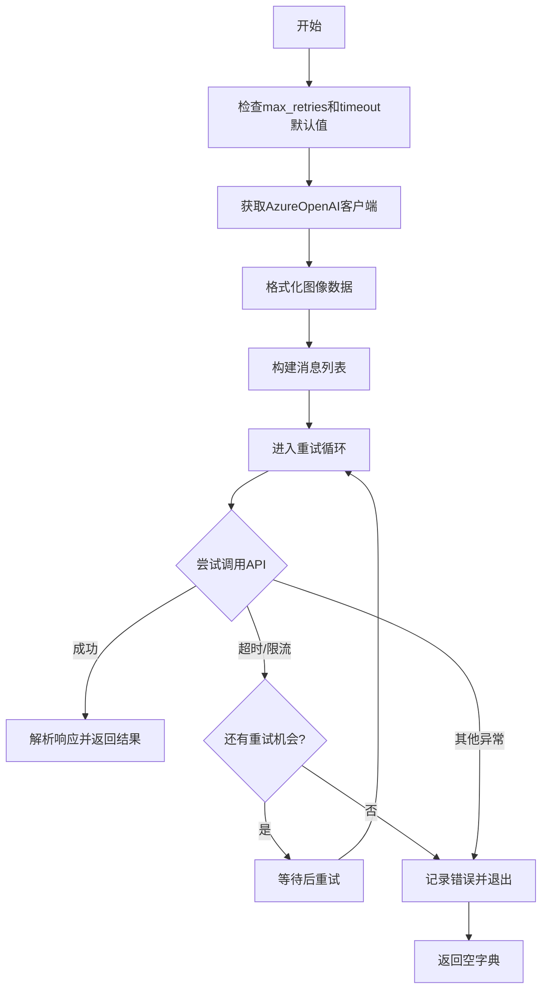
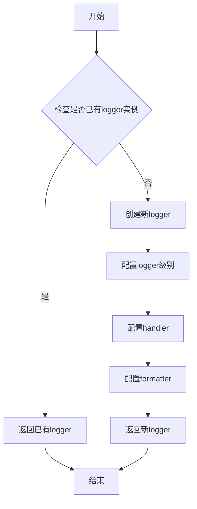
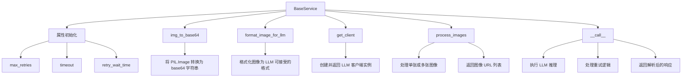
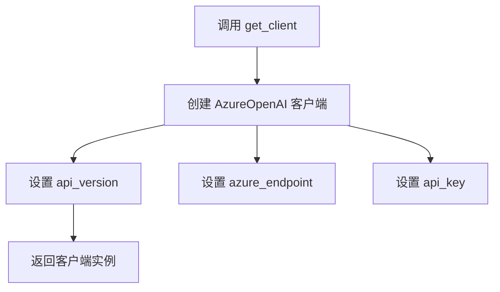
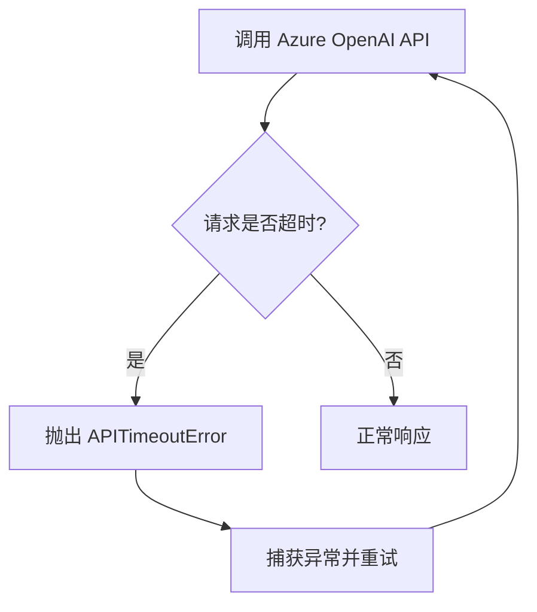
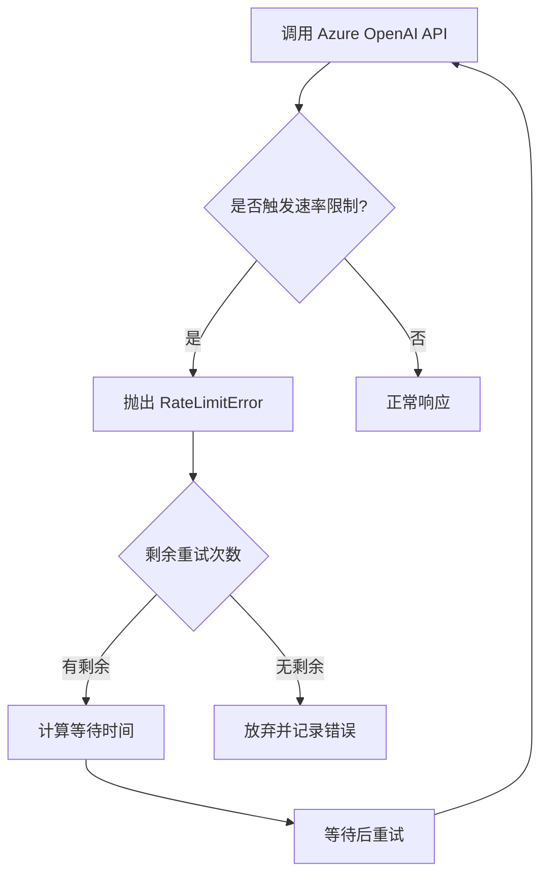
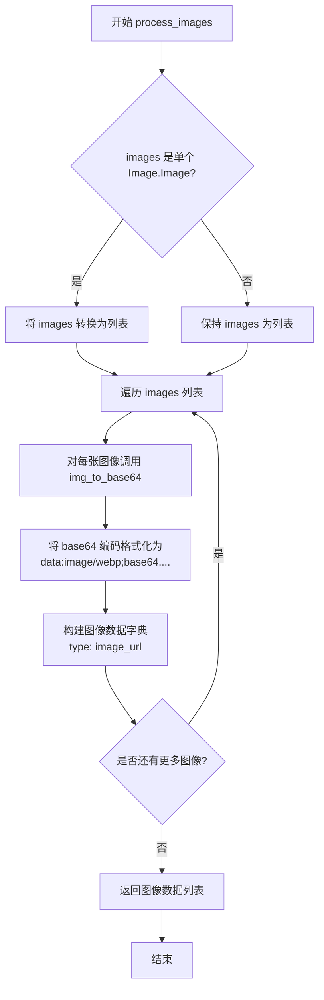
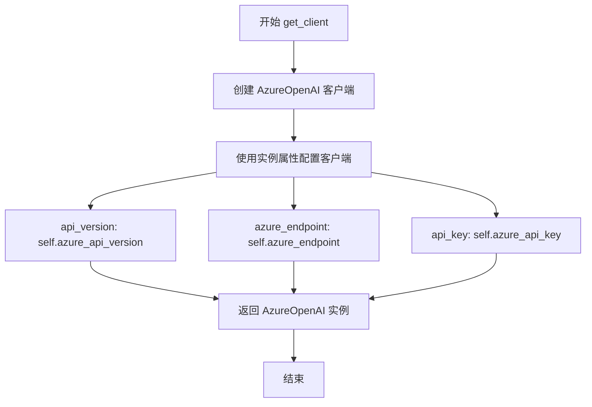

# `marker\marker\services\azure_openai.py` 详细设计文档

该文件实现了一个Azure OpenAI服务封装类（AzureOpenAIService），继承自BaseService，用于通过Azure云平台调用OpenAI的大语言模型进行图像理解和文本生成任务，支持配置化管理、重试机制和响应模式解析。

## 整体流程



## 类结构

```
BaseService (基类服务)
└── AzureOpenAIService (Azure OpenAI服务实现)
```

## 全局变量及字段


### `logger`
    
日志记录器，用于记录服务运行过程中的警告和错误信息

类型：`logging.Logger`
    


### `AzureOpenAIService.azure_endpoint`
    
Azure OpenAI服务的端点URL，不包含尾部斜杠

类型：`Annotated[str, 'Azure端点URL，无尾部斜杠']`
    


### `AzureOpenAIService.azure_api_key`
    
用于访问Azure OpenAI服务的API密钥

类型：`Annotated[str, 'Azure API密钥']`
    


### `AzureOpenAIService.azure_api_version`
    
Azure OpenAI服务的API版本号

类型：`Annotated[str, 'Azure API版本']`
    


### `AzureOpenAIService.deployment_name`
    
Azure上部署的OpenAI模型名称

类型：`Annotated[str, 'Azure模型部署名称']`
    
    

## 全局函数及方法


### `get_logger`

获取一个日志记录器实例，用于在应用中记录日志信息。该函数从 marker.logger 模块导入，返回一个配置好的 logger 对象，供 AzureOpenAIService 类在处理请求错误（如速率限制超时）时记录警告和错误信息。

参数：此函数不接受任何参数。

返回值：`logging.Logger`，返回一个配置好的 Python 日志记录器实例，用于输出应用程序的日志信息。

#### 流程图



#### 带注释源码

```
# 从 marker.logger 模块导入 get_logger 函数
# 注意：以下为基于使用推断的源码结构，实际实现位于 marker.logger 模块中
def get_logger() -> logging.Logger:
    """
    获取或创建一个日志记录器实例。
    
    该函数通常实现为单例模式或模块级缓存，
    确保整个应用中只有一个日志配置实例。
    
    Returns:
        logging.Logger: 配置好的日志记录器实例
    """
    # 实际实现会检查是否已存在 logger
    # 如果存在则返回现有实例，否则创建新实例
    # 配置可能包括：
    # - 日志级别（DEBUG, INFO, WARNING, ERROR, CRITICAL）
    # - 输出格式（formatter）
    # - 输出处理器（handler）- 控制台、文件等
    
    return logger  # 返回配置好的 logger 对象
```

**实际使用示例（来自 provided code）：**

```python
# 导入 get_logger
from marker.logger import get_logger

# 获取 logger 实例
logger = get_logger()

# 在 AzureOpenAIService 中使用
logger.error(
    f"Rate limit error: {e}. Max retries reached. Giving up. (Attempt {tries}/{total_tries})"
)
logger.warning(
    f"Rate limit error: {e}. Retrying in {wait_time} seconds... (Attempt {tries}/{total_tries})"
)
```


### BaseService

BaseService 是 Marker 框架中的基础服务类，提供了与 LLM（大型语言模型）交互的通用能力，包括客户端管理、图像处理、重试机制和超时控制等核心功能。所有具体的 LLM 服务实现（如 AzureOpenAIService）都应继承此类。

参数：

- `max_retries`：`int`，最大重试次数，用于处理临时性 API 错误（如速率限制）
- `timeout`：`int`，API 请求超时时间（秒）
- `retry_wait_time`：`int`，重试之间的等待时间基数（秒），实际等待时间为 tries * retry_wait_time
- `azure_endpoint`：`str`，Azure OpenAI 端点 URL（无尾部斜杠）
- `azure_api_key`：`str`，Azure OpenAI API 密钥
- `azure_api_version`：`str`，Azure OpenAI API 版本
- `deployment_name`：`str`，Azure 部署名称

返回值：`无`，BaseService 是一个基类，通常不直接返回值，而是通过子类实现具体功能

#### 流程图



#### 带注释源码

```python
# BaseService 是所有 LLM 服务的基类
# 定义了通用的配置属性和工具方法
class BaseService:
    # 可配置的服务参数，使用 Pydantic 的 Annotated 进行类型注解和描述
    max_retries: Annotated[int, "最大重试次数"] = 3  # 默认重试3次
    timeout: Annotated[int, "请求超时时间（秒）"] = 60  # 默认超时60秒
    retry_wait_time: Annotated[int, "重试等待时间基数（秒）"] = 2  # 基础等待时间
    
    # 将 PIL 图像转换为 base64 编码的字符串
    def img_to_base64(self, img: PIL.Image.Image) -> str:
        """
        将图像对象转换为 base64 编码的 Data URL
        """
        import base64
        from io import BytesIO
        buffered = BytesIO()
        img.save(buffered, format="WEBP")
        return base64.b64encode(buffered.getvalue()).decode()
    
    # 格式化图像为 LLM 兼容的输入格式
    def format_image_for_llm(self, image) -> list:
        """
        将单张或多张图像转换为 LLM API 所需的消息格式
        """
        if image is None:
            return []
        
        # 处理单张图像
        if isinstance(image, Image.Image):
            image = [image]
        
        # 转换为消息格式
        return self.process_images(image)
    
    # 获取 LLM 客户端（由子类实现）
    def get_client(self):
        """
        创建并返回 LLM 客户端实例
        """
        raise NotImplementedError("子类必须实现 get_client 方法")
    
    # 处理图像列表
    def process_images(self, images: List[PIL.Image.Image]) -> list:
        """
        将图像列表转换为 marker 格式的图像 URL 列表
        """
        return [
            {
                "type": "image_url",
                "image_url": {
                    "url": f"data:image/webp;base64,{self.img_to_base64(img)}"
                }
            }
            for img in images
        ]
    
    # 执行 LLM 推理（由子类实现具体逻辑）
    def __call__(
        self,
        prompt: str,
        image: PIL.Image.Image | List[PIL.Image.Image] | None,
        block: Block | None,
        response_schema: type[BaseModel],
        max_retries: int | None = None,
        timeout: int | None = None,
    ):
        """
        执行 LLM 推理的主方法
        - prompt: 提示词
        - image: 输入图像
        - block: 文档块（用于记录元数据）
        - response_schema: 响应数据模型
        - max_retries: 最大重试次数
        - timeout: 超时时间
        """
        # 1. 设置重试参数
        if max_retries is None:
            max_retries = self.max_retries
        
        # 2. 设置超时参数
        if timeout is None:
            timeout = self.timeout
        
        # 3. 获取客户端
        client = self.get_client()
        
        # 4. 格式化图像数据
        image_data = self.format_image_for_llm(image)
        
        # 5. 构建消息
        messages = [
            {
                "role": "user",
                "content": [
                    *image_data,
                    {"type": "text", "text": prompt},
                ],
            }
        ]
        
        # 6. 执行带重试的请求
        total_tries = max_retries + 1
        for tries in range(1, total_tries + 1):
            try:
                # 发送请求并解析响应
                response = client.beta.chat.completions.parse(...)
                response_text = response.choices[0].message.content
                
                # 更新元数据
                if block:
                    block.update_metadata(
                        llm_tokens_used=response.usage.total_tokens,
                        llm_request_count=1
                    )
                
                # 返回解析后的 JSON
                return json.loads(response_text)
            
            except (APITimeoutError, RateLimitError) as e:
                # 速率限制或超时：等待后重试
                if tries == total_tries:
                    logger.error(f"Max retries reached. Giving up.")
                    break
                else:
                    wait_time = tries * self.retry_wait_time
                    time.sleep(wait_time)
            
            except Exception as e:
                # 其他错误：直接失败
                logger.error(f"Inference failed: {e}")
                break
        
        # 7. 所有重试都失败，返回空字典
        return {}
```


### `AzureOpenAIService.__call__`

该方法是AzureOpenAIService类的核心推理方法，通过调用Azure OpenAI的Chat Completions API实现多模态（图像+文本）推理，支持自动重试机制和响应结构化解析。

参数：

- `prompt`：`str`，用户输入的文本提示词
- `image`：`PIL.Image.Image | List[PIL.Image.Image] | None`，输入的图像或图像列表，支持单图或多图
- `block`：`Block | None`，可选的Block对象，用于记录元数据（如token使用量、请求计数）
- `response_schema`：`type[BaseModel]`（BaseModel的子类型），Pydantic模型类，定义API响应的结构化模式
- `max_retries`：`int | None`，最大重试次数，默认为self.max_retries
- `timeout`：`int | None`，请求超时时间（秒），默认为self.timeout

返回值：`dict`，解析后的JSON响应数据（通过json.loads(response_text)得到），失败时返回空字典`{}`

#### 流程图

```mermaid
flowchart TD
    A[开始 __call__] --> B{检查 max_retries}
    B -->|None| C[使用 self.max_retries]
    B -->|有值| D[使用传入的 max_retries]
    C --> E{检查 timeout}
    D --> E
    E -->|None| F[使用 self.timeout]
    E -->|有值| G[使用传入的 timeout]
    F --> H[获取 AzureOpenAI 客户端]
    G --> H
    H --> I[格式化图像数据]
    I --> J[构建消息列表 messages]
    J --> K[计算总尝试次数 total_tries = max_retries + 1]
    K --> L[进入重试循环 for tries in range(1, total_tries + 1)]
    L --> M[尝试调用 client.beta.chat.completions.parse]
    M --> N{是否成功}
    N -->|是| O[解析响应 JSON]
    O --> P[更新 block 元数据]
    P --> Q[返回 dict 结果]
    N -->|否| R{异常类型}
    R -->|APITimeoutError 或 RateLimitError| S{是否还有重试机会}
    R -->|其他异常| T[记录错误日志并退出]
    S -->|是| U[计算等待时间 wait_time = tries * retry_wait_time]
    S -->|否| V[记录错误日志并退出]
    U --> W[等待 wait_time 秒后继续循环]
    W --> L
    V --> X[返回空字典 {}]
    T --> X
```

#### 带注释源码

```python
def __call__(
    self,
    prompt: str,
    image: PIL.Image.Image | List[PIL.Image.Image] | None,
    block: Block | None,
    response_schema: type[BaseModel],
    max_retries: int | None = None,
    timeout: int | None = None,
):
    # 如果未提供max_retries，则使用类属性中的默认值
    if max_retries is None:
        max_retries = self.max_retries

    # 如果未提供timeout，则使用类属性中的默认值
    if timeout is None:
        timeout = self.timeout

    # 获取AzureOpenAI客户端实例
    client = self.get_client()
    # 将输入图像格式化为LLM可处理的结构
    image_data = self.format_image_for_llm(image)

    # 构建消息列表，包含图像数据和文本提示
    messages = [
        {
            "role": "user",
            "content": [
                *image_data,
                {"type": "text", "text": prompt},
            ],
        }
    ]

    # 计算总尝试次数（重试次数+初始尝试）
    total_tries = max_retries + 1
    # 遍历所有尝试次数
    for tries in range(1, total_tries + 1):
        try:
            # 调用Azure OpenAI的parse端点进行结构化输出
            response = client.beta.chat.completions.parse(
                extra_headers={
                    "X-Title": "Marker",
                    "HTTP-Referer": "https://github.com/datalab-to/marker",
                },
                model=self.deployment_name,
                messages=messages,
                timeout=timeout,
                response_format=response_schema,
            )
            # 提取响应内容
            response_text = response.choices[0].message.content
            # 获取token使用量统计
            total_tokens = response.usage.total_tokens
            # 如果提供了block对象，更新其元数据
            if block:
                block.update_metadata(
                    llm_tokens_used=total_tokens, llm_request_count=1
                )
            # 解析JSON字符串为dict并返回
            return json.loads(response_text)
        # 处理速率限制和超时异常
        except (APITimeoutError, RateLimitError) as e:
            # 如果是最后一次尝试，记录错误并退出循环
            if tries == total_tries:
                logger.error(
                    f"Rate limit error: {e}. Max retries reached. Giving up. (Attempt {tries}/{total_tries})"
                )
                break
            else:
                # 计算指数退避等待时间（每次重试等待时间递增）
                wait_time = tries * self.retry_wait_time
                logger.warning(
                    f"Rate limit error: {e}. Retrying in {wait_time} seconds... (Attempt {tries}/{total_tries})"
                )
                time.sleep(wait_time)
        # 处理其他未知异常
        except Exception as e:
            logger.error(f"Azure OpenAI inference failed: {e}")
            break

    # 所有重试都失败后返回空字典
    return {}
```


### `AzureOpenAI`

Azure OpenAI 客户端类，用于与 Azure 平台上托管的 OpenAI 模型进行交互。该类在代码中作为服务客户端，被 `AzureOpenAIService.get_client()` 方法实例化，用于发送聊天补全请求。

参数：

- `api_version`：`str`，Azure OpenAI API 版本号
- `azure_endpoint`：`str`，Azure OpenAI 端点 URL
- `api_key`：`str`，用于 Azure OpenAI 服务的 API 密钥

返回值：`AzureOpenAI`，返回 Azure OpenAI 客户端实例

#### 流程图



#### 带注释源码

```python
def get_client(self) -> AzureOpenAI:
    """
    创建并返回 Azure OpenAI 客户端实例。
    
    该方法使用类配置中存储的 Azure 凭据初始化客户端，
    供 process 方法在调用 Azure OpenAI API 时使用。
    """
    return AzureOpenAI(
        api_version=self.azure_api_version,      # 从配置获取 API 版本
        azure_endpoint=self.azure_endpoint,        # 从配置获取端点 URL
        api_key=self.azure_api_key,               # 从配置获取 API 密钥
    )
```

---

### `APITimeoutError`

从 openai 库导入的异常类，表示与 Azure OpenAI API 通信时发生超时错误。该异常在代码的推理流程中被捕获，用于处理请求超时情况。

参数：此类为异常类，无需构造函数参数（继承自 Exception）

返回值：异常实例，无返回值

#### 流程图



#### 带注释源码

```python
# 导入声明
from openai import AzureOpenAI, APITimeoutError, RateLimitError

# 在代码中的使用方式
try:
    response = client.beta.chat.completions.parse(
        # ... 请求参数
    )
except (APITimeoutError, RateLimitError) as e:
    # 捕获 API 超时或速率限制错误
    if tries == total_tries:
        # 最后一次尝试失败，记录错误日志
        logger.error(
            f"Rate limit error: {e}. Max retries reached. Giving up. (Attempt {tries}/{total_tries})"
        )
        break
    else:
        # 等待后重试
        wait_time = tries * self.retry_wait_time
        logger.warning(
            f"Rate limit error: {e}. Retrying in {wait_time} seconds... (Attempt {tries}/{total_tries})"
        )
        time.sleep(wait_time)
```

---

### `RateLimitError`

从 openai 库导入的异常类，表示 Azure OpenAI API 调用超出速率限制时抛出的错误。该异常在代码中与 `APITimeoutError` 一起被捕获，实现自动重试机制。

参数：此类为异常类，无需构造函数参数（继承自 Exception）

返回值：异常实例，无返回值

#### 流程图



#### 带注释源码

```python
# 导入声明
from openai import AzureOpenAI, APITimeoutError, RateLimitError

# 在推理方法中的完整异常处理逻辑
for tries in range(1, total_tries + 1):
    try:
        # 发起 API 请求
        response = client.beta.chat.completions.parse(
            extra_headers={"X-Title": "Marker", "HTTP-Referer": "https://github.com/datalab-to/marker"},
            model=self.deployment_name,
            messages=messages,
            timeout=timeout,
            response_format=response_schema,
        )
        # 成功响应处理...
        return json.loads(response_text)
    
    except (APITimeoutError, RateLimitError) as e:
        # 统一捕获超时和速率限制错误
        if tries == total_tries:
            # 所有重试次数用尽，记录错误并退出循环
            logger.error(
                f"Rate limit error: {e}. Max retries reached. Giving up. (Attempt {tries}/{total_tries})"
            )
            break
        else:
            # 线性退避策略：等待时间 = 重试次数 * 基础等待时间
            wait_time = tries * self.retry_wait_time
            logger.warning(
                f"Rate limit error: {e}. Retrying in {wait_time} seconds... (Attempt {tries}/{total_tries})"
            )
            time.sleep(wait_time)
    
    except Exception as e:
        # 其他未知异常，记录错误并退出
        logger.error(f"Azure OpenAI inference failed: {e}")
        break
```


### BaseModel (从 pydantic 导入)

`BaseModel` 是 Pydantic 库中的核心类，用于定义数据模型和进行数据验证。在此代码中，它被用作类型提示，用于约束 `response_schema` 参数，确保该参数是一个继承自 Pydantic `BaseModel` 的类，从而允许 LLM 返回符合特定模式的数据结构。

#### 导入信息

```python
from pydantic import BaseModel
```

#### 使用上下文

在 `AzureOpenAIService.__call__` 方法中使用：

- 参数名称：`response_schema`
- 参数类型：`type[BaseModel]`（继承自 Pydantic BaseModel 的类）
- 参数描述：指定 LLM 响应应该解析到的 Pydantic 模型类，用于结构化输出

```python
def __call__(
    self,
    prompt: str,
    image: PIL.Image.Image | List[PIL.Image.Image] | None,
    block: Block | None,
    response_schema: type[BaseModel],  # <-- BaseModel 在此处使用
    max_retries: int | None = None,
    timeout: int | None = None,
):
```

#### 带注释源码

```python
# 导入 BaseModel 用于定义响应模式
from pydantic import BaseModel

# 在 __call__ 方法中，response_schema 参数接收一个继承自 BaseModel 的类
# 该类定义了期望的输出结构，Pydantic 会自动验证 LLM 返回的数据是否符合该结构
def __call__(
    self,
    prompt: str,
    image: PIL.Image.Image | List[PIL.Image.Image] | None,
    block: Block | None,
    response_schema: type[BaseModel],  # type[BaseModel] 表示一个类而非实例
    max_retries: int | None = None,
    timeout: int | None = None,
):
    # ... 方法实现 ...
    
    # 在调用 LLM 时，response_format 参数被设置为 response_schema
    # 这利用了 Azure OpenAI 的结构化输出功能
    response = client.beta.chat.completions.parse(
        extra_headers={...},
        model=self.deployment_name,
        messages=messages,
        timeout=timeout,
        response_format=response_schema,  # 传入 BaseModel 子类
    )
    
    # 响应内容会被自动解析为 response_schema 指定的 BaseModel 类型
    response_text = response.choices[0].message.content
    return json.loads(response_text)
```

#### 关键点说明

1. **类型提示作用**：`type[BaseModel]` 表示参数应该是一个类（type），而不是类的实例，且该类必须继承自 Pydantic 的 `BaseModel`

2. **结构化输出**：通过结合 Azure OpenAI 的 `beta.chat.completions.parse` 方法和 Pydantic 的 `BaseModel`，可以实现可靠的结构化输出，LLM 的响应会被自动验证和转换

3. **设计模式**：这是一种常见的 LLM 应用架构模式，称为"结构化输出"或"模式约束输出"


### `AzureOpenAIService.process_images`

该方法负责将输入的 PIL 图像对象列表转换为 Azure OpenAI API 所需的特定格式（base64 编码的图像 URL），支持单张图像或多张图像的处理，并返回符合 API 要求的图像数据列表。

参数：

- `images`：`List[PIL.Image.Image]`，待处理的 PIL 图像列表，可以是单张图像或图像列表

返回值：`list`，返回格式化后的图像数据列表，每个元素包含图像的 base64 编码数据和元信息

#### 流程图



#### 带注释源码

```python
def process_images(self, images: List[PIL.Image.Image]) -> list:
    """
    将 PIL 图像列表转换为 Azure OpenAI API 所需的格式
    
    参数:
        images: PIL 图像列表，支持单张图像或图像列表
        
    返回:
        格式化后的图像数据列表，包含 base64 编码的图像 URL
    """
    
    # 如果传入的是单张图像而非列表，则将其包装为列表
    # 以保持处理逻辑的一致性
    if isinstance(images, Image.Image):
        images = [images]

    # 遍历所有图像，将每张图像转换为 Azure OpenAI 所需的格式
    return [
        {
            "type": "image_url",  # 指定内容类型为图像 URL
            "image_url": {
                # 将图像转换为 base64 编码的 WebP 格式 Data URL
                "url": "data:image/webp;base64,{}".format(self.img_to_base64(img)),
            },
        }
        for img in images  # 列表推导式遍历所有输入图像
    ]
```


### `AzureOpenAIService.__call__`

这是 `AzureOpenAIService` 类的核心调用方法，使该类的实例可以像函数一样被调用。该方法接收用户提示和图像，将其发送到 Azure OpenAI 模型进行推理，支持结构化输出（通过 `response_schema`），并实现了自动重试机制以处理 API 超时和速率限制错误，最终返回模型解析后的 JSON 响应。

参数：

- `prompt`：`str`，用户要发送给模型的文本提示（prompt）
- `image`：`PIL.Image.Image | List[PIL.Image.Image] | None`，要发送给模型的图像，支持单张图像、图像列表或无图像（可选）
- `block`：`Block | None`，可选的 Block 对象，用于记录和更新元数据（如 LLM 使用的令牌数量和请求计数）
- `response_schema`：`type[BaseModel]`，Pydantic BaseModel 类型，用于指定期望的响应格式，实现结构化输出
- `max_retries`：`int | None`，最大重试次数，默认为 None，此时使用实例的 `self.max_retries` 属性值
- `timeout`：`int | None`，请求超时时间（秒），默认为 None，此时使用实例的 `self.timeout` 属性值

返回值：`dict`，从模型响应中解析出的 JSON 数据，如果所有重试都失败则返回空字典 `{}`

#### 流程图

```mermaid
flowchart TD
    A[开始 __call__] --> B{检查 max_retries 是否为 None}
    B -->|是| C[max_retries = self.max_retries]
    B -->|否| D[使用传入的 max_retries]
    C --> E{检查 timeout 是否为 None}
    D --> E
    E -->|是| F[timeout = self.timeout]
    E -->|否| G[使用传入的 timeout]
    F --> H[获取 AzureOpenAI 客户端]
    G --> H
    H --> I[格式化图像数据 format_image_for_llm]
    I --> J[构建消息列表 messages]
    J --> K[计算总尝试次数 total_tries = max_retries + 1]
    K --> L[进入重试循环 for tries in range(1, total_tries + 1)]
    L --> M[尝试调用 client.beta.chat.completions.parse]
    M --> N{成功获取响应?}
    N -->|是| O[提取响应内容 response.choices[0].message.content]
    O --> P[获取总令牌数 response.usage.total_tokens]
    P --> Q{block 是否存在?}
    Q -->|是| R[更新 block 元数据: llm_tokens_used, llm_request_count]
    Q -->|否| S[跳过元数据更新]
    R --> T[json.loads 解析响应文本]
    S --> T
    T --> U[返回解析后的 dict]
    N -->|否| V{捕获异常类型]
    V -->|APITimeoutError 或 RateLimitError| W{是否是最后一次尝试}
    W -->|否| X[计算等待时间 wait_time = tries * retry_wait_time]
    X --> Y[日志警告并等待 time.sleep]
    Y --> L
    W -->|是| Z[日志错误并退出循环]
    Z --> AA[返回空字典 {}]
    V -->|其他异常| AB[日志错误并退出循环]
    AB --> AA
```

#### 带注释源码

```python
def __call__(
    self,
    prompt: str,
    image: PIL.Image.Image | List[PIL.Image.Image] | None,
    block: Block | None,
    response_schema: type[BaseModel],
    max_retries: int | None = None,
    timeout: int | None = None,
):
    # 如果未提供 max_retries，则使用类实例的默认重试次数
    if max_retries is None:
        max_retries = self.max_retries

    # 如果未提供 timeout，则使用类实例的默认超时时间
    if timeout is None:
        timeout = self.timeout

    # 获取 AzureOpenAI 客户端实例
    client = self.get_client()
    # 将图像格式化为 LLM 可用的格式（转换为 base64）
    image_data = self.format_image_for_llm(image)

    # 构建消息列表，包含图像和文本内容
    messages = [
        {
            "role": "user",
            "content": [
                *image_data,  # 展开图像数据列表
                {"type": "text", "text": prompt},
            ],
        }
    ]

    # 计算总尝试次数（重试次数 + 1）
    total_tries = max_retries + 1
    # 遍历所有可能的尝试
    for tries in range(1, total_tries + 1):
        try:
            # 调用 Azure OpenAI API 进行解析输出
            response = client.beta.chat.completions.parse(
                extra_headers={
                    "X-Title": "Marker",
                    "HTTP-Referer": "https://github.com/datalab-to/marker",
                },
                model=self.deployment_name,  # 使用的模型部署名称
                messages=messages,  # 消息列表
                timeout=timeout,  # 超时时间
                response_format=response_schema,  # 结构化输出格式
            )
            # 提取模型响应内容
            response_text = response.choices[0].message.content
            # 获取使用的总令牌数
            total_tokens = response.usage.total_tokens
            # 如果提供了 block，则更新元数据
            if block:
                block.update_metadata(
                    llm_tokens_used=total_tokens, llm_request_count=1
                )
            # 解析 JSON 响应并返回
            return json.loads(response_text)
        # 捕获速率限制和超时错误
        except (APITimeoutError, RateLimitError) as e:
            # 速率限制超出
            # 如果是最后一次尝试
            if tries == total_tries:
                # 最后一次尝试失败，放弃
                logger.error(
                    f"Rate limit error: {e}. Max retries reached. Giving up. (Attempt {tries}/{total_tries})"
                )
                break
            else:
                # 计算等待时间（指数退避策略：tries * retry_wait_time）
                wait_time = tries * self.retry_wait_time
                logger.warning(
                    f"Rate limit error: {e}. Retrying in {wait_time} seconds... (Attempt {tries}/{total_tries})"
                )
                # 等待后重试
                time.sleep(wait_time)
        # 捕获其他所有异常
        except Exception as e:
            logger.error(f"Azure OpenAI inference failed: {e}")
            break

    # 所有重试都失败，返回空字典
    return {}
```


### `AzureOpenAIService.get_client`

该方法用于创建并返回一个配置好的 Azure OpenAI 客户端实例，以便与 Azure OpenAI 服务进行交互。它使用类实例的配置属性（azure_api_version、azure_endpoint、api_key）初始化客户端。

参数： 无（仅包含隐式参数 `self`）

返回值：`AzureOpenAI`，返回配置好的 Azure OpenAI 客户端实例，可用于发送请求到 Azure OpenAI 服务。

#### 流程图



#### 带注释源码

```python
def get_client(self) -> AzureOpenAI:
    """
    创建并返回一个配置好的 Azure OpenAI 客户端实例。
    
    该方法使用类实例的配置属性来初始化 AzureOpenAI 客户端，
    客户端随后可用于与 Azure OpenAI 服务进行交互。
    
    参数：
        无（除了隐式的 self 参数）
        
    返回值：
        AzureOpenAI: 配置好的 Azure OpenAI 客户端实例
    """
    # 使用实例的配置属性创建 AzureOpenAI 客户端
    return AzureOpenAI(
        api_version=self.azure_api_version,    # Azure OpenAI API 版本
        azure_endpoint=self.azure_endpoint,     # Azure OpenAI 端点 URL
        api_key=self.azure_api_key,             # Azure API 密钥
    )
```

## 关键组件


### AzureOpenAIService

Azure OpenAI 推理服务类，负责封装 Azure OpenAI API 的调用逻辑，支持图像输入、响应模式校验和重试机制。

### 图像处理组件

负责将 PIL 图像转换为 Azure OpenAI API 所需的 base64 编码格式，支持单图和多图列表处理。

### 重试与错误处理机制

实现指数退避重试逻辑，处理 API 超限和速率限制错误，记录详细日志并在最大重试次数后放弃请求。

### 客户端管理

封装 AzureOpenAI 客户端的初始化过程，使用配置好的端点、API 版本和密钥创建客户端实例。

### 响应解析与元数据更新

解析 LLM 返回的 JSON 响应，更新 Block 元数据中的 token 使用量和请求计数信息。

### 配置字段

包含 azure_endpoint、azure_api_key、azure_api_version 和 deployment_name 四个必需的配置项，用于 Azure OpenAI 服务连接。


## 问题及建议


### 已知问题

- **客户端重复创建**：`get_client()` 在每次调用时都创建新的 `AzureOpenAI` 客户端实例，未实现客户端缓存或连接池复用，导致不必要的资源开销
- **重试策略单一**：使用线性退避（`wait_time = tries * self.retry_wait_time`），对于 RateLimit 场景不够灵活，建议采用指数退避策略
- **错误处理不一致**：API 超时和限流错误会触发重试逻辑，但其他异常直接中断并返回空字典 `{}`，调用方无法区分是成功返回空结果还是调用失败
- **硬编码图片格式**：`process_images` 方法中图片格式硬编码为 `"image/webp"`，缺乏灵活性，无法支持其他图片格式（如 PNG、JPEG）
- **响应解析冗余**：使用 `client.beta.chat.completions.parse()` 已返回结构化对象，再调用 `json.loads(response_text)` 存在冗余（需确认 `response.choices[0].message.content` 返回类型）
- **缺少输入验证**：未对 `image` 参数进行 `None` 验证，当传入 `None` 时 `format_image_for_llm` 可能产生意外行为
- **缺乏资源管理**：未实现 `__enter__`/`__exit__` 上下文管理器协议或显式的资源清理方法，客户端连接可能未被正确释放

### 优化建议

- 实现客户端单例模式或实例缓存，使用类级别/模块级别变量存储已创建的客户端，避免重复实例化
- 引入指数退避重试策略（如 `2^tries * base_wait_time`），并添加最大等待时间上限
- 定义自定义异常类（如 `AzureOpenAIError`），在所有重试耗尽时主动抛出异常而非返回空字典，提高调用方错误感知能力
- 将图片格式提取为可配置参数，添加 `image_format: str = "webp"` 类属性以支持配置化
- 移除不必要的 `json.loads` 调用，直接使用响应对象的属性；或若 `content` 确为 JSON 字符串，则添加类型检查
- 在方法入口添加 `if image is None: raise ValueError("image parameter cannot be None")` 进行前置条件验证
- 实现上下文管理器协议或添加 `close()` 方法以支持显式资源清理，配合 `try-finally` 块使用
- 添加请求级别的日志记录，包括请求ID、模型名称、token 消耗等，便于问题排查和监控

## 其它


### 设计目标与约束

本服务旨在提供与Azure OpenAI API集成的图像推理能力，支持多模态输入（图像+文本），通过结构化输出（response_schema）确保返回结果的类型安全。设计约束包括：1）必须使用Azure OpenAI的beta API端点；2）图像需转换为base64格式的data URL；3）响应格式必须符合Pydantic BaseModel定义；4）重试机制仅针对超时和限流错误，其他异常直接终止。

### 错误处理与异常设计

本服务采用分层异常处理策略。第一层针对可重试异常（APITimeoutError、RateLimitError），采用指数退避策略（wait_time = tries * retry_wait_time），最大重试次数由max_retries控制；第二层针对不可预知的通用异常（Exception），仅记录错误日志并中断执行，返回空字典作为降级结果。对于最后重试仍然失败的情况，记录error级别日志并放弃重试。异常信息通过marker.logger记录，包含错误详情、当前重试次数和总重试次数。

### 数据流与状态机

输入数据流：prompt(str) + image(PIL.Image或列表) + block(Block可选) + response_schema(type[BaseModel]) + max_retries + timeout

处理流程状态机：
1. 初始化状态 - 设置重试次数和超时值
2. 客户端获取状态 - 通过get_client()获取AzureOpenAI客户端
3. 图像格式化状态 - 调用format_image_for_llm将图像转为base64
4. 消息构建状态 - 组装包含图像和文本的消息数组
5. API调用状态 - 循环尝试调用client.beta.chat.completions.parse
6. 响应解析状态 - 解析JSON响应，更新block元数据
7. 完成状态 - 返回解析后的JSON对象或空字典

### 外部依赖与接口契约

核心依赖：
- openai.AzureOpenAI：Azure OpenAI官方SDK客户端
- PIL.Image：图像处理库
- pydantic.BaseModel：响应schema基类
- marker.schema.blocks.Block：元数据更新目标
- marker.services.BaseService：服务基类
- marker.logger：日志记录器

接口契约：
- process_images：输入PIL.Image或列表，输出符合OpenAI Vision API格式的图像URL列表
- __call__：主推理接口，输入prompt/图像/block/response_schema，输出符合schema的JSON对象
- get_client：返回AzureOpenAI客户端实例，每次调用创建新客户端

### 配置要求

必需配置项：
- azure_endpoint：Azure OpenAI端点URL（无尾部斜杠）
- azure_api_key：API密钥
- azure_api_version：API版本（如"2024-02-15"）
- deployment_name：部署名称

可选配置项（继承自BaseService）：
- max_retries：默认重试次数
- timeout：请求超时时间
- retry_wait_time：重试间隔基数
</think>
    