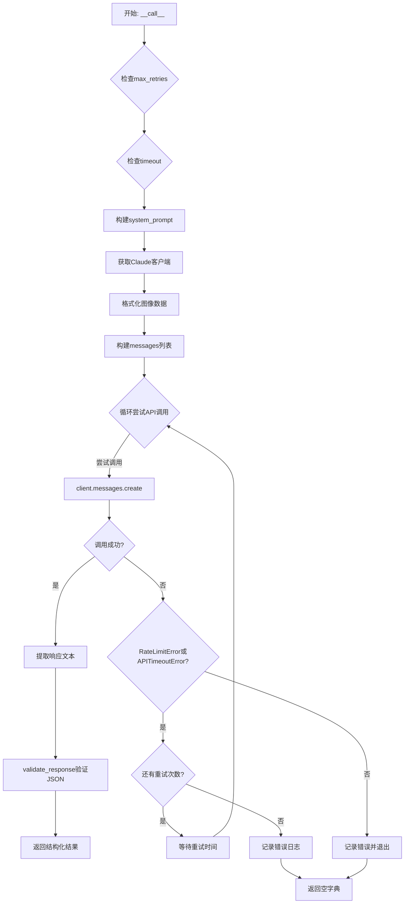
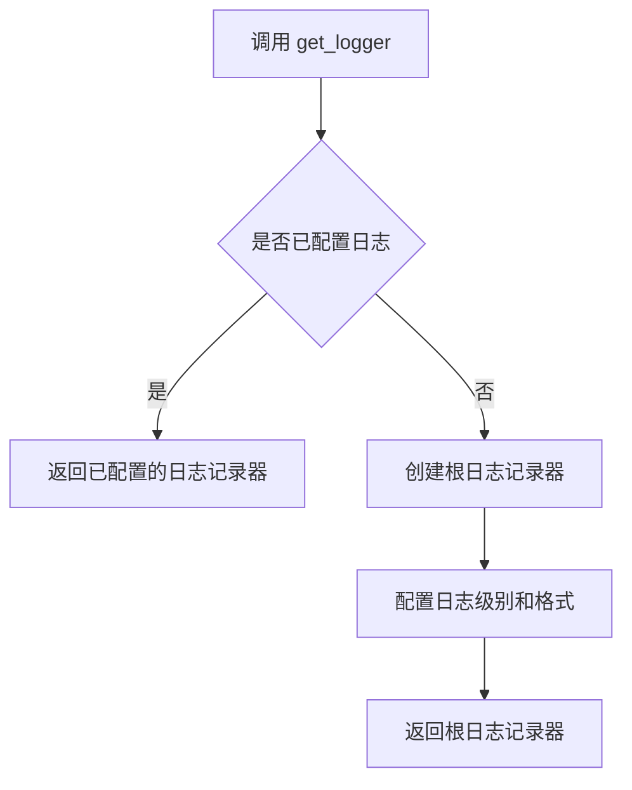
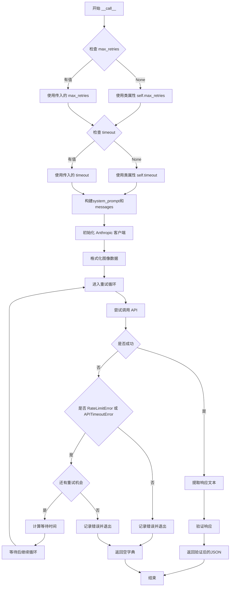
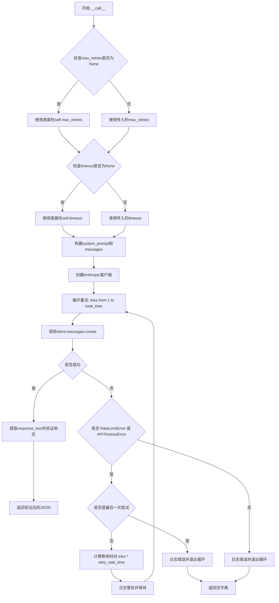
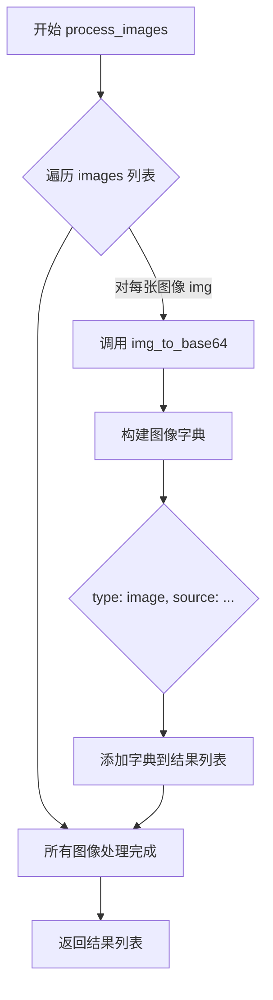
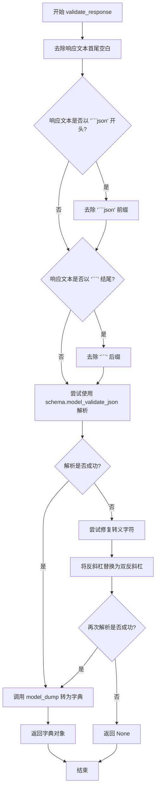
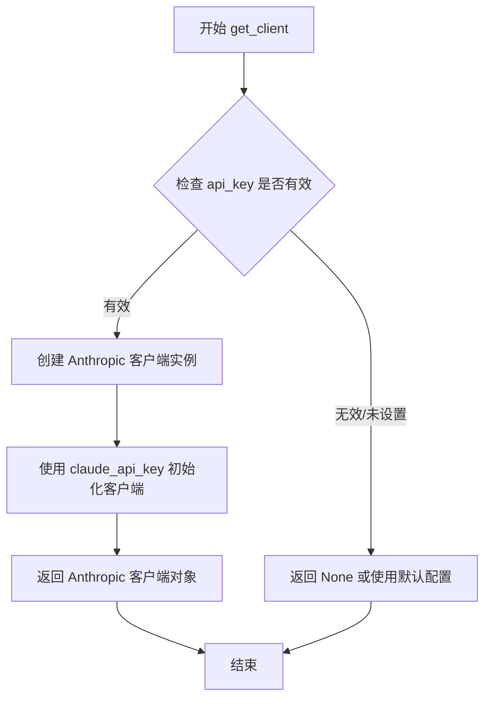

# `marker\marker\services\claude.py` 详细设计文档

这是一个调用Anthropic Claude API的服务类，负责将图像和文本提示转换为结构化的JSON响应，支持重试机制和响应验证。

## 整体流程



## 类结构

```
BaseService (基类)
└── ClaudeService (继承基类)
```

## 全局变量及字段


### `logger`
    
日志记录实例，用于输出程序运行过程中的日志信息

类型：`logging.Logger`
    


### `json`
    
Python内置的JSON处理模块，用于JSON数据的序列化和反序列化

类型：`module`
    


### `time`
    
Python内置的时间处理模块，提供时间相关的函数和延迟功能

类型：`module`
    


### `PIL`
    
Python图像处理库Pillow的别名，用于图像打开、处理和操作

类型：`module`
    


### `anthropic`
    
Anthropic公司开发的Claude API客户端库，用于调用Claude模型

类型：`module`
    


### `ClaudeService.claude_model_name`
    
Claude模型名称，默认为claude-3-7-sonnet-20250219

类型：`Annotated[str]`
    


### `ClaudeService.claude_api_key`
    
Claude API密钥，用于身份验证

类型：`Annotated[str]`
    


### `ClaudeService.max_claude_tokens`
    
单次Claude请求的最大token数，默认为8192

类型：`Annotated[int]`
    
    

## 全局函数及方法


### `get_logger`

获取日志记录器实例，用于在应用程序中记录不同级别的日志信息。

参数：

- 无

返回值：`logging.Logger`，返回 Python 标准日志记录器对象，具有 error、warning、info、debug 等日志方法

#### 流程图



#### 带注释源码

```
# 从 marker.logger 模块导入 get_logger 函数
# 该函数定义在 marker/logger.py 文件中（未在当前代码中提供）
from marker.logger import get_logger

# 调用 get_logger() 获取日志记录器实例
# 返回值是一个标准的 Python logging.Logger 对象
logger = get_logger()

# 使用示例（在 ClaudeService 类中）
logger.error(
    f"Rate limit error: {e}. Max retries reached. Giving up. (Attempt {tries}/{total_tries})",
)
logger.warning(
    f"Rate limit error: {e}. Retrying in {wait_time} seconds... (Attempt {tries}/{total_tries})",
)
```

> **注意**：由于 `get_logger` 函数的实际源码定义在 `marker.logger` 模块中（未在提供的代码文件中包含），以上源码是根据其在代码中的使用方式推断得出的。该函数通常是一个工厂函数或单例模式实现，用于获取配置好的 Python 标准日志记录器实例。


### `ClaudeService.__call__`

该方法是`ClaudeService`类的核心调用方法，继承自`BaseService`基类。它接收提示词、图像、文档块和响应模式，通过Anthropic Claude API生成响应，并支持重试机制以处理速率限制和超时情况。

参数：

-  `prompt`：`str`，用户提示词，用于指导模型生成响应
-  `image`：`PIL.Image.Image | List[PIL.Image.Image] | None`，要处理的图像或图像列表，可为空
-  `block`：`Block | None`，文档块对象，可为空
-  `response_schema`：`type[BaseModel]`，Pydantic响应模式类型，用于验证API返回的JSON结构
-  `max_retries`：`int | None`，最大重试次数，默认为None（使用类属性max_retries）
-  `timeout`：`int | None`，请求超时时间（秒），默认为None（使用类属性timeout）

返回值：`dict`，返回验证后的响应JSON数据，如果所有重试都失败则返回空字典

#### 流程图



#### 带注释源码

```python
def __call__(
    self,
    prompt: str,
    image: PIL.Image.Image | List[PIL.Image.Image] | None,
    block: Block | None,
    response_schema: type[BaseModel],
    max_retries: int | None = None,
    timeout: int | None = None,
):
    """
    调用 Claude API 处理请求的主方法
    
    参数:
        prompt: 用户提示词文本
        image: 输入图像(PIL Image对象或列表)
        block: 文档块对象,可用于上下文
        response_schema: Pydantic BaseModel类型,定义响应JSON结构
        max_retries: 最大重试次数,覆盖类属性
        timeout: 请求超时秒数,覆盖类属性
    
    返回:
        验证后的响应JSON字典,失败时返回空字典
    """
    
    # 如果未提供max_retries,则使用类属性默认值
    if max_retries is None:
        max_retries = self.max_retries

    # 如果未提供timeout,则使用类属性默认值
    if timeout is None:
        timeout = self.timeout

    # 从响应schema生成JSON schema示例,用于构建system prompt
    schema_example = response_schema.model_json_schema()
    
    # 构建system prompt,要求模型返回指定schema的JSON
    system_prompt = f"""
Follow the instructions given by the user prompt.  You must provide your response in JSON format matching this schema:

{json.dumps(schema_example, indent=2)}

Respond only with the JSON schema, nothing else. Do not include ```json, ```,  or any other formatting.
""".strip()

    # 获取Anthropic客户端实例
    client = self.get_client()
    
    # 将输入图像格式化为LLM可处理的格式
    image_data = self.format_image_for_llm(image)

    # 构建消息列表,包含图像和文本
    messages = [
        {
            "role": "user",
            "content": [
                *image_data,
                {"type": "text", "text": prompt},
            ],
        }
    ]

    # 计算总尝试次数(重试次数+1)
    total_tries = max_retries + 1
    
    # 重试循环
    for tries in range(1, total_tries + 1):
        try:
            # 调用Claude API
            response = client.messages.create(
                system=system_prompt,
                model=self.claude_model_name,
                max_tokens=self.max_claude_tokens,
                messages=messages,
                timeout=timeout,
            )
            
            # 从响应中提取文本内容
            response_text = response.content[0].text
            
            # 验证并返回响应
            return self.validate_response(response_text, response_schema)
        
        # 捕获速率限制和超时错误
        except (RateLimitError, APITimeoutError) as e:
            # 判断是否为最后一次尝试
            if tries == total_tries:
                # 所有重试都已失败,记录错误并退出
                logger.error(
                    f"Rate limit error: {e}. Max retries reached. Giving up. (Attempt {tries}/{total_tries})",
                )
                break
            else:
                # 计算指数退避等待时间
                wait_time = tries * self.retry_wait_time
                logger.warning(
                    f"Rate limit error: {e}. Retrying in {wait_time} seconds... (Attempt {tries}/{total_tries})",
                )
                # 等待后重试
                time.sleep(wait_time)
        
        # 捕获其他所有异常
        except Exception as e:
            logger.error(f"Error during Claude API call: {e}")
            break

    # 所有重试都失败后返回空字典
    return {}
```


### `ClaudeService.__call__`

调用Claude API处理图像和文本提示，返回符合指定schema的JSON响应。该方法集成了重试机制、错误处理和响应验证功能。

参数：

- `prompt`：`str`，用户提供的文本提示
- `image`：`PIL.Image.Image | List[PIL.Image.Image] | None`，要处理的图像，可以是单张图像、图像列表或空
- `block`：`Block | None`，块类型对象（未在此文件中定义，来自marker.schema.blocks）
- `response_schema`：`type[BaseModel]`（Pydantic BaseModel类型），用于验证API响应的schema类
- `max_retries`：`int | None`，最大重试次数，默认为None（使用类属性max_retries）
- `timeout`：`int | None`，请求超时时间，默认为None（使用类属性timeout）

返回值：`dict`，验证后的JSON响应字典，如果所有重试都失败则返回空字典

#### 流程图



#### 带注释源码

```python
def __call__(
    self,
    prompt: str,  # 用户提供的文本提示
    image: PIL.Image.Image | List[PIL.Image.Image] | None,  # 要处理的图像
    block: Block | None,  # 块类型对象（未在此文件中定义）
    response_schema: type[BaseModel],  # Pydantic BaseModel类型，用于验证响应
    max_retries: int | None = None,  # 最大重试次数
    timeout: int | None = None,  # 请求超时时间
):
    # 处理max_retries参数：如果未提供，则使用类属性max_retries
    if max_retries is None:
        max_retries = self.max_retries

    # 处理timeout参数：如果未提供，则使用类属性timeout
    if timeout is None:
        timeout = self.timeout

    # 从response_schema生成JSON schema示例
    schema_example = response_schema.model_json_schema()
    # 构建system prompt，包含JSON schema要求和响应格式说明
    system_prompt = f"""
Follow the instructions given by the user prompt.  You must provide your response in JSON format matching this schema:

{json.dumps(schema_example, indent=2)}

Respond only with the JSON schema, nothing else.  Do not include ```json, ```,  or any other formatting.
""".strip()

    # 获取Anthropic客户端实例
    client = self.get_client()
    # 格式化图像数据为LLM可处理格式
    image_data = self.format_image_for_llm(image)

    # 构建消息列表，包含图像和文本
    messages = [
        {
            "role": "user",
            "content": [
                *image_data,  # 展开图像数据
                {"type": "text", "text": prompt},  # 添加文本提示
            ],
        }
    ]

    # 计算总尝试次数 = 重试次数 + 1（首次尝试）
    total_tries = max_retries + 1
    # 遍历所有尝试次数
    for tries in range(1, total_tries + 1):
        try:
            # 调用Claude API创建消息
            response = client.messages.create(
                system=system_prompt,
                model=self.claude_model_name,
                max_tokens=self.max_claude_tokens,
                messages=messages,
                timeout=timeout,
            )
            # 从响应中提取文本内容
            response_text = response.content[0].text
            # 验证响应并返回JSON
            return self.validate_response(response_text, response_schema)
        # 捕获速率限制和API超时错误
        except (RateLimitError, APITimeoutError) as e:
            # 检查是否是最后一次尝试
            if tries == total_tries:
                # 最后一次尝试失败，记录错误日志并退出
                logger.error(
                    f"Rate limit error: {e}. Max retries reached. Giving up. (Attempt {tries}/{total_tries})",
                )
                break
            else:
                # 计算等待时间：尝试次数 * 重试等待时间
                wait_time = tries * self.retry_wait_time
                # 记录警告日志并等待
                logger.warning(
                    f"Rate limit error: {e}. Retrying in {wait_time} seconds... (Attempt {tries}/{total_tries})",
                )
                time.sleep(wait_time)
        # 捕获其他所有异常
        except Exception as e:
            # 记录错误日志并退出
            logger.error(f"Error during Claude API call: {e}")
            break

    # 所有重试都失败后返回空字典
    return {}
```


### `ClaudeService.__call__`

该方法是 ClaudeService 类的核心调用方法，接收用户提示、图像和 Pydantic BaseModel 响应模式，通过 Anthropic Claude API 发送请求并返回符合模式验证的字典结果。

参数：

- `prompt`：`str`，用户提示词
- `image`：`PIL.Image.Image | List[PIL.Image.Image] | None`，输入图像，可为单张图像、图像列表或空
- `block`：`Block | None`，文档块对象，可选
- `response_schema`：`type[BaseModel]`，Pydantic BaseModel 类型，用于验证 API 响应
- `max_retries`：`int | None = None`，最大重试次数，默认为服务实例配置
- `timeout`：`int | None = None`，请求超时时间，默认为服务实例配置

返回值：`dict`，验证后的 JSON 响应字典

#### 流程图

```mermaid
flowchart TD
    A[开始 __call__] --> B{检查 max_retries}
    B -->|None| C[使用默认值 self.max_retries]
    B -->|有值| D[使用传入值]
    C --> E{检查 timeout}
    D --> E
    E -->|None| F[使用默认值 self.timeout]
    E -->|有值| G[使用传入值]
    F --> H[生成 system_prompt 和 image_data]
    G --> H
    H --> I[创建 messages 列表]
    I --> J[循环尝试请求 max_retries+1 次]
    J --> K{发送 API 请求}
    K -->|成功| L[提取响应文本]
    K -->|RateLimitError/APITimeoutError| M{还有重试次数?}
    M -->|是| N[等待 retry_wait_time * tries]
    M -->|否| O[记录错误日志并退出]
    N --> J
    L --> P[调用 validate_response 验证响应]
    P --> Q[返回验证后的字典]
    O --> R[返回空字典 {}]
    K -->|其他异常| S[记录错误并退出]
    S --> R
```

#### 带注释源码

```python
def __call__(
    self,
    prompt: str,
    image: PIL.Image.Image | List[PIL.Image.Image] | None,
    block: Block | None,
    response_schema: type[BaseModel],
    max_retries: int | None = None,
    timeout: int | None = None,
):
    """
    调用 Claude API 处理图像和文本提示，返回符合 schema 定义的验证结果
    
    参数:
        prompt: 用户提示词字符串
        image: PIL 图像对象或图像列表，可为 None
        block: 文档块对象，用于上下文信息
        response_schema: Pydantic BaseModel 子类类型，用于响应验证
        max_retries: 最大重试次数，None 时使用类默认值
        timeout: 请求超时秒数，None 时使用类默认值
    
    返回:
        验证后的响应字典，失败时返回空字典
    """
    # 使用默认最大重试次数（如果未指定）
    if max_retries is None:
        max_retries = self.max_retries

    # 使用默认超时时间（如果未指定）
    if timeout is None:
        timeout = self.timeout

    # 从 response_schema 生成 JSON schema 用于 system prompt
    schema_example = response_schema.model_json_schema()
    system_prompt = f"""
Follow the instructions given by the user prompt.  You must provide your response in JSON format matching this schema:

{json.dumps(schema_example, indent=2)}

Respond only with the JSON schema, nothing else.  Do not include ```json, ```,  or any other formatting.
""".strip()

    # 获取 Anthropic 客户端实例
    client = self.get_client()
    
    # 将图像格式化为 LLM 所需格式
    image_data = self.format_image_for_llm(image)

    # 构建消息结构
    messages = [
        {
            "role": "user",
            "content": [
                *image_data,
                {"type": "text", "text": prompt},
            ],
        }
    ]

    # 计算总尝试次数（重试次数 + 1）
    total_tries = max_retries + 1
    
    # 重试循环
    for tries in range(1, total_tries + 1):
        try:
            # 调用 Claude Messages API
            response = client.messages.create(
                system=system_prompt,
                model=self.claude_model_name,
                max_tokens=self.max_claude_tokens,
                messages=messages,
                timeout=timeout,
            )
            
            # 从响应中提取文本内容
            response_text = response.content[0].text
            
            # 验证并返回符合 schema 的响应
            return self.validate_response(response_text, response_schema)
        
        # 处理速率限制和超时错误
        except (RateLimitError, APITimeoutError) as e:
            if tries == total_tries:
                # 所有重试都失败，记录错误日志并退出
                logger.error(
                    f"Rate limit error: {e}. Max retries reached. Giving up. (Attempt {tries}/{total_tries})",
                )
                break
            else:
                # 计算指数退避等待时间
                wait_time = tries * self.retry_wait_time
                logger.warning(
                    f"Rate limit error: {e}. Retrying in {wait_time} seconds... (Attempt {tries}/{total_tries})",
                )
                time.sleep(wait_time)
        
        # 处理其他异常
        except Exception as e:
            logger.error(f"Error during Claude API call: {e}")
            break

    # 所有尝试都失败后返回空字典
    return {}
```


### `ClaudeService.process_images`

该方法接收一个PIL图像列表，将每张图像转换为Base64编码的WebP格式，并按照Anthropic Claude API要求的图像消息格式构建数据字典列表，用于后续与Claude模型的多模态交互。

参数：

- `images`：`List[Image.Image]`，待处理的PIL图像对象列表

返回值：`List[dict]`，符合Anthropic API图像格式要求的字典列表，每项包含type、source（base64编码的图像数据、媒体类型等信息）

#### 流程图



#### 带注释源码

```python
def process_images(self, images: List[Image.Image]) -> List[dict]:
    """
    将图像列表转换为Anthropic API所需的格式
    
    参数:
        images: PIL图像对象列表
        
    返回:
        符合Claude API图像消息格式的字典列表
    """
    return [
        {
            "type": "image",  # 标识为图像类型
            "source": {
                "type": "base64",  # 使用Base64编码传输
                "media_type": "image/webp",  # 图像媒体类型为WebP
                "data": self.img_to_base64(img),  # 调用Base64转换方法
            },
        }
        for img in images  # 列表推导式遍历每张图像
    ]
```


### `ClaudeService.validate_response`

该方法负责验证并解析来自 Claude API 的响应文本，清理可能的 Markdown 代码块标记，尝试将响应解析为指定类型的 JSON，如果首次解析失败则尝试修复转义字符后再次解析，最终返回验证后的字典对象。

参数：

- `self`：`ClaudeService`，类的实例本身
- `response_text`：`str`，从 Claude API 返回的原始响应文本，可能包含 Markdown 代码块标记（如 ```json）
- `schema`：`type[T]`，Pydantic 模型类型，用于验证和解析 JSON 响应，其中 T 是继承自 BaseModel 的类型

返回值：`T`，验证并解析后的 JSON 对象（以字典形式返回），如果所有解析尝试都失败则返回 `None`

#### 流程图



#### 带注释源码

```python
def validate_response(self, response_text: str, schema: type[T]) -> T:
    """
    验证并解析来自 Claude API 的响应文本为指定类型的 JSON 对象
    
    Args:
        response_text: 从 Claude API 返回的原始响应文本
        schema: Pydantic 模型类型，用于验证和解析 JSON
    
    Returns:
        验证后的字典对象，解析失败返回 None
    """
    # 步骤1: 去除首尾空白字符
    response_text = response_text.strip()
    
    # 步骤2: 检查并去除 Markdown 代码块开始标记 ```json
    if response_text.startswith("```json"):
        # 去除 ```json 这7个字符
        response_text = response_text[7:]
    
    # 步骤3: 检查并去除 Markdown 代码块结束标记 ```
    if response_text.endswith("```"):
        # 去除末尾的 ``` (3个字符)
        response_text = response_text[:-3]
    
    # 步骤4: 第一次尝试直接解析 JSON
    try:
        # 使用 Pydantic 的 model_validate_json 验证和解析 JSON 字符串
        out_schema = schema.model_validate_json(response_text)
        # 将 Pydantic 模型实例转换为字典
        out_json = out_schema.model_dump()
        return out_json
    except Exception:
        # 步骤5: 第一次解析失败，尝试修复转义字符后再次解析
        try:
            # 将所有反斜杠替换为双反斜杠，处理转义问题
            escaped_str = response_text.replace("\\", "\\\\")
            out_schema = schema.model_validate_json(escaped_str)
            return out_schema.model_dump()
        except Exception:
            # 步骤6: 所有解析尝试都失败，返回 None
            return
```


### `ClaudeService.get_client`

获取 Anthropic API 客户端实例，用于与 Claude 模型进行交互。

参数：

- `self`：隐式参数，`ClaudeService` 类实例本身

返回值：`anthropic.Anthropic`，返回配置好的 Anthropic 客户端对象，可用于发送 API 请求

#### 流程图



#### 带注释源码

```python
def get_client(self):
    """
    获取并返回配置好的 Anthropic API 客户端实例。
    
    该方法使用类实例的 claude_api_key 属性来初始化 Anthropic 客户端，
    客户端创建后可用于调用 Claude 模型的 API 接口。
    
    Returns:
        anthropic.Anthropic: 配置好的 Anthropic 客户端实例，
                             包含 API 密钥认证信息
    """
    return anthropic.Anthropic(
        api_key=self.claude_api_key,  # 使用类属性中配置的 Claude API 密钥
    )
```


### `ClaudeService.__call__`

该方法是 `ClaudeService` 类的核心调用入口，接收用户提示词、图像数据、块信息和响应模式，通过 Anthropic Claude API 发送请求并获取结构化响应。该方法内置重试机制来处理速率限制和超时错误，并使用提供的 Pydantic 模式验证和解析 API 返回的 JSON 响应。

参数：

- `prompt`：`str`，用户提示词，用于指导 Claude 模型生成响应
- `image`：`PIL.Image.Image | List[PIL.Image.Image] | None`，要处理的图像或图像列表，支持单图或多图输入
- `block`：`Block | None`，可选的文档块对象，用于上下文信息
- `response_schema`：`type[BaseModel]`（Pydantic BaseModel 类型），用于验证 API 响应的 Pydantic 模式类
- `max_retries`：`int | None`，最大重试次数，默认为 `self.max_retries`
- `timeout`：`int | None`，请求超时时间（秒），默认为 `self.timeout`

返回值：`dict`，验证后的响应 JSON 数据，如果所有重试均失败则返回空字典 `{}`

#### 流程图

```mermaid
flowchart TD
    A[开始 __call__] --> B{检查 max_retries 是否为 None}
    B -->|是| C[设置 max_retries = self.max_retries]
    B -->|否| D{检查 timeout 是否为 None}
    C --> D
    D -->|是| E[设置 timeout = self.timeout]
    D -->|否| F[生成 system_prompt]
    E --> F
    
    F --> G[获取 Claude 客户端]
    G --> H[格式化图像数据]
    H --> I[构建 messages 列表]
    I --> J[计算总尝试次数 = max_retries + 1]
    J --> K[进入重试循环 for tries in range(1, total_tries + 1)]
    
    K --> L[调用 client.messages.create API]
    L --> M{检查异常类型}
    M -->|RateLimitError 或 APITimeoutError| N{是否是最后一次尝试}
    M -->|其他异常| O[记录错误并 break]
    M -->|无异常| P[提取响应文本]
    
    N -->|是| Q[记录错误日志，break 退出]
    N -->|否| R[计算等待时间 = tries * retry_wait_time]
    R --> S[记录警告日志并 time.sleep 等待]
    S --> K
    
    P --> T[调用 validate_response 验证响应]
    T --> U[返回验证后的 JSON 数据]
    
    O --> V[返回空字典 {}]
    Q --> V
    
    U --> W[结束]
    V --> W
```

#### 带注释源码

```python
def __call__(
    self,
    prompt: str,
    image: PIL.Image.Image | List[PIL.Image.Image] | None,
    block: Block | None,
    response_schema: type[BaseModel],
    max_retries: int | None = None,
    timeout: int | None = None,
):
    """
    主调用方法：发送请求到 Claude API 并获取结构化响应
    
    参数:
        prompt: 用户提示词
        image: 图像或图像列表
        block: 可选的文档块
        response_schema: Pydantic 响应模式类
        max_retries: 最大重试次数（可选）
        timeout: 请求超时时间（可选）
    
    返回:
        验证后的响应字典，失败时返回空字典
    """
    # 如果未指定 max_retries，使用默认值
    if max_retries is None:
        max_retries = self.max_retries

    # 如果未指定 timeout，使用默认值
    if timeout is None:
        timeout = self.timeout

    # 从响应模式生成 JSON schema 并构建系统提示词
    schema_example = response_schema.model_json_schema()
    system_prompt = f"""
Follow the instructions given by the user prompt.  You must provide your response in JSON format matching this schema:

{json.dumps(schema_example, indent=2)}

Respond only with the JSON schema, nothing else.  Do not include ```json, ```,  or any other formatting.
""".strip()

    # 获取 Anthropic 客户端实例
    client = self.get_client()
    # 将图像格式化为 LLM 可用的数据格式
    image_data = self.format_image_for_llm(image)

    # 构建消息列表，包含图像和文本提示
    messages = [
        {
            "role": "user",
            "content": [
                *image_data,
                {"type": "text", "text": prompt},
            ],
        }
    ]

    # 计算总尝试次数（重试次数 + 初始尝试）
    total_tries = max_retries + 1
    # 遍历所有尝试次数
    for tries in range(1, total_tries + 1):
        try:
            # 调用 Claude Messages API
            response = client.messages.create(
                system=system_prompt,
                model=self.claude_model_name,
                max_tokens=self.max_claude_tokens,
                messages=messages,
                timeout=timeout,
            )
            # 从响应中提取文本内容
            response_text = response.content[0].text
            # 验证响应并返回解析后的 JSON 数据
            return self.validate_response(response_text, response_schema)
        
        # 处理速率限制和超时错误
        except (RateLimitError, APITimeoutError) as e:
            # 检查是否是最后一次尝试
            if tries == total_tries:
                # 所有重试都已失败，记录错误日志并退出循环
                logger.error(
                    f"Rate limit error: {e}. Max retries reached. Giving up. (Attempt {tries}/{total_tries})",
                )
                break
            else:
                # 计算指数退避等待时间
                wait_time = tries * self.retry_wait_time
                logger.warning(
                    f"Rate limit error: {e}. Retrying in {wait_time} seconds... (Attempt {tries}/{total_tries})",
                )
                # 等待后重试
                time.sleep(wait_time)
        
        # 处理其他异常
        except Exception as e:
            logger.error(f"Error during Claude API call: {e}")
            break

    # 所有尝试都失败，返回空字典
    return {}
```

## 关键组件


### 图像处理与Base64转换

将PIL图像对象转换为Claude API所需的base64编码格式，支持单图像或图像列表处理，返回符合API要求的图像数据结构

### 响应验证与JSON解析

负责解析和验证Claude API返回的文本响应，支持JSON格式提取、边界标记清理、异常转义处理，使用Pydantic模型验证返回数据的合法性

### Anthropic API客户端封装

封装Anthropic Python SDK的客户端实例创建，配置API密钥和模型参数，提供统一的客户端获取接口

### 主请求处理流程

核心调用方法，协调图像格式化、系统提示词构建、API请求发送、响应验证和错误重试的完整流程，支持可配置的超时和重试参数

### 速率限制与超时处理

实现指数退避的重试机制，捕获RateLimitError和APITimeoutError异常，根据重试次数动态计算等待时间，确保服务的稳定性

### 配置管理

通过Annotated类型定义模型名称、API密钥、最大令牌数等配置项，提供类型提示和描述信息


## 问题及建议


### 已知问题

-   **泛型类型定义缺失**：代码中使用了 `type[T]` 和 `T` 作为泛型类型参数，但未从 `typing` 导入 `TypeVar`，导致类型提示不完整且可能在运行时产生意外行为
-   **未定义方法调用**：`format_image_for_llm` 方法被调用但类中未定义（可能应该是 `process_images`）；`img_to_base64` 方法被调用但未定义
-   **注释与实现不一致**：类字段注释提到 "Google model"，但实际使用的是 Claude 模型
-   **缺失的基类属性依赖**：代码依赖 `BaseService` 的 `max_retries`、`timeout`、`retry_wait_time` 属性，但未在当前类中声明类型
-   **静默失败的风险**：`validate_response` 方法在所有解析尝试失败后返回 `None` 而非抛出异常，可能导致调用方难以区分有效空响应和解析失败
-   **硬编码的媒体类型**：图像处理硬编码使用 `image/webp`，可能不是所有输入图像的最佳格式
-   **资源未正确释放**：`client` 对象未作为上下文管理器使用，连接资源可能未及时释放
-   **异常被吞没**：`__call__` 方法中除 `RateLimitError` 和 `APITimeoutError` 外的异常被直接 break 跳过重试逻辑

### 优化建议

-   添加 `TypeVar` 定义并修复泛型类型参数的使用
-   实现缺失的 `format_image_for_llm` 和 `img_to_base64` 方法，或将调用指向正确的方法
-   修正注释中的模型描述以反映实际使用的 Claude 模型
-   在类中显式声明继承自 `BaseService` 的属性类型，或添加 `abc.abstractmethod` 确保基类定义完整
-   为 `validate_response` 的失败情况引入自定义异常或返回明确的结果对象
-   根据输入图像动态选择最佳媒体类型或保持原格式
-   使用 `with` 语句或显式关闭确保 Anthropic 客户端资源正确释放
-   对非速率限制异常也添加重试机制或至少记录重试意图
-   考虑实现指数退避策略替代线性等待时间，提高在高负载下的成功率

## 其它


### 设计目标与约束

本服务的设计目标是为文档识别场景提供一个可靠的、结构化的Claude API调用接口，通过统一的响应验证机制确保返回符合Pydantic schema的数据。约束条件包括：必须使用Claude模型进行推理、响应格式必须为JSON、需要支持图像输入处理、必须实现重试机制以应对API限流。

### 错误处理与异常设计

服务实现了三级错误处理机制：1) 对于RateLimitError和APITimeoutError，触发指数退避重试策略，等待时间为tries * retry_wait_time秒；2) 对于其他异常，记录错误日志并终止请求；3) 响应验证阶段通过try-except捕获JSON解析失败，并尝试转义处理后再次解析，最终失败时返回空字典{}。所有异常都会通过logger记录详细错误信息。

### 数据流与状态机

服务的数据流如下：输入(prompt, image, block, response_schema) → 格式化图像数据(format_image_for_llm) → 构建消息结构 → 调用Claude API → 验证响应(validate_response) → 返回结构化JSON。状态机包含：初始状态 → 请求发送中 → 响应验证中 → 成功返回或重试中 → 最终返回。

### 外部依赖与接口契约

外部依赖包括：anthropic库用于调用Claude API、PIL库用于图像处理、marker框架的BaseService基类和Block类、pydantic用于schema验证。接口契约方面，process方法接受prompt(str)、image(PIL.Image.Image|List|None)、block(Block|None)、response_schema(type[BaseModel))、max_retries(int|None)、timeout(int|None)，返回dict类型。

### 性能考虑

图像数据采用base64编码传输，每次请求都会创建新的Anthropic客户端实例。max_claude_tokens限制为8192，重试机制的最大等待时间为(max_retries+1)*retry_wait_time秒。建议通过连接池复用客户端实例以提升性能。

### 安全性考虑

API密钥通过claude_api_key字段传入，建议从环境变量或安全存储获取而非硬编码。系统提示中包含输出格式约束，防止模型注入攻击。响应验证机制确保返回数据符合预期schema，防止异常数据流入下游。

### 配置管理

可通过claude_model_name配置模型版本、claude_api_key配置API密钥、max_claude_tokens配置最大token数、max_retries和timeout继承自BaseService基类。建议将敏感配置外部化到环境变量。

### 并发与线程安全

每次调用都创建新的Anthropic客户端实例，理论上支持并发调用。但未实现客户端连接池，高并发场景下可能产生性能瓶颈。建议评估是否需要引入客户端实例缓存机制。

### 测试策略

建议覆盖以下测试场景：1) 正常API调用流程；2) RateLimitError重试成功；3) RateLimitError重试耗尽；4) 响应JSON解析失败后的转义处理；5) 图像数据格式化；6) 空图像列表处理。

### 资源管理

API调用超时通过timeout参数控制，图像数据在内存中处理未涉及持久化存储。重试等待期间会阻塞当前线程，建议在异步场景下使用异步重试机制。

### 监控与日志

关键操作点均配置日志记录：重试警告、最终失败错误、API调用异常。日志格式包含错误类型、错误消息、重试次数等信息。建议集成指标采集以监控API调用成功率、平均响应时间等SLA指标。

### 版本兼容性

代码使用了Python 3.10+的类型联合语法(Image | List)、Pydantic v2的model_validate_json和model_dump方法。需确保依赖库版本兼容：anthropic库支持RateLimitError和APITimeoutError、PIL库支持WebP格式、Pydantic v2+。

    