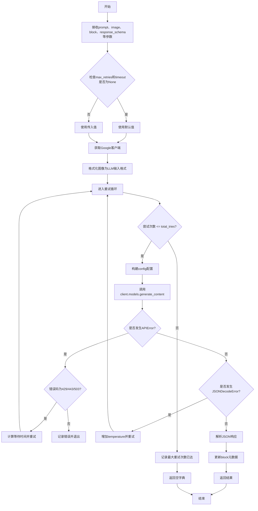
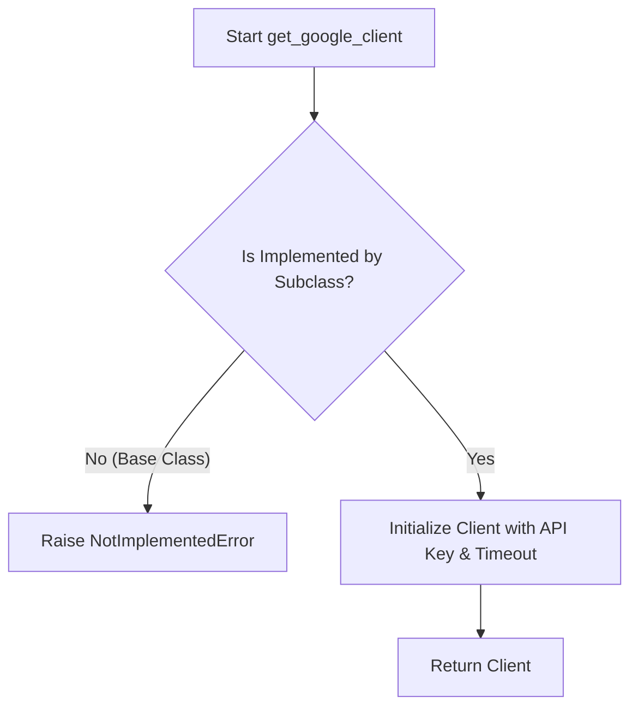
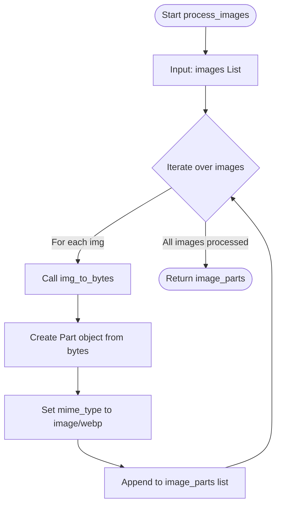

# `marker\marker\services\gemini.py` 详细设计文档

这是一个基于Google Gemini模型的图像处理服务，通过调用Google AI的Gemini模型来处理图像并返回结构化的JSON响应。该服务实现了重试机制来处理API错误，支持thinking budget配置，并提供图像格式转换功能。

## 整体流程



## 类结构

```
BaseService (marker.services)
└── BaseGeminiService (gemini_service.py)
    └── GoogleGeminiService (gemini_service.py)
```

## 全局变量及字段


### `BaseGeminiService.gemini_model_name`
    
指定用于服务的Google模型名称，默认为gemini-2.0-flash

类型：`Annotated[str, 'The name of the Google model to use for the service.']`
    


### `BaseGeminiService.thinking_budget`
    
用于服务的思考令牌预算，可选配置用于Gemini模型的思考功能

类型：`Annotated[int, 'The thinking token budget to use for the service.']`
    


### `GoogleGeminiService.gemini_api_key`
    
用于访问Google Gemini服务的API密钥

类型：`Annotated[str, 'The Google API key to use for the service.']`
    
    

## 全局函数及方法


### `BaseGeminiService.img_to_bytes`

这是一个辅助方法，用于将传入的 PIL 图像对象转换为 WebP 格式的二进制数据（字节流）。该方法主要用于在将图像发送给 Google Gemini API 之前，对图像进行内存中的格式转换和压缩，以减少网络传输的数据量。

参数：

-  `img`：`PIL.Image.Image`，要转换的 PIL 图像对象实例。

返回值：`bytes`，返回图像的原始二进制数据（WebP 格式）。

#### 流程图

```mermaid
graph TD
    A([开始 img_to_bytes]) --> B[创建 BytesIO 内存流对象]
    B --> C[调用 img.save 方法<br/>将图像写入内存流<br/>格式指定为 WEBP]
    C --> D[调用 image_bytes.getvalue()<br/>获取二进制数据]
    D --> E([返回 bytes 数据])
```

#### 带注释源码

```python
def img_to_bytes(self, img: PIL.Image.Image):
    # 创建一个内存中的二进制缓冲区 (BytesIO 对象)
    image_bytes = BytesIO()
    
    # 使用 PIL Image 对象的 save 方法，将图像数据写入到缓冲区中
    # format="WEBP" 指定了输出的图像格式为 WebP，这是一种高效的有损压缩格式
    img.save(image_bytes, format="WEBP")
    
    # 从缓冲区读取所有的字节数据并返回
    return image_bytes.getvalue()
```


### `BaseGeminiService.get_google_client`

获取配置好的 Google Generative AI 客户端实例。基类中该方法定义为抽象方法（抛出 `NotImplementedError`），需由子类（如 `GoogleGeminiService`）继承并实现具体的客户端初始化逻辑。

参数：

-  `self`：`BaseGeminiService`，类的实例本身。
-  `timeout`：`int`，请求超时时间，单位为秒。

返回值：`genai.Client`，返回配置好的 Google Generative AI 客户端实例。

#### 流程图



#### 带注释源码

```python
def get_google_client(self, timeout: int):
    """
    Factory method to get the Google Generative AI client.
    
    In the base class (BaseGeminiService), this method is not implemented
    and serves as an interface. It raises NotImplementedError to force
    subclasses (e.g., GoogleGeminiService) to provide a concrete implementation
    that returns a genai.Client configured with the provided timeout.
    """
    raise NotImplementedError
```


### `BaseGeminiService.process_images`

该方法负责将输入的 PIL 图像对象列表转换为 Google Generative AI SDK 所要求的 `Part` 对象列表，以便在内容生成请求中作为视觉输入使用。

参数：

-  `self`：`BaseGeminiService`，服务类实例本身。
-  `images`：`List[PIL.Image.Image]`，需要处理的原始 PIL 图像对象列表。

返回值：`List[google.genai.types.Part]`，包含转换后图像数据的 Part 对象列表，可直接用于 `client.models.generate_content` 的 `contents` 参数中。

#### 流程图



#### 带注释源码

```python
def process_images(self, images):
    # 遍历输入的图像列表，使用列表推导式将每个 PIL 图像转换为模型所需的 Part 对象
    image_parts = [
        types.Part.from_bytes(
            data=self.img_to_bytes(img), # 调用内部方法将 PIL Image 转为字节流
            mime_type="image/webp"       # 指定图像的 MIME 类型为 WebP 格式
        )
        for img in images
    ]
    # 返回封装好的图像内容列表
    return image_parts
```


### `BaseGeminiService.__call__`

这是该类的核心方法，负责接收提示词和图像，调用 Google Gemini 模型生成结构化内容（JSON），并处理可能的网络错误或响应格式错误。它内置了指数退避重试机制以应对 API 限流。

参数：

- `prompt`：`str`，发送给模型的文本提示词。
- `image`：`PIL.Image.Image | List[PIL.Image.Image] | None`，输入的图像或图像列表，用于多模态推理。
- `block`：`Block | None`，文档块对象，用于在推理成功后更新元数据（如使用的 token 数量）。
- `response_schema`：`type[BaseModel]`，Pydantic 模型类，指定期望的 JSON 输出结构。
- `max_retries`：`int | None`，最大重试次数，默认为类属性 `max_retries`。
- `timeout`：`int | None`，请求超时时间（秒），默认为类属性 `timeout`。

返回值：`dict`，解析后的 JSON 对象。如果所有重试均失败，返回空字典 `{}`。

#### 流程图

```mermaid
flowchart TD
    Start([开始]) --> CheckRetry{参数 max_retries<br>是否为 None?}
    CheckRetry -->|是| UseDefaultRetries[max_retries = self.max_retries]
    CheckRetry -->|否| UseInputRetries[max_retries = 输入值]
    UseDefaultRetries --> CheckTimeout{参数 timeout<br>是否为 None?}
    UseInputRetries --> CheckTimeout
    
    CheckTimeout -->|是| UseDefaultTimeout[timeout = self.timeout]
    CheckTimeout -->|否| UseInputTimeout[timeout = 输入值]
    
    UseDefaultTimeout --> InitClient[获取 Google Client]
    UseInputTimeout --> InitClient
    
    InitClient --> FormatImg[格式化图像<br>self.format_image_for_llm]
    FormatImg --> SetLoop[设置循环: total_tries = max_retries + 1]
    SetLoop --> LoopStart{尝试次数 <= total_tries?}
    
    LoopStart -->|Yes| BuildConfig[构建请求配置:<br>temperature, response_schema...]
    BuildConfig --> APICall[调用 client.models.generate_content]
    
    APICall --> Success{API 调用成功?}
    Success -->|Yes| ParseJSON[解析 JSON 输出]
    ParseJSON --> UpdateMeta[更新 block 元数据]
    UpdateMeta --> ReturnResult[return json.loads(output)]
    
    Success -->|No| CatchAPIError{捕获 APIError?}
    CatchAPIError -->|Yes| IsRateLimit{错误码 in [429, 443, 503]?}
    IsRateLimit -->|Yes| IsLastTry1{是最后一次尝试?}
    IsRateLimit -->|No| LogErr1[记录错误, break]
    
    IsLastTry1 -->|No| Wait1[等待: time.sleep(tries * retry_wait_time)]
    Wait1 --> Increment1[tries += 1]
    Increment1 --> LoopStart
    
    IsLastTry1 -->|Yes| LogErr1
    
    CatchAPIError --> CatchJSON{捕获 JSONDecodeError?}
    CatchJSON -->|Yes| IsLastTry2{是最后一次尝试?}
    IsLastTry2 -->|No| IncreaseTemp[temperature += 0.2]
    IncreaseTemp --> LogWarn[记录警告, 重试]
    LogWarn --> LoopStart
    
    IsLastTry2 -->|Yes| LogErr2[记录错误, break]
    CatchJSON -->|No| CatchOther[捕获其他异常]
    CatchOther --> LogErr3[打印堆栈, 记录错误, break]
    
    LogErr1 --> ReturnEmpty[return {}]
    LogErr2 --> ReturnEmpty
    LogErr3 --> ReturnEmpty
    
    ReturnResult([结束])
    ReturnEmpty([结束])
```

#### 带注释源码

```python
def __call__(
    self,
    prompt: str,
    image: PIL.Image.Image | List[PIL.Image.Image] | None,
    block: Block | None,
    response_schema: type[BaseModel],
    max_retries: int | None = None,
    timeout: int | None = None,
):
    # 如果未指定重试次数，则使用类定义的默认重试次数
    if max_retries is None:
        max_retries = self.max_retries

    # 如果未指定超时时间，则使用类定义的默认超时时间
    if timeout is None:
        timeout = self.timeout

    # 获取 Google Gemini 客户端（具体实现由子类决定）
    client = self.get_google_client(timeout=timeout)
    
    # 将 PIL 图像对象转换为模型所需的格式
    image_parts = self.format_image_for_llm(image)

    # 计算总尝试次数（重试次数 + 初始尝试）
    total_tries = max_retries + 1
    temperature = 0
    
    # 开始重试循环
    for tries in range(1, total_tries + 1):
        # 构建请求配置
        config = {
            "temperature": temperature,
            "response_schema": response_schema,
            "response_mime_type": "application/json",
        }
        
        # 如果类配置了最大输出 token 数，则加入配置
        if self.max_output_tokens:
            config["max_output_tokens"] = self.max_output_tokens

        # 如果配置了思考预算（用于 Gemini 思考模型），则加入配置
        if self.thinking_budget is not None:
            config["thinking_config"] = types.ThinkingConfig(
                thinking_budget=self.thinking_budget
            )

        try:
            # 调用 Google Gemini API 生成内容
            responses = client.models.generate_content(
                model=self.gemini_model_name,
                contents=image_parts + [prompt], # 图片放在前面通常效果更好
                config=config,
            )
            
            # 获取返回的文本内容
            output = responses.candidates[0].content.parts[0].text
            
            # 获取使用的 token 总数
            total_tokens = responses.usage_metadata.total_token_count
            
            # 如果传入了 block，更新元数据（用于统计成本）
            if block:
                block.update_metadata(
                    llm_tokens_used=total_tokens, llm_request_count=1
                )
            
            # 解析 JSON 字符串为 Python 字典并返回
            return json.loads(output)
        
        # 捕获 Google API 错误
        except APIError as e:
            # 判断是否为限流错误 (429), 连接超时 (443) 或服务不可用 (503)
            if e.code in [429, 443, 503]:
                # 如果已经是最后一次尝试
                if tries == total_tries:
                    logger.error(
                        f"APIError: {e}. Max retries reached. Giving up. (Attempt {tries}/{total_tries})",
                    )
                    break
                else:
                    # 计算等待时间：尝试次数 * 每次等待时间
                    wait_time = tries * self.retry_wait_time
                    logger.warning(
                        f"APIError: {e}. Retrying in {wait_time} seconds... (Attempt {tries}/{total_tries})",
                    )
                    time.sleep(wait_time)
            else:
                # 其他 API 错误直接记录并退出
                logger.error(f"APIError: {e}")
                break
        
        # 捕获 JSON 解析错误（模型返回的不是有效 JSON）
        except json.JSONDecodeError as e:
            # 增加温度参数以尝试获得更"创意"或不同的响应格式
            temperature = 0.2  

            if tries == total_tries:
                logger.error(
                    f"JSONDecodeError: {e}. Max retries reached. Giving up. (Attempt {tries}/{total_tries})",
                )
                break
            else:
                logger.warning(
                    f"JSONDecodeError: {e}. Retrying... (Attempt {tries}/{total_tries})",
                )
        
        # 捕获所有其他未知异常
        except Exception as e:
            logger.error(f"Exception: {e}")
            traceback.print_exc()
            break

    # 如果循环结束或中断，返回空字典
    return {}
```


### `GoogleGeminiService.get_google_client`

该方法用于实例化并返回一个配置好的 Google Generative AI 客户端 (`genai.Client`)。它使用类的实例属性 `gemini_api_key` 进行认证，并将传入的 `timeout` 参数（单位：秒）转换为毫秒以配置 HTTP 请求的超时时间。

参数：

-  `timeout`：`int`，请求超时时间，单位为秒。方法内部会将其乘以 1000 转换为毫秒。

返回值：`genai.Client`，返回一个配置了 API 密钥和超时选项的 Google GenAI 客户端实例。

#### 流程图

```mermaid
flowchart TD
    A([Start get_google_client]) --> B[Input: timeout (seconds)]
    B --> C{Validate inputs}
    C -->|Valid| D[Read api_key from self.gemini_api_key]
    C -->|Invalid| E[Throw Error]
    D --> F[Convert timeout: seconds * 1000 = milliseconds]
    F --> G[Initialize genai.Client]
    G --> H[Set api_key and http_options]
    H --> I([Return Client Object])
    E --> I
```

#### 带注释源码

```python
def get_google_client(self, timeout: int):
    """
    获取并返回一个配置好的 Google Generative AI 客户端。

    参数:
        timeout (int): HTTP 请求的超时时间，单位为秒。

    返回值:
        genai.Client: 用于与 Google Generative AI 服务交互的客户端对象。
    """
    return genai.Client(
        api_key=self.gemini_api_key,  # 从实例属性获取 API Key
        http_options={"timeout": timeout * 1000},  # 将秒转换为毫秒以符合 google-genai 库的要求
    )
```


## 关键组件


### 图像到字节转换 (img_to_bytes)

将PIL图像对象转换为WebP格式的字节数据，用于API请求。使用了BytesIO作为内存缓冲区，实现无需临时文件的图像转换。

### Google客户端工厂 (get_google_client)

工厂方法模式，用于创建配置好的Google Gemini客户端。支持超时配置，将秒转换为毫秒以适配Google API的HTTP选项要求。

### 图像格式化处理 (process_images)

将PIL图像列表转换为Google Gemini API所需的Part对象列表。统一使用WebP格式和image/webp的MIME类型，确保与Gemini模型的兼容性。

### 结构化响应生成调用 (__call__)

核心方法，协调整个API调用流程。包含：动态配置构建（temperature、response_schema、thinking_config）、多重重试机制（针对速率限制和JSON解析失败）、令牌统计与元数据更新、统一的异常处理链路。

### 重试策略与退避算法

针对API错误码429/443/503实现了指数退避重试策略。根据尝试次数动态计算等待时间（wait_time = tries * retry_wait_time），并在最后一次失败时记录错误日志后放弃。

### JSON响应容错处理

当API返回非有效JSON时，自动增加temperature参数（从0升至0.2）以获取更多样化的响应，并触发重试机制。这是一种针对模型输出格式不稳定的自适应策略。

### 思考预算配置 (thinking_budget)

可选的Gemini模型配置参数，通过types.ThinkingConfig传递给API。允许开发者控制模型的推理token预算，实现计算成本与响应质量的平衡。

### 响应模式强制 (response_schema)

使用Pydantic BaseModel定义响应结构，结合Gemini的response_schema参数，强制模型输出符合预定义模式的JSON，实现类型安全的结构化输出。

### GoogleGeminiService服务实现

BaseGeminiService的具体实现类，负责注入Google API密钥并实例化genai.Client。遵循依赖注入原则，便于测试和配置管理。


## 问题及建议


### 已知问题

-   **异常处理不完善**：`__call__`方法在所有重试失败后返回空字典`{}`，调用者无法区分是正常空结果还是处理失败，缺乏明确的错误状态返回值
-   **响应数据缺少空值检查**：直接访问`responses.candidates[0].content.parts[0].text`和`responses.usage_metadata.total_token_count`，若API返回异常响应结构会导致`IndexError`或`AttributeError`
-   **日志记录不一致**：混合使用`logger.error/warning`和`traceback.print_exc()`，不符合统一的日志规范
-   **重试策略简单**：使用线性等待时间`wait_time = tries * self.retry_wait_time`，缺乏指数退避策略，高并发场景下可能加剧API压力
-   **未使用的代码**：`process_images`方法定义后未被调用，存在死代码
-   **类型注解错误**：`thinking_budget`字段声明为`Annotated[int, ...] = None`，但实际值可以是`None`，类型应为`int | None`
-   **Client重复创建**：每次调用都通过`get_google_client`创建新的client实例，没有连接池或缓存机制
-   **非重试错误处理过于严格**：除429/443/503外的API错误直接break，不进行任何重试，可能错失临时性错误恢复机会

### 优化建议

-   统一使用logger记录异常，考虑定义自定义异常类或返回Result对象以区分成功/失败状态
-   添加响应数据空值验证：`if responses.candidates and responses.candidates[0].content.parts:`
-   实现指数退避重试策略：`wait_time = self.retry_wait_time * (2 ** (tries - 1))`
-   删除未使用的`process_images`方法或将其功能整合到`format_image_for_llm`中
-   修正`thinking_budget`类型声明为`Annotated[int | None, "..."] = None`
-   考虑在Service层实现client缓存或单例模式，避免重复创建
-   对非429错误也添加有限重试机制（如网络超时等临时性错误）

## 其它


### 设计目标与约束

**设计目标**：为Marker项目提供一个统一的Google Gemini模型调用抽象层，支持图像处理和结构化输出，具有重试机制和错误处理能力。

**约束**：
- 必须继承自BaseService基类
- 必须支持PIL图像格式转换为Google Gemini可用的格式
- 必须支持结构化JSON输出（通过response_schema）
- 必须实现重试逻辑处理临时性错误（429, 443, 503）
- API密钥通过依赖注入获取，不硬编码

### 错误处理与异常设计

**异常处理策略**：
1. **APIError (429, 443, 503)**：视为临时性错误，触发指数退避重试，最大重试次数为max_retries
2. **JSONDecodeError**：响应解析失败，增加temperature至0.2后重试
3. **其他Exception**：记录错误日志并打印堆栈，直接退出循环
4. **NotImplementedError**：get_google_client方法要求子类实现

**错误恢复**：
- Rate limit错误：等待tries * retry_wait_time秒后重试
- JSON解析错误：通过调整temperature获取不同的输出

### 数据流与状态机

**主要数据流**：
1. 输入：prompt（str）、image（PIL.Image或列表）、block（Block元数据）、response_schema（pydantic模型）
2. 处理流程：图像格式转换 → 构建请求配置 → 调用Google Gemini API → 解析JSON响应 → 更新block元数据
3. 输出：字典类型（反序列化后的JSON）或空字典（所有重试失败）

**状态转换**：
- 初始状态 → 尝试调用API → 成功返回/重试/失败
- 重试状态：在max_retries范围内循环，超过后进入失败状态

### 外部依赖与接口契约

**外部依赖**：
- `google.genai`：Google AI SDK，提供Client和types
- `PIL (Pillow)`：图像处理
- `pydantic`：结构化数据验证
- `marker.logger`：日志记录
- `marker.services.BaseService`：服务基类
- `marker.schema.blocks.Block`：文档块元数据

**接口契约**：
- `__call__`方法：接受prompt、image、block、response_schema参数，返回字典
- `get_google_client(timeout)`：子类必须实现，返回genai.Client实例
- `format_image_for_llm(image)`：由基类提供，将图像转换为模型输入格式
- 图像格式：统一转换为WEBP格式的字节流

### 配置管理

**配置参数来源**：
- gemini_model_name：默认为"gemini-2.0-flash"
- thinking_budget：可选，默认为None
- max_retries：继承自BaseService
- timeout：继承自BaseService
- max_output_tokens：继承自BaseService
- retry_wait_time：继承自BaseService

### 并发与性能考虑

**性能特性**：
- 同步调用模式，阻塞等待API响应
- 图像转换为WEBP格式以减少传输大小
- 超时时间可配置，默认继承自BaseService
- 使用total_token_count统计token使用量

**资源管理**：
- 每次请求创建新的Google客户端实例
- BytesIO对象在img_to_bytes方法中临时创建

### 安全性考虑

**敏感信息保护**：
- API密钥通过gemini_api_key字段注入，不硬编码
- 日志中不记录完整的API密钥
- 超时时间转换为毫秒（*1000）以适配Google SDK

### 测试策略

**测试要点**：
1. 单元测试：img_to_bytes图像转换、process_images列表处理
2. 集成测试：模拟API调用、验证重试逻辑
3. 异常测试：各种错误码的处理、JSON解析失败处理

**Mock策略**：
- 使用mock替代genai.Client
- 使用mock替代PIL.Image

### 使用示例

```python
from marker.services.gemini import GoogleGeminiService
from pydantic import BaseModel
from PIL import Image

class ImageCaption(BaseModel):
    caption: str
    confidence: float

service = GoogleGeminiService(gemini_api_key="your-api-key")
image = Image.open("example.jpg")
result = service(
    prompt="描述这张图片",
    image=image,
    block=None,
    response_schema=ImageCaption
)
```

### 版本兼容性

**依赖版本要求**：
- google.genai：最新版本
- pydantic：支持Annotated的类型注解（v2+）
- Python：支持类型联合语法（Python 3.10+）


    