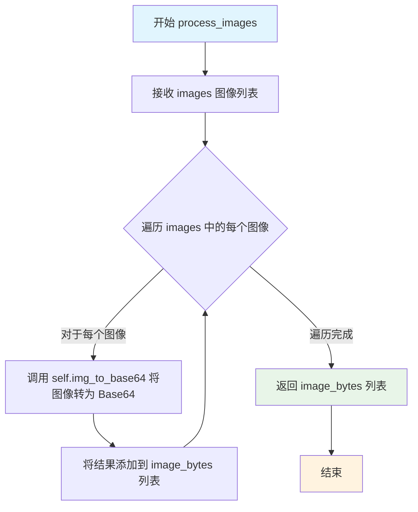
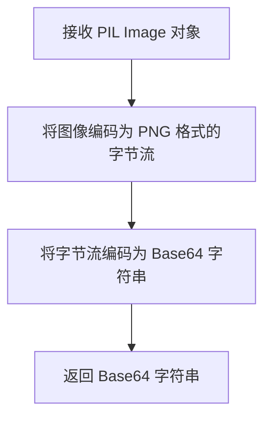
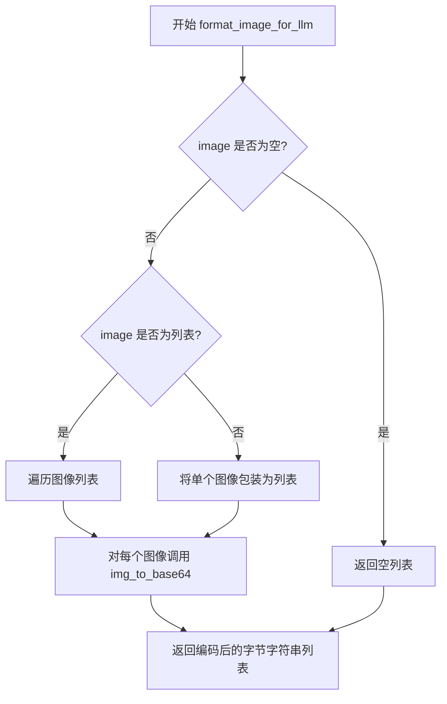

# `marker\marker\services\ollama.py` 详细设计文档

OllamaService是一个继承自BaseService的LLM服务封装类，用于与本地Ollama大语言模型服务进行交互，支持图像处理、结构化输出（通过Pydantic schema）和token统计等功能。

## 整体流程

```mermaid
graph TD
A[开始] --> B[初始化OllamaService]
B --> C{调用 __call__ 方法}
C --> D[构建API请求URL和headers]
C --> E[生成响应格式schema]
E --> F[调用format_image_for_llm处理图像]
F --> G[构造payload包含model/prompt/format/images]
G --> H[发送POST请求到Ollama API]
H --> I{请求成功?}
I -- 否 --> J[捕获异常并记录日志]
J --> K[返回空字典{}]
I -- 是 --> L[解析响应JSON]
L --> M[计算total_tokens]
M --> N{block存在?}
N -- 是 --> O[更新block元数据]
N -- 否 --> P[返回解析后的数据]
O --> P
```

## 类结构

```
BaseService (抽象服务基类)
└── OllamaService (Ollama LLM服务实现)
```

## 全局变量及字段


### `logger`
    
从marker.logger.get_logger()获取的日志实例，用于记录程序运行过程中的日志信息

类型：`Logger`
    


### `OllamaService.ollama_base_url`
    
Ollama服务的基URL地址，默认为http://localhost:11434，不包含尾部斜杠

类型：`Annotated[str, 'The base url to use for ollama. No trailing slash.']`
    


### `OllamaService.ollama_model`
    
Ollama服务使用的模型名称，默认为llama3.2-vision

类型：`Annotated[str, 'The model name to use for ollama.']`
    
    

## 全局函数及方法


### `OllamaService.process_images`

该方法负责将输入的图像列表转换为 Base64 编码的字节列表，以便后续 Ollama 模型能够处理这些图像数据。

参数：

- `self`：`OllamaService`，OllamaService 类的实例本身
- `images`：`List[PIL.Image.Image]`，待处理的 PIL 图像对象列表

返回值：`List[bytes]`，Base64 编码后的图像字节列表

#### 流程图



#### 带注释源码

```python
def process_images(self, images):
    """
    将图像列表转换为 Base64 编码的字节列表
    
    参数:
        images: PIL.Image.Image 类型的列表，待处理的图像
    
    返回:
        Base64 编码后的图像字节列表
    """
    # 遍历 images 列表中的每个图像，调用 img_to_base64 方法将每个图像转换为 Base64 编码
    # img_to_base64 方法应该是在父类 BaseService 中定义的
    image_bytes = [self.img_to_base64(img) for img in images]
    
    # 返回包含所有 Base64 编码图像的列表
    return image_bytes
```


### `OllamaService.__call__`

该方法是 `OllamaService` 类的核心调用接口，用于与本地 Ollama LLM 服务进行交互，支持图像理解和结构化输出。它接收提示词、图像、块对象和响应模式，构建请求载荷，调用 Ollama 生成 API，解析返回的 JSON 响应，更新块元数据，并返回结构化结果。

参数：

- `prompt`：`str`，发送给 Ollama 模型的提示词
- `image`：`PIL.Image.Image | List[PIL.Image.Image] | None`，要处理的图像或图像列表，支持单图或多图输入
- `block`：`Block | None`，用于存储 LLM 请求统计信息的块对象，可选
- `response_schema`：`type[BaseModel]`（Pydantic BaseModel 的类型），定义响应结构的 Pydantic 模型类，用于生成 JSON Schema
- `max_retries`：`int | None = None`，最大重试次数（当前实现中未使用，属于技术债务）
- `timeout`：`int | None = None`，请求超时时间（当前实现中未使用，属于技术债务）

返回值：`dict`，解析后的 JSON 响应数据；如果发生异常则返回空字典 `{}`

#### 流程图

```mermaid
flowchart TD
    A[开始 __call__] --> B[构建 URL 和 Headers]
    B --> C[将 response_schema 转换为 JSON Schema]
    C --> D[调用 format_image_for_llm 处理图像]
    D --> E[构建 Payload]
    E --> F[发送 POST 请求到 Ollama API]
    F --> G{请求是否成功?}
    G -->|是| H[提取响应数据]
    G -->|否| I[捕获异常并记录警告]
    I --> J[返回空字典 {}]
    H --> K{block 是否存在?}
    K -->|是| L[更新 block 元数据: llm_request_count=1, llm_tokens_used]
    K -->|否| M[解析 JSON 响应字符串]
    L --> M
    M --> N[返回解析后的字典]
```

#### 带注释源码

```python
def __call__(
    self,
    prompt: str,
    image: PIL.Image.Image | List[PIL.Image.Image] | None,
    block: Block | None,
    response_schema: type[BaseModel],
    max_retries: int | None = None,
    timeout: int | None = None,
):
    """
    调用 Ollama API 进行图像理解或文本生成
    
    Args:
        prompt: 发送给模型的提示词
        image: 输入图像，支持单图或图像列表
        block: 可选的 Block 对象，用于记录请求元数据
        response_schema: Pydantic 模型类型，定义响应格式
        max_retries: 最大重试次数（暂未实现）
        timeout: 请求超时时间（暂未实现）
    
    Returns:
        解析后的 JSON 响应字典，异常时返回空字典
    """
    # 构建 Ollama API 端点 URL
    url = f"{self.ollama_base_url}/api/generate"
    # 设置请求头，指定 JSON 格式
    headers = {"Content-Type": "application/json"}

    # 将 Pydantic 模型转换为 JSON Schema 格式
    schema = response_schema.model_json_schema()
    # 构造符合 Ollama 要求的 Schema 结构
    format_schema = {
        "type": "object",
        "properties": schema["properties"],
        "required": schema["required"],
    }

    # 将 PIL Image 转换为 Ollama 需要的字节格式
    image_bytes = self.format_image_for_llm(image)

    # 构建请求载荷，包含模型名、提示词、格式schema和图像
    payload = {
        "model": self.ollama_model,
        "prompt": prompt,
        "stream": False,
        "format": format_schema,
        "images": image_bytes,
    }

    try:
        # 发送 POST 请求到 Ollama 服务
        response = requests.post(url, json=payload, headers=headers)
        # 检查 HTTP 响应状态，若有错误则抛出异常
        response.raise_for_status()
        # 解析 JSON 响应
        response_data = response.json()

        # 计算本次请求消耗的总 token 数（提示词 token + 生成 token）
        total_tokens = (
            response_data["prompt_eval_count"] + response_data["eval_count"]
        )

        # 如果提供了 block 对象，更新元数据统计信息
        if block:
            block.update_metadata(llm_request_count=1, llm_tokens_used=total_tokens)

        # 提取响应内容（JSON 字符串格式）
        data = response_data["response"]
        # 解析 JSON 字符串为 Python 字典并返回
        return json.loads(data)
    except Exception as e:
        # 捕获所有异常，记录警告日志，返回空字典
        logger.warning(f"Ollama inference failed: {e}")

    return {}
```


### `OllamaService.img_to_base64`

该方法继承自 `BaseService`，用于将 PIL Image 对象转换为 Base64 编码的字符串，以便在后续流程中作为图像数据发送给 Ollama API。

参数：

- `img`：`PIL.Image.Image`，待转换的图像对象

返回值：`str`，图像的 Base64 编码字符串

#### 流程图



#### 带注释源码

由于该方法在当前代码文件中未定义，仅继承自 `BaseService`，以下为根据其调用方式及功能推断的典型实现逻辑：

```python
def img_to_base64(self, img: PIL.Image.Image) -> str:
    """
    将 PIL Image 对象转换为 Base64 编码字符串。
    
    参数:
        img: PIL.Image.Image - 待转换的图像对象
    
    返回:
        str - 图像的 Base64 编码字符串
    """
    import base64
    from io import BytesIO
    
    # 1. 创建内存缓冲区存储图像数据
    buffer = BytesIO()
    
    # 2. 将图像以 PNG 格式写入缓冲区
    img.save(buffer, format="PNG")
    
    # 3. 获取缓冲区中的字节数据
    image_bytes = buffer.getvalue()
    
    # 4. 将字节数据编码为 Base64 字符串并返回
    return base64.b64encode(image_bytes).decode("utf-8")
```

---

**注意**：由于 `img_to_base64` 方法的具体实现位于 `BaseService` 基类中，本文件仅展示其调用方式。该方法在 `process_images` 方法中被用于将多个图像批量转换为 Base64 编码格式。


### `OllamaService.format_image_for_llm`

该方法继承自 `BaseService`，用于将输入的 PIL 图像（单个或列表）转换为 LLM 所需的 base64 编码格式，以便在 Ollama API 请求中传输图像数据。

参数：

-  `image`：`PIL.Image.Image | List[PIL.Image.Image] | None`，待处理的图像对象，可以是单个图像、图像列表或空值

返回值：`List[str]`，返回 base64 编码的图像字节字符串列表

#### 流程图



#### 带注释源码

```python
def format_image_for_llm(self, image):
    """
    将输入图像转换为 base64 编码格式，以适配 LLM 输入要求。
    
    处理逻辑：
    1. 如果 image 为 None 或空值，返回空列表
    2. 如果 image 是单个 PIL Image，转换为列表处理
    3. 如果 image 已经是列表，遍历处理每个图像
    4. 对每个图像调用 img_to_base64 进行 base64 编码
    
    参数:
        image: PIL.Image.Image | List[PIL.Image.Image] | None
            输入的图像数据，支持三种形式
    
    返回值:
        List[str]: base64 编码后的图像字节字符串列表
    """
    # 处理空值情况
    if not image:
        return []
    
    # 如果是单个图像，转换为列表以便统一处理
    if isinstance(image, PIL.Image.Image):
        image = [image]
    
    # 遍历图像列表，对每个图像进行 base64 编码
    image_bytes = [self.img_to_base64(img) for img in image]
    
    return image_bytes
```

> **注意**：由于 `format_image_for_llm` 方法定义在 `BaseService` 基类中，当前代码文件仅展示了其调用方式。上述源码是基于 `OllamaService` 中类似的图像处理逻辑（`process_images` 方法）推断得出的实现假设。实际实现请参考 `BaseService` 基类定义。

## 关键组件


### OllamaService 类

OllamaService 是继承自 BaseService 的服务类，负责与本地 Ollama API 交互进行视觉语言模型的推理，支持图像输入和结构化 JSON 响应输出。

### process_images 方法

处理图像列表，将 PIL Image 对象转换为 base64 编码的字节列表，供 LLM 使用。

### __call__ 方法

类的主要推理入口，接收提示词、图像、块和响应模式，构造请求 payload 并调用 Ollama API，返回结构化的 JSON 响应，同时更新块的元数据信息。

### 图像格式转换组件

负责将 PIL Image 对象转换为 Ollama API 所需的 base64 编码格式，集成在 format_image_for_llm 方法中。

### 响应模式处理组件

将 Pydantic BaseModel 转换为 Ollama API 所需的 JSON Schema 格式，定义响应数据结构。

### 错误处理与日志组件

使用 try-except 捕获推理异常，记录警告日志并返回空字典，确保服务稳定性。

### 元数据更新组件

在推理成功后更新 Block 对象的元数据，记录 LLM 请求次数和消耗的令牌总数。


## 问题及建议


### 已知问题

-   **未使用的参数**：`max_retries` 和 `timeout` 参数在方法签名中定义但完全没有使用，导致参数形同虚设
-   **超时未设置**：`requests.post` 调用未设置 `timeout` 参数，可能导致请求无限期阻塞
-   **错误处理不完善**：捕获异常后仅记录警告并返回空字典 `{}`，调用方无法区分是真正返回空结果还是发生错误
-   **缺少响应验证**：直接访问 `response_data["prompt_eval_count"]`、`response_data["eval_count"]` 等键，未验证键是否存在，响应格式不符合预期时会抛出 `KeyError`
-   **Schema 处理不安全**：`format_schema` 直接使用 `schema["properties"]` 和 `schema["required"]`，未检查这些键是否存在，可能抛出 `KeyError`
-   **日志记录不足**：成功请求没有任何日志记录，难以追踪请求状态和调试问题
-   **未使用的方法**：`process_images` 方法定义后未被调用，属于死代码

### 优化建议

-   实现 `max_retries` 重试机制和 `timeout` 超时控制，使用指数退避策略处理临时性网络错误
-   区分异常类型，向上抛出可区分的异常或返回包含错误信息的 Result 对象，而非静默返回空字典
-   使用 `response_data.get()` 方法或预先验证响应结构，确保键不存在时有合理的默认值或错误处理
-   在构建 `format_schema` 前验证 `response_schema` 的有效性，检查 `properties` 和 `required` 键是否存在
-   添加请求前后的日志记录，包括请求参数、响应状态和耗时等信息
-   删除未使用的 `process_images` 方法，或明确其用途并予以调用
-   考虑将图像处理和文本生成职责分离，使类职责更加单一和清晰

## 其它


### 设计目标与约束

本模块旨在提供一个轻量级的服务封装，通过调用Ollama本地大语言模型API实现结构化的图像与文本推理。核心设计目标包括：支持图像输入并转换为base64格式、基于Pydantic模型定义输出Schema以实现类型安全的响应解析、无缝集成BaseService基类以保持服务架构一致性。主要约束包括：依赖本地运行的Ollama服务（默认localhost:11434）、仅支持llama3.2-vision等视觉模型、响应式调用（stream=False）且无并发批量处理能力。

### 错误处理与异常设计

代码采用宽异常捕获（except Exception as e）并记录警告日志后返回空字典。异常处理策略存在以下问题：未区分不同类型的异常（如网络超时、HTTP错误码、JSON解析失败、模型不支持等），可能导致调用方无法感知具体失败原因；未实现重试机制（尽管max_retries参数已预留但未使用）；未抛出异常而是返回空字典，可能导致调用方难以判断是否真正成功。建议改进为：分类捕获requests.RequestException、json.JSONDecodeError、KeyError等具体异常；根据max_retries实现指数退避重试；在可恢复错误时返回空字典但在致命错误时重新抛出或返回包含错误详情的结构化对象。

### 数据流与状态机

服务的数据流向为：接收原始PIL.Image或图像列表 → format_image_for_llm()进行格式转换和base64编码 → 构造包含model、prompt、format（JSON Schema）、images的payload → 同步POST请求至Ollama /api/generate端点 → 解析response["response"]字段的JSON字符串 → 返回Pydantic模型实例。状态机方面，服务本身为无状态设计，每次调用独立完成请求-响应周期，不维护内部状态转移。block参数用于传递下游Block对象以更新元数据（llm_request_count、llm_tokens_used），体现了副作用注入模式。

### 外部依赖与接口契约

核心外部依赖包括：Ollama服务（需本地部署并启动，API契约为POST /api/generate，返回{response, prompt_eval_count, eval_count}结构）、PIL库（图像处理）、requests库（HTTP客户端）、pydantic（Schema定义与验证）、marker.schema.blocks.Block（共享元数据结构）。接口契约方面，process_images()方法将图像列表转为base64但实际未在__call__中调用；format_image_for_llm()方法在BaseService基类中定义，本类直接使用；__call__方法接收prompt、image、block、response_schema参数，返回response_schema实例或空字典。调用方需确保ollama服务可用、response_schema为有效的Pydantic模型、image为PIL.Image类型或None。

### 性能考虑

当前实现为同步阻塞调用，大图像或高并发场景下可能导致性能瓶颈。payload中的images字段可能包含较大base64字符串，需考虑HTTP请求体大小限制。token统计（prompt_eval_count + eval_count）已实现但未向调用方返回。优化方向包括：实现请求超时控制（timeout参数已定义但未使用）；考虑流式响应支持（当前stream=False）；图像预处理缓存以避免重复编码；连接池复用（requests.Session）。

### 安全性考虑

代码存在以下安全考量点：ollama_base_url默认为localhost，如需远程访问需配置网络访问策略；未实现API密钥或认证机制，Ollama服务默认无认证保护；payload中包含完整prompt和图像数据，需确保传输层TLS；未对输入图像进行恶意格式校验；response字段直接使用json.loads解析，未限制反序列化对象类型和深度，可能存在反序列化攻击风险。建议：添加基础认证token配置；输入图像格式白名单校验；返回数据字段和大小限制。

### 可扩展性

当前硬编码ollama_model为"llama3.2-vision"，扩展方向包括：支持多模型动态选择（通过配置或参数注入）；支持function calling或tools能力；支持流式响应处理；支持批量推理（当前仅单次调用）。基类BaseService提供了扩展基础，可通过继承重写process_images、format_image_for_llm等方法实现定制。response_schema参数设计良好，支持任意Pydantic模型，灵活性高。

### 配置管理

服务配置通过类属性定义（ollama_base_url、ollama_model），使用Annotated提供类型提示和描述信息。缺陷：配置为类级别静态定义，无法在运行时动态修改；未从环境变量或配置文件加载；max_retries和timeout参数已预留但未实现功能。建议改进：支持从环境变量OLLAMA_BASE_URL、OLLAMA_MODEL加载；支持实例化时传入配置覆盖；配置变更时触发服务重连或缓存失效。

### 日志与监控

日志使用marker.logger.get_logger()获取，记录级别为warning，仅在Ollama推理失败时记录异常信息。监控方面，通过block.update_metadata记录llm_request_count和llm_tokens_used，为下游统计提供基础。不足：未记录请求成功、响应时间、模型版本等关键指标；未结构化日志（JSON格式）以便聚合分析；异常信息未包含请求上下文（URL、payload摘要）。建议：增加info级别日志记录请求发起和响应接收；添加请求耗时统计；异常时记录更多上下文便于排错。

### 测试策略

建议测试覆盖：单元测试验证format_image_for_llm图像编码正确性、payload构造符合Ollama API规范；集成测试mock或实际启动Ollama服务，验证端到端流程；异常测试覆盖网络超时、HTTP 4xx/5xx错误、JSON解析失败、response_schema验证失败等场景；性能测试评估大图像和多并发下的响应时间。需注意Ollama服务依赖，测试环境应提供可控的mock服务或测试容器。

### 版本兼容性与迁移

代码使用Python 3.10+的联合类型语法（|）和typing.Annotated，需确保运行时Python版本兼容。PIL.Image.Image | List[PIL.Image.Image] | None类型提示兼容Pillow 9.0+。Ollama API版本需匹配：当前使用/api/generate端点，Ollama不同版本该端点行为可能略有差异（如新增参数、响应格式变化）。建议：固定Ollama版本要求；在文档中说明兼容的Ollama版本范围；预留版本探测和特性开关逻辑。

### 部署与运维

部署依赖：Python环境（marker库及其依赖）、Ollama服务（需提前部署并拉取llama3.2-vision模型）、网络连通性（Python进程访问localhost:11434）。运维要点：监控Ollama服务健康状态；关注本服务的错误率和响应延迟；注意Ollama模型加载内存占用（llama3.2-vision约4-7GB）；日志收集和分析。建议提供健康检查接口（/health）和指标暴露（Prometheus格式）。


    