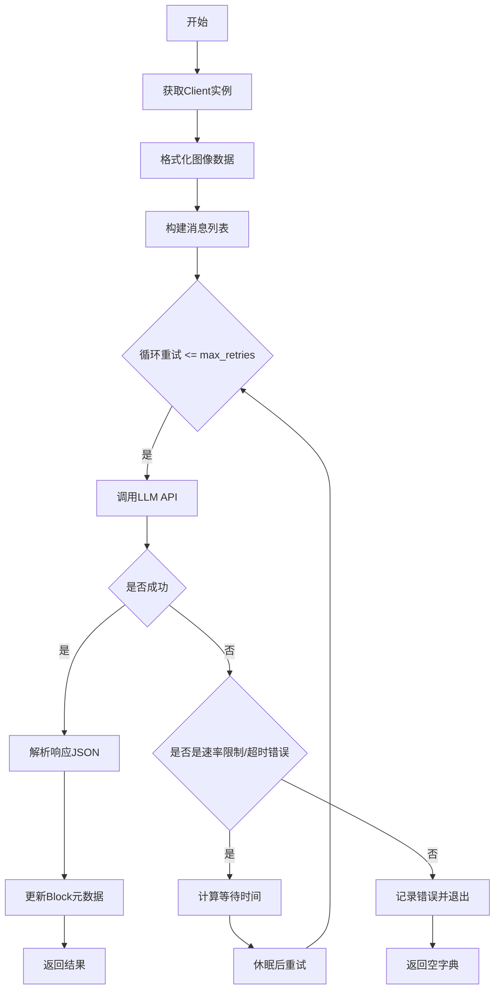
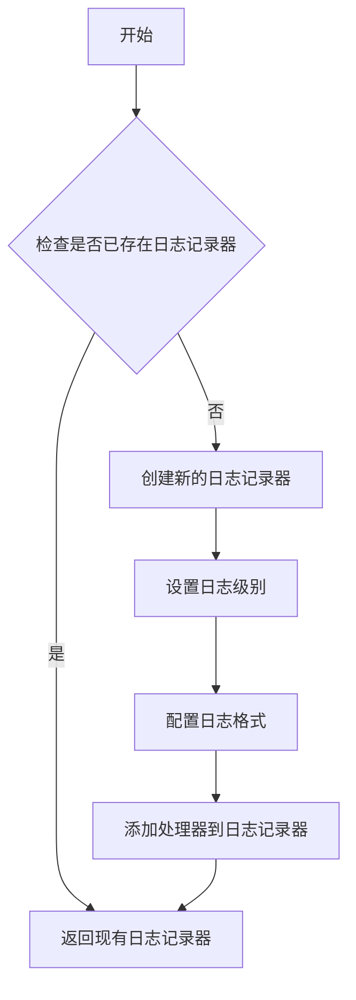
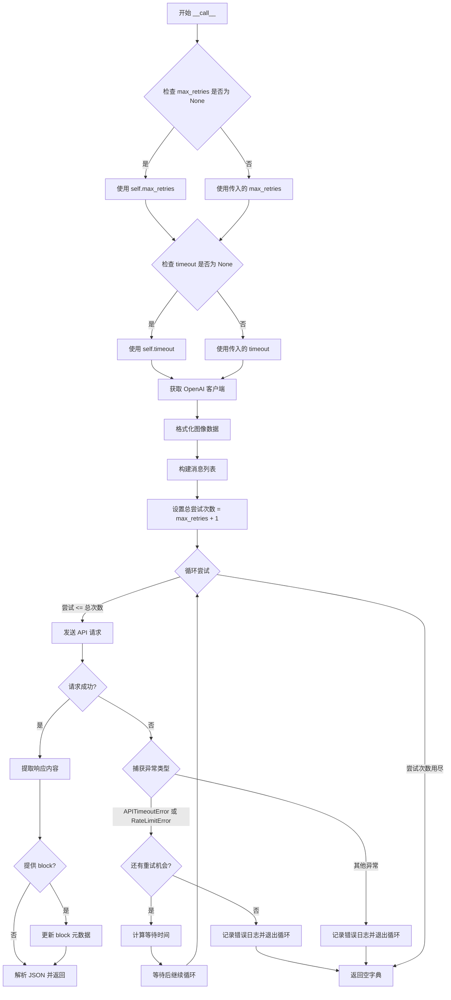
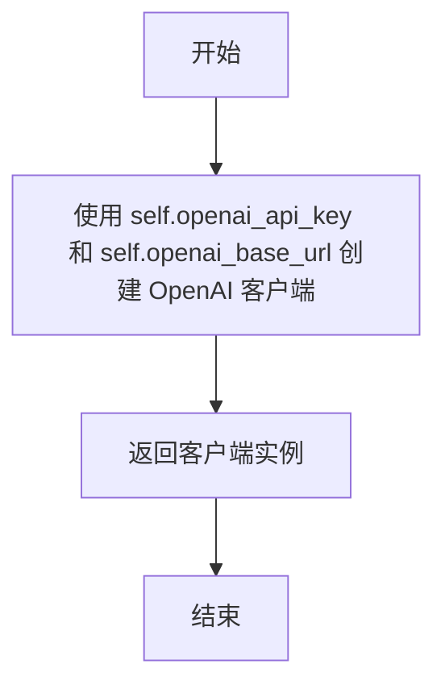

# `marker\marker\services\openai.py` 详细设计文档

OpenAIService是一个继承自BaseService的OpenAI兼容模型调用服务封装类，主要用于将图像和文本Prompt发送给OpenAI兼容的多模态大语言模型（LLM），并返回结构化的JSON响应。该服务支持重试机制、错误处理和Token统计。

## 整体流程



## 类结构

```
BaseService (基类)
└── OpenAIService (OpenAI兼容服务实现)
```

## 全局变量及字段


### `logger`
    
全局日志记录器实例，用于记录服务运行过程中的日志信息

类型：`Logger`
    


### `OpenAIService.openai_base_url`
    
OpenAI兼容模型的API基础URL，默认值为https://api.openai.com/v1

类型：`str`
    


### `OpenAIService.openai_model`
    
使用的模型名称，默认值为gpt-4o-mini

类型：`str`
    


### `OpenAIService.openai_api_key`
    
API认证密钥，用于访问OpenAI兼容服务

类型：`str`
    


### `OpenAIService.openai_image_format`
    
图像格式，默认值为webp，建议使用png以获得更好的兼容性

类型：`str`
    
    

## 全局函数及方法


### `get_logger`

获取marker项目的日志记录器，用于在应用中记录不同级别的日志信息。

参数：
- 无参数

返回值：`logging.Logger`，返回配置好的日志记录器实例，可用于记录debug、info、warning、error等级别的日志

#### 流程图



#### 带注释源码

```python
# 从marker.logger模块导入get_logger函数
# 该函数用于获取项目专用的日志记录器
from marker.logger import get_logger

# 在模块级别调用get_logger获取日志记录器实例
# 该logger将在整个OpenAIService类中使用
logger = get_logger()
```

#### 补充说明

`get_logger` 函数的具体实现位于 `marker.logger` 模块中，当前代码文件仅展示了其使用方式。根据代码上下文分析：

1. **设计目标**：为marker项目提供统一的日志记录机制
2. **调用方式**：无参数调用，返回标准logging.Logger对象
3. **使用场景**：在OpenAIService类中用于记录速率限制错误、API超时错误、推理失败等日志信息
4. **日志级别使用**：
   - `logger.error()` - 记录严重错误，如速率限制达到最大重试次数、OpenAI推理失败
   - `logger.warning()` - 记录警告信息，如速率限制错误后的重试等待

**注意**：由于 `get_logger` 函数的实现源码不在当前代码文件中，以上流程图和源码注释是基于代码使用方式的合理推断。如需查看完整实现，请参考 `marker/logger.py` 源文件。


### `OpenAIService.img_to_base64`

将 PIL 图像对象转换为 Base64 编码的字符串，供 OpenAI 多模态模型 API 使用。

参数：

- `img`：`PIL.Image.Image`，要转换的 PIL 图像对象
- `format`：`str`，图像格式（如 "png", "webp" 等）

返回值：`str`，返回格式为 `"data:image/{format};base64,{base64_data}"` 的 Data URL 字符串

#### 流程图

```mermaid
flowchart TD
    A[开始 img_to_base64] --> B[接收 PIL Image 和 format]
    B --> C[将图像编码为指定格式的字节数据]
    C --> D[将字节数据编码为 Base64 字符串]
    D --> E[构建 Data URL 格式: data:image/{format};base64,{base64_data}]
    E --> F[返回 Data URL 字符串]
```

#### 带注释源码

```python
def img_to_base64(self, img: PIL.Image.Image, format: str) -> str:
    """
    将 PIL 图像转换为 Base64 编码的 Data URL 字符串。
    
    Args:
        img: PIL 图像对象
        format: 目标图像格式（如 'png', 'webp'）
    
    Returns:
        符合 OpenAI API 要求的 Data URL 格式字符串
    """
    # 注意: 此方法在当前文件中未被定义
    # 推断为从父类 BaseService 继承的方法
    # 基于 process_images 中的调用方式还原其逻辑:
    
    # 1. 将 PIL 图像转换为指定格式的字节数据
    # img_byte_arr = io.BytesIO()
    # img.save(img_byte_arr, format=format.upper())
    # img_bytes = img_byte_arr.getvalue()
    
    # 2. 对字节数据进行 Base64 编码
    # import base64
    # base64_str = base64.b64encode(img_bytes).decode('utf-8')
    
    # 3. 构建完整的 Data URL 并返回
    # return f"data:image/{format};base64,{base64_str}"
    
    pass  # 方法体未在当前文件中实现
```

> **注意**: 该方法在 `OpenAIService` 类中未被直接定义，但在 `process_images` 方法的第42行被隐式调用：
> ```python
> self.img_to_base64(img, format=img_fmt)
> ```
> 推断该方法是从父类 `BaseService` 继承而来，用于将 PIL 图像转换为 OpenAI API 所要求的 Base64 编码 Data URL 格式。


### `OpenAIService.format_image_for_llm`

将 PIL 图像对象转换为 OpenAI 兼容的图像格式（Base64 编码的图像 URL），用于 LLM 多模态输入。

参数：

-  `image`：`PIL.Image.Image | List[PIL.Image.Image] | None`，需要格式化的图像，支持单张图像、图像列表或 None

返回值：`List[dict]`，返回 OpenAI 兼容的多模态消息格式列表，包含 Base64 编码的图像数据

#### 流程图

```mermaid
flowchart TD
    A[开始 format_image_for_llm] --> B{image 是单个 Image 对象?}
    B -->|是| C[将单个图像转换为列表]
    B -->|否| D[保持原样]
    C --> E[获取图像格式 img_fmt]
    D --> E
    E --> F[遍历图像列表]
    F --> G[对每张图像调用 img_to_base64]
    G --> H[构建 image_url 字典]
    H --> I[格式: data:image/{格式};base64,{Base64数据}]
    I --> J[构建完整消息结构]
    J --> K{还有更多图像?}
    K -->|是| F
    K -->|否| L[返回消息列表]
    L --> M[结束]
```

#### 带注释源码

```python
def format_image_for_llm(self, image: PIL.Image.Image | List[PIL.Image.Image] | None) -> List[dict]:
    """
    将 PIL 图像对象转换为 OpenAI 兼容的图像格式用于 LLM 输入。
    
    注意: 此方法在代码中为隐式调用，未显式定义。
    根据调用上下文分析，其逻辑应与 process_images 方法等价。
    """
    # 如果是单个图像对象，转换为列表以便统一处理
    if isinstance(image, PIL.Image.Image):
        image = [image]
    
    # 获取配置的图像格式（默认为 webp）
    img_fmt = self.openai_image_format
    
    # 遍历图像列表，将每张图像转换为 Base64 编码的 OpenAI 消息格式
    return [
        {
            "type": "image_url",
            "image_url": {
                # 构建 data URL 格式: data:image/{格式};base64,{数据}
                "url": "data:image/{};base64,{}".format(
                    img_fmt, 
                    self.img_to_base64(img, format=img_fmt)  # 调用 BaseService 的图像转 Base64 方法
                ),
            },
        }
        for img in image  # 遍历传入的图像列表
    ]
```

---

**备注**: 该方法在代码中未被显式定义，而是通过 `__call__` 方法隐式调用 `self.format_image_for_llm(image)`。从逻辑分析和调用上下文推断，其实现应等价于 `process_images` 方法的功能，将图像转换为 OpenAI API 所需的多模态消息格式。实际实现可能继承自 `BaseService` 父类或通过其他方式定义。


### `OpenAIService.process_images`

该方法负责将 PIL 图像列表转换为 OpenAI 兼容的多模态消息格式，通过将图像转换为 base64 编码并包装为特定的数据结构，以便发送给支持图像输入的 LLM 模型。

参数：

- `self`：当前 OpenAIService 实例，包含服务配置
- `images`：`List[Image.Image]`，待处理的 PIL 图像列表，支持单张图像或图像列表

返回值：`List[dict]`，返回符合 OpenAI 图像消息格式的字典列表，每个字典包含 `type` 为 "image_url" 以及 `image_url` 字段，其中 `url` 为 base64 编码的数据 URI 格式

#### 流程图

```mermaid
flowchart TD
    A[开始 process_images] --> B{检查 images 类型}
    B -->|单个 Image.Image| C[转换为列表]
    B -->|已经是列表| D[直接使用]
    C --> E[获取图像格式 img_fmt]
    D --> E
    E --> F[遍历 images 列表]
    F --> G[调用 img_to_base64 编码图像]
    G --> H[构建 image_url 字典]
    H --> I[格式化为 data:image/{format};base64,{base64_data}]
    I --> J{是否还有更多图像?}
    J -->|是| F
    J -->|否| K[返回消息列表]
    K --> L[结束]
```

#### 带注释源码

```python
def process_images(self, images: List[Image.Image]) -> List[dict]:
    """
    Generate the base-64 encoded message to send to an
    openAI-compatabile multimodal model.
    
    Args:
        images: Image or list of PIL images to include
        format: Format to use for the image; use "png" for better compatability.

    Returns:
        A list of OpenAI-compatbile multimodal messages containing the base64-encoded images.
    """
    # 步骤1: 标准化输入 - 如果是单个图像，转换为列表处理
    if isinstance(images, Image.Image):
        images = [images]

    # 步骤2: 获取配置的图像格式 (默认为 webp，可在初始化时配置为 png 以获得更好兼容性)
    img_fmt = self.openai_image_format
    
    # 步骤3: 遍历图像列表，将每张图像转换为 OpenAI 兼容的 base64 消息格式
    return [
        {
            "type": "image_url",  # 消息类型标识
            "image_url": {
                # 构建 data URI 格式: data:image/{format};base64,{base64编码数据}
                "url": "data:image/{};base64,{}".format(
                    img_fmt, 
                    # 调用内部方法将 PIL 图像转换为 base64 字符串
                    self.img_to_base64(img, format=img_fmt)
                ),
            },
        }
        for img in images  # 列表推导式遍历所有图像
    ]
```


### `OpenAIService.__call__`

主调用方法，负责执行 LLM 推理并返回结构化响应。该方法接收提示词、图像和响应模式，通过 OpenAI API 进行多模态推理，支持重试机制和错误处理，最终返回解析后的 JSON 数据。

参数：

-  `self`：`OpenAIService`，OpenAIService 实例本身
-  `prompt`：`str`，发送给 LLM 的文本提示词
-  `image`：`PIL.Image.Image | List[PIL.Image.Image] | None`，输入的图像或图像列表，用于多模态推理
-  `block`：`Block | None`，可选的文档块对象，用于存储 LLM 调用的元数据（如 token 数量）
-  `response_schema`：`type[BaseModel]`（Pydantic BaseModel 子类），响应数据的结构模式，用于约束 LLM 输出格式
-  `max_retries`：`int | None`，最大重试次数，默认为服务配置的重试次数
-  `timeout`：`int | None`，请求超时时间（秒），默认为服务配置的超时时间

返回值：`dict`，解析后的 JSON 响应数据，如果所有重试均失败则返回空字典 `{}`

#### 流程图



#### 带注释源码

```python
def __call__(
    self,
    prompt: str,
    image: PIL.Image.Image | List[PIL.Image.Image] | None,
    block: Block | None,
    response_schema: type[BaseModel],
    max_retries: int | None = None,
    timeout: int | None = None,
):
    """
    执行 LLM 推理并返回结构化响应。
    
    该方法是 OpenAIService 的主调用入口，通过 OpenAI API 执行多模态推理，
    支持自动重试、错误处理和响应格式校验。
    
    Args:
        prompt: 发送给 LLM 的文本提示词
        image: 输入的图像或图像列表，用于多模态推理
        block: 可选的文档块对象，用于存储 LLM 调用的元数据
        response_schema: 响应数据的结构模式（Pydantic BaseModel 子类）
        max_retries: 最大重试次数，默认为服务配置的重试次数
        timeout: 请求超时时间（秒），默认为服务配置的超时时间
    
    Returns:
        解析后的 JSON 响应数据，所有重试失败时返回空字典
    """
    # 如果未指定 max_retries，则使用服务默认配置
    if max_retries is None:
        max_retries = self.max_retries

    # 如果未指定 timeout，则使用服务默认配置
    if timeout is None:
        timeout = self.timeout

    # 获取 OpenAI 客户端实例
    client = self.get_client()
    
    # 将图像格式化为 LLM 可处理的格式（base64 编码）
    image_data = self.format_image_for_llm(image)

    # 构建消息列表，包含图像数据和文本提示词
    messages = [
        {
            "role": "user",
            "content": [
                *image_data,  # 展开图像数据
                {"type": "text", "text": prompt},  # 添加文本提示
            ],
        }
    ]

    # 计算总尝试次数（重试次数 + 初始尝试）
    total_tries = max_retries + 1
    
    # 遍历所有可能的尝试次数
    for tries in range(1, total_tries + 1):
        try:
            # 调用 OpenAI API 进行推理
            response = client.beta.chat.completions.parse(
                extra_headers={
                    "X-Title": "Marker",  # 标识请求来源
                    "HTTP-Referer": "https://github.com/datalab-to/marker",
                },
                model=self.openai_model,  # 使用的模型名称
                messages=messages,  # 消息列表
                timeout=timeout,  # 请求超时时间
                response_format=response_schema,  # 响应格式模式
            )
            
            # 提取响应内容
            response_text = response.choices[0].message.content
            
            # 获取使用的 token 总数
            total_tokens = response.usage.total_tokens
            
            # 如果提供了 block，则更新元数据
            if block:
                block.update_metadata(
                    llm_tokens_used=total_tokens,  # LLM 使用的 token 数量
                    llm_request_count=1  # LLM 请求次数
                )
            
            # 解析 JSON 响应并返回
            return json.loads(response_text)
            
        except (APITimeoutError, RateLimitError) as e:
            # 处理超时和速率限制错误
            if tries == total_tries:
                # 所有重试机会已用完，记录错误日志并退出
                logger.error(
                    f"Rate limit error: {e}. Max retries reached. Giving up. (Attempt {tries}/{total_tries})",
                )
                break
            else:
                # 还有重试机会，计算等待时间（递增）
                wait_time = tries * self.retry_wait_time
                logger.warning(
                    f"Rate limit error: {e}. Retrying in {wait_time} seconds... (Attempt {tries}/{total_tries})",
                )
                # 等待后继续尝试
                time.sleep(wait_time)
                
        except Exception as e:
            # 处理其他未知异常，记录错误并退出
            logger.error(f"OpenAI inference failed: {e}")
            break

    # 所有重试均失败，返回空字典
    return {}
```


### `OpenAIService.get_client`

获取或创建 OpenAI 客户端实例，用于与 OpenAI 或兼容的 API 进行通信。

参数：

- `self`：`OpenAIService`，当前服务实例，隐式参数

返回值：`openai.OpenAI`，OpenAI 客户端实例，可用于发送 API 请求

#### 流程图



#### 带注释源码

```python
def get_client(self) -> openai.OpenAI:
    """
    获取或创建 OpenAI 客户端实例。
    
    使用当前服务配置的 API 密钥和基础 URL 创建 OpenAI 客户端。
    该客户端用于后续与 OpenAI API 的通信。
    
    Returns:
        openai.OpenAI: 配置好的 OpenAI 客户端实例
    """
    return openai.OpenAI(api_key=self.openai_api_key, base_url=self.openai_base_url)
```

## 关键组件


### OpenAIService 类

集成了 OpenAI 多模态模型能力的核心服务类，负责将图像转换为 base64 格式并调用 OpenAI API 进行推理，支持重试机制和错误处理。

### process_images 方法

将 PIL 图像列表转换为 OpenAI 兼容的多模态消息格式，支持自动将单个图像转换为列表，并可配置图像格式（默认 webp）。

### __call__ 方法

服务的主入口方法，执行完整的 OpenAI API 调用流程，包括构建消息、处理响应、处理超时和限流错误、实施指数退避重试策略。

### get_client 方法

创建并返回 OpenAI 客户端实例，使用配置的 base_url 和 api_key，支持自定义端点的 OpenAI 兼容服务。

### img_to_base64 方法

将 PIL 图像转换为 base64 编码字符串，供 OpenAI API 传输图像数据。

### 重试机制

基于指数退避策略的自动重试机制，根据重试次数动态计算等待时间，最大程度处理临时性 API 错误。

### 配置管理

通过 Pydantic 的 Annotated 类型定义服务配置，包括模型名称、API 端点、图像格式等可定制参数。


## 问题及建议


### 已知问题

-   **缺少 `img_to_base64` 方法实现**：代码中调用了 `self.img_to_base64()`，但该方法在类中未定义，会导致运行时错误
-   **缺少 `format_image_for_llm` 方法实现**：代码中调用了 `self.format_image_for_llm()`，但该方法在类中未定义，会导致运行时错误
-   **缺少 `max_retries` 和 `timeout` 字段定义**：代码中引用了 `self.max_retries` 和 `self.timeout`，但未在类中定义这些字段，可能继承自 `BaseService`
-   **缺少 `retry_wait_time` 字段定义**：代码中引用了 `self.retry_wait_time`，但未在类中定义
-   **返回值类型不一致**：`__call__` 方法返回 `dict`（空字典 `{}`）或 `json.loads()` 的结果，但方法签名未声明返回类型
-   **异常处理过于宽泛**：捕获 `Exception` 并直接 break，无法区分可恢复和不可恢复的错误，可能导致不必要的失败
-   **客户端未复用**：`get_client()` 每次调用都创建新的 `openai.OpenAI` 实例，没有连接池复用，增加开销
-   **硬编码的错误消息前缀**：日志中 "Rate limit error" 仅在 `except` 块中使用，但实际上可能是超时错误，消息不够准确
-   **图片格式注释错误**：`process_images` 方法文档字符串提到 `format` 参数，但函数签名中并无此参数
- **空返回值语义不明确**：当所有重试都失败时返回空字典 `{}`，调用方无法区分是真的没有数据还是请求失败

### 优化建议

-   实现或从父类 `BaseService` 继承 `img_to_base64`、`format_image_for_llm`、`max_retries`、`timeout`、`retry_wait_time` 等方法/属性
-   为 `__call__` 方法添加返回类型注解，如 `-> dict | None`
-   细化异常处理，为不同类型的异常提供更精确的错误消息和恢复策略
-   使用单例模式或缓存机制复用 `openai.OpenAI` 客户端实例
-   考虑使用自定义异常类替代空字典返回，或返回 `None` 并让调用方处理
-   统一日志消息格式，确保错误描述与实际捕获的异常类型匹配
-   添加类型注解和文档字符串以提高代码可维护性
-   考虑添加请求超时、重试策略等配置的可观测性

## 其它


### 设计目标与约束

1. **核心设计目标**：提供一个通用的OpenAI兼容服务接口，支持多模态（图像+文本）推理，具备重试机制和错误处理能力。
2. **兼容性约束**：支持任何OpenAI兼容的API端点（如OpenAI、Azure OpenAI、Ollama等），通过配置base_url和api_key实现。
3. **性能约束**：包含超时控制和重试机制，默认为3次重试，指数退避策略。
4. **图像格式约束**：默认使用webp格式，推荐使用png以获得更好的兼容性。

### 错误处理与异常设计

1. **重试策略**：针对APITimeoutError和RateLimitError进行自动重试，采用指数退避策略（wait_time = tries * retry_wait_time）。
2. **异常分类**：
   - 可重试异常：APITimeoutError、RateLimitError
   - 不可重试异常：其他所有Exception
3. **日志记录**：
   - 警告日志：重试前记录等待时间
   - 错误日志：最终失败或不可重试异常时记录
4. **降级处理**：所有异常最终返回空字典{}作为失败状态。

### 数据流与状态机

1. **输入数据流**：PIL Image对象或列表 → process_images() → Base64编码的图像消息
2. **消息构建**：将图像数据与文本prompt组合为OpenAI消息格式
3. **API调用流程**：获取客户端 → 构建消息 → 发送请求 → 处理响应 → 返回结果
4. **状态转换**：正常 → 处理中 → (成功返回/重试中/失败)

### 外部依赖与接口契约

1. **依赖库**：
   - openai：OpenAI API客户端
   - PIL/Pillow：图像处理
   - pydantic：配置模型定义
   - marker：项目内部日志和服务基类
2. **接口契约**：
   - process_images()：输入PIL.Image，返回OpenAI格式的图像消息列表
   - __call__()：主推理方法，输入prompt、image、block、response_schema，返回结构化JSON对象
   - get_client()：返回openai.OpenAI客户端实例
3. **配置参数**：通过Pydantic Annotated提供配置，默认gpt-4o-mini模型

### 性能考虑

1. **连接复用**：每次调用创建新客户端（可考虑连接池优化）
2. **图像编码**：实时编码，可考虑缓存机制
3. **Token统计**：通过block.update_metadata记录token使用情况

### 安全性考虑

1. **API密钥保护**：api_key应通过环境变量或安全配置注入
2. **请求头设置**：包含X-Title和HTTP-Referer标识请求来源
3. **超时保护**：可配置timeout防止请求无限等待

### 配置管理

1. **配置来源**：通过Pydantic BaseModel的Annotated字段定义
2. **默认配置**：openai_base_url、openai_model、openai_api_key、openai_image_format、max_retries、timeout、retry_wait_time
3. **运行时覆盖**：__call__方法支持max_retries和timeout参数覆盖

### 测试策略建议

1. **单元测试**：测试process_images()图像编码、消息格式构建
2. **集成测试**：测试实际API调用（需mock或使用测试key）
3. **异常测试**：测试重试逻辑和错误处理流程

    