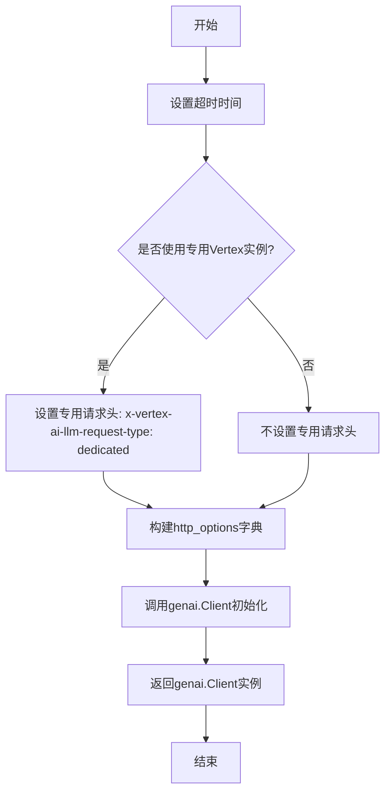
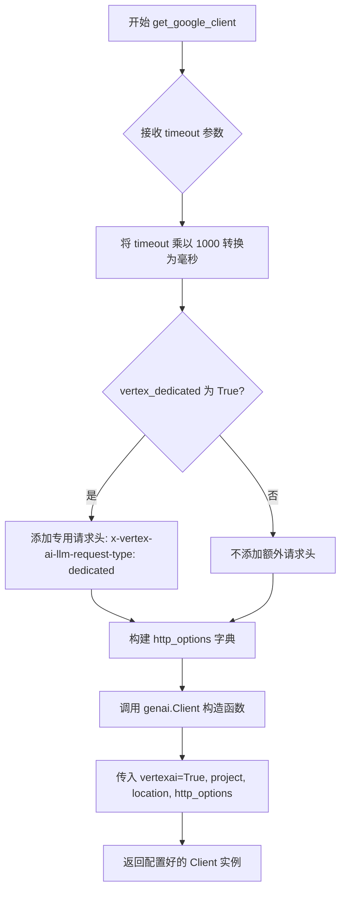

# `marker\marker\services\vertex.py` 详细设计文档

该代码定义了一个GoogleVertexService类，继承自BaseGeminiService，用于通过Google Cloud的Vertex AI平台调用Gemini模型。它提供了配置Google Cloud项目ID、区域、模型名称等参数的功能，并封装了genai.Client的初始化逻辑，支持超时设置和专用Vertex AI实例的配置。

## 整体流程



## 类结构

```
BaseGeminiService (基类)
└── GoogleVertexService (继承类)
```

## 全局变量及字段


### `GoogleVertexService.vertex_project_id`
    
Google Cloud Project ID for Vertex AI.

类型：`str`
    


### `GoogleVertexService.vertex_location`
    
Google Cloud Location for Vertex AI.

类型：`str`
    


### `GoogleVertexService.gemini_model_name`
    
The name of the Google model to use for the service.

类型：`str`
    


### `GoogleVertexService.vertex_dedicated`
    
Whether to use a dedicated Vertex AI instance.

类型：`bool`
    
    

## 全局函数及方法


### `GoogleVertexService.get_google_client`

获取配置好的 Google GenAI 客户端，用于与 Google Vertex AI 服务交互。该方法根据类的配置属性（如项目 ID、位置、模型名称等）创建相应的客户端，并支持专用的 Vertex AI 实例。

参数：

- `timeout`：`int`，超时时间（秒），在内部会乘以 1000 转换为毫秒用于 HTTP 请求配置

返回值：`genai.Client`，返回配置好的 Google GenAI 客户端对象，用于与 Vertex AI 进行交互

#### 流程图



#### 带注释源码

```python
def get_google_client(self, timeout: int):
    """
    获取配置好的 Google GenAI 客户端，用于与 Vertex AI 交互。
    
    参数:
        timeout: 超时时间（秒），内部会转换为毫秒
        
    返回:
        配置好的 genai.Client 实例
    """
    # 将秒转换为毫秒，因为 Google GenAI 客户端使用毫秒作为超时单位
    http_options = {"timeout": timeout * 1000}
    
    # 如果使用专用 Vertex AI 实例，添加特定的请求头标识
    if self.vertex_dedicated:
        http_options["headers"] = {"x-vertex-ai-llm-request-type": "dedicated"}
    
    # 创建并返回配置好的 Google GenAI 客户端
    # vertexai=True: 启用 Vertex AI 模式
    # project: GCP 项目 ID
    # location: GCP 区域
    # http_options: HTTP 请求配置（超时和请求头）
    return genai.Client(
        vertexai=True,
        project=self.vertex_project_id,
        location=self.vertex_location,
        http_options=http_options,
    )
```

## 关键组件


### Google Vertex AI 配置组件

包含三个核心配置字段：vertex_project_id（项目ID）、vertex_location（区域，默认为us-central1）、gemini_model_name（模型名称，默认为gemini-2.0-flash-001），用于初始化Google Cloud Vertex AI服务的连接参数。

### 专用实例支持组件

vertex_dedicated布尔字段控制是否使用专用Vertex AI实例。当启用时，会在HTTP请求头中添加"x-vertex-ai-llm-request-type": "dedicated"标记，以区分共享和专用资源请求。

### HTTP选项管理组件

负责将超时时间从秒转换为毫秒，并动态构建http_options字典。包含超时配置和可选的请求头，用于定制HTTP请求行为。

### 客户端工厂方法组件

get_google_client方法接收timeout参数，返回配置好的genai.Client实例。该方法封装了Vertex AI客户端的初始化逻辑，支持项目ID、位置和HTTP选项的配置。

### 继承架构组件

GoogleVertexService继承自BaseGeminiService，体现了基于Gemini服务的基础架构设计，允许扩展不同的Google AI后端实现。


## 问题及建议


### 已知问题

- **类型注解错误**：`vertex_project_id` 声明为 `Annotated[str, ...] = None`，但 None 不能赋值给 str 类型，应使用 `Optional[str]` 或提供有效的默认值
- **缺少参数验证**：未对 `timeout`、`vertex_project_id`、`vertex_location` 等参数进行有效性验证，可能导致运行时错误
- **硬编码的 Magic Number**：超时转换使用 `* 1000` 毫秒，但 1000 这个数值没有定义为常量，可读性差
- **异常处理缺失**：`genai.Client()` 初始化可能抛出异常，但方法中没有异常处理逻辑
- **配置默认值不合理**：`vertex_project_id` 默认值为 None，但 Vertex AI 必须需要有效的项目 ID 才能工作
- **可测试性差**：方法内部直接实例化 `genai.Client`，导致无法进行单元测试，应使用依赖注入或工厂模式
- **HTTP 选项构建繁琐**：使用字典手动构建 http_options，可考虑使用数据类或 builder 模式

### 优化建议

- 修复类型注解：使用 `Optional[str]` 或提供有意义的默认值
- 添加参数验证：在方法开始时验证必要参数，可使用 Pydantic 或 attrs 进行数据验证
- 提取常量：将 `1000` 转换为 `TIMEOUT_MULTIPLIER` 常量，将请求头键名定义为类常量
- 添加异常处理：捕获可能的网络、认证或配置错误，提供有意义的错误信息
- 依赖注入：将 `genai.Client` 的创建提取为可注入的依赖，提高可测试性
- 考虑使用数据类或 Pydantic BaseModel 管理配置，提供更好的类型安全和默认值处理
- 验证 `vertex_location` 为有效的 GCP 区域，避免运行时 API 调用失败

## 其它


### 设计目标与约束

本服务旨在为marker框架提供Google Vertex AI的集成能力，支持通过Vertex AI平台调用Google的Gemini模型。核心约束包括：必须依赖Google Cloud环境、需要在Google Cloud项目中启用Vertex AI API、仅支持同步调用模式、不支持流式响应。

### 错误处理与异常设计

错误处理主要依赖于genai.Client的异常抛出。常见的异常场景包括：认证失败（InvalidCredentialsException）、项目或区域配置错误（ResourceNotFoundException）、超时异常（TimeoutError）、配额超限（QuotaExceededException）。建议在调用层捕获google.api_core.exceptions模块中的异常，并转换为统一的业务异常。

### 外部依赖与接口契约

主要外部依赖包括：google-genai库（用于调用Google AI服务）、BaseGeminiService基类（定义服务抽象接口）、google-api-core（处理Google云服务通用异常）。接口契约方面，get_google_client方法接受timeout参数（秒），返回genai.Client实例，该实例用于后续的模型调用。

### 安全性考虑

涉及的安全性因素包括：Google Cloud项目凭证管理（通过Google Auth机制自动获取）、敏感信息泄露风险（project_id和location需妥善保管）、专用实例标识（vertex_dedicated请求头可能包含业务敏感信息）。建议使用环境变量或密钥管理服务存储项目ID，避免硬编码。

### 性能考量

timeout参数以毫秒为单位传递给http_options，当前实现支持自定义超时时间。专用实例模式（vertex_dedicated=True）会添加特定请求头，可能影响请求路由和计费。建议根据实际业务需求合理设置timeout值，避免过长导致资源占用，或过短导致频繁超时。

### 配置管理

所有配置项均支持运行时修改：vertex_project_id（项目ID）、vertex_location（区域，默认us-central1）、gemini_model_name（模型名称，默认gemini-2.0-flash-001）、vertex_dedicated（专用实例标志）。建议通过环境变量或配置文件注入这些值，实现环境隔离。

### 版本兼容性

当前代码依赖google-genai库的Client类，该类在genai库1.x版本中可用。需注意google-genapi库的版本演进，某些旧版本可能不支持vertexai=True参数或http_options配置。建议在项目依赖中锁定google-genai版本，并进行兼容性测试。

### 测试策略

建议的测试覆盖包括：单元测试（验证配置字段默认值和类型）、集成测试（验证与Google Cloud的连接）、Mock测试（模拟genai.Client行为）。测试时需注意处理Google Cloud认证，可使用mock凭证或测试专用项目。

### 部署注意事项

部署环境需满足：已安装google-genai库、可访问Google Cloud（网络可达）、已配置Google Cloud认证凭证（Application Default Credentials或服务账号密钥）。建议在Kubernetes环境中部署时，使用Workload Identity进行安全认证。

### 扩展性设计

当前类设计遵循开放封闭原则，可通过继承BaseGeminiService扩展其他模型服务。若需支持更多配置项（如retry策略、custom headers），可在http_options中继续扩展。get_google_client方法可进一步抽象为工厂方法，支持不同客户端类型的创建。


    