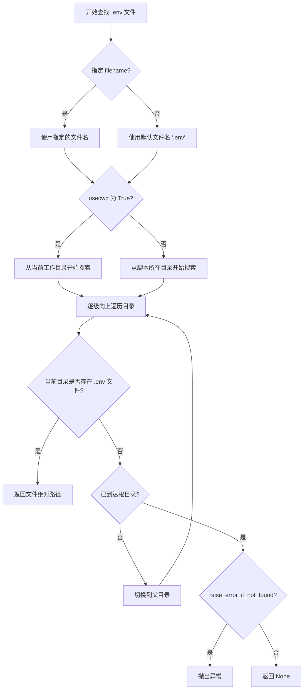
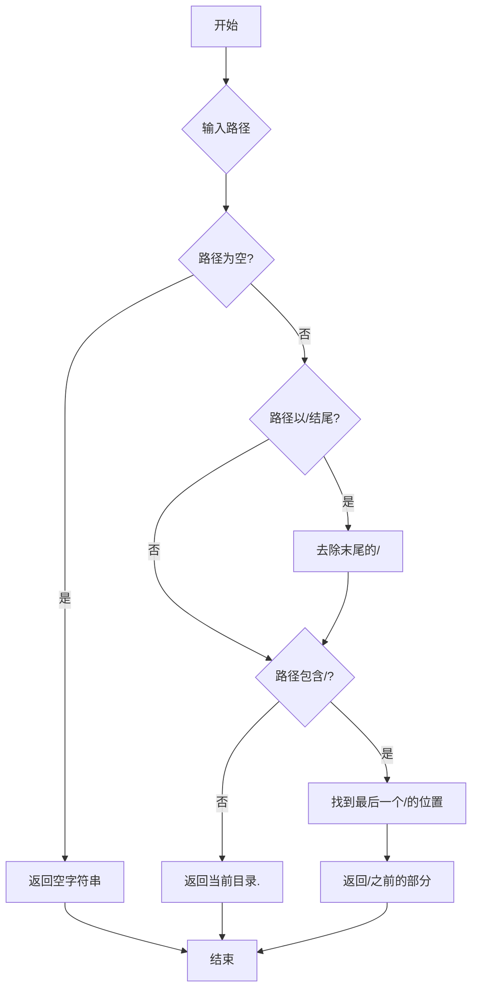
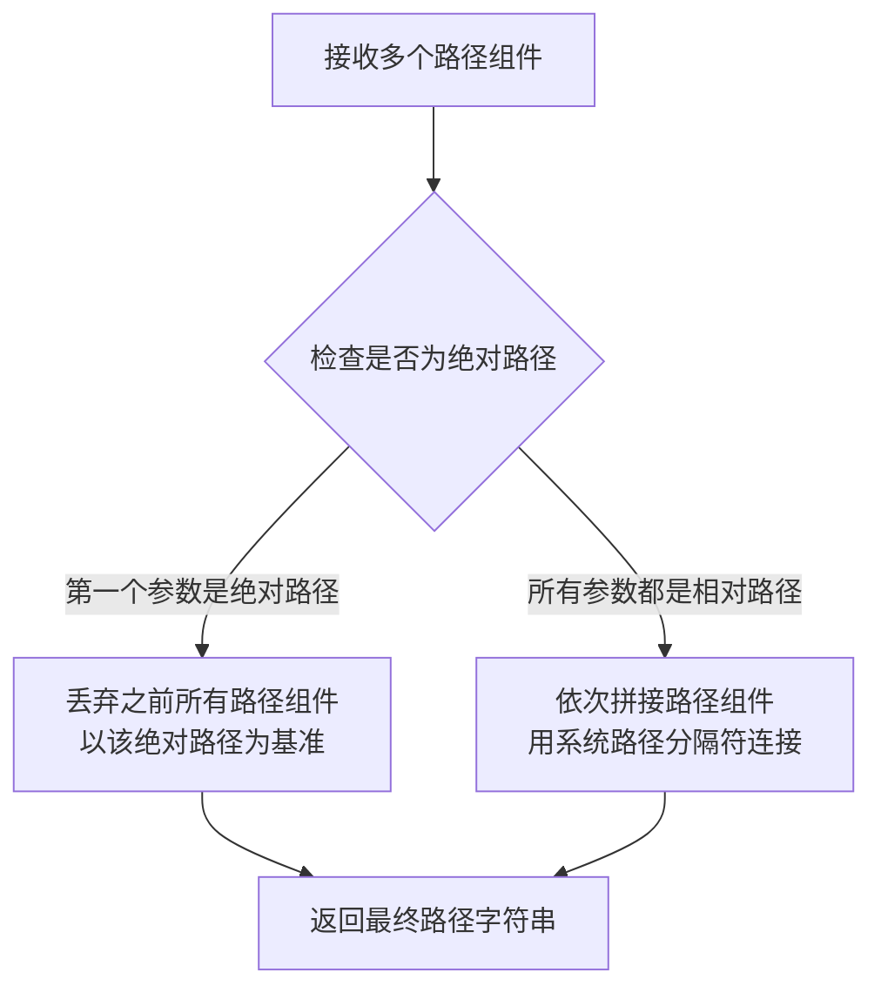
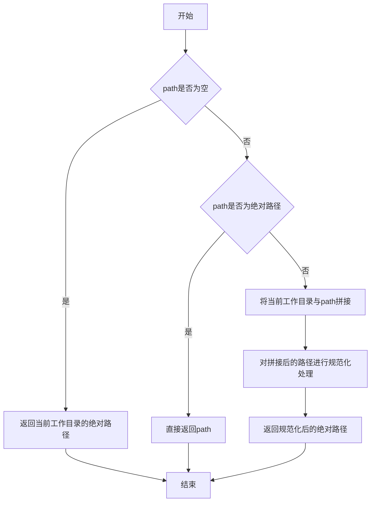
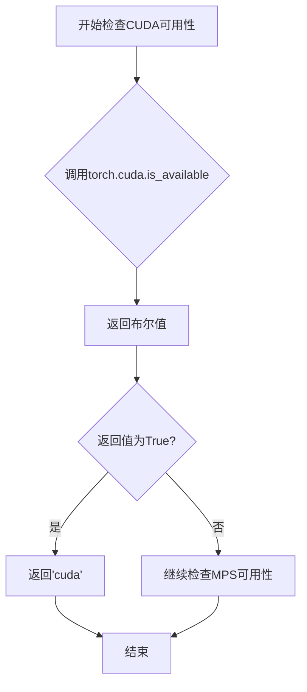
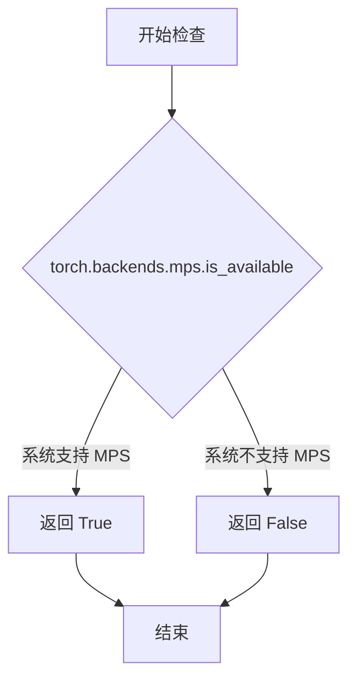
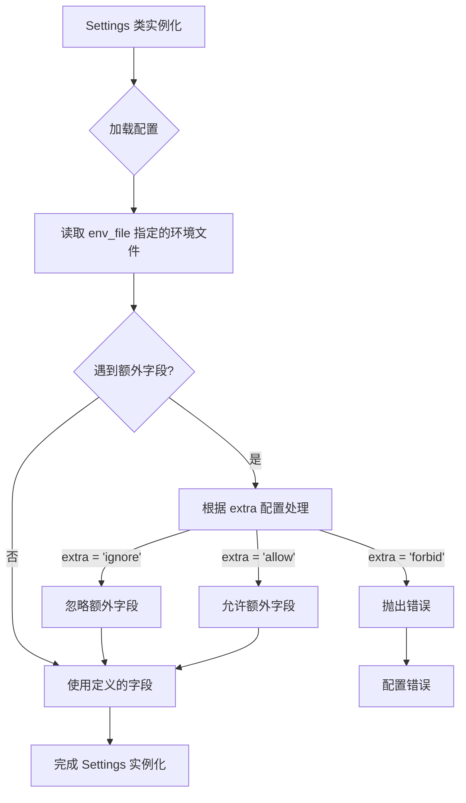

# `marker\marker\settings.py` 详细设计文档

这是一个配置管理模块，使用Pydantic的BaseSettings集中管理应用程序的各种配置参数，包括文件路径、LLM API密钥、PyTorch设备自动检测等，支持从环境变量加载配置并提供计算属性动态确定最佳运行设备。

## 整体流程

```mermaid
graph TD
    A[开始] --> B[Settings类初始化]
B --> C{环境变量中存在TORCH_DEVICE?}
C -- 是 --> D[TORCH_DEVICE = 环境变量值]
C -- 否 --> E{torch.cuda.is_available()?}
E -- 是 --> F[TORCH_DEVICE_MODEL = cuda]
E -- 否 --> G{torch.backends.mps.is_available()?}
G -- 是 --> H[TORCH_DEVICE_MODEL = mps]
G -- 否 --> I[TORCH_DEVICE_MODEL = cpu]
D --> J{设备是cuda?}
F --> J
H --> J
I --> J
J -- 是 --> K[MODEL_DTYPE = bfloat16]
J -- 否 --> L[MODEL_DTYPE = float32]
K --> M[配置加载完成]
L --> M
```

## 类结构

```
Settings (Pydantic BaseSettings子类)
├── 类字段 (14个)
│   ├── 路径配置: BASE_DIR, OUTPUT_DIR, FONT_DIR, DEBUG_DATA_FOLDER, FONT_PATH
│   ├── URL配置: ARTIFACT_URL
│   ├── 通用配置: LOGLEVEL, OUTPUT_ENCODING, OUTPUT_IMAGE_FORMAT
│   ├── API配置: GOOGLE_API_KEY
│   └── 设备配置: TORCH_DEVICE
└── 计算属性 (2个)
    ├── TORCH_DEVICE_MODEL - 自动设备检测
    └── MODEL_DTYPE - 模型数据类型
```

## 全局变量及字段


### `settings`
    
Settings类实例，全局配置对象

类型：`Settings`
    


### `Settings.BASE_DIR`
    
应用基础目录路径

类型：`str`
    


### `Settings.OUTPUT_DIR`
    
转换结果输出目录

类型：`str`
    


### `Settings.FONT_DIR`
    
字体文件目录

类型：`str`
    


### `Settings.DEBUG_DATA_FOLDER`
    
调试数据文件夹路径

类型：`str`
    


### `Settings.ARTIFACT_URL`
    
模型工件下载URL

类型：`str`
    


### `Settings.FONT_NAME`
    
字体文件名

类型：`str`
    


### `Settings.FONT_PATH`
    
字体完整路径

类型：`str`
    


### `Settings.LOGLEVEL`
    
日志级别配置

类型：`str`
    


### `Settings.OUTPUT_ENCODING`
    
输出文件编码格式

类型：`str`
    


### `Settings.OUTPUT_IMAGE_FORMAT`
    
输出图片格式

类型：`str`
    


### `Settings.GOOGLE_API_KEY`
    
Google API密钥

类型：`Optional[str]`
    


### `Settings.TORCH_DEVICE`
    
PyTorch设备配置

类型：`Optional[str]`
    


### `Settings.TORCH_DEVICE_MODEL`
    
实际使用的设备类型(计算属性)

类型：`str`
    


### `Settings.MODEL_DTYPE`
    
模型数据类型(计算属性)

类型：`torch.dtype`
    
    

## 全局函数及方法


### `find_dotenv`

`find_dotenv` 是 `dotenv` 库提供的函数，用于在项目目录结构中自动查找 `.env` 配置文件。它从当前目录开始向上遍历父目录，直到找到指定的 `.env` 文件并返回其绝对路径。

参数：

- `filename`：`str`，要查找的 .env 文件名，默认为 ".env"
- `raise_error_if_not_found`：`bool`，如果为 True，当文件未找到时抛出异常，默认为 False
- `usecwd`：`bool`，是否从当前工作目录开始搜索，默认为 False

返回值：`Optional[str]`，返回找到的 .env 文件的绝对路径，如果未找到则返回 None

#### 流程图



#### 带注释源码

```python
# 从 dotenv 库导入 find_dotenv 函数
# 该函数不属于本项目代码，是外部依赖
from dotenv import find_dotenv

# 在 Settings 类的 Config 中使用
class Config:
    # 使用 find_dotenv 查找 local.env 文件
    # 如果未找到，raise_error_if_not_found 默认为 False，会静默返回 None
    env_file = find_dotenv("local.env")
    extra = "ignore"
```

> **注意**：该函数定义在 `python-dotenv` 库中，不在本项目代码内。以上信息基于 `python-dotenv` 库的标准行为。在本项目中，该函数仅用于查找 `local.env` 配置文件路径，并传递给 Pydantic 的 `BaseSettings` 类用于加载环境变量。


### `os.path.dirname`

获取给定路径的目录部分，返回去掉最后一个路径组件后的路径字符串。

参数：

- `path`：`str`，需要获取目录的路径（可以是文件路径或目录路径）

返回值：`str`，返回 path 的目录部分。如果 path 是空字符串、表示根目录或仅包含斜杠，则返回父目录路径。

#### 流程图



#### 带注释源码

```python
# os.path.dirname 函数源码示例（Python 标准库实现逻辑）

def dirname(path):
    """
    返回路径 path 的目录部分。
    
    参数:
        path: 字符串路径
        
    返回:
        字符串，表示 path 的父目录路径
    """
    # 将路径转换为字符串（如果是 Path 对象）
    path = os.fspath(path)
    
    # 处理空字符串情况
    if not path:
        return '.'
    
    # 处理绝对路径情况
    if path.startswith('/'):
        # 找到最后一个斜杠的位置
        sep = len(path)
        while sep and path[sep - 1] != '/':
            sep -= 1
        # 返回斜杠之前的内容
        return path[:sep] if sep else '/'
    
    # 处理相对路径
    sep = len(path)
    while sep and path[sep - 1] != '/':
        sep -= 1
    # 返回斜杠之前的内容
    return path[:sep] if sep else '.'

# 在项目代码中的实际使用：
BASE_DIR: str = os.path.dirname(os.path.dirname(os.path.abspath(__file__)))
# 1. os.path.abspath(__file__) - 获取当前文件（settings.py）的绝对路径
# 2. 第一次 os.path.dirname - 获取 settings.py 所在目录（即项目根目录）
# 3. 第二次 os.path.dirname - 获取项目根目录的父目录（即项目的基础目录）
```


### `os.path.join`

`os.path.join` 是 Python 标准库 `os.path` 模块中的路径拼接函数，用于将多个路径组件智能地拼接成一个完整的文件系统路径，确保路径分隔符在不同操作系统上正确处理。

参数：

- `*paths`：可变数量的字符串参数（`str`），表示要拼接的路径组件。可以是一个或多个字符串，如目录名、文件名等。

返回值：`str`，返回拼接后的完整文件系统路径。

#### 流程图



#### 带注释源码

```python
# os.path.join 源码示例（简化版）
def join(*paths):
    """
    将多个路径组件拼接成一个完整的路径
    
    参数:
        *paths: 可变数量的路径字符串组件
    
    返回值:
        拼接后的完整路径字符串
    """
    # 如果没有传入任何路径，返回空字符串
    if not paths:
        return ""
    
    # 获取系统路径分隔符（Windows为\，Linux/Mac为/）
    sep = os.sep
    
    # 遍历所有路径组件
    result = paths[0]
    for path in paths[1:]:
        # 如果当前路径组件是绝对路径，重新开始拼接
        if isabs(path):
            result = path
        else:
            # 如果结果路径末尾没有分隔符，添加分隔符
            if result and not result.endswith(sep):
                result += sep
            # 拼接当前路径组件
            result = result + path
    
    return result


# 在本项目中的实际使用示例：
# Settings 类中的路径配置字段

# 示例1：OUTPUT_DIR
# 将 BASE_DIR 与 "conversion_results" 拼接
# 例如："/app" + "/" + "conversion_results" = "/app/conversion_results"
OUTPUT_DIR: str = os.path.join(BASE_DIR, "conversion_results")

# 示例2：FONT_DIR
# 将 BASE_DIR 与 "static", "fonts" 多级目录拼接
# 例如："/app" + "/" + "static" + "/" + "fonts" = "/app/static/fonts"
FONT_DIR: str = os.path.join(BASE_DIR, "static", "fonts")

# 示例3：DEBUG_DATA_FOLDER
# 拼接基础目录与调试数据文件夹
DEBUG_DATA_FOLDER: str = os.path.join(BASE_DIR, "debug_data")

# 示例4：FONT_PATH
# 将字体目录与字体文件名拼接，得到完整字体文件路径
# 例如："/app/static/fonts" + "/" + "GoNotoCurrent-Regular.ttf"
FONT_PATH: str = os.path.join(FONT_DIR, FONT_NAME)
```

---

#### 关键组件信息

| 组件名称 | 一句话描述 |
|---------|-----------|
| `os.path.join` | Python 标准库路径拼接函数，确保跨平台路径正确性 |
| `BASE_DIR` | 应用基础目录，通过 `__file__` 自动获取项目根路径 |
| `OUTPUT_DIR` | 转换结果输出目录 |
| `FONT_DIR` | 静态字体文件存放目录 |
| `FONT_PATH` | 完整字体文件路径 |

#### 技术债务与优化空间

1. **硬编码路径分隔符风险**：`os.path.join` 已处理跨平台问题，当前实现良好
2. **路径验证缺失**：建议在 `Settings` 初始化时添加路径存在性验证，确保必需目录存在
3. **缓存机制**：可考虑将计算属性（`computed_field`）结果缓存，避免重复计算


### `os.path.abspath`

获取给定路径的绝对路径，将相对路径转换为绝对路径，并规范化路径表示。

参数：

-  `path`：`str`，需要转换为绝对路径的路径，可以是相对路径或绝对路径

返回值：`str`，返回绝对路径的字符串表示

#### 流程图



#### 带注释源码

```python
# os.path.abspath 是 Python 标准库 os.path 模块中的一个函数
# 用于将相对路径转换为绝对路径，并规范化路径表示

# 在本代码中的实际使用：
BASE_DIR: str = os.path.dirname(os.path.dirname(os.path.abspath(__file__)))
# 解释：
# 1. os.path.abspath(__file__) 获取当前文件（即 settings.py）的绝对路径
#    __file__ 是 Python 内置变量，表示当前模块的文件路径
# 2. os.path.dirname(...) 第一次调用获取父目录路径（即项目根目录）
# 3. os.path.dirname(...) 第二次调用获取项目的基础目录（假设 settings.py 在子目录中）
# 最终效果：BASE_DIR 指向项目的基础目录路径

# 函数原型（参考标准库文档）：
# os.path.abspath(path) -> str
#
# 参数：
#   path: str - 路径字符串
#
# 返回值：
#   str - 绝对路径字符串
#
# 示例：
# os.path.abspath(".")        # 返回当前工作目录的绝对路径
# os.path.abspath("../data")  # 返回上一级 data 目录的绝对路径
# os.path.abspath("/tmp/file") # 返回 /tmp/file（如果已是绝对路径则原样返回）
```


### `torch.cuda.is_available`

该函数是 PyTorch 库提供的 CUDA 可用性检查函数，用于检测当前系统是否支持 CUDA（Compute Unified Device Architecture），即是否有可用的 CUDA 设备。在本项目代码中，该函数被用于在 `Settings.TORCH_DEVICE_MODEL` 计算属性中动态判断应该使用哪种计算设备。

参数：

- 该函数无参数

返回值：`bool`，返回 `True` 表示系统支持 CUDA 并可用于 PyTorch 运算，返回 `False` 表示不支持 CUDA

#### 流程图



#### 带注释源码

```python
# torch.cuda.is_available() 是 PyTorch 库的内置函数
# 用于检查CUDA是否可用于当前Python环境
# 以下是在本项目 Settings 类中的调用方式：

if torch.cuda.is_available():
    return "cuda"
```

> **注意**：用户提供的是项目代码，而 `torch.cuda.is_available` 是 PyTorch 外部库的函数，非该项目内部定义。上述信息基于 PyTorch 官方文档和该代码中的调用上下文提取。如需获取 PyTorch 库中该函数的完整源码，请参考 PyTorch 官方仓库（https://github.com/pytorch/pytorch）。


### `torch.backends.mps.is_available`

检查当前系统是否支持 Apple Silicon (MPS) 加速功能，返回布尔值表示 MPS 后端是否可用。

参数：此函数无参数

返回值：`bool`，如果当前系统支持 MPS（Metal Performance Shaders）则返回 `True`，否则返回 `False`

#### 流程图



#### 带注释源码

```python
# 在 Settings 类中的使用示例
@computed_field
@property
def TORCH_DEVICE_MODEL(self) -> str:
    """
    自动选择最佳的 PyTorch 计算设备
    """
    # 如果用户已明确指定设备，直接使用
    if self.TORCH_DEVICE is not None:
        return self.TORCH_DEVICE

    # 检查 NVIDIA GPU 是否可用
    if torch.cuda.is_available():
        return "cuda"

    # 检查 Apple Silicon (MPS) 是否可用
    # 这是对 torch.backends.mps.is_available 的调用
    if torch.backends.mps.is_available():
        return "mps"

    # 默认使用 CPU
    return "cpu"
```

#### 备注

- **函数来源**: 此函数来自 PyTorch 框架本身，非项目代码
- **MPS 简介**: MPS (Metal Performance Shaders) 是 Apple Silicon (M1/M2/M3 芯片) 上的 GPU 加速框架
- **平台限制**: 仅在 Apple Silicon Mac 上有效，Intel Mac 或其他平台返回 `False`
- **与代码的关系**: 项目中通过 `Settings.TORCH_DEVICE_MODEL` 计算属性间接调用此函数，用于自动选择最佳计算设备


### `Settings.Config`

描述：Settings.Config 是 Pydantic 的内部配置类，用于定义 Settings 模型的配置行为，包括环境变量文件的加载方式和额外字段的处理策略。

参数：此类无传统方法参数，作为配置类直接通过类属性影响父类行为。

返回值：此类无返回值，它仅作为 Pydantic BaseSettings 的配置定义。

#### 流程图



#### 带注释源码

```python
class Settings(BaseSettings):
    """继承自 pydantic_settings.BaseSettings 的配置类"""
    
    # ... 其他字段定义 ...

    class Config:
        """
        Pydantic 模型的配置类
        
        配置项说明：
        - env_file: 指定要加载的环境变量文件路径
          * 使用 find_dotenv('local.env') 查找项目中的 local.env 文件
          * 如果文件不存在，pydantic 会忽略该配置
        - extra: 控制额外字段的处理策略
          * 'ignore' - 忽略未在模型中定义的字段（推荐用于生产环境）
          * 'forbid' - 禁止使用未定义的字段
          * 'allow' - 允许使用未定义的字段
        """
        env_file = find_dotenv("local.env")  # 加载 .env 文件
        extra = "ignore"  # 忽略额外的环境变量
```

#### 关联信息

**关键组件信息：**

| 组件名称 | 一句话描述 |
|---------|-----------|
| `Settings` | 主配置类，聚合所有应用配置项 |
| `Settings.Config` | Pydantic 配置类，定义环境变量加载和行为策略 |
| `find_dotenv()` | dotenv 库函数，用于定位 .env 文件 |

**潜在的技术债务或优化空间：**

1. **硬编码的环境文件名**：当前 `env_file` 硬编码为 `"local.env"`，建议支持多环境配置（如 `.env.production`、`.env.development`）
2. **缺少配置验证**：未对配置值进行运行时验证（如目录是否存在、API Key 格式等）
3. **设备检测逻辑与配置耦合**：`TORCH_DEVICE_MODEL` 和 `MODEL_DTYPE` 的计算逻辑与 Settings 类耦合过紧，可考虑抽离为独立工具类

**设计目标与约束：**

- 目标：提供统一的配置管理，支持从环境变量和 .env 文件加载配置
- 约束：遵循 Pydantic Settings 最佳实践，使用类型提示确保配置安全

**错误处理与异常设计：**

- 若 `env_file` 指定的文件不存在，pydantic 会忽略并继续使用系统环境变量
- 若配置值类型不匹配，Pydantic 会抛出 `ValidationError`

## 关键组件


### 配置管理 (Settings 类)

应用程序的核心配置管理类，继承自 Pydantic Settings，用于集中管理应用的所有配置参数，包括路径、编码格式、API 密钥和 PyTorch 设备自动选择逻辑。

### 路径配置组件

包含 BASE_DIR、OUTPUT_DIR、FONT_DIR、DEBUG_DATA_FOLDER 等路径配置，用于定义项目根目录、输出目录、字体目录和调试数据目录的路径，支持artifact URL 和字体文件路径的动态构建。

### Torch 设备自动选择

通过 TORCH_DEVICE_MODEL 计算属性实现设备自动选择逻辑，支持 CUDA、MPS 和 CPU 三种设备，根据硬件可用性自动选择最优计算设备，其中 MPS 设备不适用于文本检测任务。

### 量化策略 (MODEL_DTYPE)

根据选择的计算设备动态确定模型数据类型，在 CUDA 设备上使用 bfloat16 量化以节省显存和加速计算，在其他设备上使用 float32 以保证兼容性。

### 环境变量加载

使用 dotenv 的 find_dotenv 方法加载 local.env 配置文件，支持从环境变量覆盖默认配置值，实现配置的多环境适应性。

### 全局配置单例

settings 全局实例，提供了便捷的全局配置访问方式，整个应用可以导入此单例来获取配置参数。


## 问题及建议


### 已知问题

-   **环境文件缺失处理**：`find_dotenv("local.env")` 可能在文件不存在时返回 `None`，但 `Config` 中未对此进行检查，可能导致静默失败
-   **设备选择逻辑与注释矛盾**：注释明确指出 "MPS device does not work for text detection"，但代码在 CUDA 不可用时仍会返回 "mps"，可能导致后续模块出错
-   **默认值设计不一致**：`GOOGLE_API_KEY` 使用空字符串 `""` 作为默认值，而非 `None`，与 `Optional[str]` 的语义不符，可能导致条件判断逻辑混乱
-   **路径计算依赖文件位置**：`BASE_DIR` 通过 `__file__` 动态计算，当模块被安装为包或以不同方式导入时，路径可能解析错误
-   **配置验证缺失**：缺少对关键配置的验证，如 `OUTPUT_IMAGE_FORMAT` 应限制为有效格式、`LOGLEVEL` 应为有效日志级别等

### 优化建议

-   添加环境文件存在性检查，不存在时给出警告或使用默认路径
-   根据注释逻辑，当 CUDA 不可用时应跳过 MPS，直接回退到 CPU，或添加配置项控制是否启用 MPS
-   将 `GOOGLE_API_KEY` 默认值改为 `None`，并在代码中使用 `if key is not None` 进行判断
-   考虑使用 `pathlib.Path` 替代 `os.path` 以获得更清晰的路径操作，或添加路径有效性检查
-   添加 Pydantic validator 对配置值进行校验，确保 `OUTPUT_IMAGE_FORMAT` 在允许的格式列表中、`LOGLEVEL` 为有效级别
-   考虑将设备选择逻辑封装为独立函数或类方法，提高可测试性和可维护性

## 其它


### 设计目标与约束

本代码的设计目标是提供一个集中化、可配置的应用设置管理模块，支持从环境变量和.env文件加载配置，并自动检测最优的PyTorch计算设备。主要约束包括：必须兼容Python 3.8+环境，需依赖pydantic和torch库，配置项需符合12-Factor App原则支持环境变量覆盖，设备检测逻辑需考虑CUDA和MPS可用性且MPS不适用于文本检测场景。

### 错误处理与异常设计

代码主要依赖pydantic的自动验证机制处理配置错误。当环境变量格式不符合预期类型时，pydantic会抛出ValidationError。设备检测过程中torch.cuda.is_available()和torch.backends.mps.is_available()可能返回False导致使用CPU，属于正常降级行为不抛出异常。建议在调用settings前添加try-except捕获pydantic ValidationError，记录具体配置错误信息并提供有意义的错误提示。

### 数据流与状态机

配置数据流为：.env文件 → 环境变量 → BaseSettings验证 → Settings实例化。Settings对象为单例模式全局共享，不存在状态机设计。配置加载发生在模块导入时（settings = Settings()），所有配置项在实例化时确定，后续无法动态修改。设备选择状态转移：用户指定 → CUDA可用 → MPS可用 → CPU。

### 外部依赖与接口契约

外部依赖包括：pydantic_settings提供BaseSettings基类用于配置管理，torch库用于设备检测和数据类型选择，python-dotenv用于发现和加载.env文件，os模块用于路径操作。接口契约方面，settings对象暴露TORCH_DEVICE_MODEL（字符串）和MODEL_DTYPE（torch.dtype）两个计算属性供其他模块使用，所有配置项可通过settings.ATTRIBUTE_NAME方式访问，遵循只读访问模式不应修改配置值。

### 安全性考虑

GOOGLE_API_KEY配置项包含敏感信息，当前实现将其存储为普通字符串。建议对API密钥等敏感配置进行加密存储或使用pydantic的SecretStr类型替代str类型，防止在日志或错误信息中意外泄露。.env文件应加入.gitignore避免提交到版本控制系统。

### 性能考虑

设备检测逻辑在Settings实例化时执行一次，torch.cuda.is_available()和torch.backends.mps.is_available()调用开销可忽略。computed_field装饰器确保TORCH_DEVICE_MODEL和MODEL_DTYPE属性仅在首次访问时计算并缓存结果。BASE_DIR等路径计算使用os.path.join，性能开销极低。

### 配置管理策略

采用分层配置策略：第一层为代码中的默认值，第二层为.env文件中的值，第三层为环境变量（最高优先级）。Settings.Config中设置extra="ignore"允许存在未定义的额外环境变量而不抛出异常，便于扩展。配置项按功能分为路径配置、编码配置、LLM配置、设备配置四组，逻辑清晰便于维护。

### 环境变量与部署

所有配置项均支持通过环境变量覆盖，命名规范为全大写下划线分隔，与类属性名一致。.env文件模板应为local.env，开发环境通过find_dotenv()自动发现。建议在部署文档中明确列出所有可配置的环境变量及其用途，示例：export GOOGLE_API_KEY=your_key_here。

### 测试策略

建议为Settings类编写单元测试，测试场景包括：默认配置加载、.env文件覆盖、环境变量覆盖、设备检测逻辑（分别模拟CUDA/MPS/CPU可用情况）、类型验证失败场景。可使用pytest和unittest.mock模拟torch函数验证不同设备场景下的行为。

### 版本兼容性

代码使用Python 3.8+语法（typing.Optional可省略），pydantic_settings需要v2.0+版本（BaseSettings已迁移至pydantic_settings包），torch版本需支持mps后端（建议1.12+）。computed_field装饰器需要pydantic v2.0+，如使用pydantic v1.x需改用@property装饰器。


    