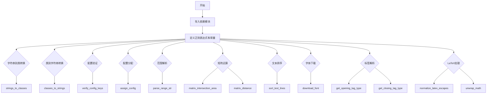
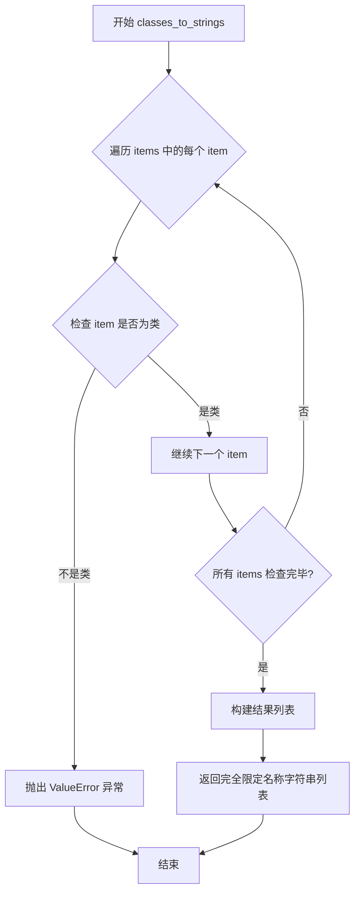
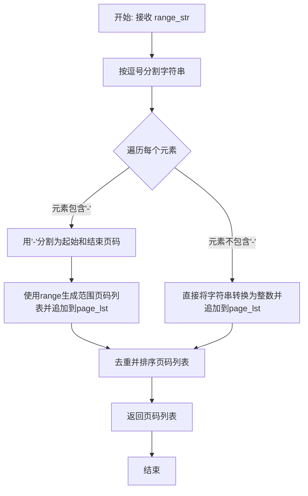
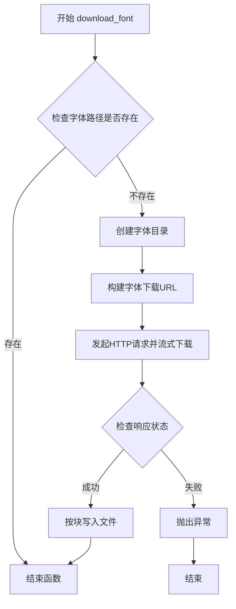

# `marker\marker\util.py` 详细设计文档

这是一个工具模块，提供了字符串与类的相互转换、配置验证与分配、范围字符串解析、矩阵运算（包围盒交集与距离计算）、文本行排序、字体下载、HTML标签解析以及LaTeX数学表达式规范化等功能，主要用于支撑文档解析和渲染的辅助操作。

## 整体流程



## 类结构

```
本文件为纯函数模块，无类定义
所有函数均为模块级全局函数
依赖外部: PolygonBox (marker.schema.polygon)
依赖外部: settings (marker.settings)
```

## 全局变量及字段


### `OPENING_TAG_REGEX`
    
用于匹配HTML开启标签（如<math>, <i>, <b>）的正则表达式模式

类型：`re.Pattern`
    


### `CLOSING_TAG_REGEX`
    
用于匹配HTML关闭标签（如</math>, </i>, </b>）的正则表达式模式

类型：`re.Pattern`
    


### `TAG_MAPPING`
    
HTML标签名到内部样式名称的映射字典，用于将标签转换为对应的样式标识

类型：`dict`
    


### `MATH_SYMBOLS`
    
用于判断文本是否真正包含数学内容的数学符号列表

类型：`List[str]`
    


### `MATH_TAG_PATTERN`
    
用于匹配完整math标签块的正则表达式模式，支持跨行匹配

类型：`re.Pattern`
    


### `LATEX_ESCAPES`
    
LaTeX转义字符到实际字符的映射字典，用于规范化LaTeX转义序列

类型：`dict`
    


    

## 全局函数及方法


### `strings_to_classes`

该函数是一个动态类导入工具函数，接收包含完整模块路径的字符串列表（如 `"module.submodule.ClassName"`），通过 Python 的动态导入机制将字符串形式的类路径转换为实际的类对象（type）并返回列表。

参数：

- `items`：`List[str]`，字符串列表，每个元素为完整的类路径字符串，格式为 `"模块名.类名"`，例如 `"marker.schema.polygon.PolygonBox"`

返回值：`List[type]`，类对象（type）列表，返回与输入字符串对应的实际类类型

#### 流程图

```mermaid
flowchart TD
    A[开始: strings_to_classes] --> B{检查 items 是否为空}
    B -->|是| C[返回空列表 []]
    B -->|否| D[遍历 items 中的每个 item]
    D --> E[使用 rsplit 将 item 分割为 module_name 和 class_name]
    F[使用 import_module 动态导入模块] --> G[使用 getattr 获取模块中的类]
    G --> H[将类添加到 classes 列表]
    H --> I{items 是否遍历完毕}
    I -->|否| D
    I -->|是| J[返回 classes 列表]
```

#### 带注释源码

```python
def strings_to_classes(items: List[str]) -> List[type]:
    """
    将字符串形式的类路径列表转换为实际的类对象列表
    
    参数:
        items: 字符串列表，每个元素为完整的类路径字符串，格式为 "模块名.类名"
    
    返回:
        类对象列表，包含与输入字符串对应的实际类类型
    """
    classes = []
    for item in items:
        # 使用 rsplit 从右边分割一次，获取模块名和类名
        # 例如: "marker.schema.polygon.PolygonBox" -> ("marker.schema.polygon", "PolygonBox")
        module_name, class_name = item.rsplit('.', 1)
        
        # 使用 importlib.import_module 动态导入模块
        module = import_module(module_name)
        
        # 从导入的模块中获取指定的类
        classes.append(getattr(module, class_name))
    
    return classes
```


### `classes_to_strings`

该函数用于将类对象列表转换为其完全限定名称字符串列表，通过检查每个元素是否为有效类，并拼接模块名与类名生成如 `module.ClassName` 格式的字符串，常用于配置序列化或动态类引用场景。

参数：

-  `items`：`List[type]`，需要转换的类对象列表

返回值：`List[str]`，类的完全限定名称字符串列表，格式为 `模块名.类名`

#### 流程图



#### 带注释源码

```python
def classes_to_strings(items: List[type]) -> List[str]:
    """
    将类对象列表转换为其完全限定名称字符串列表。
    
    该函数执行以下操作：
    1. 验证输入列表中的每个元素都是有效的类对象
    2. 如果任何元素不是类，抛出 ValueError 异常
    3. 将每个类转换为其完全限定名称（格式：模块名.类名）
    
    Args:
        items (List[type]): 包含类对象的列表
        
    Returns:
        List[str]: 类的完全限定名称字符串列表
        
    Raises:
        ValueError: 当列表中存在非类对象时抛出
    """
    # 遍历所有输入项，验证每个元素是否为类
    for item in items:
        # 使用 inspect.isclass 检查对象是否为类
        if not inspect.isclass(item):
            # 如果不是类，抛出详细的 ValueError 异常
            raise ValueError(f"Item {item} is not a class")

    # 使用列表推导式将每个类对象转换为其完全限定名称
    # item.__module__ 获取类所在的模块名
    # item.__name__ 获取类名
    # 最终格式："{module_name}.{class_name}"
    return [f"{item.__module__}.{item.__name__}" for item in items]
```


### `verify_config_keys`

该函数用于验证配置对象的必需字段是否已正确赋值。它通过检查对象类中类型为 `Annotated[str, ""]` 的属性，确保这些属性值不为 `None`，否则抛出断言错误以提示用户配置缺失。

参数：

- `obj`：`object`，需要进行配置验证的对象实例。对象必须是类的实例，且该类包含使用 `Annotated[str, ""]` 注解的字段。

返回值：`None`，无返回值。如果验证失败，该函数会通过 `assert` 语句抛出带有详细错误信息的 `AssertionError`。

#### 流程图

```mermaid
flowchart TD
    A[开始 verify_config_keys] --> B[获取 obj.__class__ 的注解]
    B --> C{遍历 annotations}
    C -->|遍历下一个属性| D{当前属性类型是 Annotated[str, '']?}
    D -->|是| E[获取该属性在对象中的实际值]
    D -->|否| C
    E --> F{值是否为 None?}
    F -->|是| G[将属性名添加到 none_vals 字符串]
    F -->|否| C
    G --> C
    C -->|遍历完成| H{是否有缺失配置?}
    H -->|是| I[抛出 AssertionError: 必须设置配置值]
    H -->|否| J[结束函数]
    I --> J
```

#### 带注释源码

```python
def verify_config_keys(obj):
    """
    验证配置对象的必需字段是否已正确赋值。
    
    该函数检查对象类中所有使用 Annotated[str, ''] 注解的属性，
    确保这些属性值不为 None。如果存在未设置的配置，将抛出断言错误。
    
    Args:
        obj: 需要进行配置验证的对象实例
        
    Raises:
        AssertionError: 当存在未设置的必需配置时抛出
    """
    # 获取传入对象所属类的类型注解（annotations）
    # 这些注解定义了类属性的类型信息
    annotations = inspect.get_annotations(obj.__class__)

    # 初始化空字符串，用于存储所有为 None 的属性名
    none_vals = ""
    
    # 遍历类中的所有属性注解
    for attr_name, annotation in annotations.items():
        # 检查当前属性的注解类型是否为 Annotated[str, '']
        # 只有标记为 Annotated[str, ''] 的属性才是必需的字符串配置
        if isinstance(annotation, type(Annotated[str, ""])):
            # 获取该属性在对象实例中的实际值
            value = getattr(obj, attr_name)
            
            # 如果值为 None，说明该必需配置未被设置
            if value is None:
                # 将属性名追加到缺失列表（带逗号和空格分隔）
                none_vals += f"{attr_name}, "

    # 断言检查：确保没有任何必需配置为 None
    # 如果有缺失配置，抛出详细的错误信息，列出所有缺失的配置项
    assert len(none_vals) == 0, f"In order to use {obj.__class__.__name__}, you must set the configuration values `{none_vals}`."
```


### `assign_config`

该函数是一个全局配置赋值工具，用于将配置对象（支持 Pydantic BaseModel、字典或 None）中的键值对动态绑定到目标类的属性上，同时支持带类名前缀的配置键（如 `MarkdownRenderer_remove_blocks`），从而实现灵活的配置注入机制。

参数：

- `cls`：任意类，要接收配置的对象
- `config`：`BaseModel | dict | None`，配置数据源，可以是 Pydantic 模型实例、字典或空值

返回值：`None`，该函数直接修改传入的类对象，不返回任何值

#### 流程图

```mermaid
flowchart TD
    A[开始: assign_config] --> B{config is None?}
    B -->|Yes| C[直接返回]
    B -->|No| D{config 是 BaseModel?}
    D -->|Yes| E[调用 config.dict 转为字典]
    D -->|No| F{config 是 dict?}
    F -->|No| G[抛出 ValueError: config must be a dict or a pydantic BaseModel]
    F -->|Yes| H[直接使用 config 作为字典]
    E --> I[遍历 dict_config 的所有键]
    H --> I
    I --> J{类是否有属性 k?}
    J -->|Yes| K[setattr(cls, k, dict_config[k])]
    J -->|No| L[跳过该键]
    K --> M[继续下一个键]
    L --> M
    M --> N{还有未遍历的键?}
    N -->|Yes| I
    N -->|No| O[再次遍历 dict_config]
    O --> P{键包含类名 cls_name?}
    P -->|No| Q[跳过该键]
    P -->|Yes| R[移除类名前缀得到 split_k]
    R --> S{类是否有属性 split_k?}
    S -->|Yes| T[setattr(cls, split_k, dict_config[k])]
    S -->|No| Q
    T --> U[继续下一个键]
    Q --> U
    U --> V{遍历结束?}
    V -->|No| O
    V -->|Yes| W[结束]
    C --> W
```

#### 带注释源码

```python
def assign_config(cls, config: BaseModel | dict | None):
    """
    将配置对象中的键值对赋值给目标类的属性。
    
    支持两种配置键格式：
    1. 直接属性名：如 config = {"remove_blocks": True}
    2. 带类名前缀：如 config = {"MarkdownRenderer_remove_blocks": True}
    
    Args:
        cls: 任意类对象，要接收配置的目标类
        config: 配置数据，支持 BaseModel、dict 或 None
    
    Returns:
        None: 直接修改传入的类对象，无返回值
    """
    # 获取传入类的类名，用于处理带前缀的配置键
    cls_name = cls.__class__.__name__
    
    # 如果配置为空，直接返回，不做任何修改
    if config is None:
        return
    # 如果配置是 Pydantic BaseModel，转换为字典
    elif isinstance(config, BaseModel):
        dict_config = config.dict()
    # 如果配置已经是字典，直接使用
    elif isinstance(config, dict):
        dict_config = config
    # 配置类型不支持，抛出异常
    else:
        raise ValueError("config must be a dict or a pydantic BaseModel")

    # 第一轮遍历：直接匹配属性名
    for k in dict_config:
        # 检查类是否有同名属性
        if hasattr(cls, k):
            # 动态设置属性值
            setattr(cls, k, dict_config[k])
    
    # 第二轮遍历：处理带类名前缀的配置键
    # 例如 "MarkdownRenderer_remove_blocks" -> "remove_blocks"
    for k in dict_config:
        # 跳过不包含类名的键
        if cls_name not in k:
            continue
        # Enables using class-specific keys, like "MarkdownRenderer_remove_blocks"
        # 移除类名前缀（如 "MarkdownRenderer_"）
        split_k = k.removeprefix(cls_name + "_")

        # 检查类是否有处理后的属性名
        if hasattr(cls, split_k):
            setattr(cls, split_k, dict_config[k])
```


### `parse_range_str`

该函数用于解析页码范围字符串（如 "1,3-5,7,10-12"），将其转换为有序且去重的页码列表，支持单个页码和连续页码范围的混合输入。

参数：

- `range_str`：`str`，要解析的页码范围字符串，格式为逗号分隔的单个页码或页码范围（如 "1,3-5,7"）

返回值：`List[int]`，[解析后的页码列表，已去重并按升序排列]

#### 流程图



#### 带注释源码

```python
def parse_range_str(range_str: str) -> List[int]:
    """
    解析页码范围字符串为页码列表
    
    Args:
        range_str: 页码范围字符串，格式如 "1,3-5,7,10-12"
        
    Returns:
        解析后的页码列表，已去重并按升序排列
    """
    # 按逗号分割字符串为多个部分
    range_lst = range_str.split(",")
    
    # 用于存储解析后的页码
    page_lst = []
    
    # 遍历每个部分（可能是单个页码或范围）
    for i in range_lst:
        # 检查是否为范围格式（如 "3-5"）
        if "-" in i:
            # 分割起始和结束页码
            start, end = i.split("-")
            # 使用 range 生成范围列表并追加（注意 range 不包含 end，所以需要 +1）
            page_lst += list(range(int(start), int(end) + 1))
        else:
            # 单个页码，直接转换为整数追加
            page_lst.append(int(i))
    
    # 去重页码并按升序排序
    page_lst = sorted(list(set(page_lst)))  # Deduplicate page numbers and sort in order
    
    return page_lst
```


### `matrix_intersection_area`

计算两个矩形框列表之间的交集面积矩阵，用于找出所有框对之间的重叠区域面积。

参数：

- `boxes1`：`List[List[float]]`，第一个矩形框列表，每个矩形由四个浮点数表示 `[x_min, y_min, x_max, y_max]`
- `boxes2`：`List[List[float]]`，第二个矩形框列表，格式同 `boxes1`

返回值：`np.ndarray`，形状为 `(N, M)` 的二维数组，其中 `N` 是 `boxes1` 的长度，`M` 是 `boxes2` 的长度，每个元素表示对应两个矩形的交集面积

#### 流程图

```mermaid
flowchart TD
    A[开始] --> B{boxes1 或 boxes2 为空?}
    B -->|是| C[返回形状为 N×M 的零矩阵]
    B -->|否| D[将输入转换为 NumPy 数组]
    D --> E[广播 boxes1 为 N×1×4, boxes2 为 1×M×4]
    E --> F[计算交集区域的左上角坐标 min_x, min_y]
    F --> G[计算交集区域的右下角坐标 max_x, max_y]
    G --> H[计算交集宽度和高度, 使用 max(0, ...)]
    H --> I[计算面积: width × height]
    I --> J[返回 N×M 面积矩阵]
    C --> J
```

#### 带注释源码

```python
def matrix_intersection_area(boxes1: List[List[float]], boxes2: List[List[float]]) -> np.ndarray:
    """
    计算两个矩形框列表之间的交集面积矩阵。
    
    参数:
        boxes1: 第一个矩形框列表，每个矩形由 [x_min, y_min, x_max, y_max] 表示
        boxes2: 第二个矩形框列表，格式同 boxes1
    
    返回:
        形状为 (N, M) 的二维数组，其中 N=len(boxes1), M=len(boxes2)
    """
    
    # 边界情况处理：如果任一列表为空，返回正确形状的零矩阵
    if len(boxes1) == 0 or len(boxes2) == 0:
        return np.zeros((len(boxes1), len(boxes2)))

    # 将输入列表转换为 NumPy 数组以便进行向量化计算
    boxes1 = np.array(boxes1)
    boxes2 = np.array(boxes2)

    # 广播操作：将两个数组扩展到 (N, M, 4) 的形状
    # boxes1: (N, 1, 4) - 每个框与所有 boxes2 的框比较
    boxes1 = boxes1[:, np.newaxis, :]  # Shape: (N, 1, 4)
    # boxes2: (1, M, 4) - 每个框与所有 boxes1 的框比较
    boxes2 = boxes2[np.newaxis, :, :]  # Shape: (1, M, 4)

    # 计算交集区域的左上角坐标（取两个矩形 x 和 y 坐标的最大值）
    min_x = np.maximum(boxes1[..., 0], boxes2[..., 0])  # Shape: (N, M)
    min_y = np.maximum(boxes1[..., 1], boxes2[..., 1])
    
    # 计算交集区域的右下角坐标（取两个矩形 x 和 y 坐标的最小值）
    max_x = np.minimum(boxes1[..., 2], boxes2[..., 2])
    max_y = np.minimum(boxes1[..., 3], boxes2[..., 3])

    # 计算交集宽度和高度，使用 max(0, ...) 确保无交集时结果为 0
    width = np.maximum(0, max_x - min_x)
    height = np.maximum(0, max_y - min_y)

    # 返回面积矩阵：宽度 × 高度，形状为 (N, M)
    return width * height  # Shape: (N, M)
```


### `matrix_distance`

该函数用于计算两组矩形边界框（bounding boxes）中心点之间的欧几里得距离矩阵。它接收两个边界框列表作为输入，返回一个形状为 (N, M) 的 numpy 数组，其中 N 是 boxes1 的数量，M 是 boxes2 的数量，数组中的每个元素表示对应边界框中心点之间的欧几里得距离。

参数：

- `boxes1`：`List[List[float]]`，第一个边界框列表，每个边界框由四个浮点数组成 [x1, y1, x2, y2]，表示左上角和右下角坐标
- `boxes2`：`List[List[float]]`，第二个边界框列表，每个边界框由四个浮点数组成 [x1, y1, x2, y2]，表示左上角和右下角坐标

返回值：`np.ndarray`，形状为 (N, M) 的二维数组，其中 N 是 boxes1 中边界框的数量，M 是 boxes2 中边界框的数量，数组中的每个元素表示对应边界框中心点之间的欧几里得距离

#### 流程图

```mermaid
flowchart TD
    A[开始] --> B{boxes2 是否为空?}
    B -->|是| C[返回形状为 len(boxes1) x 0 的零矩阵]
    C --> M[结束]
    B -->|否| D{boxes1 是否为空?}
    D -->|是| E[返回形状为 0 x len(boxes2) 的零矩阵]
    E --> M
    D -->|否| F[将 boxes1 和 boxes2 转换为 numpy 数组]
    F --> G[计算 boxes1 中心点: (x1+y1)/2, (x2+y2)/2]
    G --> H[计算 boxes2 中心点: (x1+y1)/2, (x2+y2)/2]
    H --> I[调整维度进行广播: boxes1_centers 扩展为 Nx1x2, boxes2_centers 扩展为 1xMx2]
    I --> J[计算欧几里得距离矩阵: np.linalg.norm]
    J --> K[返回距离矩阵]
    K --> M
```

#### 带注释源码

```python
def matrix_distance(boxes1: List[List[float]], boxes2: List[List[float]]) -> np.ndarray:
    """
    计算两组矩形边界框中心点之间的欧几里得距离矩阵。
    
    参数:
        boxes1: 第一个边界框列表，每个边界框为 [x1, y1, x2, y2]
        boxes2: 第二个边界框列表，每个边界框为 [x1, y1, x2, y2]
    
    返回:
        形状为 (N, M) 的距离矩阵，其中 N=len(boxes1), M=len(boxes2)
    """
    
    # 处理边界情况：boxes2 为空时，返回 N x 0 的零矩阵
    if len(boxes2) == 0:
        return np.zeros((len(boxes1), 0))
    
    # 处理边界情况：boxes1 为空时，返回 0 x M 的零矩阵
    if len(boxes1) == 0:
        return np.zeros((0, len(boxes2)))

    # 将输入列表转换为 numpy 数组
    # boxes1 形状: (N, 4)，boxes2 形状: (M, 4)
    boxes1 = np.array(boxes1)  # Shape: (N, 4)
    boxes2 = np.array(boxes2)  # Shape: (M, 4)

    # 计算每个边界框的中心点坐标
    # 中心点 = ((x1+x2)/2, (y1+y2)/2)，即左上角和右下角坐标的中点
    # boxes1_centers 形状: (N, 2)，boxes2_centers 形状: (M, 2)
    boxes1_centers = (boxes1[:, :2] + boxes1[:, 2:]) / 2  # Shape: (N, 2)
    boxes2_centers = (boxes2[:, :2] + boxes2[:, 2:]) / 2  # Shape: (M, 2)

    # 调整维度以进行广播计算
    # 通过添加新轴，使两个中心点数组可以逐对计算距离
    # boxes1_centers 形状: (N, 1, 2)，boxes2_centers 形状: (1, M, 2)
    boxes1_centers = boxes1_centers[:, np.newaxis, :]  # Shape: (N, 1, 2)
    boxes2_centers = boxes2_centers[np.newaxis, :, :]  # Shape: (1, M, 2)

    # 计算广播后的差值矩阵的 L2 范数（即欧几里得距离）
    # 相减结果形状: (N, M, 2)，沿 axis=2 求范数得到 (N, M) 的距离矩阵
    distances = np.linalg.norm(boxes1_centers - boxes2_centers, axis=2)  # Shape: (N, M)
    
    return distances
```


### `sort_text_lines`

该函数用于将文本行按阅读顺序进行排序。首先根据文本的垂直位置（y坐标）将文本行分组，然后在每个组内按水平位置（x坐标）排序，最后将所有组展平为一个排序后的列表。作为更高级排序的起点，并非100%准确。

参数：

- `lines`：`List[PolygonBox]`，需要排序的文本行列表
- `tolerance`：`float`，容差值，用于垂直分组的阈值，默认为1.25

返回值：`List[PolygonBox]`，排序后的文本行列表

#### 流程图

```mermaid
flowchart TD
    A[开始] --> B[创建空字典 vertical_groups]
    B --> C{遍历 lines 中的每个 line}
    C --> D[计算 group_key = round line.bbox[1] / tolerance * tolerance]
    D --> E{group_key 是否在 vertical_groups 中}
    E -->|否| F[创建新列表 vertical_groups[group_key]]
    E -->|是| G[继续]
    F --> H[将 line 添加到 vertical_groups[group_key]]
    G --> H
    H --> C
    C --> I{遍历完成?}
    I -->|否| C
    I --> J[创建空列表 sorted_lines]
    J --> K{按 group_key 排序遍历 vertical_groups.items}
    K --> L[在每个 group 内按 x.bbox[0] 排序]
    L --> M[将排序后的 group 扩展到 sorted_lines]
    M --> K
    K --> N[返回 sorted_lines]
    N --> O[结束]
```

#### 带注释源码

```python
def sort_text_lines(lines: List[PolygonBox], tolerance=1.25):
    # Sorts in reading order.  Not 100% accurate, this should only
    # be used as a starting point for more advanced sorting.
    # 创建一个字典来存储按垂直位置分组的文本行
    vertical_groups = {}
    
    # 遍历所有文本行，根据y坐标进行分组
    for line in lines:
        # 计算分组键：先将y坐标除以容差，取整后再乘以容差
        # 这样可以将相近高度的文本行分到同一组
        group_key = round(line.bbox[1] / tolerance) * tolerance
        
        # 如果该分组键不存在，则创建新的分组列表
        if group_key not in vertical_groups:
            vertical_groups[group_key] = []
        
        # 将当前文本行添加到对应的分组中
        vertical_groups[group_key].append(line)

    # Sort each group horizontally and flatten the groups into a single list
    # 创建最终的排序结果列表
    sorted_lines = []
    
    # 按分组键（垂直位置）排序，遍历每个分组
    for _, group in sorted(vertical_groups.items()):
        # 在每个分组内按x坐标（水平位置）排序
        sorted_group = sorted(group, key=lambda x: x.bbox[0])
        # 将排序后的分组展开添加到结果列表中
        sorted_lines.extend(sorted_group)

    # 返回排序后的文本行列表
    return sorted_lines
```


### `download_font`

该函数用于确保本地存在所需的字体文件。如果字体文件目录不存在，则创建目录；如果字体文件不存在，则从远程Artifact URL下载字体文件到本地指定路径。

参数：
- 无参数

返回值：`None`，无返回值描述

#### 流程图



#### 带注释源码

```python
def download_font():
    """
    下载字体文件到本地路径。
    如果字体文件已存在，则跳过下载；否则从远程服务器下载。
    """
    # 检查字体文件路径是否存在
    if not os.path.exists(settings.FONT_PATH):
        # 创建字体文件的目录（如果父目录不存在）
        os.makedirs(os.path.dirname(settings.FONT_PATH), exist_ok=True)
        
        # 构建字体的完整下载URL：ARTIFACT_URL + FONT_NAME
        font_dl_path = f"{settings.ARTIFACT_URL}/{settings.FONT_NAME}"
        
        # 使用流式下载方式获取字体文件
        # stream=True 用于大文件下载，避免一次性加载到内存
        with requests.get(font_dl_path, stream=True) as r, open(settings.FONT_PATH, 'wb') as f:
            # 检查HTTP响应状态，4xx/5xx会抛出异常
            r.raise_for_status()
            
            # 按块读取并写入文件，每块8KB
            for chunk in r.iter_content(chunk_size=8192):
                f.write(chunk)
```


### `get_opening_tag_type`

该函数用于判断给定的标签字符串是否为 HTML/LaTeX 格式的开始标签，并根据预定义的标签映射表返回对应的语义化标签类型。如果标签匹配成功且在映射表中存在，则返回元组 `(True, 标签类型)`；否则返回 `(False, None)`。

参数：

- `tag`：`str`，需要分析的标签字符串，例如 `"<math>"`、`"<i>"` 或 `"<b>"`

返回值：`tuple[bool, str | None]`，返回元组，包含一个布尔值表示是否为开始标签，以及标签的语义化类型字符串，若不匹配则第二项为 `None`

#### 流程图

```mermaid
flowchart TD
    A[开始] --> B[使用 OPENING_TAG_REGEX.match tag]
    B --> C{匹配成功?}
    C -->|是| D[提取 tag_type = match.group 1]
    C -->|否| G[返回 False, None]
    D --> E{tag_type 在 TAG_MAPPING?}
    E -->|是| F[返回 True, TAG_MAPPING[tag_type]]
    E -->|否| G
    F --> H[结束]
    G --> H
```

#### 带注释源码

```python
def get_opening_tag_type(tag):
    """
    Determines if a tag is an opening tag and extracts the tag type.
    
    Args:
        tag (str): The tag string to analyze.

    Returns:
        tuple: (is_opening_tag (bool), tag_type (str or None))
    """
    # 使用预编译的正则表达式匹配标签
    # 正则表达式匹配 <math>、<i>、<b> 等开始标签
    # 匹配模式: <((?:math|i|b))(?:\s+[^>]*)?>
    #   - ((?:math|i|b)): 捕获标签名(math/i/b)
    #   - (?:\s+[^>]*)?: 可选的非捕获组，匹配标签内的属性
    match = OPENING_TAG_REGEX.match(tag)
    
    if match:
        # 从匹配结果中提取捕获的标签类型
        tag_type = match.group(1)
        
        # 检查提取的标签类型是否在 TAG_MAPPING 映射表中
        # TAG_MAPPING 将简短的标签名映射到语义化的类型名
        if tag_type in TAG_MAPPING:
            # 返回 True 表示是开始标签，并返回映射后的语义化类型
            return True, TAG_MAPPING[tag_type]
    
    # 如果匹配失败或标签类型不在映射表中，返回 (False, None)
    return False, None
```


### `get_closing_tag_type`

该函数用于判断给定标签是否为闭合标签（如 `</math>`、`</i>`、`</b>`），如果是，则返回标签类型在 `TAG_MAPPING` 中对应的语义标签（如 `'math'`、`'italic'`、`'bold'`），否则返回 `(False, None)`。

参数：

-  `tag`：`str`，要分析的标签字符串

返回值：`tuple[bool, str | None]`，元组第一个元素表示是否为闭合标签（`True` 是，`False` 否），第二个元素为标签类型字符串（仅在第一个元素为 `True` 时有值，否则为 `None`）

#### 流程图

```mermaid
flowchart TD
    A[开始: 输入 tag] --> B{使用 CLOSING_TAG_REGEX 匹配 tag}
    B -->|匹配成功| C[提取捕获组 1: tag_type]
    C --> D{tag_type 在 TAG_MAPPING 中?}
    D -->|是| E[返回 (True, TAG_MAPPING[tag_type])]
    D -->|否| F[返回 (False, None)]
    B -->|匹配失败| F
    E --> G[结束]
    F --> G
```

#### 带注释源码

```python
def get_closing_tag_type(tag):
    """
    Determines if a tag is an opening tag and extracts the tag type.
    
    Args:
        tag (str): The tag string to analyze.

    Returns:
        tuple: (is_opening_tag (bool), tag_type (str or None))
    """
    # 使用预编译的闭合标签正则表达式匹配输入的 tag
    # 正则表达式: r"</((?:math|i|b))>" 匹配 </math>, </i>, </b> 等
    match = CLOSING_TAG_REGEX.match(tag)
    
    # 如果正则匹配成功
    if match:
        # 提取捕获组 1，即标签名（math、i 或 b）
        tag_type = match.group(1)
        # 检查标签类型是否在 TAG_MAPPING 映射表中
        if tag_type in TAG_MAPPING:
            # 返回 (True, 映射后的语义标签)
            # 例如: 'math' -> 'math', 'i' -> 'italic', 'b' -> 'bold'
            return True, TAG_MAPPING[tag_type]
    
    # 匹配失败或标签类型不在映射表中，返回 (False, None)
    return False, None
```


### `normalize_latex_escapes`

该函数用于将 LaTeX 转义字符序列规范化为其对应的原始字符。它接收一个字符串输入，遍历预定义的 `LATEX_ESCAPES` 映射表，将字符串中的转义序列（如 `\%`、`\$`、`\_` 等）替换为对应的实际字符（%、$、_ 等），最终返回规范化后的字符串。此函数主要服务于 `unwrap_math` 函数，用于处理数学标签内的 LaTeX 转义字符。

参数：

- `s`：`str`，需要规范化的输入字符串，包含待处理的 LaTeX 转义字符

返回值：`str`，返回规范化后的字符串，其中所有已知的 LaTeX 转义字符已被替换为对应的原始字符

#### 流程图

```mermaid
flowchart TD
    A[开始: normalize_latex_escapes] --> B[输入字符串 s]
    B --> C{遍历 LATEX_ESCAPES 字典}
    C -->|遍历每个键值对 k, v| D[执行 s.replace(k, v)]
    D --> E[更新字符串 s]
    E --> C
    C -->|遍历完成| F[返回规范化后的字符串 s]
    F --> G[结束]
```

#### 带注释源码

```python
# 定义 LaTeX 转义字符映射表
# 键为转义序列，值为对应的原始字符
LATEX_ESCAPES = {
    r'\%': '%',   # 百分号转义序列 -> 百分号
    r'\$': '$',   # 美元符号转义序列 -> 美元符号
    r'\_': '_',   # 下划线转义序列 -> 下划线
    r'\&': '&',   # 与号转义序列 -> 与号
    r'\#': '#',   # 井号转义序列 -> 井号
    r'\‰': '‰',   # 千分号转义序列 -> 千分号
}

def normalize_latex_escapes(s: str) -> str:
    """
    将 LaTeX 转义字符序列规范化为其对应的原始字符。
    
    该函数遍历预定义的 LATEX_ESCAPES 字典，
    将输入字符串中所有已知的 LaTeX 转义序列替换为对应的原始字符。
    
    Args:
        s (str): 需要规范化的输入字符串
        
    Returns:
        str: 规范化后的字符串
    """
    # 遍历所有 LaTeX 转义字符映射
    for k, v in LATEX_ESCAPES.items():
        # 将转义字符替换为原始字符
        s = s.replace(k, v)
    # 返回处理后的字符串
    return s
```


### `unwrap_math`

该函数用于检测并展开纯文本的数学公式标签。如果`<math>...</math>`块实际上不包含数学符号（如`^`、`_`、`\\`等），则将其视为普通文本并移除数学标签；否则保留原始格式。

参数：

- `text`：`str`，需要处理的文本内容
- `math_symbols`：`List[str]`，数学符号列表，默认为`MATH_SYMBOLS`（`["^", "_", "\\", "{", "}"]`）

返回值：`str`，处理后的文本内容

#### 流程图

```mermaid
flowchart TD
    A[开始: 输入 text] --> B{检查是否匹配 MATH_TAG_PATTERN}
    B -->|是| C[移除 math 标签]
    B -->|否| L[返回原始 text]
    C --> D[去除首尾 \\ 和空白]
    D --> E[展开 \\text{...} 为普通文本]
    E --> F[规范化 LaTeX 转义字符]
    F --> G{检查是否包含数学符号}
    G -->|不包含| H[返回规范化后的文本]
    G -->|包含| I[返回原始 text]
```

#### 带注释源码

```python
def unwrap_math(text: str, math_symbols: List[str] = MATH_SYMBOLS) -> str:
    """Unwrap a single <math>...</math> block if it's not really math."""
    # Step 1: 检查文本是否匹配 <math>...</math> 标签模式
    if MATH_TAG_PATTERN.match(text):
        # Step 2: 移除 math 标签，提取内部内容
        # 使用正则替换开头和结尾的 <math ...> 和 </math>
        inner = re.sub(r'^\s*<math\b[^>]*>|</math>\s*$', '', text, flags=re.DOTALL)

        # Step 3: 去除首尾的 \\ (双反斜杠) 及周围空白
        inner_stripped = re.sub(r'^\s*\\\\\s*|\s*\\\\\s*$', '', inner)

        # Step 4: 展开 \text{...} 为普通文本 (如 \text{hello} -> hello)
        # 匹配 \text 后跟字母和 {内容}
        unwrapped = re.sub(r'\\text[a-zA-Z]*\s*\{(.*?)\}', r'\1', inner_stripped)

        # Step 5: 规范化 LaTeX 转义字符
        # 将 \% 转为 %，\_ 转为 _ 等
        normalized = normalize_latex_escapes(unwrapped)

        # Step 6: 检查处理后的文本是否还包含数学符号
        # 如果不包含任何数学符号，则认为是纯文本，可以展开
        if not any(symb in normalized for symb in math_symbols):
            return normalized.strip()

    # 如果不匹配 math 标签模式，或包含数学符号，则返回原始文本
    return text
```

## 关键组件


### 字符串-类转换模块

提供字符串与类对象之间的双向转换功能，支持动态导入模块和类。包含`strings_to_classes`将带模块路径的字符串列表转换为类对象列表，以及`classes_to_strings`执行反向转换并验证输入类型。

### 配置验证与分配系统

包含配置键验证函数`verify_config_keys`，检查Pydantic模型中标记为必填的字段是否已赋值；以及`assign_config`函数，支持从字典或BaseModel对象动态分配配置值到类属性，并支持类名前缀的配置键命名约定。

### 几何计算模块

提供两个基于NumPy的矩阵计算函数：`matrix_intersection_area`计算两组边界框的交集面积矩阵，采用广播机制实现高效批量计算；`matrix_distance`计算两组边界框中心点之间的欧氏距离矩阵。

### 文本行排序功能

`sort_text_lines`函数实现基于阅读顺序的文本行排序，通过垂直分组和水平排序的两层策略处理多行文本，tolerance参数控制垂直分组的容差值。

### 字体下载模块

`download_font`函数实现字体的惰性下载机制，仅在字体文件不存在时从远程URL下载，支持流式写入和自动创建目录。

### HTML标签解析模块

包含三个函数：`get_opening_tag_type`和`get_closing_tag_type`分别解析HTML标签类型，使用预编译正则表达式匹配开闭标签；`TAG_MAPPING`字典定义标签到语义类型的映射关系（斜体、粗体、数学公式等）。

### LaTeX数学公式处理模块

`unwrap_math`函数实现数学公式的智能解包，检测看似数学标签但实际为普通文本的情况；`normalize_latex_escapes`函数处理LaTeX转义字符；包含预编译的数学标签模式和数学符号集合。


## 问题及建议


### 已知问题

- `assign_config` 函数中存在冗余的循环逻辑：第一个循环设置属性后，第二个循环又遍历相同的 `dict_config`，造成不必要的性能开销
- `parse_range_str` 函数在去重和排序时使用 `list(set(page_lst))` 后再排序，逻辑冗余且效率不高
- `matrix_intersection_area` 和 `matrix_distance` 函数缺少对输入参数类型的验证，未检查输入是否为有效坐标列表
- `download_font` 函数缺少异常处理机制，未捕获网络请求失败、磁盘写入失败等可能的异常情况
- `verify_config_keys` 函数仅支持 `Annotated[str, ""]` 类型的验证，扩展性差，无法验证其他类型的配置项
- `get_opening_tag_type` 和 `get_closing_tag_type` 函数的文档字符串描述完全相同，但实际上分别用于解析开标签和闭标签，文档不准确
- `classes_to_strings` 函数在接收到空列表时返回空列表，与 `strings_to_classes` 的对称性处理不够明确
- 代码中多个函数缺少完整的类型标注，特别是返回值类型，这降低了代码的可读性和可维护性
- 正则表达式 `OPENING_TAG_REGEX` 和 `CLOSING_TAG_REGEX` 定义在模块级别，每次导入模块时都会编译一次，如果这些正则表达式仅在特定函数中使用，可以考虑延迟编译或移到函数内部
- `unwrap_math` 函数中的多个 `re.sub` 调用每次都创建新的正则表达式对象，可以预编译正则表达式以提高性能
- `TAG_MAPPING` 字典中定义了 `'mark': 'highlight'`，但在代码中未被使用，属于死代码

### 优化建议

- 合并 `assign_config` 函数中的两个循环，在一次遍历中完成属性设置和类名特定键的处理
- 使用 `sorted(set(page_lst))` 替代 `sorted(list(set(page_lst)))` 以简化代码
- 为 `matrix_intersection_area` 和 `matrix_distance` 函数添加输入验证，确保输入是有效的坐标列表
- 在 `download_font` 函数中添加 try-except 块处理网络异常和文件操作异常
- 扩展 `verify_config_keys` 函数以支持更多类型的配置项验证，或者使用 pydantic 的内置验证机制
- 修正 `get_opening_tag_type` 和 `get_closing_tag_type` 函数的文档字符串，准确描述其功能
- 为所有函数添加完整的类型标注，包括返回值类型
- 考虑将只在特定函数中使用的正则表达式移入函数内部或使用延迟加载
- 预编译 `unwrap_math` 函数中使用的正则表达式以提高性能
- 移除未使用的 `TAG_MAPPING` 中的 `'mark'` 映射，或在代码中实现其功能

## 其它


### 设计目标与约束

本模块作为marker项目的工具函数库，主要目标是为文档渲染、OCR后处理、文本分析等核心功能提供通用工具支撑。设计约束包括：1) 依赖项最小化，仅引入numpy、requests、pydantic等基础库；2) 函数纯函数化设计，便于单元测试；3) 支持Python 3.8+版本；4) 无状态操作优先，避免全局状态污染。

### 错误处理与异常设计

本模块采用分层异常处理策略：1) ValueError用于输入参数校验，如classes_to_strings中非类对象检查、parse_range_str中非法格式处理；2) AssertionError用于配置验证失败场景；3) OSError用于文件系统操作异常捕获；4) requests.HTTPError用于字体下载失败处理。所有异常均携带描述性错误信息，便于问题定位。需要注意assign_config中未捕获异常可能导致类属性设置不完整。

### 数据流与状态机

本模块数据流主要包括：配置流（外部配置→assign_config→类属性）、几何计算流（PolygonBox列表→分组→排序→输出）、标签解析流（HTML标签→正则匹配→类型映射→输出）、数学公式流（原始文本→标签剥离→符号检测→unwrap/保留决策）。状态机主要体现在unwrap_math函数中：包含math标签→检测数学符号→有符号保留/无符号展开的双状态转换。

### 外部依赖与接口契约

核心外部依赖包括：numpy（矩阵运算）、requests（HTTP下载）、pydantic（配置模型）、marker.schema.polygon（PolygonBox类型）、marker.settings（配置对象）。接口契约方面：strings_to_classes要求输入完整模块路径字符串列表；classes_to_strings输出标准模块路径格式"module.class_name"；matrix系列函数输入输出均为numpy数组；sort_text_lines要求输入PolygonBox对象且包含bbox属性。

### 性能考量

性能敏感函数包括：matrix_intersection_area和matrix_distance使用numpy向量化操作，避免Python循环；sort_text_lines使用字典分组降低排序复杂度至O(nlogn)；download_font使用流式写入避免大文件内存溢出。建议：对于超大规模box数组（>10000），考虑分批处理或使用scipy.spatial索引优化。

### 安全性考虑

主要安全风险点：1) download_font函数从外部URL下载资源，存在HTTP请求伪造风险，建议添加URL白名单验证；2) eval/exec类函数使用检查；3) 正则表达式ReDoS风险，OPENING_TAG_REGEX等需确保无贪婪匹配回溯。当前代码使用re.compile预编译正则，TAG_MAPPING为静态映射，安全性基本可控。

### 测试策略建议

建议采用pytest框架，测试覆盖：1) 单元测试：strings_to_classes/classes_to_strings双向转换、parse_range_str边界条件（负数、零、混合格式）、matrix系列函数空输入/单元素/多元素场景；2) 集成测试：verify_config_keys与pydantic模型联动、assign_config配置继承；3) 模糊测试：parse_range_str异常输入、unwrap_math非标准math标签。mock marker.settings以避免真实文件操作。

### 版本兼容性说明

当前代码使用Python 3.8+语法：1) removeprefix方法（Python 3.9+）需注意版本兼容，建议替换为startswith+切片或使用six库；2) 类型注解使用Python 3.5+语法；3) |联合类型注解（Python 3.10+），当前使用需配合from __future__ import annotations或降级为Union写法。

### 使用示例

```python
# 配置验证示例
class RendererConfig(BaseModel):
    FONT_PATH: str = None
    
verify_config_keys(RendererConfig())  # 抛出AssertionError

# 类字符串互转
classes = strings_to_classes(['marker.schema.polygon.PolygonBox'])
strings = classes_to_strings(classes)  # ['marker.schema.polygon.PolygonBox']

# 范围解析
pages = parse_range_str("1-3,5,8-10")  # [1,2,3,5,8,9,10]

# 矩阵运算
boxes1 = [[0,0,10,10], [20,20,30,30]]
boxes2 = [[5,5,15,15], [25,25,35,35]]
areas = matrix_intersection_area(boxes1, boxes2)  # 2x2矩阵

# 文本排序
sorted_lines = sort_text_lines(polygon_boxes, tolerance=1.5)

# 标签解析
is_open, tag_type = get_opening_tag_type("<math>")  # (True, 'math')

# Math处理
text = unwrap_math("<math>\\text{hello}</math>")  # 'hello'
```

### 配置管理最佳实践

assign_config函数支持两种配置注入方式：1) 字典形式直接注入；2) pydantic BaseModel形式注入。建议采用BaseModel形式以获得类型检查和自动文档优势。类特定配置键（如"MarkdownRenderer_font_path"）会自动映射到对应属性，支持命名空间隔离。

    