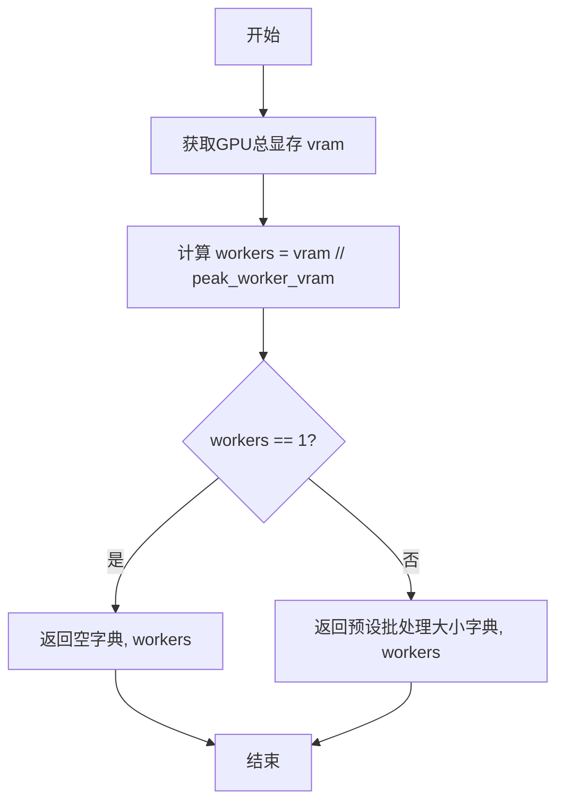

# `marker\marker\utils\batch.py` 详细设计文档

该代码是一个用于根据GPU显存大小动态计算批处理大小和worker数量的工具函数，通过将GPU总显存除以单个worker所需的峰值显存来估算可并行运行的worker数量，并根据worker数量返回相应的批处理配置字典。

## 整体流程

```mermaid
graph TD
    A[开始] --> B[获取GPU总显存]
    B --> C[计算worker数量: workers = vram // peak_worker_vram]
    C --> D{workers == 1?}
    D -- 是 --> E[返回空字典{}, workers]
    D -- 否 --> F[返回批处理配置字典, workers]
    E --> G[结束]
    F --> G
```

## 类结构

```
该文件为模块文件，无类定义
仅包含一个全局函数 get_batch_sizes_worker_counts
依赖外部模块: marker.utils.gpu.GPUManager
```

## 全局变量及字段


### `gpu_manager`
    
GPU管理器实例，用于获取GPU相关信息和资源

类型：`GPUManager`
    


### `peak_worker_vram`
    
每个worker进程所需的峰值GPU显存大小（字节）

类型：`int`
    


### `vram`
    
当前GPU的总可用显存大小（字节）

类型：`int`
    


### `workers`
    
根据显存计算出的可并行运行的worker数量

类型：`int`
    


### `layout_batch_size`
    
布局分析批处理大小

类型：`int`
    


### `detection_batch_size`
    
目标检测批处理大小

类型：`int`
    


### `table_rec_batch_size`
    
表格识别批处理大小

类型：`int`
    


### `ocr_error_batch_size`
    
OCR错误处理批处理大小

类型：`int`
    


### `recognition_batch_size`
    
文字识别批处理大小

类型：`int`
    


### `equation_batch_size`
    
公式识别批处理大小

类型：`int`
    


### `detector_postprocessing_cpu_workers`
    
检测器后处理CPU工作线程数

类型：`int`
    


    

## 全局函数及方法


### `get_batch_sizes_worker_counts`

该函数根据GPU的显存大小和每个worker预估需要的显存，计算可用的worker数量，并返回针对不同任务阶段的推荐批处理大小配置字典。

参数：

- `gpu_manager`：`GPUManager`，用于获取GPU显存信息的GPU管理器实例
- `peak_worker_vram`：`int`，每个worker在处理任务时预估需要的显存大小（字节）

返回值：`tuple[dict[str, int], int]`，返回一个元组，包含批处理大小配置的字典和计算出的worker数量。当worker数量为1时返回空字典，否则返回预设的各阶段批处理大小。

#### 流程图



#### 带注释源码

```python
from marker.utils.gpu import GPUManager


def get_batch_sizes_worker_counts(gpu_manager: GPUManager, peak_worker_vram: int):
    """
    根据GPU显存和单worker预估显存计算worker数量及批处理配置
    
    参数:
        gpu_manager: GPUManager - GPU管理器实例，用于获取GPU显存信息
        peak_worker_vram: int - 每个worker预估需要的显存大小
    
    返回:
        tuple[dict[str, int], int]: 
            - 第一个元素: 批处理大小配置字典，包含各任务阶段的batch_size配置
            - 第二个元素: 计算出的可用worker数量
    """
    # 获取GPU总显存大小
    vram = gpu_manager.get_gpu_vram()

    # 计算可并行运行的worker数量，确保至少为1
    workers = max(1, vram // peak_worker_vram)
    
    # 如果只有一个worker，返回空配置（使用默认配置）
    if workers == 1:
        return {}, workers

    # 返回预设的各阶段批处理大小配置
    return {
        "layout_batch_size": 12,           # 布局分析批处理大小
        "detection_batch_size": 8,         # 目标检测批处理大小
        "table_rec_batch_size": 12,        # 表格识别批处理大小
        "ocr_error_batch_size": 12,        # OCR纠错批处理大小
        "recognition_batch_size": 64,      # 识别模型批处理大小
        "equation_batch_size": 16,         # 公式识别批处理大小
        "detector_postprocessing_cpu_workers": 2,  # 检测后处理CPU工作线程数
    }, workers
```

## 关键组件


### GPU显存管理

通过 GPUManager 获取 GPU 显存信息，用于计算可用的计算资源

### 批量大小与Worker计算逻辑

根据 GPU 显存和每个 worker 需要的峰值显存计算 worker 数量，并为不同处理阶段（布局、检测、表格识别、OCR、识别、公式等）返回对应的批量大小配置

### 资源分配策略

采用固定批量大小配置策略，根据 worker 数量决定是否返回配置（当 workers > 1 时才返回具体批量大小，否则返回空字典）


## 问题及建议


### 已知问题

-   **除零错误风险**：当 `peak_worker_vram` 为 0 时会导致除零异常
-   **硬编码的批处理大小**：所有 batch size 值被硬编码在函数内部，缺乏灵活性和可配置性
-   **魔法数字**：12、8、64 等数值缺乏说明，难以理解和维护
- **缺少类型注解**：函数缺少返回类型注解（-> Tuple[dict, int]）
- **无输入验证**：未对 `peak_worker_vram` 的有效性进行校验（应大于0）
- **返回空字典的边界情况**：当 workers == 1 时返回空字典，可能导致调用方需做额外空值处理
- **缺乏文档注释**：函数缺少 docstring 说明其用途和参数含义

### 优化建议

-   使用 `if peak_worker_vram <= 0: raise ValueError(...)` 添加参数校验
-   将 batch size 配置提取为函数参数或外部配置常量，并附带默认值
-   添加完整的函数 docstring，说明各参数和返回值的含义
-   为函数添加明确的返回类型注解：`-> Tuple[Dict[str, int], int]`
-   考虑当 workers == 1 时返回默认批处理大小而非空字典，以减少调用方复杂性


## 其它


### 设计目标与约束

1. **核心目标**：根据GPU显存资源动态计算最优的批处理大小和worker数量，以最大化GPU利用率和并行处理能力。
2. **约束条件**：
   - 显存单位假设为字节或MB，需与GPUManager保持一致
   - 最小worker数量为1
   - 批处理大小为硬编码的经验值，适用于大多数场景

### 错误处理与异常设计

1. **GPUManager为空或未初始化**：传入None时会在调用`get_gpu_vram()`时抛出AttributeError，建议在调用前进行None检查
2. **显存计算为零或负数**：当`peak_worker_vram`为0时会导致除零错误，需在函数入口处增加参数校验
3. **返回值类型一致性**：始终返回tuple(字典或空字典, int)，调用方需解包处理

### 数据流与状态机

1. **输入数据流**：
   - `gpu_manager`: GPUManager对象实例
   - `peak_worker_vram`: int，每个worker预期的显存占用
2. **处理流程**：
   - 获取GPU总显存 → 计算可容纳的worker数量 → 判断是否需要分配资源 → 返回批处理配置
3. **状态**：
   - workers=1时返回空配置（单worker模式）
   - workers>1时返回完整批处理配置

### 外部依赖与接口契约

1. **GPUManager依赖**：
   - 需实现`get_gpu_vram()`方法，返回整型显存值
   - 假设返回值为字节或MB，需与调用方约定单位
2. **返回值契约**：
   - 返回类型：Tuple[Dict[str, int], int]
   - 第一个元素：批处理大小配置字典，键名为字符串，值为int
   - 第二个元素：计算出的worker数量

### 性能考虑

1. **计算复杂度**：O(1)，仅一次除法运算
2. **内存开销**：返回的字典在workers>1时包含7个键值对，约数百字节
3. **硬编码问题**：批处理大小为固定值，未根据具体GPU型号动态调整

### 扩展性建议

1. **配置外部化**：将硬编码的批处理大小移至配置文件或数据库
2. **多GPU支持**：当前仅支持单GPU，可扩展为GPU列表和worker映射
3. **自适应策略**：可根据历史执行数据动态调整批处理大小


    