# `marker\marker\utils\gpu.py` 详细设计文档

GPUManager是一个GPU设备管理和CUDA MPS（Multi-Process Service）服务器控制类，提供GPU显存查询、MPS服务器启动/停止、设备清理等核心功能，支持上下文管理器协议以确保资源正确释放。

## 整体流程

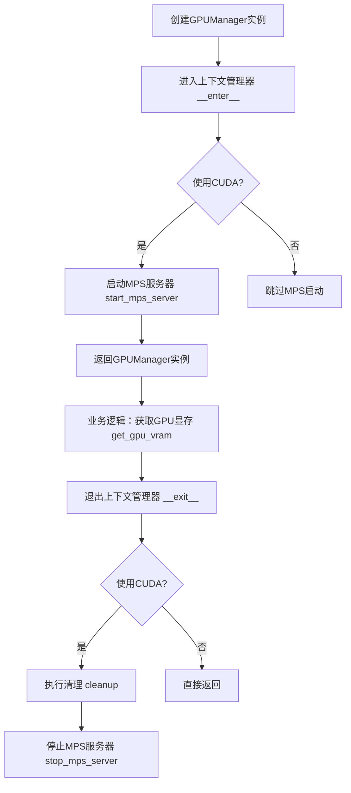

## 类结构

```
GPUManager (GPU设备与MPS服务器管理器)
```

## 全局变量及字段


### `logger`
    
日志记录器实例，用于记录GPU管理过程中的信息、警告和错误

类型：`logging.Logger`
    


### `settings`
    
全局配置对象，包含应用配置信息如TORCH_DEVICE_MODEL等

类型：`Settings`
    


### `GPUManager.default_gpu_vram`
    
默认GPU显存大小（GB），当无法获取实际显存时使用

类型：`int`
    


### `GPUManager.device_idx`
    
GPU设备索引，指定要管理的GPU设备编号

类型：`int`
    


### `GPUManager.original_compute_mode`
    
保存原始计算模式，用于cleanup时恢复（当前未使用）

类型：`Any`
    


### `GPUManager.mps_server_process`
    
MPS服务器进程对象，用于管理进程生命周期

类型：`subprocess.Popen`
    
    

## 全局函数及方法


### `os.environ.copy()`

该函数是 Python 标准库 `os` 模块中的方法，用于创建当前环境变量的浅拷贝，返回一个字典对象。在 `GPUManager` 类中用于获取当前进程的环境变量副本，以便在启动 NVIDIA MPS 服务器时设置特定的环境变量（如 `CUDA_MPS_PIPE_DIRECTORY` 和 `CUDA_MPS_LOG_DIRECTORY`），同时保持其他环境变量不变。

参数：该函数无任何参数

返回值：`dict`，返回一个新的字典对象，包含当前进程的所有环境变量及其值的副本。对返回字典的修改不会影响原始的 `os.environ`。

#### 流程图

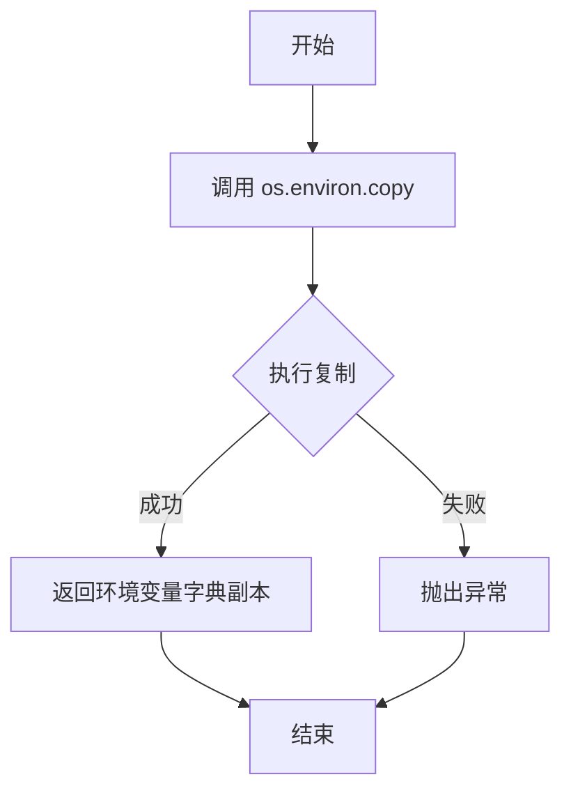

#### 带注释源码

```python
# os.environ.copy() 的实现位于 Python 标准库的 os 模块中
# 以下是其使用场景的注释说明

# 场景1: 在 start_mps_server 方法中用于启动 MPS 服务器前准备环境变量
def start_mps_server(self) -> bool:
    if not self.check_cuda_available():
        return False

    try:
        # 复制当前环境变量字典
        env = os.environ.copy()
        
        # 设置 MPS 特定的目录环境变量
        pipe_dir = f"/tmp/nvidia-mps-{self.device_idx}"
        log_dir = f"/tmp/nvidia-log-{self.device_idx}"
        env["CUDA_MPS_PIPE_DIRECTORY"] = pipe_dir
        env["CUDA_MPS_LOG_DIRECTORY"] = log_dir

        # 创建必要的目录
        os.makedirs(pipe_dir, exist_ok=True)
        os.makedirs(log_dir, exist_ok=True)

        # 启动 MPS 控制守护进程，传入修改后的环境变量
        self.mps_server_process = subprocess.Popen(
            ["nvidia-cuda-mps-control", "-d"],
            env=env,  # 使用复制并修改后的环境变量
            stdout=subprocess.PIPE,
            stderr=subprocess.PIPE,
        )

        logger.info(f"Started NVIDIA MPS server for chunk {self.device_idx}")
        return True
    except (subprocess.CalledProcessError, FileNotFoundError) as e:
        logger.warning(
            f"Failed to start MPS server for chunk {self.device_idx}: {e}"
        )
        return False


# 场景2: 在 stop_mps_server 方法中用于停止 MPS 服务器时设置环境变量
def stop_mps_server(self) -> None:
    try:
        # 复制当前环境变量字典
        env = os.environ.copy()
        
        # 设置 MPS 特定的目录环境变量
        env["CUDA_MPS_PIPE_DIRECTORY"] = f"/tmp/nvidia-mps-{self.device_idx}"
        env["CUDA_MPS_LOG_DIRECTORY"] = f"/tmp/nvidia-log-{self.device_idx}"

        # 通过 nvidia-cuda-mps-control 发送 quit 命令
        subprocess.run(
            ["nvidia-cuda-mps-control"],
            input="quit\n",
            text=True,
            env=env,  # 使用复制并修改后的环境变量
            timeout=10,
        )

        if self.mps_server_process:
            self.mps_server_process.terminate()
            try:
                self.mps_server_process.wait(timeout=5)
            except subprocess.TimeoutExpired:
                self.mps_server_process.kill()
            self.mps_server_process = None

        logger.info(f"Stopped NVIDIA MPS server for chunk {self.device_idx}")
    except Exception as e:
        logger.warning(
            f"Failed to stop MPS server for chunk {self.device_idx}: {e}"
        )
```


### `GPUManager.check_cuda_available` 中的 `subprocess.run()`

该函数用于检查CUDA/NVIDIA驱动是否可用，通过执行`nvidia-smi --version`命令验证GPU环境是否正确配置。

参数：

- `args`：`List[str]`，要执行的命令列表，如`["nvidia-smi", "--version"]`
- `capture_output`：`bool`，是否捕获子进程的stdout和stderr，设置为`True`
- `check`：`bool`，是否在返回码非零时抛出异常，设置为`True`

返回值：`subprocess.CompletedProcess`，包含返回码、stdout和stderr信息的对象

#### 流程图

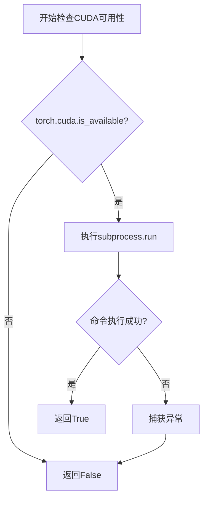

#### 带注释源码

```python
def check_cuda_available(self) -> bool:
    # 首先检查PyTorch是否能识别CUDA
    if not torch.cuda.is_available():
        return False
    try:
        # 执行nvidia-smi命令验证NVIDIA驱动是否安装
        # capture_output=True: 捕获标准输出和错误输出
        # check=True: 如果返回码非零则抛出CalledProcessError异常
        subprocess.run(
            ["nvidia-smi", "--version"],  # 查询NVIDIA驱动版本
            capture_output=True,          # 捕获输出但不显示
            check=True                    # 检查返回码
        )
        return True
    except (subprocess.CalledProcessError, FileNotFoundError):
        # CalledProcessError: nvidia-smi执行失败
        # FileNotFoundError: nvidia-smi命令不存在
        return False
```

---

### `GPUManager.get_gpu_vram` 中的 `subprocess.run()`

该函数用于获取指定GPU的显存大小，通过执行`nvidia-smi`命令查询GPU内存信息。

参数：

- `args`：`List[str]`，要执行的命令列表，包含查询参数和设备索引
- `capture_output`：`bool`，是否捕获子进程的stdout和stderr
- `text`：`bool`，是否将输出解析为文本
- `check`：`bool`，是否在返回码非零时抛出异常

返回值：`subprocess.CompletedProcess`，包含命令执行结果

#### 流程图

```mermaid
graph TD
    A[开始获取GPU显存] --> B{using_cuda?}
    B -->|否| C[返回默认值8GB]
    B -->|是| D[执行subprocess.run查询GPU内存]
    D --> E{命令执行成功?}
    E -->|是| F[解析输出: vram_mb/1024]
    E -->|否| C
    F --> G[返回显存大小(GB)]
```

#### 带注释源码

```python
def get_gpu_vram(self):
    # 如果不使用CUDA，返回默认显存大小
    if not self.using_cuda():
        return self.default_gpu_vram

    try:
        # 执行nvidia-smi查询指定GPU的显存总量
        # --query-gpu=memory.total: 查询GPU内存总量
        # --format=csv,noheader,nounits: 输出格式为CSV,无表头,单位为MB
        # -i: 指定GPU设备索引
        result = subprocess.run(
            [
                "nvidia-smi",
                "--query-gpu=memory.total",
                "--format=csv,noheader,nounits",
                "-i",
                str(self.device_idx),
            ],
            capture_output=True,  # 捕获输出
            text=True,            # 输出为字符串
            check=True            # 检查返回码
        )

        # 解析输出：nvidia-smi返回MB单位
        vram_mb = int(result.stdout.strip())
        vram_gb = int(vram_mb / 1024)  # 转换为GB
        return vram_gb

    except (subprocess.CalledProcessError, ValueError, FileNotFoundError):
        # CalledProcessError: nvidia-smi执行失败
        # ValueError: 输出无法转换为整数
        # FileNotFoundError: nvidia-smi不存在
        return self.default_gpu_vram
```

---

### `GPUManager.stop_mps_server` 中的 `subprocess.run()`

该函数用于停止NVIDIA MPS（Multi-Process Service）服务器，通过向`nvidia-cuda-mps-control`发送quit命令。

参数：

- `args`：`List[str]`，要执行的命令列表`["nvidia-cuda-mps-control"]`
- `input`：`str`，要发送给进程的输入字符串`"quit\n"`
- `text`：`bool`，是否将输入输出解析为文本
- `env`：`dict`，环境变量字典，包含MPS目录配置
- `timeout`：`int`，命令超时时间（秒），设置为10

返回值：`subprocess.CompletedProcess`，包含命令执行结果

#### 流程图

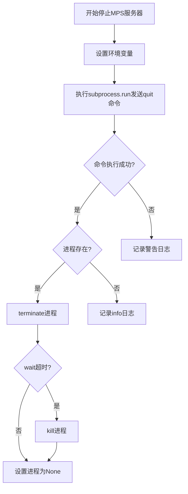

#### 带注释源码

```python
def stop_mps_server(self) -> None:
    try:
        # 设置MPS控制的环境变量
        env = os.environ.copy()
        env["CUDA_MPS_PIPE_DIRECTORY"] = f"/tmp/nvidia-mps-{self.device_idx}"
        env["CUDA_MPS_LOG_DIRECTORY"] = f"/tmp/nvidia-log-{self.device_idx}"

        # 向nvidia-cuda-mps-control发送quit命令停止MPS服务
        # input: 通过stdin发送quit命令
        # text: 输入输出使用文本模式
        # env: 传递MPS相关环境变量
        # timeout: 10秒超时
        subprocess.run(
            ["nvidia-cuda-mps-control"],
            input="quit\n",        # 发送退出命令
            text=True,             # 文本模式
            env=env,               # 环境变量
            timeout=10,            # 超时时间
        )

        # 如果MPS服务器进程存在，优雅地终止它
        if self.mps_server_process:
            self.mps_server_process.terminate()  # 发送SIGTERM
            try:
                # 等待进程退出，最多5秒
                self.mps_server_process.wait(timeout=5)
            except subprocess.TimeoutExpired:
                # 超时则强制杀死进程
                self.mps_server_process.kill()
            self.mps_server_process = None

        logger.info(f"Stopped NVIDIA MPS server for chunk {self.device_idx}")
    except Exception as e:
        logger.warning(
            f"Failed to stop MPS server for chunk {self.device_idx}: {e}"
        )
```


### `subprocess.Popen`

异步启动 NVIDIA MPS 控制守护进程，用于管理 CUDA Multi-Process Service (MPS)。

参数：

- `args`：`list[str]`，要执行的命令列表，值为 `["nvidia-cuda-mps-control", "-d"]`
- `env`：`dict`，环境变量字典，包含 `CUDA_MPS_PIPE_DIRECTORY` 和 `CUDA_MPS_LOG_DIRECTORY`
- `stdout`：`int`，标准输出管道，值为 `subprocess.PIPE`
- `stderr`：`int`，标准错误管道，值为 `subprocess.PIPE`

返回值：`subprocess.Popen`，返回启动的子进程对象，可用于后续对进程的管理（如终止、等待）

#### 流程图

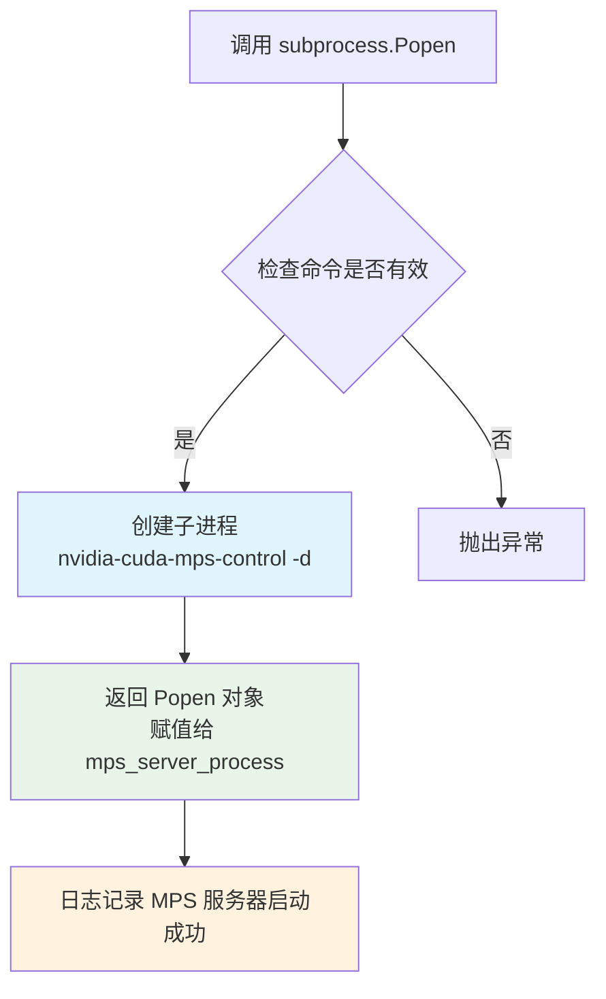

#### 带注释源码

```python
# 启动 MPS 控制守护进程
# args: 要执行的命令列表 ["nvidia-cuda-mps-control", "-d"]
# env: 环境变量，设置 CUDA_MPS_PIPE_DIRECTORY 和 CUDA_MPS_LOG_DIRECTORY
# stdout=subprocess.PIPE: 捕获标准输出到管道
# stderr=subprocess.PIPE: 捕获标准错误到管道
self.mps_server_process = subprocess.Popen(
    ["nvidia-cuda-mps-control", "-d"],  # MPS 控制守护进程命令
    env=env,                             # 环境变量（包含 MPS 目录配置）
    stdout=subprocess.PIPE,              # 捕获 stdout 用于后续处理
    stderr=subprocess.PIPE,              # 捕获 stderr 用于后续处理
)
```


### `os.makedirs()` - 创建目录

该函数是 Python 标准库函数，在本代码中用于在启动 NVIDIA MPS 服务器前创建必要的目录结构（管道目录和日志目录），确保 MPS 服务正常运行。

参数：

- `path`：`str`，要创建的目录路径，在代码中为 `pipe_dir`（`/tmp/nvidia-mps-{device_idx}`）或 `log_dir`（`/tmp/nvidia-log-{device_idx}`）
- `mode`：`int`，权限模式，默认为 `0o777`
- `exist_ok`：`bool`，如果目录已存在是否报错，传入 `True` 表示目录存在时不报错

返回值：`None`，无返回值

#### 流程图

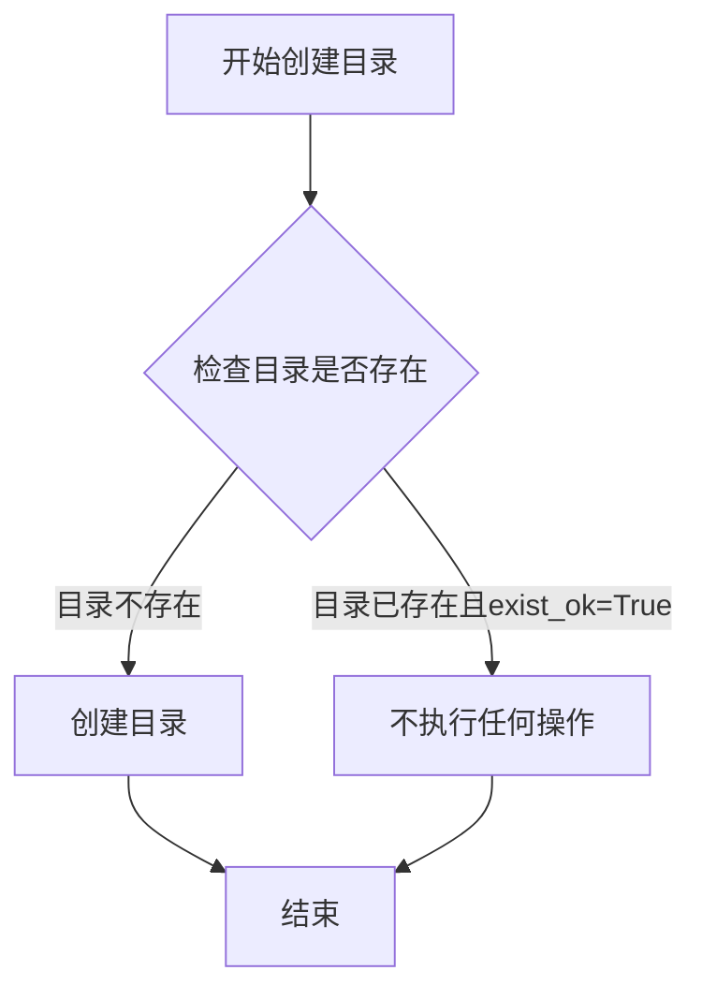

#### 带注释源码

```python
def start_mps_server(self) -> bool:
    if not self.check_cuda_available():
        return False

    try:
        # Set MPS environment with chunk-specific directories
        env = os.environ.copy()
        pipe_dir = f"/tmp/nvidia-mps-{self.device_idx}"
        log_dir = f"/tmp/nvidia-log-{self.device_idx}"
        env["CUDA_MPS_PIPE_DIRECTORY"] = pipe_dir
        env["CUDA_MPS_LOG_DIRECTORY"] = log_dir

        # Create directories
        # 创建 NVIDIA MPS 管道目录，如果存在则不报错
        os.makedirs(pipe_dir, exist_ok=True)
        # 创建 NVIDIA MPS 日志目录，如果存在则不报错
        os.makedirs(log_dir, exist_ok=True)

        # Start MPS control daemon
        self.mps_server_process = subprocess.Popen(
            ["nvidia-cuda-mps-control", "-d"],
            env=env,
            stdout=subprocess.PIPE,
            stderr=subprocess.PIPE,
        )

        logger.info(f"Started NVIDIA MPS server for chunk {self.device_idx}")
        return True
    except (subprocess.CalledProcessError, FileNotFoundError) as e:
        logger.warning(
            f"Failed to start MPS server for chunk {self.device_idx}: {e}"
        )
        return False
```


### `torch.cuda.is_available()`

该函数是 PyTorch 库提供的内置函数，用于检查当前系统上 CUDA（NVIDIA GPU 计算平台）是否可用。它通过探测 CUDA 驱动和运行时库来判断是否可以进行 GPU 加速计算。

参数：此函数无参数。

返回值：`bool`，如果 CUDA 可用返回 `True`，否则返回 `False`。

#### 流程图

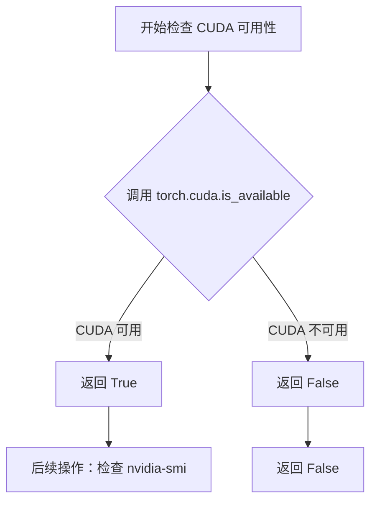

#### 带注释源码

```python
# torch.cuda.is_available() 是 PyTorch 库的内置函数
# 源码位于 PyTorch 包的 cuda 模块中
# 核心逻辑大致如下（简化版）：

def is_available():
    """
    检查 CUDA 是否可用。
    
    内部实现会检查：
    1. CUDA 驱动是否已加载
    2. CUDA 运行时库是否可访问
    3. 是否有可用的 GPU 设备
    
    Returns:
        bool: CUDA 可用返回 True，否则返回 False
    """
    # PyTorch 内部通过 ctypes 调用 CUDA 库
    # 或通过检查环境变量和系统路径来判断
    return _cuda_base.is_available()
```

#### 在项目中的实际调用

在 `GPUManager.check_cuda_available()` 方法中的实际使用：

```python
def check_cuda_available(self) -> bool:
    # 调用 torch.cuda.is_available() 检查 CUDA 是否可用
    if not torch.cuda.is_available():
        return False
    try:
        # 进一步验证 nvidia-smi 命令是否可用
        subprocess.run(["nvidia-smi", "--version"], capture_output=True, check=True)
        return True
    except (subprocess.CalledProcessError, FileNotFoundError):
        return False
```


### `GPUManager.__init__`

初始化 GPUManager 实例，设置设备索引并初始化进程对象，用于管理 GPU 设备和 MPS（Multi-Process Service）服务器。

参数：

- `device_idx`：`int`，GPU设备索引，用于指定要管理的 GPU 设备

返回值：`None`，无返回值，仅进行实例属性的初始化

#### 流程图

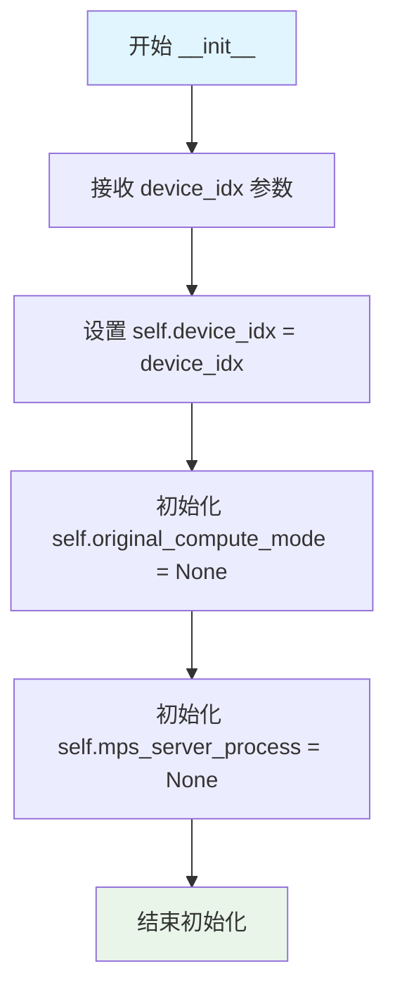

#### 带注释源码

```python
def __init__(self, device_idx: int):
    """
    初始化 GPUManager 实例
    
    参数:
        device_idx: GPU设备索引，用于指定要管理的GPU设备
    """
    # 设置实例的设备索引，用于后续操作指定具体的GPU
    self.device_idx = device_idx
    
    # 保存原始计算模式，用于在上下文管理器退出时恢复
    # 初始化为 None，表示尚未设置或保存任何计算模式
    self.original_compute_mode = None
    
    # MPS服务器进程对象，用于管理NVIDIA MPS守护进程的生命周期
    # 初始化为 None，表示MPS服务器尚未启动
    self.mps_server_process = None
```


### `GPUManager.__enter__`

上下文管理器入口方法，在进入 `with` 代码块时自动调用，用于检测是否使用 CUDA 并在需要时启动 MPS（Multi-Process Service）服务器，最后返回实例本身以供上下文使用。

参数：

- 此方法无显式参数（隐式参数 `self` 为 GPUManager 实例）

返回值：`GPUManager`，返回当前 GPUManager 实例本身，使调用者可以在 `with` 块内访问该实例

#### 流程图

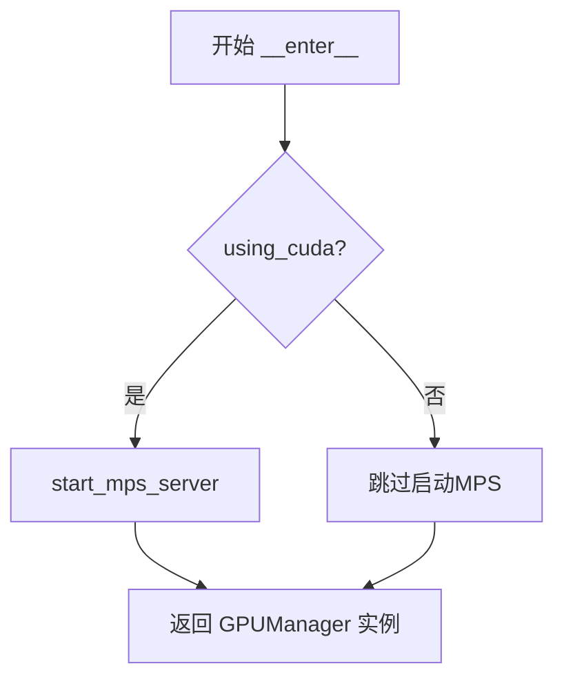

#### 带注释源码

```python
def __enter__(self):
    """
    上下文管理器入口方法。
    在进入 with 语句时自动调用。
    
    功能：
    1. 检查当前是否使用 CUDA 设备
    2. 如果使用 CUDA，则启动 MPS 服务器
    3. 返回实例本身供 with 块使用
    
    Returns:
        GPUManager: 返回当前实例，以便在 with 块中访问
    """
    # 检查是否使用 CUDA 设备（通过 settings.TORCH_DEVICE_MODEL 判断）
    if self.using_cuda():
        # 启动 NVIDIA MPS (Multi-Process Service) 服务器
        # MPS 允许在单个 GPU 上运行多个计算进程
        self.start_mps_server()
    
    # 返回自身，使调用者可以通过 as 关键字获取实例
    # 例如: with GPUManager(0) as gm:
    return self
```


### `GPUManager.__exit__`

上下文管理器退出方法，在退出 with 代码块时自动调用，负责清理 MPS 服务器资源。

参数：

- `exc_type`：`Type`，异常类型，表示在 with 语句块中发生的异常类型（如果有），若正常退出则为 None
- `exc_val`：`BaseException`，异常值，表示在 with 语句块中发生的异常实例（如果有），若正常退出则为 None
- `exc_tb`：`traceback`，异常回溯，表示在 with 语句块中发生的异常堆栈跟踪信息（如果有），若正常退出则为 None

返回值：`None`，无返回值，仅执行清理操作

#### 流程图

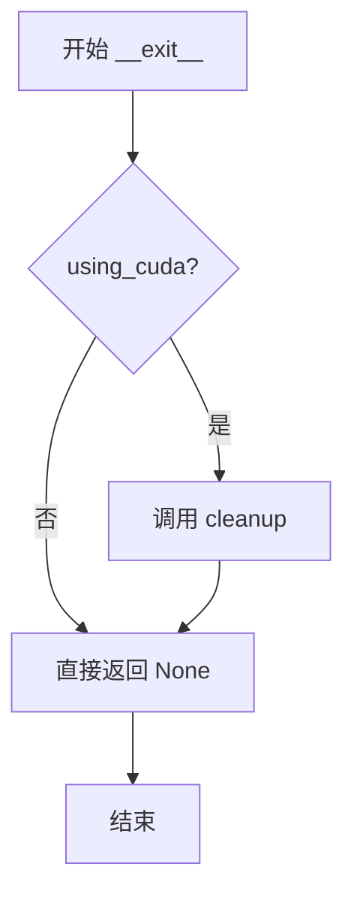

#### 带注释源码

```python
def __exit__(self, exc_type, exc_val, exc_tb):
    """
    上下文管理器退出方法，在离开 with 语句时自动调用
    用于清理 MPS (Multi-Process Service) 服务器资源
    
    参数:
        exc_type: 异常类型对象，如果正常退出则为 None
        exc_val: 异常实例值，如果正常退出则为 None
        exc_tb: 异常堆栈跟踪对象，如果正常退出则为 None
    
    返回值:
        None: 不处理异常，异常会继续向上传播
    """
    # 检查当前是否使用 CUDA 设备
    if self.using_cuda():
        # 如果使用 CUDA，调用 cleanup 方法清理 MPS 服务器
        # cleanup 会停止 nvidia-cda-mps-control 守护进程并清理相关资源
        self.cleanup()
```


### `GPUManager.using_cuda`

静态方法，判断当前是否使用CUDA设备。该方法通过检查配置中的设备模型字符串是否包含"cuda"来判断当前是否使用CUDA计算设备。

参数：
- 无

返回值：`bool`，返回True表示当前使用CUDA设备，返回False表示不使用CUDA设备

#### 流程图

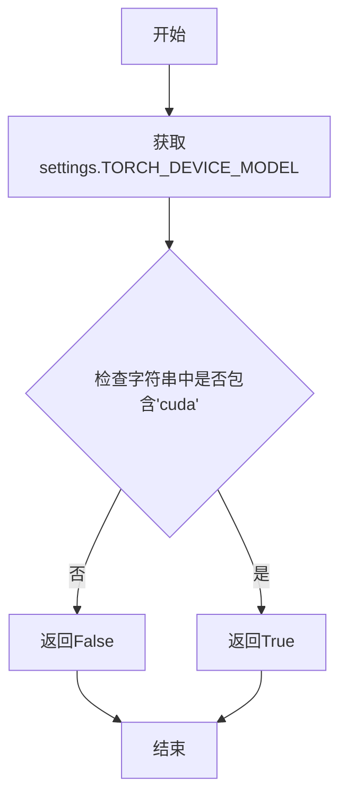

#### 带注释源码

```python
@staticmethod
def using_cuda():
    """
    静态方法，判断当前是否使用CUDA设备。
    
    该方法通过检查 settings.TORCH_DEVICE_MODEL 配置中是否包含 'cuda' 字符串
    来判断当前是否配置为使用 CUDA 设备。
    
    Returns:
        bool: 如果设备模型中包含 'cuda' 则返回 True，否则返回 False
    """
    # 从设置中获取设备型号字符串，检查是否包含 'cuda' 关键字
    return "cuda" in settings.TORCH_DEVICE_MODEL
```


### `GPUManager.check_cuda_available`

检查CUDA和nvidia-smi是否可用。该方法首先检查PyTorch的CUDA支持，然后验证nvidia-smi命令行工具是否可用。

参数： 无

返回值：`bool`，如果CUDA可用且nvidia-smi命令执行成功返回True，否则返回False

#### 流程图

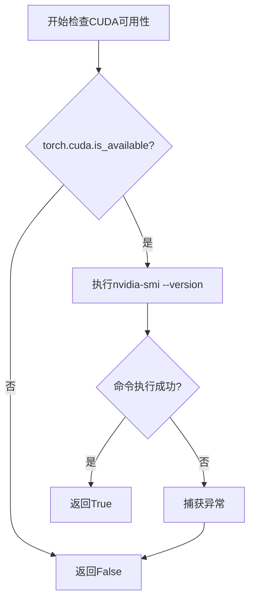

#### 带注释源码

```python
def check_cuda_available(self) -> bool:
    """
    检查CUDA和nvidia-smi是否可用
    
    Returns:
        bool: 如果CUDA可用且nvidia-smi命令执行成功返回True，否则返回False
    """
    # 第一步：检查PyTorch是否支持CUDA
    if not torch.cuda.is_available():
        # PyTorch未编译CUDA支持，直接返回False
        return False
    
    try:
        # 第二步：验证nvidia-smi命令行工具是否可用
        # 使用capture_output=True捕获输出，check=True在命令失败时抛出异常
        subprocess.run(
            ["nvidia-smi", "--version"],  # 查询NVIDIA驱动版本
            capture_output=True,          # 捕获标准输出和错误输出
            check=True                    # 检查返回码，非零则抛异常
        )
        # nvidia-smi命令执行成功，说明CUDA环境完整可用
        return True
    except (subprocess.CalledProcessError, FileNotFoundError):
        # 捕获两种异常：
        # - CalledProcessError: nvidia-smi执行失败（无驱动或权限问题）
        # - FileNotFoundError: nvidia-smi命令不存在（未安装驱动）
        return False
```


### `GPUManager.get_gpu_vram`

获取指定GPU的显存大小（GB），如果无法获取则返回默认值。

参数：

- 该方法无显式参数（仅包含隐式参数 `self`）

返回值：`int`，返回GPU显存大小（单位：GB），如果无法获取则返回默认值 `default_gpu_vram`（默认8GB）

#### 流程图

```mermaid
flowchart TD
    A[开始] --> B{self.using_cuda()}
    B -->|是| C[执行 nvidia-smi 命令]
    B -->|否| D[返回 default_gpu_vram: 8]
    C --> E{命令执行成功?}
    E -->|是| F[解析 stdout 获取显存 MB]
    E -->|否| G[捕获异常]
    F --> H[vram_gb = vram_mb / 1024]
    G --> D
    H --> I[返回 vram_gb]
    D --> J[结束]
    I --> J
```

#### 带注释源码

```python
def get_gpu_vram(self):
    """
    获取指定GPU的显存大小（GB）
    
    Returns:
        int: GPU显存大小（GB），无法获取时返回默认值
    """
    # 检查当前是否使用CUDA，若不是则直接返回默认显存大小
    if not self.using_cuda():
        return self.default_gpu_vram

    try:
        # 使用 nvidia-smi 查询指定GPU的显存总量
        result = subprocess.run(
            [
                "nvidia-smi",                          # NVIDIA系统管理接口命令
                "--query-gpu=memory.total",           # 查询GPU显存总量
                "--format=csv,noheader,nounits",      # 输出格式：CSV，无表头，单位为数字
                "-i",                                  # 指定GPU设备索引
                str(self.device_idx),                 # GPU设备索引转换为字符串
            ],
            capture_output=True,                       # 捕获标准输出和错误
            text=True,                                 # 输出解码为文本
            check=True,                                # 非零返回码则抛出异常
        )

        # 解析命令输出，获取显存大小（MB）
        vram_mb = int(result.stdout.strip())
        # 将MB转换为GB（整数除法）
        vram_gb = int(vram_mb / 1024)
        # 返回GPU显存大小（GB）
        return vram_gb

    # 捕获可能发生的异常：命令执行失败、数值转换错误、nvidia-smi未找到
    except (subprocess.CalledProcessError, ValueError, FileNotFoundError):
        # 发生异常时返回默认显存大小
        return self.default_gpu_vram
```


### `GPUManager.start_mps_server`

启动NVIDIA MPS服务器，设置环境变量并创建守护进程。

参数：

- 无

返回值：`bool`，是否成功启动MPS服务器

#### 流程图

```mermaid
flowchart TD
    A[开始] --> B{check_cuda_available?}
    B -->|否| C[返回 False]
    B -->|是| D[设置环境变量: CUDA_MPS_PIPE_DIRECTORY, CUDA_MPS_LOG_DIRECTORY]
    D --> E[创建目录: /tmp/nvidia-mps-{device_idx}, /tmp/nvidia-log-{device_idx}]
    E --> F[启动nvidia-cuda-mps-control守护进程]
    F --> G[记录日志: 启动成功]
    G --> H[返回 True]
    C --> I[结束]
    H --> I
    
    F --> J{异常?}
    J -->|是| K[捕获异常: CalledProcessError/FileNotFoundError]
    K --> L[记录警告日志: 启动失败]
    L --> M[返回 False]
    M --> I
```

#### 带注释源码

```python
def start_mps_server(self) -> bool:
    """
    启动NVIDIA MPS服务器，设置环境变量并创建守护进程
    
    Returns:
        bool: 是否成功启动MPS服务器
    """
    # 首先检查CUDA是否可用
    if not self.check_cuda_available():
        return False

    try:
        # 设置MPS环境变量，使用设备特定的目录
        env = os.environ.copy()
        pipe_dir = f"/tmp/nvidia-mps-{self.device_idx}"
        log_dir = f"/tmp/nvidia-log-{self.device_idx}"
        # 设置CUDA MPS管道目录环境变量
        env["CUDA_MPS_PIPE_DIRECTORY"] = pipe_dir
        # 设置CUDA MPS日志目录环境变量
        env["CUDA_MPS_LOG_DIRECTORY"] = log_dir

        # 创建MPS所需的目录
        os.makedirs(pipe_dir, exist_ok=True)
        os.makedirs(log_dir, exist_ok=True)

        # 启动MPS控制守护进程
        # -d 参数表示以守护进程模式运行
        self.mps_server_process = subprocess.Popen(
            ["nvidia-cuda-mps-control", "-d"],
            env=env,
            stdout=subprocess.PIPE,
            stderr=subprocess.PIPE,
        )

        logger.info(f"Started NVIDIA MPS server for chunk {self.device_idx}")
        return True
    except (subprocess.CalledProcessError, FileNotFoundError) as e:
        # 捕获启动失败的异常
        logger.warning(
            f"Failed to start MPS server for chunk {self.device_idx}: {e}"
        )
        return False
```


### `GPUManager.stop_mps_server`

停止MPS服务器，发送quit命令并终止进程

参数：

- 该函数无参数

返回值：`None`，无返回值描述

#### 流程图

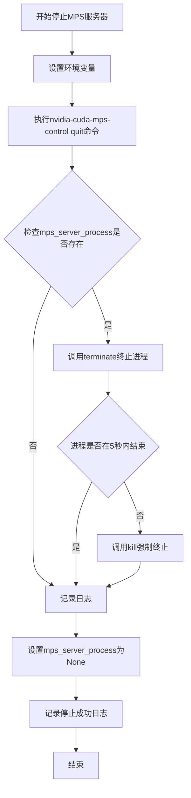

#### 带注释源码

```python
def stop_mps_server(self) -> None:
    """
    停止MPS服务器，发送quit命令并终止进程
    
    该方法执行以下操作：
    1. 设置CUDA_MPS环境变量
    2. 通过nvidia-cuda-mps-control发送quit命令
    3. 终止MPS服务器进程
    """
    try:
        # 停止MPS服务器 - 准备环境变量
        # 设置CUDA_MPS_PIPE_DIRECTORY和CUDA_MPS_LOG_DIRECTORY环境变量
        # 用于与特定GPU设备的MPS服务器通信
        env = os.environ.copy()
        env["CUDA_MPS_PIPE_DIRECTORY"] = f"/tmp/nvidia-mps-{self.device_idx}"
        env["CUDA_MPS_LOG_DIRECTORY"] = f"/tmp/nvidia-log-{self.device_idx}"

        # 通过nvidia-cuda-mps-control发送quit命令优雅地停止MPS控制守护进程
        # timeout=10秒等待命令执行完成
        subprocess.run(
            ["nvidia-cuda-mps-control"],
            input="quit\n",  # 发送quit命令 + 换行符
            text=True,
            env=env,
            timeout=10,
        )

        # 检查MPS服务器进程是否存在，如果存在则终止它
        if self.mps_server_process:
            # 请求终止进程（发送SIGTERM信号）
            self.mps_server_process.terminate()
            try:
                # 等待进程在5秒内正常退出
                self.mps_server_process.wait(timeout=5)
            except subprocess.TimeoutExpired:
                # 如果进程在5秒内未退出，强制杀死进程
                self.mps_server_process.kill()
            # 清空进程引用
            self.mps_server_process = None

        # 记录MPS服务器已成功停止的信息
        logger.info(f"Stopped NVIDIA MPS server for chunk {self.device_idx}")
    except Exception as e:
        # 捕获所有异常并记录警告日志，但不抛出异常以确保资源清理
        logger.warning(
            f"Failed to stop MPS server for chunk {self.device_idx}: {e}"
        )
```


### `GPUManager.cleanup`

清理资源，调用stop_mps_server释放MPS相关资源

参数：
- 无

返回值：`None`，无返回值

#### 流程图

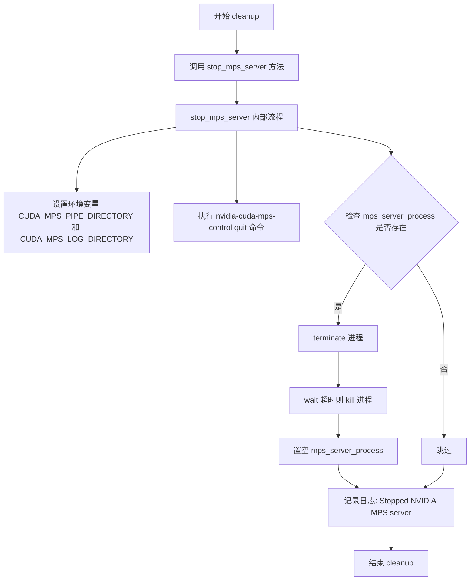

#### 带注释源码

```python
def cleanup(self) -> None:
    """
    清理资源，调用stop_mps_server释放MPS相关资源
    
    该方法作为 GPUManager 的资源清理入口，
    通过调用 stop_mps_server 来停止 NVIDIA MPS 服务器进程。
    在 __exit__ 上下文管理器中被调用，确保 GPU 资源被正确释放。
    
    Args:
        None (不接受任何参数)
    
    Returns:
        None: 无返回值
    
    Example:
        # 在上下文管理器退出时自动调用
        with GPUManager(device_idx=0) as gm:
            # 使用 GPU
            pass
        # 自动执行 cleanup
    """
    # 调用 stop_mps_server 方法停止 MPS 服务器
    # 该方法会:
    # 1. 通过 nvidia-cuda-mps-control 发送 quit 命令
    # 2. 终止 mps_server_process 进程
    # 3. 清理相关资源并记录日志
    self.stop_mps_server()
```

## 关键组件


### GPUManager 类

GPU资源管理和MPS（Multi-Process Service）服务器生命周期管理的核心类，提供CUDA设备检测、GPU内存查询及MPS服务器启动停止功能。

### CUDA 设备检测

通过 `torch.cuda.is_available()` 和 `nvidia-smi` 命令检查CUDA是否可用以及NVIDIA驱动是否安装。

### GPU VRAM 查询

调用 `nvidia-smi` 命令查询指定GPU设备的总显存大小，以GB为单位返回，若查询失败则返回默认值8GB。

### MPS 服务器管理

启动和管理NVIDIA MPS控制守护进程，为多进程共享GPU资源提供支持，包含创建专用管道和日志目录、启动MPS服务、优雅停止服务等能力。

### 资源清理机制

实现上下文管理器协议（`__enter__` 和 `__exit__`），确保MPS服务器在异常或正常退出时都能被正确清理。


## 问题及建议


### 已知问题

-   **未使用的实例变量**：`self.original_compute_mode` 被声明但从未赋值或使用，造成代码冗余和混淆。
-   **硬编码路径**：MPS 服务的管道目录和日志目录路径 `/tmp/nvidia-mps-{device_idx}` 和 `/tmp/nvidia-log-{device_idx}` 硬编码在代码中，缺乏配置灵活性。
-   **默认 VRAM 硬编码**：`default_gpu_vram: int = 8` 作为类属性硬编码为 8GB，未从 `settings` 配置读取，违背了配置与代码分离原则。
-   **错误处理不完善**：`check_cuda_available()` 返回 `False` 时无日志记录；异常捕获后仅返回默认值，缺少详细的错误诊断信息。
-   **子进程管理缺陷**：`subprocess.Popen` 启动 MPS 控制守护进程时未设置 `start_new_session=True`，可能导致进程组管理问题；进程管道未显式关闭，存在资源泄漏风险。
-   **缺少状态查询方法**：无法查询 MPS 服务器当前是否正在运行，缺乏 `is_mps_running()` 这类状态检查方法。
-   **NVRTC 依赖未检查**：启动 MPS 服务器前未检查 `nvidia-cuda-mps-control` 命令的具体可用性，仅捕获通用异常。
-   **超时设置不一致**：MPS 服务器停止时使用 10 秒超时，但进程终止仅等待 5 秒，逻辑不够清晰。

### 优化建议

-   移除未使用的 `self.original_compute_mode` 属性，或实现其保存/恢复计算模式的功能。
-   将 MPS 目录路径和默认 VRAM 值提取至 `settings` 配置或类构造函数参数中。
-   增强错误处理：为各异常分支添加有意义的日志记录，包括错误类型和上下文信息。
-   改进子进程管理：使用 `start_new_session=True` 参数，并考虑使用上下文管理器或显式关闭文件描述符。
-   添加 `is_mps_active()` 方法用于查询 MPS 服务器运行状态，提升类的可测试性和可观测性。
-   在 `start_mps_server()` 前增加对 `nvidia-cuda-mps-control` 命令存在性的预检查（使用 `shutil.which()`）。
-   统一超时配置，或将超时值作为可配置参数。
-   考虑为 `get_gpu_vram()` 添加可选的结果缓存机制，避免频繁调用 `nvidia-smi`。

## 其它


### 设计目标与约束

**设计目标**：提供统一的GPU资源管理抽象，支持CUDA设备检测、显存查询、以及NVIDIA MPS（多进程服务）的启动与停止，实现GPU资源的生命周期管理，确保多进程场景下的GPU资源隔离与高效利用。

**设计约束**：
- 仅支持NVIDIA CUDA设备，不支持AMD ROCm或其他GPU后端
- 依赖`nvidia-smi`和`nvidia-cuda-mps-control`命令行工具必须在系统PATH中可用
- 临时目录`/tmp/nvidia-mps-{device_idx}`和`/tmp/nvidia-log-{device_idx}`需要具备写权限
- Linux系统专用，Windows平台不兼容

### 错误处理与异常设计

**异常处理策略**：
- `check_cuda_available()`：捕获`subprocess.CalledProcessError`和`FileNotFoundError`，返回`False`而非抛出异常
- `get_gpu_vram()`：捕获`subprocess.CalledProcessError`、`ValueError`、`FileNotFoundError`，返回默认值`8GB`
- `start_mps_server()`：捕获异常后记录警告日志，返回`False`表示启动失败
- `stop_mps_server()`：捕获所有`Exception`，记录警告日志但不中断执行
- 使用上下文管理器（`__enter__`/`__exit__`）确保资源清理，异常发生时仍会执行`cleanup()`

**错误传播机制**：关键操作失败时通过返回值（`bool`）反馈，错误详情通过日志记录，不向上抛出以避免中断主流程

### 数据流与状态机

**状态转换**：
- 初始状态 → `MPS_STOPPED`：`GPUManager`实例化后
- `MPS_STOPPED` → `MPS_STARTING`：调用`start_mps_server()`且返回`True`
- `MPS_STARTING` → `MPS_RUNNING`：子进程成功启动
- `MPS_RUNNING` → `MPS_STOPPING`：调用`stop_mps_server()`或`cleanup()`
- `MPS_STOPPING` → `MPS_STOPPED`：进程终止完成

**数据流向**：
- 输入：设备索引`device_idx` → 环境变量配置 → 子进程启动
- 查询流程：`get_gpu_vram()` → `nvidia-smi`命令 → 解析输出 → 返回整数值
- MPS控制：`nvidia-cuda-mps-control`通过stdin发送"quit\n"命令终止服务

### 外部依赖与接口契约

**外部命令依赖**：
- `nvidia-smi`：GPU信息查询（显存、CUDA可用性）
- `nvidia-cuda-mps-control`：NVIDIA MPS控制守护进程

**Python模块依赖**：
- `torch`：CUDA状态检测（`torch.cuda.is_available()`）
- `subprocess`：进程管理
- `os`：环境变量与文件系统操作

**配置文件依赖**：
- `marker.settings.settings`：获取`TORCH_DEVICE_MODEL`判断是否使用CUDA

**接口契约**：
- `using_cuda()`：静态方法，无参数，返回布尔值表示是否使用CUDA
- `check_cuda_available()`：无参数，返回布尔值表示CUDA/nvidia-smi可用性
- `get_gpu_vram()`：无参数，返回整数值（GB），失败返回默认值8
- `start_mps_server()`：无参数，返回布尔值表示启动是否成功
- `stop_mps_server()`：无参数，无返回值
- `cleanup()`：无参数，无返回值

### 并发与线程安全

**线程安全性分析**：
- `GPUManager`实例非线程安全，多线程共享同一实例需外部同步
- `mps_server_process`为实例变量，不同`device_idx`的实例可并行操作
- `subprocess.run`和`subprocess.Popen`调用为阻塞/异步操作，不共享状态
- 建议：每个GPU设备独立创建`GPUManager`实例，避免竞争

**并发场景**：
- 多进程场景下每个进程应独立管理各自的MPS服务器
- `nvidia-cuda-mps-control`命令通过环境变量指定管道目录实现进程隔离

### 资源生命周期管理

**资源获取**：
- 上下文管理器进入时（`__enter__`）检测CUDA并启动MPS服务器
- 依赖外部传入`device_idx`，由调用方控制设备分配

**资源释放**：
- 上下文管理器退出时（`__exit__`）调用`cleanup()`
- `cleanup()`调用`stop_mps_server()`终止MPS进程
- 进程终止超时（5秒）后强制`kill()`
- 临时目录不自动删除，保留用于日志审计

**资源清单**：
- 子进程：`nvidia-cuda-mps-control`守护进程
- 文件描述符：子进程的stdout/stderr管道
- 临时目录：`/tmp/nvidia-mps-{device_idx}`、`/tmp/nvidia-log-{device_idx}`

### 性能考虑与基准

**性能开销**：
- `get_gpu_vram()`每次调用执行`nvidia-smi`子进程，有一定延迟（毫秒级）
- `check_cuda_available()`同样执行子进程，建议缓存结果
- MPS服务器启动/停止为重操作，不应频繁调用

**优化建议**：
- `check_cuda_available()`结果可缓存至类变量或实例变量
- 临时目录创建可移至`start_mps_server()`首次调用时惰性创建
- 考虑使用`torch.cuda.memory_reserved()`等API替代`nvidia-smi`获取显存

### 安全性考虑

**进程安全**：
- `subprocess.Popen`未设置`preexec_fn`，进程无特殊权限降级
- 命令行参数来自内部配置，无直接注入风险

**文件系统安全**：
- 临时目录创建使用`os.makedirs(exist_ok=True)`，存在竞争条件（TOCTOU）
- 建议：创建前检查目录是否存在或使用原子操作

**权限要求**：
- 需要CUDA驱动权限访问GPU
- 需要`/tmp`目录写权限
- 需要`nvidia-smi`和`nvidia-cuda-mps-control`执行权限

### 平台兼容性

**支持平台**：
- Linux（Ubuntu 18.04+、CentOS 7+等）
- Windows：不支持，代码中路径格式`/tmp/`为Unix风格
- macOS：不支持，无NVIDIA驱动

**CUDA版本要求**：
- 需要CUDA Toolkit包含`nvidia-cuda-mps-control`
- MPS功能需要CUDA 4.0+

### 测试策略

**单元测试**：
- Mock `subprocess.run`和`subprocess.Popen`测试各类返回值
- 测试`using_cuda()`对不同`TORCH_DEVICE_MODEL`值的响应
- 测试异常情况下的默认值返回

**集成测试**：
- 在具备NVIDIA GPU的环境中测试`get_gpu_vram()`返回值准确性
- 测试MPS服务器启动/停止流程
- 测试上下文管理器的资源清理

**模拟测试**：
- Mock `torch.cuda.is_available()`测试无CUDA环境的行为

### 监控与可观测性

**日志设计**：
- 使用`marker.logger.get_logger()`获取logger实例
- INFO级别：MPS服务器启动/停止成功
- WARNING级别：启动/停止失败及异常

**可观测性指标**：
- 可增加MPS服务器启动耗时指标
- 可增加GPU显存查询延迟指标
- 可通过日志统计启动/失败次数

### 配置与参数设计

**配置来源**：
- `marker.settings.settings.TORCH_DEVICE_MODEL`：字符串，配置设备模型（如"cuda:0"）
- `device_idx`：构造函数传入，整数，GPU设备索引

**默认值**：
- `default_gpu_vram = 8`：整数值，GB为单位，查询失败时的回退值
- MPS管道目录：`/tmp/nvidia-mps-{device_idx}`
- MPS日志目录：`/tmp/nvidia-log-{device_idx}`

**环境变量**：
- `CUDA_MPS_PIPE_DIRECTORY`：MPS控制管道目录
- `CUDA_MPS_LOG_DIRECTORY`：MPS日志目录


    