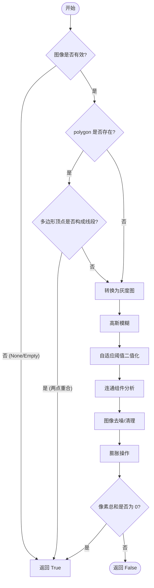

# `marker\marker\utils\image.py` 详细设计文档

该代码实现了一个图像空白检测功能，通过图像处理技术（灰度化、高斯模糊、自适应阈值、连通域分析、膨胀操作）判断输入的PIL图像是否为空白的（不包含任何有意义的文本或图形内容）。

## 整体流程

```mermaid
graph TD
    A[开始] --> B{image为空或尺寸为0?}
    B -- 是 --> C[返回True]
    B -- 否 --> D{polygon不为None?}
    D -- 是 --> E{polygon是退化四边形?}
    E -- 是 --> F[返回True]
    E -- 否 --> G[继续处理]
    D -- 否 --> G
    G --> H[RGB转灰度图]
    H --> I[高斯模糊(7x7)]
    I --> J[自适应阈值二值化]
    J --> K[连通组件分析]
    K --> L[清理连通域]
    L --> M[图像膨胀操作]
    M --> N{膨胀后像素和为0?}
    N -- 是 --> O[返回True]
    N -- 否 --> P[返回False]
```

## 类结构

```
无类定义 (纯函数模块)
```

## 全局变量及字段


    

## 全局函数及方法


### `is_blank_image`

该函数用于判断给定的 PIL 图像是否为“空白”图像（不包含有效内容）。它通过图像二值化、连通组件分析和形态学操作来检测图像中是否存在有意义的像素区域。如果图像为空、尺寸无效、指定多边形为线段或处理后无有效像素，则返回 `True`，否则返回 `False`。

参数：

- `image`：`Image.Image`，待检测的 PIL 图像对象
- `polygon`：`Optional[List[List[int]]]`，可选参数，用于指定图像中的一个多边形区域（由四个顶点坐标组成）。如果不指定，则检测整个图像。

返回值：`bool`，如果图像为空、多边形无效（为线段）或图像中不存在有效内容返回 `True`，否则返回 `False`

#### 流程图



#### 带注释源码

```python
def is_blank_image(image: Image.Image, polygon: Optional[List[List[int]]] = None) -> bool:
    # 将 PIL 图像对象转换为 NumPy 数组，以便使用 OpenCV 处理
    image = np.asarray(image)
    
    # 1. 基础合法性检查：检查图像是否存在或尺寸是否为0
    if (
        image is None
        or image.size == 0
        or image.shape[0] == 0
        or image.shape[1] == 0
    ):
        # 处理空图像情况，直接判定为空白
        return True

    # 2. 多边形有效性检查（如果提供了多边形）
    if polygon is not None:
        # 将多边形坐标取整
        rounded_polys = [[int(corner[0]), int(corner[1])] for corner in polygon]
        # 如果多边形实际上退化为一条线段（即 0==1 且 2==3），也视为无效区域，判定为空白
        if rounded_polys[0] == rounded_polys[1] and rounded_polys[2] == rounded_polys[3]:
            return True

    # 3. 图像预处理：转换为灰度图
    gray = cv2.cvtColor(image, cv2.COLOR_RGB2GRAY)
    # 4. 降噪：使用高斯模糊平滑图像，减少细小噪点对检测的干扰
    gray = cv2.GaussianBlur(gray, (7, 7), 0)

    # 5. 二值化：使用自适应阈值方法。
    # 这里使用 THRESH_BINARY_INV 是因为通常文档文字为白色背景黑色文字，
    # 这样处理后文字区域会变为白色前景。
    binarized = cv2.adaptiveThreshold(
        gray, 255, cv2.ADAPTIVE_THRESH_GAUSSIAN_C, cv2.THRESH_BINARY_INV, 31, 15
    )

    # 6. 连通组件分析：分离前景像素区域
    # connectivity=8 表示使用8邻域连接
    num_labels, labels, stats, _ = cv2.connectedComponentsWithStats(
        binarized, connectivity=8
    )
    
    # 7. 图像清理：创建一个全零背景，将所有检测到的组件填充为白色
    # 跳过 index 0（背景）
    cleaned = np.zeros_like(binarized)
    for i in range(1, num_labels):
        cleaned[labels == i] = 255

    # 8. 形态学操作：使用膨胀操作合并断裂的字符或区域，使其更容易被检测
    kernel = np.ones((1, 5), np.uint8)  # 创建横向的核，用于连接断开的文字
    dilated = cv2.dilate(cleaned, kernel, iterations=3)

    # 9. 最终判定：计算膨胀后图像的像素总和
    # 如果总和为 0，说明没有前景像素，判定为空白图像
    b = dilated / 255
    return bool(b.sum() == 0)
```


## 关键组件


### 图像空值校验

对输入图像进行基础合法性检查，包括 None 判断、尺寸为 0 以及宽高为 0 的情况，确保后续处理不会因无效图像导致异常。

### 多边形有效性校验

当传入 polygon 参数时，将其坐标转换为整数并检查是否构成有效的空白区域，若首尾点相同且符合特定条件则判定为空白图像。

### 灰度转换与模糊处理

使用 OpenCV 将 RGB 图像转换为灰度图，随后应用高斯模糊（7x7 卷积核）平滑图像以减少噪声干扰，为后续阈值分割做准备。

### 自适应阈值二值化

采用自适应高斯阈值方法（THRESH_BINARY_INV）对模糊后的灰度图进行二值化处理，将文本区域反转白色显示以便于连通域分析。

### 连通域分析与背景清除

使用 cv2.connectedComponentsWithStats 进行连通域标记，跳过背景标签后重建只包含有效连通域的二值图像，去除噪声点。

### 形态学膨胀操作

使用 1x5 结构元对清除后的二值图像进行 3 次迭代膨胀操作，增强小区域连通性以确保空白检测的准确性。

### 空白判定逻辑

通过对膨胀结果进行像素求和计算（归一化后），判断图像中是否存在有效像素内容，若总和为 0 则判定为空白图像并返回布尔值。


## 问题及建议


### 已知问题

-   **类型检查逻辑缺陷**：在 `image = np.asarray(image)` 转换后，原有的 `if image is None` 检查无法生效，因为 numpy 数组不会是 None，转换失败会直接抛出异常而非优雅处理
-   **多边形验证逻辑不完整**：polygon 检查仅比较了 `rounded_polys[0] == rounded_polys[1]` 和 `rounded_polys[2] == rounded_polys[3]`，未验证多边形是否为有效的四边形（如点重合或非凸多边形），且缺少对 polygon 长度合法性的检查
-   **未使用的导入**：`from typing import List, Optional` 导入了类型但实际代码中未使用泛型类型注解
-   **魔法数字缺乏解释**：代码中存在多个硬编码参数（高斯核大小 7、自适应阈值参数 31 和 15、膨胀核尺寸 1x5、迭代次数 3），这些参数缺乏注释说明，难以理解和维护
-   **图像模式兼容性风险**：代码假设输入为 RGB 模式（使用 `cv2.COLOR_RGB2GRAY`），但未处理 RGBA、P 等其他 PIL 图像模式，可能导致转换错误
-   **返回值语义不明确**：当图像为空白时返回 `True`，但未在文档中明确说明空白图像的定义（如全黑、全白或低对比度）

### 优化建议

-   **增强输入验证**：在转换前检查输入是否为有效的 PIL Image 对象，或捕获转换过程中的异常；添加对图像模式的支持，通过 `convert('RGB')` 统一处理
-   **完善多边形验证逻辑**：检查 polygon 长度是否为 4，验证四个点是否构成有效矩形或可简化为点的情形
-   **提取魔法数字为常量**：将阈值参数定义为具名常量或配置项，并添加文档注释说明各参数的物理意义
-   **简化连通组件逻辑**：当前循环创建的 `cleaned` 数组可替换为 `cv2.bitwise_not(binarized)` 或直接使用 `binarized` 进行后续处理
-   **添加类型注解和文档字符串**：为函数添加详细的文档说明输入输出、异常情况和算法原理
-   **考虑边界情况**：当图像尺寸极大时，可先下采样处理以提升性能


## 其它


### 设计目标与约束

本模块的设计目标是实现一个高效、准确的空白图像检测功能，能够判断给定的图像是否为空白（不包含有效内容）。主要约束包括：1）仅支持PIL.Image对象作为输入；2）可选支持多边形区域检测；3）算法基于图像二值化后的连通域分析；4）处理流程包含高斯模糊、自适应阈值、连通域检测、膨胀操作等图像处理步骤。

### 错误处理与异常设计

代码对以下异常情况进行了处理：1）图像为None时返回True；2）图像尺寸为0或高度/宽度为0时返回True；3）多边形顶点坐标无效（首尾顶点相同且第二、三顶点相同）时返回True。当图像处理过程中出现cv2错误（如图像格式不支持）时，由于当前实现较为简单，暂未捕获特定cv2异常，这属于潜在改进空间。

### 数据流与状态机

数据处理流程为：输入图像 → 转换为numpy数组 → 灰度转换 → 高斯模糊 → 自适应二值化 → 连通域分析 → 形态学膨胀 → 空白判定。该过程为单向线性流程，无状态机切换，所有中间结果均在内存中完成处理，不涉及持久化状态。

### 外部依赖与接口契约

本模块依赖以下外部库：1）PIL（Pillow）>= 8.0 用于图像加载；2）numpy >= 1.20 用于数值计算；3）opencv-python >= 4.5 用于图像处理。接口契约：image参数必须为PIL.Image.Image类型；polygon参数必须为List[List[int]]类型或None；返回值类型为bool，True表示空白，False表示非空白。

### 性能考虑与复杂度分析

时间复杂度：主要处理步骤为O(n*m)级别，其中n和m为图像宽高。连通域检测为O(n*m)，膨胀操作时间复杂度与核大小和迭代次数相关。空间复杂度：创建多个与图像尺寸同大小的numpy数组，约为O(n*m)级别。优化建议：可考虑降采样处理大幅图像、使用积分图加速等。

### 安全性考虑

当前实现未对输入进行严格类型检查，可能存在类型混淆风险；polygon参数未验证坐标是否超出图像边界，可能导致索引越界；图像数据处理未做恶意构造图像的特殊处理。建议添加输入验证逻辑和边界检查。

### 可维护性与扩展性

代码结构清晰但缺乏模块化设计，所有逻辑集中于单一函数。扩展建议：1）可将图像预处理、二值化、连通域分析等步骤拆分为独立函数；2）可添加参数化配置（如高斯核大小、自适应阈值参数、膨胀迭代次数等）；3）可支持多种空白判定策略（基于像素比例、连通域数量等）。

### 测试策略建议

建议添加以下测试用例：1）纯色图像（白/黑/彩色）测试；2）带文字/图表的非空白图像测试；3）None和空图像测试；4）极小尺寸图像测试；5）多边形区域部分为空的测试；6）不同分辨率图像的边界情况测试；7）性能基准测试。

### 配置与参数说明

当前实现中包含以下硬编码参数：1）高斯模糊核大小(7,7)；2）自适应阈值块大小31；3）自适应阈值常数15；4）膨胀核形状(1,5)；5）膨胀迭代次数3。建议将这些参数提取为配置项或函数可选参数，以提高灵活性和可调优性。

### 典型使用场景

典型应用场景包括：1）文档扫描预处理，检测是否为空白页；2）表单识别中的空白区域检测；3）票据处理中的空白票检测；4）自动化测试中的截图空白检测；5）图像采集质量控制中的无效图像过滤。

### 并发与线程安全性

当前实现为纯函数，无全局状态，理论上是线程安全的。但需要注意：1）PIL Image对象本身非线程安全，频繁创建和销毁需要注意资源管理；2）cv2的某些操作在多线程环境下可能有资源竞争，建议在独立线程中处理；3）多个并发调用时需考虑内存峰值。

### 日志与监控建议

建议添加日志记录关键处理节点：1）输入图像尺寸和模式；2）polygon区域信息；3）连通域检测结果（标签数量、统计信息）；4）最终判定结果。可添加性能日志记录各步骤耗时，便于性能调优和问题排查。


    