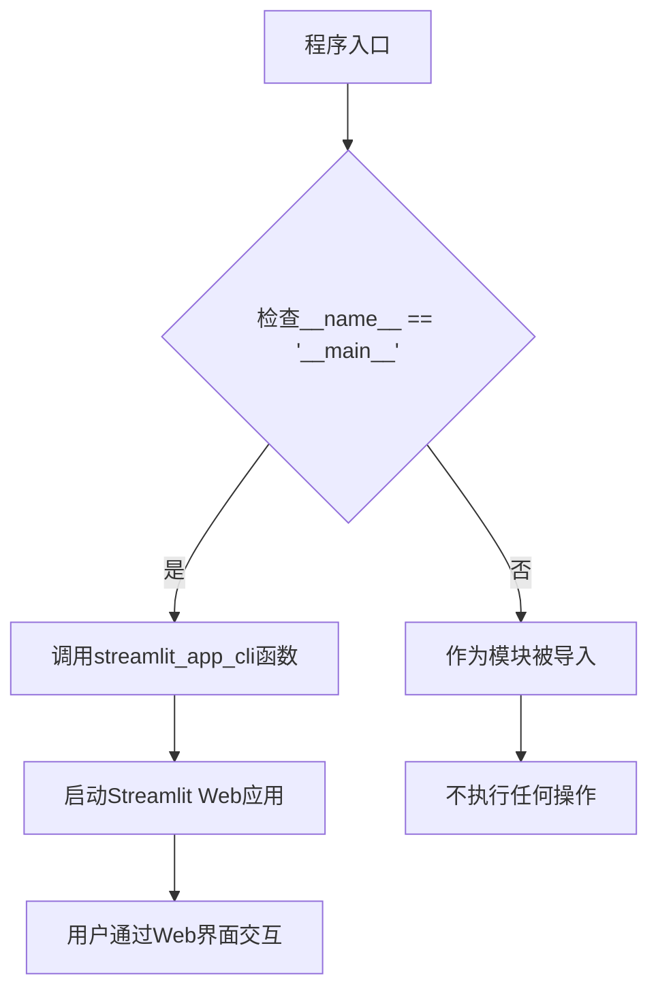
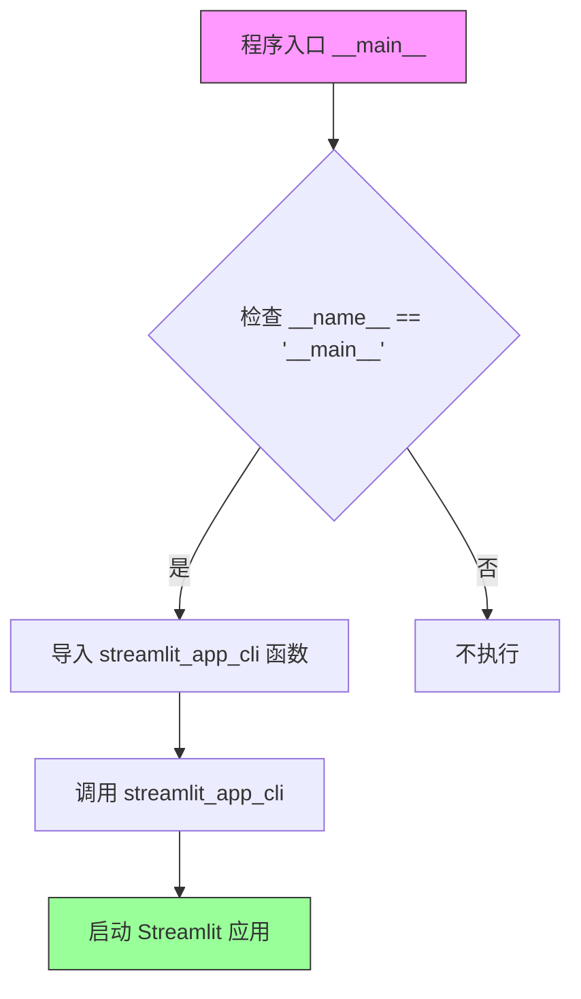

# `marker\marker_app.py` 详细设计文档

这是一个Marker项目的Streamlit应用启动入口脚本，通过调用streamlit_app_cli函数来启动Marker的Streamlit图形界面应用。

## 整体流程



## 类结构

```
该文件为入口脚本，不包含类定义
主要功能为导入并调用外部模块的CLI函数
```

## 全局变量及字段


    

## 全局函数及方法


### `streamlit_app_cli`（通过入口脚本调用）

这是一个标准的 Python 入口脚本，通过调用外部模块 `marker.scripts.run_streamlit_app` 中的 `streamlit_app_cli` 函数来启动 Marker 项目的 Streamlit 应用程序。

参数：
- 该函数无显式参数传递（函数本身的参数取决于其外部定义）

返回值：
- `None`（根据函数名推断为无返回值）

#### 流程图



#### 带注释源码

```python
# 从 marker.scripts.run_streamlit_app 模块导入 streamlit_app_cli 函数
# 这是一个外部依赖函数，其实现位于 marker 包的脚本中
from marker.scripts.run_streamlit_app import streamlit_app_cli

# Python 标准的入口点保护
# 确保此脚本作为主程序运行时才执行，而不是被导入时执行
if __name__ == "__main__":
    # 调用外部定义的 streamlit_app_cli 函数
    # 该函数通常负责初始化并启动 Streamlit Web 应用
    streamlit_app_cli()
```

---

## 补充说明

### 潜在的技术债务或优化空间

1. **缺少错误处理**：入口脚本未对 `streamlit_app_cli` 函数的调用进行异常捕获
2. **日志缺失**：未添加日志记录来跟踪应用启动状态

### 外部依赖与接口契约

- **依赖模块**：`marker.scripts.run_streamlit_app`
- **接口假设**：该模块需提供 `streamlit_app_cli` 可调用对象，且应为无返回值函数

> ⚠️ **注意**：由于 `streamlit_app_cli` 函数的实际实现在外部模块中未提供，无法分析其内部逻辑。如需完整分析，建议提供 `marker/scripts/run_streamlit_app.py` 的源码。

## 关键组件


### 启动器入口点 (Entry Point)

该代码是一个简单的Python脚本，作为marker项目的Streamlit Web应用启动入口，通过调用`streamlit_app_cli()`函数来启动完整的Web界面。

### Streamlit应用 CLI (streamlit_app_cli)

这是从`marker.scripts.run_streamlit_app`模块导入的CLI入口函数，负责初始化和运行Streamlit Web应用服务器。

### marker项目模块 (marker.scripts.run_streamlit_app)

被导入的目标模块，包含Streamlit应用的完整实现，可能涉及PDF处理、OCR、布局分析等核心功能的Web界面集成。


## 问题及建议


### 已知问题

- **缺乏命令行参数支持**：当前实现无法接受任何命令行参数，用户无法自定义配置（如模型路径、输出路径、端口等），导致灵活性不足
- **缺少错误处理机制**：未对 `streamlit_app_cli()` 调用进行异常捕获，若函数执行失败会直接抛出未处理的异常，用户体验不佳
- **无依赖验证**：未在运行前检查必要的依赖包是否正确安装，可能导致运行时ImportError
- **缺少日志记录**：没有任何日志输出，难以排查问题和监控应用运行状态
- **入口点过于简单**：仅是一个直接调用，缺乏对不同运行模式（如调试模式、生产模式）的支持

### 优化建议

- **添加命令行参数解析**：使用 `argparse` 或 `click` 库，添加常用参数如 `--model`, `--output`, `--port`, `--debug` 等，提升可配置性
- **实现错误处理**：使用 try-except 包装核心调用，捕获并优雅处理各类异常，同时提供友好的错误提示
- **添加依赖检查**：在入口处验证关键依赖是否可用，必要时给出清晰的安装指引
- **引入日志系统**：配置 Python logging 模块，支持多级别日志输出，便于问题排查和运行监控
- **支持环境变量配置**：允许通过环境变量覆盖默认配置，增加部署灵活性
- **添加健康检查和预热**：在启动 Streamlit 应用前进行必要的初始化检查（如模型加载、目录创建等）

## 其它


### 设计目标与约束

本代码作为Marker项目的Streamlit应用入口点，核心目标是提供一个简洁的命令行启动接口，使最终用户能够通过`python main.py`或直接运行脚本快速启动Marker的Streamlit Web界面。设计约束包括：必须作为`__main__`模块执行以确保正确的模块导入路径；依赖Streamlit框架的存在；设计遵循最小化原则，仅负责应用启动的职责，不包含业务逻辑。

### 错误处理与异常设计

当前代码未实现显式的错误处理机制。在生产环境中，应添加异常捕获以处理以下场景：Streamlit应用未安装导致的`ModuleNotFoundError`、应用启动失败导致的运行时异常、以及`streamlit_app_cli()`函数调用异常。建议采用try-except块捕获关键异常，提供友好的错误提示信息给用户，并记录详细错误日志便于问题排查。对于命令行参数传递，也应验证参数的有效性。

### 数据流与状态机

本文件处于数据流的起始端，职责仅限于启动应用而不涉及数据处理。启动后的数据流遵循以下路径：用户通过命令行执行入口脚本 → 调用`streamlit_app_cli()` → Streamlit框架初始化Web服务器 → 加载Streamlit页面组件 → 用户通过Web界面与Marker后端交互。状态机方面，入口脚本本身无状态，仅存在"就绪"单一状态，应用的完整状态管理由Streamlit框架和Marker后端负责。

### 外部依赖与接口契约

本代码依赖以下外部组件：`marker.scripts.run_streamlit_app`模块中的`streamlit_app_cli`函数，该函数必须实现且接受命令行参数；Streamlit框架（Python包`streamlit`）必须已安装且版本符合项目要求。接口契约方面，`streamlit_app_cli()`应返回一个整数退出码，0表示正常退出，非0表示异常终止。入口函数应接受可选的命令行参数以配置Streamlit应用（如端口号、页面标题等），具体参数规范需参考`marker.scripts.run_streamlit_app`模块的文档。

### 运行环境要求

运行环境要求包括：Python 3.8或更高版本（具体版本需参考项目requirements.txt）；已安装Streamlit包；Marker项目完整安装（包括所有依赖项）；支持运行的操作系统（Windows、Linux、macOS）。建议在虚拟环境中运行以隔离依赖冲突。启动时需要确保工作目录正确，以便Python能够正确解析`marker.scripts.run_streamlit_app`模块路径。

### 关键组件信息

| 组件名称 | 类型 | 一句话描述 |
|---------|------|-----------|
| streamlit_app_cli | 函数 | Marker项目的Streamlit应用启动函数，由marker.scripts.run_streamlit_app模块导出 |
| marker.scripts.run_streamlit_app | 模块 | 包含Streamlit应用启动逻辑的Marker项目模块 |

### 潜在技术债务与优化空间

当前代码的主要技术债务包括：缺乏错误处理机制导致用户体验不佳；缺少命令行参数解析能力限制了部署灵活性；未实现日志记录不利于生产环境问题排查；入口文件的功能过于单一，无法直接传递配置参数给Streamlit应用。建议改进方向：添加argparse或click等命令行参数解析库支持；实现结构化日志记录；添加环境变量或配置文件读取能力以支持不同部署场景；考虑添加健康检查或启动验证逻辑。


    