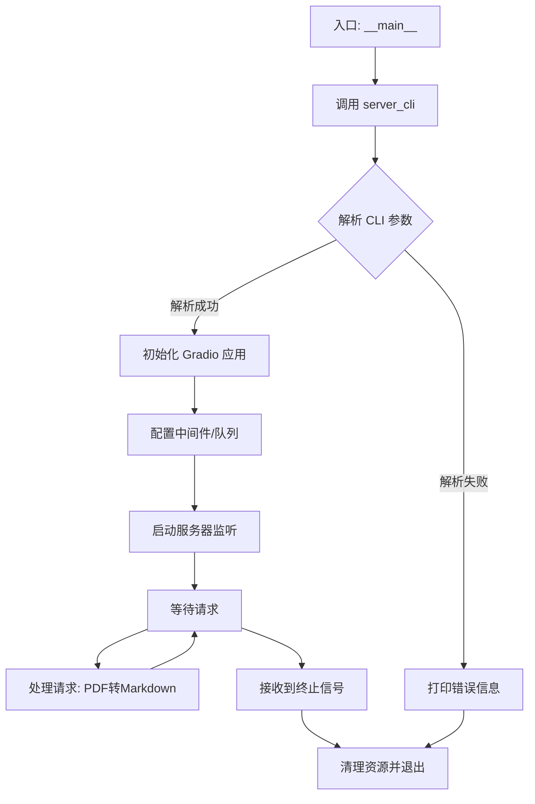
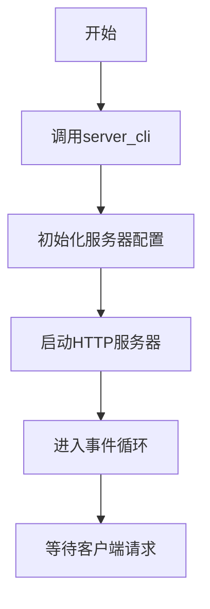

# `marker\marker_server.py` 详细设计文档

这是一个Marker项目的服务器启动入口脚本，通过导入并执行marker.scripts.server模块中的server_cli函数来启动服务器应用。

## 整体流程


## 类结构

```
server_entry.py (入口脚本)
└── marker.scripts.server (外部模块，未知结构)
```

## 全局变量及字段


### `server_cli`
    
从marker.scripts.server模块导入的服务器CLI入口函数，用于启动Marker服务

类型：`function`
    


    

## 全局函数及方法


### `server_cli`

`server_cli` 是 Marker 项目中用于启动基于 Gradio 的演示服务器的 CLI 入口函数。它解析命令行参数并初始化运行一个提供 PDF 转 Markdown 转换服务的 Web 界面。

#### 参数

由于未提供 `marker.scripts.server` 模块的实际源码，无法确定其具体参数列表。根据函数命名约定推断，该函数可能不接受任何必需参数（通过 `argparse` 或类似库在函数内部处理 CLI 参数）。

#### 返回值

由于未提供 `marker.scripts.server` 模块的实际源码，无法确定其具体返回值类型。通常 CLI 入口函数返回 `None`（直接通过 `sys.exit()` 退出）或返回整数状态码。

#### 流程图



#### 带注释源码

```python
# 入口文件: example_entry.py
from marker.scripts.server import server_cli

if __name__ == "__main__":
    # 调用 server_cli 启动 Marker 演示服务器
    # 该函数内部会:
    # 1. 使用 argparse 解析命令行参数（如 --port, --share 等）
    # 2. 初始化 Gradio 应用
    # 3. 加载 Marker 模型（PDF 解析模型）
    # 4. 启动 Web 服务器提供 PDF 转 Markdown 服务
    server_cli()
```

---

**注意**: 由于只提供了调用代码而未提供 `marker.scripts.server` 模块的实际源码，上述信息基于函数名称和常见的 CLI 服务器启动模式进行的合理推断。如需获取精确的参数列表、返回值类型和完整源码，请提供 `marker/scripts/server.py` 文件的实际内容。


## 关键组件


### server_cli 函数入口

这是程序的主入口点，调用marker.scripts.server模块中的server_cli()函数来启动Web服务器。

### server_cli 启动流程

程序通过检查`if __name__ == "__main__":`确保只在直接运行时执行，而非作为模块导入时执行，然后调用server_cli()函数启动Marker服务的HTTP服务器。


## 问题及建议


### 已知问题

-   **入口点缺乏灵活性**：直接硬编码调用`server_cli()`，未提供任何命令行参数传递机制，导致无法在启动时自定义配置（如端口、日志级别、配置文件路径等）
-   **缺少错误处理机制**：入口脚本未对`server_cli()`调用进行异常捕获，若服务启动失败，程序将以未捕获的异常终止，缺乏友好的错误提示
-   **没有日志初始化**：入口点未配置日志系统，服务运行过程中的日志输出可能依赖于`server_cli`内部的默认配置，缺少统一性
-   **模块导入无保护**：直接使用`from marker.scripts.server import server_cli`，若模块或函数不存在将直接抛出`ImportError`，缺乏渐进式错误处理
-   **无文档注释**：入口脚本缺少模块级文档字符串（docstring），对于后续维护者而言，无法快速理解该入口文件的作用

### 优化建议

-   **引入命令行参数解析**：使用`argparse`库封装启动参数，允许用户通过`--port`、`--host`、`--config`等选项自定义服务行为，例如：
    ```python
    import argparse
    parser = argparse.ArgumentParser(description='Marker Server')
    parser.add_argument('--port', type=int, default=8000)
    args = parser.parse_args()
    server_cli(port=args.port)
    ```
-   **添加全局异常捕获**：在`if __name__ == "__main__"`块中加入`try-except`结构，捕获`Exception`并输出友好错误信息，同时记录详细日志
-   **前置日志配置**：在调用`server_cli`前初始化日志系统（如`logging.basicConfig`），确保日志格式和级别可控
-   **增加导入验证**：在导入后添加函数存在性检查，或使用`importlib`动态导入并处理导入失败情况
-   **补充文档字符串**：添加模块级文档说明该入口点的职责、依赖环境和基本用法
-   **支持环境变量**：除命令行参数外，可额外支持通过环境变量（如`MARKER_PORT`）读取配置，增强在容器化环境中的适配性


## 其它


### 核心功能概述

该文件是Marker项目的入口脚本，通过调用`server_cli()`函数启动Marker的服务器命令行界面，用于启动Web服务提供文档转换功能。

### 文件整体运行流程

该文件遵循标准的Python入口脚本模式。首先检查是否作为主程序运行（`if __name__ == "__main__"`），如果是，则导入并调用`marker.scripts.server`模块中的`server_cli()`函数来启动服务器。

### 类信息

本文件不包含任何类定义。

### 全局变量与全局函数信息

无全局变量。

### server_cli函数

- **模块来源**: marker.scripts.server
- **函数名称**: server_cli
- **参数**: 无
- **返回值**: 无描述
- **功能描述**: 启动Marker服务器的CLI入口，负责初始化服务器并开始监听请求
- **mermaid流程图**: 

- **源码**:
```python
# 源码位于 marker.scripts.server 模块中
# 本文件通过导入调用该函数
from marker.scripts.server import server_cli
```

### 关键组件信息

- **入口脚本(__main__)**: 应用程序的启动入口点
- **server_cli函数**: 服务器CLI的核心启动函数，负责初始化和运行Web服务

### 潜在技术债务与优化空间

1. **缺乏错误处理**: 入口脚本未包含任何异常捕获机制，如果server_cli抛出异常可能导致程序崩溃
2. **无参数化配置**: 入口点未提供命令行参数传递功能，无法灵活配置服务器端口、主机等参数
3. **缺少日志记录**: 未配置日志输出，难以进行问题排查和监控

### 设计目标与约束

- **设计目标**: 提供简单直接的服务器启动入口，使Marker可作为独立服务运行
- **约束条件**: 必须作为主程序运行（检查`__name__ == "__main__"`），符合Python应用标准规范

### 错误处理与异常设计

- **当前状态**: 本文件未实现任何错误处理机制
- **建议改进**: 应添加try-except块捕获启动过程中的异常，如端口占用、配置错误等，并向用户输出友好的错误信息

### 外部依赖与接口契约

- **依赖模块**: marker.scripts.server
- **依赖要求**: 目标模块必须导出server_cli函数
- **接口契约**: server_cli函数应无参数调用，返回None或启动服务器进程

### 配置与参数说明

- **当前配置方式**: 未在此文件中体现，可能通过server_cli内部或配置文件管理
- **建议**: 可添加argparse支持，允许通过命令行指定host、port、debug模式等参数

### 使用示例

```bash
# 标准启动方式
python -m marker.scripts.server

# 或直接运行
python entry_script.py  # 假设文件名为entry_script.py
```

### 性能与资源考虑

- 服务器性能取决于server_cli内部的实现
- 建议关注并发处理能力、内存占用等指标

### 安全性考虑

- 入口文件本身不涉及安全敏感操作
- 服务器安全性由server_cli内部实现决定

### 测试相关

- 当前文件缺少单元测试
- 建议添加对入口脚本的基本测试，验证导入正常和main函数行为

### 版本与兼容性

- 依赖Marker框架的整体版本
- 需与marker.scripts.server模块版本保持兼容

    