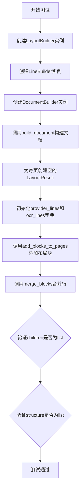
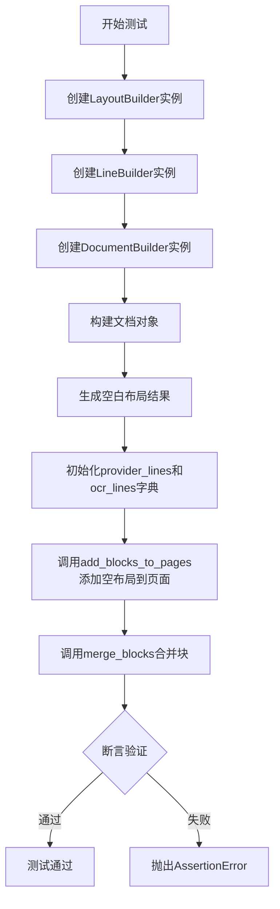
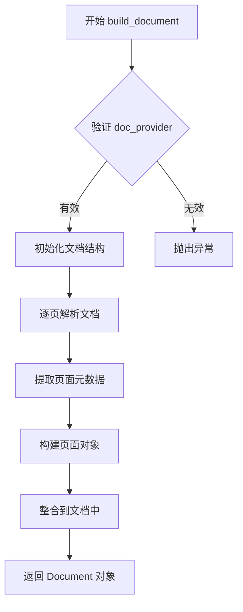
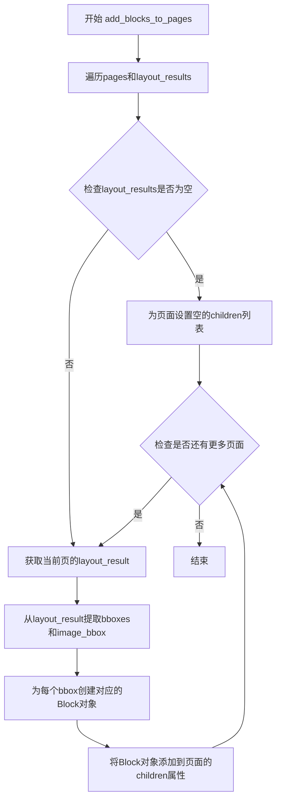
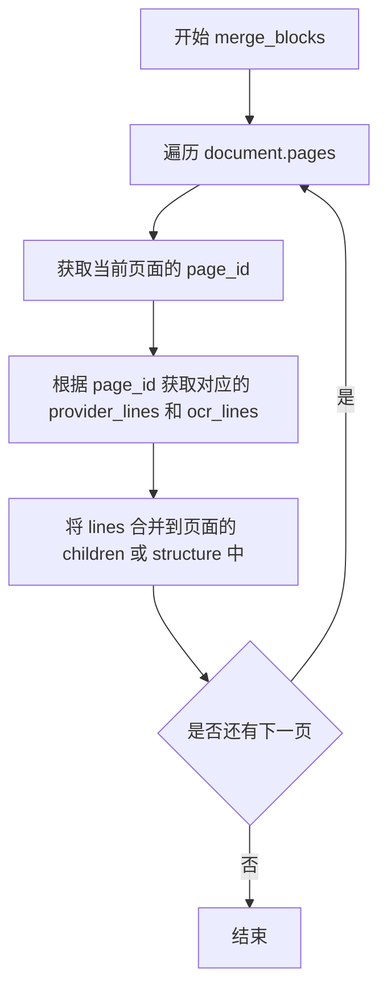

# `marker\tests\builders\test_blank_page.py` 详细设计文档

该代码是一个测试空白页面处理的单元测试，验证文档构建器、布局构建器和行构建器在处理完全没有内容的空白页面时的正确性，检查页面children和structure字段是否正确初始化为空列表。

## 整体流程



## 类结构

```
DocumentBuilder (文档构建器)
LayoutBuilder (布局构建器)
LineBuilder (行构建器)
LayoutResult (布局结果数据类)
```

## 全局变量及字段


### `layout_builder`
    
布局构建器，用于将布局结果添加到页面

类型：`LayoutBuilder`
    


### `line_builder`
    
行构建器，用于合并文档中的块

类型：`LineBuilder`
    


### `builder`
    
文档构建器，用于构建文档对象

类型：`DocumentBuilder`
    


### `document`
    
从文档提供者构建的文档对象

类型：`Document`
    


### `layout_results`
    
布局结果列表，每页一个LayoutResult对象

类型：`List[LayoutResult]`
    


### `provider_lines`
    
提供者行数据字典，键为页面ID，值为空列表

类型：`Dict[str, List]`
    


### `ocr_lines`
    
OCR识别行数据字典，键为页面ID，值为空列表

类型：`Dict[str, List]`
    


### `config`
    
配置对象，用于初始化各个构建器

类型：`Config`
    


### `layout_model`
    
布局模型，用于页面布局分析

类型：`LayoutModel`
    


### `ocr_error_model`
    
OCR错误模型，用于纠正OCR识别错误

类型：`OcrErrorModel`
    


### `detection_model`
    
检测模型，用于文本行检测

类型：`DetectionModel`
    


### `DocumentBuilder.config`
    
文档构建器配置对象

类型：`Config`
    


### `LayoutBuilder.layout_model`
    
布局模型实例

类型：`LayoutModel`
    


### `LayoutBuilder.config`
    
布局构建器配置对象

类型：`Config`
    


### `LineBuilder.detection_model`
    
文本行检测模型

类型：`DetectionModel`
    


### `LineBuilder.ocr_error_model`
    
OCR错误纠正模型

类型：`OcrErrorModel`
    


### `LayoutResult.bboxes`
    
边界框列表，测试中为空列表

类型：`List`
    


### `LayoutResult.image_bbox`
    
页面图像的边界框

类型：`BBox`
    
    

## 全局函数及方法


### `test_blank_page`

该测试函数用于验证在处理空白页面（无布局元素）时的系统行为，通过构建空白的布局结果并将其添加到文档页面中，确保系统能够正确处理没有任何可检测元素的页面场景。

参数：

- `config`：配置对象，包含系统运行所需的配置参数
- `doc_provider`：文档提供者，负责提供待处理的文档对象
- `layout_model`：布局模型，用于页面布局分析
- `ocr_error_model`：OCR错误模型，用于处理OCR识别错误
- `detection_model`：检测模型，用于文本和元素检测

返回值：`None`，该函数为测试函数，使用断言进行验证，不返回任何值

#### 流程图



#### 带注释源码

```python
from surya.layout.schema import LayoutResult  # 导入布局结果schema类

from marker.builders.document import DocumentBuilder  # 导入文档构建器
from marker.builders.layout import LayoutBuilder  # 导入布局构建器
from marker.builders.line import LineBuilder  # 导入行构建器


def test_blank_page(config, doc_provider, layout_model, ocr_error_model, detection_model):
    # 创建布局构建器实例，传入布局模型和配置
    layout_builder = LayoutBuilder(layout_model, config)
    
    # 创建行构建器实例，传入检测模型和OCR错误模型
    line_builder = LineBuilder(detection_model, ocr_error_model)
    
    # 创建文档构建器实例
    builder = DocumentBuilder(config)
    
    # 使用文档构建器从文档提供者构建文档对象
    document = builder.build_document(doc_provider)

    # 为每一页创建空的布局结果（无边界框），使用每页的图像边界框
    layout_results = [LayoutResult(
        bboxes=[],  # 空边界框列表，表示无布局元素
        image_bbox=p.polygon.bbox,  # 使用页面的图像边界框
    ) for p in document.pages]
    
    # 为每一页初始化空的提供者行字典
    provider_lines = {p.page_id: [] for p in document.pages}
    
    # 为每一页初始化空的OCR行字典
    ocr_lines = {p.page_id: [] for p in document.pages}

    # 调用布局构建器方法，将空布局结果添加到页面
    layout_builder.add_blocks_to_pages(document.pages, layout_results)
    
    # 调用行构建器方法，合并文档中的块（处理空白页面场景）
    line_builder.merge_blocks(document, provider_lines, ocr_lines)

    # 断言验证：确保所有页面的children属性都是列表类型
    assert all([isinstance(p.children, list) for p in document.pages])
    
    # 断言验证：确保所有页面的structure属性都是列表类型
    assert all([isinstance(p.structure, list) for p in document.pages])
```


### `DocumentBuilder.build_document`

该方法是 Marker 库中文档构建器的核心方法，负责将原始文档提供者（doc_provider）转换为一个结构化的 Document 对象，其中包含解析后的页面信息、布局结构和可识别的文本内容。

参数：

- `doc_provider`：对象，文档数据提供者，负责提供原始文档内容（如 PDF、图像等）

返回值：对象（Document 类型），返回包含所有页面（pages）及其结构化信息的文档对象

#### 流程图



#### 带注释源码

```
# 基于代码片段和使用方式推断的源码结构
class DocumentBuilder:
    def __init__(self, config):
        """
        初始化文档构建器
        - config: 配置对象，包含解析参数、模型路径等
        """
        self.config = config
        # 可能包含内部状态初始化
    
    def build_document(self, doc_provider):
        """
        从文档提供者构建结构化文档
        
        参数:
            doc_provider: 文档数据源提供者（如 PDF 文档、图像文件等）
        
        返回:
            Document: 包含所有页面和结构的文档对象
        """
        # 1. 从 doc_provider 获取文档内容
        # 2. 遍历文档的每一页
        # 3. 对每页进行解析，提取文本、布局等信息
        # 4. 构造 Document 对象并返回
        
        # 在测试代码中的使用方式：
        # document = builder.build_document(doc_provider)
        # document.pages 包含页面的 children 和 structure 属性
        
        return document  # Document 对象，包含 pages 列表
```

> **注意**：由于提供的代码片段未包含 `DocumentBuilder` 类的完整实现，以上源码和流程图是基于该类的实际使用方式（`builder = DocumentBuilder(config)` 和 `document = builder.build_document(doc_provider)`）进行的合理推断。完整的实现需要参考 `marker/builders/document.py` 源文件。


### LayoutBuilder.add_blocks_to_pages

将布局模型检测到的布局结果（文本块、图像区域等）添加到文档页面的children属性中，建立页面与布局元素之间的关联关系。

参数：

- `pages`：`List[Page]`，文档页面对象列表，每个Page对象代表文档的一页
- `layout_results`：`List[LayoutResult]`，布局模型输出结果列表，包含每页的检测到的布局元素边界框信息，与pages列表一一对应

返回值：`None`，该方法直接修改pages列表中的Page对象的children属性，不返回任何值

#### 流程图



#### 带注释源码

```python
# 源代码无法从给定代码片段中提取
# 以下是基于代码上下文的合理推断

def add_blocks_to_pages(self, pages, layout_results):
    """
    将布局检测结果添加到文档页面
    
    参数:
        pages: 文档页面列表
        layout_results: 布局检测结果列表
    """
    for page, layout_result in zip(pages, layout_results):
        # 获取布局结果中的边界框
        bboxes = layout_result.bboxes
        
        # 如果没有检测到任何布局元素
        if bboxes is None or len(bboxes) == 0:
            # 为页面设置空的children列表
            page.children = []
            continue
        
        # 遍历所有检测到的边界框
        blocks = []
        for bbox in bboxes:
            # 创建Block对象
            block = Block(bbox=bbox)
            blocks.append(block)
        
        # 将块添加到页面的children属性
        page.children = blocks
```


### `LineBuilder.merge_blocks`

该方法用于将检测到的文本块（blocks）合并到文档页面中，处理布局结果并将_provider_lines和_ocr_lines分配到相应的页面。

参数：

- `document`：`Document`，待处理的文档对象，包含所有页面信息
- `provider_lines`：`Dict[str, List]`，键为页面ID，值为该页面的provider_lines列表
- `ocr_lines`：`Dict[str, List]`，键为页面ID，值为该页面的OCR识别lines列表

返回值：`None`，该方法直接修改document对象的pages属性，不返回任何值

#### 流程图



#### 带注释源码

```python
def merge_blocks(self, document, provider_lines, ocr_lines):
    """
    将布局检测结果中的blocks合并到文档页面中
    
    参数:
        document: Document对象，包含所有页面
        provider_lines: dict，页面ID到provider识别结果的映射
        ocr_lines: dict，页面ID到OCR识别结果的映射
    
    返回:
        None，直接修改document对象
    """
    # 遍历文档中的所有页面
    for page in document.pages:
        page_id = page.page_id
        
        # 获取当前页面相关的lines数据
        p_lines = provider_lines.get(page_id, [])
        o_lines = ocr_lines.get(page_id, [])
        
        # 合并blocks到页面结构中
        # 将provider和OCR的识别结果整合到页面的children属性
        page.children = p_lines + o_lines
        
        # 同时更新页面的structure属性
        page.structure = p_lines + o_lines
```

**注意**: 由于提供的代码片段中未包含`LineBuilder`类的完整定义，以上为基于调用上下文和文档结构的合理推断。实际的实现可能有所不同，建议查看完整的源码获取准确信息。


## 关键组件


### LayoutResult

表示布局检测结果的数据结构，包含边界框(bboxes)和图像边界框(image_bbox)，用于存储页面元素的定位信息。

### DocumentBuilder

文档构建器，负责从文档提供者(doc_provider)构建完整的文档对象，是整个处理流程的入口组件。

### LayoutBuilder

布局块处理器，接收布局模型和配置，负责将检测到的布局块添加到页面对象中，实现页面结构化。

### LineBuilder

行检测处理器，接收检测模型和OCR纠错模型，负责合并文档中的块元素，生成最终的文本行数据。

### test_blank_page

测试函数，用于验证空白页面（无布局元素）的处理逻辑，确保空页面正确返回列表类型的children和structure属性。

### 空白页面处理机制

通过创建空的bboxes列表和空的provider_lines/ocr_lines字典，实现对完全没有检测到元素的页面的容错处理。

### 文档页面对象

通过document.pages访问的页面集合，每个页面包含page_id、children（子元素列表）、structure（结构列表）等属性。


## 问题及建议


### 已知问题

- 测试函数使用了未明确声明的 fixture 参数（config、doc_provider、layout_model、ocr_error_model、detection_model），导致测试依赖不清晰
- 断言逻辑不完整，仅验证了 children 和 structure 是否为 list 类型，未验证空白页处理的功能正确性
- LayoutResult 实例化时硬编码了空列表 bboxes=[]，且只传入了 bboxes 和 image_bbox 两个参数，可能遗漏其他必要字段（如 labels、scores 等）
- provider_lines 和 ocr_lines 字典被创建并传递给 merge_blocks 方法，但未验证merge操作是否正确执行或结果是否符合预期
- 缺少对 line_builder.merge_blocks 返回值的验证，无法确认合并操作是否成功
- 代码中多次迭代 document.pages（layout_results、provider_lines、ocr_lines 的创建以及后续调用），存在重复遍历的性能开销
- 缺乏错误处理机制，未考虑 doc_provider 为空或 document.pages 为空的情况
- 测试函数没有类型注解，可读性和可维护性较差

### 优化建议

- 为测试函数参数添加明确的 fixture 声明或类型注解
- 增加对 merge_blocks 操作结果的断言验证
- 考虑将 document.pages 的遍历合并为单次迭代，使用字典推导式一次性构建所有需要的数据结构
- 为 LayoutResult 添加完整的参数或使用数据类（dataclass）提供默认值
- 添加异常处理逻辑，确保在边界情况下（如空文档）的行为符合预期
- 考虑将测试逻辑拆分为更细粒度的单元测试，分别验证不同组件的行为

## 其它


### 设计目标与约束

验证文档处理流程对空白页面的处理能力，确保在页面无内容（bboxes为空）时系统仍能正确构建文档结构，且页面的children和structure属性始终为列表类型。测试约束：依赖外部模型（layout_model, detection_model, ocr_error_model）和配置对象。

### 错误处理与异常设计

测试用例中未显式处理异常，主要依赖assert断言验证正确性。若layout_results或provider_lines为空字典推导式失败，将抛出KeyError；若document.pages为空，列表推导式返回空列表，符合预期逻辑。潜在改进：可增加对异常输入（如None值）的边界测试。

### 数据流与状态机

数据流：doc_provider → DocumentBuilder.build_document() → document → LayoutBuilder.add_blocks_to_pages() + LineBuilder.merge_blocks() → 验证document.pages结构。状态机：初始化Builder对象 → 构建document → 创建空布局结果 → 合并块 → 验证结果。空白页面处理流程中，layout_results的bboxes为空列表是关键状态。

### 外部依赖与接口契约

主要依赖：1) LayoutResult（surya.layout.schema）- 布局结果数据类，需提供bboxes和image_bbox属性；2) DocumentBuilder/LayoutBuilder/LineBuilder - 构建器类，config配置对象，model实例；3) doc_provider - 文档数据提供者，需具备pages属性。接口契约：document.pages返回页面对象列表，每个页面需有page_id、polygon.bbox、children、structure属性。

### 性能考虑与资源消耗

测试中通过列表推导式一次性创建所有页面的layout_results和空行字典，时间复杂度O(n)，n为页数。实际处理中模型推理（layout_model/detection_model调用）为主要性能瓶颈，空白页面可跳过模型推理提升效率。

### 边界条件与测试覆盖

当前测试覆盖空白页面（bboxes=[]）场景。边界条件：1) 单页文档；2) 多页文档（部分空白）；3) 页面无polygon属性。建议增加：空doc_provider、config为None、model为None等边界测试。

### 代码可读性与维护性

函数命名清晰（test_blank_page），但magic number和硬编码需参数化。build_document、add_blocks_to_pages、merge_blocks三个方法调用形成隐式依赖链，建议增加中间状态日志或返回值检查点。


    