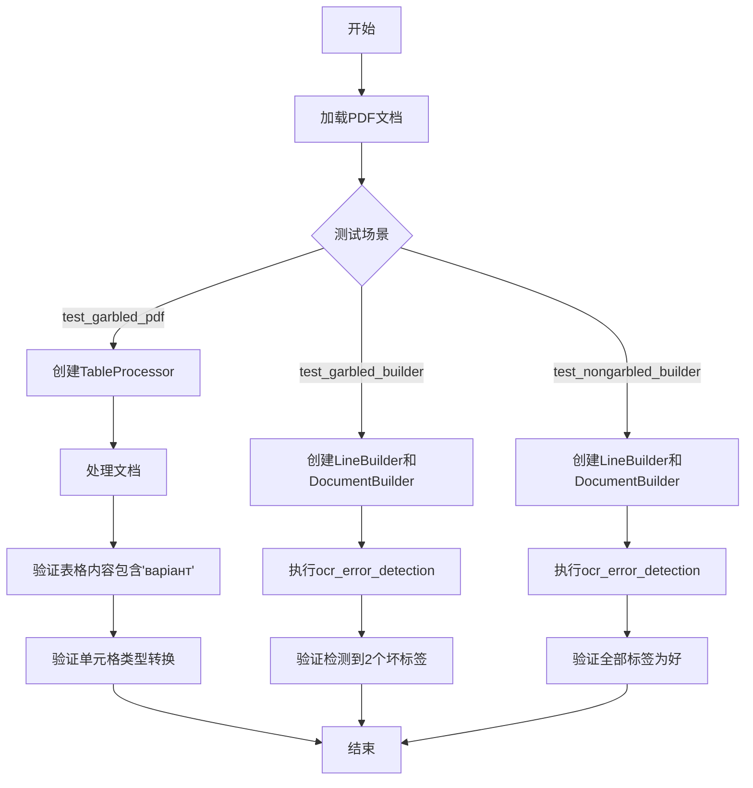
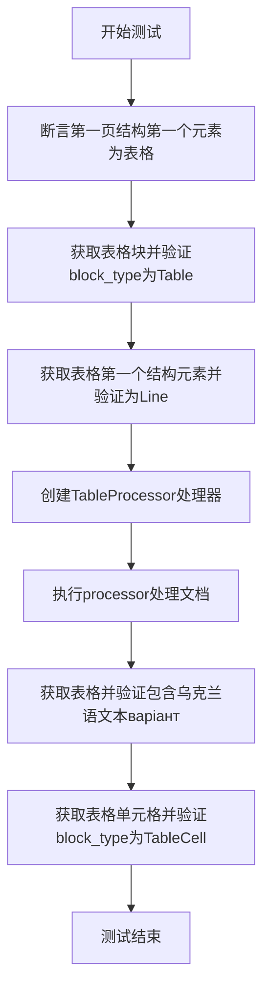
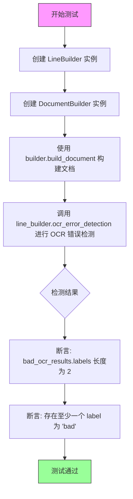
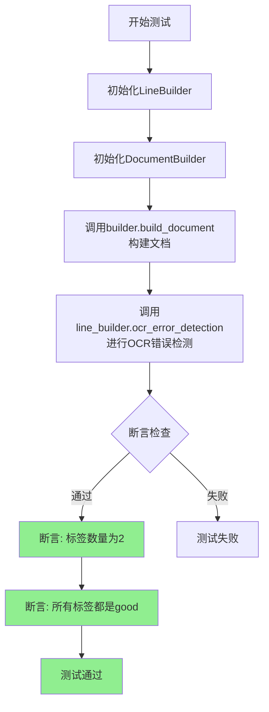
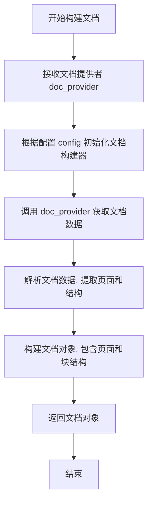
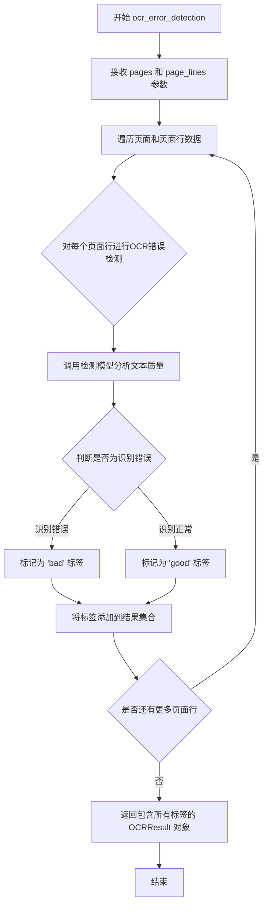
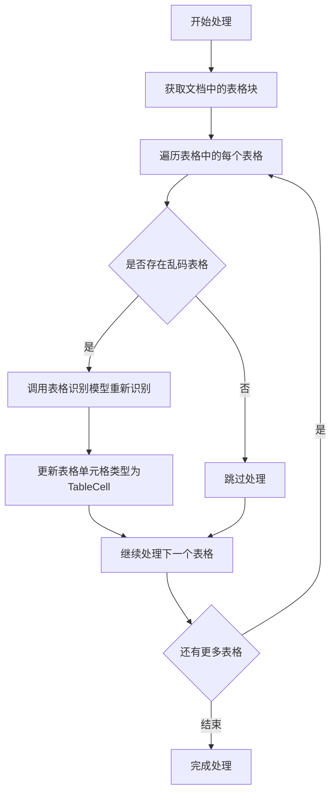

# `marker\tests\builders\test_garbled_pdf.py` 详细设计文档

该测试文件主要用于测试PDF文档处理流程中的关键功能，包括表格识别处理（TableProcessor）、OCR错误检测（LineBuilder.ocr_error_detection）以及文档构建（DocumentBuilder.build_document），覆盖了乱码PDF、印地语判决书和对抗性PDF等多种场景的测试。

## 整体流程



## 类结构

```
测试模块 (test_pdf_processing)
├── DocumentBuilder (文档构建器)
├── LineBuilder (行构建器)
├── TableProcessor (表格处理器)
└── BlockTypes (块类型枚举)
```

## 全局变量及字段


### `pdf_document`
    
代表整个PDF文档的对象，包含页面集合和结构信息。

类型：`Document`
    


### `recognition_model`
    
用于识别文本内容的OCR模型，负责将图像转换为文本。

类型：`BaseModel`
    


### `table_rec_model`
    
专门用于识别表格结构和内容的模型。

类型：`BaseModel`
    


### `detection_model`
    
用于检测文档中文本行、表格等元素位置的模型。

类型：`BaseModel`
    


### `config`
    
包含处理配置参数的字典，如页码范围、OCR开关等选项。

类型：`dict`
    


### `doc_provider`
    
提供PDF文档页面原始数据的提供者，负责加载和分页。

类型：`DocProvider`
    


### `ocr_error_model`
    
用于检测OCR识别结果中存在错误的模型。

类型：`BaseModel`
    


### `DocumentBuilder.config`
    
文档构建器的配置参数，控制文档处理流程。

类型：`dict`
    


### `LineBuilder.detection_model`
    
行构建器使用的检测模型，用于识别文本行位置。

类型：`BaseModel`
    


### `LineBuilder.ocr_error_model`
    
行构建器使用的OCR错误检测模型，用于评估识别质量。

类型：`BaseModel`
    


### `LineBuilder.config`
    
行构建器的配置参数，控制文本行处理逻辑。

类型：`dict`
    


### `TableProcessor.recognition_model`
    
表格处理器使用的识别模型，用于读取表格内文本。

类型：`BaseModel`
    


### `TableProcessor.table_rec_model`
    
表格处理器使用的表格识别模型，用于解析表格结构。

类型：`BaseModel`
    


### `TableProcessor.detection_model`
    
表格处理器使用的检测模型，用于定位表格区域。

类型：`BaseModel`
    
    

## 全局函数及方法


### `test_garbled_pdf`

该测试函数用于验证在处理包含乱码或非标准文本的PDF文档时，系统能够正确识别表格结构，并将OCR错误检测应用于表格内容，确保能提取出包含非ASCII字符（如俄语/乌克兰语文本）的表格数据。

参数：

- `pdf_document`：`<class 'pdf_document'>`，pytest fixture 提供的 PDF 文档对象，包含页面和结构信息
- `recognition_model`：`<class 'RecognitionModel'>`，用于文本识别的模型
- `table_rec_model`：`<class 'TableRecognitionModel'>`，专门用于表格识别的模型
- `detection_model`：`<class 'DetectionModel'>`，用于检测文档中表格位置的模型

返回值：`void`，该函数为测试函数，无返回值，通过 pytest 断言验证功能正确性

#### 流程图



#### 带注释源码

```python
import pytest
# 导入文档构建器、线条构建器、表格处理器和块类型枚举
from marker.builders.document import DocumentBuilder
from marker.builders.line import LineBuilder
from marker.processors.table import TableProcessor
from marker.schema import BlockTypes

# 使用标记指定测试用的PDF文件名
@pytest.mark.filename("water_damage.pdf")
def test_garbled_pdf(pdf_document, recognition_model, table_rec_model, detection_model):
    # 验证PDF第一页的第一个结构元素是表格（索引路径：/page/0/Table/0）
    assert pdf_document.pages[0].structure[0] == "/page/0/Table/0"

    # 根据结构路径获取表格块对象
    table_block = pdf_document.pages[0].get_block(pdf_document.pages[0].structure[0])
    # 验证获取的块类型是表格
    assert table_block.block_type == BlockTypes.Table
    # 验证表格的第一个子结构是行（Line）
    assert table_block.structure[0] == "/page/0/Line/10"

    # 获取表格内的行块
    table_cell = pdf_document.pages[0].get_block(table_block.structure[0])
    # 验证此时块类型为Line（而非TableCell，说明初始解析未完成）
    assert table_cell.block_type == BlockTypes.Line

    # 创建表格处理器，用于处理OCR和表格识别
    # 注意：初始解析通道不进行OCR，只通过TableProcessor进行
    processor = TableProcessor(recognition_model, table_rec_model, detection_model)
    # 执行表格处理
    processor(pdf_document)

    # 获取处理后的表格块
    table = pdf_document.pages[0].contained_blocks(pdf_document, (BlockTypes.Table,))[0]
    # 验证表格中包含乌克兰语文本"варіант"（验证OCR功能正常）
    assert "варіант" in table.raw_text(pdf_document)

    # 再次获取表格内的块
    table_cell = pdf_document.pages[0].get_block(table_block.structure[0])
    # 验证处理后块类型已变为TableCell（说明表格单元格被正确识别）
    assert table_cell.block_type == BlockTypes.TableCell
```


### `test_garbled_builder`

该测试函数用于验证 OCR 错误检测功能能否正确识别文档中存在的乱码（garbled）文本。它通过 LineBuilder 和 DocumentBuilder 构建文档，然后使用 OCR 错误检测模型分析页面，验证是否能检测到预期的错误标签。

参数：

- `config`：配置对象，包含测试配置信息（如页面范围、OCR 设置等）
- `doc_provider`：文档提供者，用于提供待处理的 PDF 文档
- `detection_model`：检测模型，用于文本检测任务
- `ocr_error_model`：OCR 错误检测模型，用于识别识别错误的文本

返回值：`None`，该函数为测试函数，无显式返回值

#### 流程图



#### 带注释源码

```python
# 使用指定的文件名标记测试
@pytest.mark.filename("hindi_judgement.pdf")
# 使用指定的配置标记测试：处理第2-3页，禁用OCR
@pytest.mark.config({"page_range": [2, 3], "disable_ocr": True})
def test_garbled_builder(config, doc_provider, detection_model, ocr_error_model):
    """
    测试 OCR 错误检测功能是否能正确识别乱码文本
    
    参数:
        config: 包含页面范围和OCR设置的配置对象
        doc_provider: 提供PDF文档的测试fixture
        detection_model: 用于文本检测的模型
        ocr_error_model: 用于检测OCR识别错误的模型
    
    返回:
        None (测试函数)
    """
    
    # 初始化 LineBuilder，用于OCR错误检测
    # 参数: detection_model - 文本检测模型
    #       ocr_error_model - OCR错误检测模型
    #       config - 配置对象
    line_builder = LineBuilder(detection_model, ocr_error_model, config)
    
    # 初始化 DocumentBuilder，用于构建文档对象
    # 参数: config - 配置对象
    builder = DocumentBuilder(config)
    
    # 使用 doc_provider 提供的文档构建 Document 对象
    # doc_provider 是 pytest fixture，提供测试用的PDF文档
    document = builder.build_document(doc_provider)
    
    # 执行 OCR 错误检测
    # 参数:
    #   document.pages - 文档的页面对象列表
    #   doc_provider.page_lines - 文档中检测到的文本行
    # 返回:
    #   bad_ocr_results - 包含 labels 属性的结果对象
    bad_ocr_results = line_builder.ocr_error_detection(
        document.pages, doc_provider.page_lines
    )
    
    # 断言：验证检测到的错误结果数量为2
    # 根据测试配置（page_range: [2, 3]），应该检测到2页的错误
    assert len(bad_ocr_results.labels) == 2
    
    # 断言：验证至少存在一个 'bad' 标签
    # 表示该测试用例使用包含OCR错误的文档（hindi_judgement.pdf）
    assert any([label == "bad" for label in bad_ocr_results.labels])
```


### `test_nongarbled_builder`

该测试函数用于验证在禁用OCR、针对特定页面范围（2-3页）的场景下，OCR错误检测器能够正确地将所有文本行识别为"good"（非乱码），确保正常文档不会产生误报。

参数：

- `config`：`dict`（或配置对象），测试配置，包含页面范围 `page_range: [2, 3]` 和 `disable_ocr: True` 设置
- `doc_provider`：`DocProvider`，文档提供者，负责提供PDF文档内容
- `detection_model`：`Model`，检测模型，用于文本检测任务
- `ocr_error_model`：`Model`，OCR错误检测模型，用于识别可能的OCR乱码

返回值：`None`，测试函数无返回值，通过断言验证测试结果

#### 流程图



#### 带注释源码

```python
@pytest.mark.filename("adversarial.pdf")
@pytest.mark.config({"page_range": [2, 3], "disable_ocr": True})
def test_nongarbled_builder(config, doc_provider, detection_model, ocr_error_model):
    # 使用detection_model、ocr_error_model和config初始化LineBuilder
    # LineBuilder负责文本行级别的处理和OCR错误检测
    line_builder = LineBuilder(detection_model, ocr_error_model, config)
    
    # 使用config初始化DocumentBuilder，负责文档级别的构建
    builder = DocumentBuilder(config)
    
    # 调用build_document方法构建完整文档对象
    # doc_provider提供PDF的原始内容
    document = builder.build_document(doc_provider)

    # 调用ocr_error_detection方法检测文档中所有页面的OCR错误
    # 返回bad_ocr_results包含检测结果标签
    bad_ocr_results = line_builder.ocr_error_detection(
        document.pages, doc_provider.page_lines
    )
    
    # 断言1: 确保检测到的标签数量为2
    # 对应page_range [2, 3]的2页
    assert len(bad_ocr_results.labels) == 2
    
    # 断言2: 确保所有标签都是"good"，即没有误报为乱码
    # 这是test_nongarbled_builder的核心验证点
    assert all([label == "good" for label in bad_ocr_results.labels])
```


### `DocumentBuilder.build_document`

该方法接受一个文档提供者对象作为输入，利用配置信息解析并构建文档对象，返回包含页面结构的文档实例，供后续处理（如OCR错误检测）使用。

参数：
- `doc_provider`：对象，文档提供者，负责提供原始文档数据（如PDF文件）和页面行信息（`page_lines`属性）。

返回值：对象，构建完成的文档对象，包含页面结构（`pages`属性），可用于进一步分析或处理。

#### 流程图



#### 带注释源码

```python
from marker.builders.document import DocumentBuilder  # 假设的导入

class DocumentBuilder:
    """
    文档构建器类,负责根据配置和文档提供者构建文档对象。
    """
    
    def __init__(self, config):
        """
        初始化文档构建器。
        
        参数:
            config: 配置对象,包含构建文档时的设置(如页面范围、OCR选项等)。
        """
        self.config = config
    
    def build_document(self, doc_provider):
        """
        根据文档提供者构建文档对象。
        
        参数:
            doc_provider: 文档提供者对象,提供原始文档数据和页面行信息。
            
        返回:
            document: 文档对象,包含页面结构,可用于后续处理。
        """
        # 从文档提供者获取文档数据(如PDF内容)
        document_data = doc_provider.get_document()
        
        # 根据配置解析文档数据,提取页面和结构
        pages = []
        for page_data in document_data.pages:
            # 假设这里进行页面解析和结构提取
            page = self._parse_page(page_data)
            pages.append(page)
        
        # 创建文档对象,包含页面列表
        document = Document(pages)
        
        # 可选: 根据配置进行初始化处理(如禁用OCR等)
        if self.config.get("disable_ocr"):
            # 初始 pass 不进行 OCR,仅构建结构
            pass
        
        return document
    
    def _parse_page(self, page_data):
        """
        解析单个页面数据,提取页面结构。
        
        参数:
            page_data: 页面原始数据。
            
        返回:
            page: 页面对象,包含块结构。
        """
        # 假设的页面解析逻辑
        # 这里可能涉及文本提取、布局分析等
        pass

# 假设的 Document 类
class Document:
    def __init__(self, pages):
        self.pages = pages
```


### `LineBuilder.ocr_error_detection`

该方法用于检测OCR识别错误，通过分析文档页面和页面行数据，识别可能存在识别错误的文本行，并返回包含标签的结果对象。

参数：

- `pages`：`List[Page]`，文档页面列表，来自 `document.pages`
- `page_lines`：页面行数据，来自 `doc_provider.page_lines`

返回值：`OCRResult`，返回包含标签的结果对象，其中 `labels` 属性为标签列表，"bad" 表示识别错误，"good" 表示识别正常

#### 流程图



#### 带注释源码

```python
# 从测试代码中推断的方法签名和用途
# 实际实现代码未在给定代码中提供

def ocr_error_detection(self, pages, page_lines):
    """
    检测OCR识别错误
    
    参数:
        pages: 文档页面列表
        page_lines: 页面行数据
        
    返回:
        包含labels属性的结果对象
    """
    # 从测试代码调用推断:
    # bad_ocr_results = line_builder.ocr_error_detection(
    #     document.pages, doc_provider.page_lines
    # )
    # 
    # 断言验证:
    # assert len(bad_ocr_results.labels) == 2
    # assert any([label == "bad" for label in bad_ocr_results.labels])
    # assert all([label == "good" for label in bad_ocr_results.labels])
    
    pass  # 具体实现未提供
```

#### 补充说明

由于提供的代码片段仅包含测试用例，未包含 `LineBuilder` 类的完整实现，因此无法获取更详细的方法内部逻辑。上述信息是根据测试代码中的调用方式推断得出的：

1. **方法调用方式**：通过 `LineBuilder` 实例调用
2. **输入**：文档页面列表和页面行数据
3. **输出**：具有 `.labels` 属性的结果对象，标签为字符串 "bad" 或 "good"
4. **使用场景**：用于检测文档中可能存在OCR识别错误的文本行，特别适用于乱码或特殊字符（如测试中的 "варіант" 俄语/乌克兰语文本）的检测


### TableProcessor.__call__

该方法是 `TableProcessor` 类的可调用接口，接收 PDF 文档对象作为输入，对文档中的表格进行 OCR 识别和修正处理，将识别为乱码的表格内容重新进行 OCR 识别，并更新文档中相应块的类型信息。

参数：

- `pdf_document`：`Any`，需要处理的 PDF 文档对象，包含页面结构和块信息

返回值：`None`，该方法直接修改传入的 `pdf_document` 对象，不返回任何值

#### 流程图



#### 带注释源码

```python
# 测试代码中调用 TableProcessor.__call__ 的方式
processor = TableProcessor(recognition_model, table_rec_model, detection_model)  # 创建处理器实例，传入识别模型、表格识别模型和检测模型
processor(pdf_document)  # 调用 __call__ 方法，处理文档中的表格

# 从测试中推断的 __call__ 方法行为：
# 1. 获取 pdf_document 中类型为 Table 的块
# 2. 对每个表格进行检查和处理
# 3. 如果表格内容包含乱码（如 "варіант" 这样的非标准字符），调用表格识别模型重新 OCR
# 4. 将表格行的块类型从 Line 更新为 TableCell
```

## 关键组件


### TableProcessor

处理PDF文档中的表格块，执行OCR识别并将表格单元格转换为TableCell类型

### LineBuilder

构建文档中的行（Line），并通过ocr_error_detection方法检测OCR识别错误

### DocumentBuilder

根据配置和文档提供者构建完整的PDF文档对象

### BlockTypes

定义文档块类型的枚举模式，包含Table、Line、TableCell等块类型

### OCR错误检测

通过LineBuilder的ocr_error_detection方法检测文档中的OCR识别质量，标记为"good"或"bad"

### PDF文档结构

PDF文档的层级结构，包含页面（Page）、块（Block）和结构索引（structure），支持通过get_block和contained_blocks方法访问

### TableBlock

PDF文档中的表格块，结构中包含对Line块的引用，经过TableProcessor处理后转换为TableCell块

### TableCellBlock

表格单元格块类型，由TableProcessor处理后从Line块转换而来

### 文档页面

PDF文档的页面对象，包含structure属性和get_block方法，用于管理页面内的块结构

## 问题及建议


### 已知问题

-   **硬编码的路径和标识符**：多处使用硬编码的路径如 `"/page/0/Table/0"`、`"/page/0/Line/10"` 和字符串 `"варіант"`，降低代码可维护性
-   **重复代码**：test_garbled_builder 和 test_nongarbled_builder 包含大量重复的初始化逻辑（LineBuilder、DocumentBuilder 创建等），违反 DRY 原则
-   **测试断言缺少描述性消息**：所有 assert 语句均未提供自定义错误消息，不利于快速定位失败原因
-   **魔法数字和字符串**：page_range 值、labels 数量判断、标签值 "bad"/"good" 等均以字面量形式出现，缺乏常量定义
-   **测试隔离性问题**：TableProcessor 直接修改传入的 pdf_document 对象，可能产生副作用影响其他测试
-   **依赖注入不明确**：fixtures 依赖关系通过参数隐式传递，缺少明确的文档说明
-   **注释与实现不一致风险**：注释 "We don't OCR in the initial pass, only with the TableProcessor" 描述的是设计意图，但未明确体现

### 优化建议

-   将硬编码的路径、结构标识符提取为测试常量或配置文件
-   使用 pytest fixture 抽取重复的 builder 初始化逻辑，或考虑使用参数化测试合并相似测试用例
-   为所有断言添加描述性错误消息，如 `assert condition, "expected X but got Y"`
-   定义常量类或枚举类型管理 "bad"/"good" 等标签值和页码范围
-   考虑让 TableProcessor 返回新的副本或使用不可变模式，避免修改原始文档对象
-   补充 pytest fixtures 的文档字符串，说明其作用域和依赖关系
-   更新注释为更明确的实现说明，确保代码变更时同步更新注释

## 其它


### 设计目标与约束

该测试文件旨在验证PDF文档处理系统对不同类型文档（损坏文档、外语文档、对抗性文档）的处理能力。设计约束包括：测试环境需要预先配置PDF文档提供器、识别模型、表格识别模型和检测模型；测试用例使用特定的PDF文件（water_damage.pdf、hindi_judgement.pdf、adversarial.pdf）；部分测试禁用了OCR功能以验证不同处理阶段的正确性。

### 错误处理与异常设计

测试用例通过assert语句验证关键节点的数据结构和内容，确保处理过程中不会产生未捕获的异常。TableProcessor处理表格时，如果识别模型或表格模型返回无效结果，应抛出相应的断言错误。OCR错误检测返回的labels结果需要符合预期数量和类型，任何不匹配都会导致测试失败。

### 数据流与状态机

测试数据流如下：首先通过pdf_document fixture加载PDF文档，然后验证初始结构（表格块、行块），接着调用TableProcessor处理表格（仅在此阶段进行OCR），最后验证处理结果包含正确的文本内容。对于OCR错误检测测试，数据流为：构建DocumentBuilder和LineBuilder，调用build_document生成文档对象，调用ocr_error_detection进行错误检测，验证返回的labels结果。

### 外部依赖与接口契约

该测试依赖以下外部组件：pytest框架及filename和config标记；pdf_document fixture提供PDF文档对象；recognition_model提供文本识别能力；table_rec_model提供表格识别能力；detection_model提供检测能力；ocr_error_model提供OCR错误检测能力；doc_provider提供文档提供者接口；config提供配置对象。所有模型和提供者需要实现特定的接口契约才能正确运行测试。

### 性能考虑

测试用例中使用了page_range参数限制处理页面范围，避免处理整个文档以提高测试效率。disable_ocr选项可以在不需要OCR的场景下跳过耗时的OCR处理步骤，提升测试速度。测试应关注关键路径的性能，避免不必要的全量文档处理。

### 安全考虑

测试文件本身不涉及敏感数据处理，但测试的PDF文件可能包含实际文档内容。测试环境应与生产环境隔离，确保测试数据不会泄露到生产系统。处理外部PDF文档时应注意潜在的恶意文件处理风险。

### 测试策略

采用单元测试和集成测试相结合的策略。test_garbled_pdf验证表格处理器的完整流程；test_garbled_builder验证OCR错误检测对损坏文档的识别能力；test_nongarbled_builder验证OCR错误检测对正常文档的识别准确性。使用pytest.mark标记区分不同测试场景和配置。

### 配置管理

测试通过@pytest.mark.config装饰器传递配置参数，支持动态配置page_range和disable_ocr选项。配置应遵循项目统一的配置管理规范，确保不同测试环境的一致性。配置变更需要明确记录其对测试行为的影响。

### 资源管理

测试使用的模型对象（recognition_model、table_rec_model、detection_model、ocr_error_model）由fixture管理，应在测试完成后正确释放资源。PDF文档对象通过pdf_document fixture提供，需要确保文档在使用期间保持有效状态。测试不应产生资源泄漏或未关闭的文件句柄。

### 并发处理

当前测试文件为串行执行，未涉及并发测试场景。如需验证并发处理能力，应新增专门的并发测试用例，同时注意模型对象在多线程环境下的线程安全性问题。

### 日志与监控

测试执行过程中应记录关键步骤的执行状态，包括文档加载、模型初始化、处理流程等。建议在TableProcessor和LineBuilder的关键方法中添加适当的日志记录，便于排查测试失败原因。测试失败时应输出足够的上下文信息帮助定位问题。


    