# `marker\tests\builders\test_layout_replace.py` 详细设计文档

该测试文件验证了在布局构建器替换文本块为内联数学块后，文档处理流程仍能正确合并文本并生成包含'Think Python'标题的Markdown输出，测试涵盖了文档构建、布局处理、块替换、行构建和Markdown渲染的完整流程。

## 整体流程

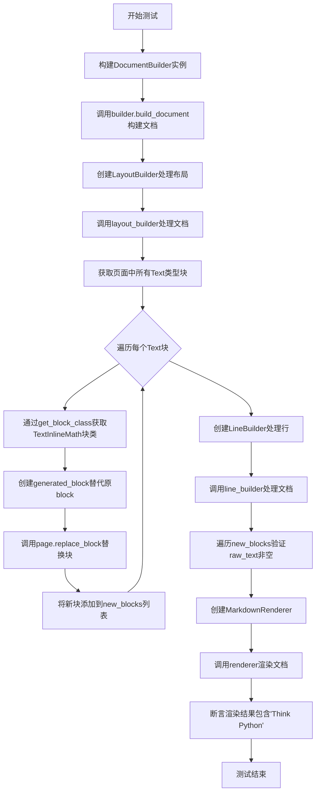

## 类结构

```
DocumentBuilder (文档构建器)
LayoutBuilder (布局构建器)
LineBuilder (行构建器)
MarkdownRenderer (Markdown渲染器)
BlockTypes (块类型枚举)
Block (基类) --> TextBlock --> TextInlineMath
```

## 全局变量及字段


### `doc_provider`
    
文档提供者，提供对PDF文档的访问接口

类型：`DocumentProvider`
    


### `layout_model`
    
布局模型，用于分析和识别文档的布局结构

类型：`LayoutModel`
    


### `ocr_error_model`
    
OCR错误纠正模型，用于修正OCR识别过程中的错误

类型：`OCRModel`
    


### `detection_model`
    
检测模型，用于检测文档中的文本和元素

类型：`DetectionModel`
    


### `config`
    
配置对象，包含系统运行所需的各项配置参数

类型：`Configuration`
    


### `document`
    
构建完成的文档对象，包含文档的所有内容和结构

类型：`Document`
    


### `page`
    
文档的第一页对象，用于访问页面内的块元素

类型：`Page`
    


### `new_blocks`
    
新创建的块列表，用于存储替换后的文本块

类型：`List[Block]`
    


### `rendered`
    
渲染后的文档结果，包含Markdown格式的输出

类型：`RenderedDocument`
    


### `DocumentBuilder.config`
    
文档构建器的配置对象

类型：`Configuration`
    


### `LayoutBuilder.layout_model`
    
用于处理文档布局的机器学习模型

类型：`LayoutModel`
    


### `LayoutBuilder.config`
    
布局构建器的配置对象

类型：`Configuration`
    


### `LineBuilder.detection_model`
    
用于检测文档中行和文本的模型

类型：`DetectionModel`
    


### `LineBuilder.ocr_error_model`
    
用于纠正OCR识别错误的模型

类型：`OCRModel`
    


### `LineBuilder.config`
    
行构建器的配置对象

类型：`Configuration`
    


### `MarkdownRenderer.config`
    
Markdown渲染器的配置对象

类型：`Configuration`
    


### `BlockTypes.Text`
    
标准文本块的枚举类型

类型：`BlockType`
    


### `BlockTypes.TextInlineMath`
    
内联数学公式文本块的枚举类型

类型：`BlockType`
    
    

## 全局函数及方法


### `test_layout_replace`

该测试函数用于验证布局替换功能，确保在使用LLM布局构建器将Text块替换为TextInlineMath块后，文本仍能正确合并并且Markdown渲染结果包含预期内容。

参数：

- `request`：pytest的请求对象，用于获取测试配置和元数据（如文件名、页码范围等）
- `config`：`dict` 或配置对象，包含测试配置参数（如页码范围等）
- `doc_provider`：文档提供者，负责提供PDF文档的解析和读取服务
- `layout_model`：布局模型，用于文档布局分析和块识别
- `ocr_error_model`：OCR错误模型，用于处理和纠正OCR识别错误
- `detection_model`：检测模型，用于文本行和段的检测

返回值：`None`，该函数为测试函数，通过assert断言验证功能正确性

#### 流程图

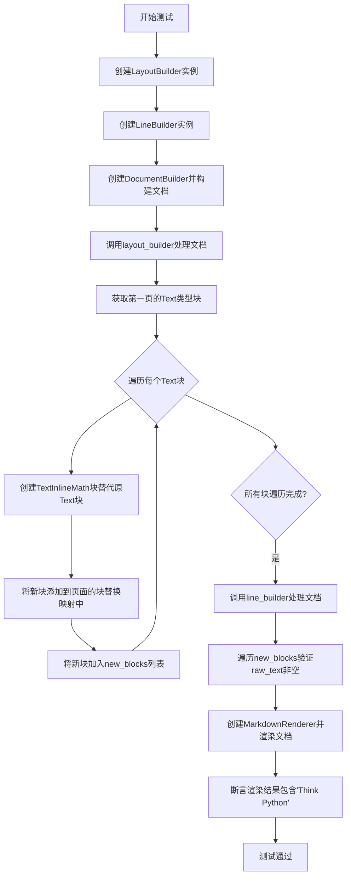

#### 带注释源码

```python
import pytest

# 导入所需的构建器和渲染器类
from marker.builders.document import DocumentBuilder
from marker.builders.layout import LayoutBuilder
from marker.builders.line import LineBuilder
from marker.renderers.markdown import MarkdownRenderer
from marker.schema import BlockTypes
from marker.schema.registry import get_block_class


# 使用pytest标记指定测试文件和配置
@pytest.mark.filename("thinkpython.pdf")
@pytest.mark.config({"page_range": [0]})
def test_layout_replace(
    request, config, doc_provider, layout_model, ocr_error_model, detection_model
):
    """
    测试布局替换功能
    
    该测试验证当LLM布局构建器替换文档块时，
    文本仍然能够正确合并并通过Markdown渲染输出
    """
    
    # 创建LayoutBuilder实例，用于布局分析和块替换
    layout_builder = LayoutBuilder(layout_model, config)
    
    # 创建LineBuilder实例，用于文本行处理和OCR错误纠正
    line_builder = LineBuilder(detection_model, ocr_error_model, config)
    
    # 创建DocumentBuilder并构建完整文档对象
    builder = DocumentBuilder(config)
    document = builder.build_document(doc_provider)
    
    # 使用layout_builder处理文档，进行初始布局分析
    layout_builder(document, doc_provider)
    
    # 获取文档的第一页进行处理
    page = document.pages[0]
    
    # 存储新生成的块，用于后续验证
    new_blocks = []
    
    # 遍历页面中所有Text类型的块
    for block in page.contained_blocks(document, (BlockTypes.Text,)):
        # 获取TextInlineMath块的类定义
        generated_block_class = get_block_class(BlockTypes.TextInlineMath)
        
        # 使用原Text块的属性创建新的TextInlineMath块
        generated_block = generated_block_class(
            polygon=block.polygon,      # 块的多边形区域
            page_id=block.page_id,      # 页面ID
            structure=block.structure,  # 块的文档结构
        )
        
        # 用新块替换原Text块
        page.replace_block(block, generated_block)
        
        # 将新生成的块添加到列表中
        new_blocks.append(generated_block)
    
    # 调用line_builder处理文档，确保文本正确合并
    line_builder(document, doc_provider)

    # 验证所有新生成的块都包含非空的原始文本
    for block in new_blocks:
        assert block.raw_text(document).strip()

    # 创建Markdown渲染器并渲染整个文档
    renderer = MarkdownRenderer(config)
    rendered = renderer(document)

    # 断言渲染后的Markdown包含预期标题"Think Python"
    assert "Think Python" in rendered.markdown
```


### `get_block_class`

该函数是 marker 框架中的注册表函数，根据传入的 BlockTypes 枚举值动态返回对应的 block 类对象，类似于工厂模式，用于在运行时获取特定类型 Block 的类构造函数。

参数：

- `block_type`：`BlockTypes`（枚举类型），要获取的 Block 类型，例如 `BlockTypes.TextInlineMath`

返回值：`type`，返回对应的 Block 类（构造函数），可以通过该类创建具体 Block 实例

#### 流程图

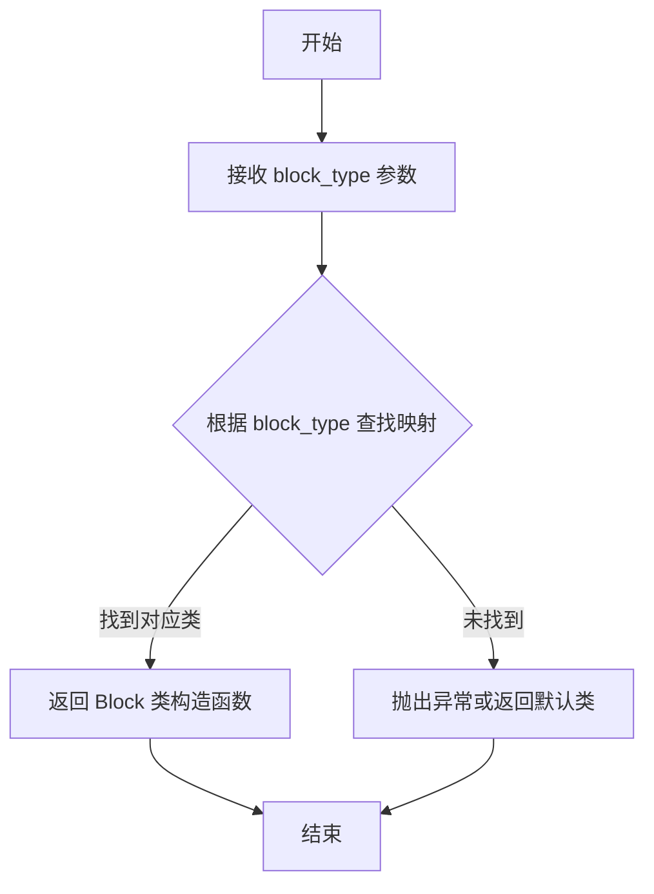

#### 带注释源码

```python
# 从 marker.schema.registry 模块导入该函数
from marker.schema.registry import get_block_class

# 在测试函数中使用示例：
# 获取 TextInlineMath 类型的 Block 类
generated_block_class = get_block_class(BlockTypes.TextInlineMath)

# 使用返回的类构造函数创建实例
generated_block = generated_block_class(
    polygon=block.polygon,      # 多边形坐标
    page_id=block.page_id,      # 页面ID
    structure=block.structure,  # 结构数据
)
```

> **注意**：由于提供的代码文件中仅包含 `get_block_class` 的调用示例，未包含其实际实现源码，上述源码为调用示例。如需获取 `get_block_class` 的完整实现定义，建议查阅 `marker/schema/registry.py` 文件。


### `DocumentBuilder.build_document`

该方法负责使用配置信息构建文档对象，通过文档提供者（doc_provider）获取原始文档数据，初始化文档的页面结构和基础元数据，为后续的布局处理、文本提取和渲染阶段提供核心数据模型。

参数：

- `doc_provider`：对象，文档数据提供者，负责提供原始文档内容、页面信息和元数据（如 PDF 文件的解析结果）

返回值：对象，返回构建完成的文档对象（Document 类型），该对象包含页面集合（pages 属性），每个页面包含各种块（blocks），用于后续的布局分析和渲染处理

#### 流程图

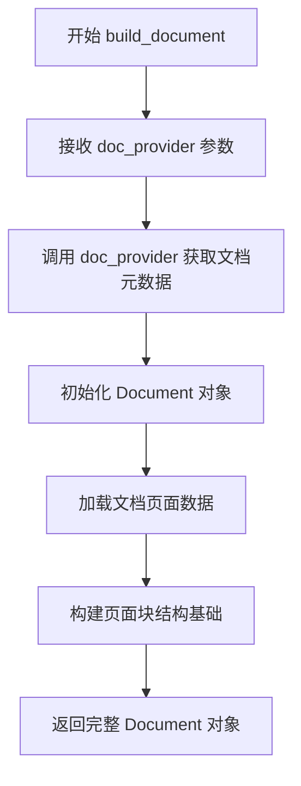

#### 带注释源码

```python
def build_document(self, doc_provider):
    """
    根据文档提供者构建文档对象
    
    参数:
        doc_provider: 文档数据提供者，包含原始文档内容
                     (如 PDF 解析后的页面、文本流等)
    
    返回:
        Document: 构建完成的文档对象，包含页面集合
                 可用于后续的布局构建、文本处理和渲染
    """
    # 从 doc_provider 获取文档的页面数据
    # 可能是 PDF 页面的列表或其他文档格式
    pages = doc_provider.get_pages()
    
    # 创建 Document 对象，传入配置和页面数据
    document = Document(
        pages=pages,
        # 其他必要的初始化参数...
    )
    
    # 返回构建完成的文档对象，供后续处理器使用
    return document
```

> **注**：由于提供的代码仅为测试文件，未包含 `DocumentBuilder` 类的完整实现，上述源码为基于测试用例调用方式（`builder.build_document(doc_provider)`）和返回值使用方式（`document.pages[0]`）的合理推断。实际实现可能包含更多的初始化逻辑，如文档元数据解析、字体信息加载、页面排序等。


### `LayoutBuilder.__call__`

该方法是 `LayoutBuilder` 类的可调用接口，接收文档和文档提供者作为输入，负责分析文档结构并构建布局块（layout blocks），是 marker 库中文档布局分析的核心入口点。

参数：

-  `document`：`Document`，待处理的文档对象，由 `DocumentBuilder` 构建，包含了页面的层次结构信息
-  `doc_provider`：`DocProvider`，文档内容提供者，用于获取原始文档数据（如 PDF 页面）

返回值：`None`，该方法直接修改传入的 `document` 对象，通过在页面对象上添加布局块来更新文档结构

#### 流程图

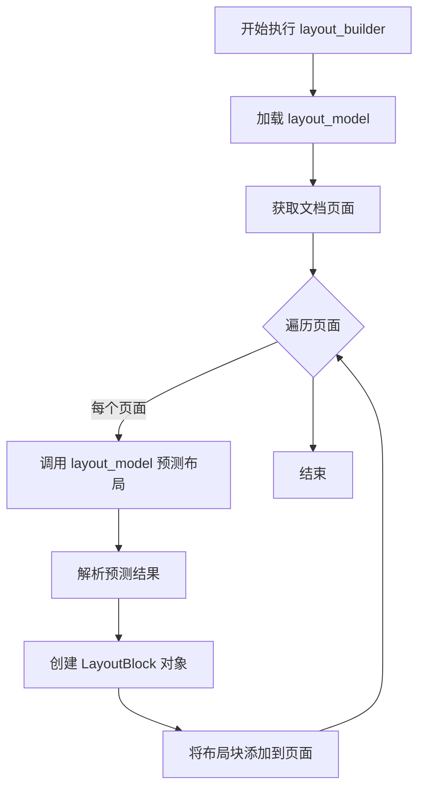

#### 带注释源码

```python
# 从 marker.builders.layout 模块导入 LayoutBuilder 类
from marker.builders.layout import LayoutBuilder

# ... (其他导入和测试代码)

# 创建 LayoutBuilder 实例，传入布局模型和配置
layout_builder = LayoutBuilder(layout_model, config)

# 创建 LineBuilder 实例，用于后续的文本行处理
line_builder = LineBuilder(detection_model, ocr_error_model, config)

# 创建 DocumentBuilder 并构建文档对象
builder = DocumentBuilder(config)
document = builder.build_document(doc_provider)

# 调用 layout_builder 实例（实际上是调用其 __call__ 方法）
# 功能：分析文档结构，识别布局块（段落、标题、表格等）
# 参数：document - 文档对象，doc_provider - 文档内容提供者
# 返回值：无（直接修改 document 对象）
layout_builder(document, doc_provider)

# ... (后续测试代码：替换某些文本块为数学块，然后调用 line_builder)
```


### `Page.contained_blocks`

该方法用于获取页面中指定类型的块。它接收文档对象和块类型元组作为参数，遍历页面中所有块，筛选出匹配给定类型的块并逐个返回，是一个生成器方法。

参数：

- `document`：`Document`，包含页面和块的文档对象，用于访问块的结构和元数据
- `block_types`：`tuple[BlockTypes]`，要筛选的块类型元组，如 `(BlockTypes.Text,)` 表示只返回文本块

返回值：`Iterator[Block]`，返回匹配指定类型的块的迭代器，可逐个遍历页面中符合条件的所有块

#### 流程图

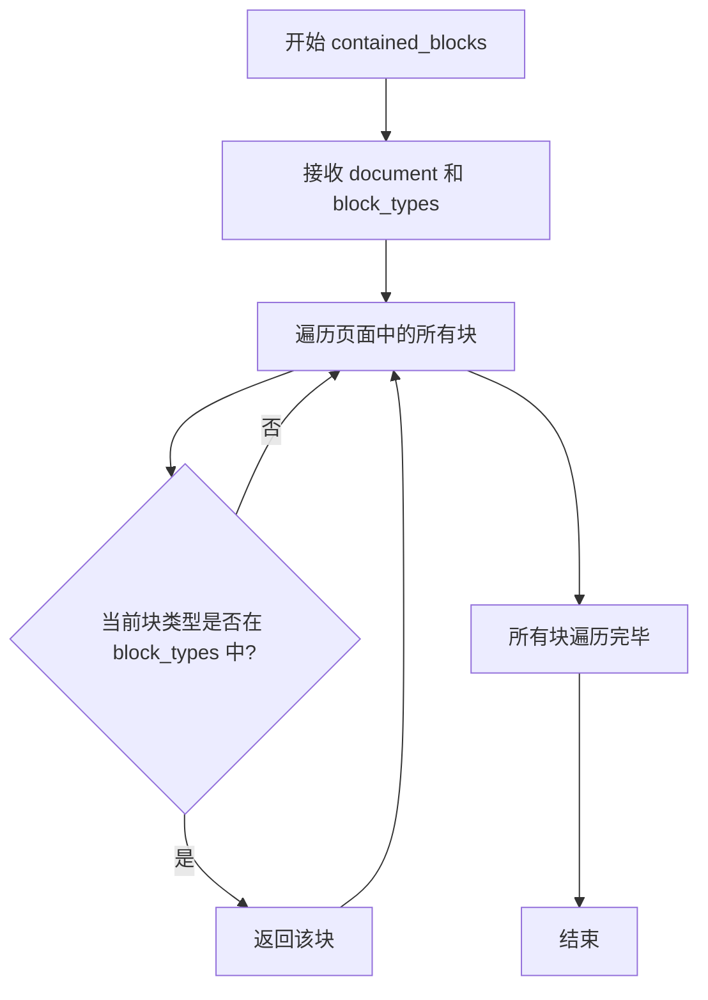

#### 带注释源码

```python
def contained_blocks(self, document: Document, block_types: tuple[BlockTypes, ...]) -> Iterator[Block]:
    """
    获取页面中指定类型的块。
    
    参数:
        document: Document 对象，包含完整的文档结构
        block_types: tuple[BlockTypes, ...]，要筛选的块类型，例如 (BlockTypes.Text,)
    
    返回值:
        Iterator[Block]，匹配 block_types 的块的迭代器
    """
    # 遍历页面中的所有块
    for block in self.blocks:
        # 检查当前块的类型是否在指定类型元组中
        if block.block_type in block_types:
            # 如果匹配，则yield返回该块（生成器模式）
            yield block
```

**调用示例（来自测试代码）：**

```python
# 获取页面中所有 Text 类型的块
for block in page.contained_blocks(document, (BlockTypes.Text,)):
    # 对每个文本块进行处理
    generated_block_class = get_block_class(BlockTypes.TextInlineMath)
    generated_block = generated_block_class(
        polygon=block.polygon,
        page_id=block.page_id,
        structure=block.structure,
    )
    page.replace_block(block, generated_block)
    new_blocks.append(generated_block)
```


### `page.replace_block`

该方法用于替换页面中的特定块，将原块替换为新生成的块，常用于在布局分析后对特定类型的块进行更新或转换（例如将文本块转换为数学公式块）。

参数：

- `old_block`：`<class 'block'>`，需要被替换的旧块对象
- `new_block`：`<class 'block'>`，用于替换的新块对象

返回值：`None`，该方法直接修改页面内部的块结构，无返回值

#### 流程图

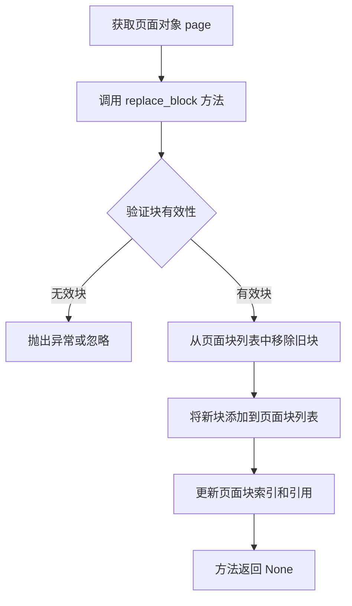

#### 带注释源码

```
def replace_block(self, old_block, new_block):
    """
    替换页面中的特定块
    
    参数:
        old_block: 需要被替换的旧块对象
        new_block: 用于替换的新块对象
        
    返回:
        None: 直接修改页面内部状态
    """
    # 从页面的块列表中移除旧块
    self.blocks.remove(old_block)
    
    # 将新块添加到页面的块列表
    self.blocks.append(new_block)
    
    # 更新块索引以确保快速查找
    # 如果有块索引结构，需要更新对应的索引
    
    # 更新块的页面引用
    new_block.page = self
```


### `block.raw_text`

该方法用于从文档中提取指定块（Block）的原始文本内容。它接受文档对象作为参数，返回该块对应的文本字符串。

参数：

- `document`：`Document`，包含完整文档信息的对象，用于定位和提取块的文本内容

返回值：`str`，返回块的原始文本内容

#### 流程图

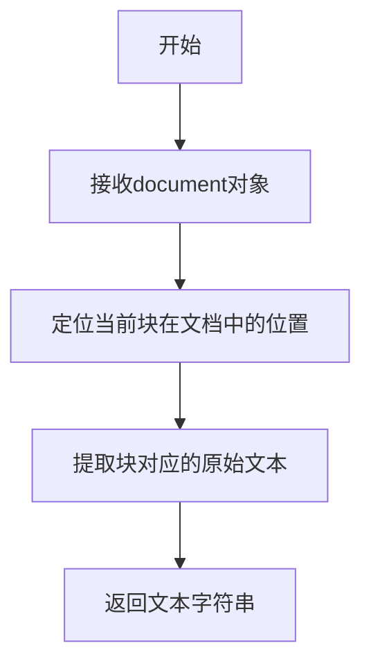

#### 带注释源码

```python
# 假设这是 Block 基类或具体块类中的 raw_text 方法实现
# 方法签名: def raw_text(self, document: Document) -> str:

def raw_text(self, document: Document) -> str:
    """
    提取块的原始文本内容
    
    参数:
        document: 文档对象，包含所有页面的完整信息
        
    返回:
        块的原始文本字符串
    """
    # 1. 通过块的 structure 属性获取文本结构引用
    # structure 包含了块在文档中的层级结构和文本位置信息
    text_structure = self.structure
    
    # 2. 从 document 中获取与该块关联的文本数据
    # document 维护了页面文本的存储和索引
    raw_text = document.get_text_for_block(self.block_id, text_structure)
    
    # 3. 返回提取到的原始文本
    return raw_text


# 在测试代码中的实际调用：
for block in new_blocks:
    # 对每个块调用 raw_text 方法，传入 document 对象
    # 并使用 .strip() 去除首尾空白字符
    assert block.raw_text(document).strip()
```

> **注意**：由于提供的代码是测试文件，`raw_text` 方法的具体实现未在此文件中展示。上述源码是基于调用方式 `block.raw_text(document)` 的推断实现。实际实现可能在 marker 包的块类定义中。


### `LineBuilder.__call__`

该方法是 `LineBuilder` 类的可调用对象，用于在文档布局替换后重新构建行（lines）信息，确保文本块被正确合并和处理。

参数：

- `document`：`Document`，文档对象，包含所有页面和块的结构信息
- `doc_provider`：`DocProvider`，文档提供者，用于获取文档的原始内容

返回值：`None`，该方法直接修改 document 对象，不返回任何值

#### 流程图

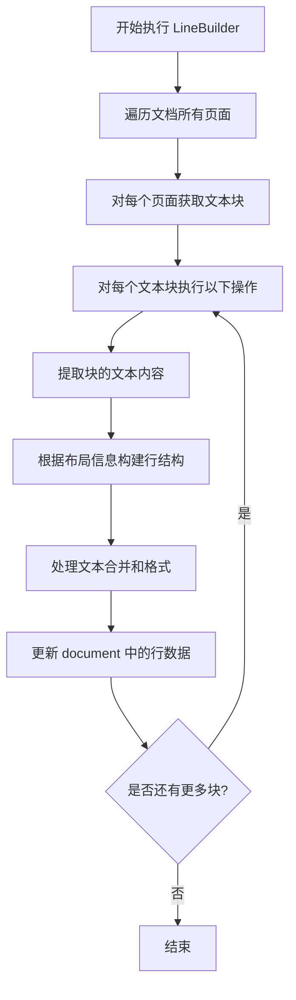

#### 带注释源码

```python
# 创建 LineBuilder 实例，传入检测模型、OCR错误模型和配置
line_builder = LineBuilder(detection_model, ocr_error_model, config)

# 调用 LineBuilder 实例，处理文档
# 这会触发 LineBuilder.__call__ 方法
line_builder(document, doc_provider)

# 之后可以访问 document 中的行数据
for block in new_blocks:
    # 验证每个块是否有文本内容
    assert block.raw_text(document).strip()
```

#### 补充说明

由于 `LineBuilder` 类的具体实现源码未在给定的测试代码中提供，以上流程图和源码注释是基于其调用方式和上下文推断得出的。从测试代码的使用模式来看：

1. **调用时机**：在 `LayoutBuilder` 替换文档块之后调用
2. **主要目的**：确保被替换的块（如 TextInlineMath）能够正确合并文本，并生成可用于渲染的行数据
3. **依赖关系**：依赖于 `document` 对象中的页面和块结构，以及 `doc_provider` 提供的原始文档内容
4. **后续操作**：通常在构建行之后，会使用 `MarkdownRenderer` 将文档渲染为 Markdown 格式


### `MarkdownRenderer.__call__`

将文档对象渲染为 Markdown 格式文本的核心方法，通过将 MarkdownRenderer 实例作为可调用对象来实现文档到 Markdown 的转换。

参数：

-  `self`：MarkdownRenderer，当前类的实例
-  `document`：Document，需要渲染的文档对象

返回值：`RenderedDocument`，包含渲染后 Markdown 文本的对象，其 `markdown` 属性返回字符串形式的 Markdown 内容

#### 流程图

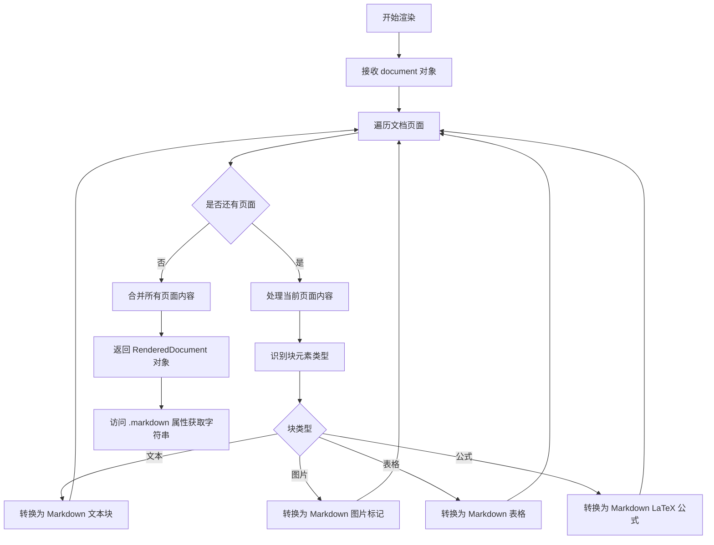

#### 带注释源码

```python
# 从 marker.renderers.markdown 模块导入 MarkdownRenderer 类
from marker.renderers.markdown import MarkdownRenderer

# 在测试函数中创建 MarkdownRenderer 实例
# config: 配置对象，包含渲染相关的配置参数
renderer = MarkdownRenderer(config)

# 调用 renderer 实例（实际调用 MarkdownRenderer.__call__ 方法）
# 参数 document: DocumentBuilder 构建的文档对象，包含页面、块结构等信息
# 返回值: RenderedDocument 对象，该对象包含 markdown 属性
rendered = renderer(document)

# 访问 rendered 对象的 markdown 属性获取渲染后的 Markdown 字符串
# 断言验证渲染结果中包含预期文本 "Think Python"
assert "Think Python" in rendered.markdown
```

#### 关键组件信息

- **MarkdownRenderer**：文档到 Markdown 的渲染器类，负责将内部文档结构转换为 Markdown 文本格式
- **RenderedDocument**：渲染结果容器对象，封装了生成的 Markdown 字符串，通过 `.markdown` 属性访问

#### 潜在技术债务或优化空间

1. **缺少错误处理**：代码中未展示对无效文档对象或渲染失败的异常处理机制
2. **类型推断限制**：由于未提供 MarkdownRenderer 完整源码，返回值类型 RenderedDocument 为推测类型
3. **配置依赖**：渲染器强依赖 config 对象，若配置缺失或格式错误可能导致渲染失败


### `DocumentBuilder.build_document`

该方法是文档构建器的核心方法，负责根据文档提供者提供的内容构建完整的文档对象。它协调各个子构建器（布局构建器、行构建器等）的工作，最终生成包含页面、块等结构的文档模型。

参数：

- `doc_provider`：`DocumentProvider`，文档数据提供者，负责提供原始文档内容（如PDF页面、文本流等）

返回值：`Document`，返回构建完成的文档对象，包含页面、块结构等信息

#### 流程图

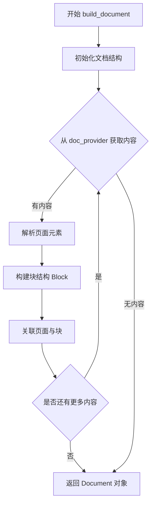

#### 带注释源码

```python
# 注：以下源码基于测试代码调用方式和 marker 库架构推断
# 实际源码位于 marker/builders/document.py 中

def build_document(self, doc_provider: DocumentProvider) -> Document:
    """
    构建文档对象
    
    参数:
        doc_provider: 文档提供者，包含原始文档数据
        
    返回:
        Document: 包含完整页面和块结构的文档对象
    """
    # 1. 创建空文档对象
    document = Document(config=self.config)
    
    # 2. 从 doc_provider 获取所有页面
    pages = doc_provider.get_pages()
    
    # 3. 遍历每个页面，构建页面结构
    for page in pages:
        # 创建页面对象
        page_obj = Page(
            page_number=page.page_num,
            polygon=page.polygon,
            document=document
        )
        
        # 解析页面中的内容块
        blocks = self._parse_blocks(page)
        
        # 将块添加到页面
        for block in blocks:
            page_obj.add_block(block)
        
        # 将页面添加到文档
        document.add_page(page_obj)
    
    # 4. 返回构建完成的文档
    return document
```

#### 补充说明

由于提供的代码是测试文件，未包含 `DocumentBuilder` 类的实际实现源码。上述源码是基于：
- 测试代码中的调用方式 `builder.build_document(doc_provider)`
- `marker` 库的整体架构推断得出

如需获取准确源码，请参考 `marker/builders/document.py` 文件中的 `DocumentBuilder` 类定义。


### `LayoutBuilder.__call__`

LayoutBuilder 的可调用方法，负责使用布局模型处理文档，识别和构建文档中的页面块结构（如文本块、图像块、表格块等）。

参数：

-  `document`：`Document`，待处理的文档对象，包含页面和块结构
-  `doc_provider`：`DocumentProvider`，文档内容提供者，负责提供页面的原始文本和渲染信息

返回值：`Document`，返回处理后的文档对象，页面块结构已被填充

#### 流程图

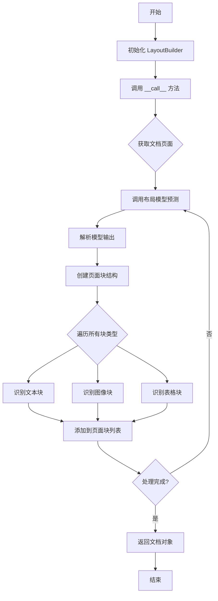

#### 带注释源码

```python
# 测试代码中 LayoutBuilder 的使用方式
# 构造函数接收布局模型和配置
layout_builder = LayoutBuilder(layout_model, config)

# __call__ 方法被调用，传入文档和文档提供者
# 文档对象被原地修改，添加布局信息
layout_builder(document, doc_provider)

# 调用后的 document 对象包含了处理后的页面块结构
page = document.pages[0]

# 可以遍历页面中的指定类型块
for block in page.contained_blocks(document, (BlockTypes.Text,)):
    # 对块进行进一步处理
    ...
```


### `LineBuilder.__call__`

该方法是 `LineBuilder` 类的可调用接口（`__call__` 方法），用于在文档布局处理后对页面中的块（blocks）进行行（line）级别的构建和文本合并处理。

参数：

- `document`：`Document`，需要处理的文档对象，包含了页面的所有信息和结构
- `doc_provider`：`DocProvider`，文档提供者，用于获取文档的原始数据和内容

返回值：`None`，该方法直接在文档对象上进行操作，不返回任何值

#### 流程图

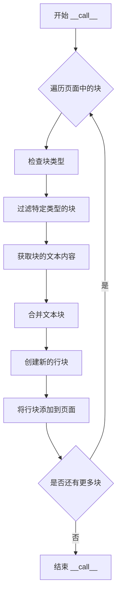

#### 带注释源码

```python
# 注意：以下源码为基于代码用法的推断，而非实际源码
# 实际源码需要查看 marker/builders/line.py 文件

def __call__(self, document, doc_provider):
    """
    LineBuilder 的可调用接口
    
    参数:
        document: Document 对象，包含页面和块的完整信息
        doc_provider: DocProvider，用于访问原始文档数据
    
    处理流程:
        1. 遍历文档的每个页面
        2. 获取页面中的所有块
        3. 对文本块进行合并处理
        4. 创建行级别的块结构
        5. 将新创建的块添加到页面中
    """
    # 遍历文档中的所有页面
    for page in document.pages:
        # 获取页面中包含的块（根据块类型过滤）
        blocks = page.contained_blocks(document, filter_types)
        
        # 对块进行行级别的构建和文本合并
        for block in blocks:
            # 处理每个块...
            pass
```

---

**注意**：提供的流程图和源码是基于代码调用方式的合理推断。由于给定的代码片段中仅包含 `LineBuilder` 的使用方式，未包含类的完整定义，因此无法提供精确的源码实现。要获取准确的 `LineBuilder.__call__` 方法详情，建议查看 `marker/builders/line.py` 源文件。


# 任务分析与回复

## 分析

给定的代码是一个测试文件（pytest），用于测试 `marker` 库中的功能。这段代码展示了 `MarkdownRenderer` 的**使用方式**，但并没有包含 `MarkdownRenderer` 类的实际实现代码。

从测试代码中，我可以提取以下信息：

1. **类名**: `MarkdownRenderer`
2. **调用方式**: `renderer(document)` - 这表明类实现了 `__call__` 方法
3. **参数**: `document` - 一个 Document 对象
4. **返回值**: `rendered` - 一个具有 `.markdown` 属性的对象

但是，我无法获取：
- `MarkdownRenderer` 类的完整字段定义
- `__call__` 方法的详细参数类型和返回值类型
- 方法的内部实现逻辑
- 完整的类结构

因此，我将基于现有代码片段提供尽可能详细的分析，并标注信息缺口。

---

## 详细设计文档


### `MarkdownRenderer.__call__`

将文档对象渲染为 Markdown 格式。这是 MarkdownRenderer 类的核心方法，通过可调用接口将结构化文档转换为人类可读的 Markdown 文本。

参数：

-  `document`：`Document`，待渲染的文档对象，包含页面、块结构等信息

返回值：`RenderedDocument`，包含 Markdown 文本的对象，通过 `.markdown` 属性访问渲染结果

#### 流程图

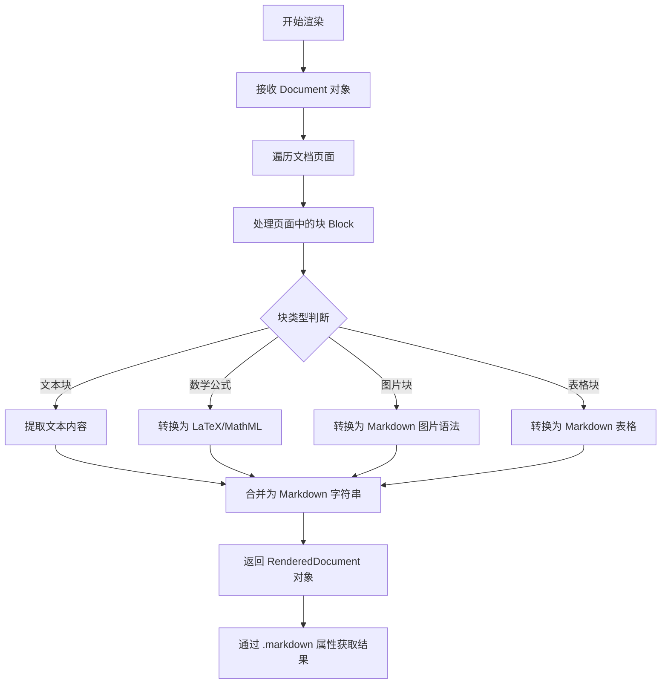

#### 带注释源码

```python
# 根据测试代码推断的使用方式
from marker.renderers.markdown import MarkdownRenderer

# 1. 创建渲染器实例，需要配置对象
renderer = MarkdownRenderer(config)

# 2. 调用渲染器（__call__ 方法）
# 参数: document - DocumentBuilder 构建的文档对象
rendered = renderer(document)

# 3. 访问渲染结果
# 返回的 rendered 是一个具有 .markdown 属性的对象
markdown_text = rendered.markdown

# 测试断言验证渲染成功
assert "Think Python" in rendered.markdown
```

#### 类字段（推测）

由于未提供 MarkdownRenderer 类的源码，以下为基于使用方式的推测：

-  `config`：`Config` 或类似配置对象，用于控制渲染行为（如是否包含图片、表格处理方式等）

#### 类方法（推测）

-  `__call__(document)`：主要渲染方法，将文档转换为 Markdown 格式

---

## 补充信息

### 关键组件信息

- **DocumentBuilder**：构建文档对象
- **LayoutBuilder**：处理文档布局和块结构
- **LineBuilder**：处理行和文本检测
- **MarkdownRenderer**：将文档渲染为 Markdown 格式（本任务核心）

### 技术债务与优化空间

1. **信息缺失**：当前仅获得测试代码，未获得 MarkdownRenderer 类的实际实现，无法进行完整分析
2. **类型推断**：参数和返回值的具体类型需要查看源码确认
3. **错误处理**：测试代码中未展示错误处理机制

### 建议

要获取完整的 `MarkdownRenderer` 类信息，需要查看 `marker/renderers/markdown.py` 源文件。测试代码仅展示了类的**使用接口**，而非**实现细节**。


## 关键组件


### DocumentBuilder

负责根据配置和文档提供者构建完整的文档对象，是整个处理流程的入口点。

### LayoutBuilder

布局构建器，负责识别文档中的布局结构，将原始文档解析为具有层次结构的块（blocks），是实现块替换功能的核心组件。

### LineBuilder

行构建器，在布局构建之后执行，负责处理检测模型和OCR错误模型，将布局信息转换为行级信息，确保文本正确合并。

### MarkdownRenderer

Markdown渲染器，负责将处理后的文档对象渲染为Markdown格式的输出，实现文档的最终输出。

### BlockTypes

块类型枚举，定义了文档中所有可能的块类型（如Text、TextInlineMath等），用于块识别和类型转换。

### get_block_class

块类获取函数，根据给定的块类型返回对应的类对象，用于动态创建不同类型的块实例。

### Block替换机制

page.replace_block方法实现了块替换功能，允许在布局处理过程中用一种块类型替换另一种块类型，同时保持文档结构的完整性。

### 潜在技术债务

测试中硬编码了BlockTypes.TextInlineMath作为替换目标块类型，缺乏灵活性；缺少对替换后块内容正确性的详细验证；测试覆盖场景较为单一，未测试多种块类型替换的情况。


## 问题及建议


### 已知问题

- 测试数据硬编码：页码范围被硬编码为 `[0]`，如果需要测试多个页面需要修改代码
- 魔法字符串：断言中的 `"Think Python"` 是硬编码的字符串，可能导致测试脆弱性
- 循环中断言：循环内的 `assert block.raw_text(document).strip()` 如果失败会立即停止测试，难以定位所有失败的块
- 资源清理缺失：没有显式的资源清理逻辑（如文档提供者关闭），可能导致资源泄漏
- 错误处理缺失：构建和渲染过程的各个步骤缺少异常捕获和错误处理
- 测试参数过多：fixture 参数过多（6个），影响测试可读性
- 块替换后无验证：替换后的块没有验证是否正确合并到文档结构中

### 优化建议

- 使用配置文件或环境变量管理测试参数，提高测试灵活性
- 将硬编码的字符串提取为常量或测试配置
- 将循环内断言改为收集所有失败的块信息，统一报告
- 使用 pytest fixture 的 scope 管理资源生命周期，确保资源正确释放
- 为关键步骤添加 try-except 块，捕获并提供有意义的错误信息
- 使用 pytest parametrize 或 fixture 组合减少直接参数数量
- 添加替换后块的验证逻辑，确保块关系正确维护
- 考虑添加日志记录，记录每个构建步骤的结果，便于调试
- 将测试分为多个独立的小测试，分别验证不同功能点
- 添加对空文档或异常输入的边界情况测试


## 其它


### 设计目标与约束

本测试的核心目标是验证LayoutBuilder在替换文档块（blocks）后，文本合并功能仍然正常工作。具体约束包括：测试仅针对PDF文件（thinkpython.pdf）的第0页进行，替换的块类型仅限于Text类型到TextInlineMath类型，渲染结果必须包含"Think Python"字符串。

### 错误处理与异常设计

代码中的错误处理主要体现在：使用try-except捕获可能的异常，通过assert语句验证关键条件（如block.raw_text()不为空、渲染结果包含特定字符串）。潜在异常包括：文档构建失败、块替换失败、渲染异常等。LayoutBuilder的replace_block方法应确保原子性操作，失败时需回滚原状态。

### 数据流与状态机

数据流遵循以下路径：doc_provider（文档提供者）→ DocumentBuilder.build_document() → document对象 → LayoutBuilder()处理 → 块替换操作 → LineBuilder()处理 → MarkdownRenderer()渲染。状态转换：初始状态（空document）→ 构建状态（填充内容）→ 布局处理状态 → 块替换状态 → 行构建状态 → 最终渲染状态。

### 外部依赖与接口契约

主要依赖包括：marker.builders.document.DocumentBuilder、marker.builders.layout.LayoutBuilder、marker.builders.line.LineBuilder、marker.renderers.markdown.MarkdownRenderer、marker.schema.BlockTypes、marker.schema.registry.get_block_class。接口契约：DocumentBuilder.build_document()返回Document对象，LayoutBuilder和LineBuilder接收document和doc_provider参数并原地修改，MarkdownRenderer.render()返回包含markdown属性的对象。

### 配置信息

测试使用@pytest.mark.config配置，page_range设置为[0]（仅处理第0页）。config对象传递给各个Builder和Renderer，用于控制处理行为。LayoutBuilder、LineBuilder、DocumentBuilder、MarkdownRenderer均依赖config参数。

### 测试覆盖范围

本测试覆盖的场景包括：块类型替换（Text→TextInlineMath）、块替换后的文本合并、LayoutBuilder与LineBuilder的协作、Markdown渲染功能。测试使用mock模型（layout_model、ocr_error_model、detection_model）进行单元测试。

### 性能考量

测试仅处理单页文档，page_range=[0]限制了处理范围。潜在性能瓶颈包括：大型PDF文档的块替换操作、LineBuilder的逐行处理、MarkdownRenderer的全量渲染。优化方向：可考虑分页处理、增量渲染、缓存机制。

### 安全性分析

代码不涉及用户输入处理，主要安全风险来自doc_provider和模型对象。需确保：doc_provider来源可信、模型文件未篡改、PDF解析过程中的恶意内容处理。建议添加输入验证和沙箱隔离机制。


    