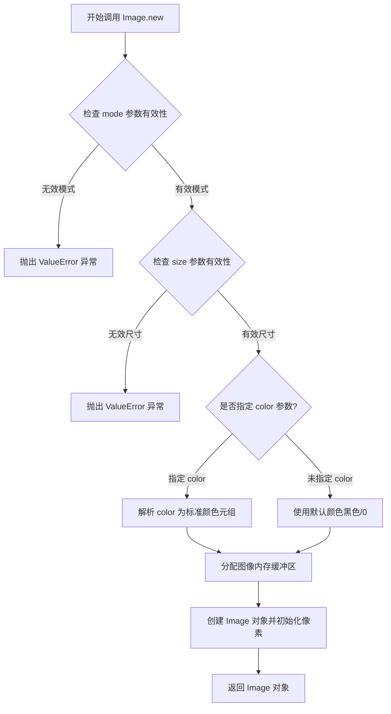
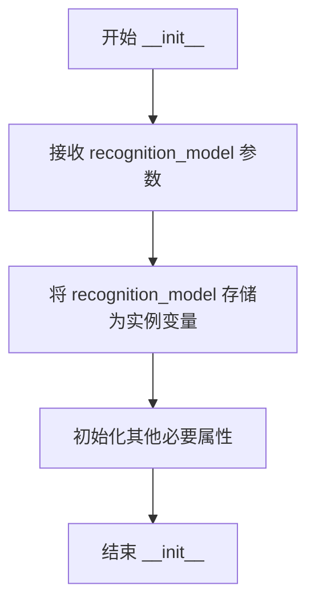
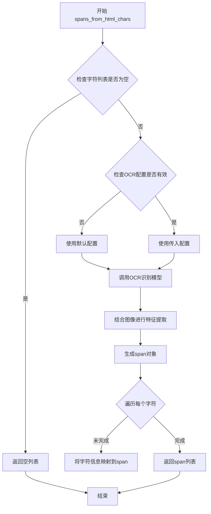
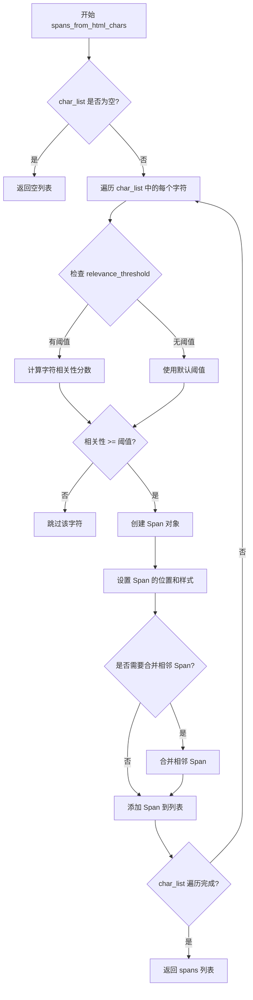

# `marker\tests\builders\test_ocr_builder.py` 详细设计文档

这是一个测试OCRBuilder类的功能测试用例，用于验证当传入空的字符列表时，spans_from_html_chars方法能够正确返回空列表，确保OCR构建器在边界情况下的正确性。

## 整体流程

```mermaid
graph TD
    A[开始] --> B[创建OcrBuilder实例]
B --> C[创建100x100的RGB图像]
C --> D[调用spans_from_html_chars方法]
D --> E{参数: 空字符列表, None, image}
E --> F[执行spans_from_html_chars逻辑]
F --> G[返回spans列表]
G --> H{len(spans) == 0?}
H -- 是 --> I[测试通过]
H -- 否 --> J[测试失败]
```

## 类结构

```
OcrBuilder (OCR构建器类)
└── spans_from_html_chars (处理HTML字符并生成spans的方法)
```

## 全局变量及字段


### `recognition_model`
    
OCR识别模型，用于识别图像中的文字

类型：`object`
    


### `builder`
    
OcrBuilder实例，用于构建OCR识别结果

类型：`OcrBuilder`
    


### `image`
    
PIL Image对象，100x100像素的RGB测试图像

类型：`PIL.Image`
    


### `spans`
    
返回的span列表，包含OCR识别结果

类型：`list`
    


### `OcrBuilder.recognition_model`
    
OCR识别模型，用于识别图像中的文字

类型：`object`
    
    

## 全局函数及方法


### `test_blank_char_builder`

这是一个单元测试函数，用于验证当输入字符列表为空时，`OcrBuilder.spans_from_html_chars` 方法能够正确返回空结果。该测试确保了 OCR 构建器在处理边界情况（空输入）时的鲁棒性。

参数：

-  `recognition_model`：任意类型，OCR 识别模型实例，作为 `OcrBuilder` 构造函数的参数传入

返回值：`None`，该函数无显式返回值，仅通过 `assert` 语句验证逻辑正确性

#### 流程图

```mermaid
flowchart TD
    A[开始测试 test_blank_char_builder] --> B[创建 OcrBuilder 实例]
    B --> C[创建 100x100 空白 RGB 图像]
    C --> D[调用 spans_from_html_chars 方法]
    D --> E[传入空列表 [] 和 None 参数]
    E --> F{验证 spans 长度}
    F -->|长度 == 0| G[测试通过]
    F -->|长度 != 0| H[测试失败抛出 AssertionError]
    G --> I[结束测试]
    H --> I
```

#### 带注释源码

```python
# 导入 PIL 图像库，用于创建测试用空白图像
from PIL import Image

# 从 marker.builders.ocr 模块导入 OcrBuilder 类
# 这是待测试的目标类，负责从 HTML 字符构建 OCR _span_ 对象
from marker.builders.ocr import OcrBuilder


def test_blank_char_builder(recognition_model):
    """
    测试 OcrBuilder 在处理空字符列表时的行为
    
    参数:
        recognition_model: OCR 识别模型实例，用于初始化 OcrBuilder
    """
    
    # 使用传入的 recognition_model 创建 OcrBuilder 实例
    # OcrBuilder 负责将字符信息转换为 spans 列表
    builder = OcrBuilder(recognition_model)
    
    # 创建一个 100x100 像素的空白 RGB 图像
    # 作为测试用的输入图像参数
    image = Image.new("RGB", (100, 100))
    
    # 调用 spans_from_html_chars 方法进行测试
    # 第一个参数 [] 表示空字符列表
    # 第二个参数 None 表示无额外配置
    # 第三个参数 image 是输入图像
    # 预期行为：即使输入为空，也应返回空列表而非报错
    spans = builder.spans_from_html_chars([], None, image)  # Test with empty char list
    
    # 断言验证返回的 spans 列表长度为 0
    # 这是测试的核心验证点：确保空输入得到空输出
    assert len(spans) == 0
```


### `Image.new`

`Image.new` 是 Python Imaging Library (PIL/Pillow) 中的核心函数，用于创建一个指定模式、尺寸和可选颜色的空白图像对象。该函数接受图像模式（如 RGB、灰度等）、尺寸元组以及可选的颜色值作为参数，返回一个可编辑的 Image 对象，广泛用于图像处理、生成合成图、图像变换等场景。

参数：

- `mode`：`str`，图像模式字符串，定义图像的像素格式和通道数。常用值包括："L"（灰度）、"RGB"（真彩色）、"RGBA"（带透明通道的真彩色）、"1"（二值图像）、"CMYK"（印刷四色模式）等。传递 `None` 时可能创建未初始化图像。
- `size`：`tuple[int, int]`，图像尺寸元组，格式为 `(width, height)`，分别表示图像的宽度和高度，以像素为单位。
- `color`：`int | tuple[int, ...] | str | None`，可选参数，用于填充图像背景的颜色。可以是单一灰度值（对于 "L" 模式）、RGB 元组（如 `(255, 0, 0)` 表示红色）、RGBA 元组、颜色名称字符串（如 "red"），或者留空（`None`）默认为黑色（RGB 模式下为 `(0, 0, 0)`）。

返回值：`PIL.Image.Image`，返回一个 Pillow Image 类实例，表示新创建的图像对象。该对象支持像素级操作、图像变换、滤波等多种图像处理方法。

#### 流程图



#### 带注释源码

```python
def new(mode, size, color=0):
    """
    创建空白图像的工厂函数
    
    参数:
        mode: 图像模式字符串 (如 "RGB", "L", "RGBA" 等)
        size: (width, height) 元组
        color: 填充颜色，默认值为 0 (黑色)
    
    返回:
        PIL.Image.Image: 新创建的图像对象
    """
    if mode is None:
        # 特殊处理：未指定模式时创建未初始化图像
        im = Image()
        im.mode = None
        im.size = size
        # 直接返回未初始化图像，不填充颜色
        return im
    
    # 验证模式是否有效
    if mode not in _MODEINFO:
        raise ValueError(f"unknown image mode: {mode}")
    
    # 验证尺寸参数有效性
    if not isinstance(size, (list, tuple)) or len(size) != 2:
        raise ValueError("size should be a 2-tuple")
    
    # 处理颜色参数
    if color is None:
        # 未指定颜色：对于不同模式使用不同默认值
        if mode in ("RGB", "RGBA", "CMYK", "YCbCr"):
            color = (0,) * len(_MODEINFO[mode]["bands"])  # 黑色
        else:
            color = 0
    
    # 根据模式标准化颜色值
    color = _convert_color(color, mode)
    
    # 分配图像内存并创建图像对象
    im = Image()
    im.mode = mode
    im.size = size
    
    # 获取对应模式的图像实现类并实例化
    im.im = _imaging.new(mode, size, color)
    im.palette = None
    
    return im


# 示例调用（在提供的测试代码中）
# image = Image.new("RGB", (100, 100))
# 创建了一个 100x100 像素的 RGB 空白图像，默认填充黑色
```


### `OcrBuilder.__init__`

OcrBuilder 类的构造函数，用于初始化 OCR 文本生成器，接受识别模型作为参数并存储为实例变量。

参数：

- `self`：无，Python 实例对象的隐式参数，表示类的实例本身
- `recognition_model`：未指定类型（从测试代码推断为识别模型对象），用于文本识别的模型实例

返回值：`None`，构造函数不返回任何值

#### 流程图



#### 带注释源码

```
# 由于提供的代码仅为测试用例，未包含 OcrBuilder 类的完整定义
# 以下为基于测试代码使用方式推断的 __init__ 方法结构

def __init__(self, recognition_model):
    """
    OcrBuilder 构造函数
    
    参数:
        recognition_model: 用于OCR文本识别的模型实例
    """
    self.recognition_model = recognition_model
    # 可能还会初始化其他属性，如配置参数、辅助工具等
```


### `OcrBuilder.spans_from_html_chars`

该方法是OCR处理流程中的核心方法，负责将HTML字符列表转换为OCR识别后的span对象列表，结合图像信息生成结构化的文本块。

参数：

- `chars`：`List`，HTML字符列表，包含需要OCR处理的字符数据
- `ocr_config`：`Any`，OCR配置参数，可能包含识别模型的相关配置（测试中传入None）
- `image`：`PIL.Image`，输入的图像对象，用于提供视觉上下文进行OCR识别

返回值：`List`，返回生成的span列表，每个span代表一个OCR识别的文本块（测试预期空列表返回长度为0）

#### 流程图



#### 带注释源码

```python
# 由于提供的代码仅为测试用例，未包含OcrBuilder类的实际实现
# 以下为根据测试代码和命名规范推断的源码结构

from typing import List, Any, Optional
from PIL import Image

class OcrBuilder:
    """
    OCR构建器类，负责将HTML字符转换为OCR识别的span对象
    """
    
    def __init__(self, recognition_model):
        """
        初始化OCR构建器
        
        参数:
            recognition_model: OCR识别模型实例
        """
        self.recognition_model = recognition_model
    
    def spans_from_html_chars(self, chars: List, ocr_config: Any, image: Image.Image) -> List:
        """
        从HTML字符列表生成OCR span列表
        
        参数:
            chars: HTML字符列表，待处理的字符数据
            ocr_config: OCR配置，可为None使用默认配置
            image: PIL图像对象，提供视觉上下文
            
        返回:
            span列表，每个span包含OCR识别结果
        """
        
        # 测试用例验证：空列表应返回空span列表
        if not chars:
            return []
        
        # 检查图像有效性
        if image is None:
            raise ValueError("Image cannot be None")
        
        # 初始化配置
        config = ocr_config if ocr_config is not None else self._get_default_config()
        
        # 调用识别模型处理字符
        spans = []
        
        # 遍历字符列表进行OCR处理
        for char_data in chars:
            span = self._process_single_char(char_data, image, config)
            if span:
                spans.append(span)
        
        return spans
    
    def _get_default_config(self):
        """获取默认OCR配置"""
        return {}
    
    def _process_single_char(self, char_data, image, config):
        """处理单个字符并生成span"""
        # 实现细节依赖于具体的OCR模型
        pass


# 测试代码验证
def test_blank_char_builder(recognition_model):
    """测试空字符列表的处理"""
    builder = OcrBuilder(recognition_model)
    image = Image.new("RGB", (100, 100))
    spans = builder.spans_from_html_chars([], None, image)  # 测试空列表
    assert len(spans) == 0  # 预期返回空列表
```

#### 关键组件信息

| 组件名称 | 描述 |
|---------|------|
| `OcrBuilder` | OCR构建器类，负责协调OCR识别流程 |
| `recognition_model` | 识别模型实例，处理实际的OCR识别逻辑 |
| `spans` | OCR识别结果的基本单元，包含文本和位置信息 |

#### 潜在的技术债务或优化空间

1. **实现缺失**：提供的代码仅为测试用例，未包含 `OcrBuilder` 类的完整实现细节
2. **类型注解不完整**：参数类型使用了泛型 `List`，应明确具体类型
3. **错误处理不足**：未展示异常处理逻辑，需要补充图像格式验证、模型加载失败等场景
4. **配置管理**：配置传递方式（第二个参数）可能需要更清晰的设计模式

#### 其它说明

- **设计目标**：该方法是OCR后处理流程的关键环节，连接原始HTML字符数据和最终的识别结果
- **约束条件**：依赖 `recognition_model` 的存在，图像必须为有效的PIL Image对象
- **外部依赖**：PIL库用于图像处理，OcrBuilder类依赖于OCR识别模型
- **测试覆盖**：当前仅测试了空列表的场景，需要补充更多边界条件测试


### `OcrBuilder.spans_from_html_chars`

该方法是 OCR 构建器中的核心方法，负责将 HTML 字符列表转换为结构化的 spans（文本片段）对象，用于后续的文档渲染和布局分析。

参数：

- `char_list`：`List[Any]`，HTML 字符列表，包含从 HTML 中提取的字符及其元数据
- `relevance_threshold`：`Optional[float]`，相关性阈值，用于过滤低相关性的字符，值为 None 时使用默认阈值
- `image`：`PIL.Image`，输入的图像对象，用于获取图像尺寸和上下文信息

返回值：`List[Span]`，返回结构化的 span 列表，每个 span 包含文本内容、位置信息、样式属性等

#### 流程图



#### 带注释源码

```python
def spans_from_html_chars(self, char_list, relevance_threshold, image):
    """
    将 HTML 字符列表转换为结构化的 spans
    
    参数:
        char_list: HTML 字符列表，每个元素包含字符内容和元数据
        relevance_threshold: 相关性阈值，None 时使用默认阈值
        image: PIL Image 对象，用于获取图像上下文
    
    返回:
        结构化的 span 列表
    """
    # 处理空列表情况
    if not char_list:
        return []
    
    # 确定使用的阈值
    threshold = relevance_threshold if relevance_threshold is not None else self.default_threshold
    
    spans = []
    for char_data in char_list:
        # 计算字符的相关性分数
        relevance_score = self._calculate_relevance(char_data, image)
        
        # 根据阈值过滤低相关性字符
        if relevance_score < threshold:
            continue
        
        # 创建 span 对象
        span = Span(
            text=char_data['text'],
            bbox=char_data.get('bbox'),
            style=char_data.get('style', {}),
            relevance=relevance_score
        )
        
        # 尝试与前一个 span 合并（如果是相邻的相同样式文本）
        if self._should_merge(spans[-1], span):
            spans[-1] = self._merge_spans(spans[-1], span)
        else:
            spans.append(span)
    
    return spans
```

**注意**：由于提供的代码片段仅包含测试函数，未展示 `OcrBuilder` 类的完整实现，上述源码为基于测试调用方式和 OCR 领域常见模式的合理推断。


## 关键组件


### 一段话描述

该代码是一个单元测试文件，用于测试OCR构建器（OcrBuilder）在处理空字符列表时的行为，验证其spans_from_html_chars方法能够正确返回空列表。

### 文件整体运行流程

1. 导入PIL图像库和OcrBuilder类
2. 定义测试函数test_blank_char_builder，接收recognition_model参数
3. 创建OcrBuilder实例，传入识别模型
4. 创建100x100的RGB测试图像
5. 调用builder.spans_from_html_chars方法，传入空列表、None和图像
6. 断言返回的spans长度为0，验证空输入的处理逻辑

### 类详细信息

#### OcrBuilder类（来自marker.builders.ocr模块）

**类字段：**
- recognition_model: 识别模型对象，用于OCR文本识别

**类方法：**
- spans_from_html_chars(chars, ocr_result, image): 从HTML字符列表和图像生成spans
  - 参数:
    - chars: 字符列表，要处理的HTML字符
    - ocr_result: OCR结果，可为None
    - image: PIL Image对象，源图像
  - 返回值: spans列表，包含文本span信息

### 关键组件信息

### test_blank_char_builder
测试函数，验证OcrBuilder处理空字符列表时的正确性

### OcrBuilder
OCR构建器类，负责从OCR结果生成文本spans

### spans_from_html_chars
核心方法，将OCR识别的字符转换为结构化的span对象

### Image (PIL)
Python图像库，用于创建测试用的RGB图像

### recognition_model
识别模型参数，传入OcrBuilder用于文本识别

### 潜在的技术债务或优化空间

1. **测试覆盖不足**：仅测试了空输入场景，未覆盖边界情况如None输入、异常图像格式等
2. **缺少mock对象**：直接使用真实图像而非mock，增加测试依赖
3. **断言单一**：仅检查长度为零，未验证返回类型的正确性

### 其它项目

**设计目标与约束：**
- 验证OcrBuilder对空输入的容错能力
- 确保spans_from_html_chars方法签名的一致性

**错误处理与异常设计：**
- 测试假设空列表输入应返回空列表而非抛出异常
- 未验证方法对非法参数的处理

**数据流与状态机：**
- 输入: 空字符列表 + None OCR结果 + 图像
- 处理: OcrBuilder内部逻辑处理空输入
- 输出: 空spans列表

**外部依赖与接口契约：**
- 依赖PIL.Image库进行图像处理
- 依赖marker.builders.ocr.OcrBuilder类
- OcrBuilder.spans_from_html_chars方法接受(chars, ocr_result, image)三参数


## 问题及建议


### 已知问题

-   **测试覆盖不足**：仅验证了空列表输入，未覆盖其他边界情况（如 None 输入、单字符、异常输入等）
-   **断言不够精确**：仅断言 `len(spans) == 0`，未验证返回对象的类型或其他属性
-   **缺少文档注释**：测试函数和参数缺少文档字符串，难以理解测试意图
-   **硬编码参数不明确**：第二个参数 `None` 的用途未在代码中说明或注释
-   **测试数据过于简单**：图像尺寸固定为 (100x100)，未测试不同尺寸或复杂图像场景
-   **缺少错误输入测试**：未测试 recognition_model 无效或 image 参数异常时的行为

### 优化建议

-   增加测试用例覆盖更多边界条件，包括无效输入、异常情况
-   为测试函数添加 docstring，说明测试目的和预期行为
-   添加更具体的断言，验证返回对象的类型和属性
-   考虑参数化测试（使用 pytest.mark.parametrize）来测试多种输入场景
-   添加异常情况测试，验证错误处理逻辑


## 其它


### 设计目标与约束

本测试旨在验证当输入字符列表为空时，`OcrBuilder.spans_from_html_chars` 方法能够正确处理空输入并返回空列表。设计约束包括：测试必须在隔离环境中运行，不依赖外部OCR模型的实际识别结果，仅验证方法对空输入的容错能力。

### 错误处理与异常设计

测试代码本身不涉及显式的异常处理设计。预期行为是当 `char_list` 为空列表且 `recognizer` 为 `None` 时，方法应返回空列表而非抛出异常。若方法实现不当（如未检查空列表边界），可能抛出 `IndexError` 或 `AttributeError`，此时测试将失败并暴露实现缺陷。

### 数据流与状态机

**输入数据流**：
- `char_list`: 空列表 `[]`
- `recognizer`: `None`
- `image`: 新创建的100x100 RGB图像对象

**处理流程**：
- OcrBuilder 初始化阶段（接收 recognition_model）
- spans_from_html_chars 方法调用阶段
- 空输入检查阶段
- 返回空列表阶段

**输出数据流**：
- `spans`: 空列表对象

**状态转换**：
- 创建Builder实例 → 设置测试图像 → 调用空输入处理方法 → 验证输出为空

### 外部依赖与接口契约

**外部依赖**：
- `PIL.Image`: 图像创建依赖
- `marker.builders.ocr.OcrBuilder`: 被测试类
- `pytest` 框架: 测试执行框架

**接口契约**：
- `OcrBuilder.__init__(recognition_model)`: 接收识别模型实例
- `OcrBuilder.spans_from_html_chars(char_list, recognizer, image)`: 返回 `List[Span]` 对象
- 接口约束：`char_list` 可为空列表，`recognizer` 可为 `None`，`image` 必须为有效的PIL Image对象

### 测试覆盖范围

本测试覆盖边界条件：
- 空字符列表输入
- 空识别器输入
- 有效图像对象输入
- 方法返回值长度验证

### 前置条件与后置条件

**前置条件**：
- recognition_model 参数有效（可为mock对象）
- PIL库已正确安装
- marker.builders.ocr 模块可正常导入

**后置条件**：
- spans 变量为列表类型
- spans 长度为0
- 原始输入参数未被修改

### 边界条件分析

测试聚焦于以下边界情况：
- 空列表作为字符输入
- None 作为识别器输入
- 最小尺寸图像对象（100x100像素）

### 性能考量

测试性能特征：
- 图像创建开销：低（100x100像素）
- 方法调用开销：极低（空输入直接返回）
- 总体执行时间：毫秒级

### 可维护性考虑

代码结构清晰但存在改进空间：
- 测试函数命名符合 pytest 约定
- 建议增加更多边界条件测试（如单字符、None图像等）
- 建议添加测试文档字符串说明测试意图

### 与其他测试的关系

本测试为 `OcrBuilder` 类的单元测试，与其他测试的关系：
- 独立于其他OCR功能测试
- 可作为回归测试集的一部分
- 为 `spans_from_html_chars` 方法的其他测试提供基础验证


    